# AI助手集成

<cite>
**本文档引用的文件**
- [README.md](file://README.md)
- [Agents.md](file://Agents.md)
- [ai-guide-entry.vue](file://uni-mall/components/ai-guide-entry/ai-guide-entry.vue)
- [index.js](file://uni-mall/skills/mall-guide-skill/index.js)
- [getGoodsDetail.js](file://uni-mall/skills/mall-guide-skill/apis/getGoodsDetail.js)
- [recommendGoods.js](file://uni-mall/skills/mall-guide-skill/apis/recommendGoods.js)
- [searchGoods.js](file://uni-mall/skills/mall-guide-skill/apis/searchGoods.js)
- [SKILL.md](file://uni-mall/skills/mall-guide-skill/SKILL.md)
- [index.js](file://uni-mall/skills/mall-checkout-skill/index.js)
- [getCartSnapshot.js](file://uni-mall/skills/mall-checkout-skill/apis/getCartSnapshot.js)
- [prepareCheckout.js](file://uni-mall/skills/mall-checkout-skill/apis/prepareCheckout.js)
- [SKILL.md](file://uni-mall/skills/mall-checkout-skill/SKILL.md)
- [index.js](file://uni-mall/skills/mall-order-skill/index.js)
- [listOrders.js](file://uni-mall/skills/mall-order-skill/apis/listOrders.js)
- [getOrderDetail.js](file://uni-mall/skills/mall-order-skill/apis/getOrderDetail.js)
- [SKILL.md](file://uni-mall/skills/mall-order-skill/SKILL.md)
- [mcp.json](file://uni-mall/skills/mall-guide-skill/mcp.json)
- [mcp.json](file://uni-mall/skills/mall-checkout-skill/mcp.json)
- [mcp.json](file://uni-mall/skills/mall-order-skill/mcp.json)
- [cart-summary-card/index.js](file://uni-mall/skills/mall-checkout-skill/components/cart-summary-card/index.js)
- [order-list-card/index.js](file://uni-mall/skills/mall-order-skill/components/order-list-card/index.js)
- [goods-detail-card/index.js](file://uni-mall/skills/mall-guide-skill/components/goods-detail-card/index.js)
</cite>

## 更新摘要
**所做更改**
- 新增微信AI能力接入要求和版本限制说明
- 新增灰度内测状态的重要提示
- 新增可视化指导图片说明
- 更新AI助手功能的部署和使用注意事项

## 目录
1. [项目概述](#项目概述)
2. [AI助手架构设计](#ai助手架构设计)
3. [核心组件分析](#核心组件分析)
4. [技能系统实现](#技能系统实现)
5. [API接口设计](#api接口设计)
6. [集成流程详解](#集成流程详解)
7. [技术实现细节](#技术实现细节)
8. [性能优化策略](#性能优化策略)
9. [故障排除指南](#故障排除指南)
10. [总结与展望](#总结与展望)

## 项目概述

本项目是一个基于微信小程序平台的AI助手集成方案，实现了完整的智能购物导购功能。项目采用前后端分离架构，通过uni-app框架支持多端部署，集成了微信原生AI助手能力和自定义技能系统。

### 项目特点

- **多端支持**：同时支持微信小程序原生开发和uni-app跨平台开发
- **智能导购**：提供商品推荐、搜索和详情展示的完整AI导购流程
- **技能系统**：基于微信模型上下文的技能注册和API调用机制
- **响应式设计**：适配不同屏幕尺寸和设备类型的用户界面
- **全流程覆盖**：从商品浏览到订单管理的完整购物体验

### 微信AI能力要求

**重要更新** 项目现已接入微信AI能力，需要满足以下要求：

- **微信AI能力开通**：需要在微信公众平台开通`AI能力`
- **微信版本要求**：手机体验微信版本最低 `8.0.75`
- **开发工具要求**：开发工具中调试基础库最低`3.16.1`
- **灰度内测状态**：微信AI能力还在灰度内测，暂未开放提审

**章节来源**
- [README.md:23-28](file://README.md#L23-L28)
- [Agents.md:17-26](file://Agents.md#L17-L26)

## AI助手架构设计

### 整体架构图

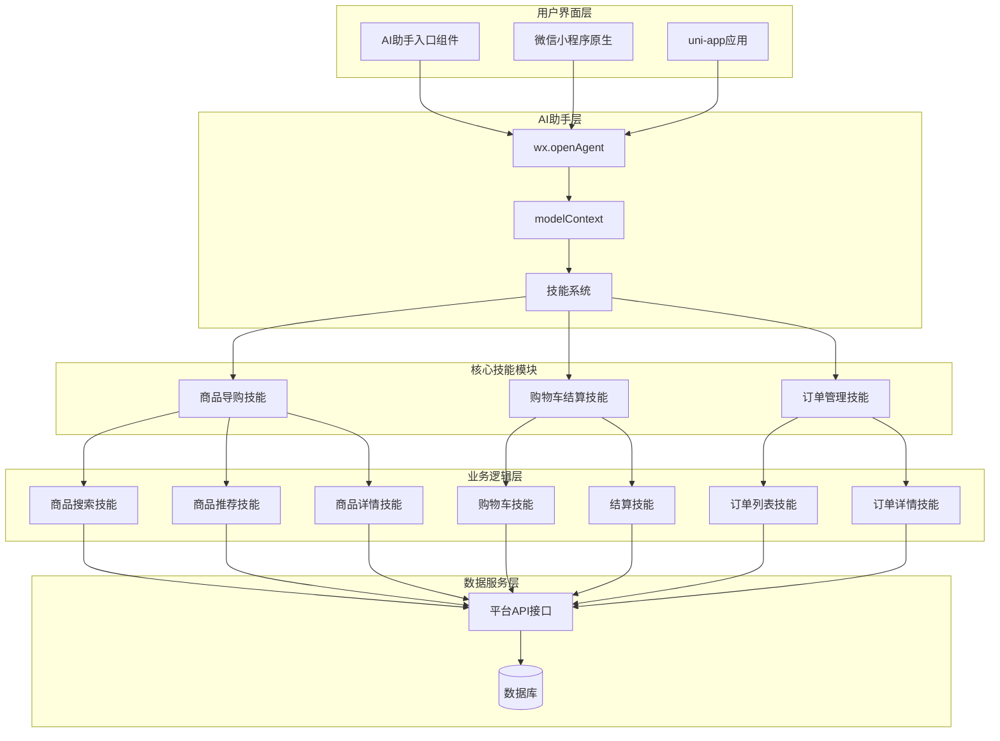

**图表来源**
- [ai-guide-entry.vue:1-120](file://uni-mall/components/ai-guide-entry/ai-guide-entry.vue#L1-L120)
- [index.js:1-11](file://uni-mall/skills/mall-guide-skill/index.js#L1-L11)
- [index.js:1-9](file://uni-mall/skills/mall-checkout-skill/index.js#L1-L9)
- [index.js:1-9](file://uni-mall/skills/mall-order-skill/index.js#L1-L9)

### 技术栈架构

项目采用现代化的技术栈组合：

- **前端框架**：Vue.js + uni-app + 微信小程序原生开发
- **后端服务**：Spring Boot + MyBatis Plus + Undertow
- **数据库**：MySQL 8.0 + Redis缓存
- **构建工具**：Maven + npm + webpack
- **部署环境**：Docker容器化部署

**章节来源**
- [Agents.md:37-49](file://Agents.md#L37-L49)
- [README.md:74-100](file://README.md#L74-L100)

## 核心组件分析

### AI助手入口组件

AI助手入口组件是整个AI集成的核心入口点，提供了统一的交互界面和功能调用接口。

#### 组件属性配置

| 属性名称 | 类型 | 默认值 | 描述 |
|---------|------|--------|------|
| context | String | '' | AI助手上下文信息 |
| text | String | 'AI 助手' | 按钮显示文本 |
| bottom | String | '140rpx' | 距离底部距离 |
| right | String | '20rpx' | 距离右侧距离 |
| left | String | '' | 距离左侧距离 |
| top | String | '' | 距离顶部距离 |
| zIndex | String | '99' | 层级索引 |

#### 组件状态管理

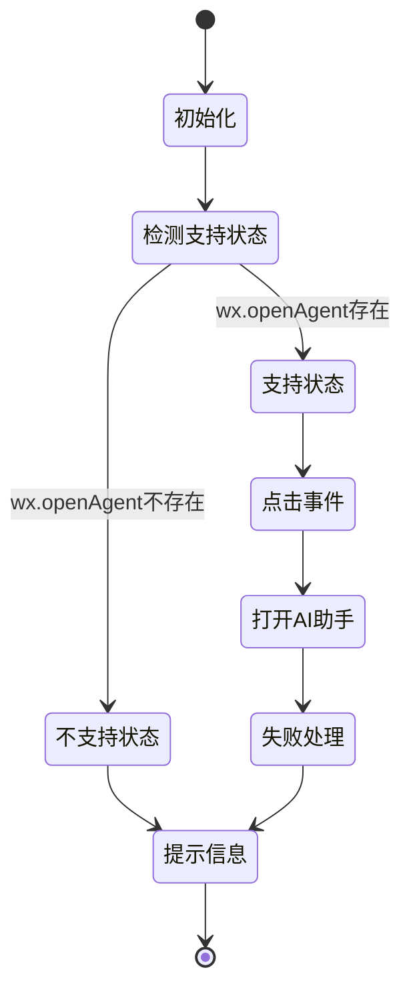

**图表来源**
- [ai-guide-entry.vue:40-95](file://uni-mall/components/ai-guide-entry/ai-guide-entry.vue#L40-L95)

**章节来源**
- [ai-guide-entry.vue:1-120](file://uni-mall/components/ai-guide-entry/ai-guide-entry.vue#L1-L120)

### 支持性检测机制

组件实现了完善的平台兼容性检测，确保在不同环境下提供最佳用户体验。

#### 平台检测逻辑

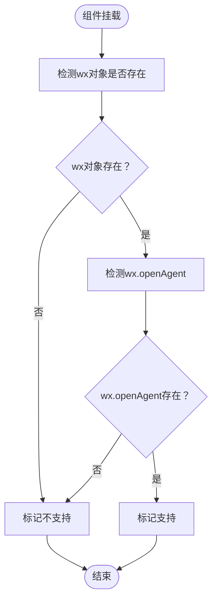

**图表来源**
- [ai-guide-entry.vue:56-61](file://uni-mall/components/ai-guide-entry/ai-guide-entry.vue#L56-L61)

**章节来源**
- [ai-guide-entry.vue:56-92](file://uni-mall/components/ai-guide-entry/ai-guide-entry.vue#L56-L92)

## 技能系统实现

### 技能注册机制

技能系统基于微信的modelContext.createSkill机制，实现了灵活的技能扩展和管理。

#### 技能注册流程

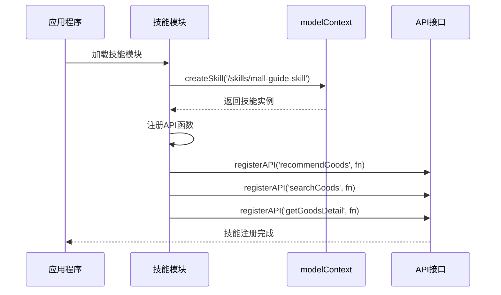

**图表来源**
- [index.js:5-10](file://uni-mall/skills/mall-guide-skill/index.js#L5-L10)

### 商品导购技能

商品导购技能提供了完整的商品搜索、推荐和详情展示功能。

#### 技能功能特性

- **智能推荐**：基于用户偏好和历史行为的个性化推荐
- **精准搜索**：支持关键词搜索和分类筛选
- **详情展示**：提供详细的商品信息和规格选择
- **卡片组件**：丰富的UI组件支持

**章节来源**
- [SKILL.md:1-9](file://uni-mall/skills/mall-guide-skill/SKILL.md#L1-L9)

### 购物车结算技能

购物车结算技能专注于购物车管理和结算预览功能，确保交易安全。

#### 技能功能特性

- **购物车核对**：实时查看购物车商品清单和勾选状态
- **结算预览**：预览收货地址、商品清单、运费、优惠和应付金额
- **安全隔离**：只做只读查询，不执行实际下单操作
- **组件化展示**：提供购物车摘要卡片和订单预览卡片

#### 安全策略

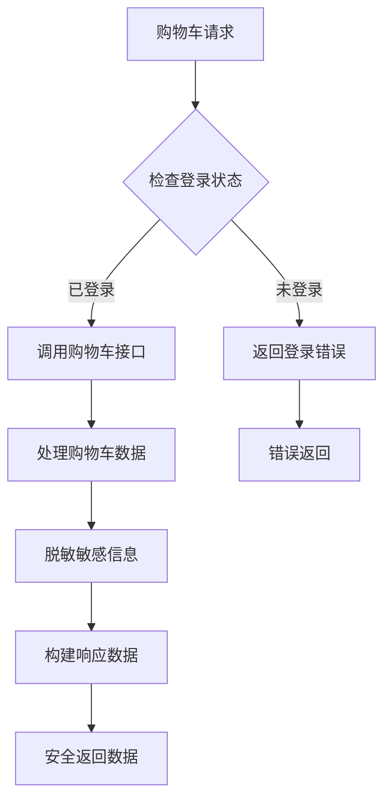

**图表来源**
- [getCartSnapshot.js:5-7](file://uni-mall/skills/mall-checkout-skill/apis/getCartSnapshot.js#L5-L7)

**章节来源**
- [SKILL.md:1-9](file://uni-mall/skills/mall-checkout-skill/SKILL.md#L1-L9)

### 订单管理技能

订单管理技能提供完整的订单查询和详情查看功能。

#### 技能功能特性

- **订单列表**：分页查询用户订单列表
- **订单详情**：查看单个订单的详细信息和操作选项
- **状态管理**：根据订单状态提供相应的操作建议
- **组件化展示**：提供订单列表卡片和订单详情卡片

#### 订单状态处理

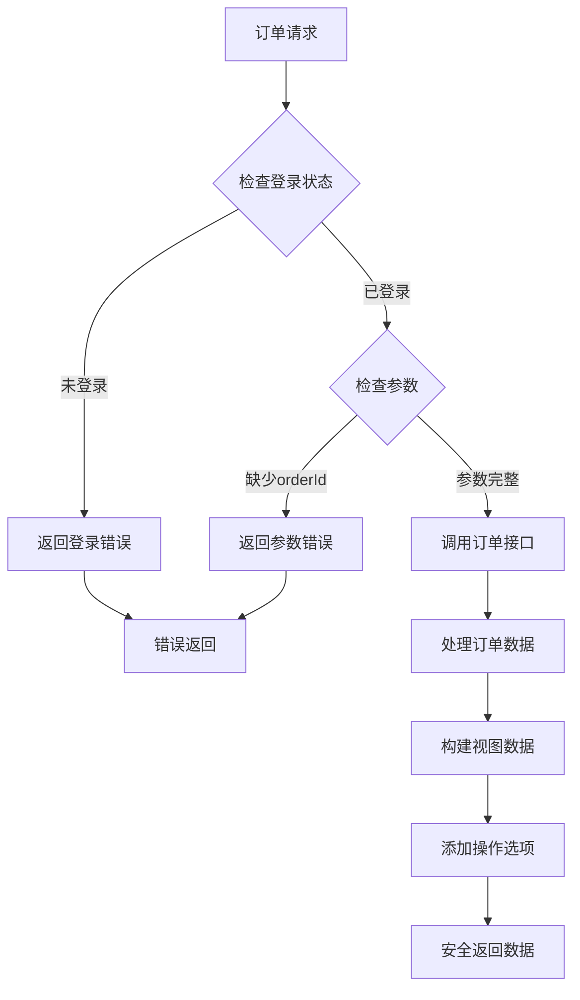

**图表来源**
- [getOrderDetail.js:8-10](file://uni-mall/skills/mall-order-skill/apis/getOrderDetail.js#L8-L10)

**章节来源**
- [SKILL.md:1-8](file://uni-mall/skills/mall-order-skill/SKILL.md#L1-L8)

## API接口设计

### 接口规范

所有技能API都遵循统一的接口规范，确保一致的调用体验和错误处理机制。

#### API调用流程

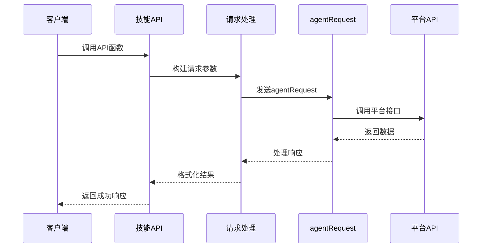

**图表来源**
- [getGoodsDetail.js:1-42](file://uni-mall/skills/mall-guide-skill/apis/getGoodsDetail.js#L1-L42)

### 错误处理机制

系统实现了完善的错误处理机制，确保在各种异常情况下都能提供友好的用户体验。

#### 错误处理流程

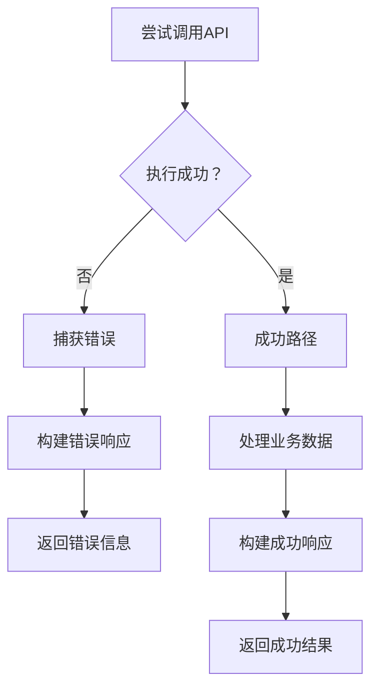

**图表来源**
- [recommendGoods.js:38-41](file://uni-mall/skills/mall-guide-skill/apis/recommendGoods.js#L38-L41)

**章节来源**
- [recommendGoods.js:1-42](file://uni-mall/skills/mall-guide-skill/apis/recommendGoods.js#L1-L42)

## 集成流程详解

### 用户交互流程

AI助手的用户交互流程设计得非常直观和流畅，确保用户能够轻松地获得所需的购物帮助。

#### 完整交互序列

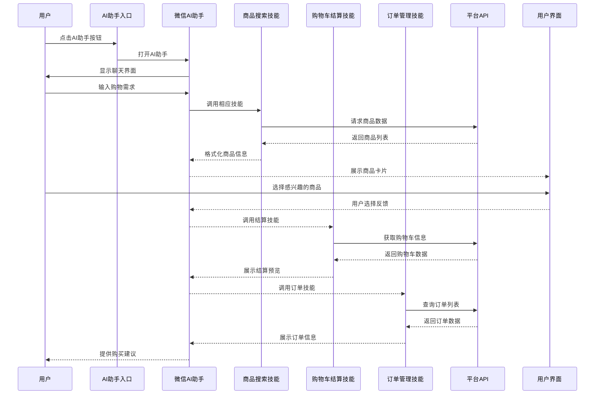

**图表来源**
- [ai-guide-entry.vue:63-92](file://uni-mall/components/ai-guide-entry/ai-guide-entry.vue#L63-L92)

### 上下文管理

系统实现了智能的上下文管理机制，能够在多轮对话中保持用户意图的一致性。

#### 上下文处理流程

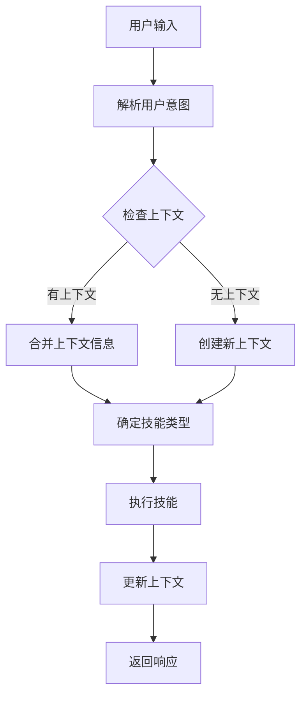

**图表来源**
- [ai-guide-entry.vue:73-82](file://uni-mall/components/ai-guide-entry/ai-guide-entry.vue#L73-L82)

**章节来源**
- [ai-guide-entry.vue:1-120](file://uni-mall/components/ai-guide-entry/ai-guide-entry.vue#L1-L120)

## 技术实现细节

### 组件化UI展示

系统采用组件化设计，每个技能都配有专门的UI组件来展示数据。

#### 购物车组件

购物车摘要卡片组件实现了购物车数据的可视化展示和交互功能。

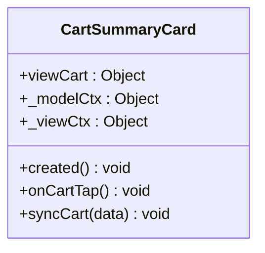

**图表来源**
- [cart-summary-card/index.js:1-33](file://uni-mall/skills/mall-checkout-skill/components/cart-summary-card/index.js#L1-L33)

#### 订单组件

订单列表卡片组件提供了订单数据的列表展示和详情跳转功能。

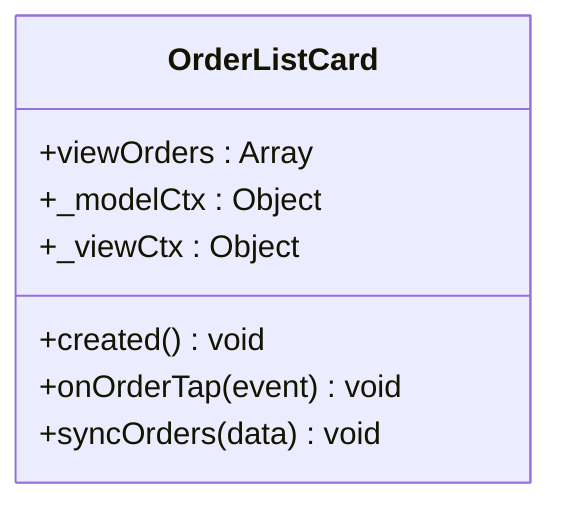

**图表来源**
- [order-list-card/index.js:1-35](file://uni-mall/skills/mall-order-skill/components/order-list-card/index.js#L1-L35)

#### 商品详情组件

商品详情卡片组件展示了商品的详细信息并支持跳转到商品页面。

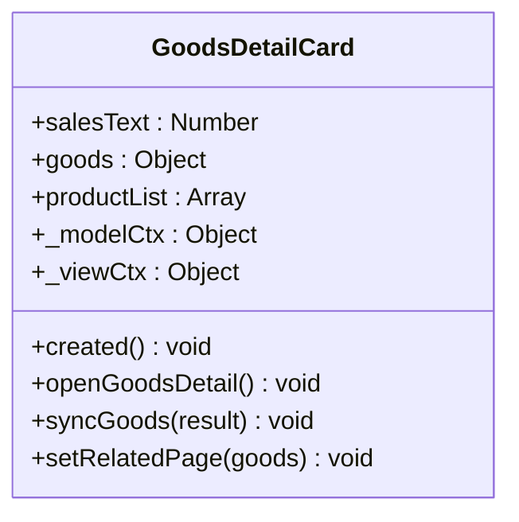

**图表来源**
- [goods-detail-card/index.js:1-56](file://uni-mall/skills/mall-guide-skill/components/goods-detail-card/index.js#L1-L56)

### 性能优化策略

系统采用了多种性能优化策略，确保在高并发场景下仍能提供流畅的用户体验。

#### 缓存策略

- **本地缓存**：商品数据在客户端进行缓存，减少重复请求
- **服务端缓存**：Redis缓存热门商品和搜索结果
- **图片优化**：CDN加速和图片懒加载

#### 异步处理

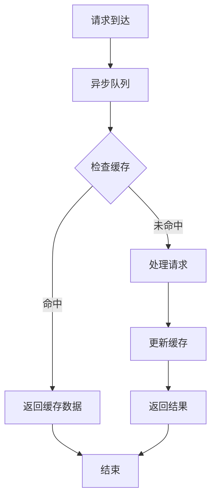

**图表来源**
- [getGoodsDetail.js:14-37](file://uni-mall/skills/mall-guide-skill/apis/getGoodsDetail.js#L14-L37)

### 安全考虑

系统在设计时充分考虑了安全性，包括数据传输加密、用户隐私保护和权限控制。

#### 安全措施

- **HTTPS传输**：所有API请求都通过HTTPS加密
- **参数验证**：严格的输入参数验证和过滤
- **权限控制**：基于角色的访问权限控制
- **敏感信息脱敏**：手机号码和地址信息的脱敏处理
- **操作隔离**：购物车和订单操作的安全隔离设计

**章节来源**
- [Agents.md:126-144](file://Agents.md#L126-L144)

## 性能优化策略

### 前端性能优化

前端采用了多项优化策略来提升用户体验：

- **组件懒加载**：按需加载AI助手组件
- **图片压缩**：商品图片的自动压缩和格式转换
- **虚拟滚动**：大数据量商品列表的虚拟滚动实现
- **防抖处理**：搜索输入的防抖优化

### 后端性能优化

后端服务通过以下方式提升性能：

- **连接池优化**：数据库连接池的合理配置
- **查询优化**：SQL查询的索引优化和执行计划优化
- **缓存策略**：多级缓存架构的设计和实现
- **异步处理**：耗时操作的异步化处理

## 故障排除指南

### 常见问题诊断

#### AI助手无法打开

**问题症状**：点击AI助手按钮无响应或显示不支持

**诊断步骤**：
1. 检查微信版本是否支持AI助手功能（最低8.0.75）
2. 验证wx.openAgent API是否可用
3. 确认小程序基础库版本（最低3.16.1）
4. 检查网络连接状态
5. 确认已在微信公众平台开通AI能力

**解决方案**：
- 提示用户升级微信版本到8.0.75以上
- 确保在微信公众平台正确开通AI能力
- 提供降级处理方案
- 显示友好的错误提示

#### 技能调用失败

**问题症状**：技能调用返回错误或无响应

**诊断步骤**：
1. 检查技能注册状态
2. 验证API接口连通性
3. 查看错误日志
4. 确认参数格式正确
5. 验证微信AI能力灰度内测状态

**解决方案**：
- 重新注册技能
- 检查网络配置
- 实施重试机制
- 提示用户当前处于灰度内测阶段

#### 登录状态问题

**问题症状**：购物车或订单相关功能提示未登录

**诊断步骤**：
1. 检查用户登录状态
2. 验证token有效性
3. 确认用户会话状态

**解决方案**：
- 引导用户进行登录
- 清除无效token
- 提供登录状态检查

### 调试工具使用

系统提供了完善的调试工具和日志记录机制：

- **控制台日志**：详细的API调用日志
- **性能监控**：响应时间和错误率监控
- **用户行为追踪**：用户操作路径记录
- **错误报告**：自动化的错误收集和报告

### 可视化指导

项目提供了完整的微信AI功能可视化指导图片：

- **技能1**：AI助手入口展示
- **技能2**：商品搜索界面
- **技能3**：商品推荐结果
- **技能4**：商品详情展示
- **技能5**：购物车预览
- **技能6**：订单查询界面
- **技能7**：订单详情展示

这些图片帮助开发者更好地理解和实现微信AI助手的各项功能。

**章节来源**
- [ai-guide-entry.vue:63-92](file://uni-mall/components/ai-guide-entry/ai-guide-entry.vue#L63-L92)
- [README.md:169-177](file://README.md#L169-L177)

## 总结与展望

### 项目成果

本AI助手集成项目成功实现了以下目标：

- **完整的AI导购功能**：提供从商品搜索到购买决策的全流程支持
- **多平台兼容性**：同时支持微信小程序原生和uni-app跨平台
- **良好的用户体验**：简洁直观的操作界面和流畅的交互体验
- **可扩展的架构**：基于技能系统的灵活扩展机制
- **全流程覆盖**：从商品浏览到订单管理的完整购物体验
- **微信AI能力集成**：成功接入微信原生AI助手功能

### 技术创新点

- **智能上下文管理**：实现了多轮对话的上下文保持
- **个性化推荐**：基于用户偏好的智能商品推荐
- **响应式设计**：适配不同设备和屏幕尺寸
- **性能优化**：多层缓存和异步处理机制
- **安全隔离**：购物车和订单操作的安全隔离设计
- **灰度内测支持**：完善的灰度内测状态处理机制

### 未来发展方向

1. **AI能力增强**：集成更多AI模型和算法
2. **多语言支持**：扩展国际化支持
3. **数据分析**：增强用户行为分析和洞察
4. **生态集成**：与其他平台和服务的深度集成
5. **语音交互**：支持语音控制和语音播报功能
6. **灰度内测优化**：随着微信AI能力开放逐步完善功能

### 重要提醒

由于微信AI能力目前处于灰度内测状态，项目在使用过程中需要注意：

- **功能限制**：部分功能可能因灰度内测而受限
- **版本要求**：必须满足微信8.0.75及以上版本要求
- **平台要求**：需要在微信公众平台正确开通AI能力
- **开发工具**：开发工具基础库需达到3.16.1及以上版本

该项目为电商行业的智能化转型提供了优秀的参考案例，展现了AI技术在实际业务场景中的巨大价值。随着微信AI能力的不断完善和开放，该项目将具备更大的应用潜力和发展空间。