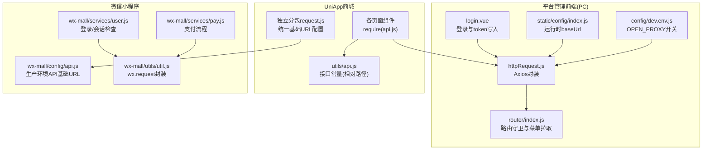
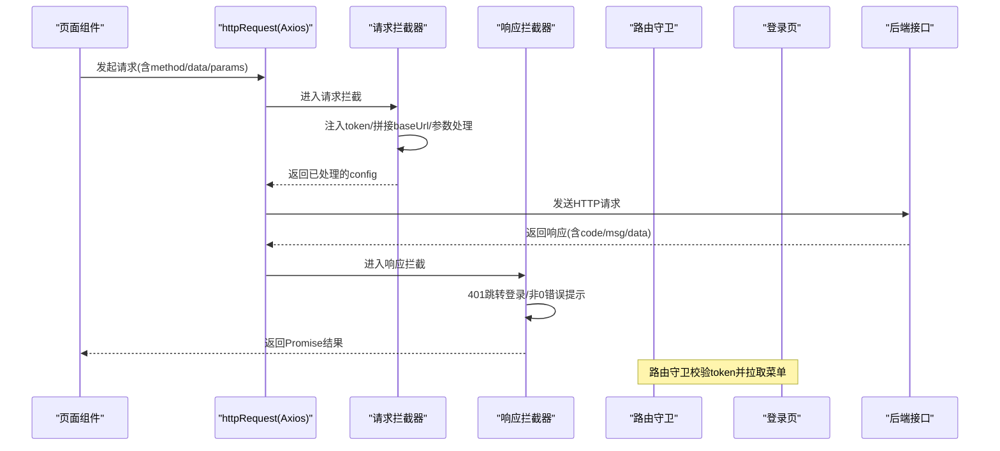
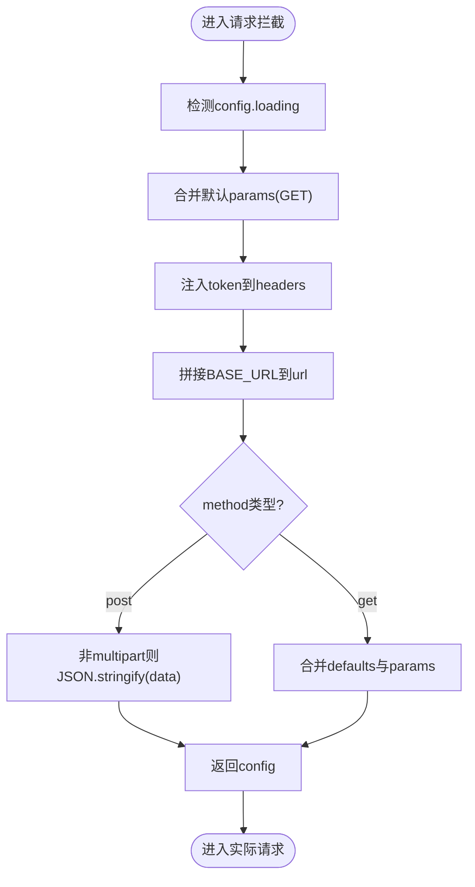
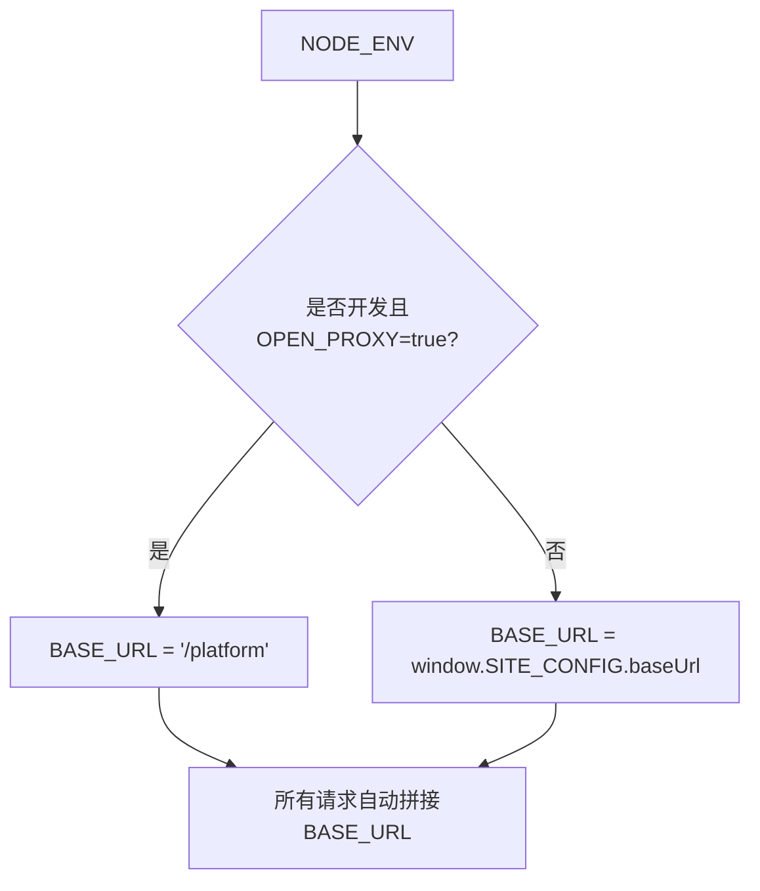
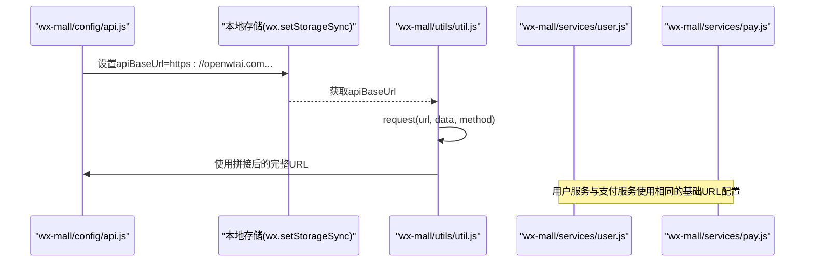
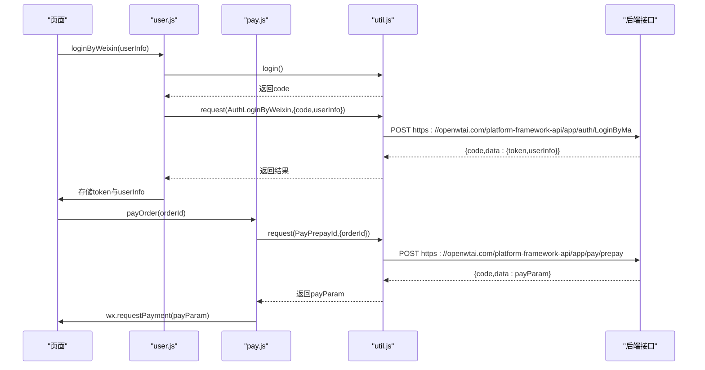
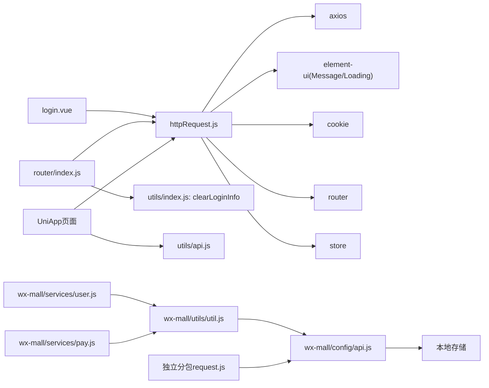

# API接口与网络请求

<cite>
**本文引用的文件**
- [httpRequest.js](file://platform-admin-ui/src/utils/httpRequest.js)
- [index.js](file://platform-admin-ui/src/utils/index.js)
- [index.js](file://platform-admin-ui/static/config/index.js)
- [init.js](file://platform-admin-ui/static/config/init.js)
- [dev.env.js](file://platform-admin-ui/config/dev.env.js)
- [prod.env.js](file://platform-admin-ui/config/prod.env.js)
- [router/index.js](file://platform-admin-ui/src/router/index.js)
- [login.vue](file://platform-admin-ui/src/views/common/login.vue)
- [api.js](file://uni-mall/utils/api.js)
- [util.js](file://wx-mall/utils/util.js)
- [user.js](file://wx-mall/services/user.js)
- [pay.js](file://wx-mall/services/pay.js)
- [api.js](file://wx-mall/config/api.js)
- [request.js](file://uni-mall/skills/mall-guide-skill/apis/request.js)
- [request.js](file://uni-mall/skills/mall-checkout-skill/apis/request.js)
</cite>

## 更新摘要
**所做更改**
- 更新了微信小程序API配置章节，反映wx-mall/config/api.js从本地开发环境切换到生产部署的变更
- 新增了API基础URL配置与域名切换的详细说明
- 补充了UniApp独立分包请求工具的域名配置机制
- 更新了环境变量与域名切换的架构图和流程图

## 目录
1. [简介](#简介)
2. [项目结构](#项目结构)
3. [核心组件](#核心组件)
4. [架构总览](#架构总览)
5. [详细组件分析](#详细组件分析)
6. [依赖关系分析](#依赖关系分析)
7. [性能考量](#性能考量)
8. [故障排查指南](#故障排查指南)
9. [结论](#结论)
10. [附录](#附录)

## 简介
本文件面向UniApp生态中的API接口与网络请求，系统性梳理HTTP请求封装、API接口管理、数据交互模式、环境变量与域名切换、请求参数与响应处理、错误与鉴权机制、以及在小程序端的请求适配与支付流程。文档同时给出架构图、序列图与流程图，帮助开发者快速掌握从请求发起、拦截处理、鉴权与错误提示，到接口配置与调试的完整闭环。

**更新** 本次更新重点关注微信小程序端API配置的重要基础设施改进，从本地开发环境切换到生产部署的https://openwtai.com平台连接。

## 项目结构
本仓库包含多端前端工程：平台管理前端（PC）、UniApp商城、微信小程序商城。网络请求相关的关键位置如下：
- 平台管理前端（PC）：基于Vue + Element UI，使用Axios进行HTTP请求封装，支持请求/响应拦截、全局超时与Cookie携带、环境变量控制代理与域名切换。
- UniApp商城：以模块化API常量集中管理接口路径，页面组件通过通用工具发起请求，独立分包使用统一的基础URL配置。
- 微信小程序商城：提供原生wx.request封装与服务层调用，配合本地存储token与会话检查，采用生产环境API基础URL配置。

**图表来源**
- [httpRequest.js:1-97](file://platform-admin-ui/src/utils/httpRequest.js#L1-L97)
- [router/index.js:1-203](file://platform-admin-ui/src/router/index.js#L1-L203)
- [login.vue:1-210](file://platform-admin-ui/src/views/common/login.vue#L1-L210)
- [index.js:1-15](file://platform-admin-ui/static/config/index.js#L1-L15)
- [dev.env.js:1-9](file://platform-admin-ui/config/dev.env.js#L1-L9)
- [api.js:1-81](file://uni-mall/utils/api.js#L1-L81)
- [util.js:1-132](file://wx-mall/utils/util.js#L1-L132)
- [user.js:1-74](file://wx-mall/services/user.js#L1-L74)
- [pay.js:1-44](file://wx-mall/services/pay.js#L1-L44)
- [api.js:1-84](file://wx-mall/config/api.js#L1-L84)
- [request.js:1-56](file://uni-mall/skills/mall-guide-skill/apis/request.js#L1-L56)

**章节来源**
- [httpRequest.js:1-97](file://platform-admin-ui/src/utils/httpRequest.js#L1-L97)
- [index.js:1-15](file://platform-admin-ui/static/config/index.js#L1-L15)
- [dev.env.js:1-9](file://platform-admin-ui/config/dev.env.js#L1-L9)
- [api.js:1-81](file://uni-mall/utils/api.js#L1-L81)
- [util.js:1-132](file://wx-mall/utils/util.js#L1-L132)
- [user.js:1-74](file://wx-mall/services/user.js#L1-L74)
- [pay.js:1-44](file://wx-mall/services/pay.js#L1-L44)
- [api.js:1-84](file://wx-mall/config/api.js#L1-L84)
- [request.js:1-56](file://uni-mall/skills/mall-guide-skill/apis/request.js#L1-L56)

## 核心组件
- Axios封装与拦截器（平台管理前端）
  - 默认超时、跨域Cookie、Content-Type统一设置
  - 请求拦截：自动注入token、拼接BASE_URL、GET参数合并、POST JSON序列化（非multipart）
  - 响应拦截：401清空登录信息并跳转登录；非0返回统一错误提示；网络异常统一提示
  - 基础路径BASE_URL由运行时配置与构建环境共同决定
- 登录与会话管理
  - 登录成功写入cookie token，路由守卫校验token并拉取动态菜单
  - 统一清理：清除cookie、重置Vuex、重置动态路由标记
- 接口常量与页面调用（UniApp）
  - 以模块化常量集中定义接口路径，页面组件按需引入并调用
  - 独立分包使用统一的基础URL配置，确保与主包配置一致
- 小程序请求封装与服务层
  - 封装wx.request，统一header携带token、状态码与业务码处理
  - 用户服务：登录、会话检查；支付服务：统一下单与微信支付调用
  - **更新** 采用生产环境API基础URL配置，确保与后端服务一致

**章节来源**
- [httpRequest.js:11-94](file://platform-admin-ui/src/utils/httpRequest.js#L11-L94)
- [index.js:168-172](file://platform-admin-ui/src/utils/index.js#L168-L172)
- [router/index.js:73-80](file://platform-admin-ui/src/router/index.js#L73-L80)
- [login.vue:96-112](file://platform-admin-ui/src/views/common/login.vue#L96-L112)
- [api.js:1-81](file://uni-mall/utils/api.js#L1-L81)
- [util.js:23-57](file://wx-mall/utils/util.js#L23-L57)
- [user.js:11-38](file://wx-mall/services/user.js#L11-L38)
- [pay.js:11-39](file://wx-mall/services/pay.js#L11-L39)
- [api.js:1-84](file://wx-mall/config/api.js#L1-L84)

## 架构总览
下图展示了从页面到后端的整体请求链路，包括请求拦截、鉴权、错误处理与环境切换。

**图表来源**
- [httpRequest.js:24-94](file://platform-admin-ui/src/utils/httpRequest.js#L24-L94)
- [router/index.js:91-127](file://platform-admin-ui/src/router/index.js#L91-L127)
- [login.vue:96-112](file://platform-admin-ui/src/views/common/login.vue#L96-L112)

## 详细组件分析

### 平台管理前端：httpRequest封装与拦截器
- 关键点
  - 默认超时、withCredentials、Content-Type统一
  - BASE_URL动态来源：开发且开启代理时使用"/platform"前缀；否则使用window.SITE_CONFIG.baseUrl
  - 请求拦截：根据method处理params与data；自动注入token；统一拼接baseUrl
  - 响应拦截：401清登出并跳转登录；非0统一错误提示；网络异常统一提示
  - 可选关闭loading与错误提示，便于批量请求或特殊场景
- 使用建议
  - 在页面/服务层直接调用默认导出的axios实例
  - 对于上传等multipart场景，避免自动JSON序列化，保持FormData
  - 对GET请求使用params传参，POST使用data传参

**图表来源**
- [httpRequest.js:24-58](file://platform-admin-ui/src/utils/httpRequest.js#L24-L58)

**章节来源**
- [httpRequest.js:11-94](file://platform-admin-ui/src/utils/httpRequest.js#L11-L94)

### 环境变量与域名切换
- 运行时配置
  - window.SITE_CONFIG.baseUrl用于设置后端基础域名
  - static/config/init.js负责动态加载静态资源，确保页面渲染顺序
- 构建环境
  - dev.env.js中OPEN_PROXY控制是否启用代理前缀"/platform"
  - 生产环境默认不使用代理，直接走window.SITE_CONFIG.baseUrl
- 实践建议
  - 开发阶段如需代理，确保后端Nginx或代理规则匹配"/platform"前缀
  - 不同环境（测试/预发布/生产）通过构建脚本注入不同NODE_ENV与环境变量

**图表来源**
- [httpRequest.js:16-19](file://platform-admin-ui/src/utils/httpRequest.js#L16-L19)
- [index.js:7-8](file://platform-admin-ui/static/config/index.js#L7-L8)
- [dev.env.js:5-8](file://platform-admin-ui/config/dev.env.js#L5-L8)

**章节来源**
- [index.js:1-15](file://platform-admin-ui/static/config/index.js#L1-L15)
- [init.js:1-70](file://platform-admin-ui/static/config/init.js#L1-L70)
- [dev.env.js:1-9](file://platform-admin-ui/config/dev.env.js#L1-L9)
- [prod.env.js:1-5](file://platform-admin-ui/config/prod.env.js#L1-L5)

### 微信小程序API配置与域名切换
- **更新** 生产环境API基础URL配置
  - wx-mall/config/api.js现使用生产环境URL：https://openwtai.com/platform-framework-api/app/
  - 通过wx.setStorageSync('apiBaseUrl', API_BASE_URL)将基础URL存储到本地缓存
  - 所有接口常量基于统一的API_BASE_URL进行拼接
- UniApp独立分包的域名配置
  - uni-mall/skills/mall-guide-skill/apis/request.js使用相同的域名配置机制
  - 通过wx.getStorageSync('apiBaseUrl')获取存储的基础URL
  - 确保主包与独立分包的域名配置一致性
- 登录与路由守卫
  - 登录流程
    - 登录页提交用户名/密码/验证码，成功后写入cookie token
    - 路由守卫读取token，缺失则清空登录信息并跳转登录
  - 动态菜单
    - 首次进入时拉取菜单与权限，写入sessionStorage并注入动态路由
  - 清理逻辑
    - 统一调用clearLoginInfo：删除token cookie、重置store、重置动态路由标记

**图表来源**
- [api.js:1-84](file://wx-mall/config/api.js#L1-L84)
- [util.js:23-57](file://wx-mall/utils/util.js#L23-L57)
- [user.js:11-38](file://wx-mall/services/user.js#L11-L38)
- [pay.js:11-39](file://wx-mall/services/pay.js#L11-L39)
- [request.js:1-56](file://uni-mall/skills/mall-guide-skill/apis/request.js#L1-L56)

**章节来源**
- [api.js:1-84](file://wx-mall/config/api.js#L1-L84)
- [util.js:1-132](file://wx-mall/utils/util.js#L1-L132)
- [user.js:1-74](file://wx-mall/services/user.js#L1-L74)
- [pay.js:1-44](file://wx-mall/services/pay.js#L1-L44)
- [request.js:1-56](file://uni-mall/skills/mall-guide-skill/apis/request.js#L1-L56)
- [request.js:1-51](file://uni-mall/skills/mall-checkout-skill/apis/request.js#L1-L51)

### UniApp商城：接口常量与页面调用
- 接口常量
  - 以模块化对象集中维护接口路径，便于统一管理与替换
  - **更新** UniApp使用相对路径配置，独立分包通过基础URL进行统一拼接
- 页面调用
  - 页面组件require api.js，按需调用httpRequest发起请求
  - 独立分包使用agentRequest工具，基于统一的基础URL配置
  - 适合在页面内直接使用，也可抽象为服务层进一步复用

**章节来源**
- [api.js:1-81](file://uni-mall/utils/api.js#L1-L81)
- [request.js:1-56](file://uni-mall/skills/mall-guide-skill/apis/request.js#L1-L56)
- [request.js:1-51](file://uni-mall/skills/mall-checkout-skill/apis/request.js#L1-L51)

### 微信小程序：请求封装与服务层
- 请求封装
  - 封装wx.request，统一显示loading、注入token、处理200与业务code
  - 401跳转授权页；其他错误统一toast提示
  - **更新** 使用生产环境API基础URL，确保与后端服务一致
- 用户服务
  - 登录：先wx.login获取code，再调用登录接口，成功后存储userInfo与token
  - 会话检查：checkSession判断登录态有效性
- 支付服务
  - 统一下单获取payParam，调用微信支付wx.requestPayment

**图表来源**
- [user.js:11-38](file://wx-mall/services/user.js#L11-L38)
- [pay.js:11-39](file://wx-mall/services/pay.js#L11-L39)
- [util.js:23-57](file://wx-mall/utils/util.js#L23-L57)
- [api.js:17](file://wx-mall/config/api.js#L17)

**章节来源**
- [util.js:1-132](file://wx-mall/utils/util.js#L1-L132)
- [user.js:1-74](file://wx-mall/services/user.js#L1-L74)
- [pay.js:1-44](file://wx-mall/services/pay.js#L1-L44)

## 依赖关系分析
- 平台管理前端
  - httpRequest依赖axios、element-ui的Message/Loading、cookie、router、store
  - 路由守卫依赖httpRequest与clearLoginInfo
- UniApp与小程序
  - 页面组件依赖api常量与httpRequest或util封装
  - 小程序服务层依赖util与api常量
  - **更新** 小程序端通过本地存储统一管理API基础URL，确保配置一致性

**图表来源**
- [httpRequest.js:1-10](file://platform-admin-ui/src/utils/httpRequest.js#L1-L10)
- [router/index.js:9-11](file://platform-admin-ui/src/router/index.js#L9-L11)
- [login.vue:105-108](file://platform-admin-ui/src/views/common/login.vue#L105-L108)
- [index.js:168-172](file://platform-admin-ui/src/utils/index.js#L168-L172)
- [api.js:1-81](file://uni-mall/utils/api.js#L1-L81)
- [util.js:1-2](file://wx-mall/utils/util.js#L1-L2)
- [api.js:1-84](file://wx-mall/config/api.js#L1-L84)
- [request.js:1-56](file://uni-mall/skills/mall-guide-skill/apis/request.js#L1-L56)

**章节来源**
- [httpRequest.js:1-10](file://platform-admin-ui/src/utils/httpRequest.js#L1-L10)
- [router/index.js:1-203](file://platform-admin-ui/src/router/index.js#L1-L203)
- [login.vue:1-210](file://platform-admin-ui/src/views/common/login.vue#L1-L210)
- [index.js:168-172](file://platform-admin-ui/src/utils/index.js#L168-L172)
- [api.js:1-81](file://uni-mall/utils/api.js#L1-L81)
- [util.js:1-132](file://wx-mall/utils/util.js#L1-L132)
- [api.js:1-84](file://wx-mall/config/api.js#L1-L84)
- [request.js:1-56](file://uni-mall/skills/mall-guide-skill/apis/request.js#L1-L56)

## 性能考量
- 请求批量化
  - 对于多个无loading与错误提示的请求，可设置config.loading=false与config.showError=false减少UI抖动与重复提示
- 参数合并
  - GET请求使用params合并默认参数，避免重复拼接字符串
- 序列化策略
  - POST非multipart时自动JSON.stringify，注意大对象传输的体积与后端解析成本
- 超时与重试
  - 默认超时30秒，可根据接口特性调整；对弱网场景可增加重试策略（建议在上层封装）
- 缓存与本地存储
  - 登录态与菜单/权限等一次性数据可放入sessionStorage；频繁读取的字典/组织/用户列表可缓存于内存，避免重复IO
  - **更新** 小程序端通过wx.setStorageSync统一管理API基础URL，减少重复配置
- 资源加载
  - 静态资源按需加载与渐进呈现，提升首屏体验

## 故障排查指南
- 401未登录/登录过期
  - 响应拦截器会清空登录信息并跳转登录；检查cookie token是否存在与有效
- 网络异常
  - 响应拦截器统一提示"网络异常，请稍后重试"，检查代理配置与网络连通性
- 接口路径错误
  - 确认BASE_URL与接口前缀一致；开发环境OPEN_PROXY为true时，请求路径需以"/platform"开头
- 参数传递问题
  - GET使用params，POST使用data；multipart上传需避免自动JSON序列化
- 小程序登录态
  - 使用checkSession判断登录态；若失效，引导重新登录并刷新token
- **更新** API基础URL配置问题
  - 检查wx-mall/config/api.js中的API_BASE_URL是否正确指向https://openwtai.com
  - 验证wx.setStorageSync('apiBaseUrl')是否正确存储基础URL
  - 确认UniApp独立分包是否正确获取基础URL：wx.getStorageSync('apiBaseUrl')

**章节来源**
- [httpRequest.js:66-94](file://platform-admin-ui/src/utils/httpRequest.js#L66-L94)
- [router/index.js:73-80](file://platform-admin-ui/src/router/index.js#L73-L80)
- [util.js:62-73](file://wx-mall/utils/util.js#L62-L73)
- [api.js:1-84](file://wx-mall/config/api.js#L1-L84)

## 结论
本项目在网络请求层面提供了清晰的封装与规范：Axios拦截器统一处理鉴权与错误、环境变量与运行时配置灵活切换域名、路由守卫保障登录态、UniApp与小程序分别以常量与封装形式对接接口。**更新** 微信小程序端已完成从本地开发环境到生产部署的重要基础设施升级，采用https://openwtai.com平台连接，确保了前后端服务的一致性和稳定性。遵循本文档的最佳实践与调试方法，可在保证一致性的同时提升开发效率与用户体验。

## 附录
- 最佳实践清单
  - 统一使用httpRequest或util封装发起请求
  - 明确区分GET/POST参数传递方式
  - 对敏感操作开启loading与错误提示，对批量请求可关闭
  - 登录成功后立即写入token，路由守卫统一校验
  - 多环境通过NODE_ENV与OPEN_PROXY控制BASE_URL与代理
  - 小程序端使用checkSession定期校验登录态
  - **更新** 确保API基础URL配置正确，生产环境使用https://openwtai.com
  - **更新** UniApp独立分包与主包使用统一的基础URL配置机制
- 安全注意事项
  - 密码在前端加密后再传输，避免明文泄露
  - 仅在可信域名下发token，避免跨域风险
  - 对外暴露的接口需在后端做好鉴权与限流
  - **更新** 生产环境使用HTTPS协议，确保数据传输安全