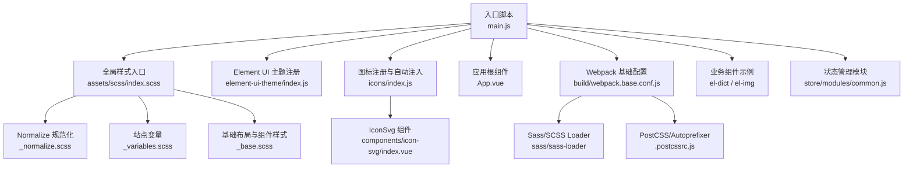
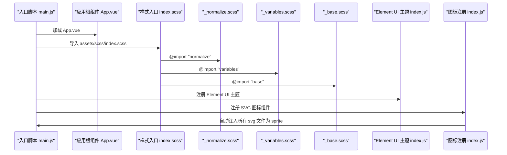
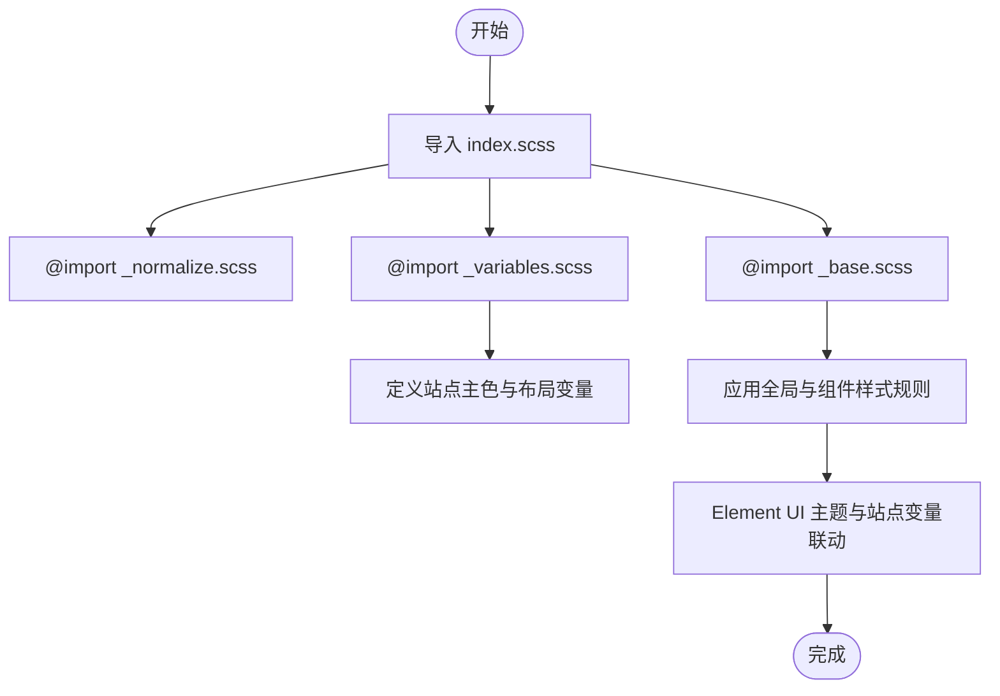
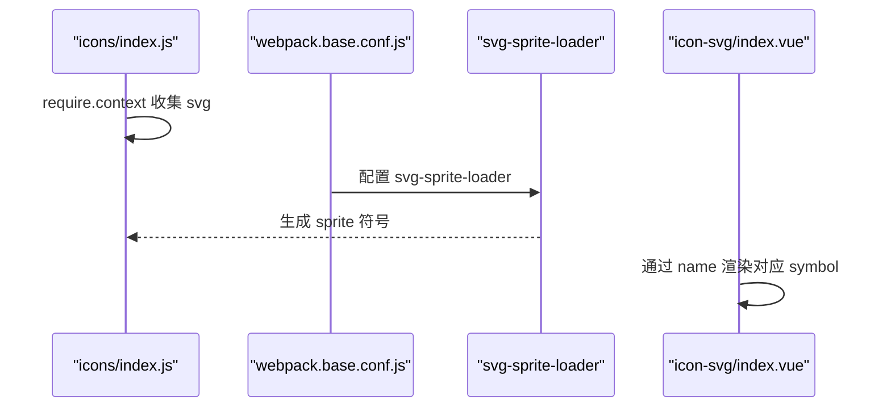
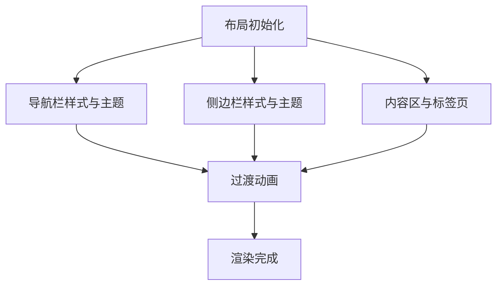
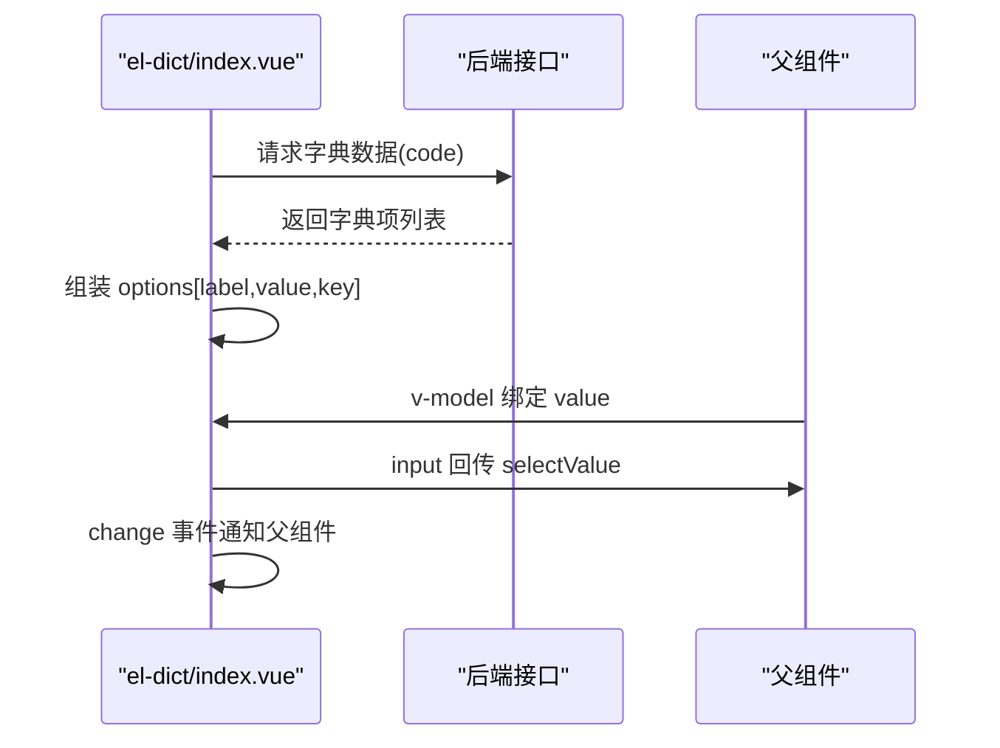
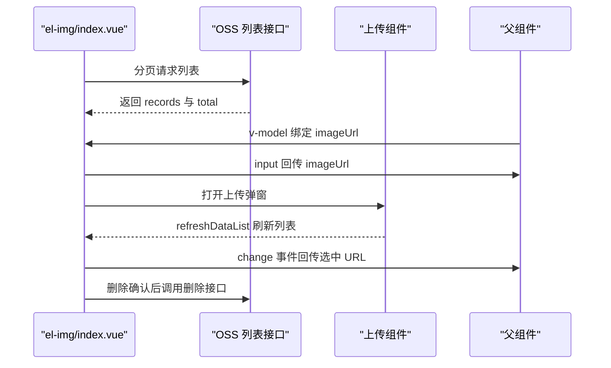
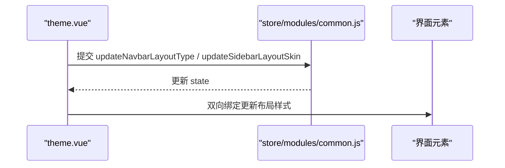
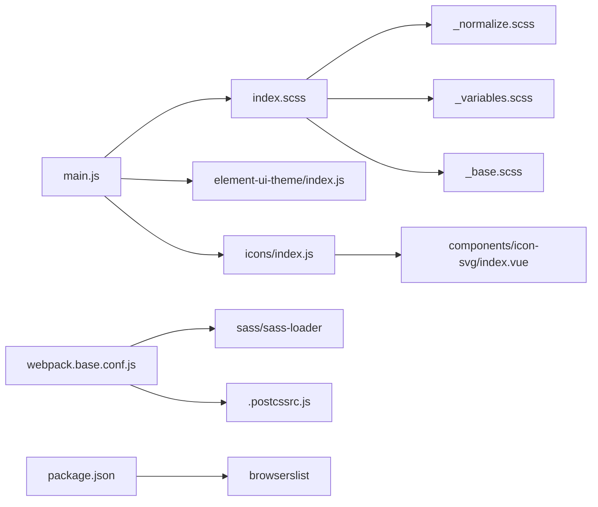

# UI组件库与样式系统

<cite>
**本文档引用的文件**
- [index.scss](file://platform-admin-ui/src/assets/scss/index.scss)
- [_variables.scss](file://platform-admin-ui/src/assets/scss/_variables.scss)
- [_base.scss](file://platform-admin-ui/src/assets/scss/_base.scss)
- [_normalize.scss](file://platform-admin-ui/src/assets/scss/_normalize.scss)
- [index.js（Element UI 主题）](file://platform-admin-ui/src/element-ui-theme/index.js)
- [index.js（图标注册）](file://platform-admin-ui/src/icons/index.js)
- [icon-svg/index.vue](file://platform-admin-ui/src/components/icon-svg/index.vue)
- [theme.vue](file://platform-admin-ui/src/views/common/theme.vue)
- [.postcssrc.js](file://platform-admin-ui/.postcssrc.js)
- [main.js](file://platform-admin-ui/src/main.js)
- [App.vue](file://platform-admin-ui/src/App.vue)
- [webpack.base.conf.js](file://platform-admin-ui/build/webpack.base.conf.js)
- [el-dict/index.vue](file://platform-admin-ui/src/components/el-dict/index.vue)
- [el-img/index.vue](file://platform-admin-ui/src/components/el-img/index.vue)
- [common.js（Vuex 模块）](file://platform-admin-ui/src/store/modules/common.js)
- [index.js（工具函数）](file://platform-admin-ui/src/utils/index.js)
- [package.json](file://platform-admin-ui/package.json)
</cite>

## 目录
1. [引言](#引言)
2. [项目结构](#项目结构)
3. [核心组件](#核心组件)
4. [架构总览](#架构总览)
5. [详细组件分析](#详细组件分析)
6. [依赖关系分析](#依赖关系分析)
7. [性能考虑](#性能考虑)
8. [故障排查指南](#故障排查指南)
9. [结论](#结论)
10. [附录](#附录)

## 引言
本文件面向使用 UniApp 的前端开发者，系统梳理平台管理端 UI 组件库与样式体系的设计与实现，涵盖以下要点：
- 全局样式组织：Normalize、变量、基础布局与动画
- SCSS 预处理器与构建链路：Sass、Autoprefixer、PostCSS
- 主题定制：站点主色与 Element UI 主题切换
- 图标系统：SVG Sprite 与可复用 IconSvg 组件
- 布局与交互：导航栏、侧边栏、内容区、标签页与过渡动画
- 组件化实践：通用业务组件（字典选择器、图片选择器）
- 性能与兼容：打包策略、按需加载、浏览器兼容范围
- 可视化与可维护性：模块化样式、组件职责清晰、状态集中管理

## 项目结构
平台管理端采用 Vue 2 + Element UI + SCSS 的技术栈，样式资源集中在 assets/scss 下，通过入口样式统一导入；图标系统通过 svg-sprite-loader 打包并以组件形式复用；主题通过 Element UI 主题包与站点变量联动。

图表来源
- [main.js:1-80](file://platform-admin-ui/src/main.js#L1-L80)
- [index.scss:1-6](file://platform-admin-ui/src/assets/scss/index.scss#L1-L6)
- [_normalize.scss:1-448](file://platform-admin-ui/src/assets/scss/_normalize.scss#L1-L448)
- [_variables.scss:1-14](file://platform-admin-ui/src/assets/scss/_variables.scss#L1-L14)
- [_base.scss:1-455](file://platform-admin-ui/src/assets/scss/_base.scss#L1-L455)
- [index.js（Element UI 主题）:1-41](file://platform-admin-ui/src/element-ui-theme/index.js#L1-L41)
- [index.js（图标注册）:1-15](file://platform-admin-ui/src/icons/index.js#L1-L15)
- [icon-svg/index.vue:1-52](file://platform-admin-ui/src/components/icon-svg/index.vue#L1-L52)
- [webpack.base.conf.js:1-107](file://platform-admin-ui/build/webpack.base.conf.js#L1-L107)
- [.postcssrc.js:1-10](file://platform-admin-ui/.postcssrc.js#L1-L10)

章节来源
- [main.js:1-80](file://platform-admin-ui/src/main.js#L1-L80)
- [index.scss:1-6](file://platform-admin-ui/src/assets/scss/index.scss#L1-L6)
- [_variables.scss:1-14](file://platform-admin-ui/src/assets/scss/_variables.scss#L1-L14)
- [_base.scss:1-455](file://platform-admin-ui/src/assets/scss/_base.scss#L1-L455)
- [_normalize.scss:1-448](file://platform-admin-ui/src/assets/scss/_normalize.scss#L1-L448)
- [index.js（Element UI 主题）:1-41](file://platform-admin-ui/src/element-ui-theme/index.js#L1-L41)
- [index.js（图标注册）:1-15](file://platform-admin-ui/src/icons/index.js#L1-L15)
- [icon-svg/index.vue:1-52](file://platform-admin-ui/src/components/icon-svg/index.vue#L1-L52)
- [webpack.base.conf.js:1-107](file://platform-admin-ui/build/webpack.base.conf.js#L1-L107)
- [.postcssrc.js:1-10](file://platform-admin-ui/.postcssrc.js#L1-L10)

## 核心组件
- IconSvg：基于 SVG Sprite 的图标组件，支持动态 name、尺寸与类名扩展
- el-dict：基于 Element Select 的数据字典选择器，远程加载选项并支持 v-model
- el-img：图片选择器，内嵌 OSS 列表、分页、上传与删除能力，支持 v-model
- theme.vue：布局设置弹窗，控制导航条类型与侧边栏皮肤，通过 Vuex 同步状态

章节来源
- [icon-svg/index.vue:1-52](file://platform-admin-ui/src/components/icon-svg/index.vue#L1-L52)
- [el-dict/index.vue:1-75](file://platform-admin-ui/src/components/el-dict/index.vue#L1-L75)
- [el-img/index.vue:1-166](file://platform-admin-ui/src/components/el-img/index.vue#L1-L166)
- [theme.vue:1-58](file://platform-admin-ui/src/views/common/theme.vue#L1-L58)

## 架构总览
从入口到样式与主题的加载链路如下：

图表来源
- [main.js:1-80](file://platform-admin-ui/src/main.js#L1-L80)
- [index.scss:1-6](file://platform-admin-ui/src/assets/scss/index.scss#L1-L6)
- [_normalize.scss:1-448](file://platform-admin-ui/src/assets/scss/_normalize.scss#L1-L448)
- [_variables.scss:1-14](file://platform-admin-ui/src/assets/scss/_variables.scss#L1-L14)
- [_base.scss:1-455](file://platform-admin-ui/src/assets/scss/_base.scss#L1-L455)
- [index.js（Element UI 主题）:1-41](file://platform-admin-ui/src/element-ui-theme/index.js#L1-L41)
- [index.js（图标注册）:1-15](file://platform-admin-ui/src/icons/index.js#L1-L15)

## 详细组件分析

### SCSS 样式系统与主题定制
- 样式入口：index.scss 依次引入 Normalize、站点变量与基础样式，形成“规范化 → 变量 → 基础布局”的层次化结构
- 站点变量：集中定义主色、导航栏背景、侧边栏深色背景与文本色、内容区背景等，便于整站主题切换
- 基础样式：包含全局排版、动画、布局容器、导航栏、侧边栏、内容区、表格展开行等规则
- 主题联动：Element UI 主题通过 index.js 动态导入不同色系主题包，要求与站点主色变量保持一致，确保整体视觉一致

图表来源
- [index.scss:1-6](file://platform-admin-ui/src/assets/scss/index.scss#L1-L6)
- [_variables.scss:1-14](file://platform-admin-ui/src/assets/scss/_variables.scss#L1-L14)
- [_base.scss:1-455](file://platform-admin-ui/src/assets/scss/_base.scss#L1-L455)
- [index.js（Element UI 主题）:1-41](file://platform-admin-ui/src/element-ui-theme/index.js#L1-L41)

章节来源
- [index.scss:1-6](file://platform-admin-ui/src/assets/scss/index.scss#L1-L6)
- [_variables.scss:1-14](file://platform-admin-ui/src/assets/scss/_variables.scss#L1-L14)
- [_base.scss:1-455](file://platform-admin-ui/src/assets/scss/_base.scss#L1-L455)
- [index.js（Element UI 主题）:1-41](file://platform-admin-ui/src/element-ui-theme/index.js#L1-L41)

### 图标系统与 SVG Sprite
- 图标注册：通过 require.context 收集 src/icons/svg 下的所有 SVG 文件，并导出名称列表
- 组件封装：IconSvg 使用 use xlink 引用 sprite 中的图标符号，支持 name、className、宽高属性
- 构建集成：webpack 将 SVG 交由 svg-sprite-loader 处理，生成 sprite 并在运行时按需引用

图表来源
- [index.js（图标注册）:1-15](file://platform-admin-ui/src/icons/index.js#L1-L15)
- [icon-svg/index.vue:1-52](file://platform-admin-ui/src/components/icon-svg/index.vue#L1-L52)
- [webpack.base.conf.js:61-64](file://platform-admin-ui/build/webpack.base.conf.js#L61-L64)

章节来源
- [index.js（图标注册）:1-15](file://platform-admin-ui/src/icons/index.js#L1-L15)
- [icon-svg/index.vue:1-52](file://platform-admin-ui/src/components/icon-svg/index.vue#L1-L52)
- [webpack.base.conf.js:61-64](file://platform-admin-ui/build/webpack.base.conf.js#L61-L64)

### 布局与交互组件
- 导航栏与侧边栏：固定定位、阴影、折叠动画、菜单图标与颜色随主题变化
- 内容区与标签页：固定头部、阴影、工具按钮、滚动与最小宽度约束
- 过渡动画：全局淡入淡出过渡，提升页面切换体验

图表来源
- [_base.scss:129-277](file://platform-admin-ui/src/assets/scss/_base.scss#L129-L277)
- [_base.scss:279-358](file://platform-admin-ui/src/assets/scss/_base.scss#L279-L358)
- [_base.scss:388-447](file://platform-admin-ui/src/assets/scss/_base.scss#L388-L447)
- [_base.scss:84-94](file://platform-admin-ui/src/assets/scss/_base.scss#L84-L94)

章节来源
- [_base.scss:129-277](file://platform-admin-ui/src/assets/scss/_base.scss#L129-L277)
- [_base.scss:279-358](file://platform-admin-ui/src/assets/scss/_base.scss#L279-L358)
- [_base.scss:388-447](file://platform-admin-ui/src/assets/scss/_base.scss#L388-L447)
- [_base.scss:84-94](file://platform-admin-ui/src/assets/scss/_base.scss#L84-L94)

### 业务组件：字典选择器（el-dict）
- 功能：根据传入的字典编码远程加载选项，支持清空、禁用、占位与 v-model
- 数据流：mounted 时请求接口，组装为 label/value/key 结构注入 Select；watch 同步外部 value 与内部 selectValue，并通过 input 事件回传

图表来源
- [el-dict/index.vue:58-72](file://platform-admin-ui/src/components/el-dict/index.vue#L58-L72)
- [el-dict/index.vue:43-57](file://platform-admin-ui/src/components/el-dict/index.vue#L43-L57)

章节来源
- [el-dict/index.vue:1-75](file://platform-admin-ui/src/components/el-dict/index.vue#L1-L75)

### 业务组件：图片选择器（el-img）
- 功能：弹窗展示 OSS 图片列表，支持分页、上传、删除、点击放大预览
- 数据流：mounted 初始化分页列表；上传完成后通过回调刷新；选择后回填 URL 并触发 change；删除确认后调用删除接口

图表来源
- [el-img/index.vue:89-126](file://platform-admin-ui/src/components/el-img/index.vue#L89-L126)
- [el-img/index.vue:108-162](file://platform-admin-ui/src/components/el-img/index.vue#L108-L162)

章节来源
- [el-img/index.vue:1-166](file://platform-admin-ui/src/components/el-img/index.vue#L1-L166)

### 布局设置与主题切换
- 布局设置弹窗：提供导航条类型（default/inverse）与侧边栏皮肤（light/dark）切换
- 状态同步：通过 Vuex common 模块管理 navbarLayoutType 与 sidebarLayoutSkin，并在组件中双向绑定

图表来源
- [theme.vue:32-54](file://platform-admin-ui/src/views/common/theme.vue#L32-L54)
- [common.js（Vuex 模块）:23-32](file://platform-admin-ui/src/store/modules/common.js#L23-L32)

章节来源
- [theme.vue:1-58](file://platform-admin-ui/src/views/common/theme.vue#L1-L58)
- [common.js（Vuex 模块）:1-71](file://platform-admin-ui/src/store/modules/common.js#L1-L71)

## 依赖关系分析
- 样式依赖：index.scss 作为聚合入口，依赖 Normalize、变量与基础样式；Element UI 主题与站点变量共同决定主色与组件配色
- 构建依赖：webpack.base.conf.js 配置 Sass/SCSS、PostCSS/Autoprefixer、SVG Sprite；package.json 指定 Node/Browserslist 兼容范围
- 组件依赖：IconSvg 依赖 SVG Sprite；el-dict/el-img 依赖 Element UI 与后端接口；theme.vue 依赖 Vuex 状态

图表来源
- [index.scss:1-6](file://platform-admin-ui/src/assets/scss/index.scss#L1-L6)
- [_normalize.scss:1-448](file://platform-admin-ui/src/assets/scss/_normalize.scss#L1-L448)
- [_variables.scss:1-14](file://platform-admin-ui/src/assets/scss/_variables.scss#L1-L14)
- [_base.scss:1-455](file://platform-admin-ui/src/assets/scss/_base.scss#L1-L455)
- [main.js:1-80](file://platform-admin-ui/src/main.js#L1-L80)
- [index.js（Element UI 主题）:1-41](file://platform-admin-ui/src/element-ui-theme/index.js#L1-L41)
- [index.js（图标注册）:1-15](file://platform-admin-ui/src/icons/index.js#L1-L15)
- [icon-svg/index.vue:1-52](file://platform-admin-ui/src/components/icon-svg/index.vue#L1-L52)
- [webpack.base.conf.js:1-107](file://platform-admin-ui/build/webpack.base.conf.js#L1-L107)
- [.postcssrc.js:1-10](file://platform-admin-ui/.postcssrc.js#L1-L10)
- [package.json:1-102](file://platform-admin-ui/package.json#L1-L102)

章节来源
- [main.js:1-80](file://platform-admin-ui/src/main.js#L1-L80)
- [webpack.base.conf.js:1-107](file://platform-admin-ui/build/webpack.base.conf.js#L1-L107)
- [package.json:1-102](file://platform-admin-ui/package.json#L1-L102)

## 性能考虑
- 按需加载与懒编译：Element UI 通过 babel-plugin-component 按需引入，减少首屏体积
- 样式体积控制：统一入口聚合，避免重复引入；合理拆分 Normalize、变量与基础样式
- 图标体积控制：SVG Sprite 仅打包业务所需图标，避免冗余
- 构建优化：Sass 编译与 Autoprefixer 在构建阶段完成，运行时仅消费产物
- 浏览器兼容：browserslist 指定现代浏览器范围，PostCSS 自动添加厂商前缀

章节来源
- [package.json:14-36](file://platform-admin-ui/package.json#L14-L36)
- [package.json:96-100](file://platform-admin-ui/package.json#L96-L100)
- [.postcssrc.js:1-10](file://platform-admin-ui/.postcssrc.js#L1-L10)
- [webpack.base.conf.js:61-64](file://platform-admin-ui/build/webpack.base.conf.js#L61-L64)

## 故障排查指南
- 主题不生效或颜色不一致
  - 检查站点主色变量是否与 Element UI 主题导入色一致
  - 确认 index.js 中当前主题色与 _variables.scss 的主色一致
- 图标不显示
  - 确认 SVG 文件位于 src/icons/svg 目录且命名规范
  - 检查 webpack 配置是否启用 svg-sprite-loader 并正确 include
- 样式冲突或覆盖异常
  - 检查 index.scss 导入顺序与局部样式优先级
  - 避免在组件内硬编码覆盖全局样式，尽量通过变量与类名组织
- 布局错位或动画异常
  - 检查导航栏、侧边栏、内容区的固定定位与最小宽度约束
  - 确认过渡动画类名与页面切换逻辑一致

章节来源
- [index.js（Element UI 主题）:1-41](file://platform-admin-ui/src/element-ui-theme/index.js#L1-L41)
- [_variables.scss:1-14](file://platform-admin-ui/src/assets/scss/_variables.scss#L1-L14)
- [index.js（图标注册）:1-15](file://platform-admin-ui/src/icons/index.js#L1-L15)
- [webpack.base.conf.js:61-64](file://platform-admin-ui/build/webpack.base.conf.js#L61-L64)
- [_base.scss:105-127](file://platform-admin-ui/src/assets/scss/_base.scss#L105-L127)

## 结论
该 UI 组件库与样式系统通过“入口样式聚合 + 变量驱动 + 主题联动 + SVG Sprite + 组件化”的方式，实现了可维护、可扩展、可定制的前端样式体系。建议在后续迭代中持续：
- 明确样式命名规范与层级结构，避免深层选择器
- 将常用布局与组件抽离为独立模块，增强复用性
- 建立主题切换的自动化测试与回归验证
- 逐步引入暗黑模式与响应式断点体系，完善无障碍与多端适配

## 附录
- 开发与构建
  - 开发：npm 脚本启动 dev 与 lint
  - 构建：通过 gulp 执行打包流程
- 浏览器兼容：browserslist 指定现代浏览器范围，PostCSS 自动补全前缀
- 工具函数：提供 UUID、权限判断、树形数据转换、日期格式化、翻译与图片预览等辅助能力

章节来源
- [package.json:8-13](file://platform-admin-ui/package.json#L8-L13)
- [package.json:96-100](file://platform-admin-ui/package.json#L96-L100)
- [index.js（工具函数）:1-173](file://platform-admin-ui/src/utils/index.js#L1-L173)