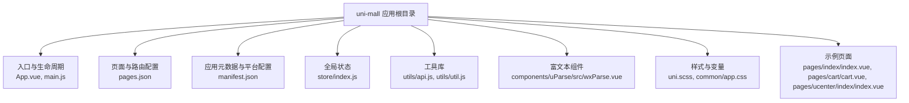
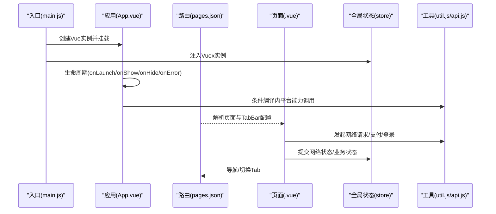
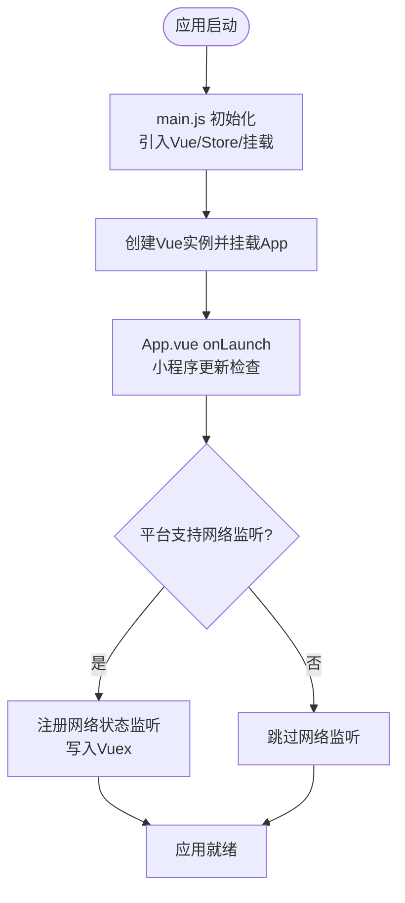
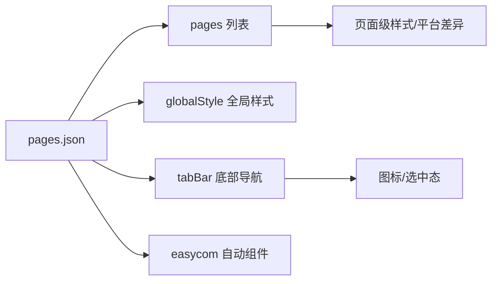
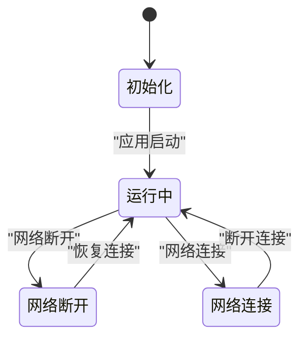
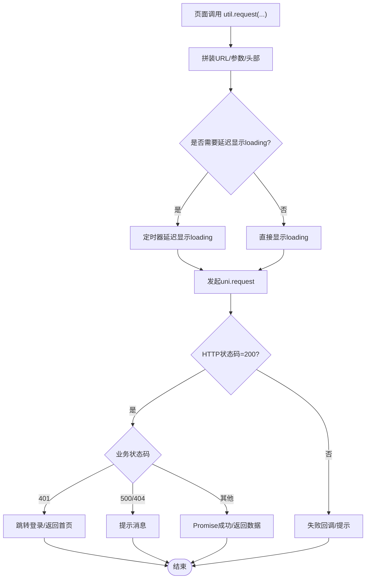
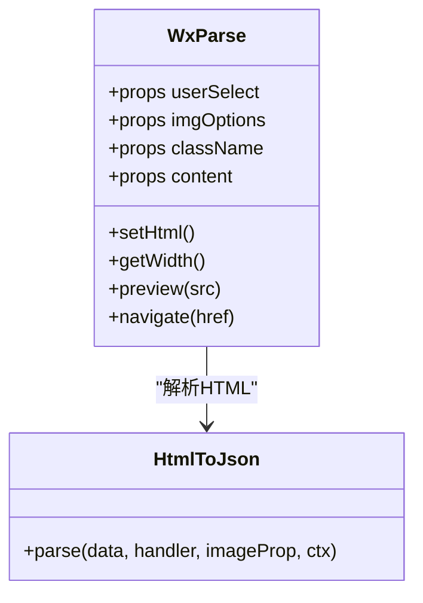
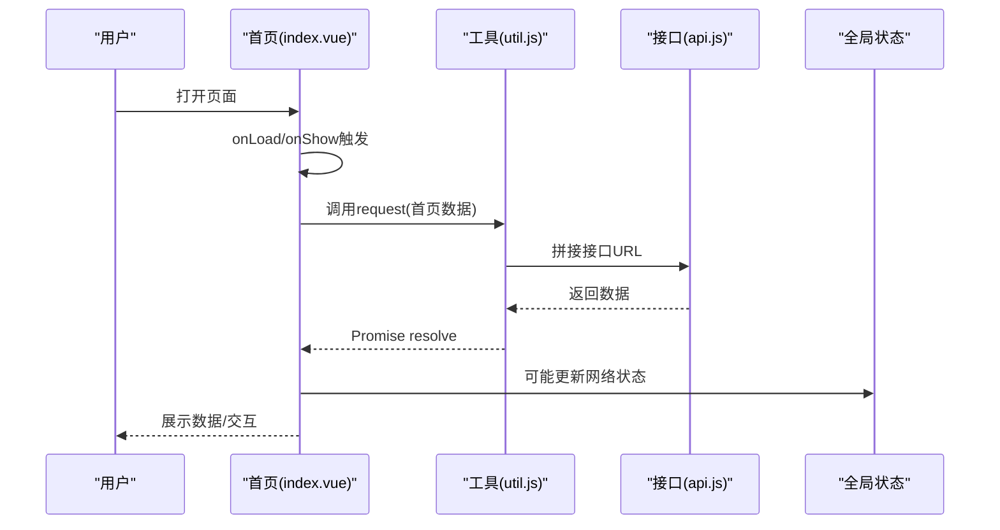
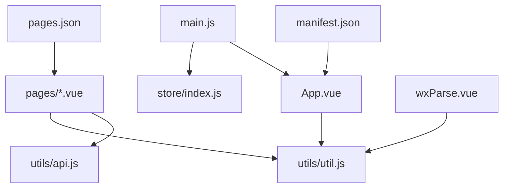

# UniApp框架架构

<cite>
**本文引用的文件**
- [uni-mall/App.vue](file://uni-mall/App.vue)
- [uni-mall/main.js](file://uni-mall/main.js)
- [uni-mall/manifest.json](file://uni-mall/manifest.json)
- [uni-mall/pages.json](file://uni-mall/pages.json)
- [uni-mall/store/index.js](file://uni-mall/store/index.js)
- [uni-mall/utils/api.js](file://uni-mall/utils/api.js)
- [uni-mall/utils/util.js](file://uni-mall/utils/util.js)
- [uni-mall/components/uParse/src/wxParse.vue](file://uni-mall/components/uParse/src/wxParse.vue)
- [uni-mall/uni.scss](file://uni-mall/uni.scss)
- [uni-mall/pages/index/index.vue](file://uni-mall/pages/index/index.vue)
- [uni-mall/pages/cart/cart.vue](file://uni-mall/pages/cart/cart.vue)
- [uni-mall/pages/ucenter/index/index.vue](file://uni-mall/pages/ucenter/index/index.vue)
- [uni-mall/common/app.css](file://uni-mall/common/app.css)
- [uni-mall/.gitignore](file://uni-mall/.gitignore)
</cite>

## 目录
1. [引言](#引言)
2. [项目结构](#项目结构)
3. [核心组件](#核心组件)
4. [架构总览](#架构总览)
5. [详细组件分析](#详细组件分析)
6. [依赖关系分析](#依赖关系分析)
7. [性能考量](#性能考量)
8. [故障排查指南](#故障排查指南)
9. [结论](#结论)
10. [附录](#附录)

## 引言
本文件面向使用与维护基于UniApp的跨端应用（uni-mall）的开发者，系统性梳理该工程的框架架构、编译与运行机制、Vue在UniApp中的特殊处理、条件编译指令的使用与平台差异、应用生命周期与全局配置、manifest.json配置项、页面路由与TabBar配置、以及性能与开发体验优化建议。文档以实际源码为依据，辅以可视化图示，帮助读者建立从“宏观架构”到“细节实现”的完整认知。

## 项目结构
该仓库包含多个模块，其中与UniApp框架直接相关的是uni-mall与wx-mall两个前端工程。本节聚焦uni-mall，它是基于Vue生态的跨端应用，通过HBuilderX/H5/小程序等多端编译目标进行分发。

- 根目录uni-mall包含应用入口、页面、组件、工具库、样式与配置文件
- 关键目录与文件：
  - 入口与应用生命周期：App.vue、main.js
  - 页面与路由：pages.json
  - 应用元数据与平台配置：manifest.json
  - 全局状态：store/index.js
  - 工具库：utils/api.js、utils/util.js
  - 富文本组件：components/uParse/src/wxParse.vue
  - 全局样式与变量：uni.scss、common/app.css
  - 示例页面：pages/index/index.vue、pages/cart/cart.vue、pages/ucenter/index/index.vue

**图表来源**
- [uni-mall/App.vue:1-72](file://uni-mall/App.vue#L1-L72)
- [uni-mall/main.js:1-29](file://uni-mall/main.js#L1-L29)
- [uni-mall/pages.json:1-385](file://uni-mall/pages.json#L1-L385)
- [uni-mall/manifest.json:1-274](file://uni-mall/manifest.json#L1-L274)
- [uni-mall/store/index.js:1-21](file://uni-mall/store/index.js#L1-L21)
- [uni-mall/utils/api.js:1-81](file://uni-mall/utils/api.js#L1-L81)
- [uni-mall/utils/util.js:1-472](file://uni-mall/utils/util.js#L1-L472)
- [uni-mall/components/uParse/src/wxParse.vue:1-211](file://uni-mall/components/uParse/src/wxParse.vue#L1-L211)
- [uni-mall/uni.scss:1-72](file://uni-mall/uni.scss#L1-L72)
- [uni-mall/common/app.css:1-35](file://uni-mall/common/app.css#L1-L35)
- [uni-mall/pages/index/index.vue:1-616](file://uni-mall/pages/index/index.vue#L1-L616)
- [uni-mall/pages/cart/cart.vue:1-669](file://uni-mall/pages/cart/cart.vue#L1-L669)
- [uni-mall/pages/ucenter/index/index.vue:1-370](file://uni-mall/pages/ucenter/index/index.vue#L1-L370)

**章节来源**
- [uni-mall/App.vue:1-72](file://uni-mall/App.vue#L1-L72)
- [uni-mall/main.js:1-29](file://uni-mall/main.js#L1-L29)
- [uni-mall/pages.json:1-385](file://uni-mall/pages.json#L1-L385)
- [uni-mall/manifest.json:1-274](file://uni-mall/manifest.json#L1-L274)
- [uni-mall/store/index.js:1-21](file://uni-mall/store/index.js#L1-L21)
- [uni-mall/utils/api.js:1-81](file://uni-mall/utils/api.js#L1-L81)
- [uni-mall/utils/util.js:1-472](file://uni-mall/utils/util.js#L1-L472)
- [uni-mall/components/uParse/src/wxParse.vue:1-211](file://uni-mall/components/uParse/src/wxParse.vue#L1-L211)
- [uni-mall/uni.scss:1-72](file://uni-mall/uni.scss#L1-L72)
- [uni-mall/common/app.css:1-35](file://uni-mall/common/app.css#L1-L35)
- [uni-mall/pages/index/index.vue:1-616](file://uni-mall/pages/index/index.vue#L1-L616)
- [uni-mall/pages/cart/cart.vue:1-669](file://uni-mall/pages/cart/cart.vue#L1-L669)
- [uni-mall/pages/ucenter/index/index.vue:1-370](file://uni-mall/pages/ucenter/index/index.vue#L1-L370)

## 核心组件
- 应用入口与生命周期
  - main.js负责引入Vue、挂载App、注入全局事件总线与Vuex实例，并针对不同平台进行条件编译的初始化
  - App.vue定义全局数据、应用生命周期钩子（启动、显示、隐藏、错误）、以及按平台引入CSS资源
- 页面与路由
  - pages.json集中声明页面列表、全局导航样式、TabBar、以及各页面的样式与平台差异配置
- 全局状态
  - store/index.js提供网络状态等全局状态与变更方法
- 工具库
  - utils/api.js统一管理接口常量
  - utils/util.js封装请求、上传、设备检测、支付、登录等通用能力，并广泛使用条件编译指令
- 富文本组件
  - components/uParse/src/wxParse.vue提供HTML转组件渲染、图片预览、宽度计算等能力，内部大量使用条件编译适配不同小程序平台
- 样式与变量
  - uni.scss提供SCSS变量，common/app.css提供全局样式与盒模型规范

**章节来源**
- [uni-mall/main.js:1-29](file://uni-mall/main.js#L1-L29)
- [uni-mall/App.vue:1-72](file://uni-mall/App.vue#L1-L72)
- [uni-mall/pages.json:1-385](file://uni-mall/pages.json#L1-L385)
- [uni-mall/store/index.js:1-21](file://uni-mall/store/index.js#L1-L21)
- [uni-mall/utils/api.js:1-81](file://uni-mall/utils/api.js#L1-L81)
- [uni-mall/utils/util.js:1-472](file://uni-mall/utils/util.js#L1-L472)
- [uni-mall/components/uParse/src/wxParse.vue:1-211](file://uni-mall/components/uParse/src/wxParse.vue#L1-L211)
- [uni-mall/uni.scss:1-72](file://uni-mall/uni.scss#L1-L72)
- [uni-mall/common/app.css:1-35](file://uni-mall/common/app.css#L1-L35)

## 架构总览
下图展示从应用启动到页面渲染的关键流程，包括入口初始化、条件编译、平台差异处理、页面路由与TabBar、全局状态与工具库协作。

**图表来源**
- [uni-mall/main.js:1-29](file://uni-mall/main.js#L1-L29)
- [uni-mall/App.vue:1-72](file://uni-mall/App.vue#L1-L72)
- [uni-mall/pages.json:1-385](file://uni-mall/pages.json#L1-L385)
- [uni-mall/store/index.js:1-21](file://uni-mall/store/index.js#L1-L21)
- [uni-mall/utils/util.js:1-472](file://uni-mall/utils/util.js#L1-L472)
- [uni-mall/utils/api.js:1-81](file://uni-mall/utils/api.js#L1-L81)

## 详细组件分析

### 应用入口与生命周期（main.js、App.vue）
- main.js职责
  - 引入Vue与App，注入全局事件总线与Vuex
  - 针对H5与非MP-TOUTIAO平台进行条件编译初始化（如网络监听）
  - 创建Vue实例并挂载
- App.vue职责
  - 定义globalData与应用生命周期
  - 微信小程序更新机制兼容处理
  - 条件编译内APP-PLUS平台错误上报与设备信息采集
  - 条件编译内H5/非nvue平台CSS引入策略

**图表来源**
- [uni-mall/main.js:1-29](file://uni-mall/main.js#L1-L29)
- [uni-mall/App.vue:1-72](file://uni-mall/App.vue#L1-L72)

**章节来源**
- [uni-mall/main.js:1-29](file://uni-mall/main.js#L1-L29)
- [uni-mall/App.vue:1-72](file://uni-mall/App.vue#L1-L72)

### 页面路由与TabBar（pages.json）
- pages字段：声明所有页面路径与默认样式，支持平台级样式覆盖（如app-plus、mp-weixin、mp-alipay、mp-baidu等）
- globalStyle：全局导航栏标题、文字样式、背景色、下拉刷新等
- tabBar：定义底部TabBar的列表、图标、文字与选中态样式
- easycom：自动扫描与自定义组件映射规则

**图表来源**
- [uni-mall/pages.json:1-385](file://uni-mall/pages.json#L1-L385)

**章节来源**
- [uni-mall/pages.json:1-385](file://uni-mall/pages.json#L1-L385)

### 全局状态（store/index.js）
- 提供版本号、网络连接状态等全局状态
- mutations：网络状态变更

**图表来源**
- [uni-mall/store/index.js:1-21](file://uni-mall/store/index.js#L1-L21)

**章节来源**
- [uni-mall/store/index.js:1-21](file://uni-mall/store/index.js#L1-L21)

### 工具库（utils/api.js、utils/util.js）
- utils/api.js：集中管理接口常量，便于统一维护与调用
- utils/util.js：
  - 接口请求封装、上传、Toast/Modal、设备检测（Android/iPhoneX）、延时显示、支付统一下单、登录等
  - 广泛使用条件编译指令（如APP-PLUS、H5、MP-ALIPAY、MP-BAIDU等）进行平台差异化处理
  - 在请求中携带token、处理401/500/404等业务状态码

**图表来源**
- [uni-mall/utils/util.js:70-149](file://uni-mall/utils/util.js#L70-L149)

**章节来源**
- [uni-mall/utils/api.js:1-81](file://uni-mall/utils/api.js#L1-L81)
- [uni-mall/utils/util.js:1-472](file://uni-mall/utils/util.js#L1-L472)

### 富文本组件（components/uParse/src/wxParse.vue）
- 功能：将HTML解析为组件树，支持图片预览、宽度计算、事件回调
- 平台适配：内部使用条件编译处理不同小程序平台的选择器查询API差异

**图表来源**
- [uni-mall/components/uParse/src/wxParse.vue:20-211](file://uni-mall/components/uParse/src/wxParse.vue#L20-L211)

**章节来源**
- [uni-mall/components/uParse/src/wxParse.vue:1-211](file://uni-mall/components/uParse/src/wxParse.vue#L1-L211)

### 样式与变量（uni.scss、common/app.css）
- uni.scss：定义颜色、字体、尺寸、边距、透明度等SCSS变量，便于主题化与复用
- common/app.css：全局样式与盒模型规范化，统一基础排版

**章节来源**
- [uni-mall/uni.scss:1-72](file://uni-mall/uni.scss#L1-L72)
- [uni-mall/common/app.css:1-35](file://uni-mall/common/app.css#L1-L35)

### 示例页面（首页、购物车、个人中心）
- pages/index/index.vue：首页轮播、菜单、专题、新品、热销、楼层商品等，支持下拉刷新与分享
- pages/cart/cart.vue：购物车列表、勾选、数量增减、全选、删除、下单
- pages/ucenter/index/index.vue：用户头像昵称、菜单卡片、绑定手机、退出登录等

**图表来源**
- [uni-mall/pages/index/index.vue:139-231](file://uni-mall/pages/index/index.vue#L139-L231)
- [uni-mall/utils/util.js:70-149](file://uni-mall/utils/util.js#L70-L149)
- [uni-mall/utils/api.js:1-81](file://uni-mall/utils/api.js#L1-L81)
- [uni-mall/store/index.js:1-21](file://uni-mall/store/index.js#L1-L21)

**章节来源**
- [uni-mall/pages/index/index.vue:1-616](file://uni-mall/pages/index/index.vue#L1-L616)
- [uni-mall/pages/cart/cart.vue:1-669](file://uni-mall/pages/cart/cart.vue#L1-L669)
- [uni-mall/pages/ucenter/index/index.vue:1-370](file://uni-mall/pages/ucenter/index/index.vue#L1-L370)

## 依赖关系分析
- 入口依赖：main.js依赖App.vue、store/index.js；App.vue依赖utils/util.js进行平台能力调用
- 页面依赖：各页面依赖utils/api.js与utils/util.js进行数据请求与业务处理
- 组件依赖：wxParse.vue依赖HtmlToJson解析库与平台选择器API
- 配置依赖：pages.json决定页面与TabBar结构；manifest.json决定平台特有能力与打包配置

**图表来源**
- [uni-mall/main.js:1-29](file://uni-mall/main.js#L1-L29)
- [uni-mall/App.vue:1-72](file://uni-mall/App.vue#L1-L72)
- [uni-mall/store/index.js:1-21](file://uni-mall/store/index.js#L1-L21)
- [uni-mall/utils/util.js:1-472](file://uni-mall/utils/util.js#L1-L472)
- [uni-mall/utils/api.js:1-81](file://uni-mall/utils/api.js#L1-L81)
- [uni-mall/components/uParse/src/wxParse.vue:1-211](file://uni-mall/components/uParse/src/wxParse.vue#L1-L211)
- [uni-mall/pages.json:1-385](file://uni-mall/pages.json#L1-L385)
- [uni-mall/manifest.json:1-274](file://uni-mall/manifest.json#L1-L274)

**章节来源**
- [uni-mall/main.js:1-29](file://uni-mall/main.js#L1-L29)
- [uni-mall/App.vue:1-72](file://uni-mall/App.vue#L1-L72)
- [uni-mall/utils/util.js:1-472](file://uni-mall/utils/util.js#L1-L472)
- [uni-mall/utils/api.js:1-81](file://uni-mall/utils/api.js#L1-L81)
- [uni-mall/components/uParse/src/wxParse.vue:1-211](file://uni-mall/components/uParse/src/wxParse.vue#L1-L211)
- [uni-mall/pages.json:1-385](file://uni-mall/pages.json#L1-L385)
- [uni-mall/manifest.json:1-274](file://uni-mall/manifest.json#L1-L274)

## 性能考量
- 条件编译优化
  - 对仅在特定平台生效的逻辑进行条件编译，避免在不支持的平台上执行无效代码，降低包体与运行时开销
  - 如APP-PLUS平台错误上报、H5平台地图脚本注入、不同小程序平台的选择器查询API差异
- 网络监听与状态
  - 非MP-TOUTIAO平台注册网络状态监听，及时更新全局网络状态，避免无谓的请求失败
- 组件与渲染
  - 使用wxParse组件时注意图片预览与宽度计算的异步处理，避免阻塞主线程
- 资源与样式
  - 合理拆分CSS与按需引入，避免全局样式污染与重复加载
- 编译与打包
  - 通过manifest.json配置平台特有模块与SDK，减少冗余依赖

[本节为通用性能建议，无需具体文件引用]

## 故障排查指南
- 应用启动与更新
  - 若小程序版本过低导致无法体验新功能，可在App.vue的onLaunch中弹窗提示
  - 新版本更新提示与应用新版本需用户确认后重启
- 网络异常
  - 通过全局网络监听与store状态联动，确保UI层能感知网络变化
  - 请求失败时统一Toast提示，必要时引导用户检查网络
- 登录与鉴权
  - 401状态码时统一跳转至登录页或首页，避免死循环
  - 用户信息缺失时触发登录流程
- 平台差异
  - 不同小程序平台的选择器查询API存在差异，需通过条件编译适配
  - H5平台可能需要额外处理JSONP等兼容性问题

**章节来源**
- [uni-mall/App.vue:12-61](file://uni-mall/App.vue#L12-L61)
- [uni-mall/main.js:8-18](file://uni-mall/main.js#L8-L18)
- [uni-mall/utils/util.js:97-149](file://uni-mall/utils/util.js#L97-L149)
- [uni-mall/components/uParse/src/wxParse.vue:141-171](file://uni-mall/components/uParse/src/wxParse.vue#L141-L171)

## 结论
本项目以UniApp为核心，结合Vue生态与条件编译能力，在多端（H5、小程序、APP）实现了统一的业务逻辑与界面呈现。通过集中式的页面路由配置、全局状态管理、工具库封装与富文本组件，项目在可维护性、可扩展性与开发效率方面具备良好基础。建议在后续迭代中持续优化条件编译策略、完善平台差异处理、加强错误监控与埋点，以进一步提升用户体验与稳定性。

## 附录
- 条件编译指令使用要点
  - APP-PLUS：用于APP平台特有的能力调用与错误上报
  - H5：用于H5平台的特定逻辑（如JSONP）
  - MP-ALIPAY/MP-BAIDU：用于不同小程序平台的选择器查询API差异
  - 非MP-TOUTIAO：用于排除特定平台的初始化逻辑
- 版本与构建产物
  - 构建产物默认输出至unpackage目录，可通过.gitignore忽略提交

**章节来源**
- [uni-mall/App.vue:54-60](file://uni-mall/App.vue#L54-L60)
- [uni-mall/main.js:5-18](file://uni-mall/main.js#L5-L18)
- [uni-mall/utils/util.js:186-194](file://uni-mall/utils/util.js#L186-L194)
- [uni-mall/components/uParse/src/wxParse.vue:143-170](file://uni-mall/components/uParse/src/wxParse.vue#L143-L170)
- [uni-mall/.gitignore:1](file://uni-mall/.gitignore#L1)