# UniApp跨平台商城

<cite>
**本文引用的文件**
- [uni-mall/App.vue](file://uni-mall/App.vue)
- [uni-mall/main.js](file://uni-mall/main.js)
- [uni-mall/pages.json](file://uni-mall/pages.json)
- [uni-mall/store/index.js](file://uni-mall/store/index.js)
- [uni-mall/utils/api.js](file://uni-mall/utils/api.js)
- [uni-mall/utils/util.js](file://uni-mall/utils/util.js)
- [uni-mall/manifest.json](file://uni-mall/manifest.json)
- [uni-mall/components/show-empty/show-empty.vue](file://uni-mall/components/show-empty/show-empty.vue)
- [uni-mall/components/ai-guide-entry/ai-guide-entry.vue](file://uni-mall/components/ai-guide-entry/ai-guide-entry.vue)
- [uni-mall/pages/index/index.vue](file://uni-mall/pages/index/index.vue)
- [uni-mall/pages/goods/goods.vue](file://uni-mall/pages/goods/goods.vue)
- [uni-mall/agent/page-meta.json](file://uni-mall/agent/page-meta.json)
- [uni-mall/skills/mall-guide-skill/index.js](file://uni-mall/skills/mall-guide-skill/index.js)
- [uni-mall/skills/mall-checkout-skill/index.js](file://uni-mall/skills/mall-checkout-skill/index.js)
- [uni-mall/skills/mall-order-skill/index.js](file://uni-mall/skills/mall-order-skill/index.js)
- [uni-mall/skills/mall-guide-skill/SKILL.md](file://uni-mall/skills/mall-guide-skill/SKILL.md)
- [uni-mall/skills/mall-checkout-skill/SKILL.md](file://uni-mall/skills/mall-checkout-skill/SKILL.md)
- [uni-mall/skills/mall-order-skill/SKILL.md](file://uni-mall/skills/mall-order-skill/SKILL.md)
- [uni-mall/skills/mall-guide-skill/mcp.json](file://uni-mall/skills/mall-guide-skill/mcp.json)
- [uni-mall/skills/mall-checkout-skill/mcp.json](file://uni-mall/skills/mall-checkout-skill/mcp.json)
- [uni-mall/skills/mall-order-skill/mcp.json](file://uni-mall/skills/mall-order-skill/mcp.json)
- [uni-mall/skills/mall-guide-skill/components/goods-detail-card/index.js](file://uni-mall/skills/mall-guide-skill/components/goods-detail-card/index.js)
- [uni-mall/skills/mall-guide-skill/components/goods-detail-card/index.json](file://uni-mall/skills/mall-guide-skill/components/goods-detail-card/index.json)
- [uni-mall/skills/mall-guide-skill/components/goods-detail-card/index.wxml](file://uni-mall/skills/mall-guide-skill/components/goods-detail-card/index.wxml)
- [uni-mall/skills/mall-guide-skill/components/goods-detail-card/index.wxss](file://uni-mall/skills/mall-guide-skill/components/goods-detail-card/index.wxss)
- [uni-mall/skills/mall-guide-skill/components/goods-list-card/index.js](file://uni-mall/skills/mall-guide-skill/components/goods-list-card/index.js)
- [uni-mall/skills/mall-guide-skill/components/goods-list-card/index.json](file://uni-mall/skills/mall-guide-skill/components/goods-list-card/index.json)
- [uni-mall/skills/mall-guide-skill/components/goods-list-card/index.wxml](file://uni-mall/skills/mall-guide-skill/components/goods-list-card/index.wxml)
- [uni-mall/skills/mall-guide-skill/components/goods-list-card/index.wxss](file://uni-mall/skills/mall-guide-skill/components/goods-list-card/index.wxss)
- [uni-mall/skills/mall-guide-skill/apis/getGoodsDetail.js](file://uni-mall/skills/mall-guide-skill/apis/getGoodsDetail.js)
- [uni-mall/skills/mall-guide-skill/apis/recommendGoods.js](file://uni-mall/skills/mall-guide-skill/apis/recommendGoods.js)
- [uni-mall/skills/mall-guide-skill/apis/searchGoods.js](file://uni-mall/skills/mall-guide-skill/apis/searchGoods.js)
- [wx-mall/app.js](file://wx-mall/app.js)
- [wx-mall/config/api.js](file://wx-mall/config/api.js)
- [platform-admin-ui/src/main.js](file://platform-admin-ui/src/main.js)
- [platform-api/src/main/java/com/platform/PlatformApiApplication.java](file://platform-api/src/main/java/com/platform/PlatformApiApplication.java)
</cite>

## 更新摘要
**所做更改**
- 新增AI助手上下文同步机制章节，详细介绍goods-detail-card和goods-list-card组件的数据驱动架构
- 更新AI助手技能架构章节，反映组件从属性驱动向数据驱动的重构
- 新增实时上下文同步技术实现说明
- 更新详细组件分析章节，增加数据驱动组件的技术细节
- 新增组件数据结构与API交互说明

## 目录
1. [简介](#简介)
2. [项目结构](#项目结构)
3. [核心组件](#核心组件)
4. [AI助手技能架构](#ai助手技能架构)
5. [AI助手上下文同步机制](#ai助手上下文同步机制)
6. [分包配置与独立加载](#分包配置与独立加载)
7. [架构总览](#架构总览)
8. [详细组件分析](#详细组件分析)
9. [依赖关系分析](#依赖关系分析)
10. [性能考虑](#性能考虑)
11. [故障排查指南](#故障排查指南)
12. [结论](#结论)
13. [附录](#附录)

## 简介
本项目是一个基于UniApp的跨平台商城前端工程，覆盖小程序（微信）、H5与APP三端，同时配套后端服务与管理后台。本文档从UniApp框架特性、平台适配策略、编译原理、页面路由、组件化开发、状态管理、API封装、跨平台兼容、性能优化、用户体验、组件库与自定义组件、样式与动画、多端适配与构建发布、开发规范与调试等方面进行系统化梳理，帮助开发者高效完成跨平台移动应用开发。

**更新** 新增AI助手上下文同步机制和数据驱动组件重构相关内容，反映AI助手功能集成后的完整架构变化。

## 项目结构
项目采用"多工程并行"的组织方式：
- uni-mall：UniApp主工程，包含页面、组件、工具、状态管理、清单与路由配置等
- wx-mall：传统微信小程序工程（对比参考）
- platform-api：后端API服务（Spring Boot）
- platform-admin-ui：管理后台前端（Vue生态）
- 平台其他模块：通用工具、业务域、部署脚本等
- **新增** skills目录：AI助手技能系统，包含商品导购、购物车结算、订单管理三个核心技能
- **新增** 数据驱动组件：goods-detail-card和goods-list-card组件支持实时AI助手上下文同步

```mermaid
graph TB
subgraph "前端"
UM["uni-mall<br/>UniApp主工程"]
WXM["wx-mall<br/>微信小程序工程"]
ADMIN["platform-admin-ui<br/>管理后台"]
SKILLS["skills<br/>AI助手技能系统"]
DATA_COMP["数据驱动组件<br/>goods-detail-card/goods-list-card"]
END
subgraph "后端"
API["platform-api<br/>Spring Boot API"]
END
UM --> API
ADMIN --> API
WXM --> API
SKILLS --> API
DATA_COMP --> SKILLS
```

**图表来源**
- [uni-mall/pages.json:1-385](file://uni-mall/pages.json#L1-L385)
- [uni-mall/manifest.json:180-220](file://uni-mall/manifest.json#L180-L220)
- [platform-api/src/main/java/com/platform/PlatformApiApplication.java:1-92](file://platform-api/src/main/java/com/platform/PlatformApiApplication.java#L1-L92)

**章节来源**
- [uni-mall/pages.json:1-385](file://uni-mall/pages.json#L1-L385)
- [uni-mall/manifest.json:180-220](file://uni-mall/manifest.json#L180-L220)
- [platform-api/src/main/java/com/platform/PlatformApiApplication.java:1-92](file://platform-api/src/main/java/com/platform/PlatformApiApplication.java#L1-L92)

## 核心组件
- 全局入口与生命周期：App.vue负责全局数据、更新机制与错误监听
- 应用启动与网络监听：main.js挂载Vue实例、注入事件总线与全局Store，并在部分平台开启网络状态监听
- 页面路由与TabBar：pages.json集中声明页面、样式、平台差异化配置与TabBar
- 状态管理：store/index.js提供基础网络状态
- API常量：utils/api.js统一维护后端接口路径
- 工具库：utils/util.js封装请求、上传、格式化、支付、登录等通用能力
- 清单与多端配置：manifest.json定义各平台能力、权限、SDK与打包配置
- 自定义组件：components/show-empty展示空态组件
- **新增** AI助手入口：components/ai-guide-entry提供悬浮按钮形式的AI助手触发入口
- **新增** 数据驱动组件：goods-detail-card和goods-list-card支持实时上下文同步
- 页面示例：pages/index/index.vue与pages/goods/goods.vue展示典型业务页面

**章节来源**
- [uni-mall/App.vue:1-72](file://uni-mall/App.vue#L1-L72)
- [uni-mall/main.js:1-29](file://uni-mall/main.js#L1-L29)
- [uni-mall/pages.json:1-385](file://uni-mall/pages.json#L1-L385)
- [uni-mall/store/index.js:1-21](file://uni-mall/store/index.js#L1-L21)
- [uni-mall/utils/api.js:1-81](file://uni-mall/utils/api.js#L1-L81)
- [uni-mall/utils/util.js:1-472](file://uni-mall/utils/util.js#L1-L472)
- [uni-mall/manifest.json:1-274](file://uni-mall/manifest.json#L1-L274)
- [uni-mall/components/show-empty/show-empty.vue:1-43](file://uni-mall/components/show-empty/show-empty.vue#L1-L43)
- [uni-mall/components/ai-guide-entry/ai-guide-entry.vue:1-120](file://uni-mall/components/ai-guide-entry/ai-guide-entry.vue#L1-L120)
- [uni-mall/skills/mall-guide-skill/components/goods-detail-card/index.js:1-56](file://uni-mall/skills/mall-guide-skill/components/goods-detail-card/index.js#L1-L56)
- [uni-mall/skills/mall-guide-skill/components/goods-list-card/index.js:1-88](file://uni-mall/skills/mall-guide-skill/components/goods-list-card/index.js#L1-L88)
- [uni-mall/pages/index/index.vue:1-200](file://uni-mall/pages/index/index.vue#L1-L200)
- [uni-mall/pages/goods/goods.vue:1-200](file://uni-mall/pages/goods/goods.vue#L1-L200)

## AI助手技能架构

### 技能系统概述
AI助手技能系统采用模块化设计，通过三个核心技能实现完整的电商购物体验闭环：

```mermaid
graph TB
subgraph "AI助手技能系统"
GUIDE["mall-guide-skill<br/>商品导购技能"]
CHECKOUT["mall-checkout-skill<br/>购物车结算技能"]
ORDER["mall-order-skill<br/>订单管理技能"]
END
subgraph "技能API"
RECOMMEND["recommendGoods<br/>商品推荐"]
SEARCH["searchGoods<br/>商品搜索"]
DETAIL["getGoodsDetail<br/>商品详情"]
CART["getCartSnapshot<br/>购物车快照"]
PREVIEW["prepareCheckout<br/>结算预览"]
LIST["listOrders<br/>订单列表"]
ORDER_DETAIL["getOrderDetail<br/>订单详情"]
END
subgraph "UI组件"
GOODS_LIST["goods-list-card<br/>商品列表卡片"]
GOODS_DETAIL["goods-detail-card<br/>商品详情卡片"]
CART_SUMMARY["cart-summary-card<br/>购物车摘要"]
ORDER_PREVIEW["order-preview-card<br/>订单预览卡片"]
ORDER_LIST["order-list-card<br/>订单列表卡片"]
ORDER_DETAIL_CARD["order-detail-card<br/>订单详情卡片"]
END
GUIDE --> RECOMMEND
GUIDE --> SEARCH
GUIDE --> DETAIL
CHECKOUT --> CART
CHECKOUT --> PREVIEW
ORDER --> LIST
ORDER --> ORDER_DETAIL
GUIDE --> GOODS_LIST
GUIDE --> GOODS_DETAIL
CHECKOUT --> CART_SUMMARY
CHECKOUT --> ORDER_PREVIEW
ORDER --> ORDER_LIST
ORDER --> ORDER_DETAIL_CARD
```

**图表来源**
- [uni-mall/skills/mall-guide-skill/index.js:1-11](file://uni-mall/skills/mall-guide-skill/index.js#L1-L11)
- [uni-mall/skills/mall-checkout-skill/index.js:1-9](file://uni-mall/skills/mall-checkout-skill/index.js#L1-L9)
- [uni-mall/skills/mall-order-skill/index.js:1-9](file://uni-mall/skills/mall-order-skill/index.js#L1-L9)

### 商品导购技能（mall-guide-skill）
负责商品推荐、商品搜索和商品详情解释，是AI助手的核心导购能力：

- **推荐商品**：根据用户当前意图推荐商品列表，支持热销和新品推荐
- **商品搜索**：按关键词精确搜索商品，直接使用用户输入的原文作为关键词
- **商品详情**：查询单个商品详情，解释价格、销量、规格并引导用户进入结算

**章节来源**
- [uni-mall/skills/mall-guide-skill/SKILL.md:1-9](file://uni-mall/skills/mall-guide-skill/SKILL.md#L1-L9)
- [uni-mall/skills/mall-guide-skill/index.js:1-11](file://uni-mall/skills/mall-guide-skill/index.js#L1-L11)
- [uni-mall/skills/mall-guide-skill/mcp.json:1-97](file://uni-mall/skills/mall-guide-skill/mcp.json#L1-L97)

### 购物车结算技能（mall-checkout-skill）
负责购物车清单核对和结算预览，确保交易安全：

- **购物车快照**：查询当前用户购物车的所有商品和勾选状态，仅用于核对
- **结算预览**：结算前预览，返回收货地址、商品清单、运费、优惠和应付金额

**章节来源**
- [uni-mall/skills/mall-checkout-skill/SKILL.md:1-9](file://uni-mall/skills/mall-checkout-skill/SKILL.md#L1-L9)
- [uni-mall/skills/mall-checkout-skill/index.js:1-9](file://uni-mall/skills/mall-checkout-skill/index.js#L1-L9)
- [uni-mall/skills/mall-checkout-skill/mcp.json:1-56](file://uni-mall/skills/mall-checkout-skill/mcp.json#L1-L56)

### 订单管理技能（mall-order-skill）
负责订单列表查询和订单详情查询：

- **订单列表**：查询用户的全部订单列表
- **订单详情**：查询指定订单的详细信息

**章节来源**
- [uni-mall/skills/mall-order-skill/SKILL.md:1-8](file://uni-mall/skills/mall-order-skill/SKILL.md#L1-L8)
- [uni-mall/skills/mall-order-skill/index.js:1-9](file://uni-mall/skills/mall-order-skill/index.js#L1-L9)

### 技能注册与API暴露
每个技能通过index.js文件向AI助手框架注册API：

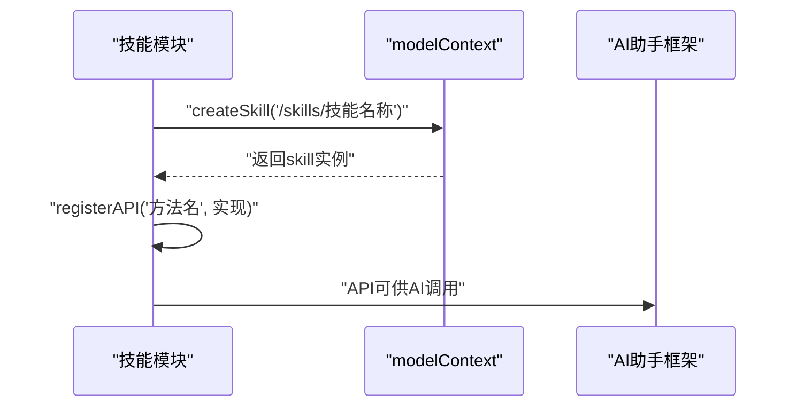

**图表来源**
- [uni-mall/skills/mall-guide-skill/index.js:5-10](file://uni-mall/skills/mall-guide-skill/index.js#L5-L10)
- [uni-mall/skills/mall-checkout-skill/index.js:4-8](file://uni-mall/skills/mall-checkout-skill/index.js#L4-L8)
- [uni-mall/skills/mall-order-skill/index.js:4-8](file://uni-mall/skills/mall-order-skill/index.js#L4-L8)

## AI助手上下文同步机制

### 数据驱动架构概述
goods-detail-card和goods-list-card组件从简单的属性驱动架构转向数据驱动架构，通过实时上下文同步实现与AI助手的深度集成：

```mermaid
graph TB
subgraph "AI助手上下文同步"
MODEL_CTX["modelContext<br/>模型上下文"]
VIEW_CTX["viewContext<br/>视图上下文"]
NOTIFICATION["NotificationType.Result<br/>结果通知"]
END
subgraph "数据驱动组件"
GOODS_DETAIL["goods-detail-card<br/>数据驱动详情组件"]
GOODS_LIST["goods-list-card<br/>数据驱动列表组件"]
SYNC_METHOD["syncGoods()<br/>syncGoodsList()"]
SET_PAGE["setRelatedPage()<br/>页面关联设置"]
END
subgraph "数据结构"
STRUCTURED_CONTENT["structuredContent<br/>结构化内容"]
META["_meta<br/>元数据"]
VIEW_GOODS["viewGoods<br/>视图商品数据"]
VIEW_ITEMS["viewItems<br/>视图商品项"]
END
MODEL_CTX --> NOTIFICATION
NOTIFICATION --> SYNC_METHOD
SYNC_METHOD --> VIEW_GOODS
SYNC_METHOD --> VIEW_ITEMS
SET_PAGE --> VIEW_CTX
GOODS_DETAIL --> MODEL_CTX
GOODS_LIST --> MODEL_CTX
```

**图表来源**
- [uni-mall/skills/mall-guide-skill/components/goods-detail-card/index.js:7-19](file://uni-mall/skills/mall-guide-skill/components/goods-detail-card/index.js#L7-L19)
- [uni-mall/skills/mall-guide-skill/components/goods-list-card/index.js:7-19](file://uni-mall/skills/mall-guide-skill/components/goods-list-card/index.js#L7-L19)

### 实时上下文同步实现
组件通过modelContext建立与AI助手的实时通信通道：

- **上下文初始化**：组件在created生命周期中获取modelContext和viewContext
- **结果监听**：订阅NotificationType.Result事件，接收AI助手的结构化数据
- **数据同步**：通过syncGoods和syncGoodsList方法处理接收到的数据
- **页面关联**：setRelatedPage方法将组件数据与目标页面建立关联

**章节来源**
- [uni-mall/skills/mall-guide-skill/components/goods-detail-card/index.js:7-19](file://uni-mall/skills/mall-guide-skill/components/goods-detail-card/index.js#L7-L19)
- [uni-mall/skills/mall-guide-skill/components/goods-list-card/index.js:7-19](file://uni-mall/skills/mall-guide-skill/components/goods-list-card/index.js#L7-L19)

### 数据结构与API交互
组件支持两种数据源结构，确保与AI助手API的兼容性：

- **结构化内容**：result.structuredContent中的原始数据
- **视图元数据**：result._meta中的视图专用数据
- **视图商品**：meta.viewGoods或source.goods中的商品详情
- **视图商品项**：meta.viewItems或source.goodsList中的商品列表

**章节来源**
- [uni-mall/skills/mall-guide-skill/components/goods-detail-card/index.js:22-33](file://uni-mall/skills/mall-guide-skill/components/goods-detail-card/index.js#L22-L33)
- [uni-mall/skills/mall-guide-skill/components/goods-list-card/index.js:22-40](file://uni-mall/skills/mall-guide-skill/components/goods-list-card/index.js#L22-L40)

## 分包配置与独立加载

### 分包架构设计
AI助手技能系统采用独立分包设计，通过manifest.json中的subPackages配置实现：

```mermaid
graph TB
subgraph "主包"
MAIN["主应用逻辑"]
END
subgraph "技能分包"
GUIDE_PKG["mall-guide-skill<br/>独立分包"]
CHECKOUT_PKG["mall-checkout-skill<br/>独立分包"]
ORDER_PKG["mall-order-skill<br/>独立分包"]
END
subgraph "页面元数据"
PAGE_META["agent/page-meta.json<br/>页面元数据"]
END
MAIN --> PAGE_META
GUIDE_PKG -.-> PAGE_META
CHECKOUT_PKG -.-> PAGE_META
ORDER_PKG -.-> PAGE_META
```

**图表来源**
- [uni-mall/manifest.json:204-219](file://uni-mall/manifest.json#L204-L219)
- [uni-mall/agent/page-meta.json:1-60](file://uni-mall/agent/page-meta.json#L1-L60)

### 分包配置详解
每个技能都配置为独立分包（independent: true)，具有以下特点：

- **独立加载**：技能按需加载，不占用主包体积
- **无页面声明**：分包内pages为空数组，避免重复声明
- **智能加载**：仅在AI助手调用相关技能时才加载对应分包

**章节来源**
- [uni-mall/manifest.json:204-219](file://uni-mall/manifest.json#L204-L219)

### 页面元数据配置
agent/page-meta.json定义了AI助手可访问的页面范围和参数要求：

- **商品详情**：支持通过商品ID参数访问
- **商品搜索**：支持关键词搜索功能
- **购物车**：查看购物车清单
- **结算页**：确认订单并提交
- **支付页**：处理支付流程
- **订单列表**：查看历史订单
- **订单详情**：查看订单状态

**章节来源**
- [uni-mall/agent/page-meta.json:1-60](file://uni-mall/agent/page-meta.json#L1-L60)

## 架构总览
整体架构由前端三端（小程序/H5/APP）与后端API共同组成，前端通过统一的API常量与工具库访问后端服务，管理后台独立运行并与后端交互。**新增** AI助手技能系统通过独立分包实现，提供智能化的购物体验，**新增** 数据驱动组件支持实时上下文同步。

```mermaid
graph TB
subgraph "前端三端"
WX["微信小程序<br/>wx-mall"]
H5["H5<br/>uni-mall(H5)"]
APP["APP<br/>uni-mall(APP)"]
END
subgraph "前端工程"
UM["uni-mall<br/>页面/组件/路由/状态/工具"]
SKILLS["skills<br/>AI助手技能系统"]
AI_ENTRY["AI助手入口组件"]
DATA_COMP["数据驱动组件<br/>goods-detail-card/goods-list-card"]
END
subgraph "后端"
API["platform-api<br/>Spring Boot"]
END
subgraph "管理后台"
ADMIN["platform-admin-ui<br/>Vue生态"]
END
UM --> API
SKILLS --> API
AI_ENTRY --> SKILLS
DATA_COMP --> SKILLS
ADMIN --> API
WX --> API
H5 --> API
APP --> API
```

**图表来源**
- [uni-mall/manifest.json:169-268](file://uni-mall/manifest.json#L169-L268)
- [uni-mall/manifest.json:180-220](file://uni-mall/manifest.json#L180-L220)
- [uni-mall/components/ai-guide-entry/ai-guide-entry.vue:56-93](file://uni-mall/components/ai-guide-entry/ai-guide-entry.vue#L56-L93)
- [platform-api/src/main/java/com/platform/PlatformApiApplication.java:1-92](file://platform-api/src/main/java/com/platform/PlatformApiApplication.java#L1-L92)
- [platform-admin-ui/src/main.js:1-80](file://platform-admin-ui/src/main.js#L1-L80)

## 详细组件分析

### 全局入口与生命周期（App.vue）
- 全局数据：userInfo、token
- 更新机制：通过canIUse与updateManager实现小程序版本更新提示与重启
- 错误监听：APP平台收集系统信息并打印错误上下文

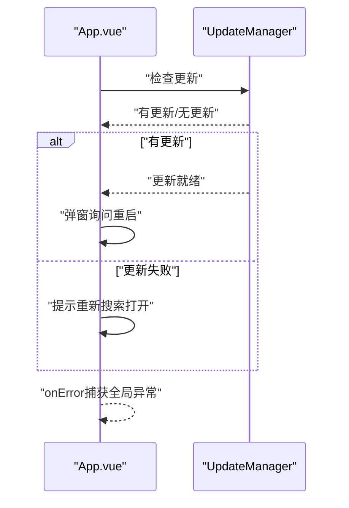

**图表来源**
- [uni-mall/App.vue:12-61](file://uni-mall/App.vue#L12-L61)

**章节来源**
- [uni-mall/App.vue:1-72](file://uni-mall/App.vue#L1-L72)

### 应用启动与网络监听（main.js）
- 注入事件总线与全局Store
- 在H5平台初始化地图变量
- 非头条平台监听网络状态变化并写入Vuex

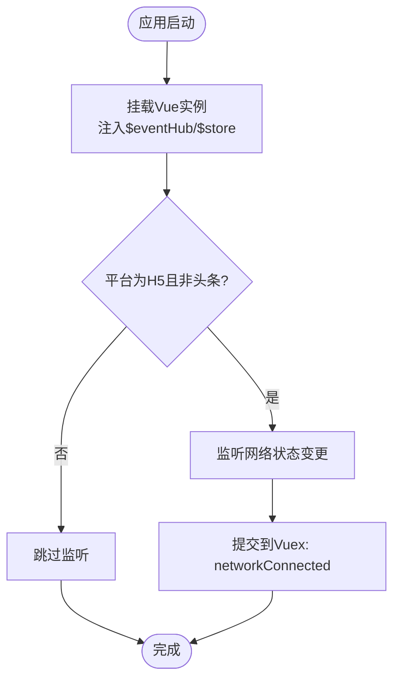

**图表来源**
- [uni-mall/main.js:5-18](file://uni-mall/main.js#L5-L18)

**章节来源**
- [uni-mall/main.js:1-29](file://uni-mall/main.js#L1-L29)

### 页面路由与TabBar（pages.json）
- pages：集中声明所有页面路径与样式
- globalStyle：全局导航栏与下拉刷新配置
- tabBar：底部导航图标、文字与选中态
- easycom：组件自动扫描与别名映射
- 平台差异化：针对不同平台（微信/APP/支付宝/百度）设置滚动、回弹等行为

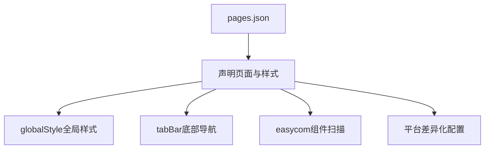

**图表来源**
- [uni-mall/pages.json:1-385](file://uni-mall/pages.json#L1-L385)

**章节来源**
- [uni-mall/pages.json:1-385](file://uni-mall/pages.json#L1-L385)

### 状态管理（store/index.js）
- state：版本号、网络连接状态
- mutations：网络状态变更

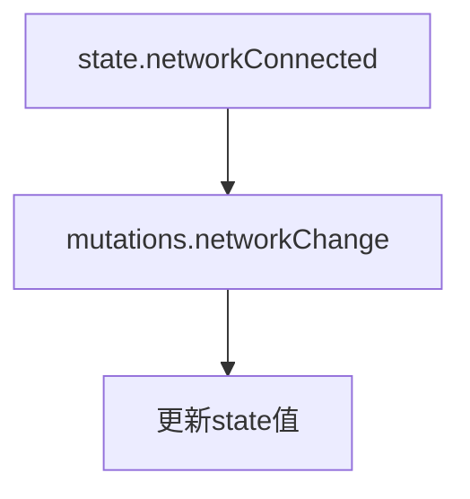

**图表来源**
- [uni-mall/store/index.js:6-17](file://uni-mall/store/index.js#L6-L17)

**章节来源**
- [uni-mall/store/index.js:1-21](file://uni-mall/store/index.js#L1-L21)

### API接口封装（utils/api.js）
- 统一维护后端接口路径常量，便于集中管理与替换
- 与工具库配合，形成清晰的"接口常量 → 工具请求 → 页面调用"链路

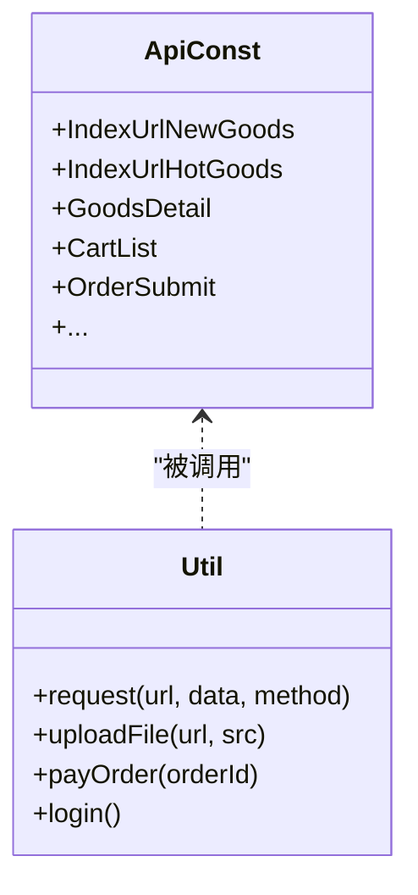

**图表来源**
- [uni-mall/utils/api.js:1-81](file://uni-mall/utils/api.js#L1-L81)
- [uni-mall/utils/util.js:70-149](file://uni-mall/utils/util.js#L70-L149)

**章节来源**
- [uni-mall/utils/api.js:1-81](file://uni-mall/utils/api.js#L1-L81)

### 工具库（utils/util.js）
- 请求封装：统一域名、token头、状态码处理、loading控制
- 上传封装：multipart表单上传
- 支付封装：统一下单与支付调用
- 登录封装：微信登录
- 格式化与校验：手机号、金额、日期、距离、空值等
- 平台适配：Android/iOS判断、iPhoneX判断、延迟显示loading

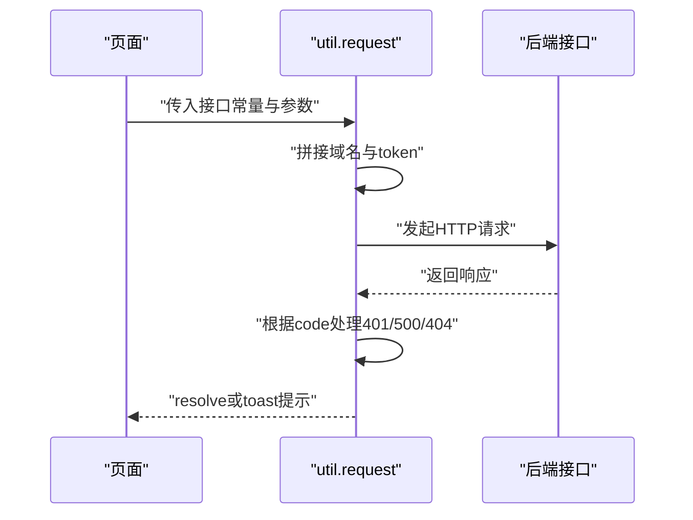

**图表来源**
- [uni-mall/utils/util.js:70-149](file://uni-mall/utils/util.js#L70-L149)
- [uni-mall/utils/api.js:1-81](file://uni-mall/utils/api.js#L1-L81)

**章节来源**
- [uni-mall/utils/util.js:1-472](file://uni-mall/utils/util.js#L1-L472)

### 清单与多端配置（manifest.json）
- app-plus：nvue编译器、splashscreen、模块与SDK配置、权限、打包图标与渠道配置
- mp-weixin：appid、组件启用、权限声明、分包与插件、懒加载策略
- h5：路由模式、域名、统计开关
- **新增** agent配置：AI助手指令和技能配置
- **新增** subPackages：技能独立分包配置
- 各平台能力开关与平台特定配置

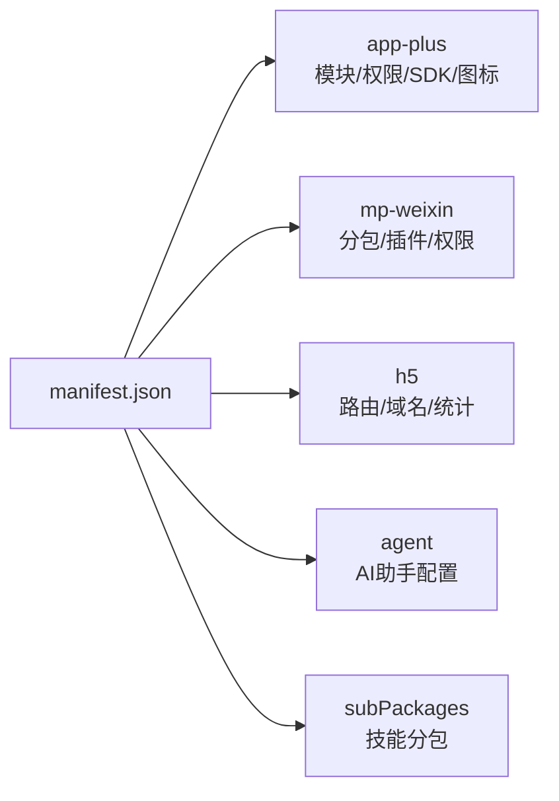

**图表来源**
- [uni-mall/manifest.json:1-274](file://uni-mall/manifest.json#L1-L274)

**章节来源**
- [uni-mall/manifest.json:1-274](file://uni-mall/manifest.json#L1-L274)

### 自定义组件（show-empty）
- 展示空态图片与文案，支持props传入文本
- 使用scoped样式避免污染

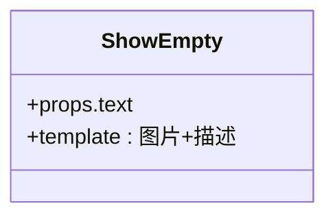

**图表来源**
- [uni-mall/components/show-empty/show-empty.vue:1-43](file://uni-mall/components/show-empty/show-empty.vue#L1-L43)

**章节来源**
- [uni-mall/components/show-empty/show-empty.vue:1-43](file://uni-mall/components/show-empty/show-empty.vue#L1-L43)

### AI助手入口组件（ai-guide-entry）
提供悬浮按钮形式的AI助手触发入口，支持多端适配：

- **条件渲染**：仅在微信小程序平台显示，其他平台显示不支持提示
- **样式定制**：支持bottom、right、left、top、zIndex等样式属性
- **交互反馈**：提供点击反馈和错误提示
- **平台适配**：使用条件编译指令区分不同平台

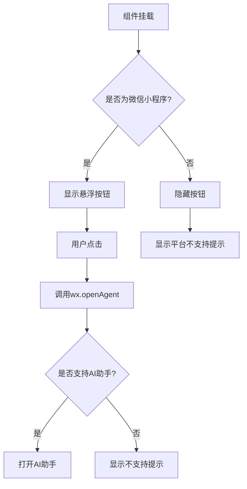

**图表来源**
- [uni-mall/components/ai-guide-entry/ai-guide-entry.vue:56-93](file://uni-mall/components/ai-guide-entry/ai-guide-entry.vue#L56-L93)

**章节来源**
- [uni-mall/components/ai-guide-entry/ai-guide-entry.vue:1-120](file://uni-mall/components/ai-guide-entry/ai-guide-entry.vue#L1-L120)

### 数据驱动组件：商品详情卡片（goods-detail-card）

#### 组件架构
goods-detail-card组件采用数据驱动架构，通过modelContext实现与AI助手的实时数据同步：

- **数据结构**：salesText、goods、productList三个核心数据字段
- **上下文集成**：在created生命周期中初始化modelContext和viewContext
- **事件监听**：订阅NotificationType.Result事件获取实时数据
- **数据处理**：syncGoods方法处理接收到的结构化数据

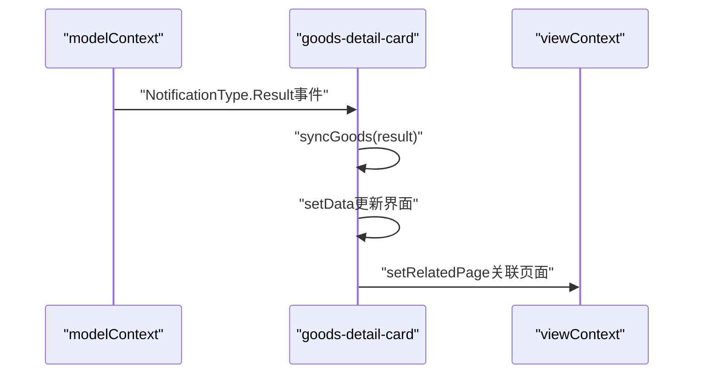

**图表来源**
- [uni-mall/skills/mall-guide-skill/components/goods-detail-card/index.js:7-19](file://uni-mall/skills/mall-guide-skill/components/goods-detail-card/index.js#L7-L19)
- [uni-mall/skills/mall-guide-skill/components/goods-detail-card/index.js:21-33](file://uni-mall/skills/mall-guide-skill/components/goods-detail-card/index.js#L21-L33)

#### 数据处理逻辑
组件支持两种数据源，确保与AI助手API的兼容性：

- **结构化内容**：从result.structuredContent提取原始数据
- **视图元数据**：从result._meta提取视图专用数据
- **视图商品**：优先使用meta.viewGoods，其次使用source.goods
- **产品列表**：从goods.productList或source.productList获取规格信息

**章节来源**
- [uni-mall/skills/mall-guide-skill/components/goods-detail-card/index.js:22-33](file://uni-mall/skills/mall-guide-skill/components/goods-detail-card/index.js#L22-L33)

### 数据驱动组件：商品列表卡片（goods-list-card）

#### 组件架构
goods-list-card组件同样采用数据驱动架构，支持列表数据的实时同步：

- **数据结构**：goodsList、source、hasMore三个核心数据字段
- **数据截取**：自动截取前3个商品项，超过3个显示查看更多按钮
- **页面关联**：根据source.keyword或source.type设置相关页面

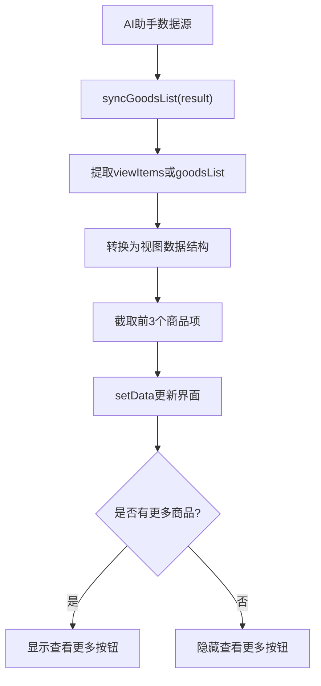

**图表来源**
- [uni-mall/skills/mall-guide-skill/components/goods-list-card/index.js:21-40](file://uni-mall/skills/mall-guide-skill/components/goods-list-card/index.js#L21-L40)

#### 数据转换与展示
组件将后端返回的数据转换为适合视图展示的结构：

- **商品ID**：item.id → goodsList[].id
- **商品图片**：item.listPicUrl或默认占位符
- **商品名称**：item.name
- **商品简述**：item.goodsBrief或默认提示
- **零售价格**：item.retailPrice
- **销售数量**：item.sales或0

**章节来源**
- [uni-mall/skills/mall-guide-skill/components/goods-list-card/index.js:26-39](file://uni-mall/skills/mall-guide-skill/components/goods-list-card/index.js#L26-L39)

### 页面示例：首页（pages/index/index.vue）
- 轮播图、频道菜单、品牌制造商、专题、新品、热销、楼层商品等区块
- 通过工具库调用多个接口聚合首页数据
- 支持下拉刷新与分享

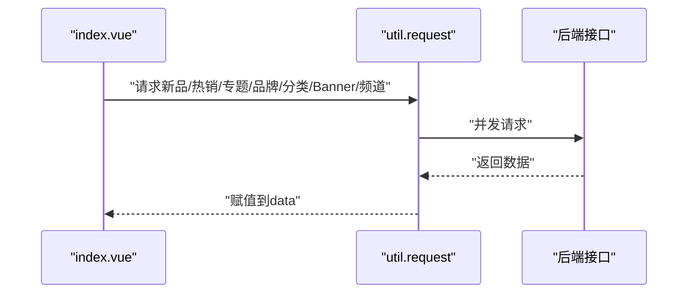

**图表来源**
- [uni-mall/pages/index/index.vue:154-192](file://uni-mall/pages/index/index.vue#L154-L192)
- [uni-mall/utils/util.js:70-149](file://uni-mall/utils/util.js#L70-L149)
- [uni-mall/utils/api.js:1-81](file://uni-mall/utils/api.js#L1-L81)

**章节来源**
- [uni-mall/pages/index/index.vue:1-200](file://uni-mall/pages/index/index.vue#L1-L200)

### 页面示例：商品详情（pages/goods/goods.vue）
- 轮播图、服务政策、商品信息、规格选择、评价、参数、详情、相关商品
- 规格弹层、数量选择、加入购物车/立即购买
- 集成uParse富文本解析组件

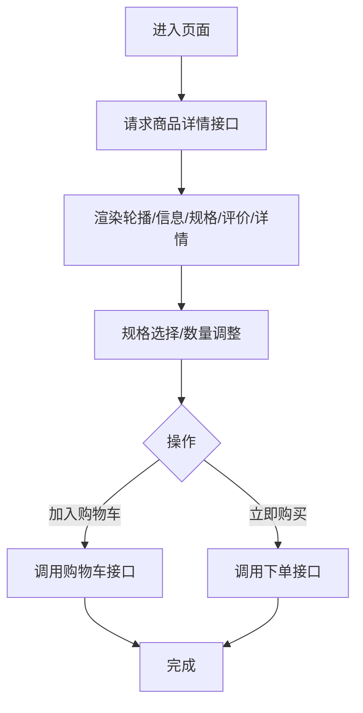

**图表来源**
- [uni-mall/pages/goods/goods.vue:185-200](file://uni-mall/pages/goods/goods.vue#L185-L200)
- [uni-mall/utils/util.js:70-149](file://uni-mall/utils/util.js#L70-L149)
- [uni-mall/utils/api.js:1-81](file://uni-mall/utils/api.js#L1-L81)

**章节来源**
- [uni-mall/pages/goods/goods.vue:1-200](file://uni-mall/pages/goods/goods.vue#L1-L200)

### 微信小程序对比（wx-mall）
- app.js：小程序更新机制与下拉刷新
- config/api.js：后端接口URL常量

**章节来源**
- [wx-mall/app.js:1-96](file://wx-mall/app.js#L1-L96)
- [wx-mall/config/api.js:1-84](file://wx-mall/config/api.js#L1-L84)

## 依赖关系分析
- uni-mall页面依赖utils/api.js与utils/util.js
- main.js依赖store/index.js
- App.vue作为全局入口，贯穿生命周期与错误处理
- manifest.json决定平台能力与打包配置，**新增** 包含AI助手和分包配置
- **新增** skills目录包含AI助手技能模块，独立于主应用逻辑
- **新增** 数据驱动组件通过modelContext与AI助手框架集成
- 后端API由Spring Boot提供REST接口，前后端通过HTTP通信

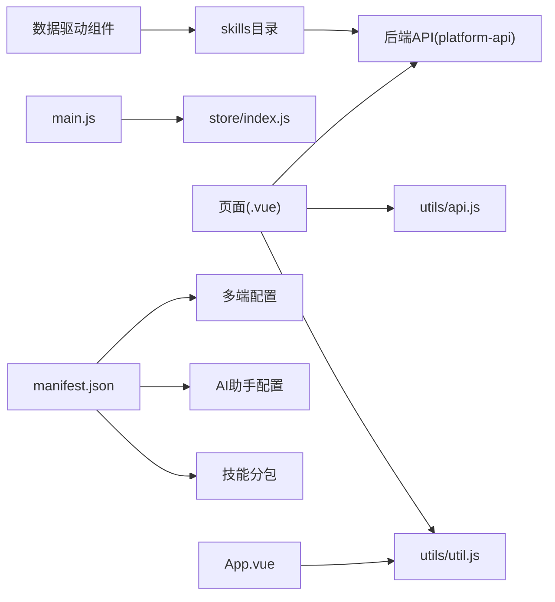

**图表来源**
- [uni-mall/pages/index/index.vue:139-140](file://uni-mall/pages/index/index.vue#L139-L140)
- [uni-mall/utils/api.js:1-81](file://uni-mall/utils/api.js#L1-L81)
- [uni-mall/utils/util.js:1-472](file://uni-mall/utils/util.js#L1-L472)
- [uni-mall/main.js:1-29](file://uni-mall/main.js#L1-L29)
- [uni-mall/store/index.js:1-21](file://uni-mall/store/index.js#L1-L21)
- [uni-mall/App.vue:1-72](file://uni-mall/App.vue#L1-L72)
- [uni-mall/manifest.json:180-220](file://uni-mall/manifest.json#L180-L220)
- [uni-mall/agent/page-meta.json:1-60](file://uni-mall/agent/page-meta.json#L1-L60)
- [platform-api/src/main/java/com/platform/PlatformApiApplication.java:1-92](file://platform-api/src/main/java/com/platform/PlatformApiApplication.java#L1-L92)

**章节来源**
- [uni-mall/pages/index/index.vue:139-140](file://uni-mall/pages/index/index.vue#L139-L140)
- [uni-mall/utils/api.js:1-81](file://uni-mall/utils/api.js#L1-L81)
- [uni-mall/utils/util.js:1-472](file://uni-mall/utils/util.js#L1-L472)
- [uni-mall/main.js:1-29](file://uni-mall/main.js#L1-L29)
- [uni-mall/store/index.js:1-21](file://uni-mall/store/index.js#L1-L21)
- [uni-mall/App.vue:1-72](file://uni-mall/App.vue#L1-L72)
- [uni-mall/manifest.json:180-220](file://uni-mall/manifest.json#L180-L220)
- [uni-mall/agent/page-meta.json:1-60](file://uni-mall/agent/page-meta.json#L1-L60)
- [platform-api/src/main/java/com/platform/PlatformApiApplication.java:1-92](file://platform-api/src/main/java/com/platform/PlatformApiApplication.java#L1-L92)

## 性能考虑
- 请求节流与防抖：工具库中对loading显示存在延迟控制，避免频繁闪烁
- 并发请求：首页多接口并行获取，提升首屏速度
- 平台差异化：针对不同平台设置回弹、滚动与下拉刷新策略，减少无效渲染
- 组件按需：通过easycom与平台组件启用，降低包体与首次渲染压力
- **新增** 技能分包：AI助手技能采用独立分包，按需加载，减少主包体积
- **新增** 懒加载策略：通过lazyCodeLoading配置实现组件懒加载
- **新增** 上下文同步：数据驱动组件通过事件监听实现实时数据更新，避免轮询开销
- **新增** 数据截取：列表组件自动截取前3项，减少DOM渲染压力
- 缓存与本地存储：利用Storage缓存token与用户信息，减少重复登录成本
- H5平台：在main.js中对特定平台做初始化处理，避免不必要的全局变量

**章节来源**
- [uni-mall/utils/util.js:70-149](file://uni-mall/utils/util.js#L70-L149)
- [uni-mall/pages/index/index.vue:154-192](file://uni-mall/pages/index/index.vue#L154-L192)
- [uni-mall/pages.json:18-30](file://uni-mall/pages.json#L18-L30)
- [uni-mall/main.js:5-18](file://uni-mall/main.js#L5-L18)
- [uni-mall/manifest.json:204-219](file://uni-mall/manifest.json#L204-L219)
- [uni-mall/skills/mall-guide-skill/components/goods-list-card/index.js:34-38](file://uni-mall/skills/mall-guide-skill/components/goods-list-card/index.js#L34-L38)

## 故障排查指南
- 全局错误捕获：App.vue onError在APP平台收集设备与系统信息，便于定位崩溃原因
- 登录拦截：工具库在请求返回401时引导跳转授权/登录页
- 网络异常：工具库统一toast提示与错误分支处理
- 版本更新：小程序端通过UpdateManager检测更新，失败时提示重新搜索打开
- 平台差异：Android/iOS机型判断与iPhoneX安全区适配，避免UI遮挡
- H5地图初始化：在main.js中对H5平台进行变量初始化，避免未定义报错
- **新增** AI助手兼容性：检查微信版本是否支持wx.openAgent，提供降级提示
- **新增** 技能加载：验证分包配置正确性，确保技能按需加载
- **新增** 上下文同步：检查modelContext是否存在，确认NotificationType.Result事件监听正常
- **新增** 数据驱动：验证structuredContent和_meta数据结构，确保数据转换逻辑正确执行

**章节来源**
- [uni-mall/App.vue:52-61](file://uni-mall/App.vue#L52-L61)
- [uni-mall/utils/util.js:102-132](file://uni-mall/utils/util.js#L102-L132)
- [wx-mall/app.js:4-36](file://wx-mall/app.js#L4-L36)
- [uni-mall/main.js:5-7](file://uni-mall/main.js#L5-L7)
- [uni-mall/components/ai-guide-entry/ai-guide-entry.vue:56-93](file://uni-mall/components/ai-guide-entry/ai-guide-entry.vue#L56-L93)
- [uni-mall/skills/mall-guide-skill/components/goods-detail-card/index.js:8-11](file://uni-mall/skills/mall-guide-skill/components/goods-detail-card/index.js#L8-L11)
- [uni-mall/skills/mall-guide-skill/components/goods-list-card/index.js:8-11](file://uni-mall/skills/mall-guide-skill/components/goods-list-card/index.js#L8-L11)

## 结论
本项目以UniApp为核心，结合统一的API常量与工具库，实现了小程序/H5/APP三端一致的业务体验。**更新** 新增的AI助手技能系统通过独立分包设计，提供了智能化的购物体验，包括商品导购、购物车结算和订单管理三大核心功能。**更新** 数据驱动组件的重构实现了与AI助手的深度集成，通过实时上下文同步提供动态的购物体验。通过集中式的路由与TabBar配置、基础的状态管理、完善的错误与更新机制以及平台差异化适配，为跨平台移动应用开发提供了可复用的工程化范式。建议在后续迭代中持续完善接口文档、埋点与监控体系，并加强组件库与主题系统的标准化建设。

## 附录
- 开发规范建议
  - 接口命名：统一使用utils/api.js中的常量，避免硬编码
  - 请求封装：优先使用utils/util.js的request/上传/支付/登录方法
  - 组件复用：优先使用easycom与自定义组件，避免重复造轮子
  - 样式规范：使用rpx与平台适配函数，确保多端一致
  - 日志与监控：在App.vue与工具库中增加必要的日志与上报
  - **新增** AI助手开发：遵循技能模块化设计，确保API接口一致性
  - **新增** 分包管理：合理规划技能分包，避免过度拆分影响加载性能
  - **新增** 数据驱动：遵循modelContext上下文同步规范，确保数据一致性
  - **新增** 组件架构：采用数据驱动设计，支持实时上下文同步
- 调试技巧
  - 使用HBuilderX真机调试与远程调试
  - 利用manifest.json的平台能力开关快速定位平台差异问题
  - 在main.js中临时打印环境变量与网络状态，辅助定位
  - **新增** AI助手调试：检查wx.openAgent可用性和技能加载状态
  - **新增** 分包调试：验证subPackages配置和独立加载效果
  - **新增** 上下文调试：检查modelContext初始化和事件监听状态
  - **新增** 数据驱动调试：验证structuredContent和_meta数据结构完整性
- 发布策略
  - H5：配置路由mode与域名，开启统计
  - APP：配置模块与权限，生成多渠道包
  - 小程序：分包与插件配置，注意懒加载策略
  - **新增** AI助手：确保微信小程序版本兼容性，提供降级方案
  - **新增** 技能分包：验证独立分包加载机制，优化首屏性能
  - **新增** 上下文同步：确保modelContext在各平台的兼容性
  - **新增** 数据驱动：验证组件数据转换逻辑在生产环境的稳定性