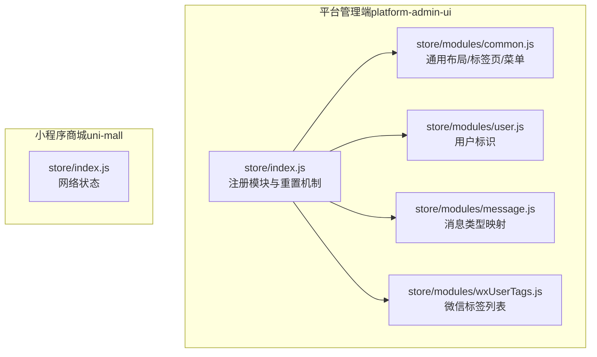
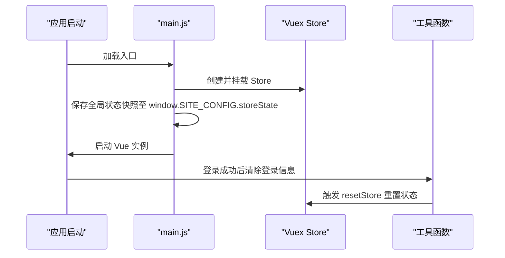
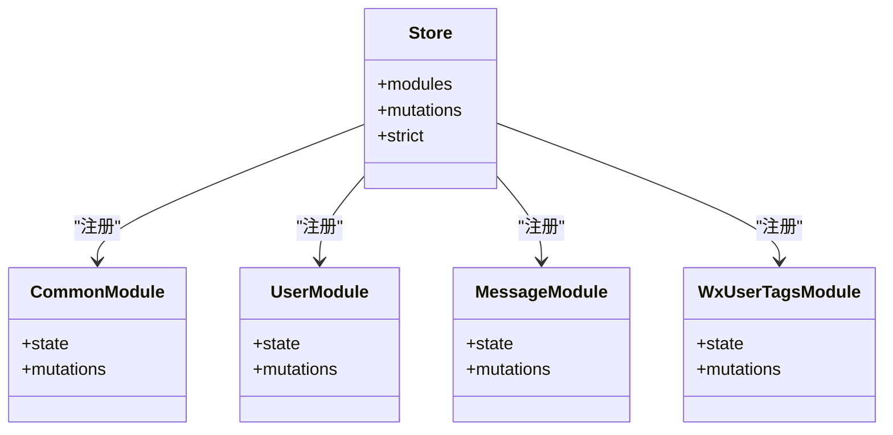
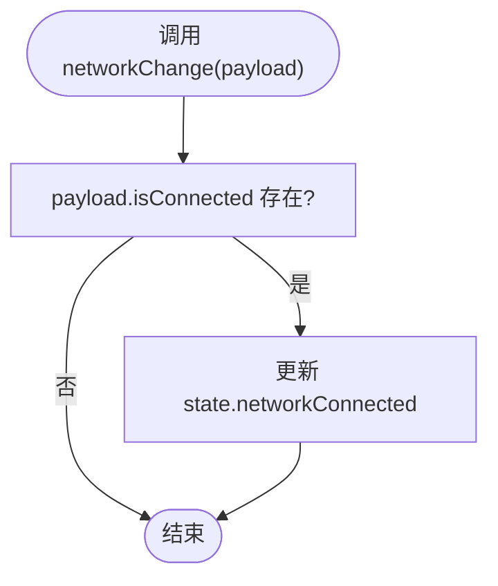
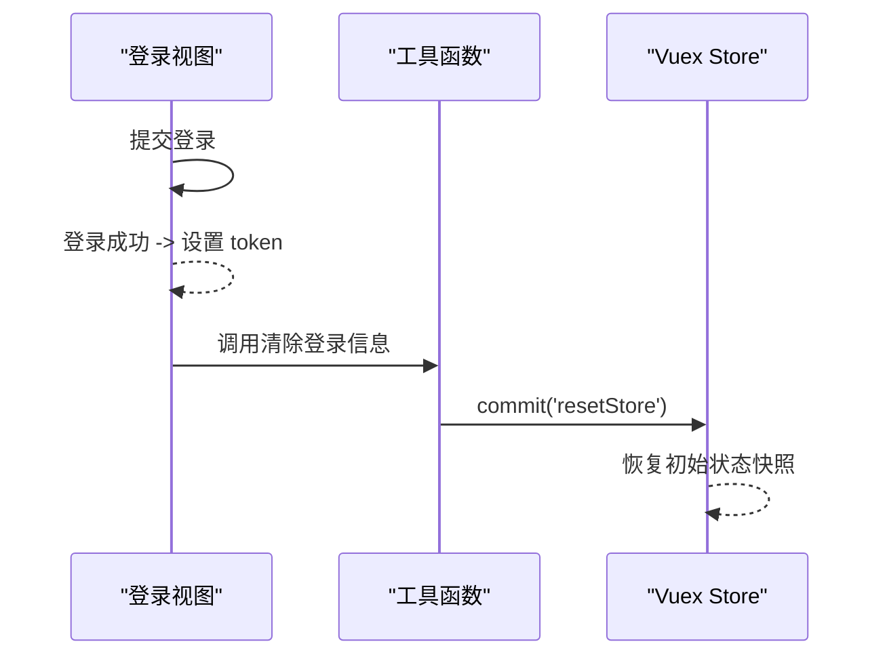
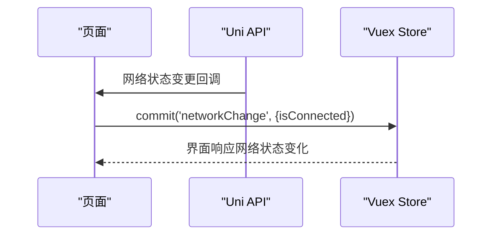
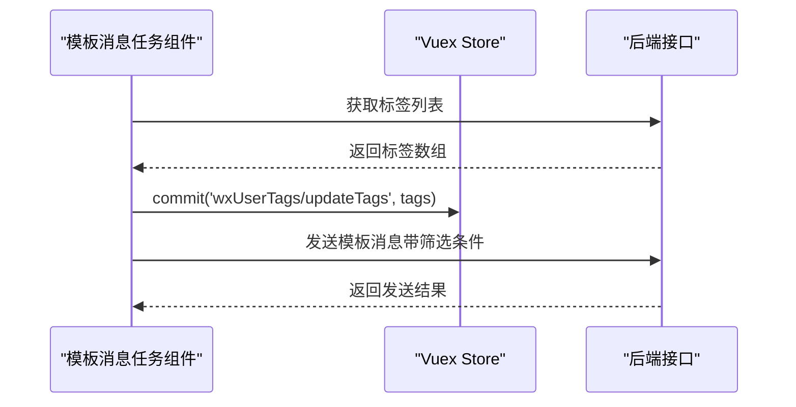
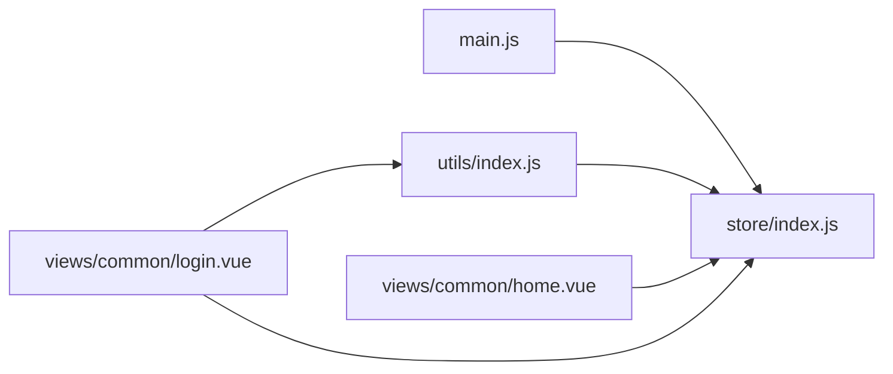

# 状态管理（Vuex）

<cite>
**本文引用的文件**
- [platform-admin-ui/src/store/index.js](file://platform-admin-ui/src/store/index.js)
- [platform-admin-ui/src/store/modules/common.js](file://platform-admin-ui/src/store/modules/common.js)
- [platform-admin-ui/src/store/modules/user.js](file://platform-admin-ui/src/store/modules/user.js)
- [platform-admin-ui/src/store/modules/message.js](file://platform-admin-ui/src/store/modules/message.js)
- [platform-admin-ui/src/store/modules/wxUserTags.js](file://platform-admin-ui/src/store/modules/wxUserTags.js)
- [uni-mall/store/index.js](file://uni-mall/store/index.js)
- [platform-admin-ui/src/main.js](file://platform-admin-ui/src/main.js)
- [platform-admin-ui/src/utils/index.js](file://platform-admin-ui/src/utils/index.js)
- [platform-admin-ui/src/views/common/home.vue](file://platform-admin-ui/src/views/common/home.vue)
- [platform-admin-ui/src/views/common/login.vue](file://platform-admin-ui/src/views/common/login.vue)
</cite>

## 目录
1. [简介](#简介)
2. [项目结构](#项目结构)
3. [核心组件](#核心组件)
4. [架构总览](#架构总览)
5. [详细组件分析](#详细组件分析)
6. [依赖关系分析](#依赖关系分析)
7. [性能考量](#性能考量)
8. [故障排查指南](#故障排查指南)
9. [结论](#结论)
10. [附录](#附录)

## 简介
本文件面向 UniApp/Vue 生态下的状态管理（Vuex）实践，结合平台现有代码，系统性梳理状态树设计、模块化组织、命名空间与持久化策略，并给出 Actions/Mutations/Getters 的使用范式、网络状态监听、用户信息管理与全局状态维护方案。同时提供调试技巧、最佳实践与性能优化建议，帮助开发者构建可维护、可扩展的状态管理体系。

## 项目结构
本项目在两个前端子工程中分别实现了状态管理：
- 平台管理端（platform-admin-ui）：采用模块化 Store，包含通用布局、用户信息、消息类型映射、微信用户标签等模块；提供全局状态重置能力。
- 小程序商城（uni-mall）：轻量 Store，仅包含基础网络状态字段。

**图表来源**
- [platform-admin-ui/src/store/index.js:11-27](file://platform-admin-ui/src/store/index.js#L11-L27)
- [platform-admin-ui/src/store/modules/common.js:3-22](file://platform-admin-ui/src/store/modules/common.js#L3-L22)
- [platform-admin-ui/src/store/modules/user.js:1-16](file://platform-admin-ui/src/store/modules/user.js#L1-L16)
- [platform-admin-ui/src/store/modules/message.js:1-32](file://platform-admin-ui/src/store/modules/message.js#L1-L32)
- [platform-admin-ui/src/store/modules/wxUserTags.js:1-12](file://platform-admin-ui/src/store/modules/wxUserTags.js#L1-L12)
- [uni-mall/store/index.js:6-18](file://uni-mall/store/index.js#L6-L18)

**章节来源**
- [platform-admin-ui/src/store/index.js:1-28](file://platform-admin-ui/src/store/index.js#L1-L28)
- [uni-mall/store/index.js:1-21](file://uni-mall/store/index.js#L1-L21)

## 核心组件
- 全局 Store（平台管理端）
  - 注册模块：common、user、message、wxUserTags
  - 提供重置机制：通过 resetStore 将所有模块状态恢复到初始快照
  - 严格模式：strict=false（便于开发期调试）
- 模块化 Store（小程序商城）
  - 状态：版本号、网络连接状态
  - 变更：networkChange 用于切换网络连接标志

**章节来源**
- [platform-admin-ui/src/store/index.js:11-27](file://platform-admin-ui/src/store/index.js#L11-L27)
- [uni-mall/store/index.js:6-18](file://uni-mall/store/index.js#L6-L18)

## 架构总览
下图展示应用启动时 Store 初始化、全局状态快照保存以及登录后路由跳转的关系。

**图表来源**
- [platform-admin-ui/src/main.js:61-62](file://platform-admin-ui/src/main.js#L61-L62)
- [platform-admin-ui/src/utils/index.js:168-172](file://platform-admin-ui/src/utils/index.js#L168-L172)
- [platform-admin-ui/src/store/index.js:18-24](file://platform-admin-ui/src/store/index.js#L18-L24)

**章节来源**
- [platform-admin-ui/src/main.js:61-62](file://platform-admin-ui/src/main.js#L61-L62)
- [platform-admin-ui/src/utils/index.js:168-172](file://platform-admin-ui/src/utils/index.js#L168-L172)

## 详细组件分析

### 平台管理端 Store（模块化）
- 模块注册与命名空间
  - 所有模块均启用 namespaced=true，避免命名冲突，便于按模块访问 state/getters/mutations/actions
- 重置机制
  - 通过 window.SITE_CONFIG.storeState 保存初始状态快照
  - resetStore 使用深拷贝还原各模块状态
- 模块职责
  - common：页面可视高度、导航/侧边栏布局风格、菜单、标签页、内容刷新标记等
  - user：用户标识（id/name），用于界面显示或鉴权
  - message：消息类型映射（微信/客服端），便于统一展示
  - wxUserTags：微信用户标签列表，供消息模板任务筛选使用

**图表来源**
- [platform-admin-ui/src/store/index.js:11-17](file://platform-admin-ui/src/store/index.js#L11-L17)
- [platform-admin-ui/src/store/modules/common.js:3-22](file://platform-admin-ui/src/store/modules/common.js#L3-L22)
- [platform-admin-ui/src/store/modules/user.js:1-16](file://platform-admin-ui/src/store/modules/user.js#L1-L16)
- [platform-admin-ui/src/store/modules/message.js:1-32](file://platform-admin-ui/src/store/modules/message.js#L1-L32)
- [platform-admin-ui/src/store/modules/wxUserTags.js:1-12](file://platform-admin-ui/src/store/modules/wxUserTags.js#L1-L12)

**章节来源**
- [platform-admin-ui/src/store/index.js:11-27](file://platform-admin-ui/src/store/index.js#L11-L27)
- [platform-admin-ui/src/store/modules/common.js:3-71](file://platform-admin-ui/src/store/modules/common.js#L3-L71)
- [platform-admin-ui/src/store/modules/user.js:1-16](file://platform-admin-ui/src/store/modules/user.js#L1-L16)
- [platform-admin-ui/src/store/modules/message.js:1-32](file://platform-admin-ui/src/store/modules/message.js#L1-L32)
- [platform-admin-ui/src/store/modules/wxUserTags.js:1-12](file://platform-admin-ui/src/store/modules/wxUserTags.js#L1-L12)

### 小程序商城 Store（轻量）
- 状态字段
  - version：应用版本
  - networkConnected：当前网络连接状态
- 变更
  - networkChange：根据传入参数切换网络连接标志

**图表来源**
- [uni-mall/store/index.js:13-16](file://uni-mall/store/index.js#L13-L16)

**章节来源**
- [uni-mall/store/index.js:6-18](file://uni-mall/store/index.js#L6-L18)

### 登录与全局状态重置流程
- 登录成功后，清除 Cookie 中的 token，触发 resetStore 重置全局状态，并重置动态路由标记
- 这样可以确保用户切换账号或登出后，界面与状态完全复位

**图表来源**
- [platform-admin-ui/src/views/common/login.vue:93-115](file://platform-admin-ui/src/views/common/login.vue#L93-L115)
- [platform-admin-ui/src/utils/index.js:168-172](file://platform-admin-ui/src/utils/index.js#L168-L172)
- [platform-admin-ui/src/store/index.js:18-24](file://platform-admin-ui/src/store/index.js#L18-L24)

**章节来源**
- [platform-admin-ui/src/views/common/login.vue:93-115](file://platform-admin-ui/src/views/common/login.vue#L93-L115)
- [platform-admin-ui/src/utils/index.js:168-172](file://platform-admin-ui/src/utils/index.js#L168-L172)

### 网络状态监听与用户信息管理
- 网络状态监听（小程序端）
  - 通过 uni.onNetworkStatusChange 订阅网络变化，派发 mutation 更新 state.networkConnected
  - 在页面中读取该状态，决定是否提示“无网络”或延迟加载
- 用户信息管理（管理端）
  - 登录成功后，将用户标识写入 user 模块 state
  - 组件通过 mapState/mapGetters 访问用户信息，驱动界面渲染与权限控制

**图表来源**
- [uni-mall/store/index.js:13-16](file://uni-mall/store/index.js#L13-L16)

**章节来源**
- [uni-mall/store/index.js:6-18](file://uni-mall/store/index.js#L6-L18)

### 模板消息任务与标签筛选
- 模板消息任务组件通过提交 wxUserTags/updateTags 更新标签列表
- 通过 computed 计算消息预览文案，结合标签筛选条件发起批量发送请求

**图表来源**
- [platform-admin-ui/src/store/modules/wxUserTags.js:6-10](file://platform-admin-ui/src/store/modules/wxUserTags.js#L6-L10)

**章节来源**
- [platform-admin-ui/src/store/modules/wxUserTags.js:1-12](file://platform-admin-ui/src/store/modules/wxUserTags.js#L1-L12)

## 依赖关系分析
- 模块耦合
  - common 模块与路由联动（移除标签页时可能触发路由跳转），体现模块间协作
  - wxUserTags 与模板消息任务组件存在直接的数据依赖
- 外部依赖
  - main.js 中保存全局状态快照，供 resetStore 使用
  - utils/index.js 提供清除登录信息工具，间接影响全局状态

**图表来源**
- [platform-admin-ui/src/main.js:61-62](file://platform-admin-ui/src/main.js#L61-L62)
- [platform-admin-ui/src/utils/index.js:168-172](file://platform-admin-ui/src/utils/index.js#L168-L172)
- [platform-admin-ui/src/views/common/home.vue:657-669](file://platform-admin-ui/src/views/common/home.vue#L657-L669)
- [platform-admin-ui/src/views/common/login.vue:93-115](file://platform-admin-ui/src/views/common/login.vue#L93-L115)

**章节来源**
- [platform-admin-ui/src/main.js:61-62](file://platform-admin-ui/src/main.js#L61-L62)
- [platform-admin-ui/src/utils/index.js:168-172](file://platform-admin-ui/src/utils/index.js#L168-L172)
- [platform-admin-ui/src/views/common/home.vue:657-669](file://platform-admin-ui/src/views/common/home.vue#L657-L669)
- [platform-admin-ui/src/views/common/login.vue:93-115](file://platform-admin-ui/src/views/common/login.vue#L93-L115)

## 性能考量
- 响应式与渲染
  - 使用 mapState/mapGetters 降低重复计算与冗余订阅
  - 对高频更新的状态（如窗口尺寸）建议节流/防抖
- 深拷贝与重置
  - resetStore 使用深拷贝恢复初始状态，注意对象层级较深时的性能开销
- 网络状态
  - 小程序端通过 onNetworkStatusChange 订阅网络变化，避免轮询带来的资源消耗

[本节为通用指导，不直接分析具体文件]

## 故障排查指南
- 登录后状态未清空
  - 检查是否正确调用 utils.clearLoginInfo 与 commit('resetStore')
  - 确认 window.SITE_CONFIG.storeState 是否已保存初始快照
- 标签列表未更新
  - 确认是否提交了 wxUserTags/updateTags
  - 检查组件是否正确读取 store.state.wxUserTags.tags
- 网络状态不生效
  - 确认小程序端是否正确订阅 uni.onNetworkStatusChange
  - 检查 mutation networkChange 的 payload 结构

**章节来源**
- [platform-admin-ui/src/utils/index.js:168-172](file://platform-admin-ui/src/utils/index.js#L168-L172)
- [platform-admin-ui/src/store/modules/wxUserTags.js:6-10](file://platform-admin-ui/src/store/modules/wxUserTags.js#L6-L10)
- [uni-mall/store/index.js:13-16](file://uni-mall/store/index.js#L13-L16)

## 结论
本项目在管理端采用模块化 Store 设计，配合命名空间与重置机制，满足多模块协同与全局复位需求；在小程序端以轻量 Store 管理网络状态。通过规范的 Actions/Mutations/Getters 使用、网络状态监听与用户信息管理，能够支撑复杂业务场景。建议后续引入持久化插件与 DevTools 调试，进一步提升可观测性与开发效率。

[本节为总结性内容，不直接分析具体文件]

## 附录

### 状态树与模块关系速览
- 平台管理端
  - common：通用布局与标签页
  - user：用户标识
  - message：消息类型映射
  - wxUserTags：微信标签列表
- 小程序商城
  - 版本与网络状态

**章节来源**
- [platform-admin-ui/src/store/index.js:11-17](file://platform-admin-ui/src/store/index.js#L11-L17)
- [platform-admin-ui/src/store/modules/common.js:3-22](file://platform-admin-ui/src/store/modules/common.js#L3-L22)
- [platform-admin-ui/src/store/modules/user.js:1-16](file://platform-admin-ui/src/store/modules/user.js#L1-L16)
- [platform-admin-ui/src/store/modules/message.js:1-32](file://platform-admin-ui/src/store/modules/message.js#L1-L32)
- [platform-admin-ui/src/store/modules/wxUserTags.js:1-12](file://platform-admin-ui/src/store/modules/wxUserTags.js#L1-L12)
- [uni-mall/store/index.js:6-18](file://uni-mall/store/index.js#L6-L18)