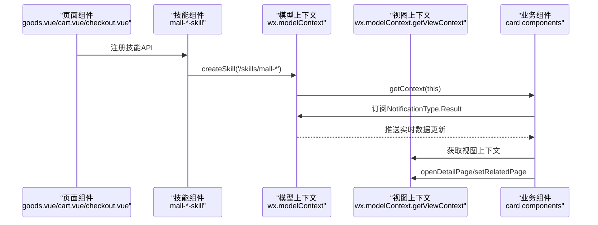
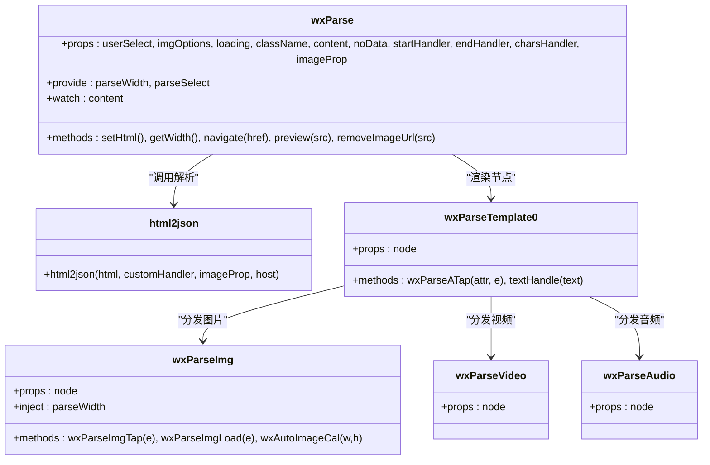
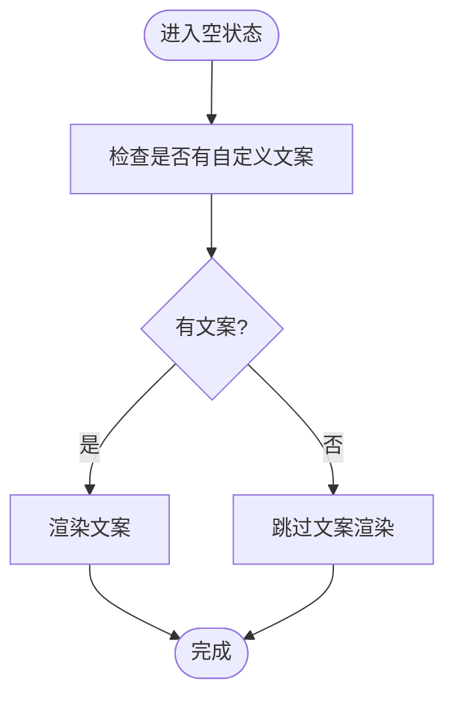
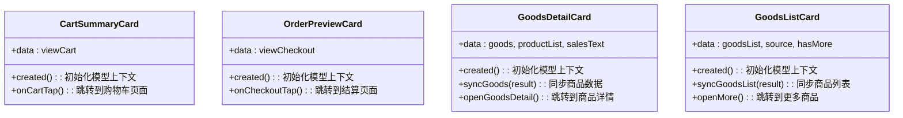
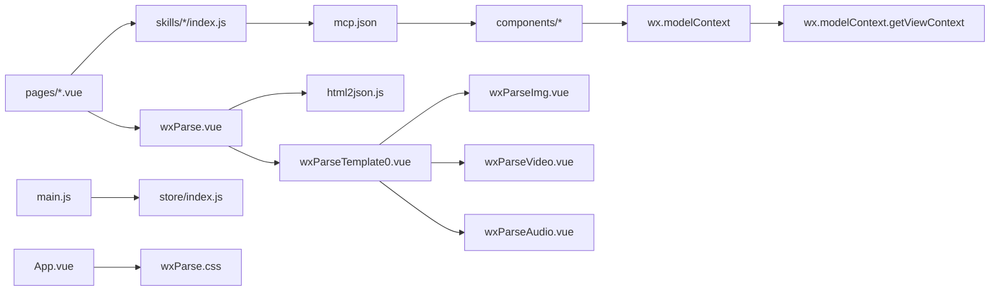

# 组件系统开发

<cite>
**本文引用的文件**
- [uni-mall/components/uParse/src/wxParse.vue](file://uni-mall/components/uParse/src/wxParse.vue)
- [uni-mall/components/uParse/src/components/wxParseTemplate0.vue](file://uni-mall/components/uParse/src/components/wxParseTemplate0.vue)
- [uni-mall/components/uParse/src/components/wxParseImg.vue](file://uni-mall/components/uParse/src/components/wxParseImg.vue)
- [uni-mall/components/uParse/src/components/wxParseVideo.vue](file://uni-mall/components/uParse/src/components/wxParseVideo.vue)
- [uni-mall/components/uParse/src/components/wxParseAudio.vue](file://uni-mall/components/uParse/src/components/wxParseAudio.vue)
- [uni-mall/components/uParse/src/libs/html2json.js](file://uni-mall/components/uParse/src/libs/html2json.js)
- [uni-mall/components/uParse/src/wxParse.css](file://uni-mall/components/uParse/src/wxParse.css)
- [uni-mall/components/show-empty/show-empty.vue](file://uni-mall/components/show-empty/show-empty.vue)
- [uni-mall/pages/goods/goods.vue](file://uni-mall/pages/goods/goods.vue)
- [uni-mall/pages/cart/cart.vue](file://uni-mall/pages/cart/cart.vue)
- [uni-mall/pages/shopping/checkout/checkout.vue](file://uni-mall/pages/shopping/checkout/checkout.vue)
- [uni-mall/App.vue](file://uni-mall/App.vue)
- [uni-mall/main.js](file://uni-mall/main.js)
- [uni-mall/store/index.js](file://uni-mall/store/index.js)
- [uni-mall/utils/util.js](file://uni-mall/utils/util.js)
- [uni-mall/skills/mall-checkout-skill/index.js](file://uni-mall/skills/mall-checkout-skill/index.js)
- [uni-mall/skills/mall-checkout-skill/mcp.json](file://uni-mall/skills/mall-checkout-skill/mcp.json)
- [uni-mall/skills/mall-checkout-skill/components/cart-summary-card/index.js](file://uni-mall/skills/mall-checkout-skill/components/cart-summary-card/index.js)
- [uni-mall/skills/mall-checkout-skill/components/order-preview-card/index.js](file://uni-mall/skills/mall-checkout-skill/components/order-preview-card/index.js)
- [uni-mall/skills/mall-guide-skill/index.js](file://uni-mall/skills/mall-guide-skill/index.js)
- [uni-mall/skills/mall-guide-skill/mcp.json](file://uni-mall/skills/mall-guide-skill/mcp.json)
- [uni-mall/skills/mall-guide-skill/components/goods-list-card/index.js](file://uni-mall/skills/mall-guide-skill/components/goods-list-card/index.js)
- [uni-mall/skills/mall-guide-skill/components/goods-detail-card/index.js](file://uni-mall/skills/mall-guide-skill/components/goods-detail-card/index.js)
- [uni-mall/skills/mall-order-skill/index.js](file://uni-mall/skills/mall-order-skill/index.js)
- [uni-mall/skills/mall-order-skill/components/order-detail-card/index.js](file://uni-mall/skills/mall-order-skill/components/order-detail-card/index.js)
- [uni-mall/skills/mall-order-skill/components/order-list-card/index.js](file://uni-mall/skills/mall-order-skill/components/order-list-card/index.js)
</cite>

## 更新摘要
**变更内容**
- 新增wx.modelContext框架的技能组件架构分析
- 更新技能组件从静态配置到动态数据绑定的实现机制
- 新增实时上下文更新和通知系统的详细说明
- 扩展组件间通信机制，包括模型上下文和视图上下文的协作
- 更新技能组件的API注册和生命周期管理

## 目录
1. [引言](#引言)
2. [项目结构](#项目结构)
3. [核心组件](#核心组件)
4. [架构总览](#架构总览)
5. [详细组件分析](#详细组件分析)
6. [技能组件系统](#技能组件系统)
7. [依赖关系分析](#依赖关系分析)
8. [性能考量](#性能考量)
9. [故障排查指南](#故障排查指南)
10. [结论](#结论)
11. [附录](#附录)

## 引言
本文件面向UniApp组件系统开发，围绕组件化开发模式、组件注册与使用、自定义组件开发流程（props、事件、插槽）、组件间通信（父子、兄弟）、内置组件（uParse富文本解析、show-empty空状态）的使用、样式作用域与主题定制、性能优化（懒加载、动态组件）以及开发规范与复用策略，提供从原理到实操的完整指导。

**更新** 本版本重点介绍了wx.modelContext框架下的技能组件系统，展示了从静态属性配置向动态数据绑定的架构升级，支持实时上下文更新和组件间的松耦合通信。

## 项目结构
- 组件层位于 uni-mall/components 下，包含通用业务组件与第三方富文本解析组件套件。
- 技能组件层位于 uni-mall/skills 下，采用wx.modelContext框架实现动态数据绑定和实时上下文更新。
- 页面层位于 uni-mall/pages 下，通过局部注册或全局引入的方式使用组件。
- 样式与全局资源位于 uni-mall/App.vue 与 uni-mall/components/uParse/src/wxParse.css 中。
- 全局事件总线与状态管理在 uni-mall/main.js 与 uni-mall/store/index.js 中初始化。

```mermaid
graph TB
subgraph "应用入口"
MAIN["main.js"]
APP["App.vue"]
END
subgraph "页面层"
PAGE_GOODS["pages/goods/goods.vue"]
PAGE_CART["pages/cart/cart.vue"]
PAGE_CHECKOUT["pages/shopping/checkout/checkout.vue"]
END
subgraph "技能组件系统"
SKILL_CHECKOUT["购物技能组件<br/>mall-checkout-skill"]
SKILL_GUIDE["导购技能组件<br/>mall-guide-skill"]
SKILL_ORDER["订单技能组件<br/>mall-order-skill"]
END
subgraph "组件层"
UPARSE["uParse 核心组件<br/>wxParse.vue"]
UPT0["模板分发组件<br/>wxParseTemplate0.vue"]
UPIMG["图片组件<br/>wxParseImg.vue"]
UPVIDEO["视频组件<br/>wxParseVideo.vue"]
UPAUDIO["音频组件<br/>wxParseAudio.vue"]
HTML2JSON["解析器<br/>html2json.js"]
WXPARSE_CSS["样式<br/>wxParse.css"]
SHOW_EMPTY["空状态组件<br/>show-empty.vue"]
END
MAIN --> APP
PAGE_GOODS --> UPARSE
PAGE_CART --> SKILL_CHECKOUT
PAGE_CHECKOUT --> SKILL_CHECKOUT
SKILL_CHECKOUT --> UPARSE
SKILL_GUIDE --> PAGE_GOODS
SKILL_ORDER --> PAGE_CHECKOUT
UPARSE --> HTML2JSON
UPARSE --> UPT0
UPT0 --> UPIMG
UPT0 --> UPVIDEO
UPT0 --> UPAUDIO
APP --> WXPARSE_CSS
PAGE_GOODS --> SHOW_EMPTY
```

**图表来源**
- [uni-mall/main.js:1-29](file://uni-mall/main.js#L1-L29)
- [uni-mall/App.vue:1-72](file://uni-mall/App.vue#L1-L72)
- [uni-mall/pages/goods/goods.vue:1-1257](file://uni-mall/pages/goods/goods.vue#L1-L1257)
- [uni-mall/pages/cart/cart.vue:1-669](file://uni-mall/pages/cart/cart.vue#L1-L669)
- [uni-mall/pages/shopping/checkout/checkout.vue:1-532](file://uni-mall/pages/shopping/checkout/checkout.vue#L1-L532)
- [uni-mall/skills/mall-checkout-skill/index.js:1-9](file://uni-mall/skills/mall-checkout-skill/index.js#L1-L9)
- [uni-mall/skills/mall-guide-skill/index.js:1-11](file://uni-mall/skills/mall-guide-skill/index.js#L1-L11)
- [uni-mall/skills/mall-order-skill/index.js:1-9](file://uni-mall/skills/mall-order-skill/index.js#L1-L9)

**章节来源**
- [uni-mall/main.js:1-29](file://uni-mall/main.js#L1-L29)
- [uni-mall/App.vue:1-72](file://uni-mall/App.vue#L1-L72)

## 核心组件
- uParse富文本解析组件：负责将HTML字符串解析为可渲染的虚拟DOM树，支持图片、视频、音频、表格等标签，并提供图片预览、链接导航、样式适配等能力。
- show-empty空状态组件：用于列表/内容为空时的占位展示，支持自定义文案。
- 技能组件系统：基于wx.modelContext框架，提供动态数据绑定、实时上下文更新和组件间通信能力。
- 页面级组件：如商品详情页在局部注册并使用uParse，以渲染富文本详情。

**更新** 技能组件系统采用新的架构模式，通过模型上下文（Model Context）和视图上下文（View Context）实现组件的动态数据绑定和实时更新。

**章节来源**
- [uni-mall/components/uParse/src/wxParse.vue:1-211](file://uni-mall/components/uParse/src/wxParse.vue#L1-L211)
- [uni-mall/components/show-empty/show-empty.vue:1-43](file://uni-mall/components/show-empty/show-empty.vue#L1-L43)
- [uni-mall/skills/mall-checkout-skill/components/cart-summary-card/index.js:1-33](file://uni-mall/skills/mall-checkout-skill/components/cart-summary-card/index.js#L1-L33)
- [uni-mall/skills/mall-checkout-skill/components/order-preview-card/index.js:1-35](file://uni-mall/skills/mall-checkout-skill/components/order-preview-card/index.js#L1-L35)

## 架构总览
uParse解析链路由wxParse.vue发起，通过html2json.js将HTML转换为节点树，再由wxParseTemplate0.vue按标签类型分发到具体子组件（图片、视频、音频、表格），最终渲染到页面。页面通过局部注册引入uParse并在模板中使用。

**更新** 技能组件系统采用wx.modelContext框架，通过createSkill创建技能实例，registerAPI注册API方法，组件通过getContext获取模型上下文，通过on监听NotificationType.Result事件实现动态数据绑定和实时更新。



**图表来源**
- [uni-mall/skills/mall-checkout-skill/index.js:4-8](file://uni-mall/skills/mall-checkout-skill/index.js#L4-L8)
- [uni-mall/skills/mall-checkout-skill/components/cart-summary-card/index.js:10-19](file://uni-mall/skills/mall-checkout-skill/components/cart-summary-card/index.js#L10-L19)
- [uni-mall/skills/mall-checkout-skill/components/order-preview-card/index.js:10-19](file://uni-mall/skills/mall-checkout-skill/components/order-preview-card/index.js#L10-L19)

## 详细组件分析

### uParse富文本解析组件族
- 组件职责
  - wxParse.vue：接收HTML内容，计算容器宽度，解析HTML为节点树，提供图片预览、链接导航、图片URL收集等能力，并通过provide/inject向子组件传递解析上下文。
  - html2json.js：基于正则与HTML解析器，构建节点树，处理样式、图片、a标签、font标签等，提取图片URL。
  - wxParseTemplate0.vue：根据节点标签类型分发到具体子组件，处理a标签点击导航、文本换行等。
  - wxParseImg.vue：负责图片渲染、尺寸计算、预览触发、注入parseWidth进行自适应。
  - wxParseVideo.vue / wxParseAudio.vue：分别渲染video/audio节点。
  - wxParse.css：提供统一的富文本样式基线。

- 关键props与行为
  - wxParse.vue props：userSelect、imgOptions、loading、className、content、noData、startHandler、endHandler、charsHandler、imageProp。
  - wxParseImg.vue props：node（包含attr/src/mode/lazyLoad等）。
  - 提供/注入：wxParse.vue通过provide暴露parseWidth与parseSelect，子组件通过inject获取。

- 事件与交互
  - wxParseTemplate0.vue在a标签点击时向上查找具备navigate方法的父组件并触发$emit('navigate')。
  - wxParseImg.vue在图片tap时向上查找具备preview方法的父组件并触发$emit('preview')，同时支持removeImageUrl移除无效图片URL。

- 使用示例
  - 商品详情页在模板中直接使用uParse组件，并传入goods.goodsDesc作为content。



**图表来源**
- [uni-mall/components/uParse/src/wxParse.vue:25-211](file://uni-mall/components/uParse/src/wxParse.vue#L25-L211)
- [uni-mall/components/uParse/src/libs/html2json.js:64-282](file://uni-mall/components/uParse/src/libs/html2json.js#L64-L282)
- [uni-mall/components/uParse/src/components/wxParseTemplate0.vue:69-104](file://uni-mall/components/uParse/src/components/wxParseTemplate0.vue#L69-L104)
- [uni-mall/components/uParse/src/components/wxParseImg.vue:16-96](file://uni-mall/components/uParse/src/components/wxParseImg.vue#L16-L96)
- [uni-mall/components/uParse/src/components/wxParseVideo.vue:9-16](file://uni-mall/components/uParse/src/components/wxParseVideo.vue#L9-L16)
- [uni-mall/components/uParse/src/components/wxParseAudio.vue:15-27](file://uni-mall/components/uParse/src/components/wxParseAudio.vue#L15-L27)

**章节来源**
- [uni-mall/components/uParse/src/wxParse.vue:25-211](file://uni-mall/components/uParse/src/wxParse.vue#L25-L211)
- [uni-mall/components/uParse/src/libs/html2json.js:64-282](file://uni-mall/components/uParse/src/libs/html2json.js#L64-L282)
- [uni-mall/components/uParse/src/components/wxParseTemplate0.vue:69-104](file://uni-mall/components/uParse/src/components/wxParseTemplate0.vue#L69-L104)
- [uni-mall/components/uParse/src/components/wxParseImg.vue:16-96](file://uni-mall/components/uParse/src/components/wxParseImg.vue#L16-L96)
- [uni-mall/components/uParse/src/components/wxParseVideo.vue:9-16](file://uni-mall/components/uParse/src/components/wxParseVideo.vue#L9-L16)
- [uni-mall/components/uParse/src/components/wxParseAudio.vue:15-27](file://uni-mall/components/uParse/src/components/wxParseAudio.vue#L15-L27)
- [uni-mall/pages/goods/goods.vue:68-69](file://uni-mall/pages/goods/goods.vue#L68-L69)

### show-empty空状态组件
- 组件职责：在无数据或空状态时展示占位图与文案。
- 关键props：text（可选文案）。
- 样式：scoped样式确保不影响外部布局。



**图表来源**
- [uni-mall/components/show-empty/show-empty.vue:1-43](file://uni-mall/components/show-empty/show-empty.vue#L1-L43)

**章节来源**
- [uni-mall/components/show-empty/show-empty.vue:1-43](file://uni-mall/components/show-empty/show-empty.vue#L1-L43)

### 页面使用与组件注册
- 局部注册：在页面中import uParse并注册到components中，然后在模板中直接使用。
- 使用方式：通过props传入content或noData，即可渲染富文本内容。
- 全局样式：App.vue中引入uParse.css，保证全局样式一致。

**更新** 页面现在可以通过技能组件系统与后端API进行动态交互，技能组件通过wx.modelContext框架实现数据的实时更新和组件间的松耦合通信。

**章节来源**
- [uni-mall/pages/goods/goods.vue:154-162](file://uni-mall/pages/goods/goods.vue#L154-L162)
- [uni-mall/App.vue:65-72](file://uni-mall/App.vue#L65-L72)

## 技能组件系统

### wx.modelContext框架概述
技能组件系统基于wx.modelContext框架构建，提供以下核心能力：
- 动态数据绑定：组件通过模型上下文实时接收数据更新
- 实时上下文更新：支持NotificationType.Result事件驱动的数据推送
- 组件间通信：通过上下文接口实现松耦合的组件通信
- 生命周期管理：组件在created生命周期中自动建立上下文连接

### 购物技能组件（mall-checkout-skill）
购物技能组件提供购物车概览和订单预览功能：

- 组件职责
  - cart-summary-card：显示购物车概览信息，支持跳转到购物车页面
  - order-preview-card：显示订单预览信息，支持跳转到结算页面

- 关键实现
  - 通过wx.modelContext.getContext获取模型上下文
  - 订阅NotificationType.Result事件接收实时数据更新
  - 通过wx.modelContext.getViewContext获取视图上下文，实现页面跳转



**图表来源**
- [uni-mall/skills/mall-checkout-skill/components/cart-summary-card/index.js:1-33](file://uni-mall/skills/mall-checkout-skill/components/cart-summary-card/index.js#L1-L33)
- [uni-mall/skills/mall-checkout-skill/components/order-preview-card/index.js:1-35](file://uni-mall/skills/mall-checkout-skill/components/order-preview-card/index.js#L1-L35)
- [uni-mall/skills/mall-guide-skill/components/goods-detail-card/index.js:1-56](file://uni-mall/skills/mall-guide-skill/components/goods-detail-card/index.js#L1-L56)
- [uni-mall/skills/mall-guide-skill/components/goods-list-card/index.js:1-88](file://uni-mall/skills/mall-guide-skill/components/goods-list-card/index.js#L1-L88)

### 导购技能组件（mall-guide-skill）
导购技能组件提供商品推荐、搜索和详情功能：

- 组件职责
  - goods-list-card：显示商品列表，支持查看更多和跳转详情
  - goods-detail-card：显示商品详情，支持跳转到商品页面

- 关键实现
  - 支持关键字搜索和类型筛选
  - 自动设置相关页面参数（keyword、type）
  - 实时同步商品数据和销售统计

### 订单技能组件（mall-order-skill）
订单技能组件提供订单管理和查看功能：

- 组件职责
  - order-list-card：显示订单列表，支持查看详情
  - order-detail-card：显示订单详情，支持跳转到订单详情页

- 关键实现
  - 实时同步订单状态和信息
  - 支持订单详情页面跳转
  - 提供订单操作接口

### 技能组件API注册
技能组件通过mcp.json文件定义API接口和UI组件映射：

- API定义：包括输入参数schema、描述信息和UI组件路径
- 组件映射：定义组件与相关页面的关联关系
- 元数据：提供UI组件的额外配置信息

**章节来源**
- [uni-mall/skills/mall-checkout-skill/index.js:1-9](file://uni-mall/skills/mall-checkout-skill/index.js#L1-L9)
- [uni-mall/skills/mall-checkout-skill/mcp.json:1-56](file://uni-mall/skills/mall-checkout-skill/mcp.json#L1-L56)
- [uni-mall/skills/mall-guide-skill/index.js:1-11](file://uni-mall/skills/mall-guide-skill/index.js#L1-L11)
- [uni-mall/skills/mall-guide-skill/mcp.json:1-97](file://uni-mall/skills/mall-guide-skill/mcp.json#L1-L97)
- [uni-mall/skills/mall-order-skill/index.js:1-9](file://uni-mall/skills/mall-order-skill/index.js#L1-L9)

## 依赖关系分析
- 组件依赖
  - wxParse.vue依赖html2json.js与wxParseTemplate0.vue。
  - wxParseTemplate0.vue依赖wxParseImg.vue、wxParseVideo.vue、wxParseAudio.vue。
- 页面依赖
  - goods.vue局部注册并使用uParse。
  - cart.vue和checkout.vue使用技能组件系统。
- 技能组件依赖
  - 技能组件依赖wx.modelContext框架提供的上下文服务。
  - 组件通过getContext获取模型上下文，通过getViewContext获取视图上下文。
- 全局依赖
  - main.js初始化全局事件总线与Vuex；App.vue引入uParse.css。
  - store/index.js提供网络状态等全局状态。



**图表来源**
- [uni-mall/pages/goods/goods.vue:154-162](file://uni-mall/pages/goods/goods.vue#L154-L162)
- [uni-mall/skills/mall-checkout-skill/index.js:4-8](file://uni-mall/skills/mall-checkout-skill/index.js#L4-L8)
- [uni-mall/skills/mall-checkout-skill/mcp.json:43-54](file://uni-mall/skills/mall-checkout-skill/mcp.json#L43-L54)
- [uni-mall/components/uParse/src/wxParse.vue:21-22](file://uni-mall/components/uParse/src/wxParse.vue#L21-L22)
- [uni-mall/components/uParse/src/components/wxParseTemplate0.vue:64-67](file://uni-mall/components/uParse/src/components/wxParseTemplate0.vue#L64-L67)
- [uni-mall/main.js:20-21](file://uni-mall/main.js#L20-L21)
- [uni-mall/store/index.js:6-18](file://uni-mall/store/index.js#L6-L18)
- [uni-mall/App.vue:65-72](file://uni-mall/App.vue#L65-L72)

**章节来源**
- [uni-mall/pages/goods/goods.vue:154-162](file://uni-mall/pages/goods/goods.vue#L154-L162)
- [uni-mall/skills/mall-checkout-skill/index.js:4-8](file://uni-mall/skills/mall-checkout-skill/index.js#L4-L8)
- [uni-mall/skills/mall-checkout-skill/mcp.json:43-54](file://uni-mall/skills/mall-checkout-skill/mcp.json#L43-L54)
- [uni-mall/components/uParse/src/wxParse.vue:21-22](file://uni-mall/components/uParse/src/wxParse.vue#L21-L22)
- [uni-mall/components/uParse/src/components/wxParseTemplate0.vue:64-67](file://uni-mall/components/uParse/src/components/wxParseTemplate0.vue#L64-L67)
- [uni-mall/main.js:20-21](file://uni-mall/main.js#L20-L21)
- [uni-mall/store/index.js:6-18](file://uni-mall/store/index.js#L6-L18)
- [uni-mall/App.vue:65-72](file://uni-mall/App.vue#L65-L72)

## 性能考量
- 渲染性能
  - wxParse.vue在setHtml中异步逐条推入nodes，避免一次性大量DOM插入导致卡顿。
  - wxParseImg.vue在图片加载完成后计算并设置样式，减少重排。
- 图片优化
  - 通过imageProp控制mode、padding、lazyLoad等，结合parseWidth自适应宽度，提升首屏渲染效率。
  - 对极小图片（小于阈值）移除预览能力，降低无效交互。
- 解析成本
  - html2json.js对HTML进行清理与解析，尽量减少无关节点与样式，降低后续渲染负担。
- 动态组件与懒加载
  - 可结合条件渲染与按需引入策略，仅在需要时渲染富文本区域，减少初始渲染量。
- 技能组件性能
  - wx.modelContext框架提供高效的事件驱动数据更新机制。
  - 组件通过上下文订阅实现按需更新，避免不必要的数据传输。
  - 支持组件级别的数据缓存和更新优化。

**更新** 技能组件系统通过wx.modelContext框架实现了更高效的性能优化，包括事件驱动的数据更新、组件级别的数据缓存和按需渲染策略。

**章节来源**
- [uni-mall/components/uParse/src/wxParse.vue:110-140](file://uni-mall/components/uParse/src/wxParse.vue#L110-L140)
- [uni-mall/components/uParse/src/components/wxParseImg.vue:48-92](file://uni-mall/components/uParse/src/components/wxParseImg.vue#L48-L92)
- [uni-mall/components/uParse/src/libs/html2json.js:64-279](file://uni-mall/components/uParse/src/libs/html2json.js#L64-L279)
- [uni-mall/skills/mall-checkout-skill/components/cart-summary-card/index.js:13-19](file://uni-mall/skills/mall-checkout-skill/components/cart-summary-card/index.js#L13-L19)

## 故障排查指南
- 富文本不显示
  - 检查content是否为空，必要时提供noData兜底。
  - 确认App.vue已引入wxParse.css。
- 图片不显示或无法预览
  - 检查imageProp配置与domain前缀。
  - 确认图片URL有效且不在removeImageUrl逻辑中被剔除。
- 链接点击无反应
  - 确保父组件实现了navigate方法并正确处理$emit('navigate')。
- 网络状态监听
  - main.js中已监听网络变化并写入store，可在页面中读取store.state.networkConnected进行提示。
- 技能组件问题
  - 检查wx.modelContext是否存在且可访问。
  - 确认技能组件已正确注册API并通过mcp.json配置UI组件路径。
  - 验证NotificationType.Result事件是否正常触发数据更新。
  - 检查组件的created生命周期是否正确初始化上下文。

**更新** 新增了技能组件相关的故障排查指南，重点关注wx.modelContext框架的使用和上下文通信问题。

**章节来源**
- [uni-mall/App.vue:65-72](file://uni-mall/App.vue#L65-L72)
- [uni-mall/components/uParse/src/wxParse.vue:172-175](file://uni-mall/components/uParse/src/wxParse.vue#L172-L175)
- [uni-mall/components/uParse/src/components/wxParseImg.vue:36-46](file://uni-mall/components/uParse/src/components/wxParseImg.vue#L36-L46)
- [uni-mall/main.js:10-18](file://uni-mall/main.js#L10-L18)
- [uni-mall/store/index.js:13-17](file://uni-mall/store/index.js#L13-L17)
- [uni-mall/skills/mall-checkout-skill/components/cart-summary-card/index.js:7-11](file://uni-mall/skills/mall-checkout-skill/components/cart-summary-card/index.js#L7-L11)

## 结论
本项目采用模块化的组件体系：页面层通过局部注册使用uParse富文本组件，解析器与模板分发组件解耦清晰，子组件职责单一，配合全局样式与事件总线，形成可维护、可扩展的组件化方案。

**更新** 新的技能组件系统通过wx.modelContext框架实现了从静态配置到动态数据绑定的架构升级，支持实时上下文更新和组件间的松耦合通信，提供了更强大的组件复用能力和更好的开发体验。

建议在实际开发中遵循统一的props设计、事件命名与样式作用域规范，结合懒加载与按需渲染策略，持续优化性能与用户体验。对于技能组件的开发，应充分利用wx.modelContext框架提供的上下文通信机制，实现组件间的高效协作。

## 附录

### 组件开发规范与最佳实践
- 命名约定
  - 组件文件夹与名称采用语义化命名，如uParse、show-empty、mall-checkout-skill。
  - 子组件按功能拆分，如wxParseImg、wxParseVideo、cart-summary-card。
- Props设计
  - 明确默认值与类型校验，避免隐式依赖。
  - 将可复用配置（如imageProp）集中管理，便于统一调整。
- 事件与插槽
  - 事件命名采用动词短语，如navigate、preview，保持与父组件约定一致。
  - 插槽使用场景明确，避免过度抽象。
- 样式作用域
  - 子组件使用scoped样式，避免污染全局。
  - 全局样式通过App.vue统一引入，保证一致性。
- 主题与变量
  - 通过CSS变量或SCSS变量统一管理颜色、字号、间距等，便于切换主题。
- 复用策略
  - 将通用逻辑抽取为工具函数（如utils/util.js），减少重复代码。
  - 对复杂页面（如商品详情）拆分为多个小组件，提升可读性与可测试性。
- 技能组件开发
  - 利用wx.modelContext框架实现动态数据绑定和实时更新。
  - 通过mcp.json文件统一管理API接口和UI组件映射。
  - 在组件中正确处理上下文初始化和事件订阅。
  - 实现视图上下文的页面跳转和相关页面设置功能。

**更新** 新增了技能组件开发的最佳实践，包括wx.modelContext框架的使用规范和上下文通信的最佳实践。

**章节来源**
- [uni-mall/utils/util.js:1-472](file://uni-mall/utils/util.js#L1-L472)
- [uni-mall/App.vue:65-72](file://uni-mall/App.vue#L65-L72)
- [uni-mall/skills/mall-checkout-skill/mcp.json:1-56](file://uni-mall/skills/mall-checkout-skill/mcp.json#L1-L56)
- [uni-mall/skills/mall-guide-skill/mcp.json:1-97](file://uni-mall/skills/mall-guide-skill/mcp.json#L1-L97)
- [uni-mall/skills/mall-order-skill/index.js:1-9](file://uni-mall/skills/mall-order-skill/index.js#L1-L9)