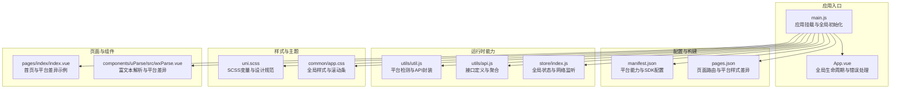
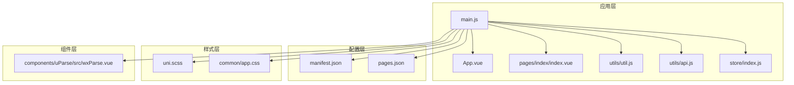
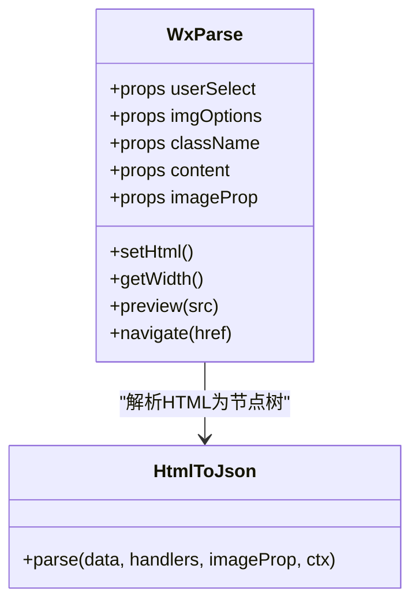
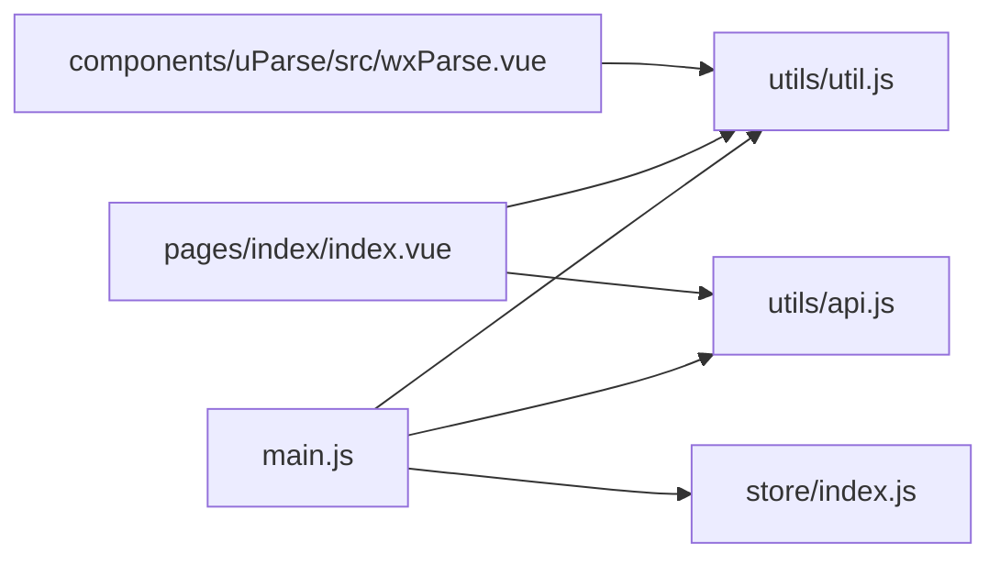

# 跨平台适配策略

<cite>
**本文引用的文件**   
- [uni-mall/App.vue](file://uni-mall/App.vue)
- [uni-mall/main.js](file://uni-mall/main.js)
- [uni-mall/manifest.json](file://uni-mall/manifest.json)
- [uni-mall/pages.json](file://uni-mall/pages.json)
- [uni-mall/utils/api.js](file://uni-mall/utils/api.js)
- [uni-mall/utils/util.js](file://uni-mall/utils/util.js)
- [uni-mall/store/index.js](file://uni-mall/store/index.js)
- [uni-mall/uni.scss](file://uni-mall/uni.scss)
- [uni-mall/common/app.css](file://uni-mall/common/app.css)
- [uni-mall/pages/index/index.vue](file://uni-mall/pages/index/index.vue)
- [uni-mall/components/uParse/src/wxParse.vue](file://uni-mall/components/uParse/src/wxParse.vue)
- [Agents.md](file://Agents.md)
- [docs/系统架构图.mmd](file://docs/系统架构图.mmd)
- [docs/系统架构说明.md](file://docs/系统架构说明.md)
</cite>

## 目录
1. [引言](#引言)
2. [项目结构](#项目结构)
3. [核心组件](#核心组件)
4. [架构总览](#架构总览)
5. [详细组件分析](#详细组件分析)
6. [依赖分析](#依赖分析)
7. [性能考量](#性能考量)
8. [故障排查指南](#故障排查指南)
9. [结论](#结论)
10. [附录](#附录)

## 引言
本文件面向使用 UniApp 的跨平台应用开发者，系统梳理“微同商城”uni-app 前端（uni-mall）在多端适配上的实现思路与工程实践，覆盖条件编译、平台差异处理、样式与布局兼容、组件差异、平台 API 差异与降级、性能优化与包体积控制、启动速度优化、测试与发布流程等主题，旨在提供一套可复用的跨平台适配策略与问题解决方法。

## 项目结构
uni-mall 作为统一的前端入口，同时支持 H5、小程序（含微信、支付宝、百度、头条等）、APP（5+App/NVue）等多端。项目采用标准的 uni-app 目录组织，关键配置集中在 manifest.json 与 pages.json 中，运行时通过条件编译与平台专属能力进行差异化处理。

**图表来源**
- [uni-mall/main.js:1-29](file://uni-mall/main.js#L1-L29)
- [uni-mall/App.vue:1-72](file://uni-mall/App.vue#L1-L72)
- [uni-mall/manifest.json:1-274](file://uni-mall/manifest.json#L1-L274)
- [uni-mall/pages.json:1-385](file://uni-mall/pages.json#L1-L385)
- [uni-mall/utils/util.js:1-472](file://uni-mall/utils/util.js#L1-L472)
- [uni-mall/utils/api.js:1-81](file://uni-mall/utils/api.js#L1-L81)
- [uni-mall/store/index.js:1-21](file://uni-mall/store/index.js#L1-L21)
- [uni-mall/uni.scss:1-72](file://uni-mall/uni.scss#L1-L72)
- [uni-mall/common/app.css:1-35](file://uni-mall/common/app.css#L1-L35)
- [uni-mall/pages/index/index.vue:1-616](file://uni-mall/pages/index/index.vue#L1-L616)
- [uni-mall/components/uParse/src/wxParse.vue:1-211](file://uni-mall/components/uParse/src/wxParse.vue#L1-L211)

**章节来源**
- [uni-mall/main.js:1-29](file://uni-mall/main.js#L1-L29)
- [uni-mall/App.vue:1-72](file://uni-mall/App.vue#L1-L72)
- [uni-mall/manifest.json:1-274](file://uni-mall/manifest.json#L1-L274)
- [uni-mall/pages.json:1-385](file://uni-mall/pages.json#L1-L385)
- [uni-mall/utils/util.js:1-472](file://uni-mall/utils/util.js#L1-L472)
- [uni-mall/utils/api.js:1-81](file://uni-mall/utils/api.js#L1-L81)
- [uni-mall/store/index.js:1-21](file://uni-mall/store/index.js#L1-L21)
- [uni-mall/uni.scss:1-72](file://uni-mall/uni.scss#L1-L72)
- [uni-mall/common/app.css:1-35](file://uni-mall/common/app.css#L1-L35)
- [uni-mall/pages/index/index.vue:1-616](file://uni-mall/pages/index/index.vue#L1-L616)
- [uni-mall/components/uParse/src/wxParse.vue:1-211](file://uni-mall/components/uParse/src/wxParse.vue#L1-L211)

## 核心组件
- 应用入口与生命周期
  - main.js：全局事件总线、Vuex 挂载、平台网络状态监听（非字节小游戏）、H5 地图全局变量初始化等。
  - App.vue：全局数据、小程序更新机制兼容、APP 平台错误采集与上报。
- 配置与构建
  - manifest.json：统一声明各平台能力（模块、SDK、权限、图标、splash 等），并针对 H5、小程序等设置差异化参数。
  - pages.json：页面路由、tabBar、全局样式与平台样式差异（如 bounce、disableScroll、allowsBounceVertical 等）。
- 运行时能力
  - utils/util.js：平台检测（Android/iPhoneX）、请求封装、上传、支付、登录、富文本 JSONP（H5）、网络状态监听（非字节小游戏）等。
  - utils/api.js：接口清单聚合，便于跨端统一调用。
  - store/index.js：全局状态（版本、网络状态）。
- 样式与主题
  - uni.scss：颜色、字体、尺寸、间距、透明度等 SCSS 变量，统一设计规范。
  - common/app.css：全局盒模型、字体、按钮伪元素、滚动条等基础样式。
- 页面与组件
  - pages/index/index.vue：首页示例，展示平台差异（如导航栏、下拉刷新、分享等）。
  - components/uParse/src/wxParse.vue：富文本解析组件，内置平台差异处理（选择器查询、图片预览等）。

**章节来源**
- [uni-mall/main.js:1-29](file://uni-mall/main.js#L1-L29)
- [uni-mall/App.vue:1-72](file://uni-mall/App.vue#L1-L72)
- [uni-mall/manifest.json:1-274](file://uni-mall/manifest.json#L1-L274)
- [uni-mall/pages.json:1-385](file://uni-mall/pages.json#L1-L385)
- [uni-mall/utils/util.js:1-472](file://uni-mall/utils/util.js#L1-L472)
- [uni-mall/utils/api.js:1-81](file://uni-mall/utils/api.js#L1-L81)
- [uni-mall/store/index.js:1-21](file://uni-mall/store/index.js#L1-L21)
- [uni-mall/uni.scss:1-72](file://uni-mall/uni.scss#L1-L72)
- [uni-mall/common/app.css:1-35](file://uni-mall/common/app.css#L1-L35)
- [uni-mall/pages/index/index.vue:1-616](file://uni-mall/pages/index/index.vue#L1-L616)
- [uni-mall/components/uParse/src/wxParse.vue:1-211](file://uni-mall/components/uParse/src/wxParse.vue#L1-L211)

## 架构总览
下图展示了 uni-mall 在多端运行时的整体关系：应用入口负责初始化与全局能力；配置文件决定平台能力与差异化行为；运行时通过工具函数与组件实现跨端兼容；页面与组件承载业务逻辑。

**图表来源**
- [uni-mall/main.js:1-29](file://uni-mall/main.js#L1-L29)
- [uni-mall/App.vue:1-72](file://uni-mall/App.vue#L1-L72)
- [uni-mall/manifest.json:1-274](file://uni-mall/manifest.json#L1-L274)
- [uni-mall/pages.json:1-385](file://uni-mall/pages.json#L1-L385)
- [uni-mall/utils/util.js:1-472](file://uni-mall/utils/util.js#L1-L472)
- [uni-mall/utils/api.js:1-81](file://uni-mall/utils/api.js#L1-L81)
- [uni-mall/store/index.js:1-21](file://uni-mall/store/index.js#L1-L21)
- [uni-mall/uni.scss:1-72](file://uni-mall/uni.scss#L1-L72)
- [uni-mall/common/app.css:1-35](file://uni-mall/common/app.css#L1-L35)
- [uni-mall/pages/index/index.vue:1-616](file://uni-mall/pages/index/index.vue#L1-L616)
- [uni-mall/components/uParse/src/wxParse.vue:1-211](file://uni-mall/components/uParse/src/wxParse.vue#L1-L211)

## 详细组件分析

### 条件编译与平台差异处理
- 条件编译语法
  - H5/H5 平台：用于 H5 特有逻辑（如 QQ 地图全局变量初始化）。
  - MP-* 平台：用于小程序系列平台的差异化（如字节小游戏不监听网络状态）。
  - APP-PLUS/APP 平台：用于 APP 特有逻辑（如 APP 错误采集、Android/iOS 动画延迟差异）。
- 实践要点
  - 使用条件编译包裹平台特定代码，避免在不支持的平台上执行无效或报错的逻辑。
  - 将平台差异收敛在工具函数或组件内部，对外暴露统一接口。

**章节来源**
- [uni-mall/main.js:5-18](file://uni-mall/main.js#L5-L18)
- [uni-mall/utils/util.js:34-54](file://uni-mall/utils/util.js#L34-L54)
- [uni-mall/App.vue:54-61](file://uni-mall/App.vue#L54-L61)

### 样式适配与布局兼容
- 设计规范与变量
  - uni.scss 定义颜色、字体、尺寸、圆角、间距、透明度等变量，统一全站视觉与交互。
- 全局样式
  - common/app.css 设置盒模型、字体族、按钮伪元素、滚动条等，保证基础一致性。
- 页面样式
  - 页面内使用 rpx 单位与 Flex 布局，结合平台差异配置（如 bounce、disableScroll）实现滚动与交互体验优化。

**章节来源**
- [uni-mall/uni.scss:1-72](file://uni-mall/uni.scss#L1-L72)
- [uni-mall/common/app.css:1-35](file://uni-mall/common/app.css#L1-L35)
- [uni-mall/pages.json:18-30](file://uni-mall/pages.json#L18-L30)
- [uni-mall/pages/index/index.vue:234-616](file://uni-mall/pages/index/index.vue#L234-L616)

### 组件差异处理（富文本解析）
- 组件能力
  - wxParse.vue：将 HTML 内容解析为可渲染节点树，支持图片预览、链接导航、宽度计算等。
- 平台差异
  - 选择器查询：针对不同小程序平台（如百度、支付宝）使用不同的查询 API。
  - 图片预览：统一通过 uni.previewImage 触发，避免平台差异导致的异常。
- 最佳实践
  - 将平台差异封装在组件内部，调用方仅关心 props 与事件。

**图表来源**
- [uni-mall/components/uParse/src/wxParse.vue:20-211](file://uni-mall/components/uParse/src/wxParse.vue#L20-L211)

**章节来源**
- [uni-mall/components/uParse/src/wxParse.vue:143-171](file://uni-mall/components/uParse/src/wxParse.vue#L143-L171)
- [uni-mall/components/uParse/src/wxParse.vue:176-189](file://uni-mall/components/uParse/src/wxParse.vue#L176-L189)

### 平台 API 差异与功能降级
- 平台能力声明
  - manifest.json 中集中声明各平台模块与 SDK（如支付、地图、OAuth、推送等），并配置权限与图标。
- 功能降级策略
  - 对于不支持的平台能力，应在调用前进行能力检测与降级处理（如 APP 平台错误采集、H5 地图 JSONP）。
  - 对于网络监听等能力，采用条件编译屏蔽不支持平台，避免报错。

**章节来源**
- [uni-mall/manifest.json:9-165](file://uni-mall/manifest.json#L9-L165)
- [uni-mall/main.js:8-18](file://uni-mall/main.js#L8-L18)
- [uni-mall/utils/util.js:185-194](file://uni-mall/utils/util.js#L185-L194)

### 页面与导航差异
- 页面配置
  - pages.json 中为每个页面设置标题、下拉刷新、底部距离、平台样式差异（如 bounce、disableScroll、allowsBounceVertical）。
- 示例页面
  - pages/index/index.vue 展示首页结构与交互，包含分享、登录态初始化、下拉刷新等。

**章节来源**
- [uni-mall/pages.json:18-30](file://uni-mall/pages.json#L18-L30)
- [uni-mall/pages/index/index.vue:200-231](file://uni-mall/pages/index/index.vue#L200-L231)

### 生命周期与错误处理
- App.vue
  - onLaunch：小程序更新机制兼容与 Modal 提示。
  - onError：APP 平台错误采集（通过 plus.runtime 获取设备信息并上报）。
- main.js
  - 全局事件总线与网络状态监听（非字节小游戏）。

**章节来源**
- [uni-mall/App.vue:12-61](file://uni-mall/App.vue#L12-L61)
- [uni-mall/main.js:10-18](file://uni-mall/main.js#L10-L18)

## 依赖分析
- 组件耦合
  - main.js 依赖 utils/util.js、utils/api.js、store/index.js，形成“入口 -> 工具/接口/状态”的清晰依赖。
  - 页面组件依赖 utils/api.js 与工具函数，保持业务与平台能力解耦。
- 外部依赖
  - 平台能力由 manifest.json 声明，运行时通过 uni.* API 访问。
- 潜在风险
  - 避免在页面中直接硬编码平台差异，应通过工具函数或组件封装。
  - 注意平台能力缺失时的降级与兜底。

**图表来源**
- [uni-mall/main.js:1-29](file://uni-mall/main.js#L1-L29)
- [uni-mall/utils/util.js:1-472](file://uni-mall/utils/util.js#L1-L472)
- [uni-mall/utils/api.js:1-81](file://uni-mall/utils/api.js#L1-L81)
- [uni-mall/store/index.js:1-21](file://uni-mall/store/index.js#L1-L21)
- [uni-mall/pages/index/index.vue:1-616](file://uni-mall/pages/index/index.vue#L1-L616)
- [uni-mall/components/uParse/src/wxParse.vue:1-211](file://uni-mall/components/uParse/src/wxParse.vue#L1-L211)

**章节来源**
- [uni-mall/main.js:1-29](file://uni-mall/main.js#L1-L29)
- [uni-mall/utils/util.js:1-472](file://uni-mall/utils/util.js#L1-L472)
- [uni-mall/utils/api.js:1-81](file://uni-mall/utils/api.js#L1-L81)
- [uni-mall/store/index.js:1-21](file://uni-mall/store/index.js#L1-L21)
- [uni-mall/pages/index/index.vue:1-616](file://uni-mall/pages/index/index.vue#L1-L616)
- [uni-mall/components/uParse/src/wxParse.vue:1-211](file://uni-mall/components/uParse/src/wxParse.vue#L1-L211)

## 性能考量
- 启动速度
  - 合理拆分页面与组件，避免首屏加载过多资源。
  - 使用 manifest.json 的懒加载与分包策略（如小程序分包）减少首屏体积。
- 包体积控制
  - 条件编译剔除不支持平台的代码与资源。
  - 统一使用 rpx 与 SCSS 变量，减少重复样式定义。
- 网络与渲染
  - 对网络状态变化进行监听与反馈，避免长时间无响应。
  - 图片懒加载与预览统一走平台 API，减少内存压力。

**章节来源**
- [uni-mall/manifest.json:203-218](file://uni-mall/manifest.json#L203-L218)
- [uni-mall/main.js:10-18](file://uni-mall/main.js#L10-L18)
- [uni-mall/components/uParse/src/wxParse.vue:142-171](file://uni-mall/components/uParse/src/wxParse.vue#L142-L171)

## 故障排查指南
- 平台能力缺失
  - 检查 manifest.json 中对应平台的模块与 SDK 是否开启。
  - 在调用前进行能力检测，必要时降级或提示。
- 网络问题
  - 使用 store 中的网络状态变更，结合页面样式（如 bounce）优化用户体验。
- 错误采集
  - APP 平台通过 onError 捕获错误并上报设备信息，便于定位问题。
- 页面滚动与交互
  - 根据 pages.json 的平台样式差异（如 bounce、disableScroll）调整交互体验。

**章节来源**
- [uni-mall/manifest.json:9-165](file://uni-mall/manifest.json#L9-L165)
- [uni-mall/store/index.js:13-17](file://uni-mall/store/index.js#L13-L17)
- [uni-mall/App.vue:52-61](file://uni-mall/App.vue#L52-L61)
- [uni-mall/pages.json:18-30](file://uni-mall/pages.json#L18-L30)

## 结论
本项目通过“配置集中、工具封装、组件收敛、条件编译”的策略，在 uni-app 下实现了对 H5、小程序与 APP 的高效适配。建议在后续迭代中持续完善平台能力检测与降级、优化首屏加载与包体积、加强错误监控与日志上报，确保跨平台体验的一致性与稳定性。

## 附录
- 项目与技术栈参考
  - 仓库职责边界与技术栈现状、本地联调基线、配置与外部依赖约束等详见 Agents.md 与系统架构说明文档。

**章节来源**
- [Agents.md:1-137](file://Agents.md#L1-L137)
- [docs/系统架构说明.md:91-231](file://docs/系统架构说明.md#L91-L231)