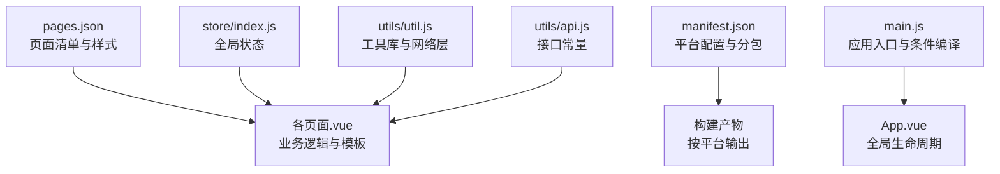
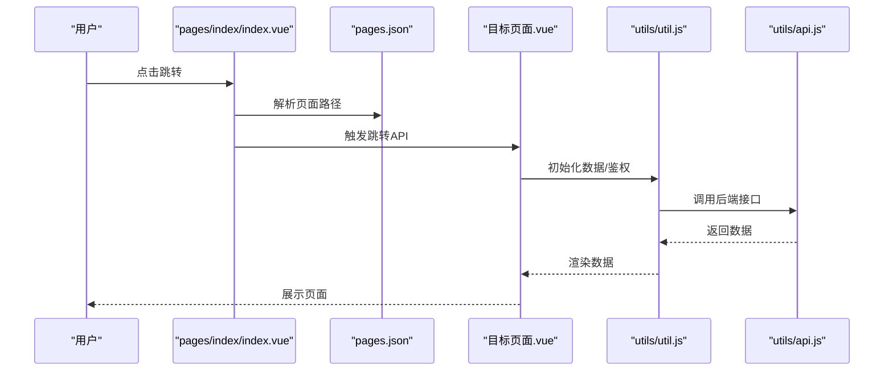
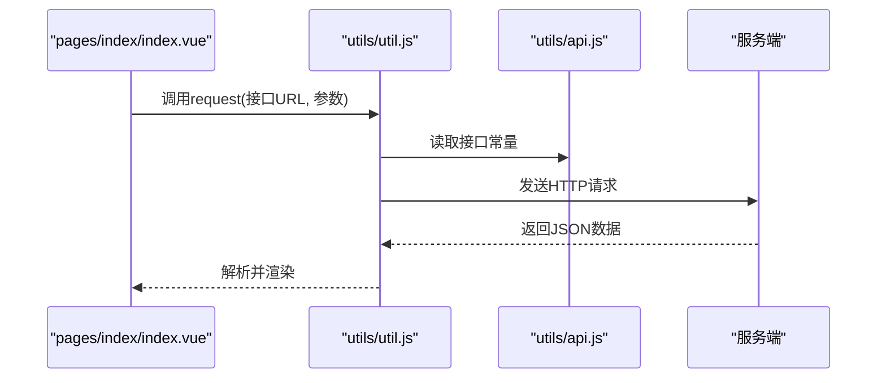
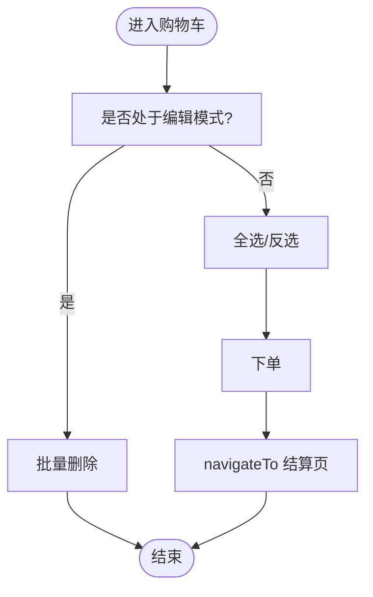
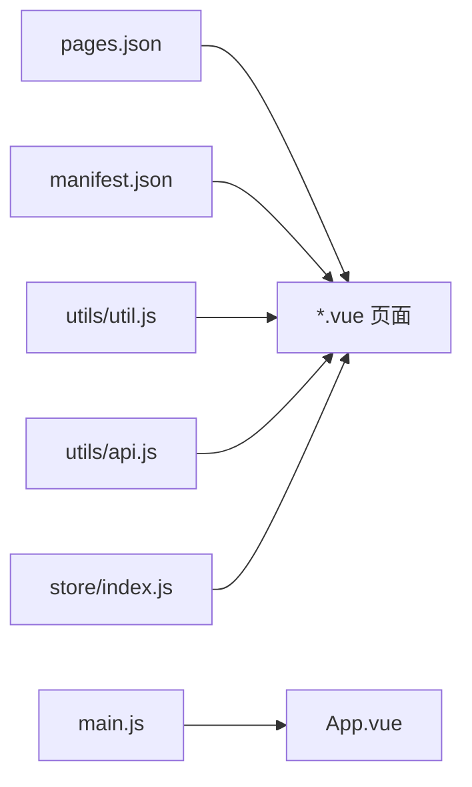

# 页面路由系统

<cite>
**本文引用的文件**
- [uni-mall/pages.json](file://uni-mall/pages.json)
- [uni-mall/App.vue](file://uni-mall/App.vue)
- [uni-mall/main.js](file://uni-mall/main.js)
- [uni-mall/manifest.json](file://uni-mall/manifest.json)
- [uni-mall/store/index.js](file://uni-mall/store/index.js)
- [uni-mall/utils/util.js](file://uni-mall/utils/util.js)
- [uni-mall/utils/api.js](file://uni-mall/utils/api.js)
- [uni-mall/pages/index/index.vue](file://uni-mall/pages/index/index.vue)
- [uni-mall/pages/ucenter/index/index.vue](file://uni-mall/pages/ucenter/index/index.vue)
- [uni-mall/pages/cart/cart.vue](file://uni-mall/pages/cart/cart.vue)
- [uni-mall/pages/catalog/catalog.vue](file://uni-mall/pages/catalog/catalog.vue)
</cite>

## 目录
1. [简介](#简介)
2. [项目结构](#项目结构)
3. [核心组件](#核心组件)
4. [架构总览](#架构总览)
5. [详细组件分析](#详细组件分析)
6. [依赖关系分析](#依赖关系分析)
7. [性能考虑](#性能考虑)
8. [故障排查指南](#故障排查指南)
9. [结论](#结论)
10. [附录](#附录)

## 简介
本文件面向UniApp开发者，系统性梳理“微同商城”项目的页面路由体系，围绕以下主题展开：
- pages.json配置详解：pages页面配置、globalStyle全局样式、tabBar底部导航、subPackages分包策略
- 页面路径映射与跳转方式：navigateTo、redirectTo、switchTab、navigateBack等
- 条件编译与平台适配：H5、小程序、App-Plus等平台差异
- 生命周期与页面栈管理：页面生命周期钩子、页面栈深度控制
- 导航栏与标题栏定制：导航栏背景、文字颜色、下拉刷新、上拉触底
- 页面通信与状态管理：全局事件总线、Vuex状态共享
- 最佳实践、性能优化与常见问题

## 项目结构
本项目采用标准UniApp工程组织，前端路由由pages.json集中声明，页面通过相对路径进行跳转，平台特性通过manifest.json与条件编译实现差异化。

图表来源
- [uni-mall/pages.json](file://uni-mall/pages.json)
- [uni-mall/manifest.json](file://uni-mall/manifest.json)
- [uni-mall/main.js](file://uni-mall/main.js)
- [uni-mall/App.vue](file://uni-mall/App.vue)
- [uni-mall/store/index.js](file://uni-mall/store/index.js)
- [uni-mall/utils/util.js](file://uni-mall/utils/util.js)
- [uni-mall/utils/api.js](file://uni-mall/utils/api.js)

章节来源
- [uni-mall/pages.json](file://uni-mall/pages.json)
- [uni-mall/manifest.json](file://uni-mall/manifest.json)
- [uni-mall/main.js](file://uni-mall/main.js)
- [uni-mall/App.vue](file://uni-mall/App.vue)

## 核心组件
- pages.json：统一声明页面路径、样式、tabBar与全局样式
- manifest.json：平台级配置、分包与插件声明
- App.vue：应用生命周期与全局错误处理
- main.js：应用入口、条件编译与全局事件总线
- store/index.js：全局状态（网络状态等）
- utils/util.js：封装请求、弹窗、登录、支付等通用能力
- utils/api.js：接口URL常量，便于统一维护

章节来源
- [uni-mall/pages.json](file://uni-mall/pages.json)
- [uni-mall/manifest.json](file://uni-mall/manifest.json)
- [uni-mall/App.vue](file://uni-mall/App.vue)
- [uni-mall/main.js](file://uni-mall/main.js)
- [uni-mall/store/index.js](file://uni-mall/store/index.js)
- [uni-mall/utils/util.js](file://uni-mall/utils/util.js)
- [uni-mall/utils/api.js](file://uni-mall/utils/api.js)

## 架构总览
UniApp路由在编译期将pages.json解析为页面清单，在运行期通过API实现页面跳转与栈管理。不同平台在渲染引擎、导航栏、下拉刷新等方面存在差异，通过条件编译与平台键实现适配。

图表来源
- [uni-mall/pages/index/index.vue](file://uni-mall/pages/index/index.vue)
- [uni-mall/pages.json](file://uni-mall/pages.json)
- [uni-mall/utils/util.js](file://uni-mall/utils/util.js)
- [uni-mall/utils/api.js](file://uni-mall/utils/api.js)

## 详细组件分析

### pages.json配置详解
- pages页面配置
  - path：页面路径，从根目录开始，不带扩展名
  - style：页面样式，支持导航栏标题、背景、文字颜色、下拉刷新、上拉触底距离等
  - 平台键：mp-weixin、app-plus、mp-alipay、mp-baidu等，用于平台特定样式与行为
- globalStyle全局样式
  - 设置默认导航栏标题、背景、文字风格、下拉刷新开关
- tabBar底部导航
  - backgroundColor、borderStyle、selectedColor、color
  - list数组：pagePath、iconPath、selectedIconPath、text
- subPackages分包
  - 在manifest.json中定义独立分包，提升首屏加载性能

章节来源
- [uni-mall/pages.json](file://uni-mall/pages.json)
- [uni-mall/manifest.json](file://uni-mall/manifest.json)

### 页面路径映射与跳转方式
- 相对路径与绝对路径
  - 绝对路径以“/”开头，从pages根目录解析
  - 相对路径基于当前页面目录解析
- 常见跳转API
  - navigateTo：保留当前页，打开新页
  - redirectTo：关闭当前页，打开新页
  - switchTab：跳转至tabBar页面
  - navigateBack：关闭当前页或多页返回
- 示例
  - 首页到专题：使用switchTab跳转至tabBar页面
  - 购物车下单：使用navigateTo跳转至结算页
  - 退出登录：使用switchTab回到首页

章节来源
- [uni-mall/pages/index/index.vue](file://uni-mall/pages/index/index.vue)
- [uni-mall/pages/cart/cart.vue](file://uni-mall/pages/cart/cart.vue)
- [uni-mall/pages/ucenter/index/index.vue](file://uni-mall/pages/ucenter/index/index.vue)

### 条件编译与平台适配
- 条件编译宏
  - H5、APP-PLUS、MP-WEIXIN、MP-ALIPAY、MP-BAIDU、MP-TOUTIAO等
- 实践要点
  - 在main.js中对H5环境进行特殊处理
  - 在utils/util.js中针对不同平台进行能力检测与降级
  - 在pages.json与manifest.json中通过平台键配置导航栏与滚动行为

章节来源
- [uni-mall/main.js](file://uni-mall/main.js)
- [uni-mall/utils/util.js](file://uni-mall/utils/util.js)
- [uni-mall/pages.json](file://uni-mall/pages.json)
- [uni-mall/manifest.json](file://uni-mall/manifest.json)

### 页面生命周期与页面栈管理
- 页面生命周期
  - onLoad/onShow/onReady/onHide/onUnload：页面进入、显示、就绪、隐藏、卸载
  - onPullDownRefresh/onReachBottom：下拉刷新与上拉触底
- 页面栈管理
  - 使用navigateBack(delta)控制返回层级
  - 在工具层对未登录场景进行统一处理（跳转授权页或首页）

章节来源
- [uni-mall/pages/index/index.vue](file://uni-mall/pages/index/index.vue)
- [uni-mall/pages/cart/cart.vue](file://uni-mall/pages/cart/cart.vue)
- [uni-mall/pages/ucenter/index/index.vue](file://uni-mall/pages/ucenter/index/index.vue)
- [uni-mall/utils/util.js](file://uni-mall/utils/util.js)

### 导航栏与标题栏定制
- 导航栏属性
  - navigationBarTitleText、navigationBarBackgroundColor、navigationBarTextStyle
  - enablePullDownRefresh、onReachBottomDistance
- 平台差异
  - app-plus支持bounce、titleNView等原生特性
  - mp-weixin、mp-alipay、mp-baidu支持各自平台键进行差异化配置

章节来源
- [uni-mall/pages.json](file://uni-mall/pages.json)

### 页面通信与状态管理
- 全局事件总线
  - 在main.js中初始化$eventHub，跨页面广播/订阅事件
- 全局状态
  - store/index.js维护网络状态等全局变量，通过mutations更新
- 页面间传参
  - 通过URL参数传递简单数据
  - 通过全局状态或本地缓存传递复杂数据

章节来源
- [uni-mall/main.js](file://uni-mall/main.js)
- [uni-mall/store/index.js](file://uni-mall/store/index.js)

### API工作流（以首页为例）

图表来源
- [uni-mall/pages/index/index.vue](file://uni-mall/pages/index/index.vue)
- [uni-mall/utils/util.js](file://uni-mall/utils/util.js)
- [uni-mall/utils/api.js](file://uni-mall/utils/api.js)

### 页面跳转流程（以购物车为例）

图表来源
- [uni-mall/pages/cart/cart.vue](file://uni-mall/pages/cart/cart.vue)

## 依赖关系分析
- pages.json与页面文件
  - pages.json声明的path需与实际.vue文件路径一致
- manifest.json与分包
  - subPackages独立分包可显著降低主包体积
- 工具层依赖
  - 页面依赖utils/util.js与utils/api.js进行网络请求与UI交互
- 全局状态
  - store/index.js被多个页面共享，避免重复请求与状态漂移

图表来源
- [uni-mall/pages.json](file://uni-mall/pages.json)
- [uni-mall/manifest.json](file://uni-mall/manifest.json)
- [uni-mall/utils/util.js](file://uni-mall/utils/util.js)
- [uni-mall/utils/api.js](file://uni-mall/utils/api.js)
- [uni-mall/store/index.js](file://uni-mall/store/index.js)
- [uni-mall/main.js](file://uni-mall/main.js)
- [uni-mall/App.vue](file://uni-mall/App.vue)

章节来源
- [uni-mall/pages.json](file://uni-mall/pages.json)
- [uni-mall/manifest.json](file://uni-mall/manifest.json)
- [uni-mall/utils/util.js](file://uni-mall/utils/util.js)
- [uni-mall/utils/api.js](file://uni-mall/utils/api.js)
- [uni-mall/store/index.js](file://uni-mall/store/index.js)
- [uni-mall/main.js](file://uni-mall/main.js)
- [uni-mall/App.vue](file://uni-mall/App.vue)

## 性能考虑
- 分包策略
  - 将不常用或独立功能放入subPackages，减少首屏资源
- 下拉刷新与上拉触底
  - 合理设置enablePullDownRefresh与onReachBottomDistance，避免频繁请求
- 图片与静态资源
  - 使用CDN与懒加载，减少首屏压力
- 网络监听
  - H5环境下监听网络状态变化，及时提示用户

章节来源
- [uni-mall/manifest.json](file://uni-mall/manifest.json)
- [uni-mall/main.js](file://uni-mall/main.js)
- [uni-mall/pages/catalog/catalog.vue](file://uni-mall/pages/catalog/catalog.vue)

## 故障排查指南
- 登录态异常
  - 当接口返回401时，统一跳转授权页或首页，必要时回退到tabBar首页
- 网络异常
  - 统一toast提示与错误上报，H5环境可结合网络监听
- 平台差异导致的问题
  - 使用条件编译屏蔽不支持的API，或提供降级方案
- 页面栈异常
  - 对navigateBack失败时，兜底switchTab回到首页

章节来源
- [uni-mall/utils/util.js](file://uni-mall/utils/util.js)
- [uni-mall/App.vue](file://uni-mall/App.vue)

## 结论
本项目通过pages.json集中管理页面与样式，借助manifest.json实现分包与平台适配，配合工具层与全局状态，形成清晰、可维护的路由体系。遵循本文的最佳实践与排障建议，可在多端稳定运行并持续优化用户体验。

## 附录
- 页面跳转与生命周期参考
  - 首页：下拉刷新、分享、登录态初始化
  - 我的：用户信息展示、菜单跳转、退出登录
  - 购物车：编辑/删除、数量变更、下单
  - 分类页：导航切换、商品列表展示

章节来源
- [uni-mall/pages/index/index.vue](file://uni-mall/pages/index/index.vue)
- [uni-mall/pages/ucenter/index/index.vue](file://uni-mall/pages/ucenter/index/index.vue)
- [uni-mall/pages/cart/cart.vue](file://uni-mall/pages/cart/cart.vue)
- [uni-mall/pages/catalog/catalog.vue](file://uni-mall/pages/catalog/catalog.vue)