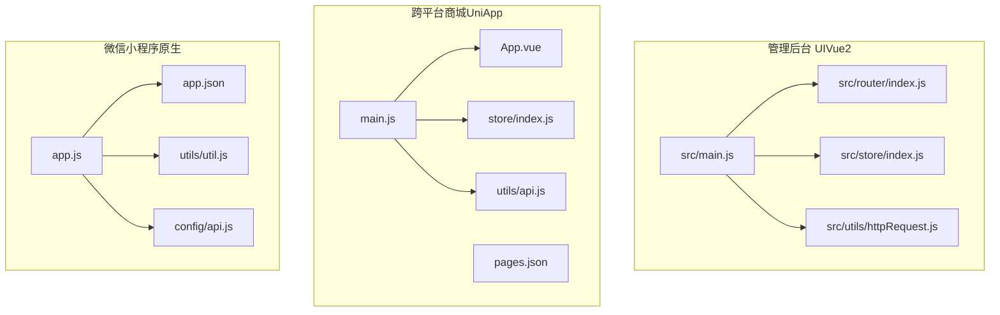
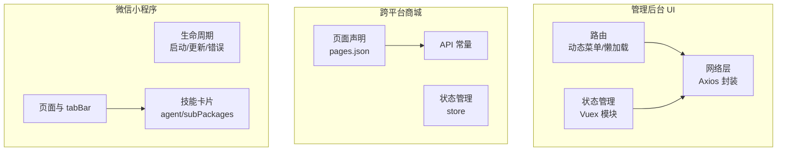
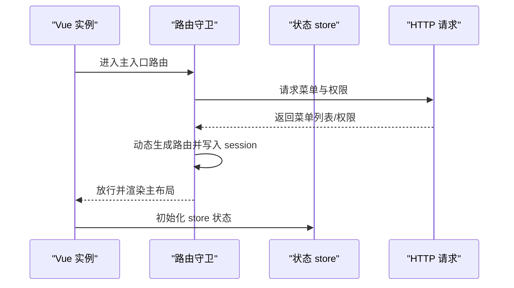
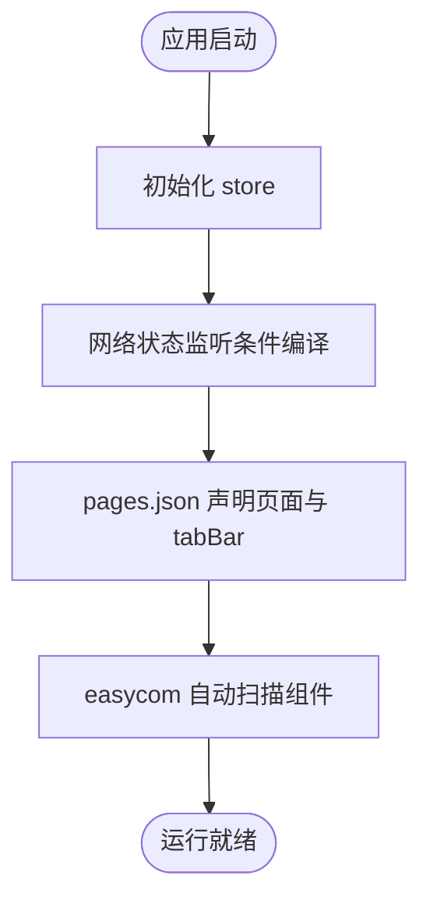
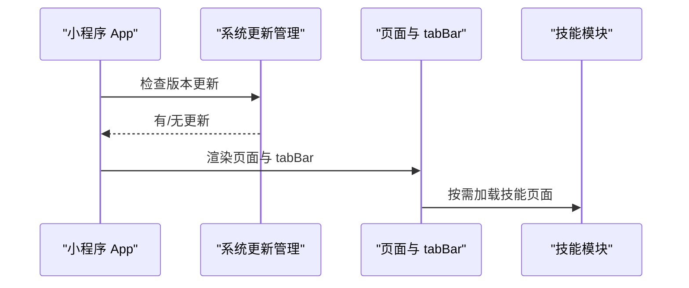
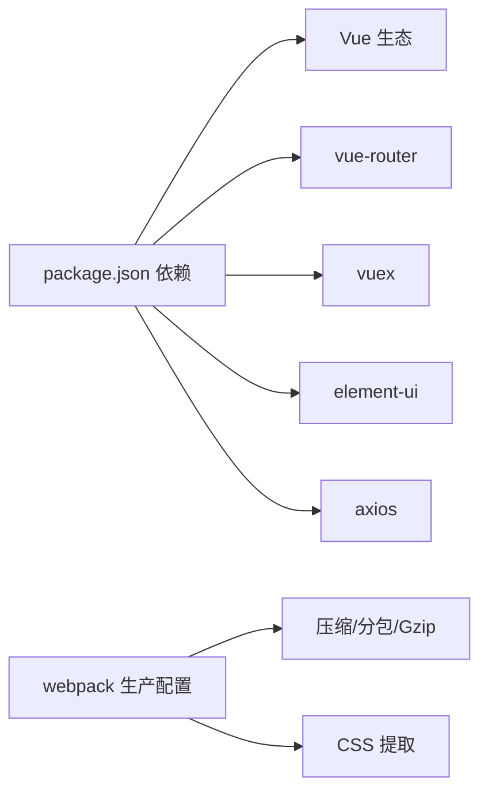

# 前端架构设计

<cite>
**本文引用的文件**   
- [platform-admin-ui/package.json](file://platform-admin-ui/package.json)
- [platform-admin-ui/src/main.js](file://platform-admin-ui/src/main.js)
- [platform-admin-ui/src/App.vue](file://platform-admin-ui/src/App.vue)
- [platform-admin-ui/src/router/index.js](file://platform-admin-ui/src/router/index.js)
- [platform-admin-ui/src/store/index.js](file://platform-admin-ui/src/store/index.js)
- [platform-admin-ui/src/store/modules/common.js](file://platform-admin-ui/src/store/modules/common.js)
- [platform-admin-ui/src/store/modules/user.js](file://platform-admin-ui/src/store/modules/user.js)
- [platform-admin-ui/src/utils/httpRequest.js](file://platform-admin-ui/src/utils/httpRequest.js)
- [uni-mall/main.js](file://uni-mall/main.js)
- [uni-mall/App.vue](file://uni-mall/App.vue)
- [uni-mall/pages.json](file://uni-mall/pages.json)
- [uni-mall/store/index.js](file://uni-mall/store/index.js)
- [uni-mall/utils/api.js](file://uni-mall/utils/api.js)
- [uni-mall/utils/util.js](file://uni-mall/utils/util.js)
- [wx-mall/app.js](file://wx-mall/app.js)
- [wx-mall/app.json](file://wx-mall/app.json)
- [wx-mall/utils/util.js](file://wx-mall/utils/util.js)
- [wx-mall/config/api.js](file://wx-mall/config/api.js)
- [platform-admin-ui/build/webpack.prod.conf.js](file://platform-admin-ui/build/webpack.prod.conf.js)
</cite>

## 目录
1. [引言](#引言)
2. [项目结构](#项目结构)
3. [核心组件](#核心组件)
4. [架构总览](#架构总览)
5. [详细组件分析](#详细组件分析)
6. [依赖关系分析](#依赖关系分析)
7. [性能考量](#性能考量)
8. [故障排查指南](#故障排查指南)
9. [结论](#结论)
10. [附录](#附录)

## 引言
本文件面向前端开发者与架构师，系统性梳理平台多端前端解决方案的整体设计与实现要点，覆盖以下三个子项目：
- 平台管理后台 UI（Vue2 + Element UI）：路由、状态管理、组件化与通用工具链
- 跨平台商城（UniApp）：多端适配、页面与组件体系、状态管理与网络层
- 微信小程序（原生）：页面生命周期、微信 API 集成、技能卡片系统

文档从架构视角出发，结合代码级关系图与流程图，给出构建、打包、部署与优化策略，以及组件开发规范与用户体验建议。

## 项目结构
多端前端由三个独立工程组成，分别服务于管理后台、跨平台商城与微信小程序。它们共享统一的后端服务，前端通过各自封装的 API 层与后端交互。

图表来源
- [platform-admin-ui/src/main.js:1-80](file://platform-admin-ui/src/main.js#L1-L80)
- [platform-admin-ui/src/router/index.js:1-203](file://platform-admin-ui/src/router/index.js#L1-L203)
- [platform-admin-ui/src/store/index.js:1-28](file://platform-admin-ui/src/store/index.js#L1-L28)
- [platform-admin-ui/src/utils/httpRequest.js:1-97](file://platform-admin-ui/src/utils/httpRequest.js#L1-L97)
- [uni-mall/main.js:1-29](file://uni-mall/main.js#L1-L29)
- [uni-mall/App.vue:1-72](file://uni-mall/App.vue#L1-L72)
- [uni-mall/pages.json:1-385](file://uni-mall/pages.json#L1-L385)
- [uni-mall/store/index.js:1-21](file://uni-mall/store/index.js#L1-L21)
- [uni-mall/utils/api.js:1-81](file://uni-mall/utils/api.js#L1-L81)
- [wx-mall/app.js:1-96](file://wx-mall/app.js#L1-L96)
- [wx-mall/app.json:1-136](file://wx-mall/app.json#L1-L136)
- [wx-mall/utils/util.js:1-132](file://wx-mall/utils/util.js#L1-L132)
- [wx-mall/config/api.js:1-84](file://wx-mall/config/api.js#L1-L84)

章节来源
- [platform-admin-ui/src/main.js:1-80](file://platform-admin-ui/src/main.js#L1-L80)
- [uni-mall/main.js:1-29](file://uni-mall/main.js#L1-L29)
- [wx-mall/app.js:1-96](file://wx-mall/app.js#L1-L96)

## 核心组件
- 管理后台 UI
  - 路由：基于 vue-router 的静态与动态菜单路由，支持按需懒加载与 iframe 嵌套
  - 状态：Vuex 模块化管理，包含通用布局、用户信息等
  - 网络：Axios 封装，统一拦截器、超时与错误提示
  - 组件：Element UI 集成与自定义组件扩展
- 跨平台商城（UniApp）
  - 多端适配：条件编译、平台差异化样式与行为
  - 页面与组件：pages.json 声明式页面与 easycom 自动扫描
  - 状态：全局 store 记录网络状态
  - 网络：统一 API 常量与工具函数
- 微信小程序（原生）
  - 生命周期：启动、更新、下拉刷新、错误捕获
  - 页面与组件：app.json 声明页面与 tabBar
  - 网络：封装 request、登录、会话检查等工具
  - 技能卡片：通过 app.json 的 agent 与 subPackages 实现技能模块化

章节来源
- [platform-admin-ui/src/router/index.js:1-203](file://platform-admin-ui/src/router/index.js#L1-L203)
- [platform-admin-ui/src/store/index.js:1-28](file://platform-admin-ui/src/store/index.js#L1-L28)
- [platform-admin-ui/src/store/modules/common.js:1-71](file://platform-admin-ui/src/store/modules/common.js#L1-L71)
- [platform-admin-ui/src/store/modules/user.js:1-16](file://platform-admin-ui/src/store/modules/user.js#L1-L16)
- [platform-admin-ui/src/utils/httpRequest.js:1-97](file://platform-admin-ui/src/utils/httpRequest.js#L1-L97)
- [uni-mall/main.js:1-29](file://uni-mall/main.js#L1-L29)
- [uni-mall/pages.json:1-385](file://uni-mall/pages.json#L1-L385)
- [uni-mall/store/index.js:1-21](file://uni-mall/store/index.js#L1-L21)
- [uni-mall/utils/api.js:1-81](file://uni-mall/utils/api.js#L1-L81)
- [wx-mall/app.js:1-96](file://wx-mall/app.js#L1-L96)
- [wx-mall/app.json:1-136](file://wx-mall/app.json#L1-L136)
- [wx-mall/utils/util.js:1-132](file://wx-mall/utils/util.js#L1-L132)
- [wx-mall/config/api.js:1-84](file://wx-mall/config/api.js#L1-L84)

## 架构总览
三端架构围绕“统一后端 + 多端前端”的模式展开，前端通过各自的网络层与后端交互，管理后台强调菜单驱动的动态路由，跨平台商城强调多端一致体验与条件编译，微信小程序强调原生能力与技能卡片扩展。

图表来源
- [platform-admin-ui/src/router/index.js:1-203](file://platform-admin-ui/src/router/index.js#L1-L203)
- [platform-admin-ui/src/store/index.js:1-28](file://platform-admin-ui/src/store/index.js#L1-L28)
- [platform-admin-ui/src/utils/httpRequest.js:1-97](file://platform-admin-ui/src/utils/httpRequest.js#L1-L97)
- [uni-mall/pages.json:1-385](file://uni-mall/pages.json#L1-L385)
- [uni-mall/store/index.js:1-21](file://uni-mall/store/index.js#L1-L21)
- [uni-mall/utils/api.js:1-81](file://uni-mall/utils/api.js#L1-L81)
- [wx-mall/app.js:1-96](file://wx-mall/app.js#L1-L96)
- [wx-mall/app.json:1-136](file://wx-mall/app.json#L1-L136)

## 详细组件分析

### 管理后台 UI（Vue2 + Element UI）
- 入口与全局挂载
  - 在入口文件中引入路由、状态、Element UI、图标、样式与第三方插件，并将常用工具方法挂载到 Vue 原型
- 路由与权限
  - 使用 hash 模式，全局路由与主入口路由分离；在进入主入口前校验 token，并动态注入菜单路由
  - 支持 iframe 嵌套外部链接，支持通过 meta 控制 tab 展示
- 状态管理
  - 模块化组织 common、user、message、wxUserTags；提供重置 store 的 mutation
- 网络层
  - Axios 默认配置、请求/响应拦截器、错误提示与 401 处理；根据环境决定请求前缀

图表来源
- [platform-admin-ui/src/router/index.js:91-127](file://platform-admin-ui/src/router/index.js#L91-L127)
- [platform-admin-ui/src/store/index.js:11-27](file://platform-admin-ui/src/store/index.js#L11-L27)
- [platform-admin-ui/src/utils/httpRequest.js:24-61](file://platform-admin-ui/src/utils/httpRequest.js#L24-L61)

章节来源
- [platform-admin-ui/src/main.js:1-80](file://platform-admin-ui/src/main.js#L1-L80)
- [platform-admin-ui/src/router/index.js:1-203](file://platform-admin-ui/src/router/index.js#L1-L203)
- [platform-admin-ui/src/store/index.js:1-28](file://platform-admin-ui/src/store/index.js#L1-L28)
- [platform-admin-ui/src/store/modules/common.js:1-71](file://platform-admin-ui/src/store/modules/common.js#L1-L71)
- [platform-admin-ui/src/store/modules/user.js:1-16](file://platform-admin-ui/src/store/modules/user.js#L1-L16)
- [platform-admin-ui/src/utils/httpRequest.js:1-97](file://platform-admin-ui/src/utils/httpRequest.js#L1-L97)

### 跨平台商城（UniApp）
- 入口与全局事件
  - 在入口文件中初始化 store、网络状态监听（条件编译），并挂载事件总线
- 页面与组件体系
  - pages.json 声明页面与 tabBar，支持平台差异化样式（如 app-plus bounce、mp-* 平台开关）
  - easycom 自动扫描与命名规则，简化组件引用
- 状态管理
  - store 记录 app 版本与网络连接状态，提供变更 mutation
- 网络层
  - API 常量集中管理，便于替换与维护

图表来源
- [uni-mall/main.js:1-29](file://uni-mall/main.js#L1-L29)
- [uni-mall/pages.json:1-385](file://uni-mall/pages.json#L1-L385)
- [uni-mall/store/index.js:1-21](file://uni-mall/store/index.js#L1-L21)
- [uni-mall/utils/api.js:1-81](file://uni-mall/utils/api.js#L1-L81)

章节来源
- [uni-mall/main.js:1-29](file://uni-mall/main.js#L1-L29)
- [uni-mall/App.vue:1-72](file://uni-mall/App.vue#L1-L72)
- [uni-mall/pages.json:1-385](file://uni-mall/pages.json#L1-L385)
- [uni-mall/store/index.js:1-21](file://uni-mall/store/index.js#L1-L21)
- [uni-mall/utils/api.js:1-81](file://uni-mall/utils/api.js#L1-L81)

### 微信小程序（原生）
- 生命周期与更新
  - 启动时检查更新管理器，提供更新提示与失败处理
  - 下拉刷新与错误捕获，增强稳定性
- 页面与 tabBar
  - app.json 声明页面与 tabBar，支持全局样式与下拉刷新
- 网络层
  - 封装 request、登录、会话检查、Toast 工具
- 技能卡片系统
  - 通过 agent 与 subPackages 将技能模块独立拆分，提升可维护性与按需加载能力

图表来源
- [wx-mall/app.js:1-96](file://wx-mall/app.js#L1-L96)
- [wx-mall/app.json:1-136](file://wx-mall/app.json#L1-L136)
- [wx-mall/utils/util.js:1-132](file://wx-mall/utils/util.js#L1-L132)

章节来源
- [wx-mall/app.js:1-96](file://wx-mall/app.js#L1-L96)
- [wx-mall/app.json:1-136](file://wx-mall/app.json#L1-L136)
- [wx-mall/utils/util.js:1-132](file://wx-mall/utils/util.js#L1-L132)
- [wx-mall/config/api.js:1-84](file://wx-mall/config/api.js#L1-L84)

## 依赖关系分析
- 管理后台 UI
  - 依赖：vue、vue-router、vuex、element-ui、axios、echarts、vue-clipboard2、vue-cookie 等
  - 构建：webpack 生产配置启用压缩、CSS 提取、分包与 Gzip
- 跨平台商城（UniApp）
  - 依赖：Vue（运行时）、Vuex、条件编译、easycom
  - 构建：基于 HBuilderX/CLI，pages.json 驱动页面清单
- 微信小程序（原生）
  - 依赖：原生 SDK、微信插件、自定义工具函数
  - 构建：微信开发者工具，subPackages 独立打包

图表来源
- [platform-admin-ui/package.json:14-36](file://platform-admin-ui/package.json#L14-L36)
- [platform-admin-ui/build/webpack.prod.conf.js:1-147](file://platform-admin-ui/build/webpack.prod.conf.js#L1-L147)

章节来源
- [platform-admin-ui/package.json:1-102](file://platform-admin-ui/package.json#L1-L102)
- [platform-admin-ui/build/webpack.prod.conf.js:1-147](file://platform-admin-ui/build/webpack.prod.conf.js#L1-L147)

## 性能考量
- 管理后台 UI
  - 分包策略：vendors 缓存组与异步分块，降低首屏体积
  - 代码压缩：移除 console、debugger，剥离注释
  - CSS 优化：CSS 压缩与独立提取
  - 构建产物：哈希模块 ID、作用域提升
- 跨平台商城（UniApp）
  - 条件编译：仅在 H5/MP 平台启用特定逻辑，减少冗余代码
  - easycom：自动扫描组件，避免手动引入，提升开发效率
  - 网络监听：延迟监听网络状态变化，避免频繁触发
- 微信小程序（原生）
  - 懒加载：lazyCodeLoading 与 subPackages 独立包，按需加载技能模块
  - 下拉刷新：统一处理，避免重复请求
  - Toast 与 Loading：封装统一提示，减少重复代码

章节来源
- [platform-admin-ui/build/webpack.prod.conf.js:77-121](file://platform-admin-ui/build/webpack.prod.conf.js#L77-L121)
- [uni-mall/main.js:8-18](file://uni-mall/main.js#L8-L18)
- [wx-mall/app.json:116-133](file://wx-mall/app.json#L116-L133)

## 故障排查指南
- 管理后台 UI
  - 登录态失效：响应拦截器检测 401，清空登录信息并跳转登录页
  - 动态路由注入失败：检查菜单接口返回与 sessionStorage 写入
  - 请求异常：统一错误提示与日志输出
- 跨平台商城（UniApp）
  - 网络状态异常：store 中 networkConnected 变更，配合页面提示
  - 条件编译问题：确认平台宏与分支逻辑
- 微信小程序（原生）
  - 登录态过期：封装 checkSession 与 login 流程
  - 更新失败：更新管理器 onUpdatFailed 分支处理
  - 技能模块加载：确认 subPackages 与 agent 配置正确

章节来源
- [platform-admin-ui/src/utils/httpRequest.js:66-94](file://platform-admin-ui/src/utils/httpRequest.js#L66-L94)
- [platform-admin-ui/src/router/index.js:91-127](file://platform-admin-ui/src/router/index.js#L91-L127)
- [uni-mall/store/index.js:13-17](file://uni-mall/store/index.js#L13-L17)
- [wx-mall/utils/util.js:62-93](file://wx-mall/utils/util.js#L62-L93)
- [wx-mall/app.js:59-94](file://wx-mall/app.js#L59-L94)

## 结论
该多端前端方案以“统一后端 + 多端前端”为核心，管理后台强调菜单驱动的动态路由与完善的工具链，跨平台商城注重多端一致性与条件编译，微信小程序聚焦原生能力与技能卡片扩展。通过合理的模块化、状态管理与构建优化，三端在功能与性能上均具备良好可维护性与扩展性。

## 附录
- 组件开发规范
  - 管理后台 UI：遵循 Element UI 组件规范，统一工具方法挂载，避免在组件内直接操作 Cookie 与全局变量
  - 跨平台商城（UniApp）：优先使用 easycom，保持组件命名一致性，利用条件编译屏蔽平台差异
  - 微信小程序（原生）：页面与组件分离，技能模块独立打包，统一网络与提示封装
- 样式管理方案
  - 管理后台 UI：SCSS 变量与混入，Element UI 主题定制
  - 跨平台商城（UniApp）：公共样式抽离，平台差异化样式通过 pages.json 配置
  - 微信小程序（原生）：页面样式与公共样式分离，避免全局污染
- 用户体验优化建议
  - 加载与错误：统一 Loading 与 Toast，提供重试与引导
  - 网络与缓存：弱网提示与降级策略，合理使用 sessionStorage
  - 交互与反馈：统一按钮禁用状态、表单校验与提交反馈