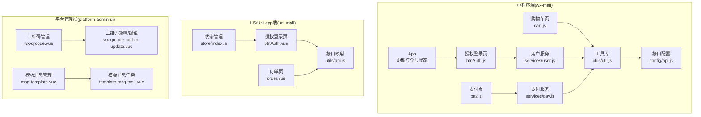
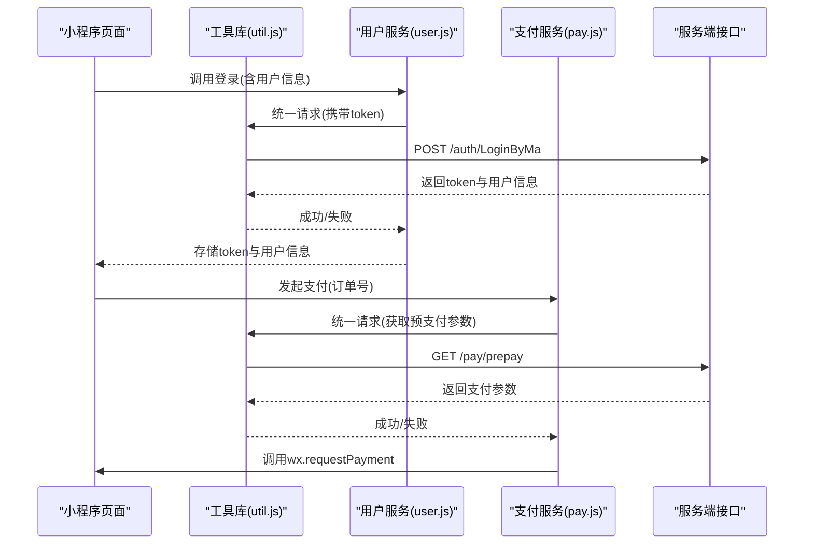
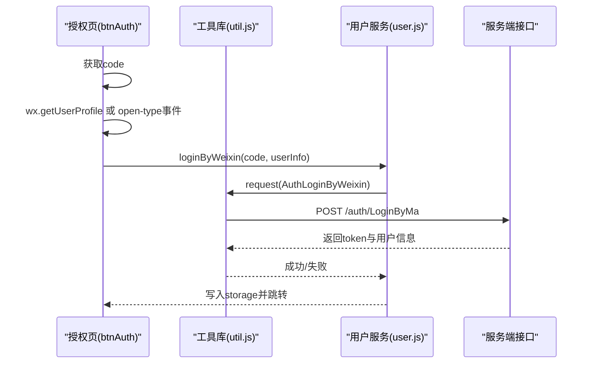
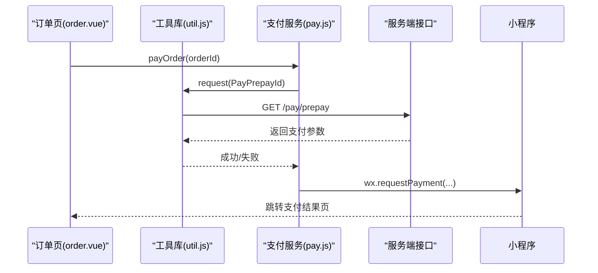
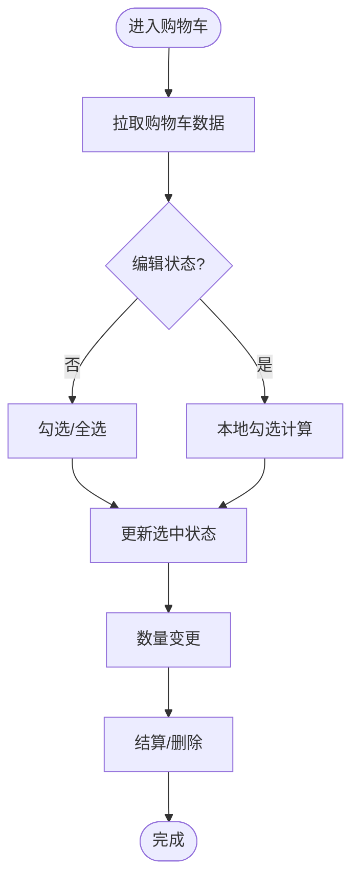
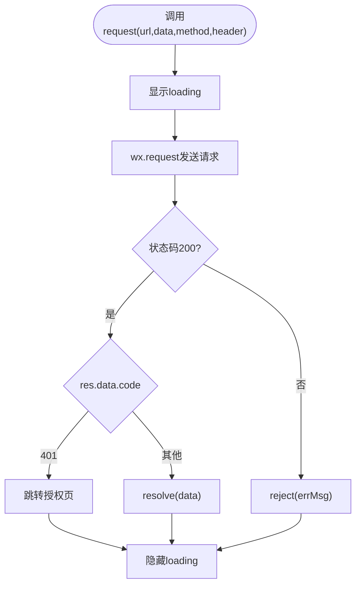
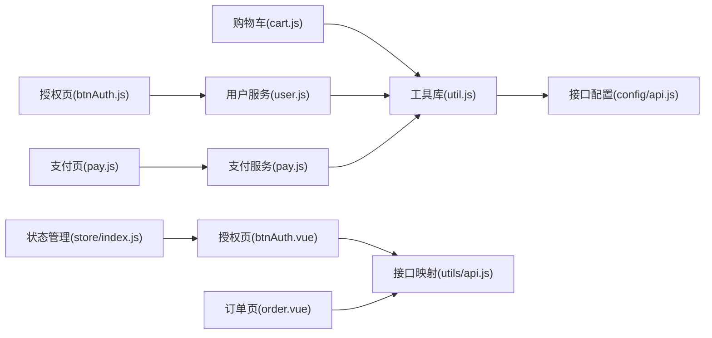

# API接口与微信能力

<cite>
**本文引用的文件**
- [wx-mall/app.js](file://wx-mall/app.js)
- [wx-mall/config/api.js](file://wx-mall/config/api.js)
- [wx-mall/utils/util.js](file://wx-mall/utils/util.js)
- [wx-mall/services/user.js](file://wx-mall/services/user.js)
- [wx-mall/services/pay.js](file://wx-mall/services/pay.js)
- [wx-mall/pages/auth/btnAuth/btnAuth.js](file://wx-mall/pages/auth/btnAuth/btnAuth.js)
- [wx-mall/pages/auth/login/login.js](file://wx-mall/pages/auth/login/login.js)
- [wx-mall/pages/cart/cart.js](file://wx-mall/pages/cart/cart.js)
- [wx-mall/pages/pay/pay.js](file://wx-mall/pages/pay/pay.js)
- [uni-mall/utils/api.js](file://uni-mall/utils/api.js)
- [uni-mall/pages/auth/btnAuth/btnAuth.vue](file://uni-mall/pages/auth/btnAuth/btnAuth.vue)
- [uni-mall/pages/ucenter/order/order.vue](file://uni-mall/pages/ucenter/order/order.vue)
- [uni-mall/store/index.js](file://uni-mall/store/index.js)
- [platform-admin-ui/src/views/modules/wx/wx-qrcode.vue](file://platform-admin-ui/src/views/modules/wx/wx-qrcode.vue)
- [platform-admin-ui/src/views/modules/wx/wx-qrcode-add-or-update.vue](file://platform-admin-ui/src/views/modules/wx/wx-qrcode-add-or-update.vue)
- [platform-admin-ui/src/views/modules/wx/msg-template.vue](file://platform-admin-ui/src/views/modules/wx/msg-template.vue)
- [platform-admin-ui/src/components/template-msg-task.vue](file://platform-admin-ui/src/components/template-msg-task.vue)
</cite>

## 目录
1. [引言](#引言)
2. [项目结构](#项目结构)
3. [核心组件](#核心组件)
4. [架构总览](#架构总览)
5. [详细组件分析](#详细组件分析)
6. [依赖关系分析](#依赖关系分析)
7. [性能考量](#性能考量)
8. [故障排查指南](#故障排查指南)
9. [结论](#结论)
10. [附录](#附录)

## 引言
本文件面向微信小程序与H5混合开发场景，系统梳理并说明小程序侧API接口与微信开放能力的集成方式，覆盖网络请求、文件上传、数据缓存、设备信息、位置服务、支付流程、登录授权、分享转发、二维码生成、模板消息等主题。文档同时给出异步处理、错误处理与重试策略建议、前后端数据交互模式、鉴权与token管理、以及最佳实践与常见问题排查。

## 项目结构
该项目包含三部分：
- 微信小程序工程（wx-mall）：基于原生小程序框架，提供登录、购物车、支付等业务页面与服务模块。
- H5/Uni-app工程（uni-mall）：基于Vue生态，提供登录授权、订单支付流程、以及通用工具库。
- 平台管理前端（platform-admin-ui）：提供二维码与模板消息等微信开放能力的后台管理界面。

图表来源
- [wx-mall/app.js:1-96](file://wx-mall/app.js#L1-L96)
- [wx-mall/pages/auth/btnAuth/btnAuth.js:1-101](file://wx-mall/pages/auth/btnAuth/btnAuth.js#L1-L101)
- [wx-mall/pages/cart/cart.js:1-280](file://wx-mall/pages/cart/cart.js#L1-L280)
- [wx-mall/pages/pay/pay.js:1-62](file://wx-mall/pages/pay/pay.js#L1-L62)
- [wx-mall/services/user.js:1-74](file://wx-mall/services/user.js#L1-L74)
- [wx-mall/services/pay.js:1-44](file://wx-mall/services/pay.js#L1-L44)
- [wx-mall/utils/util.js:1-132](file://wx-mall/utils/util.js#L1-L132)
- [wx-mall/config/api.js:1-84](file://wx-mall/config/api.js#L1-L84)
- [uni-mall/pages/auth/btnAuth/btnAuth.vue:1-217](file://uni-mall/pages/auth/btnAuth/btnAuth.vue#L1-L217)
- [uni-mall/pages/ucenter/order/order.vue:1-196](file://uni-mall/pages/ucenter/order/order.vue#L1-L196)
- [uni-mall/store/index.js:1-20](file://uni-mall/store/index.js#L1-L20)
- [uni-mall/utils/api.js:1-81](file://uni-mall/utils/api.js#L1-L81)
- [platform-admin-ui/src/views/modules/wx/wx-qrcode.vue:1-24](file://platform-admin-ui/src/views/modules/wx/wx-qrcode.vue#L1-L24)
- [platform-admin-ui/src/views/modules/wx/wx-qrcode-add-or-update.vue:1-27](file://platform-admin-ui/src/views/modules/wx/wx-qrcode-add-or-update.vue#L1-L27)
- [platform-admin-ui/src/views/modules/wx/msg-template.vue:122-171](file://platform-admin-ui/src/views/modules/wx/msg-template.vue#L122-L171)
- [platform-admin-ui/src/components/template-msg-task.vue:1-150](file://platform-admin-ui/src/components/template-msg-task.vue#L1-L150)

章节来源
- [wx-mall/app.js:1-96](file://wx-mall/app.js#L1-L96)
- [wx-mall/config/api.js:1-84](file://wx-mall/config/api.js#L1-L84)
- [wx-mall/utils/util.js:1-132](file://wx-mall/utils/util.js#L1-L132)
- [wx-mall/services/user.js:1-74](file://wx-mall/services/user.js#L1-L74)
- [wx-mall/services/pay.js:1-44](file://wx-mall/services/pay.js#L1-L44)
- [wx-mall/pages/auth/btnAuth/btnAuth.js:1-101](file://wx-mall/pages/auth/btnAuth/btnAuth.js#L1-L101)
- [wx-mall/pages/auth/login/login.js:1-106](file://wx-mall/pages/auth/login/login.js#L1-L106)
- [wx-mall/pages/cart/cart.js:1-280](file://wx-mall/pages/cart/cart.js#L1-L280)
- [wx-mall/pages/pay/pay.js:1-62](file://wx-mall/pages/pay/pay.js#L1-L62)
- [uni-mall/pages/auth/btnAuth/btnAuth.vue:1-217](file://uni-mall/pages/auth/btnAuth/btnAuth.vue#L1-L217)
- [uni-mall/pages/ucenter/order/order.vue:1-196](file://uni-mall/pages/ucenter/order/order.vue#L1-L196)
- [uni-mall/store/index.js:1-20](file://uni-mall/store/index.js#L1-L20)
- [uni-mall/utils/api.js:1-81](file://uni-mall/utils/api.js#L1-L81)
- [platform-admin-ui/src/views/modules/wx/wx-qrcode.vue:1-24](file://platform-admin-ui/src/views/modules/wx/wx-qrcode.vue#L1-L24)
- [platform-admin-ui/src/views/modules/wx/wx-qrcode-add-or-update.vue:1-27](file://platform-admin-ui/src/views/modules/wx/wx-qrcode-add-or-update.vue#L1-L27)
- [platform-admin-ui/src/views/modules/wx/msg-template.vue:122-171](file://platform-admin-ui/src/views/modules/wx/msg-template.vue#L122-L171)
- [platform-admin-ui/src/components/template-msg-task.vue:1-150](file://platform-admin-ui/src/components/template-msg-task.vue#L1-L150)

## 核心组件
- 小程序App生命周期与全局状态：负责小程序更新检测、下拉刷新、全局用户信息与token等。
- 授权与登录：统一通过wx.getUserProfile或兼容方案获取用户信息，随后调用登录接口换取token并持久化。
- 网络层封装：统一封装wx.request，自动注入token、统一loading与错误处理。
- 支付流程：从服务端获取预支付参数，调起wx.requestPayment完成支付。
- H5/Uni-app适配：提供与小程序一致的接口映射与工具方法，便于跨端复用。

章节来源
- [wx-mall/app.js:1-96](file://wx-mall/app.js#L1-L96)
- [wx-mall/utils/util.js:20-57](file://wx-mall/utils/util.js#L20-L57)
- [wx-mall/services/user.js:11-38](file://wx-mall/services/user.js#L11-L38)
- [wx-mall/services/pay.js:11-39](file://wx-mall/services/pay.js#L11-L39)
- [uni-mall/utils/api.js:1-81](file://uni-mall/utils/api.js#L1-L81)

## 架构总览
小程序端与H5端通过统一的后端接口进行数据交互，登录态采用token管理；支付流程通过服务端统一下单并下发支付参数；管理端提供二维码与模板消息的后台配置与下发能力。

图表来源
- [wx-mall/services/user.js:11-38](file://wx-mall/services/user.js#L11-L38)
- [wx-mall/services/pay.js:11-39](file://wx-mall/services/pay.js#L11-L39)
- [wx-mall/utils/util.js:20-57](file://wx-mall/utils/util.js#L20-L57)
- [wx-mall/config/api.js:17-39](file://wx-mall/config/api.js#L17-L39)

## 详细组件分析

### 授权与登录流程
- 小程序端：优先使用wx.getUserProfile获取用户信息，再调用登录接口换取token；若不支持则回退至open-type="getUserInfo"事件。
- H5/Uni-app端：使用uni.getUserProfile或兼容方案，逻辑与小程序一致。
- 登录成功后，将token与用户信息写入本地存储，并根据导航URL决定跳转。

图表来源
- [wx-mall/pages/auth/btnAuth/btnAuth.js:30-87](file://wx-mall/pages/auth/btnAuth/btnAuth.js#L30-L87)
- [wx-mall/services/user.js:11-38](file://wx-mall/services/user.js#L11-L38)
- [wx-mall/utils/util.js:20-57](file://wx-mall/utils/util.js#L20-L57)
- [wx-mall/config/api.js:17](file://wx-mall/config/api.js#L17)

章节来源
- [wx-mall/pages/auth/btnAuth/btnAuth.js:1-101](file://wx-mall/pages/auth/btnAuth/btnAuth.js#L1-L101)
- [wx-mall/services/user.js:11-38](file://wx-mall/services/user.js#L11-L38)
- [uni-mall/pages/auth/btnAuth/btnAuth.vue:35-96](file://uni-mall/pages/auth/btnAuth/btnAuth.vue#L35-L96)

### 支付流程
- 小程序端：先请求服务端获取预支付参数，再调用wx.requestPayment发起支付；成功/失败分别跳转结果页。
- H5/Uni-app端：在订单页调用支付服务，内部同样请求预支付参数并发起支付。

图表来源
- [uni-mall/pages/ucenter/order/order.vue:58-67](file://uni-mall/pages/ucenter/order/order.vue#L58-L67)
- [wx-mall/services/pay.js:11-39](file://wx-mall/services/pay.js#L11-L39)
- [wx-mall/utils/util.js:20-57](file://wx-mall/utils/util.js#L20-L57)
- [wx-mall/config/api.js:39](file://wx-mall/config/api.js#L39)

章节来源
- [wx-mall/pages/pay/pay.js:32-60](file://wx-mall/pages/pay/pay.js#L32-L60)
- [wx-mall/services/pay.js:11-39](file://wx-mall/services/pay.js#L11-L39)
- [uni-mall/pages/ucenter/order/order.vue:58-67](file://uni-mall/pages/ucenter/order/order.vue#L58-L67)

### 购物车与下单流程
- 页面加载即拉取购物车数据，支持勾选、编辑、数量变更、删除等操作。
- 选中商品进入结算页，发起下单或直接购买。

图表来源
- [wx-mall/pages/cart/cart.js:40-278](file://wx-mall/pages/cart/cart.js#L40-L278)

章节来源
- [wx-mall/pages/cart/cart.js:1-280](file://wx-mall/pages/cart/cart.js#L1-L280)

### 网络请求与鉴权
- 统一请求封装：自动显示/隐藏loading、注入token、处理401跳转授权页。
- 接口配置：集中维护后端接口地址，支持本地与线上切换。

图表来源
- [wx-mall/utils/util.js:20-57](file://wx-mall/utils/util.js#L20-L57)
- [wx-mall/config/api.js:1-3](file://wx-mall/config/api.js#L1-L3)

章节来源
- [wx-mall/utils/util.js:1-132](file://wx-mall/utils/util.js#L1-L132)
- [wx-mall/config/api.js:1-84](file://wx-mall/config/api.js#L1-L84)

### H5/Uni-app接口映射与工具
- 接口映射：以键值形式定义常用接口名称，便于跨端复用。
- 工具方法：提供请求、上传、延迟等通用能力。

章节来源
- [uni-mall/utils/api.js:1-81](file://uni-mall/utils/api.js#L1-L81)

### 管理端微信能力集成
- 二维码管理：支持临时/永久二维码的新增、编辑与查询，包含有效期与上限提示。
- 模板消息：支持同步微信模板、筛选目标用户、批量发送任务。

章节来源
- [platform-admin-ui/src/views/modules/wx/wx-qrcode.vue:1-24](file://platform-admin-ui/src/views/modules/wx/wx-qrcode.vue#L1-L24)
- [platform-admin-ui/src/views/modules/wx/wx-qrcode-add-or-update.vue:1-27](file://platform-admin-ui/src/views/modules/wx/wx-qrcode-add-or-update.vue#L1-L27)
- [platform-admin-ui/src/views/modules/wx/msg-template.vue:122-171](file://platform-admin-ui/src/views/modules/wx/msg-template.vue#L122-L171)
- [platform-admin-ui/src/components/template-msg-task.vue:100-150](file://platform-admin-ui/src/components/template-msg-task.vue#L100-L150)

## 依赖关系分析
- 页面依赖服务模块与工具库，服务模块再依赖工具库与接口配置。
- H5/Uni-app端通过接口映射与工具库与小程序端保持一致的调用风格。
- 管理端通过HTTP接口与后端交互，实现二维码与模板消息的配置与下发。

图表来源
- [wx-mall/pages/auth/btnAuth/btnAuth.js:1-101](file://wx-mall/pages/auth/btnAuth/btnAuth.js#L1-L101)
- [wx-mall/services/user.js:1-74](file://wx-mall/services/user.js#L1-L74)
- [wx-mall/pages/cart/cart.js:1-280](file://wx-mall/pages/cart/cart.js#L1-L280)
- [wx-mall/pages/pay/pay.js:1-62](file://wx-mall/pages/pay/pay.js#L1-L62)
- [wx-mall/services/pay.js:1-44](file://wx-mall/services/pay.js#L1-L44)
- [wx-mall/utils/util.js:1-132](file://wx-mall/utils/util.js#L1-L132)
- [wx-mall/config/api.js:1-84](file://wx-mall/config/api.js#L1-L84)
- [uni-mall/pages/auth/btnAuth/btnAuth.vue:1-217](file://uni-mall/pages/auth/btnAuth/btnAuth.vue#L1-L217)
- [uni-mall/pages/ucenter/order/order.vue:1-196](file://uni-mall/pages/ucenter/order/order.vue#L1-L196)
- [uni-mall/utils/api.js:1-81](file://uni-mall/utils/api.js#L1-L81)
- [uni-mall/store/index.js:1-20](file://uni-mall/store/index.js#L1-L20)

章节来源
- [wx-mall/app.js:1-96](file://wx-mall/app.js#L1-L96)
- [wx-mall/utils/util.js:1-132](file://wx-mall/utils/util.js#L1-L132)
- [uni-mall/store/index.js:1-20](file://uni-mall/store/index.js#L1-L20)

## 性能考量
- 请求节流与并发控制：对高频接口（如购物车数量变更）应做防抖与合并请求，减少不必要的网络开销。
- 缓存策略：对静态数据（如分类、品牌、首页内容）采用本地缓存与过期策略，降低重复请求。
- 图片与资源：使用CDN与懒加载，避免首屏阻塞。
- 支付流程：仅在必要时请求预支付参数，避免重复调用导致风控风险。
- 错误重试：对弱网环境增加指数退避重试，但需限制最大重试次数与总耗时。

## 故障排查指南
- 登录失败
  - 检查code是否有效、用户信息是否完整、后端是否返回token。
  - 若出现401，确认工具库是否正确跳转授权页。
- 支付失败
  - 核对预支付参数是否齐全、签名是否正确、支付渠道是否可用。
  - 关注wx.requestPayment回调中的fail/complete分支。
- 网络请求异常
  - 查看工具库的loading与toast提示，确认接口地址与token是否正确。
  - 对于401，检查本地storage中的token是否过期或丢失。
- H5/Uni-app差异
  - 注意uni.login与wx.login的差异，确保在不同端使用对应的API。
  - 接口映射与工具方法需保持两端一致。

章节来源
- [wx-mall/utils/util.js:20-57](file://wx-mall/utils/util.js#L20-L57)
- [wx-mall/pages/auth/btnAuth/btnAuth.js:55-87](file://wx-mall/pages/auth/btnAuth/btnAuth.js#L55-L87)
- [wx-mall/pages/pay/pay.js:32-60](file://wx-mall/pages/pay/pay.js#L32-L60)

## 结论
本项目在小程序与H5两端实现了统一的登录、支付与数据交互模式，配合管理端的二维码与模板消息能力，形成了完整的微信生态闭环。通过规范化的工具库与接口映射，提升了跨端一致性与可维护性。建议在生产环境中进一步完善重试与缓存策略、加强异常监控与日志追踪，持续优化用户体验与稳定性。

## 附录
- 最佳实践清单
  - 权限申请：明确声明用途，避免频繁弹窗；优先使用wx.getUserProfile/open-type兼容方案。
  - 用户体验：统一loading与toast提示，提供清晰的错误文案与引导。
  - 兼容性：针对低版本微信客户端进行降级处理与提示。
  - 安全：token安全存储与轮换、签名与验签、敏感字段加密。
  - 性能：接口合并、缓存策略、图片优化、按需加载。