# 微信小程序原生开发

<cite>
**本文档引用的文件**
- [wx-mall/app.json](file://wx-mall/app.json)
- [wx-mall/app.js](file://wx-mall/app.js)
- [wx-mall/pages/index/index.js](file://wx-mall/pages/index/index.js)
- [wx-mall/pages/cart/cart.js](file://wx-mall/pages/cart/cart.js)
- [wx-mall/pages/shopping/checkout/checkout.js](file://wx-mall/pages/shopping/checkout/checkout.js)
- [wx-mall/pages/ucenter/index/index.js](file://wx-mall/pages/ucenter/index/index.js)
- [wx-mall/pages/auth/login/login.js](file://wx-mall/pages/auth/login/login.js)
- [wx-mall/pages/goods/goods.js](file://wx-mall/pages/goods/goods.js)
- [wx-mall/services/user.js](file://wx-mall/services/user.js)
- [wx-mall/services/pay.js](file://wx-mall/services/pay.js)
- [wx-mall/utils/util.js](file://wx-mall/utils/util.js)
- [wx-mall/config/api.js](file://wx-mall/config/api.js)
- [wx-mall/skills/mall-guide-skill/index.js](file://wx-mall/skills/mall-guide-skill/index.js)
- [wx-mall/skills/mall-checkout-skill/index.js](file://wx-mall/skills/mall-checkout-skill/index.js)
- [wx-mall/skills/mall-order-skill/index.js](file://wx-mall/skills/mall-order-skill/index.js)
- [wx-mall/skills/mall-guide-skill/apis/recommendGoods.js](file://wx-mall/skills/mall-guide-skill/apis/recommendGoods.js)
- [wx-mall/skills/mall-guide-skill/apis/searchGoods.js](file://wx-mall/skills/mall-guide-skill/apis/searchGoods.js)
- [wx-mall/skills/mall-guide-skill/apis/getGoodsDetail.js](file://wx-mall/skills/mall-guide-skill/apis/getGoodsDetail.js)
- [wx-mall/skills/mall-checkout-skill/apis/getCartSnapshot.js](file://wx-mall/skills/mall-checkout-skill/apis/getCartSnapshot.js)
- [wx-mall/skills/mall-checkout-skill/apis/prepareCheckout.js](file://wx-mall/skills/mall-checkout-skill/apis/prepareCheckout.js)
- [wx-mall/skills/mall-order-skill/apis/listOrders.js](file://wx-mall/skills/mall-order-skill/apis/listOrders.js)
- [wx-mall/skills/mall-order-skill/apis/getOrderDetail.js](file://wx-mall/skills/mall-order-skill/apis/getOrderDetail.js)
- [wx-mall/components/ai-guide-entry/index.js](file://wx-mall/components/ai-guide-entry/index.js)
- [wx-mall/components/ai-guide-entry/index.json](file://wx-mall/components/ai-guide-entry/index.json)
- [wx-mall/components/ai-guide-entry/index.wxml](file://wx-mall/components/ai-guide-entry/index.wxml)
- [wx-mall/agent/page-meta.json](file://wx-mall/agent/page-meta.json)
- [wx-mall/agent/AGENTS.md](file://wx-mall/agent/AGENTS.md)
- [wx-mall/skills/mall-guide-skill/components/goods-detail-card/index.js](file://wx-mall/skills/mall-guide-skill/components/goods-detail-card/index.js)
- [wx-mall/skills/mall-guide-skill/components/goods-detail-card/index.json](file://wx-mall/skills/mall-guide-skill/components/goods-detail-card/index.json)
- [wx-mall/skills/mall-guide-skill/components/goods-detail-card/index.wxml](file://wx-mall/skills/mall-guide-skill/components/goods-detail-card/index.wxml)
- [wx-mall/skills/mall-guide-skill/components/goods-detail-card/index.wxss](file://wx-mall/skills/mall-guide-skill/components/goods-detail-card/index.wxss)
- [wx-mall/skills/mall-guide-skill/components/goods-list-card/index.js](file://wx-mall/skills/mall-guide-skill/components/goods-list-card/index.js)
- [wx-mall/skills/mall-guide-skill/components/goods-list-card/index.json](file://wx-mall/skills/mall-guide-skill/components/goods-list-card/index.json)
- [wx-mall/skills/mall-guide-skill/components/goods-list-card/index.wxml](file://wx-mall/skills/mall-guide-skill/components/goods-list-card/index.wxml)
- [wx-mall/skills/mall-guide-skill/components/goods-list-card/index.wxss](file://wx-mall/skills/mall-guide-skill/components/goods-list-card/index.wxss)
- [uni-mall/skills/mall-guide-skill/components/goods-detail-card/index.js](file://uni-mall/skills/mall-guide-skill/components/goods-detail-card/index.js)
- [uni-mall/skills/mall-guide-skill/components/goods-detail-card/index.json](file://uni-mall/skills/mall-guide-skill/components/goods-detail-card/index.json)
- [uni-mall/skills/mall-guide-skill/components/goods-detail-card/index.wxml](file://uni-mall/skills/mall-guide-skill/components/goods-detail-card/index.wxml)
- [uni-mall/skills/mall-guide-skill/components/goods-detail-card/index.wxss](file://uni-mall/skills/mall-guide-skill/components/goods-detail-card/index.wxss)
- [README.md](file://README.md)
</cite>

## 更新摘要
**所做更改**
- 新增微信AI功能重要说明章节，详细阐述AI能力开通要求、版本要求和开发工具要求
- 更新AI助手技能架构章节，增加版本兼容性检查和灰度内测说明
- 新增AI功能部署与调试指南，包含微信公众平台配置和版本验证步骤
- 更新性能优化章节，增加AI功能相关的缓存策略和加载优化

## 目录
1. [简介](#简介)
2. [项目结构](#项目结构)
3. [核心组件](#核心组件)
4. [架构总览](#架构总览)
5. [详细组件分析](#详细组件分析)
6. [微信AI功能重要说明](#微信ai功能重要说明)
7. [AI助手技能架构](#ai助手技能架构)
8. [商品卡片组件](#商品卡片组件)
9. [依赖关系分析](#依赖关系分析)
10. [性能与体验优化](#性能与体验优化)
11. [故障排查指南](#故障排查指南)
12. [结论](#结论)
13. [附录](#附录)

## 简介
本文件面向微信小程序原生开发，围绕"仿网易严选"小程序项目，系统梳理小程序的项目结构、页面生命周期、组件体系、API 使用、路由配置、数据绑定与事件处理、状态管理、开放能力集成（如微信登录、支付）、用户授权与本地存储、性能优化策略、服务端对接与错误处理、调试与发布流程，以及组件开发规范与交互最佳实践。内容以仓库现有源码为依据，辅以可视化图表帮助理解。

**更新** 新增微信AI功能重要说明，涵盖AI能力在微信公众平台的开通要求、最低微信版本要求、开发工具基础库版本要求等关键信息。AI助手功能目前处于灰度内测阶段，暂未开放提审，开发者需要特别注意版本兼容性和功能限制。

## 项目结构
该项目采用微信原生小程序目录组织方式，核心目录与职责如下：
- 根目录 app.js、app.json：全局入口与配置（页面列表、导航栏、tabBar、网络超时、分包、插件、智能压缩等）
- pages/*：页面级逻辑与资源（index、cart、checkout、ucenter、auth、goods 等）
- services/*：业务服务封装（用户、支付）
- utils/*：通用工具函数（网络请求、登录态校验、提示）
- config/api.js：统一接口常量定义
- skills/*：模型技能（独立可加载模块，扩展 AI Agent 能力）
- components/ai-guide-entry：AI助手入口组件
- agent/*：AI助手元数据配置
- skills/mall-guide-skill/components：商品卡片组件（新增）
- utils/*：通用工具函数（网络请求、登录态校验、提示）

```mermaid
graph TB
subgraph "小程序应用"
A["app.js<br/>全局生命周期与更新管理"]
B["app.json<br/>页面列表/导航/TabBar/分包/插件/AI助手"]
end
subgraph "页面层"
P1["pages/index/index.js<br/>首页"]
P2["pages/cart/cart.js<br/>购物车"]
P3["pages/shopping/checkout/checkout.js<br/>下单/支付"]
P4["pages/ucenter/index/index.js<br/>个人中心"]
P5["pages/auth/login/login.js<br/>账号登录"]
P6["pages/goods/goods.js<br/>商品详情"]
end
subgraph "服务与工具"
S1["services/user.js<br/>用户服务"]
S2["services/pay.js<br/>支付服务"]
U1["utils/util.js<br/>请求/登录/提示"]
C1["config/api.js<br/>接口常量"]
END
subgraph "AI助手技能"
SK1["skills/mall-guide-skill/<br/>商品推荐/搜索/详情"]
SK2["skills/mall-checkout-skill/<br/>购物车快照/结算预览"]
SK3["skills/mall-order-skill/<br/>订单查询/详情"]
CMP["components/ai-guide-entry/<br/>AI助手入口组件"]
GC["skills/mall-guide-skill/components/<br/>商品卡片组件"]
END
A --> B
B --> P1
B --> P2
B --> P3
B --> P4
B --> P5
B --> P6
P1 --> U1
P2 --> U1
P3 --> U1
P4 --> U1
P5 --> U1
P6 --> U1
P1 --> C1
P2 --> C1
P3 --> C1
P4 --> C1
P5 --> C1
P6 --> C1
P1 --> S1
P4 --> S1
P3 --> S2
P3 --> C1
P3 --> U1
B --> SK1
B --> SK2
B --> SK3
SK1 --> CMP
SK2 --> CMP
SK3 --> CMP
SK1 --> GC
B --> AG["agent/page-meta.json<br/>页面元数据"]
B --> AM["agent/AGENTS.md<br/>AI助手说明"]
SK1 --> MD["Skills/*.md<br/>技能说明文档"]
SK2 --> MD
SK3 --> MD
P2 --> CMP
```

**图表来源**
- [wx-mall/app.json:1-136](file://wx-mall/app.json#L1-L136)
- [wx-mall/app.js:1-96](file://wx-mall/app.js#L1-L96)
- [wx-mall/pages/index/index.js:1-123](file://wx-mall/pages/index/index.js#L1-L123)
- [wx-mall/pages/cart/cart.js:1-280](file://wx-mall/pages/cart/cart.js#L1-L280)
- [wx-mall/pages/shopping/checkout/checkout.js:1-169](file://wx-mall/pages/shopping/checkout/checkout.js#L1-L169)
- [wx-mall/pages/ucenter/index/index.js:1-132](file://wx-mall/pages/ucenter/index/index.js#L1-L132)
- [wx-mall/pages/auth/login/login.js:1-106](file://wx-mall/pages/auth/login/login.js#L1-L106)
- [wx-mall/pages/goods/goods.js:1-421](file://wx-mall/pages/goods/goods.js#L1-L421)
- [wx-mall/services/user.js:1-74](file://wx-mall/services/user.js#L1-L74)
- [wx-mall/services/pay.js:1-44](file://wx-mall/services/pay.js#L1-L44)
- [wx-mall/utils/util.js:1-132](file://wx-mall/utils/util.js#L1-L132)
- [wx-mall/config/api.js:1-84](file://wx-mall/config/api.js#L1-L84)
- [wx-mall/skills/mall-guide-skill/index.js:1-11](file://wx-mall/skills/mall-guide-skill/index.js#L1-L11)
- [wx-mall/skills/mall-checkout-skill/index.js:1-9](file://wx-mall/skills/mall-checkout-skill/index.js#L1-L9)
- [wx-mall/skills/mall-order-skill/index.js:1-9](file://wx-mall/skills/mall-order-skill/index.js#L1-L9)
- [wx-mall/components/ai-guide-entry/index.js:1-109](file://wx-mall/components/ai-guide-entry/index.js#L1-L109)
- [wx-mall/agent/page-meta.json:1-60](file://wx-mall/agent/page-meta.json#L1-L60)
- [wx-mall/agent/AGENTS.md:1-25](file://wx-mall/agent/AGENTS.md#L1-L25)

**章节来源**
- [wx-mall/app.json:1-136](file://wx-mall/app.json#L1-L136)
- [wx-mall/app.js:1-96](file://wx-mall/app.js#L1-L96)

## 核心组件
- 全局应用 App：负责小程序启动、更新机制、全局数据与下拉刷新等
- 页面 Page：各功能页面承载业务逻辑与视图交互
- 服务 Services：用户服务与支付服务抽象
- 工具 Utils：统一请求、登录态校验、提示封装
- 配置 Config：接口常量集中管理
- 自定义组件：空态占位组件、AI助手入口组件
- 商品卡片组件：现代化卡片布局，支持响应式设计和视觉反馈
- 技能 Skills：分包式模型技能，支持按需加载
- AI助手配置：页面元数据、技能注册、分包配置

**更新** 新增微信AI功能说明，包括AI能力在微信公众平台的开通要求、最低微信版本要求、开发工具基础库版本要求等关键配置信息。

**章节来源**
- [wx-mall/app.js:1-96](file://wx-mall/app.js#L1-L96)
- [wx-mall/services/user.js:1-74](file://wx-mall/services/user.js#L1-L74)
- [wx-mall/services/pay.js:1-44](file://wx-mall/services/pay.js#L1-L44)
- [wx-mall/utils/util.js:1-132](file://wx-mall/utils/util.js#L1-L132)
- [wx-mall/config/api.js:1-84](file://wx-mall/config/api.js#L1-L84)
- [wx-mall/components/ai-guide-entry/index.js:1-109](file://wx-mall/components/ai-guide-entry/index.js#L1-L109)
- [wx-mall/skills/mall-guide-skill/components/goods-detail-card/index.js:1-56](file://wx-mall/skills/mall-guide-skill/components/goods-detail-card/index.js#L1-L56)
- [wx-mall/skills/mall-guide-skill/components/goods-list-card/index.js:1-88](file://wx-mall/skills/mall-guide-skill/components/goods-list-card/index.js#L1-L88)
- [README.md:23-28](file://README.md#L23-L28)

## 架构总览
小程序运行于微信客户端，通过 app.json 注册页面与分包，页面通过 Page 构造器编写逻辑，使用 utils 进行网络请求与登录态校验，调用 services 实现用户与支付业务，最终与服务端 API 对接。新增AI助手技能架构通过agent配置和分包机制实现，支持商品推荐、购物车管理和订单查询等智能服务能力。商品卡片组件作为技能模块的重要组成部分，提供现代化的商品展示界面。

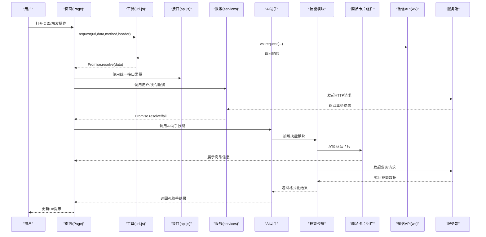

**图表来源**
- [wx-mall/pages/index/index.js:1-123](file://wx-mall/pages/index/index.js#L1-L123)
- [wx-mall/utils/util.js:23-57](file://wx-mall/utils/util.js#L23-L57)
- [wx-mall/config/api.js:5-84](file://wx-mall/config/api.js#L5-L84)
- [wx-mall/services/user.js:11-38](file://wx-mall/services/user.js#L11-L38)
- [wx-mall/services/pay.js:11-39](file://wx-mall/services/pay.js#L11-L39)
- [wx-mall/skills/mall-guide-skill/apis/getGoodsDetail.js:1-42](file://wx-mall/skills/mall-guide-skill/apis/getGoodsDetail.js#L1-L42)
- [wx-mall/skills/mall-guide-skill/components/goods-detail-card/index.js:21-56](file://wx-mall/skills/mall-guide-skill/components/goods-detail-card/index.js#L21-L56)

## 详细组件分析

### 应用生命周期与全局状态
- 启动与更新：在启动阶段检测更新管理器，提供新版本提示与重启应用；同时兼容旧版微信客户端提示
- 下拉刷新：统一在 App 中实现导航栏加载与停止刷新
- 全局数据：维护用户信息、token、优惠券上下文等

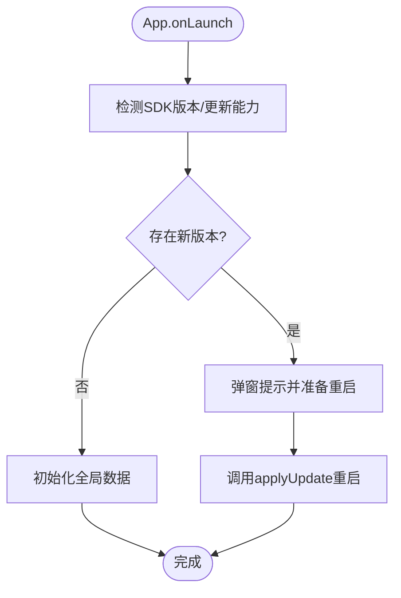

**图表来源**
- [wx-mall/app.js:2-37](file://wx-mall/app.js#L2-L37)
- [wx-mall/app.js:48-57](file://wx-mall/app.js#L48-L57)
- [wx-mall/app.js:58-94](file://wx-mall/app.js#L58-L94)

**章节来源**
- [wx-mall/app.js:1-96](file://wx-mall/app.js#L1-L96)

### 页面路由与配置
- 页面注册：app.json 的 pages 数组声明所有页面路径
- 导航栏与下拉刷新：window 配置背景文案样式、标题、文字颜色、启用下拉刷新
- tabBar：配置底栏页面路径、图标与文本
- 分包与懒加载：subPackages 与 lazyCodeLoading 控制包体与按需加载
- 插件与调试：plugins、debug、sitemapLocation
- AI助手配置：agent配置支持技能注册和页面元数据

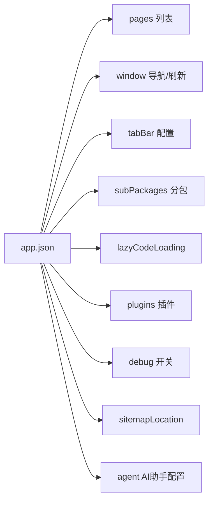

**图表来源**
- [wx-mall/app.json:1-136](file://wx-mall/app.json#L1-L136)

**章节来源**
- [wx-mall/app.json:1-136](file://wx-mall/app.json#L1-L136)

### 首页（index）与数据流
- 生命周期：onLoad 触发登录与首页数据拉取；下拉刷新触发getIndexData
- 数据绑定：data 中聚合新品、热销、专题、品牌、楼层、banner、频道等
- 分享：支持分享给朋友与分享到朋友圈
- 登录：静默登录换取 code 并换取 token 与用户信息，写入本地缓存

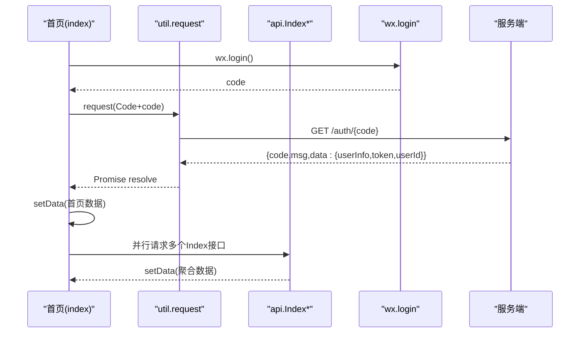

**图表来源**
- [wx-mall/pages/index/index.js:88-109](file://wx-mall/pages/index/index.js#L88-L109)
- [wx-mall/pages/index/index.js:41-87](file://wx-mall/pages/index/index.js#L41-L87)
- [wx-mall/utils/util.js:23-57](file://wx-mall/utils/util.js#L23-L57)
- [wx-mall/config/api.js:5-12](file://wx-mall/config/api.js#L5-L12)

**章节来源**
- [wx-mall/pages/index/index.js:1-123](file://wx-mall/pages/index/index.js#L1-L123)

### 购物车（cart）与状态管理
- 数据结构：cartGoods、cartTotal、isEditCart、checkedAllStatus、editCartList
- 交互：单项/全选、编辑模式切换、数量增减、删除、结算
- 状态同步：本地勾选与服务端勾选保持一致，实时更新合计金额与数量
- 结算入口：过滤已选商品后跳转结算页

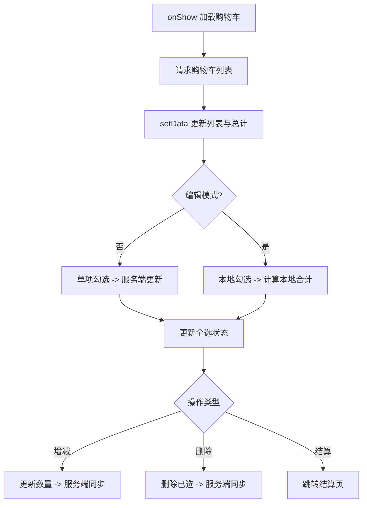

**图表来源**
- [wx-mall/pages/cart/cart.js:40-54](file://wx-mall/pages/cart/cart.js#L40-L54)
- [wx-mall/pages/cart/cart.js:65-98](file://wx-mall/pages/cart/cart.js#L65-L98)
- [wx-mall/pages/cart/cart.js:108-142](file://wx-mall/pages/cart/cart.js#L108-L142)
- [wx-mall/pages/cart/cart.js:171-191](file://wx-mall/pages/cart/cart.js#L171-L191)
- [wx-mall/pages/cart/cart.js:215-235](file://wx-mall/pages/cart/cart.js#L215-L235)
- [wx-mall/pages/cart/cart.js:236-278](file://wx-mall/pages/cart/cart.js#L236-L278)

**章节来源**
- [wx-mall/pages/cart/cart.js:1-280](file://wx-mall/pages/cart/cart.js#L1-L280)

### 结算与支付（checkout）
- 信息加载：根据地址、优惠券、购买类型(cart/buy)获取结算信息
- 地址选择：无默认地址时弹窗引导添加
- 优惠券：从全局上下文读取或跳转选择页
- 提交订单：调用下单接口，成功后发起微信支付，再跳转支付结果页

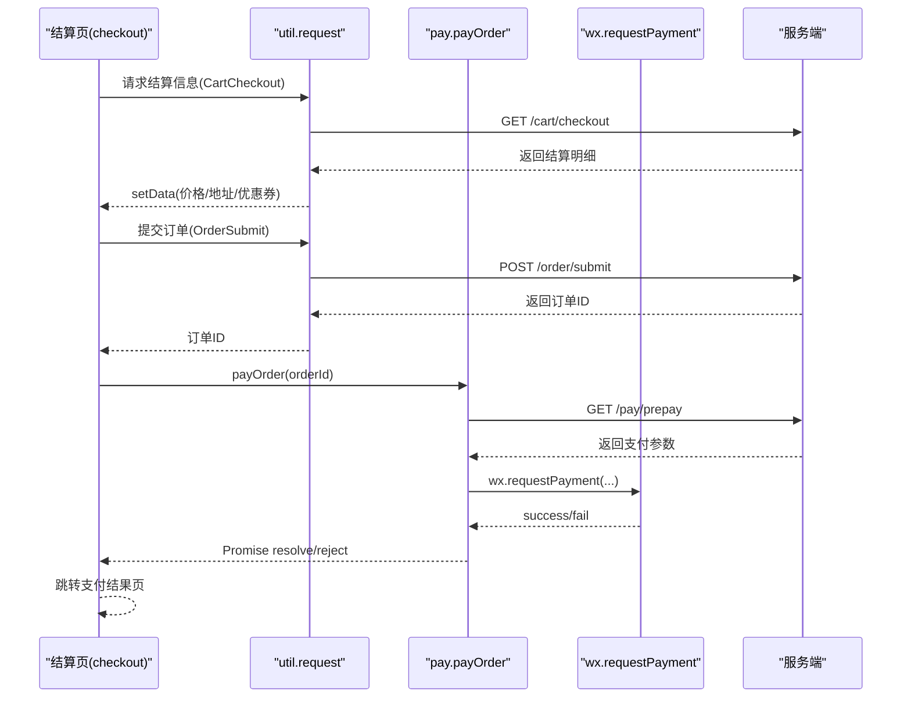

**图表来源**
- [wx-mall/pages/shopping/checkout/checkout.js:37-74](file://wx-mall/pages/shopping/checkout/checkout.js#L37-L74)
- [wx-mall/pages/shopping/checkout/checkout.js:146-167](file://wx-mall/pages/shopping/checkout/checkout.js#L146-L167)
- [wx-mall/services/pay.js:11-39](file://wx-mall/services/pay.js#L11-L39)
- [wx-mall/config/api.js:36-40](file://wx-mall/config/api.js#L36-L40)

**章节来源**
- [wx-mall/pages/shopping/checkout/checkout.js:1-169](file://wx-mall/pages/shopping/checkout/checkout.js#L1-L169)
- [wx-mall/services/pay.js:1-44](file://wx-mall/services/pay.js#L1-L44)

### 用户中心（ucenter/index）与授权
- 用户信息：优先使用本地缓存，否则通过 getUserProfile 或 bindGetUserInfo 获取并登录
- 登录态校验：checkLogin 通过本地 token 与 session 校验
- 退出登录：清理本地缓存并回到首页

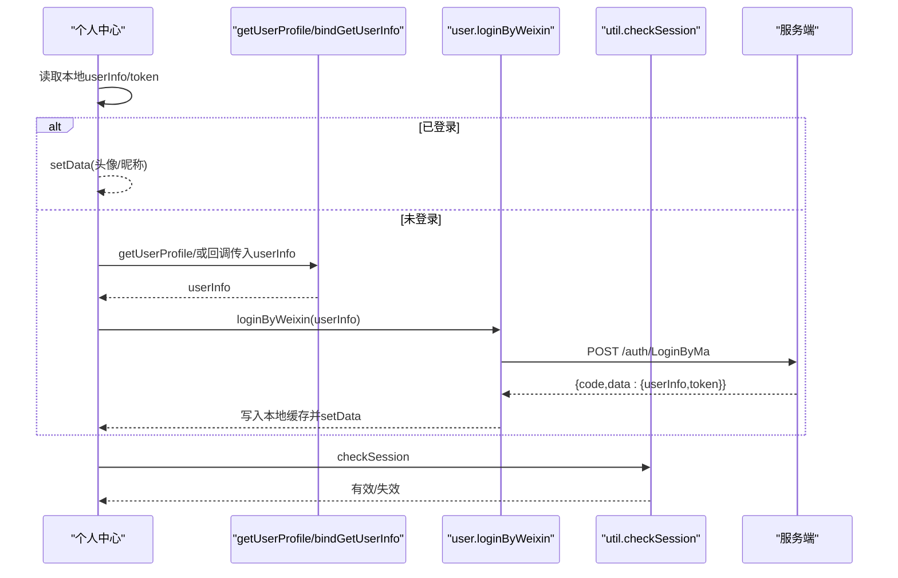

**图表来源**
- [wx-mall/pages/ucenter/index/index.js:30-41](file://wx-mall/pages/ucenter/index/index.js#L30-L41)
- [wx-mall/pages/ucenter/index/index.js:50-81](file://wx-mall/pages/ucenter/index/index.js#L50-L81)
- [wx-mall/services/user.js:11-38](file://wx-mall/services/user.js#L11-L38)
- [wx-mall/utils/util.js:62-73](file://wx-mall/utils/util.js#L62-L73)

**章节来源**
- [wx-mall/pages/ucenter/index/index.js:1-132](file://wx-mall/pages/ucenter/index/index.js#L1-L132)
- [wx-mall/services/user.js:1-74](file://wx-mall/services/user.js#L1-L74)

### 账号登录（auth/login）
- 表单输入：用户名/密码/验证码
- 登录请求：调用 /auth/login，成功后写入 token 并跳转个人中心

**章节来源**
- [wx-mall/pages/auth/login/login.js:1-106](file://wx-mall/pages/auth/login/login.js#L1-L106)

### 商品详情（goods）与SKU交互
- 数据加载：商品详情、画廊、规格、产品、关联商品、购物车数量
- SKU 选择：多规格联动、默认规格自动选择、库存校验
- 收藏：收藏/取消收藏
- 购买：直接购买或加入购物车后跳转结算

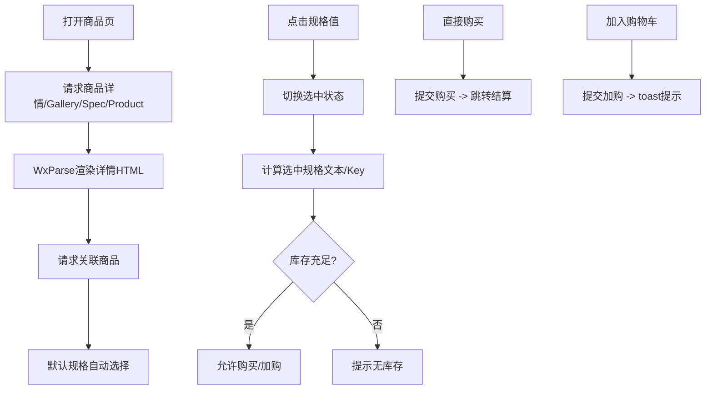

**图表来源**
- [wx-mall/pages/goods/goods.js:27-59](file://wx-mall/pages/goods/goods.js#L27-L59)
- [wx-mall/pages/goods/goods.js:72-104](file://wx-mall/pages/goods/goods.js#L72-L104)
- [wx-mall/pages/goods/goods.js:147-170](file://wx-mall/pages/goods/goods.js#L147-L170)
- [wx-mall/pages/goods/goods.js:273-323](file://wx-mall/pages/goods/goods.js#L273-L323)
- [wx-mall/pages/goods/goods.js:328-391](file://wx-mall/pages/goods/goods.js#L328-L391)

**章节来源**
- [wx-mall/pages/goods/goods.js:1-421](file://wx-mall/pages/goods/goods.js#L1-L421)

### 自定义组件与技能模块
- 空态组件：接收 showType 属性，提供返回首页方法
- AI助手入口组件：支持动态定位、样式配置、微信版本检测
- 商品卡片组件：提供现代化卡片布局，支持响应式设计和视觉反馈
- 技能模块：mall-guide-skill、mall-checkout-skill、mall-order-skill 在 app.json 中声明，通过 index.js 注册 API，支持独立分包加载

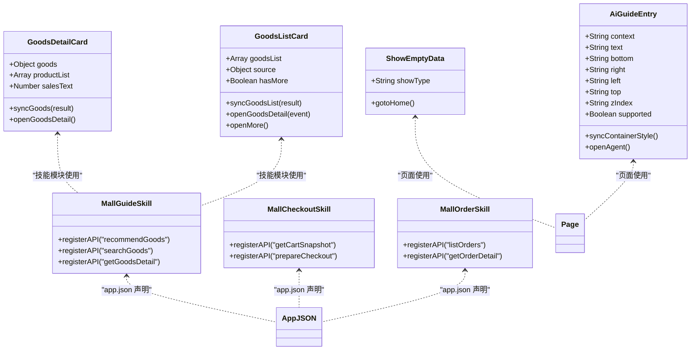

**图表来源**
- [wx-mall/components/ai-guide-entry/index.js:1-109](file://wx-mall/components/ai-guide-entry/index.js#L1-L109)
- [wx-mall/skills/mall-guide-skill/components/goods-detail-card/index.js:1-56](file://wx-mall/skills/mall-guide-skill/components/goods-detail-card/index.js#L1-L56)
- [wx-mall/skills/mall-guide-skill/components/goods-list-card/index.js:1-88](file://wx-mall/skills/mall-guide-skill/components/goods-list-card/index.js#L1-L88)
- [wx-mall/skills/mall-guide-skill/index.js:1-11](file://wx-mall/skills/mall-guide-skill/index.js#L1-L11)
- [wx-mall/skills/mall-checkout-skill/index.js:1-9](file://wx-mall/skills/mall-checkout-skill/index.js#L1-L9)
- [wx-mall/skills/mall-order-skill/index.js:1-9](file://wx-mall/skills/mall-order-skill/index.js#L1-L9)
- [wx-mall/app.json:95-133](file://wx-mall/app.json#L95-L133)

**章节来源**
- [wx-mall/components/ai-guide-entry/index.js:1-109](file://wx-mall/components/ai-guide-entry/index.js#L1-L109)
- [wx-mall/skills/mall-guide-skill/components/goods-detail-card/index.js:1-56](file://wx-mall/skills/mall-guide-skill/components/goods-detail-card/index.js#L1-L56)
- [wx-mall/skills/mall-guide-skill/components/goods-list-card/index.js:1-88](file://wx-mall/skills/mall-guide-skill/components/goods-list-card/index.js#L1-L88)
- [wx-mall/skills/mall-guide-skill/index.js:1-11](file://wx-mall/skills/mall-guide-skill/index.js#L1-L11)
- [wx-mall/skills/mall-checkout-skill/index.js:1-9](file://wx-mall/skills/mall-checkout-skill/index.js#L1-L9)
- [wx-mall/skills/mall-order-skill/index.js:1-9](file://wx-mall/skills/mall-order-skill/index.js#L1-L9)
- [wx-mall/app.json:95-133](file://wx-mall/app.json#L95-L133)

## 微信AI功能重要说明

### AI能力开通要求
微信AI功能需要在微信公众平台进行专门开通，这是使用AI助手功能的前提条件。开发者需要在微信公众平台的相应功能模块中申请开通AI能力，只有获得平台授权后才能在小程序中正常使用AI助手功能。

### 版本要求与兼容性
AI助手功能对微信客户端版本和开发工具基础库版本有严格要求：

- **手机体验最低微信版本**：8.0.75
- **开发工具调试基础库最低版本**：3.16.1

这些版本要求意味着：
- 用户需要升级到指定版本以上的微信客户端才能体验AI助手功能
- 开发者在调试过程中必须使用不低于要求的基础库版本
- 低于要求版本的设备将无法使用AI助手功能

### 灰度内测状态
AI助手功能目前仍处于灰度内测阶段，存在以下限制：
- **暂未开放提审**：AI助手功能尚未正式开放给所有开发者进行小程序审核
- **功能限制**：内测期间可能有功能使用限制和稳定性方面的约束
- **体验范围有限**：只有部分用户能够体验到完整的AI助手功能

### 部署与调试指南
基于上述要求，开发者在部署和调试AI功能时需要注意：

1. **微信公众平台配置**：确保已在平台开通AI能力
2. **版本检测**：在组件中实现微信版本检测逻辑
3. **降级处理**：为不支持的设备提供友好的降级提示
4. **开发环境**：确保开发工具版本满足最低要求

**章节来源**
- [README.md:23-28](file://README.md#L23-L28)
- [wx-mall/components/ai-guide-entry/index.js:87-106](file://wx-mall/components/ai-guide-entry/index.js#L87-L106)

## AI助手技能架构

### AI助手配置与页面元数据
AI助手通过agent配置实现，支持多技能协同和页面上下文识别：

- **agent配置**：instruction指向技能说明文档，pageMetadata指向页面元数据
- **技能注册**：支持商品推荐、购物车管理、订单查询三大核心技能
- **页面元数据**：定义支持AI助手的页面路径、名称、描述和查询参数

```mermaid
graph TB
subgraph "AI助手配置"
Agent["agent配置"]
PM["page-meta.json<br/>页面元数据"]
SK["skills配置<br/>技能注册"]
END
subgraph "技能模块"
SG["mall-guide-skill<br/>商品技能"]
SC["mall-checkout-skill<br/>购物车技能"]
SO["mall-order-skill<br/>订单技能"]
END
subgraph "商品卡片组件"
GDC["goods-detail-card<br/>商品详情卡片"]
GLC["goods-list-card<br/>商品列表卡片"]
END
Agent --> PM
Agent --> SK
SK --> SG
SK --> SC
SK --> SO
SG --> GDC
SG --> GLC
```

**图表来源**
- [wx-mall/app.json:95-115](file://wx-mall/app.json#L95-L115)
- [wx-mall/agent/page-meta.json:1-60](file://wx-mall/agent/page-meta.json#L1-L60)
- [wx-mall/skills/mall-guide-skill/index.js:1-11](file://wx-mall/skills/mall-guide-skill/index.js#L1-L11)
- [wx-mall/skills/mall-guide-skill/components/goods-detail-card/index.js:1-56](file://wx-mall/skills/mall-guide-skill/components/goods-detail-card/index.js#L1-L56)
- [wx-mall/skills/mall-guide-skill/components/goods-list-card/index.js:1-88](file://wx-mall/skills/mall-guide-skill/components/goods-list-card/index.js#L1-L88)

### AI助手入口组件
AI助手入口组件提供用户交互入口，具备以下特性：

- **动态检测**：自动检测微信版本支持情况
- **灵活定位**：支持bottom、right、left、top、zIndex等位置属性
- **样式隔离**：使用styleIsolation确保组件样式独立
- **事件处理**：提供openAgent方法调用AI助手

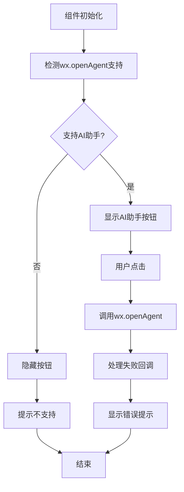

**图表来源**
- [wx-mall/components/ai-guide-entry/index.js:40-106](file://wx-mall/components/ai-guide-entry/index.js#L40-L106)

### 技能模块实现
三大核心技能模块提供专业化的AI服务能力：

#### 商品技能（mall-guide-skill）
- **recommendGoods**：根据用户模糊需求推荐商品
- **searchGoods**：根据明确关键词搜索商品
- **getGoodsDetail**：获取商品详细信息和规格数据
- **商品卡片组件**：提供现代化的商品展示界面，支持响应式布局和视觉反馈

#### 购物车技能（mall-checkout-skill）
- **getCartSnapshot**：获取购物车快照数据
- **prepareCheckout**：准备结算预览信息

#### 订单技能（mall-order-skill）
- **listOrders**：查询订单列表
- **getOrderDetail**：获取订单详细信息

**章节来源**
- [wx-mall/app.json:95-133](file://wx-mall/app.json#L95-L133)
- [wx-mall/agent/page-meta.json:1-60](file://wx-mall/agent/page-meta.json#L1-L60)
- [wx-mall/components/ai-guide-entry/index.js:1-109](file://wx-mall/components/ai-guide-entry/index.js#L1-L109)
- [wx-mall/skills/mall-guide-skill/index.js:1-11](file://wx-mall/skills/mall-guide-skill/index.js#L1-L11)
- [wx-mall/skills/mall-checkout-skill/index.js:1-9](file://wx-mall/skills/mall-checkout-skill/index.js#L1-L9)
- [wx-mall/skills/mall-order-skill/index.js:1-9](file://wx-mall/skills/mall-order-skill/index.js#L1-L9)
- [wx-mall/skills/mall-guide-skill/components/goods-detail-card/index.js:1-56](file://wx-mall/skills/mall-guide-skill/components/goods-detail-card/index.js#L1-L56)
- [wx-mall/skills/mall-guide-skill/components/goods-list-card/index.js:1-88](file://wx-mall/skills/mall-guide-skill/components/goods-list-card/index.js#L1-L88)

## 商品卡片组件

### 商品详情卡片（goods-detail-card）
商品详情卡片组件提供现代化的商品信息展示界面，具有以下特点：

- **响应式布局**：采用flex布局，支持不同屏幕尺寸的自适应显示
- **现代化设计**：圆角边框、阴影效果、合理的间距和字体大小
- **视觉层次**：清晰的价格、销量、规格等信息层级
- **交互反馈**：点击商品卡片跳转详情页，提供视觉反馈效果

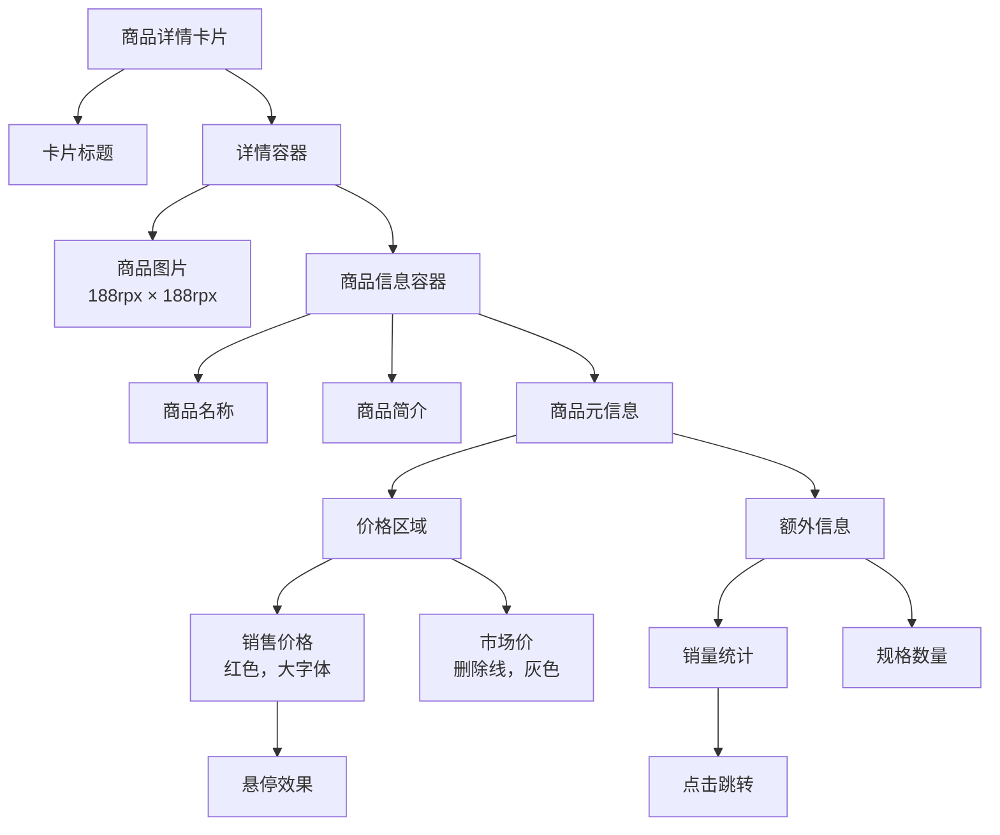

**图表来源**
- [wx-mall/skills/mall-guide-skill/components/goods-detail-card/index.wxml:1-21](file://wx-mall/skills/mall-guide-skill/components/goods-detail-card/index.wxml#L1-L21)
- [wx-mall/skills/mall-guide-skill/components/goods-detail-card/index.wxss:1-140](file://wx-mall/skills/mall-guide-skill/components/goods-detail-card/index.wxss#L1-L140)

### 商品列表卡片（goods-list-card）
商品列表卡片组件提供简洁的商品列表展示，支持查看更多功能：

- **列表布局**：垂直排列多个商品项，支持滚动查看更多
- **简洁设计**：去除冗余元素，突出商品核心信息
- **交互设计**：支持单项点击查看详情，底部查看更多按钮
- **状态处理**：空状态提示，支持关键词和分类筛选

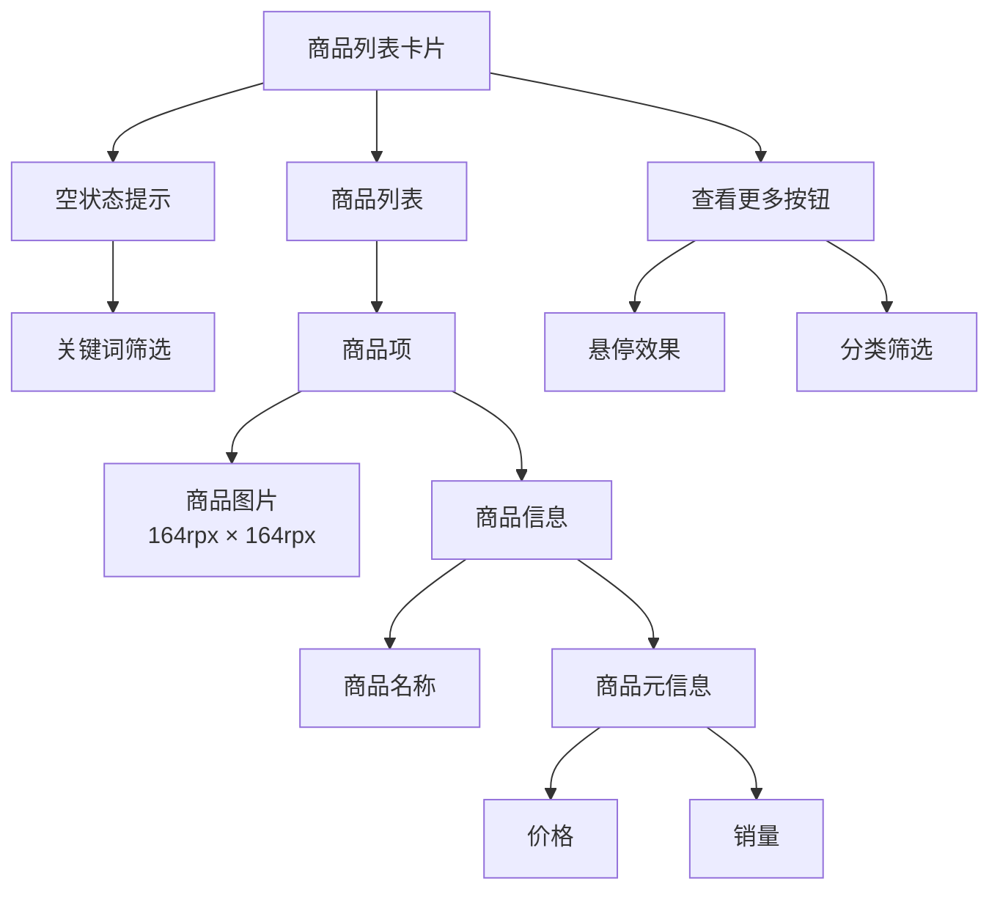

**图表来源**
- [wx-mall/skills/mall-guide-skill/components/goods-list-card/index.wxml:1-21](file://wx-mall/skills/mall-guide-skill/components/goods-list-card/index.wxml#L1-L21)
- [wx-mall/skills/mall-guide-skill/components/goods-list-card/index.wxss:1-159](file://wx-mall/skills/mall-guide-skill/components/goods-list-card/index.wxss#L1-L159)

### 组件技术实现
两个商品卡片组件均采用微信小程序原生组件开发：

- **数据绑定**：通过setData实现数据驱动视图更新
- **事件处理**：bindtap绑定点击事件，支持参数传递
- **样式系统**：使用rpx单位实现响应式布局
- **生命周期**：利用created生命周期处理模型上下文
- **上下文通信**：通过wx.modelContext实现组件间通信

**章节来源**
- [wx-mall/skills/mall-guide-skill/components/goods-detail-card/index.js:1-56](file://wx-mall/skills/mall-guide-skill/components/goods-detail-card/index.js#L1-L56)
- [wx-mall/skills/mall-guide-skill/components/goods-detail-card/index.json:1-5](file://wx-mall/skills/mall-guide-skill/components/goods-detail-card/index.json#L1-L5)
- [wx-mall/skills/mall-guide-skill/components/goods-detail-card/index.wxml:1-21](file://wx-mall/skills/mall-guide-skill/components/goods-detail-card/index.wxml#L1-L21)
- [wx-mall/skills/mall-guide-skill/components/goods-detail-card/index.wxss:1-140](file://wx-mall/skills/mall-guide-skill/components/goods-detail-card/index.wxss#L1-L140)
- [wx-mall/skills/mall-guide-skill/components/goods-list-card/index.js:1-88](file://wx-mall/skills/mall-guide-skill/components/goods-list-card/index.js#L1-L88)
- [wx-mall/skills/mall-guide-skill/components/goods-list-card/index.json:1-5](file://wx-mall/skills/mall-guide-skill/components/goods-list-card/index.json#L1-L5)
- [wx-mall/skills/mall-guide-skill/components/goods-list-card/index.wxml:1-21](file://wx-mall/skills/mall-guide-skill/components/goods-list-card/index.wxml#L1-L21)
- [wx-mall/skills/mall-guide-skill/components/goods-list-card/index.wxss:1-159](file://wx-mall/skills/mall-guide-skill/components/goods-list-card/index.wxss#L1-L159)

## 依赖关系分析
- 页面依赖 utils 与 config 进行网络请求与接口常量访问
- 业务服务（user、pay）封装在 services 目录，供页面调用
- app.json 统一声明页面、分包、插件与调试开关，影响包体积与加载策略
- 技能模块通过 app.json 的 agent 与 subPackages 独立加载，降低主包体积
- AI助手组件通过agent配置与技能模块协作，提供智能化服务
- 商品卡片组件作为技能模块的重要组成部分，增强AI助手的商品展示能力

```mermaid
graph TB
subgraph "页面"
IDX["index.js"]
CART["cart.js"]
CHECK["checkout.js"]
UCENTER["ucenter/index.js"]
LOGIN["auth/login.js"]
GOODS["goods.js"]
END
subgraph "AI助手"
AGENT["agent/page-meta.json"]
SKILLS["skills/*"]
AI_ENTRY["components/ai-guide-entry"]
GOODS_CARDS["skills/mall-guide-skill/components"]
END
subgraph "商品卡片组件"
GDC["goods-detail-card"]
GLC["goods-list-card"]
END
UTIL["utils/util.js"]
API["config/api.js"]
USER["services/user.js"]
PAY["services/pay.js"]
APPJSON["app.json"]
IDX --> UTIL
IDX --> API
CART --> UTIL
CART --> API
CHECK --> UTIL
CHECK --> API
CHECK --> PAY
UCENTER --> UTIL
UCENTER --> USER
LOGIN --> API
GOODS --> UTIL
GOODS --> API
APPJSON --> IDX
APPJSON --> CART
APPJSON --> CHECK
APPJSON --> UCENTER
APPJSON --> LOGIN
APPJSON --> GOODS
APPJSON --> AGENT
APPJSON --> SKILLS
SKILLS --> AI_ENTRY
SKILLS --> GOODS_CARDS
GOODS_CARDS --> GDC
GOODS_CARDS --> GLC
AI_ENTRY --> AGENT
```

**图表来源**
- [wx-mall/pages/index/index.js:1-123](file://wx-mall/pages/index/index.js#L1-L123)
- [wx-mall/pages/cart/cart.js:1-280](file://wx-mall/pages/cart/cart.js#L1-L280)
- [wx-mall/pages/shopping/checkout/checkout.js:1-169](file://wx-mall/pages/shopping/checkout/checkout.js#L1-L169)
- [wx-mall/pages/ucenter/index/index.js:1-132](file://wx-mall/pages/ucenter/index/index.js#L1-L132)
- [wx-mall/pages/auth/login/login.js:1-106](file://wx-mall/pages/auth/login/login.js#L1-L106)
- [wx-mall/pages/goods/goods.js:1-421](file://wx-mall/pages/goods/goods.js#L1-L421)
- [wx-mall/utils/util.js:1-132](file://wx-mall/utils/util.js#L1-L132)
- [wx-mall/config/api.js:1-84](file://wx-mall/config/api.js#L1-L84)
- [wx-mall/services/user.js:1-74](file://wx-mall/services/user.js#L1-L74)
- [wx-mall/services/pay.js:1-44](file://wx-mall/services/pay.js#L1-L44)
- [wx-mall/app.json:1-136](file://wx-mall/app.json#L1-L136)
- [wx-mall/agent/page-meta.json:1-60](file://wx-mall/agent/page-meta.json#L1-L60)
- [wx-mall/components/ai-guide-entry/index.js:1-109](file://wx-mall/components/ai-guide-entry/index.js#L1-L109)
- [wx-mall/skills/mall-guide-skill/components/goods-detail-card/index.js:1-56](file://wx-mall/skills/mall-guide-skill/components/goods-detail-card/index.js#L1-L56)
- [wx-mall/skills/mall-guide-skill/components/goods-list-card/index.js:1-88](file://wx-mall/skills/mall-guide-skill/components/goods-list-card/index.js#L1-L88)

**章节来源**
- [wx-mall/app.json:1-136](file://wx-mall/app.json#L1-L136)

## 性能与体验优化
- 包体积控制
  - 分包策略：通过 subPackages 将技能模块拆分为独立包，减少主包体积
  - 懒加载：lazyCodeLoading 配合分包按需加载
  - 插件：使用官方插件（如物流助手）减少重复实现
  - AI助手分包：独立的skills目录作为分包根目录，支持独立加载
  - 商品卡片组件：作为独立组件模块，支持按需加载和缓存
- 冷启动优化
  - 减少首页首次请求项，必要时延迟加载非首屏数据
  - 合理使用本地缓存（token、userInfo）避免重复登录
  - AI助手组件按需加载，避免影响首屏性能
  - 商品卡片组件采用轻量级设计，减少渲染开销
- 网络与交互
  - 统一 loading 与错误提示，避免频繁弹窗
  - 下拉刷新统一处理，避免重复请求
  - AI助手调用失败优雅降级，提供替代方案
  - 商品卡片组件提供平滑的加载动画和过渡效果
- 可访问性与健壮性
  - 401 时统一跳转授权页
  - 旧版客户端提示升级
  - AI助手版本检测，不支持时隐藏入口
  - 商品卡片组件提供无障碍访问支持
- **AI功能专项优化**
  - **版本兼容性检查**：在组件初始化时检测微信版本支持情况
  - **灰度内测降级**：为不支持的设备提供友好的功能提示
  - **分包加载优化**：AI技能模块独立分包，按需加载减少主包体积
  - **缓存策略**：AI助手配置和技能数据的本地缓存机制

**更新** 新增AI功能相关的性能优化策略，包括版本兼容性检查、灰度内测降级处理、分包加载优化和缓存策略等。

**章节来源**
- [wx-mall/app.json:117-133](file://wx-mall/app.json#L117-L133)
- [wx-mall/utils/util.js:23-57](file://wx-mall/utils/util.js#L23-L57)
- [wx-mall/app.js:30-36](file://wx-mall/app.js#L30-L36)
- [wx-mall/components/ai-guide-entry/index.js:87-106](file://wx-mall/components/ai-guide-entry/index.js#L87-L106)
- [wx-mall/skills/mall-guide-skill/components/goods-detail-card/index.wxss:1-140](file://wx-mall/skills/mall-guide-skill/components/goods-detail-card/index.wxss#L1-L140)
- [wx-mall/skills/mall-guide-skill/components/goods-list-card/index.wxss:1-159](file://wx-mall/skills/mall-guide-skill/components/goods-list-card/index.wxss#L1-L159)
- [README.md:23-28](file://README.md#L23-L28)

## 故障排查指南
- 登录失败/401
  - 检查 util.request 是否携带 token
  - 检查服务端返回 code 与 errMsg
  - 401 时跳转授权页
- 支付失败
  - 确认 prepay 参数是否正确
  - 捕获 fail/complete 回调并跳转支付结果页
- 购物车异常
  - 单项/全选与本地编辑模式区分处理
  - 服务端返回后同步本地状态
- 用户授权
  - getUserProfile 与回调授权二选一
  - checkSession 失败时引导重新登录
- AI助手问题
  - 检查微信版本是否支持wx.openAgent
  - 验证agent配置和页面元数据是否正确
  - 确认技能模块是否正确注册
  - 检查分包加载是否正常
  - **版本兼容性检查**：确认微信客户端版本≥8.0.75
  - **开发工具版本**：确认基础库版本≥3.16.1
  - **灰度内测状态**：确认功能处于灰度内测阶段
- 商品卡片组件问题
  - 检查组件数据绑定是否正确
  - 验证样式文件是否正确加载
  - 确认事件处理函数是否正常执行
  - 检查响应式布局在不同设备上的表现

**更新** 新增AI功能相关的故障排查指南，包括版本兼容性检查、开发工具版本验证和灰度内测状态确认等。

**章节来源**
- [wx-mall/utils/util.js:23-57](file://wx-mall/utils/util.js#L23-L57)
- [wx-mall/services/pay.js:11-39](file://wx-mall/services/pay.js#L11-L39)
- [wx-mall/pages/cart/cart.js:65-98](file://wx-mall/pages/cart/cart.js#L65-L98)
- [wx-mall/pages/ucenter/index/index.js:50-81](file://wx-mall/pages/ucenter/index/index.js#L50-L81)
- [wx-mall/components/ai-guide-entry/index.js:87-106](file://wx-mall/components/ai-guide-entry/index.js#L87-L106)
- [wx-mall/skills/mall-guide-skill/components/goods-detail-card/index.js:21-56](file://wx-mall/skills/mall-guide-skill/components/goods-detail-card/index.js#L21-L56)
- [wx-mall/skills/mall-guide-skill/components/goods-list-card/index.js:21-88](file://wx-mall/skills/mall-guide-skill/components/goods-list-card/index.js#L21-L88)
- [README.md:23-28](file://README.md#L23-L28)

## 结论
本项目以微信原生小程序为基础，采用清晰的目录结构与职责分离：页面负责交互与数据绑定，工具与服务封装通用能力，配置集中管理接口与应用行为。通过分包与懒加载控制包体积，结合统一的请求与授权机制，形成可维护、可扩展的小程序架构。

**更新** 新增微信AI功能重要说明，涵盖AI能力在微信公众平台的开通要求、最低微信版本要求、开发工具基础库版本要求等关键信息。AI助手功能目前处于灰度内测阶段，暂未开放提审，开发者需要特别注意版本兼容性和功能限制。新增AI助手技能架构，通过agent配置和分包机制实现智能化服务集成。三大核心技能模块（商品推荐、购物车管理、订单查询）提供专业化的AI服务能力，配合AI助手入口组件和商品卡片组件，为用户提供智能化购物体验。商品卡片组件采用现代化设计，支持响应式布局和视觉反馈，显著提升了用户体验。分包策略确保AI功能和商品展示功能不影响主包体积，支持按需加载和独立更新。

建议在后续迭代中进一步完善AI助手的错误处理机制、用户反馈收集和技能效果评估，持续优化AI助手的准确性和用户体验。同时可以考虑扩展商品卡片组件的功能，如添加收藏、分享等交互能力。开发者在使用AI功能时，务必确保微信客户端版本和开发工具版本满足最低要求，并关注灰度内测的状态变化。

## 附录
- 组件开发规范
  - 属性命名与默认值清晰，observer 中处理派生状态
  - 方法命名语义化，避免跨组件复杂耦合
  - AI助手组件需考虑版本兼容性和降级处理
  - 商品卡片组件遵循响应式设计原则，使用rpx单位
  - 组件样式采用CSS变量和BEM命名规范
- 样式系统
  - 使用 wxss 组织页面样式，合理复用公共类
  - AI助手组件使用样式隔离避免冲突
  - 商品卡片组件采用现代化设计语言，注重视觉层次
- 动画与交互
  - 使用 wxs 或 CSS 动画提升流畅度，避免频繁 setData
  - AI助手入口组件提供平滑的显示/隐藏动画
  - 商品卡片组件提供悬停效果和点击反馈
- 最佳实践
  - 严格区分本地状态与服务端状态，确保一致性
  - 对外暴露稳定的 API 与接口常量，便于联调与测试
  - AI助手技能需提供完善的错误处理和用户提示
  - 分包配置需考虑加载时机和用户体验
  - 商品卡片组件需考虑不同屏幕尺寸的适配
  - **AI功能开发注意事项**：
    - 确保微信公众平台已开通AI能力
    - 检查微信客户端版本≥8.0.75
    - 确认开发工具基础库版本≥3.16.1
    - 关注灰度内测状态，做好功能降级处理
    - 实现版本兼容性检测和用户提示机制