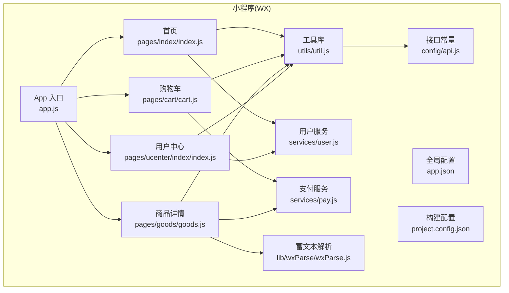
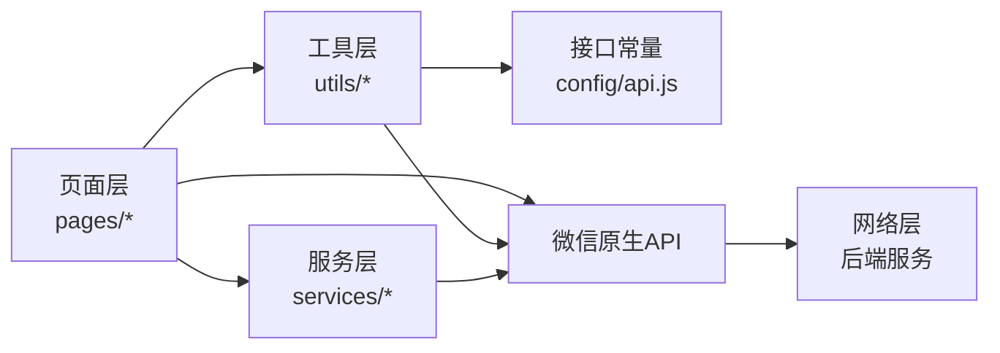
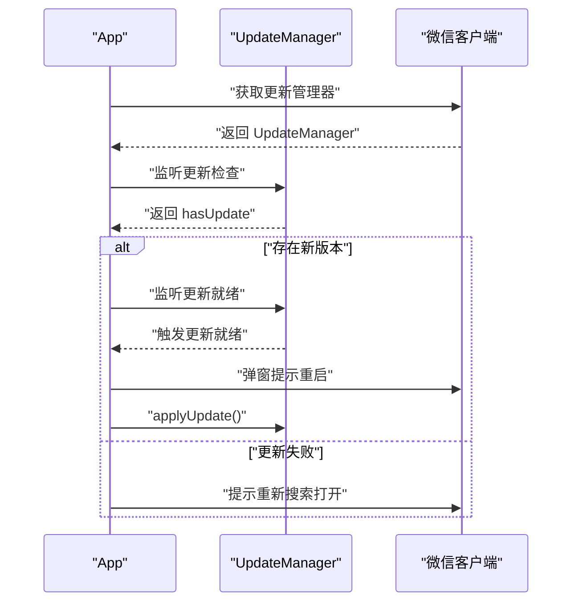
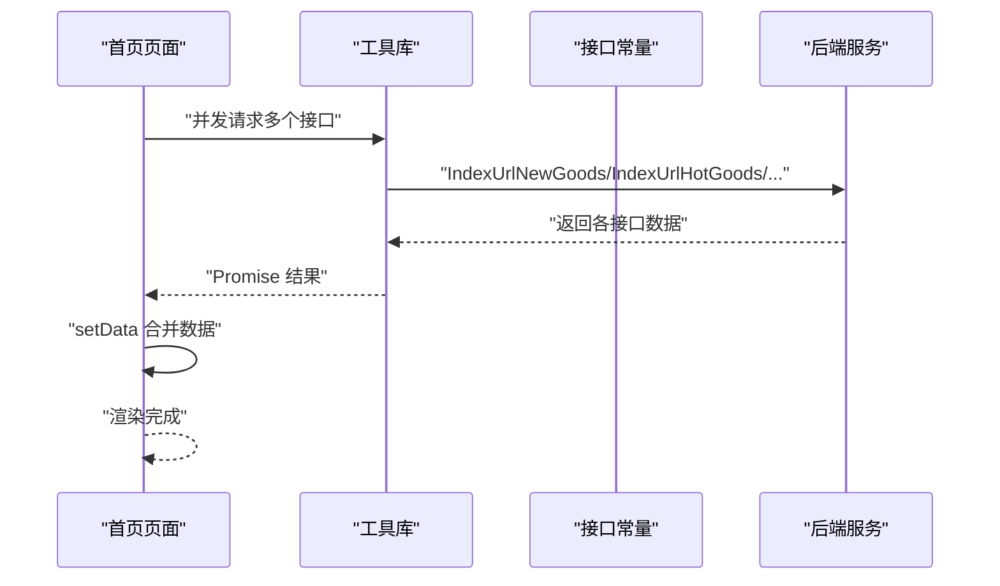
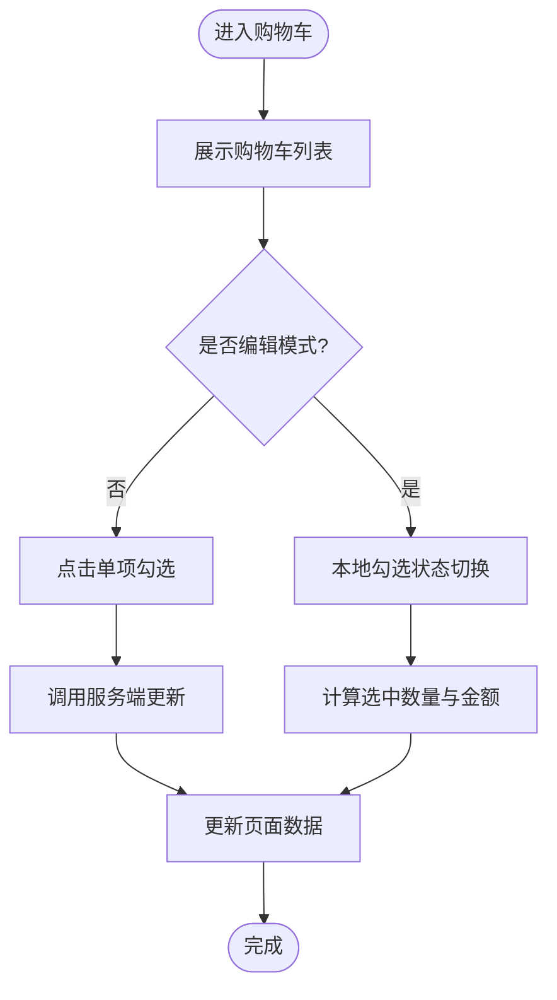
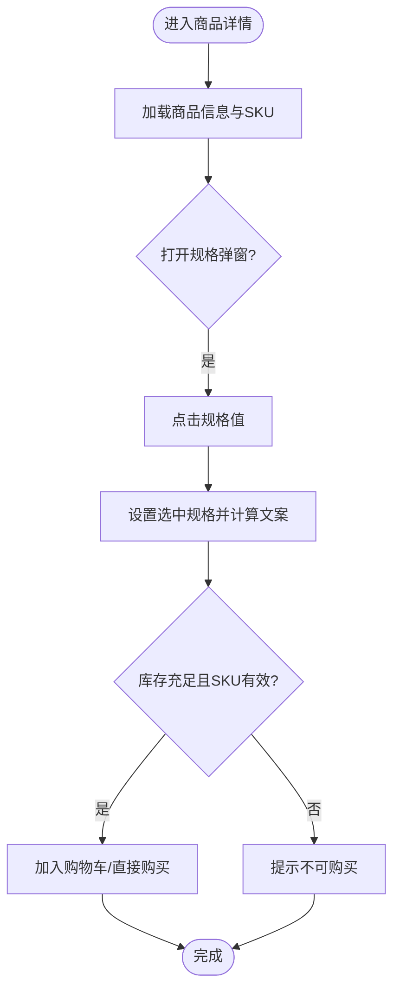
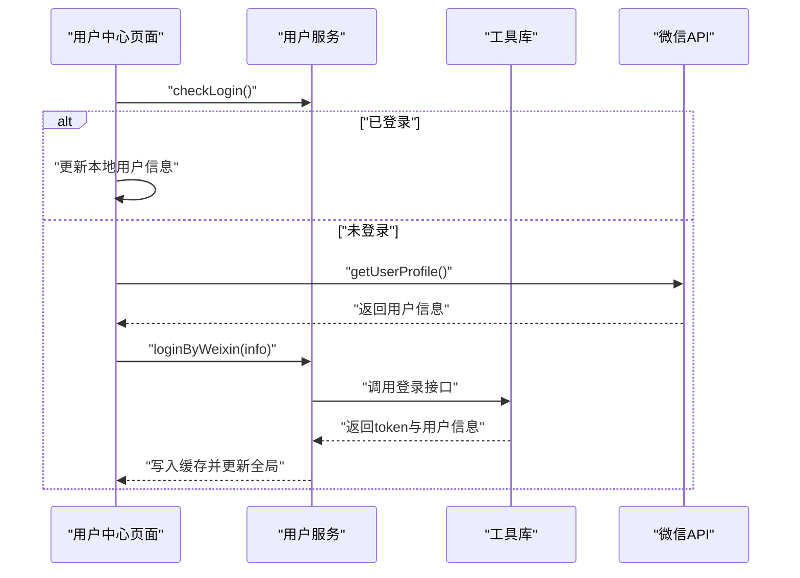
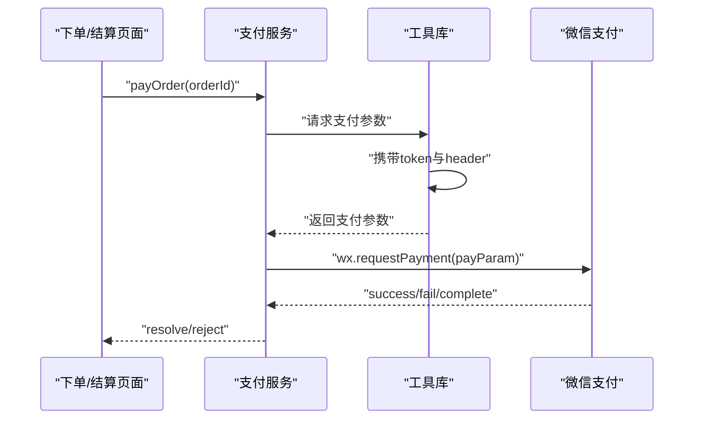
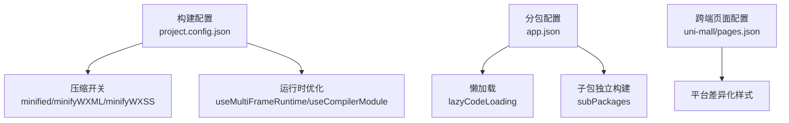

# 性能优化与用户体验

<cite>
**本文引用的文件**
- [wx-mall/app.js](file://wx-mall/app.js)
- [wx-mall/app.json](file://wx-mall/app.json)
- [wx-mall/project.config.json](file://wx-mall/project.config.json)
- [wx-mall/utils/util.js](file://wx-mall/utils/util.js)
- [wx-mall/services/user.js](file://wx-mall/services/user.js)
- [wx-mall/services/pay.js](file://wx-mall/services/pay.js)
- [wx-mall/pages/index/index.js](file://wx-mall/pages/index/index.js)
- [wx-mall/pages/cart/cart.js](file://wx-mall/pages/cart/cart.js)
- [wx-mall/pages/ucenter/index/index.js](file://wx-mall/pages/ucenter/index/index.js)
- [wx-mall/pages/goods/goods.js](file://wx-mall/pages/goods/goods.js)
- [wx-mall/config/api.js](file://wx-mall/config/api.js)
- [wx-mall/lib/wxParse/wxParse.js](file://wx-mall/lib/wxParse/wxParse.js)
- [uni-mall/pages.json](file://uni-mall/pages.json)
</cite>

## 目录
1. [引言](#引言)
2. [项目结构](#项目结构)
3. [核心组件](#核心组件)
4. [架构总览](#架构总览)
5. [详细组件分析](#详细组件分析)
6. [依赖关系分析](#依赖关系分析)
7. [性能考量](#性能考量)
8. [故障排查指南](#故障排查指南)
9. [结论](#结论)
10. [附录](#附录)

## 引言
本文件面向微信小程序“wx-mall”项目，系统性梳理其性能优化与用户体验提升策略，覆盖包体积控制、代码压缩、图片优化与资源合并；启动性能优化（冷启动、首屏渲染、异步加载）；运行时性能优化（内存管理、事件处理、动画性能）；以及用户体验优化（页面切换、加载状态、错误提示、网络状态适配）。同时提供调试工具使用、性能监控与问题排查方法，并结合实际页面与服务模块给出可落地的优化建议与效果对比思路。

## 项目结构
- 小程序主体位于 wx-mall 目录，采用标准分包与页面组织方式，支持分包懒加载与技能型子包独立构建。
- 工具层与服务层分离：通用请求封装、登录态校验、支付流程等集中在 utils 与 services 目录。
- 页面层以功能域划分，首页、商品详情、购物车、用户中心等页面职责清晰。
- 富文本解析通过 wxParse 组件实现，便于内容渲染与图片预览。

图表来源
- [wx-mall/app.js:1-96](file://wx-mall/app.js#L1-L96)
- [wx-mall/app.json:1-136](file://wx-mall/app.json#L1-L136)
- [wx-mall/project.config.json:1-76](file://wx-mall/project.config.json#L1-L76)
- [wx-mall/pages/index/index.js:1-123](file://wx-mall/pages/index/index.js#L1-L123)
- [wx-mall/pages/cart/cart.js:1-280](file://wx-mall/pages/cart/cart.js#L1-L280)
- [wx-mall/pages/goods/goods.js:1-421](file://wx-mall/pages/goods/goods.js#L1-L421)
- [wx-mall/pages/ucenter/index/index.js:1-132](file://wx-mall/pages/ucenter/index/index.js#L1-L132)
- [wx-mall/services/user.js:1-74](file://wx-mall/services/user.js#L1-L74)
- [wx-mall/services/pay.js:1-44](file://wx-mall/services/pay.js#L1-L44)
- [wx-mall/utils/util.js:1-132](file://wx-mall/utils/util.js#L1-L132)
- [wx-mall/config/api.js:1-84](file://wx-mall/config/api.js#L1-L84)
- [wx-mall/lib/wxParse/wxParse.js:1-142](file://wx-mall/lib/wxParse/wxParse.js#L1-L142)

章节来源
- [wx-mall/app.json:1-136](file://wx-mall/app.json#L1-L136)
- [wx-mall/project.config.json:1-76](file://wx-mall/project.config.json#L1-L76)
- [uni-mall/pages.json:1-385](file://uni-mall/pages.json#L1-L385)

## 核心组件
- 应用生命周期与更新机制：在 App 启动阶段检查更新并提示用户重启，确保用户始终使用最新版本。
- 页面级数据聚合与并发请求：首页一次性发起多个接口请求，减少页面渲染等待时间。
- 登录态与会话校验：统一登录流程与会话失效处理，避免重复鉴权开销。
- 支付流程封装：统一封装 wx.requestPayment，简化业务接入成本。
- 富文本渲染：通过 wxParse 解析 HTML 内容，支持图片预览与自适应宽高。

章节来源
- [wx-mall/app.js:1-96](file://wx-mall/app.js#L1-L96)
- [wx-mall/pages/index/index.js:1-123](file://wx-mall/pages/index/index.js#L1-L123)
- [wx-mall/services/user.js:1-74](file://wx-mall/services/user.js#L1-L74)
- [wx-mall/services/pay.js:1-44](file://wx-mall/services/pay.js#L1-L44)
- [wx-mall/lib/wxParse/wxParse.js:1-142](file://wx-mall/lib/wxParse/wxParse.js#L1-L142)

## 架构总览
小程序整体采用“页面-服务-工具-接口常量”的分层架构，页面负责交互与渲染，服务封装业务流程，工具提供通用能力，接口常量集中管理后端地址，便于维护与替换。

图表来源
- [wx-mall/pages/index/index.js:1-123](file://wx-mall/pages/index/index.js#L1-L123)
- [wx-mall/services/user.js:1-74](file://wx-mall/services/user.js#L1-L74)
- [wx-mall/utils/util.js:1-132](file://wx-mall/utils/util.js#L1-L132)
- [wx-mall/config/api.js:1-84](file://wx-mall/config/api.js#L1-L84)

## 详细组件分析

### 启动与更新机制（App）
- 版本更新检测：通过 wx.getUpdateManager 实现新版本检测与提示，支持一键重启应用。
- 降级提示：当微信基础库版本过低时，提示用户升级。
- 下拉刷新：统一处理导航栏加载状态与停止刷新动作，避免重复刷新。

图表来源
- [wx-mall/app.js:1-96](file://wx-mall/app.js#L1-L96)

章节来源
- [wx-mall/app.js:1-96](file://wx-mall/app.js#L1-L96)

### 首页数据聚合与并发请求
- 并发请求：首页一次性请求新品、热销、专题、品牌、分类楼层、Banner、频道等数据，减少多次往返。
- 数据合并：将各接口返回的数据合并到页面 data 中，再 setData 更新视图。
- 下拉刷新：集成 onPullDownRefresh，刷新时重新拉取数据并隐藏加载状态。

图表来源
- [wx-mall/pages/index/index.js:1-123](file://wx-mall/pages/index/index.js#L1-L123)
- [wx-mall/config/api.js:1-84](file://wx-mall/config/api.js#L1-L84)

章节来源
- [wx-mall/pages/index/index.js:1-123](file://wx-mall/pages/index/index.js#L1-L123)
- [wx-mall/config/api.js:1-84](file://wx-mall/config/api.js#L1-L84)

### 购物车交互与状态管理
- 多状态切换：全选/反选、编辑模式、数量增减、删除选中项。
- 即时反馈：在本地先更新 UI，再异步同步至服务端，提升感知速度。
- 金额与数量：实时计算已选商品数量与总价，保证一致性。

图表来源
- [wx-mall/pages/cart/cart.js:1-280](file://wx-mall/pages/cart/cart.js#L1-L280)

章节来源
- [wx-mall/pages/cart/cart.js:1-280](file://wx-mall/pages/cart/cart.js#L1-L280)

### 商品详情与规格选择
- 规格联动：点击规格值时，其他规格值取消选中，避免无效组合。
- 库存校验：在加入购物车或直接购买前校验库存与 SKU 是否匹配。
- 富文本渲染：使用 wxParse 解析商品详情 HTML，支持图片预览与自适应宽高。

图表来源
- [wx-mall/pages/goods/goods.js:1-421](file://wx-mall/pages/goods/goods.js#L1-L421)
- [wx-mall/lib/wxParse/wxParse.js:1-142](file://wx-mall/lib/wxParse/wxParse.js#L1-L142)

章节来源
- [wx-mall/pages/goods/goods.js:1-421](file://wx-mall/pages/goods/goods.js#L1-L421)
- [wx-mall/lib/wxParse/wxParse.js:1-142](file://wx-mall/lib/wxParse/wxParse.js#L1-L142)

### 用户中心与登录态
- 用户信息获取：优先从缓存读取，若缺失则引导授权登录。
- 会话校验：登录后定期校验会话有效性，避免重复登录。
- 退出登录：清理缓存并重置全局用户信息，跳转首页。

图表来源
- [wx-mall/pages/ucenter/index/index.js:1-132](file://wx-mall/pages/ucenter/index/index.js#L1-L132)
- [wx-mall/services/user.js:1-74](file://wx-mall/services/user.js#L1-L74)
- [wx-mall/utils/util.js:1-132](file://wx-mall/utils/util.js#L1-L132)

章节来源
- [wx-mall/pages/ucenter/index/index.js:1-132](file://wx-mall/pages/ucenter/index/index.js#L1-L132)
- [wx-mall/services/user.js:1-74](file://wx-mall/services/user.js#L1-L74)
- [wx-mall/utils/util.js:1-132](file://wx-mall/utils/util.js#L1-L132)

### 支付流程封装
- 统一支付参数：从服务端获取 prepay_id 及必要签名参数。
- 调起支付：封装 wx.requestPayment，分别处理成功、失败与 complete 回调。

图表来源
- [wx-mall/services/pay.js:1-44](file://wx-mall/services/pay.js#L1-L44)
- [wx-mall/utils/util.js:1-132](file://wx-mall/utils/util.js#L1-L132)

章节来源
- [wx-mall/services/pay.js:1-44](file://wx-mall/services/pay.js#L1-L44)
- [wx-mall/utils/util.js:1-132](file://wx-mall/utils/util.js#L1-L132)

## 依赖关系分析
- 分包与懒加载：app.json 中开启 lazyCodeLoading 与 subPackages，将技能型子包独立构建，降低主包体积与冷启动时间。
- 构建配置：project.config.json 开启 minified、minifyWXML、minifyWXSS、minifyJS 等压缩选项，启用多帧运行时与编译模块，提升打包效率与运行性能。
- 页面配置：uni-mall 的 pages.json 展示了多平台差异化样式与滚动行为配置，体现跨端适配思路。

图表来源
- [wx-mall/project.config.json:1-76](file://wx-mall/project.config.json#L1-L76)
- [wx-mall/app.json:1-136](file://wx-mall/app.json#L1-L136)
- [uni-mall/pages.json:1-385](file://uni-mall/pages.json#L1-L385)

章节来源
- [wx-mall/app.json:1-136](file://wx-mall/app.json#L1-L136)
- [wx-mall/project.config.json:1-76](file://wx-mall/project.config.json#L1-L76)
- [uni-mall/pages.json:1-385](file://uni-mall/pages.json#L1-L385)

## 性能考量

### 包体积控制与资源优化
- 代码压缩与混淆：构建配置中启用 minified、minifyWXML、minifyWXSS、minifyJS，减少传输体积。
- 资源压缩：开启 minifyWXML 与 minifyWXSS，减少模板与样式体积。
- 分包策略：通过 subPackages 将非首屏功能拆分为独立包，配合 lazyCodeLoading，缩短首屏加载路径。
- 图片优化：在商品详情页使用 wxParse 图片预览与自适应宽高，避免大图全量加载；建议在服务端或 CDN 层面提供多尺寸图与 WebP 格式。

章节来源
- [wx-mall/project.config.json:1-76](file://wx-mall/project.config.json#L1-L76)
- [wx-mall/app.json:1-136](file://wx-mall/app.json#L1-L136)
- [wx-mall/lib/wxParse/wxParse.js:1-142](file://wx-mall/lib/wxParse/wxParse.js#L1-L142)

### 启动性能优化
- 冷启动优化：利用分包与懒加载，将首页所需资源置于主包，减少首次渲染阻塞。
- 首屏渲染加速：首页一次性并发请求多个接口，setData 合并渲染，缩短白屏时间。
- 异步加载策略：对非关键资源（如富文本、评论、关联商品）采用延迟加载或按需请求。

章节来源
- [wx-mall/pages/index/index.js:1-123](file://wx-mall/pages/index/index.js#L1-L123)
- [wx-mall/app.json:1-136](file://wx-mall/app.json#L1-L136)

### 运行时性能优化
- 内存管理：避免在 setData 中传递过大对象，尽量局部更新；及时清理定时器与事件监听。
- 事件处理：在频繁触发的事件中使用节流/防抖（例如滚动加载），减少主线程压力。
- 动画性能：使用 wxs 或原生动画 API，避免在 JS 中频繁操作 DOM 结构。

章节来源
- [wx-mall/pages/cart/cart.js:1-280](file://wx-mall/pages/cart/cart.js#L1-L280)
- [wx-mall/pages/goods/goods.js:1-421](file://wx-mall/pages/goods/goods.js#L1-L421)

### 用户体验优化
- 页面切换动画：合理使用 wx.navigateTo、wx.switchTab 等 API，避免过度嵌套导致栈深过大。
- 加载状态：统一使用 wx.showLoading 与 wx.hideLoading，避免遮罩层长时间停留。
- 错误提示：封装统一的错误提示组件（如 util.showErrorToast），保持一致的交互反馈。
- 网络状态适配：在工具库中统一处理 401 重定向登录、网络异常提示与超时处理。

章节来源
- [wx-mall/utils/util.js:1-132](file://wx-mall/utils/util.js#L1-L132)
- [wx-mall/services/user.js:1-74](file://wx-mall/services/user.js#L1-L74)

### 调试与性能分析
- 开发者工具：使用微信开发者工具的 Network、Performance、Storage 等面板定位问题。
- 真机调试：通过“调试”开关与日志输出，观察真实设备上的卡顿与内存占用。
- 性能分析：关注首屏渲染耗时、WXML/WXSS 编译耗时、脚本执行耗时与 GC 次数。

章节来源
- [wx-mall/project.config.json:1-76](file://wx-mall/project.config.json#L1-L76)
- [wx-mall/app.json:1-136](file://wx-mall/app.json#L1-L136)

### 性能监控与问题排查
- 关键指标：首屏渲染时间、接口平均耗时、页面切换耗时、内存峰值、GC 次数与耗时。
- 监控手段：在 App 生命周期与关键页面埋点，记录启动、进入、离开等节点时间戳。
- 排查流程：定位瓶颈（网络/渲染/逻辑），逐项优化（并发/懒加载/缓存/分包），回归测试与 A/B 对比。

章节来源
- [wx-mall/app.js:1-96](file://wx-mall/app.js#L1-L96)
- [wx-mall/pages/index/index.js:1-123](file://wx-mall/pages/index/index.js#L1-L123)

## 故障排查指南
- 登录态失效：工具库中对 401 状态统一跳转授权页，避免页面死锁。
- 网络异常：统一 fail 回调与 reject 处理，结合 wx.showToast 提示用户。
- 图片加载失败：在 wxParse 中处理图片尺寸计算与预览，避免布局抖动。
- 支付失败：区分 success/fail/complete 回调，记录日志并提示用户重试。

章节来源
- [wx-mall/utils/util.js:1-132](file://wx-mall/utils/util.js#L1-L132)
- [wx-mall/lib/wxParse/wxParse.js:1-142](file://wx-mall/lib/wxParse/wxParse.js#L1-L142)
- [wx-mall/services/pay.js:1-44](file://wx-mall/services/pay.js#L1-L44)

## 结论
通过对 wx-mall 的分层架构、页面与服务模块的深入分析，可以看出项目在启动性能、并发请求、登录态与支付流程方面已有良好实践。建议进一步强化分包策略、资源压缩与懒加载，完善首屏渲染与富文本图片优化，并建立完善的性能监控与回归测试体系，持续迭代以提升用户体验与稳定性。

## 附录
- 实施清单（示例）
  - 启动优化：启用分包与懒加载，将非关键页面放入子包；首页仅保留必要资源。
  - 首屏渲染：合并接口请求，减少 setData 次数；对富文本与图片采用延迟加载。
  - 运行时优化：对高频事件进行节流/防抖；避免大对象 setData；及时释放定时器与监听。
  - 用户体验：统一加载与错误提示；对网络异常与 401 场景提供明确指引。
  - 调试与监控：在关键节点埋点，收集首屏时间、接口耗时、内存与 GC 数据，形成对比报表。