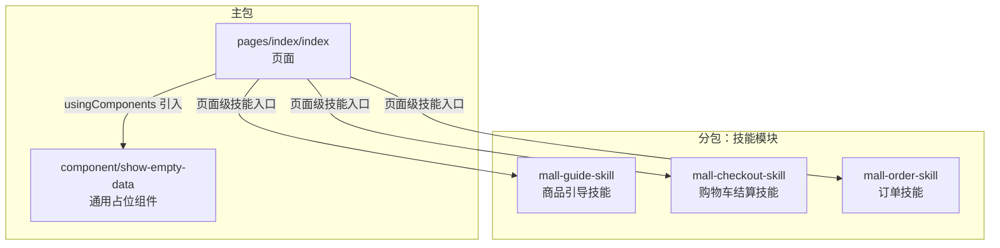
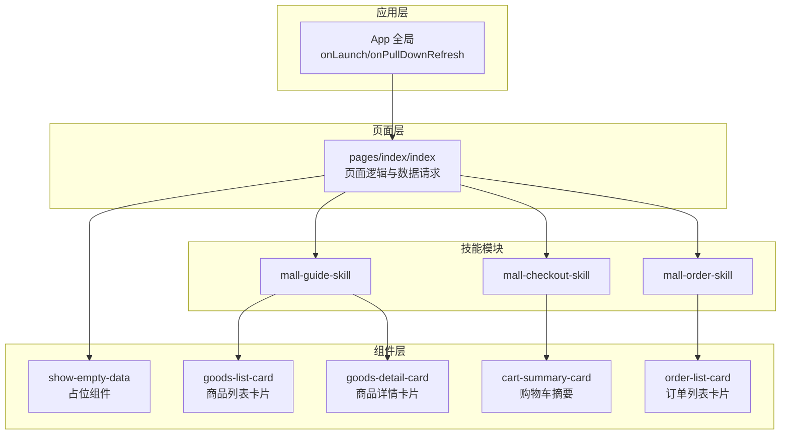
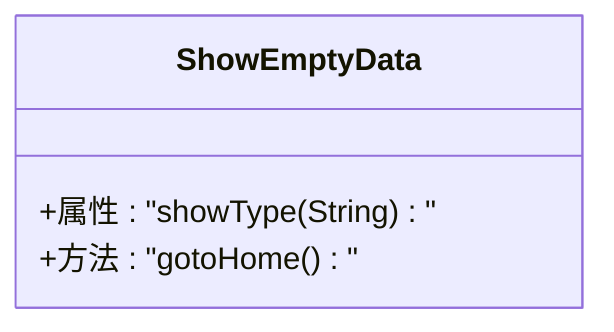
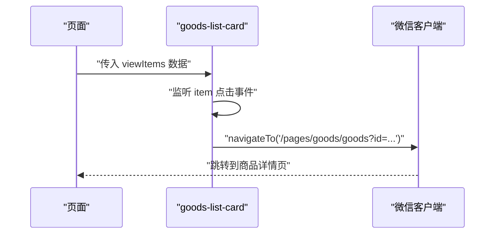
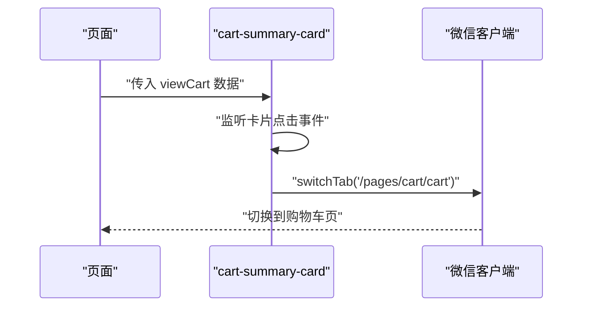
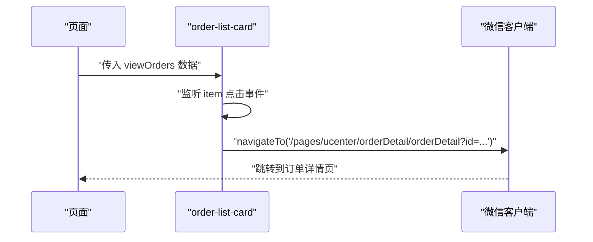
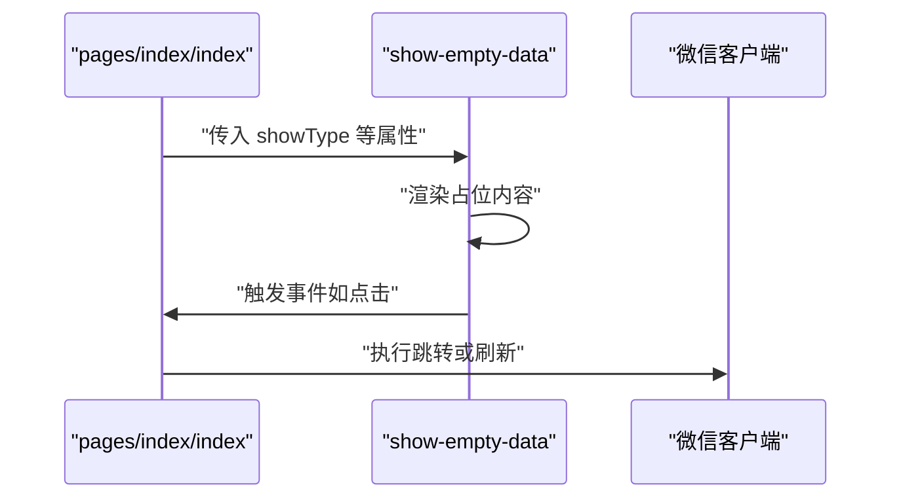
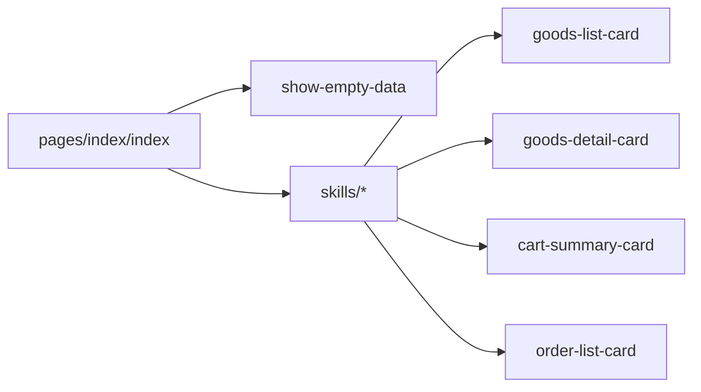

# 组件系统与自定义组件

<cite>
**本文引用的文件**
- [wx-mall/app.json](file://wx-mall/app.json)
- [wx-mall/app.js](file://wx-mall/app.js)
- [wx-mall/component/show-empty-data/show-empty-data.json](file://wx-mall/component/show-empty-data/show-empty-data.json)
- [wx-mall/component/show-empty-data/show-empty-data.js](file://wx-mall/component/show-empty-data/show-empty-data.js)
- [wx-mall/skills/mall-guide-skill/components/goods-list-card/index.json](file://wx-mall/skills/mall-guide-skill/components/goods-list-card/index.json)
- [wx-mall/skills/mall-guide-skill/components/goods-list-card/index.js](file://wx-mall/skills/mall-guide-skill/components/goods-list-card/index.js)
- [wx-mall/skills/mall-checkout-skill/components/cart-summary-card/index.json](file://wx-mall/skills/mall-checkout-skill/components/cart-summary-card/index.json)
- [wx-mall/skills/mall-checkout-skill/components/cart-summary-card/index.js](file://wx-mall/skills/mall-checkout-skill/components/cart-summary-card/index.js)
- [wx-mall/skills/mall-order-skill/components/order-list-card/index.js](file://wx-mall/skills/mall-order-skill/components/order-list-card/index.js)
- [wx-mall/skills/mall-guide-skill/components/goods-detail-card/index.js](file://wx-mall/skills/mall-guide-skill/components/goods-detail-card/index.js)
- [wx-mall/pages/index/index.json](file://wx-mall/pages/index/index.json)
- [wx-mall/pages/index/index.js](file://wx-mall/pages/index/index.js)
</cite>

## 目录
1. [引言](#引言)
2. [项目结构](#项目结构)
3. [核心组件](#核心组件)
4. [架构总览](#架构总览)
5. [详细组件分析](#详细组件分析)
6. [依赖关系分析](#依赖关系分析)
7. [性能考量](#性能考量)
8. [故障排查指南](#故障排查指南)
9. [结论](#结论)
10. [附录](#附录)

## 引言
本文件面向微信小程序开发者，系统梳理项目中的组件体系与自定义组件开发实践。内容涵盖：
- 小程序内置组件的使用场景与典型属性（基于页面配置与组件行为推断）
- 自定义组件的开发流程（注册、properties、methods、data、生命周期）
- 组件间通信机制（父子组件通信、事件传递、全局上下文）
- 复用策略、样式隔离与作用域问题
- 设计模式与最佳实践（封装、性能优化、可维护性）
- 结合实际案例解析复杂组件的开发与使用

## 项目结构
本项目采用“主包 + 分包 + 技能化组件”的组织方式：
- 主包：核心页面与通用能力（如首页、购物车、用户中心等）
- 分包：技能模块（mall-guide-skill、mall-checkout-skill、mall-order-skill）独立打包，按需加载
- 自定义组件：位于 component 与 skills/*/components 下，通过 usingComponents 在页面或组件中按需引入

图表来源
- [wx-mall/app.json:117-133](file://wx-mall/app.json#L117-L133)
- [wx-mall/pages/index/index.json:1-6](file://wx-mall/pages/index/index.json#L1-L6)
- [wx-mall/component/show-empty-data/show-empty-data.json:1-4](file://wx-mall/component/show-empty-data/show-empty-data.json#L1-L4)
- [wx-mall/skills/mall-guide-skill/components/goods-list-card/index.json:1-5](file://wx-mall/skills/mall-guide-skill/components/goods-list-card/index.json#L1-L5)

章节来源
- [wx-mall/app.json:1-136](file://wx-mall/app.json#L1-L136)
- [wx-mall/pages/index/index.json:1-6](file://wx-mall/pages/index/index.json#L1-L6)

## 核心组件
本节从“页面配置”和“组件实现”两个维度总结核心组件能力与使用要点。

- 页面级组件注册
  - 页面通过 usingComponents 声明使用的自定义组件，实现按需加载与解耦
  - 示例：首页页面声明了 AI 导购入口组件，用于在首页集成智能助手能力

- 自定义组件能力
  - 占位组件：提供空态展示与跳转逻辑，便于统一处理无数据场景
  - 商品卡片类组件：接收数据对象或数组，封装点击跳转逻辑
  - 购物车摘要组件：接收购物车快照对象，封装跳转至购物车页的交互
  - 订单卡片类组件：接收订单数组，封装点击跳转详情页的交互

章节来源
- [wx-mall/pages/index/index.json:1-6](file://wx-mall/pages/index/index.json#L1-L6)
- [wx-mall/component/show-empty-data/show-empty-data.json:1-4](file://wx-mall/component/show-empty-data/show-empty-data.json#L1-L4)
- [wx-mall/skills/mall-guide-skill/components/goods-list-card/index.json:1-5](file://wx-mall/skills/mall-guide-skill/components/goods-list-card/index.json#L1-L5)
- [wx-mall/skills/mall-checkout-skill/components/cart-summary-card/index.json:1-5](file://wx-mall/skills/mall-checkout-skill/components/cart-summary-card/index.json#L1-L5)

## 架构总览
整体架构以“页面 + 自定义组件 + 技能模块”为核心，配合分包懒加载与全局应用状态，形成高内聚、低耦合的组件化体系。

图表来源
- [wx-mall/app.js:1-96](file://wx-mall/app.js#L1-L96)
- [wx-mall/pages/index/index.js:1-123](file://wx-mall/pages/index/index.js#L1-L123)
- [wx-mall/component/show-empty-data/show-empty-data.js:1-37](file://wx-mall/component/show-empty-data/show-empty-data.js#L1-L37)
- [wx-mall/skills/mall-guide-skill/components/goods-list-card/index.js:1-18](file://wx-mall/skills/mall-guide-skill/components/goods-list-card/index.js#L1-L18)
- [wx-mall/skills/mall-guide-skill/components/goods-detail-card/index.js:1-16](file://wx-mall/skills/mall-guide-skill/components/goods-detail-card/index.js#L1-L16)
- [wx-mall/skills/mall-checkout-skill/components/cart-summary-card/index.js:1-14](file://wx-mall/skills/mall-checkout-skill/components/cart-summary-card/index.js#L1-L14)
- [wx-mall/skills/mall-order-skill/components/order-list-card/index.js:1-16](file://wx-mall/skills/mall-order-skill/components/order-list-card/index.js#L1-L16)

## 详细组件分析

### 占位组件（show-empty-data）
- 功能定位：统一处理空数据场景，提供返回首页等交互
- 关键点：
  - 通过 properties 接收展示类型参数，支持 observer 监听变化
  - 提供跳转首页的交互方法
- 使用建议：
  - 在数据为空时统一渲染该组件，避免页面留白
  - 通过属性控制不同空态文案与按钮行为

图表来源
- [wx-mall/component/show-empty-data/show-empty-data.js:1-37](file://wx-mall/component/show-empty-data/show-empty-data.js#L1-L37)
- [wx-mall/component/show-empty-data/show-empty-data.json:1-4](file://wx-mall/component/show-empty-data/show-empty-data.json#L1-L4)

章节来源
- [wx-mall/component/show-empty-data/show-empty-data.js:1-37](file://wx-mall/component/show-empty-data/show-empty-data.js#L1-L37)
- [wx-mall/component/show-empty-data/show-empty-data.json:1-4](file://wx-mall/component/show-empty-data/show-empty-data.json#L1-L4)

### 商品列表卡片（goods-list-card）
- 功能定位：接收商品数组，封装点击跳转商品详情页
- 关键点：
  - properties 接收 viewItems 数组
  - methods 中通过 dataset 获取 id 并触发页面跳转
- 使用建议：
  - 保证传入的数据结构一致，避免空 id 导致跳转失败
  - 可扩展为支持多种布局（网格/列表）

图表来源
- [wx-mall/skills/mall-guide-skill/components/goods-list-card/index.js:1-18](file://wx-mall/skills/mall-guide-skill/components/goods-list-card/index.js#L1-L18)

章节来源
- [wx-mall/skills/mall-guide-skill/components/goods-list-card/index.js:1-18](file://wx-mall/skills/mall-guide-skill/components/goods-list-card/index.js#L1-L18)

### 购物车摘要卡片（cart-summary-card）
- 功能定位：接收购物车快照对象，点击跳转购物车页
- 关键点：
  - properties 接收 viewCart 对象
  - methods 中通过 switchTab 切换到购物车 Tab
- 使用建议：
  - 保持与购物车页路由一致，避免路径变更导致跳转失败

图表来源
- [wx-mall/skills/mall-checkout-skill/components/cart-summary-card/index.js:1-14](file://wx-mall/skills/mall-checkout-skill/components/cart-summary-card/index.js#L1-L14)

章节来源
- [wx-mall/skills/mall-checkout-skill/components/cart-summary-card/index.js:1-14](file://wx-mall/skills/mall-checkout-skill/components/cart-summary-card/index.js#L1-L14)

### 订单列表卡片（order-list-card）
- 功能定位：接收订单数组，封装点击跳转订单详情页
- 关键点：
  - properties 接收 viewOrders 数组
  - methods 中通过 dataset 获取 id 并触发页面跳转
- 使用建议：
  - 与订单详情页路由保持一致，确保跳转稳定

图表来源
- [wx-mall/skills/mall-order-skill/components/order-list-card/index.js:1-16](file://wx-mall/skills/mall-order-skill/components/order-list-card/index.js#L1-L16)

章节来源
- [wx-mall/skills/mall-order-skill/components/order-list-card/index.js:1-16](file://wx-mall/skills/mall-order-skill/components/order-list-card/index.js#L1-L16)

### 商品详情卡片（goods-detail-card）
- 功能定位：接收单个商品对象，封装点击跳转详情页
- 关键点：
  - properties 接收 viewGoods 对象
  - methods 中从 data 中读取 id 并触发页面跳转
- 使用建议：
  - 保证传入对象包含 id 字段，避免空 id 导致跳转失败

图表来源
- [wx-mall/skills/mall-guide-skill/components/goods-detail-card/index.js:1-16](file://wx-mall/skills/mall-guide-skill/components/goods-detail-card/index.js#L1-L16)

章节来源
- [wx-mall/skills/mall-guide-skill/components/goods-detail-card/index.js:1-16](file://wx-mall/skills/mall-guide-skill/components/goods-detail-card/index.js#L1-L16)

### 页面与组件通信（以首页为例）
- 页面通过 usingComponents 声明组件，实现组件化复用
- 页面通过 setData 注入数据，组件通过 properties 接收
- 组件通过事件向页面回传交互结果（如点击事件）

图表来源
- [wx-mall/pages/index/index.json:1-6](file://wx-mall/pages/index/index.json#L1-L6)
- [wx-mall/component/show-empty-data/show-empty-data.js:1-37](file://wx-mall/component/show-empty-data/show-empty-data.js#L1-L37)

章节来源
- [wx-mall/pages/index/index.json:1-6](file://wx-mall/pages/index/index.json#L1-L6)
- [wx-mall/pages/index/index.js:1-123](file://wx-mall/pages/index/index.js#L1-L123)

## 依赖关系分析
- 页面依赖组件：首页通过 usingComponents 引入占位组件
- 组件依赖页面：各卡片组件通过 wx.navigateTo 或 wx.switchTab 跳转页面
- 技能模块依赖：页面依赖技能模块提供的组件，实现功能扩展
- 分包懒加载：app.json 中开启 lazyCodeLoading 与 subPackages，提升首屏性能

图表来源
- [wx-mall/app.json:117-133](file://wx-mall/app.json#L117-L133)
- [wx-mall/pages/index/index.json:1-6](file://wx-mall/pages/index/index.json#L1-L6)
- [wx-mall/skills/mall-guide-skill/components/goods-list-card/index.json:1-5](file://wx-mall/skills/mall-guide-skill/components/goods-list-card/index.json#L1-L5)
- [wx-mall/skills/mall-guide-skill/components/goods-detail-card/index.json:1-5](file://wx-mall/skills/mall-guide-skill/components/goods-detail-card/index.json#L1-L5)
- [wx-mall/skills/mall-checkout-skill/components/cart-summary-card/index.json:1-5](file://wx-mall/skills/mall-checkout-skill/components/cart-summary-card/index.json#L1-L5)
- [wx-mall/skills/mall-order-skill/components/order-list-card/index.json:1-5](file://wx-mall/skills/mall-order-skill/components/order-list-card/index.json#L1-L5)

章节来源
- [wx-mall/app.json:117-133](file://wx-mall/app.json#L117-L133)

## 性能考量
- 按需加载与分包
  - 通过 subPackages 将技能模块独立打包，减少主包体积
  - 通过 lazyCodeLoading 按需加载组件，降低首屏压力
- 组件粒度与复用
  - 将通用能力抽象为独立组件，提升复用率，减少重复渲染
- 事件与数据流
  - 合理拆分组件职责，避免跨层级频繁通信
  - 使用属性透传与事件冒泡，简化数据流向

章节来源
- [wx-mall/app.json:117-133](file://wx-mall/app.json#L117-L133)

## 故障排查指南
- 组件无法渲染
  - 检查 usingComponents 声明路径是否正确
  - 确认组件 json 中已设置 component: true
- 路由跳转失败
  - 检查组件内跳转路径与页面实际路径是否一致
  - 确保传入的 id 不为空
- 下拉刷新无效
  - 检查 App 的 onPullDownRefresh 实现与页面 onPullDownRefresh 是否冲突

章节来源
- [wx-mall/pages/index/index.js:36-57](file://wx-mall/pages/index/index.js#L36-L57)
- [wx-mall/app.js:48-57](file://wx-mall/app.js#L48-L57)

## 结论
本项目通过“页面 + 自定义组件 + 技能模块 + 分包”的架构，实现了高内聚、低耦合的组件化体系。自定义组件以属性驱动与事件回传为核心，结合分包懒加载与统一的交互规范，有效提升了开发效率与用户体验。建议在后续迭代中持续沉淀通用组件，完善事件与数据流设计，进一步增强可维护性与扩展性。

## 附录
- 开发流程速览
  - 注册组件：在组件 json 中设置 component: true
  - 定义属性：在 properties 中声明类型、默认值与观察器
  - 编写方法：在 methods 中封装交互逻辑
  - 使用组件：在页面 json 的 usingComponents 中声明
  - 事件通信：通过事件向上抛出，页面统一处理
- 最佳实践清单
  - 统一组件命名与目录结构
  - 明确属性边界与默认值
  - 避免在组件内直接操作全局状态
  - 使用分包与懒加载优化首屏
  - 为组件提供最小可用示例与文档