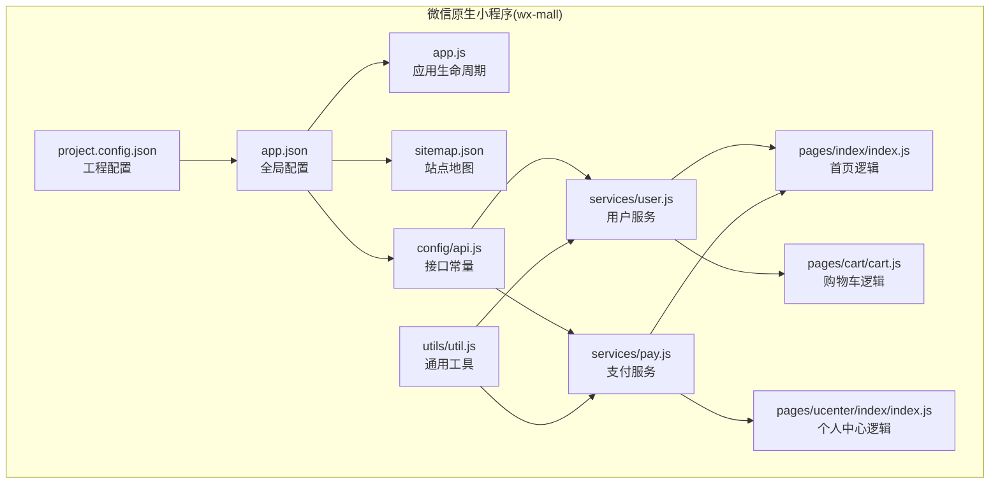
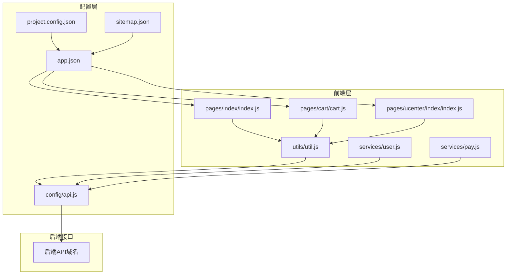
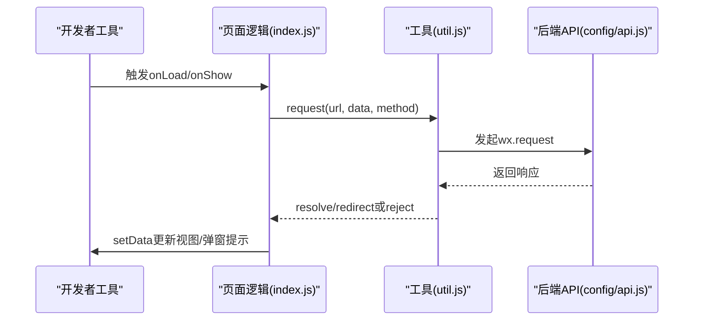
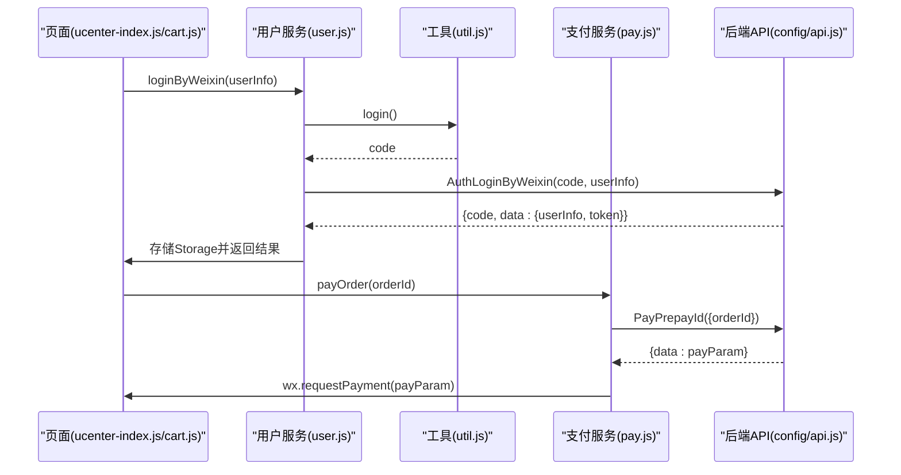
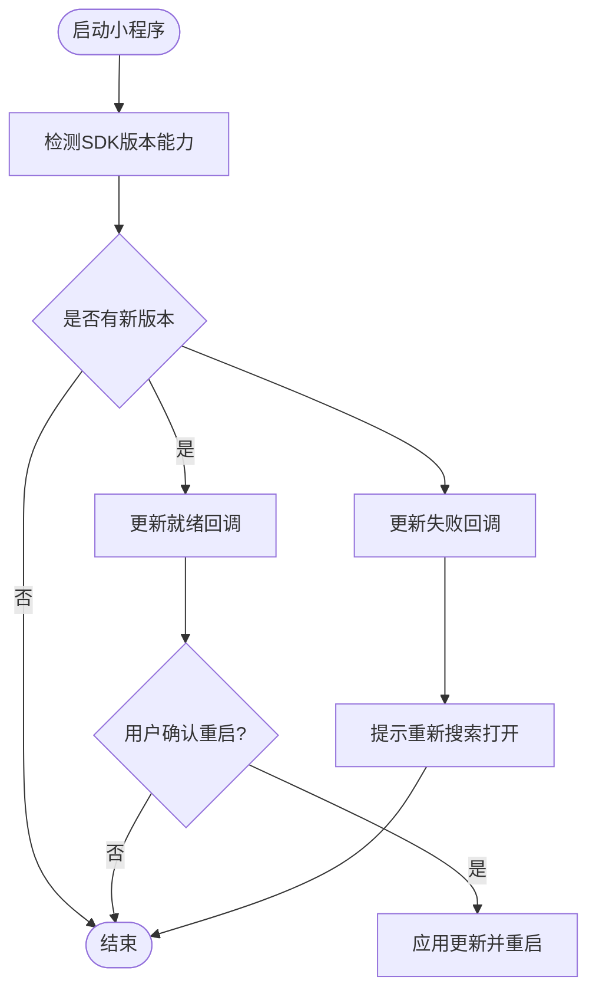
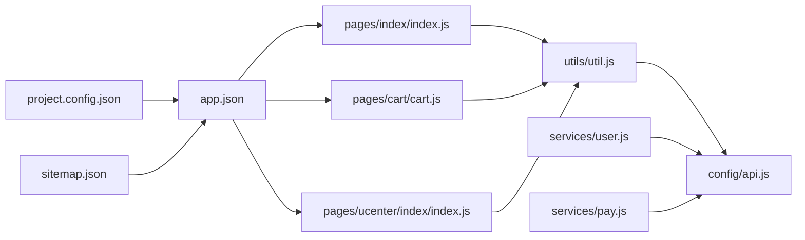

# 调试工具与发布流程

<cite>
**本文引用的文件**
- [project.config.json](file://wx-mall/project.config.json)
- [sitemap.json](file://wx-mall/sitemap.json)
- [app.json](file://wx-mall/app.json)
- [app.js](file://wx-mall/app.js)
- [api.js](file://wx-mall/config/api.js)
- [util.js](file://wx-mall/utils/util.js)
- [user.js](file://wx-mall/services/user.js)
- [pay.js](file://wx-mall/services/pay.js)
- [index.js](file://wx-mall/pages/index/index.js)
- [cart.js](file://wx-mall/pages/cart/cart.js)
- [ucenter-index.js](file://wx-mall/pages/ucenter/index/index.js)
- [manifest.json](file://uni-mall/manifest.json)
- [AGENTS.md](file://wx-mall/agent/AGENTS.md)
</cite>

## 目录
1. [简介](#简介)
2. [项目结构](#项目结构)
3. [核心组件](#核心组件)
4. [架构总览](#架构总览)
5. [详细组件分析](#详细组件分析)
6. [依赖关系分析](#依赖关系分析)
7. [性能考量](#性能考量)
8. [故障排查指南](#故障排查指南)
9. [结论](#结论)
10. [附录](#附录)

## 简介
本文件面向微信小程序开发者，围绕“调试工具与发布流程”主题，系统梳理从本地开发、模拟器/真机调试、断点与网络抓包、Storage检查、Console输出与性能分析，到版本管理、审核准备、上传发布与版本回退的全流程实践。同时补充小程序SEO优化（sitemap）、灰度发布与A/B测试思路以及发布前检查清单与常见问题处理建议。内容基于仓库中的实际配置与源码进行归纳总结，便于不同技术背景的读者快速上手。

## 项目结构
本仓库包含微信小程序与跨平台UniApp工程两套小程序实现：
- 微信原生小程序：wx-mall
- UniApp小程序：uni-mall（可生成微信小程序）

微信原生小程序的关键配置与入口如下：
- 工程配置：project.config.json
- 全局配置：app.json
- 应用生命周期：app.js
- Sitemap：sitemap.json
- API常量：config/api.js
- 工具函数：utils/util.js
- 业务服务：services/user.js、services/pay.js
- 页面示例：pages/index/index.js、pages/cart/cart.js、pages/ucenter/index/index.js

图表来源
- [project.config.json:1-76](file://wx-mall/project.config.json#L1-L76)
- [app.json:1-136](file://wx-mall/app.json#L1-L136)
- [app.js:1-96](file://wx-mall/app.js#L1-L96)
- [sitemap.json:1-7](file://wx-mall/sitemap.json#L1-L7)
- [api.js:1-84](file://wx-mall/config/api.js#L1-L84)
- [util.js:1-132](file://wx-mall/utils/util.js#L1-L132)
- [user.js:1-74](file://wx-mall/services/user.js#L1-L74)
- [pay.js:1-44](file://wx-mall/services/pay.js#L1-L44)
- [index.js:1-123](file://wx-mall/pages/index/index.js#L1-L123)
- [cart.js:1-280](file://wx-mall/pages/cart/cart.js#L1-L280)
- [ucenter-index.js:1-132](file://wx-mall/pages/ucenter/index/index.js#L1-L132)

章节来源
- [project.config.json:1-76](file://wx-mall/project.config.json#L1-L76)
- [app.json:1-136](file://wx-mall/app.json#L1-L136)
- [app.js:1-96](file://wx-mall/app.js#L1-L96)
- [sitemap.json:1-7](file://wx-mall/sitemap.json#L1-L7)
- [api.js:1-84](file://wx-mall/config/api.js#L1-L84)
- [util.js:1-132](file://wx-mall/utils/util.js#L1-L132)
- [user.js:1-74](file://wx-mall/services/user.js#L1-L74)
- [pay.js:1-44](file://wx-mall/services/pay.js#L1-L44)
- [index.js:1-123](file://wx-mall/pages/index/index.js#L1-L123)
- [cart.js:1-280](file://wx-mall/pages/cart/cart.js#L1-L280)
- [ucenter-index.js:1-132](file://wx-mall/pages/ucenter/index/index.js#L1-L132)

## 核心组件
- 工程配置与编译设置：project.config.json控制URL校验、ES6/压缩、WXML/WXSS最小化、本地插件、多帧运行时、API钩子等，直接影响调试与上传行为。
- 全局配置与页面路由：app.json定义页面列表、窗口样式、tabBar、分包策略、插件、懒加载、调试开关与sitemap位置。
- 应用生命周期与更新机制：app.js实现小程序更新检测与提示，确保用户及时获取最新版本。
- 网络请求与鉴权：utils/util.js封装wx.request、登录、会话检查、Toast提示；services/user.js负责登录态维护；services/pay.js封装支付流程。
- 页面逻辑：pages/index/index.js负责首页数据拉取与分享；pages/cart/cart.js负责购物车增删改与下单；pages/ucenter/index/index.js负责用户信息与登录态同步。
- SEO与索引：sitemap.json声明允许所有页面被索引，配合app.json中的sitemapLocation生效。
- UniApp配置：manifest.json中mp-weixin节点包含小程序AppID、调试开关、分包与插件配置，便于跨平台统一管理。

章节来源
- [project.config.json:1-76](file://wx-mall/project.config.json#L1-L76)
- [app.json:1-136](file://wx-mall/app.json#L1-L136)
- [app.js:1-96](file://wx-mall/app.js#L1-L96)
- [util.js:1-132](file://wx-mall/utils/util.js#L1-L132)
- [user.js:1-74](file://wx-mall/services/user.js#L1-L74)
- [pay.js:1-44](file://wx-mall/services/pay.js#L1-L44)
- [index.js:1-123](file://wx-mall/pages/index/index.js#L1-L123)
- [cart.js:1-280](file://wx-mall/pages/cart/cart.js#L1-L280)
- [ucenter-index.js:1-132](file://wx-mall/pages/ucenter/index/index.js#L1-L132)
- [sitemap.json:1-7](file://wx-mall/sitemap.json#L1-L7)
- [manifest.json:169-225](file://uni-mall/manifest.json#L169-L225)

## 架构总览
微信原生小程序采用“配置驱动 + 页面逻辑 + 服务层”的分层架构。页面通过工具函数发起网络请求，服务层对接后端API，全局配置与工程配置决定页面路由、分包、调试与SEO策略。

图表来源
- [app.json:1-136](file://wx-mall/app.json#L1-L136)
- [project.config.json:1-76](file://wx-mall/project.config.json#L1-L76)
- [sitemap.json:1-7](file://wx-mall/sitemap.json#L1-L7)
- [api.js:1-84](file://wx-mall/config/api.js#L1-L84)
- [util.js:1-132](file://wx-mall/utils/util.js#L1-L132)
- [user.js:1-74](file://wx-mall/services/user.js#L1-L74)
- [pay.js:1-44](file://wx-mall/services/pay.js#L1-L44)
- [index.js:1-123](file://wx-mall/pages/index/index.js#L1-L123)
- [cart.js:1-280](file://wx-mall/pages/cart/cart.js#L1-L280)
- [ucenter-index.js:1-132](file://wx-mall/pages/ucenter/index/index.js#L1-L132)

## 详细组件分析

### 组件A：调试与性能分析（模拟器/真机）
- 模拟器调试
  - 在项目根目录使用微信开发者工具打开工程，确保project.config.json中urlCheck、minified、minifyWXML、minifyWXSS等选项符合预期。
  - 启用“调试模式”，在app.json中开启debug开关，便于在工具面板查看数据与网络。
- 真机调试
  - 使用手机微信扫码预览/上传体验版，结合“调试器”查看Console、Storage、Network、AppData等。
  - 关注project.config.json中的“uploadWithSourceMap”以支持源码映射定位。
- 断点调试
  - 在页面逻辑文件（如pages/index/index.js）设置断点，触发交互后观察调用栈与变量。
- 网络抓包
  - 在Network面板筛选XHR/Fetch，结合utils/util.js中的request封装，定位请求头、参数与响应体。
- Storage检查
  - 在Storage面板查看token、userInfo、userId等键值，验证登录态与缓存策略。
- Console输出
  - 在关键流程（如登录、支付）打印日志，结合错误分支（如401重定向）定位问题。
- 性能分析
  - 使用“性能”面板观察首屏渲染、事件处理耗时；关注分包加载与懒加载策略（lazyCodeLoading）。

图表来源
- [index.js:88-109](file://wx-mall/pages/index/index.js#L88-L109)
- [util.js:23-57](file://wx-mall/utils/util.js#L23-L57)
- [api.js:1-84](file://wx-mall/config/api.js#L1-L84)

章节来源
- [project.config.json:1-76](file://wx-mall/project.config.json#L1-L76)
- [app.json:134-135](file://wx-mall/app.json#L134-L135)
- [index.js:1-123](file://wx-mall/pages/index/index.js#L1-L123)
- [util.js:1-132](file://wx-mall/utils/util.js#L1-L132)
- [api.js:1-84](file://wx-mall/config/api.js#L1-L84)

### 组件B：登录与支付流程（断点与网络）
- 登录流程
  - 页面getUserProfile或bindGetUserInfo触发，调用services/user.js的loginByWeixin，内部通过util.login获取code并请求后端换取token与userInfo，成功后写入Storage。
- 支付流程
  - 页面调用services/pay.js的payOrder，向后端申请prepay_id，拿到支付参数后调用wx.requestPayment，处理success/fail/complete回调。

图表来源
- [ucenter-index.js:50-100](file://wx-mall/pages/ucenter/index/index.js#L50-L100)
- [cart.js:215-235](file://wx-mall/pages/cart/cart.js#L215-L235)
- [user.js:11-38](file://wx-mall/services/user.js#L11-L38)
- [util.js:78-93](file://wx-mall/utils/util.js#L78-L93)
- [pay.js:11-39](file://wx-mall/services/pay.js#L11-L39)
- [api.js:17-39](file://wx-mall/config/api.js#L17-L39)

章节来源
- [ucenter-index.js:1-132](file://wx-mall/pages/ucenter/index/index.js#L1-L132)
- [cart.js:1-280](file://wx-mall/pages/cart/cart.js#L1-L280)
- [user.js:1-74](file://wx-mall/services/user.js#L1-L74)
- [util.js:1-132](file://wx-mall/utils/util.js#L1-L132)
- [pay.js:1-44](file://wx-mall/services/pay.js#L1-L44)
- [api.js:1-84](file://wx-mall/config/api.js#L1-L84)

### 组件C：小程序更新与版本管理
- 更新机制
  - app.js在onLaunch中初始化更新管理器，监听更新检查、更新就绪与更新失败事件，引导用户重启应用。
- 版本管理
  - 建议在app.json中维护版本号字段（如version），配合微信开发者工具的“上传并发布”流程进行版本迭代与回滚。

图表来源
- [app.js:2-36](file://wx-mall/app.js#L2-L36)

章节来源
- [app.js:1-96](file://wx-mall/app.js#L1-L96)

### 组件D：SEO与sitemap配置
- sitemap启用
  - app.json中通过sitemapLocation指向sitemap.json，确保页面可被微信索引。
- sitemap规则
  - sitemap.json声明允许所有页面被索引，便于搜索曝光。

章节来源
- [app.json:135-136](file://wx-mall/app.json#L135-L136)
- [sitemap.json:1-7](file://wx-mall/sitemap.json#L1-L7)

### 组件E：灰度发布与A/B测试（概念性说明）
- 灰度发布
  - 可通过后端接口返回差异化功能开关或前端条件编译，逐步扩大流量比例。
- A/B测试
  - 前端按用户标识分流至不同页面或组件，后端记录实验组别与指标，结合数据分析评估效果。
- 数据分析
  - 建议在关键路径埋点上报（登录、支付、分享等），结合微信小程序后台与第三方分析平台进行归因与优化。

（本节为概念性说明，不直接分析具体文件）

## 依赖关系分析
- 页面依赖工具函数与服务层，服务层依赖API常量与工具函数。
- 全局配置决定页面路由、分包与调试开关，工程配置影响编译与上传行为。
- Sitemap与app.json共同决定SEO索引策略。

图表来源
- [index.js:1-123](file://wx-mall/pages/index/index.js#L1-L123)
- [cart.js:1-280](file://wx-mall/pages/cart/cart.js#L1-L280)
- [ucenter-index.js:1-132](file://wx-mall/pages/ucenter/index/index.js#L1-L132)
- [util.js:1-132](file://wx-mall/utils/util.js#L1-L132)
- [user.js:1-74](file://wx-mall/services/user.js#L1-L74)
- [pay.js:1-44](file://wx-mall/services/pay.js#L1-L44)
- [api.js:1-84](file://wx-mall/config/api.js#L1-L84)
- [app.json:1-136](file://wx-mall/app.json#L1-L136)
- [project.config.json:1-76](file://wx-mall/project.config.json#L1-L76)
- [sitemap.json:1-7](file://wx-mall/sitemap.json#L1-L7)

章节来源
- [index.js:1-123](file://wx-mall/pages/index/index.js#L1-L123)
- [cart.js:1-280](file://wx-mall/pages/cart/cart.js#L1-L280)
- [ucenter-index.js:1-132](file://wx-mall/pages/ucenter/index/index.js#L1-L132)
- [util.js:1-132](file://wx-mall/utils/util.js#L1-L132)
- [user.js:1-74](file://wx-mall/services/user.js#L1-L74)
- [pay.js:1-44](file://wx-mall/services/pay.js#L1-L44)
- [api.js:1-84](file://wx-mall/config/api.js#L1-L84)
- [app.json:1-136](file://wx-mall/app.json#L1-L136)
- [project.config.json:1-76](file://wx-mall/project.config.json#L1-L76)
- [sitemap.json:1-7](file://wx-mall/sitemap.json#L1-L7)

## 性能考量
- 分包与懒加载
  - app.json启用subPackages与lazyCodeLoading，降低首屏体积，提升加载速度。
- 编译优化
  - project.config.json中minified、minifyWXML、minifyWXSS开启，有助于减小包体。
- 网络超时
  - app.json中networkTimeout合理设置，避免长时间等待导致卡顿。
- 下拉刷新
  - 页面onPullDownRefresh中应尽快完成数据刷新并停止刷新动画，避免阻塞UI。

章节来源
- [app.json:117-116](file://wx-mall/app.json#L117-L116)
- [project.config.json:9-41](file://wx-mall/project.config.json#L9-L41)
- [app.json:85-88](file://wx-mall/app.json#L85-L88)
- [index.js:36-40](file://wx-mall/pages/index/index.js#L36-L40)

## 故障排查指南
- 登录态异常
  - 检查Storage中token与userInfo是否存在；若后端返回401，页面会跳转至授权页，确认服务端登录接口与前端拦截逻辑。
- 支付失败
  - 核对支付参数构造与wx.requestPayment回调；确认后端prepay_id接口返回正确。
- 网络请求失败
  - 查看Network面板请求状态码与响应体；确认config/api.js中的接口地址与headers。
- 更新提示无效
  - 确认微信版本满足要求；检查app.js中更新管理器初始化与回调逻辑。
- Sitemap未生效
  - 确认app.json中sitemapLocation指向正确；sitemap.json规则是否允许索引。

章节来源
- [util.js:40-56](file://wx-mall/utils/util.js#L40-L56)
- [user.js:20-37](file://wx-mall/services/user.js#L20-L37)
- [pay.js:18-33](file://wx-mall/services/pay.js#L18-L33)
- [api.js:1-84](file://wx-mall/config/api.js#L1-L84)
- [app.js:4-36](file://wx-mall/app.js#L4-L36)
- [app.json:135-136](file://wx-mall/app.json#L135-L136)
- [sitemap.json:1-7](file://wx-mall/sitemap.json#L1-L7)

## 结论
通过对工程配置、全局配置、页面逻辑与服务层的系统梳理，可以形成从本地调试到线上发布的闭环流程。建议在开发过程中充分利用模拟器/真机调试、断点与网络抓包、Storage检查与Console输出，结合分包与懒加载、sitemap配置与版本管理，持续优化用户体验与性能表现。

## 附录

### 发布流程（版本管理、审核准备、上传发布、版本回退）
- 版本管理
  - 在app.json中维护版本号字段，确保每次迭代清晰可追溯。
- 审核准备
  - 准备小程序名称、头像、简介、截图与类目，确保符合微信平台规范。
- 上传发布
  - 在微信开发者工具中选择“上传并发布”，填写版本号与变更说明，提交审核。
- 版本回退
  - 若审核未通过或线上问题，可在微信公众平台历史版本中选择回退至上一稳定版本。

（本节为流程性说明，不直接分析具体文件）

### 发布前检查清单
- 本地联调
  - 登录、支付、分享、下拉刷新、分包加载等关键路径均通过测试。
- 配置核对
  - app.json页面列表、tabBar、分包、插件、sitemapLocation、debug开关核对无误。
  - project.config.json编译与上传设置符合预期。
- SEO与索引
  - sitemap.json规则允许索引，且app.json中sitemapLocation指向正确。
- 性能与兼容
  - 确认网络超时、分包与懒加载策略有效；低端机型与旧版微信兼容性良好。
- 审核材料
  - 名称、头像、简介、截图、类目齐全且合规。

（本节为清单式说明，不直接分析具体文件）