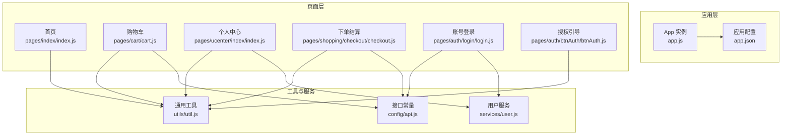
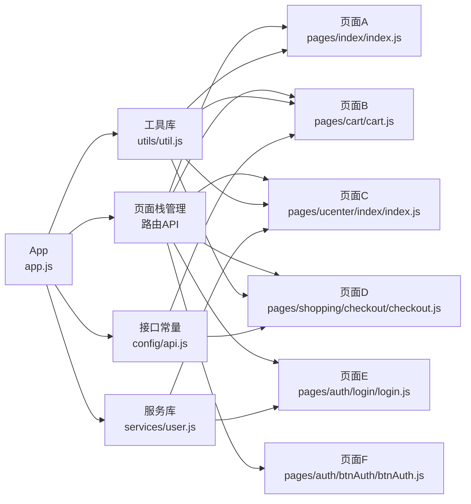
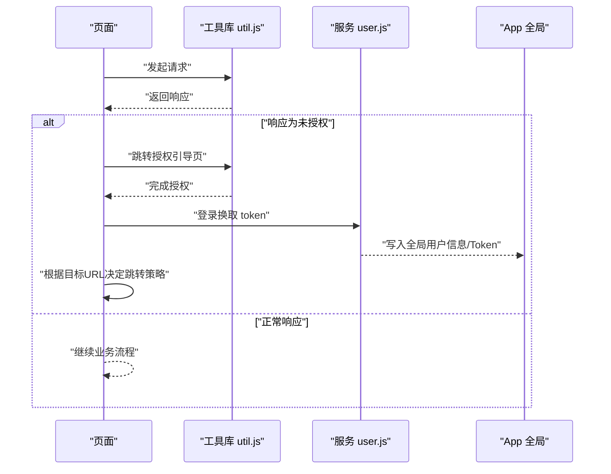
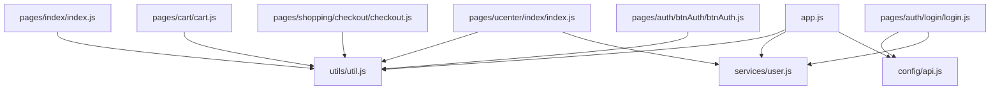

# 页面开发与路由

<cite>
**本文引用的文件**
- [wx-mall/app.js](file://wx-mall/app.js)
- [wx-mall/app.json](file://wx-mall/app.json)
- [wx-mall/pages/index/index.js](file://wx-mall/pages/index/index.js)
- [wx-mall/pages/cart/cart.js](file://wx-mall/pages/cart/cart.js)
- [wx-mall/pages/ucenter/index/index.js](file://wx-mall/pages/ucenter/index/index.js)
- [wx-mall/pages/shopping/checkout/checkout.js](file://wx-mall/pages/shopping/checkout/checkout.js)
- [wx-mall/pages/auth/login/login.js](file://wx-mall/pages/auth/login/login.js)
- [wx-mall/pages/auth/btnAuth/btnAuth.js](file://wx-mall/pages/auth/btnAuth/btnAuth.js)
- [wx-mall/utils/util.js](file://wx-mall/utils/util.js)
- [wx-mall/services/user.js](file://wx-mall/services/user.js)
- [wx-mall/config/api.js](file://wx-mall/config/api.js)
</cite>

## 目录
1. [引言](#引言)
2. [项目结构](#项目结构)
3. [核心组件](#核心组件)
4. [架构总览](#架构总览)
5. [详细组件分析](#详细组件分析)
6. [依赖关系分析](#依赖关系分析)
7. [性能考量](#性能考量)
8. [故障排查指南](#故障排查指南)
9. [结论](#结论)
10. [附录](#附录)

## 引言
本文件面向微信小程序“页面开发与路由系统”的实践与原理，围绕页面生命周期、路由跳转与返回、重定向与条件编译、页面间数据传递、页面栈管理、路由拦截与权限控制进行系统化梳理，并结合仓库中的真实代码示例，给出可操作的最佳实践与排障建议。

## 项目结构
本项目采用标准微信小程序工程组织方式，页面以“pages/路径”组织，公共逻辑集中在 utils、services、config 中，应用级配置位于 app.js 与 app.json。

图表来源
- [wx-mall/app.js:1-96](file://wx-mall/app.js#L1-L96)
- [wx-mall/app.json:1-136](file://wx-mall/app.json#L1-L136)
- [wx-mall/pages/index/index.js:1-123](file://wx-mall/pages/index/index.js#L1-L123)
- [wx-mall/pages/cart/cart.js:1-280](file://wx-mall/pages/cart/cart.js#L1-L280)
- [wx-mall/pages/ucenter/index/index.js:1-132](file://wx-mall/pages/ucenter/index/index.js#L1-L132)
- [wx-mall/pages/shopping/checkout/checkout.js:1-169](file://wx-mall/pages/shopping/checkout/checkout.js#L1-L169)
- [wx-mall/pages/auth/login/login.js:1-106](file://wx-mall/pages/auth/login/login.js#L1-L106)
- [wx-mall/pages/auth/btnAuth/btnAuth.js:1-100](file://wx-mall/pages/auth/btnAuth/btnAuth.js#L1-L100)
- [wx-mall/utils/util.js:1-132](file://wx-mall/utils/util.js#L1-L132)
- [wx-mall/services/user.js:1-74](file://wx-mall/services/user.js#L1-L74)
- [wx-mall/config/api.js:1-84](file://wx-mall/config/api.js#L1-L84)

章节来源
- [wx-mall/app.js:1-96](file://wx-mall/app.js#L1-L96)
- [wx-mall/app.json:1-136](file://wx-mall/app.json#L1-L136)

## 核心组件
- 应用生命周期与全局状态：在应用启动、下拉刷新、全局数据（用户信息、token）等处集中处理，便于统一权限与状态管理。
- 页面生命周期：各页面在 onLoad/onShow/onReady/onHide/onUnload 中执行初始化、刷新、清理等逻辑。
- 路由与页面栈：通过 wx.navigateTo、wx.redirectTo、wx.switchTab、wx.reLaunch 等 API 控制页面跳转与页面栈行为。
- 权限与拦截：在请求封装中根据响应码进行授权引导或重定向，实现轻量的路由拦截。
- 数据传递：通过页面参数、全局变量、本地存储实现跨页面数据流转。

章节来源
- [wx-mall/app.js:38-47](file://wx-mall/app.js#L38-L47)
- [wx-mall/pages/index/index.js:88-122](file://wx-mall/pages/index/index.js#L88-L122)
- [wx-mall/utils/util.js:23-57](file://wx-mall/utils/util.js#L23-L57)

## 架构总览
微信小程序页面开发与路由系统由“应用层-页面层-工具与服务层”三层构成。应用层负责全局配置与生命周期；页面层承载业务视图与交互；工具与服务层提供网络请求、鉴权、数据持久化等能力。

图表来源
- [wx-mall/app.js:1-96](file://wx-mall/app.js#L1-L96)
- [wx-mall/pages/index/index.js:1-123](file://wx-mall/pages/index/index.js#L1-L123)
- [wx-mall/pages/cart/cart.js:1-280](file://wx-mall/pages/cart/cart.js#L1-L280)
- [wx-mall/pages/ucenter/index/index.js:1-132](file://wx-mall/pages/ucenter/index/index.js#L1-L132)
- [wx-mall/pages/shopping/checkout/checkout.js:1-169](file://wx-mall/pages/shopping/checkout/checkout.js#L1-L169)
- [wx-mall/pages/auth/login/login.js:1-106](file://wx-mall/pages/auth/login/login.js#L1-L106)
- [wx-mall/pages/auth/btnAuth/btnAuth.js:1-100](file://wx-mall/pages/auth/btnAuth/btnAuth.js#L1-L100)
- [wx-mall/utils/util.js:1-132](file://wx-mall/utils/util.js#L1-L132)
- [wx-mall/services/user.js:1-74](file://wx-mall/services/user.js#L1-L74)
- [wx-mall/config/api.js:1-84](file://wx-mall/config/api.js#L1-L84)

## 详细组件分析

### 页面生命周期与使用场景
- onLoad(options)：页面加载时执行，适合初始化数据、读取参数、建立订阅等。例如首页在 onLoad 中触发数据拉取与静默登录。
- onShow()：页面显示时执行，适合刷新数据、恢复定时器、监听网络变化等。例如购物车在 onShow 中刷新购物车列表。
- onReady()：页面初次渲染完成时执行，适合执行只运行一次的初始化逻辑，如绑定滚动事件。
- onHide()：页面隐藏时执行，适合暂停动画、停止计时器、释放资源等。
- onUnload()：页面卸载时执行，适合清理定时器、解绑事件、释放大对象等。

章节来源
- [wx-mall/pages/index/index.js:88-122](file://wx-mall/pages/index/index.js#L88-L122)
- [wx-mall/pages/cart/cart.js:19-39](file://wx-mall/pages/cart/cart.js#L19-L39)
- [wx-mall/pages/ucenter/index/index.js:22-49](file://wx-mall/pages/ucenter/index/index.js#L22-L49)

### 路由机制与页面跳转
- 页面跳转
  - navigateTo：保留当前页，打开新页面，适合内部页面跳转。
  - redirectTo：关闭当前页，打开目标页，适合一次性跳转。
  - switchTab：跳转至 tabBar 页面，适合底部导航切换。
  - reLaunch：关闭所有页面，打开某个页面，适合从登录态失效后重新进入。
- 返回与重定向
  - navigateBack：关闭当前页或多级页面，返回上一页或指定页。
  - redirectTo/navigateTo/switchTab/reLaunch：根据业务场景选择合适的跳转策略。
- 条件编译
  - 项目未见显式条件编译示例，通常通过构建脚本或环境变量控制不同产物。

章节来源
- [wx-mall/pages/cart/cart.js:232-234](file://wx-mall/pages/cart/cart.js#L232-L234)
- [wx-mall/pages/shopping/checkout/checkout.js:76-83](file://wx-mall/pages/shopping/checkout/checkout.js#L76-L83)
- [wx-mall/pages/ucenter/index/index.js:116-118](file://wx-mall/pages/ucenter/index/index.js#L116-L118)
- [wx-mall/pages/auth/login/login.js:60-64](file://wx-mall/pages/auth/login/login.js#L60-L64)

### 页面间数据传递
- 参数传递
  - 通过页面跳转 API 的 url 参数携带查询字符串，接收方在 onLoad 中读取 options。
  - 结算页通过参数区分“直接购买/购物车购买”。
- 全局数据共享
  - 使用 App 实例的 globalData 存储用户信息、token、优惠券上下文等。
  - 个人中心在 onShow 中同步本地存储到全局，保证多页面一致。
- 本地存储
  - 使用 wx.setStorageSync/getStorageSync 缓存用户信息与 token，减少重复登录开销。
  - 结算页使用本地存储记录地址 ID，避免重复选择。

章节来源
- [wx-mall/pages/shopping/checkout/checkout.js:25-35](file://wx-mall/pages/shopping/checkout/checkout.js#L25-L35)
- [wx-mall/app.js:38-47](file://wx-mall/app.js#L38-L47)
- [wx-mall/pages/ucenter/index/index.js:31-40](file://wx-mall/pages/ucenter/index/index.js#L31-L40)
- [wx-mall/pages/shopping/checkout/checkout.js:97-106](file://wx-mall/pages/shopping/checkout/checkout.js#L97-L106)

### 页面栈管理、路由拦截与权限控制
- 页面栈管理
  - navigateTo/redirectTo：新增页面入栈。
  - navigateBack：按栈顺序出栈。
  - switchTab：对非 tabBar 页面无效，仅能跳转至 tabBar 页面。
- 路由拦截与权限控制
  - 在请求封装中检测响应码，若为未授权，跳转至授权引导页或登录页。
  - 登录页成功后通过 switchTab 返回个人中心。
  - 授权引导页根据目标 URL 决定使用 switchTab 或 redirectTo。

图表来源
- [wx-mall/utils/util.js:23-57](file://wx-mall/utils/util.js#L23-L57)
- [wx-mall/services/user.js:11-38](file://wx-mall/services/user.js#L11-L38)
- [wx-mall/pages/auth/btnAuth/btnAuth.js:78-87](file://wx-mall/pages/auth/btnAuth/btnAuth.js#L78-L87)
- [wx-mall/pages/auth/login/login.js:60-64](file://wx-mall/pages/auth/login/login.js#L60-L64)

章节来源
- [wx-mall/utils/util.js:23-57](file://wx-mall/utils/util.js#L23-L57)
- [wx-mall/services/user.js:43-57](file://wx-mall/services/user.js#L43-L57)
- [wx-mall/pages/auth/btnAuth/btnAuth.js:78-87](file://wx-mall/pages/auth/btnAuth/btnAuth.js#L78-L87)
- [wx-mall/pages/auth/login/login.js:60-64](file://wx-mall/pages/auth/login/login.js#L60-L64)

### 页面开发最佳实践
- 生命周期使用
  - 在 onShow 中刷新依赖用户态的数据；在 onHide/onUnload 中释放资源。
  - 在 onLoad 中进行一次性初始化，避免重复请求。
- 路由选择
  - 底部导航使用 switchTab；内部跳转使用 navigateTo；一次性跳转使用 redirectTo；异常重置使用 reLaunch。
- 数据传递
  - 参数传递用于轻量数据；全局数据用于高频共享；本地存储用于持久化用户态。
- 性能优化
  - 合理使用 setData，避免频繁触发渲染；分页加载与懒加载；及时释放定时器与事件监听。
- 用户体验
  - 统一 loading/提示样式；下拉刷新与上拉触底交互；错误提示明确且可操作。

章节来源
- [wx-mall/pages/cart/cart.js:28-31](file://wx-mall/pages/cart/cart.js#L28-L31)
- [wx-mall/pages/index/index.js:36-40](file://wx-mall/pages/index/index.js#L36-L40)
- [wx-mall/utils/util.js:23-57](file://wx-mall/utils/util.js#L23-L57)

## 依赖关系分析
- 页面对工具库的依赖：所有页面通过 util.js 进行网络请求与授权拦截。
- 页面对服务库的依赖：个人中心与登录页通过 services/user.js 处理登录态校验与换取 token。
- 页面对配置常量的依赖：购物车与结算页通过 config/api.js 统一管理接口地址。
- 应用层对全局状态的依赖：App 实例集中维护用户信息与 token，供各页面共享。

图表来源
- [wx-mall/pages/index/index.js:1-3](file://wx-mall/pages/index/index.js#L1-L3)
- [wx-mall/pages/cart/cart.js:1-2](file://wx-mall/pages/cart/cart.js#L1-L2)
- [wx-mall/pages/ucenter/index/index.js:1-2](file://wx-mall/pages/ucenter/index/index.js#L1-L2)
- [wx-mall/pages/shopping/checkout/checkout.js:1-2](file://wx-mall/pages/shopping/checkout/checkout.js#L1-L2)
- [wx-mall/pages/auth/login/login.js:1-2](file://wx-mall/pages/auth/login/login.js#L1-L2)
- [wx-mall/pages/auth/btnAuth/btnAuth.js:1-2](file://wx-mall/pages/auth/btnAuth/btnAuth.js#L1-L2)
- [wx-mall/utils/util.js:1](file://wx-mall/utils/util.js#L1)
- [wx-mall/services/user.js:1-6](file://wx-mall/services/user.js#L1-L6)
- [wx-mall/config/api.js:1-3](file://wx-mall/config/api.js#L1-L3)
- [wx-mall/app.js:1-6](file://wx-mall/app.js#L1-L6)

章节来源
- [wx-mall/utils/util.js:123-132](file://wx-mall/utils/util.js#L123-L132)
- [wx-mall/services/user.js:59-62](file://wx-mall/services/user.js#L59-L62)
- [wx-mall/config/api.js:5-84](file://wx-mall/config/api.js#L5-L84)

## 性能考量
- 请求与缓存
  - 使用统一请求封装，集中处理 token 注入与未授权拦截，降低重复逻辑。
  - 对用户信息与 token 使用本地存储，减少重复登录与网络请求。
- 渲染与交互
  - 合理拆分 setData 调用，避免频繁触发视图更新。
  - 分页加载与懒加载，控制首屏数据量。
- 生命周期与资源
  - 在 onHide/onUnload 中释放定时器、事件监听与临时对象，防止内存泄漏。
- 下拉刷新
  - 在窗口配置中启用下拉刷新，配合页面 onPullDownRefresh 使用，提升交互效率。

章节来源
- [wx-mall/app.json:46](file://wx-mall/app.json#L46)
- [wx-mall/pages/index/index.js:36-40](file://wx-mall/pages/index/index.js#L36-L40)
- [wx-mall/utils/util.js:23-57](file://wx-mall/utils/util.js#L23-L57)

## 故障排查指南
- 未授权自动跳转
  - 现象：请求返回未授权码，页面跳转至授权引导页。
  - 处理：检查工具库请求封装与授权页逻辑，确保目标 URL 正确。
- 登录后未回到目标页
  - 现象：登录成功后未回到原页面。
  - 处理：确认登录页成功后使用 switchTab 或 redirectTo 返回正确页面。
- 页面栈异常
  - 现象：多次跳转导致页面栈过深或无法返回。
  - 处理：优先使用 redirectTo 替代 navigateTo，必要时使用 reLaunch 清栈。
- 数据不一致
  - 现象：全局用户信息与本地存储不一致。
  - 处理：在 onShow 中同步本地存储到全局，避免跨页面状态漂移。

章节来源
- [wx-mall/utils/util.js:40-46](file://wx-mall/utils/util.js#L40-L46)
- [wx-mall/pages/auth/btnAuth/btnAuth.js:78-87](file://wx-mall/pages/auth/btnAuth/btnAuth.js#L78-L87)
- [wx-mall/pages/ucenter/index/index.js:31-40](file://wx-mall/pages/ucenter/index/index.js#L31-L40)

## 结论
本项目在页面生命周期、路由跳转、权限拦截与数据传递方面形成了清晰的分层与职责划分。通过统一的工具库与服务库，实现了可复用的网络请求与登录态管理；通过 App 全局状态与本地存储，保障了跨页面的一致性与性能。建议在后续迭代中进一步完善条件编译与页面栈监控，持续优化用户体验与稳定性。

## 附录
- 页面清单与 tabBar 配置
  - 页面清单与 tabBar 配置位于应用配置文件中，便于集中管理页面与底部导航。
- 技术要点速览
  - 生命周期：onLoad/onShow/onReady/onHide/onUnload。
  - 路由：navigateTo/redirectTo/switchTab/reLaunch/navigateBack。
  - 权限：请求拦截 + 授权引导页 + 登录页。
  - 数据：参数传递、全局数据、本地存储。

章节来源
- [wx-mall/app.json:2-40](file://wx-mall/app.json#L2-L40)
- [wx-mall/app.json:48-84](file://wx-mall/app.json#L48-L84)