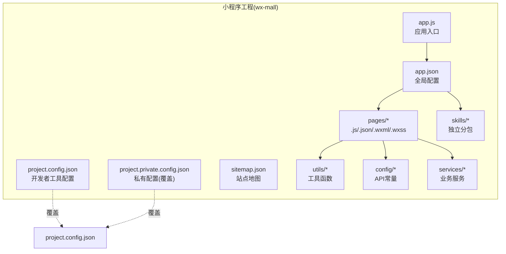
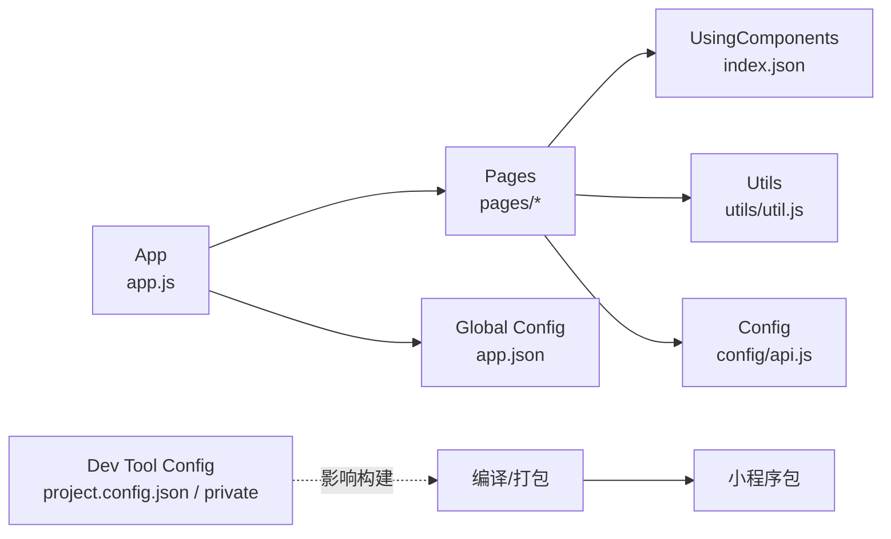
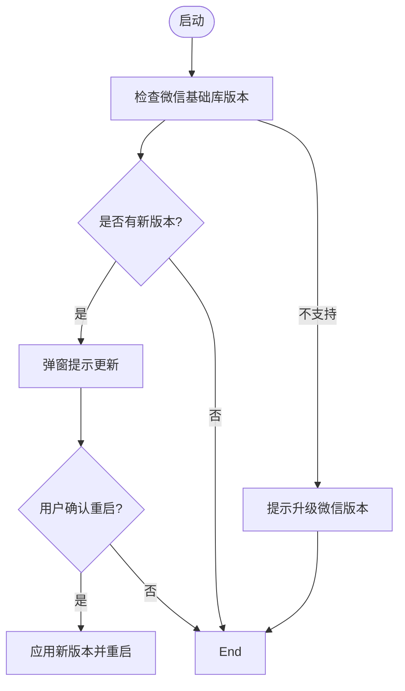
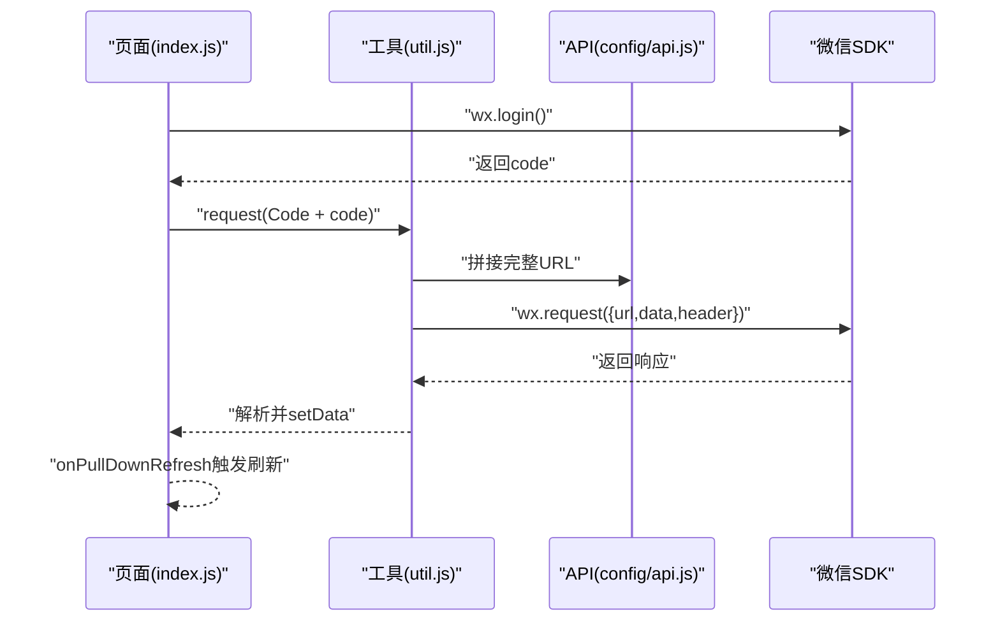
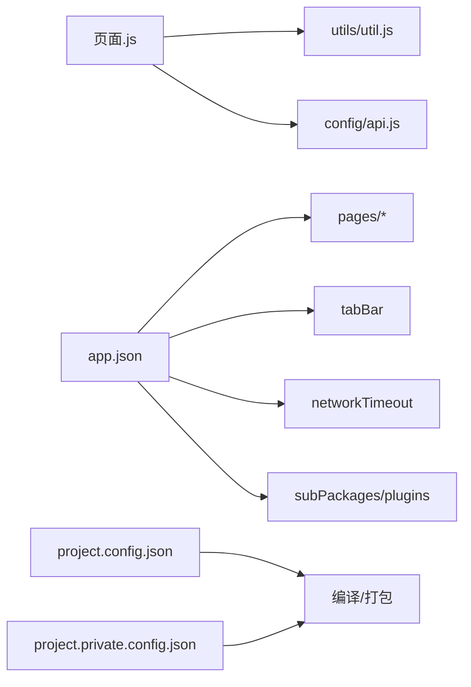

# 项目结构与配置

<cite>
**本文引用的文件**
- [wx-mall/app.js](file://wx-mall/app.js)
- [wx-mall/app.json](file://wx-mall/app.json)
- [wx-mall/project.config.json](file://wx-mall/project.config.json)
- [wx-mall/project.private.config.json](file://wx-mall/project.private.config.json)
- [wx-mall/sitemap.json](file://wx-mall/sitemap.json)
- [wx-mall/utils/util.js](file://wx-mall/utils/util.js)
- [wx-mall/config/api.js](file://wx-mall/config/api.js)
- [wx-mall/pages/index/index.js](file://wx-mall/pages/index/index.js)
- [wx-mall/pages/cart/cart.js](file://wx-mall/pages/cart/cart.js)
- [wx-mall/pages/ucenter/index/index.js](file://wx-mall/pages/ucenter/index/index.js)
- [wx-mall/pages/index/index.json](file://wx-mall/pages/index/index.json)
- [uni-mall/pages.json](file://uni-mall/pages.json)
- [uni-mall/manifest.json](file://uni-mall/manifest.json)
</cite>

## 目录
1. [简介](#简介)
2. [项目结构](#项目结构)
3. [核心组件](#核心组件)
4. [架构总览](#架构总览)
5. [详细组件分析](#详细组件分析)
6. [依赖关系分析](#依赖关系分析)
7. [性能考量](#性能考量)
8. [故障排查指南](#故障排查指南)
9. [结论](#结论)
10. [附录](#附录)

## 简介
本文件面向微信小程序“wx-mall”项目，系统性梳理其项目结构与配置，重点覆盖以下方面：
- 应用入口 app.js 的生命周期与全局能力（更新机制、下拉刷新、全局数据）
- 全局配置 app.json 的页面路由、窗口表现、tabBar、网络超时、插件、分包与调试开关、sitemap 等
- 开发工具配置 project.config.json 与私有配置 project.private.config.json 的差异与作用
- 页面与服务层如何基于配置进行交互（请求封装、页面样式与导航）
- 与 uni-app 平台的 pages.json/manifest.json 对比，帮助理解跨平台差异
- 最佳实践与常见问题处理建议

## 项目结构
微信小程序采用“原生小程序”工程组织方式，核心目录与职责如下：
- 根目录 wx-mall
  - app.js/app.json/app.wxss：应用入口与全局配置
  - project.config.json/project.private.config.json：开发者工具配置与私有覆盖
  - sitemap.json：搜索引擎收录规则
  - pages/*：页面源码（.js/.json/.wxml/.wxss），每个页面由“逻辑+配置+模板+样式”四部分组成
  - utils/*：通用工具函数（网络请求、登录态、提示等）
  - config/*：常量与 API 地址定义
  - services/*：业务服务模块（如用户、支付）
  - static/images/*：静态资源
  - skills/*：技能分包（独立子包）

图表来源
- [wx-mall/app.js:1-96](file://wx-mall/app.js#L1-L96)
- [wx-mall/app.json:1-136](file://wx-mall/app.json#L1-L136)
- [wx-mall/project.config.json:1-76](file://wx-mall/project.config.json#L1-L76)
- [wx-mall/project.private.config.json:1-26](file://wx-mall/project.private.config.json#L1-L26)
- [wx-mall/sitemap.json:1-7](file://wx-mall/sitemap.json#L1-L7)

章节来源
- [wx-mall/app.js:1-96](file://wx-mall/app.js#L1-L96)
- [wx-mall/app.json:1-136](file://wx-mall/app.json#L1-L136)
- [wx-mall/project.config.json:1-76](file://wx-mall/project.config.json#L1-L76)
- [wx-mall/project.private.config.json:1-26](file://wx-mall/project.private.config.json#L1-L26)
- [wx-mall/sitemap.json:1-7](file://wx-mall/sitemap.json#L1-L7)

## 核心组件
- 应用入口与生命周期
  - 启动阶段检查更新、版本兼容提示、错误兜底
  - 全局数据 globalData 统一存放用户信息、token、默认优惠券等
  - 下拉刷新 onPullDownRefresh 的统一处理
- 全局配置 app.json
  - pages：声明页面路由表
  - window：导航栏、下拉刷新等窗口表现
  - tabBar：底部导航与图标
  - networkTimeout：网络请求与下载文件超时
  - plugins/subPackages：插件与分包配置
  - debug：调试开关
  - sitemapLocation：sitemap 文件位置
- 开发者工具配置
  - project.config.json：构建选项、编译参数、打包策略、条件编译等
  - project.private.config.json：本地私有覆盖，便于团队协作与个性化调试

章节来源
- [wx-mall/app.js:1-96](file://wx-mall/app.js#L1-L96)
- [wx-mall/app.json:1-136](file://wx-mall/app.json#L1-L136)
- [wx-mall/project.config.json:1-76](file://wx-mall/project.config.json#L1-L76)
- [wx-mall/project.private.config.json:1-26](file://wx-mall/project.private.config.json#L1-L26)

## 架构总览
小程序运行时由框架驱动，页面通过 app.json 注册，页面逻辑在 .js 中实现，UI 在 .wxml 中描述，样式在 .wxss 中定义；页面可复用组件通过 usingComponents 引入。

图表来源
- [wx-mall/app.js:1-96](file://wx-mall/app.js#L1-L96)
- [wx-mall/app.json:1-136](file://wx-mall/app.json#L1-L136)
- [wx-mall/pages/index/index.json:1-6](file://wx-mall/pages/index/index.json#L1-L6)
- [wx-mall/utils/util.js:1-132](file://wx-mall/utils/util.js#L1-L132)
- [wx-mall/config/api.js:1-84](file://wx-mall/config/api.js#L1-L84)
- [wx-mall/project.config.json:1-76](file://wx-mall/project.config.json#L1-L76)
- [wx-mall/project.private.config.json:1-26](file://wx-mall/project.private.config.json#L1-L26)

## 详细组件分析

### 应用入口 app.js
- 生命周期与更新机制
  - onLaunch：检测微信基础库版本，使用 UpdateManager 实现静默更新与二次确认更新
  - onPullDownRefresh：统一显示/隐藏导航加载、停止下拉动作
  - globalData：集中存放用户信息、token、默认优惠券等
- 版本兼容与降级提示
  - 当基础库低于阈值时，引导用户升级微信版本

图表来源
- [wx-mall/app.js:1-96](file://wx-mall/app.js#L1-L96)

章节来源
- [wx-mall/app.js:1-96](file://wx-mall/app.js#L1-L96)

### 全局配置 app.json
- 页面路由 pages
  - 列出所有页面路径，决定小程序的页面清单
- 窗口表现 window
  - 导航栏背景色、标题、文字颜色、下拉刷新开关
- 底部导航 tabBar
  - backgroundColor、borderStyle、selectedColor、color
  - list：pagePath、iconPath、selectedIconPath、text
- 网络超时 networkTimeout
  - request、downloadFile 的超时时间
- 插件 plugins
  - 声明使用的插件及其 provider、version
- 分包 subPackages
  - skills/* 独立分包，提升首屏加载性能
- 调试 debug
  - 开发期开启，便于日志与断点调试
- Sitemap
  - sitemapLocation 指向 sitemap.json，控制页面可被索引范围

章节来源
- [wx-mall/app.json:1-136](file://wx-mall/app.json#L1-L136)
- [wx-mall/sitemap.json:1-7](file://wx-mall/sitemap.json#L1-L7)

### 开发者工具配置 project.config.json 与 project.private.config.json
- project.config.json
  - setting：编译优化、代码压缩、多帧、API Hook、本地调试等开关
  - compileType、libVersion、appid、projectname
  - packOptions、editorSetting
- project.private.config.json
  - 本地私有覆盖，适合团队成员差异化调试（如热重载、忽略未使用文件等）
  - 优先级高于 project.config.json

章节来源
- [wx-mall/project.config.json:1-76](file://wx-mall/project.config.json#L1-L76)
- [wx-mall/project.private.config.json:1-26](file://wx-mall/project.private.config.json#L1-L26)

### 页面与服务交互示例
- 首页 pages/index/index.js
  - 使用 utils/request 发起 API 请求，聚合多个接口数据
  - 登录流程：wx.login -> 请求后端换取 token -> 缓存用户信息
  - 分享能力：onShareAppMessage/onShareTimeline
  - 下拉刷新：onPullDownRefresh 调用数据刷新方法
- 购物车 pages/cart/cart.js
  - 展示购物车列表、计算合计、勾选/全选、数量变更、删除
  - 结算：筛选已选商品后跳转结算页
- 我的页面 pages/ucenter/index/index.js
  - 用户信息获取与缓存同步、登出、菜单项跳转

图表来源
- [wx-mall/pages/index/index.js:1-123](file://wx-mall/pages/index/index.js#L1-L123)
- [wx-mall/utils/util.js:1-132](file://wx-mall/utils/util.js#L1-L132)
- [wx-mall/config/api.js:1-84](file://wx-mall/config/api.js#L1-L84)

章节来源
- [wx-mall/pages/index/index.js:1-123](file://wx-mall/pages/index/index.js#L1-L123)
- [wx-mall/pages/cart/cart.js:1-280](file://wx-mall/pages/cart/cart.js#L1-L280)
- [wx-mall/pages/ucenter/index/index.js:1-132](file://wx-mall/pages/ucenter/index/index.js#L1-L132)
- [wx-mall/utils/util.js:1-132](file://wx-mall/utils/util.js#L1-L132)
- [wx-mall/config/api.js:1-84](file://wx-mall/config/api.js#L1-L84)

### 组件与页面配置
- 页面 JSON 配置
  - usingComponents：在页面内注册自定义组件，如 AI 引导入口
- 页面样式与导航
  - 页面可在自身 json 中声明导航栏标题、下拉刷新、滚动行为等
  - 全局样式与导航栏主题在 app.json 中统一配置

章节来源
- [wx-mall/pages/index/index.json:1-6](file://wx-mall/pages/index/index.json#L1-L6)
- [uni-mall/pages.json:1-385](file://uni-mall/pages.json#L1-L385)

### 与 uni-app 平台对比
- pages.json（uni-app）
  - pages：每页可指定 style，含导航栏、下拉刷新、触底距离、平台特定属性（如 app-plus 的 bounce）
  - globalStyle：全局导航栏样式
  - tabBar：与小程序一致
- manifest.json（uni-app）
  - mp-weixin：小程序平台专属配置，包含 appid、setting、usingComponents、agent、subPackages、plugins 等
  - app-plus：5+App 打包配置（Android/iOS 权限、模块、支付、分享等）
  - 多端目标：h5、快应用、各小程序平台等

章节来源
- [uni-mall/pages.json:1-385](file://uni-mall/pages.json#L1-L385)
- [uni-mall/manifest.json:1-274](file://uni-mall/manifest.json#L1-L274)

## 依赖关系分析
- 页面对工具与配置的依赖
  - 页面 .js 依赖 utils/util.js 进行网络请求与登录态校验
  - 页面 .js 依赖 config/api.js 获取接口地址
- 全局配置对页面与运行时的影响
  - app.json 的 pages 决定页面清单
  - window/tabBar 影响导航与样式
  - subPackages 与 plugins 影响包体积与功能
- 开发工具配置对构建与调试的影响
  - project.config.json 控制编译优化、压缩、多帧、API Hook 等
  - project.private.config.json 可覆盖上述设置以适配本地环境

图表来源
- [wx-mall/pages/index/index.js:1-123](file://wx-mall/pages/index/index.js#L1-L123)
- [wx-mall/utils/util.js:1-132](file://wx-mall/utils/util.js#L1-L132)
- [wx-mall/config/api.js:1-84](file://wx-mall/config/api.js#L1-L84)
- [wx-mall/app.json:1-136](file://wx-mall/app.json#L1-L136)
- [wx-mall/project.config.json:1-76](file://wx-mall/project.config.json#L1-L76)
- [wx-mall/project.private.config.json:1-26](file://wx-mall/project.private.config.json#L1-L26)

章节来源
- [wx-mall/app.json:1-136](file://wx-mall/app.json#L1-L136)
- [wx-mall/project.config.json:1-76](file://wx-mall/project.config.json#L1-L76)
- [wx-mall/project.private.config.json:1-26](file://wx-mall/project.private.config.json#L1-L26)

## 性能考量
- 分包策略
  - 将高频但非首屏使用的功能拆分为独立分包（如 skills/*），降低首屏包体，缩短首屏加载时间
- 网络超时
  - 合理设置 networkTimeout.request 与 downloadFile，避免长时间阻塞
- 组件懒加载
  - 使用 lazyCodeLoading 与独立分包，结合页面按需加载，减少主包体积
- 构建优化
  - project.config.json 中的压缩、多帧、API Hook 等选项应按需启用，平衡性能与调试便利性

## 故障排查指南
- 更新机制相关
  - 若用户设备基础库过低导致无法更新，应在 app.js 中引导升级微信版本
  - 更新失败时弹窗提示用户删除后重试
- 登录与鉴权
  - util.js 中对 401 的处理会跳转至授权页，确保页面路径正确且授权流程可用
- 下拉刷新
  - onPullDownRefresh 中需确保隐藏加载与停止下拉动作，避免 UI 卡顿
- 网络请求
  - request 方法统一注入 token，若接口报错，检查 API 常量与后端返回结构
- 分包与插件
  - subPackages 与 plugins 需与实际目录结构一致，否则可能导致加载失败
- Sitemap
  - 若页面未被索引，检查 sitemap.json 的规则与 sitemapLocation

章节来源
- [wx-mall/app.js:1-96](file://wx-mall/app.js#L1-L96)
- [wx-mall/utils/util.js:1-132](file://wx-mall/utils/util.js#L1-L132)
- [wx-mall/config/api.js:1-84](file://wx-mall/config/api.js#L1-L84)
- [wx-mall/app.json:1-136](file://wx-mall/app.json#L1-L136)
- [wx-mall/sitemap.json:1-7](file://wx-mall/sitemap.json#L1-L7)

## 结论
本项目遵循微信小程序标准工程化实践：以 app.json 管控页面与全局样式，以 app.js 管理生命周期与全局数据，以 utils/config/services 解耦页面逻辑与业务细节；通过分包与插件优化包体与功能扩展；借助 project.config.json 与 project.private.config.json 实现可维护的开发工具配置。配合 uni-app 的 pages.json/manifest.json，可进一步支撑多端发布与平台特性定制。

## 附录

### 配置项速查与最佳实践
- 页面路由与窗口
  - pages：按访问频次与功能归类，避免首屏冗余
  - window：导航栏风格统一，下拉刷新仅在必要页面开启
- tabBar
  - 图标尺寸与文案简洁，颜色与主色调协调
- 网络超时
  - request/downloadFile 设置合理上限，结合错误提示与重试策略
- 分包与插件
  - 将冷启动无关功能放入独立分包，插件版本与 provider 保持一致
- 调试与 Sitemap
  - 开发期开启 debug，生产关闭；sitemap 规则按需开放
- 开发工具配置
  - project.config.json 作为团队基线，project.private.config.json 仅做本地覆盖

### 修改指南与常见问题
- 修改页面路由
  - 在 app.json 的 pages 数组中增删路径，确保对应目录存在
- 调整导航栏
  - 在 app.json 的 window 或页面 json 的 style 中调整主题与标题
- 启用分包
  - 在 app.json 的 subPackages 中新增 root 与 pages，注意独立分包的独立部署要求
- 插件接入
  - 在 app.json 的 plugins 中声明 provider 与 version，确保权限与签名匹配
- API 地址迁移
  - 在 config/api.js 中统一修改基础地址，确保缓存键一致
- 私有配置覆盖
  - 在 project.private.config.json 中覆盖本地开发偏好，避免提交到仓库