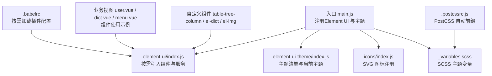
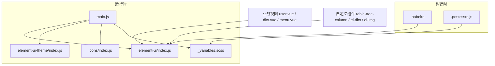
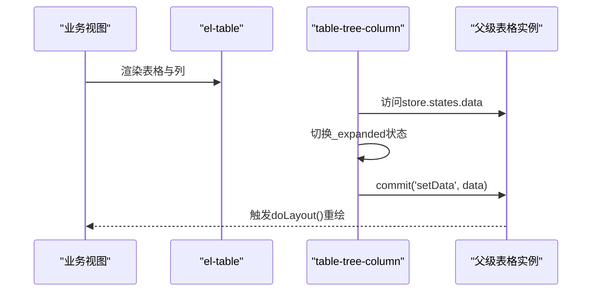
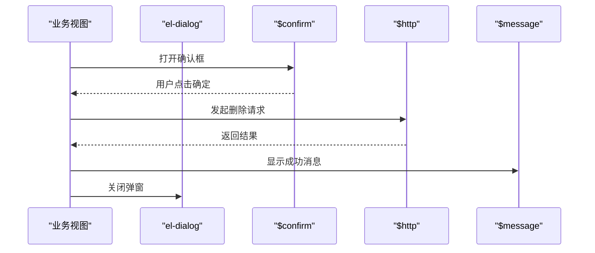
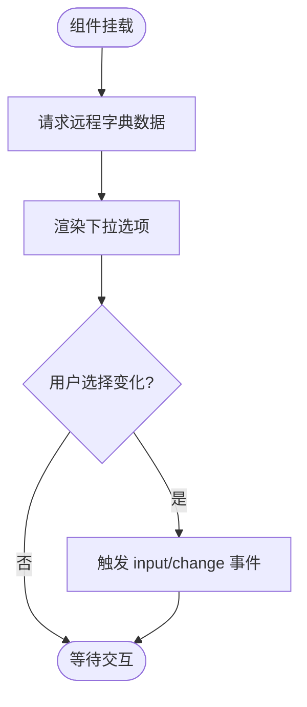
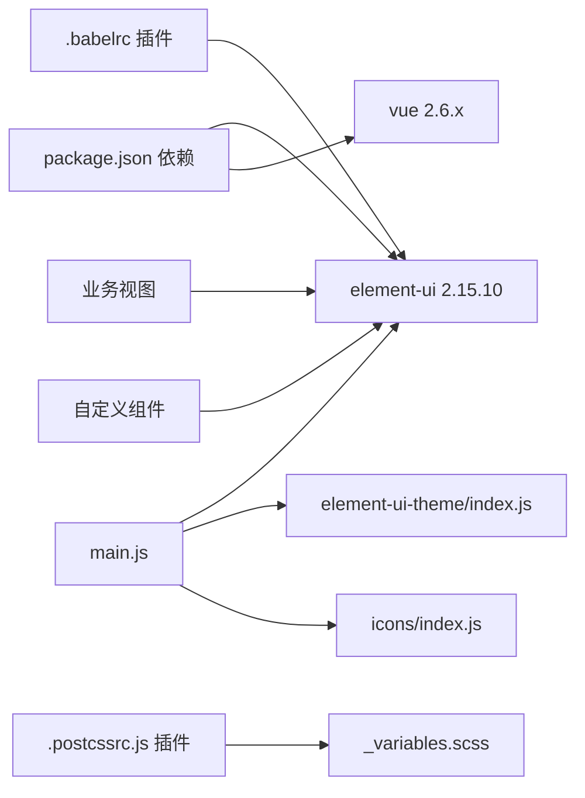

# Element UI组件库集成

<cite>
**本文引用的文件**
- [package.json](file://platform-admin-ui/package.json)
- [main.js](file://platform-admin-ui/src/main.js)
- [element-ui/index.js](file://platform-admin-ui/src/element-ui/index.js)
- [element-ui-theme/index.js](file://platform-admin-ui/src/element-ui-theme/index.js)
- [.babelrc](file://platform-admin-ui/.babelrc)
- [.postcssrc.js](file://platform-admin-ui/.postcssrc.js)
- [_variables.scss](file://platform-admin-ui/src/assets/scss/_variables.scss)
- [theme.vue](file://platform-admin-ui/src/views/common/theme.vue)
- [table-tree-column/index.vue](file://platform-admin-ui/src/components/table-tree-column/index.vue)
- [el-dict/index.vue](file://platform-admin-ui/src/components/el-dict/index.vue)
- [el-img/index.vue](file://platform-admin-ui/src/components/el-img/index.vue)
- [icons/index.js](file://platform-admin-ui/src/icons/index.js)
- [user.vue](file://platform-admin-ui/src/views/modules/sys/user.vue)
- [dict.vue](file://platform-admin-ui/src/views/modules/sys/dict.vue)
- [menu.vue](file://platform-admin-ui/src/views/modules/sys/menu.vue)
</cite>

## 目录
1. [简介](#简介)
2. [项目结构](#项目结构)
3. [核心组件](#核心组件)
4. [架构总览](#架构总览)
5. [详细组件分析](#详细组件分析)
6. [依赖关系分析](#依赖关系分析)
7. [性能考虑](#性能考虑)
8. [故障排查指南](#故障排查指南)
9. [结论](#结论)
10. [附录](#附录)

## 简介
本文件面向Element UI 2.15.10在平台前端中的集成与使用，系统性梳理组件按需加载、主题定制与样式覆盖策略；详解表格、表单、对话框、导航菜单、标签页等常用业务组件的属性配置、事件处理、插槽使用与样式自定义；介绍主题切换机制、图标系统集成与响应式设计实现；并提供组件开发规范、样式管理最佳实践与性能优化建议。

## 项目结构
平台前端采用Vue 2.x + Element UI 2.15.10技术栈，通过Babel按需加载插件与Webpack构建链路，结合SCSS变量与PostCSS自动前缀，形成可维护的主题体系与组件生态。入口文件统一注册Element UI组件与自定义组件，主题通过多套CSS资源切换，图标系统采用SVG Sprite。

图表来源
- [main.js:1-80](file://platform-admin-ui/src/main.js#L1-L80)
- [element-ui/index.js:1-184](file://platform-admin-ui/src/element-ui/index.js#L1-L184)
- [element-ui-theme/index.js:1-41](file://platform-admin-ui/src/element-ui-theme/index.js#L1-L41)
- [icons/index.js:1-15](file://platform-admin-ui/src/icons/index.js#L1-L15)
- [_variables.scss:1-14](file://platform-admin-ui/src/assets/scss/_variables.scss#L1-L14)
- [.babelrc:1-36](file://platform-admin-ui/.babelrc#L1-L36)
- [.postcssrc.js:1-10](file://platform-admin-ui/.postcssrc.js#L1-L10)
- [user.vue:1-200](file://platform-admin-ui/src/views/modules/sys/user.vue#L1-L200)
- [dict.vue:1-187](file://platform-admin-ui/src/views/modules/sys/dict.vue#L1-L187)
- [menu.vue:1-163](file://platform-admin-ui/src/views/modules/sys/menu.vue#L1-L163)

章节来源
- [package.json:1-102](file://platform-admin-ui/package.json#L1-L102)
- [main.js:1-80](file://platform-admin-ui/src/main.js#L1-L80)
- [.babelrc:1-36](file://platform-admin-ui/.babelrc#L1-L36)
- [.postcssrc.js:1-10](file://platform-admin-ui/.postcssrc.js#L1-L10)

## 核心组件
- Element UI组件按需加载：通过Babel插件与element-ui/index.js实现按需引入，仅打包所需组件，降低体积。
- 全局服务挂载：将Loading、MessageBox、Notification、Message等服务挂载到Vue原型，便于全局调用。
- 主题系统：通过element-ui-theme/index.js导入当前主题CSS，并提供主题色清单；SCSS变量与主题CSS保持主色一致性以实现整站主题切换。
- 图标系统：icons/index.js注册IconSvg组件，批量加载SVG图标资源，支持业务中直接使用图标组件。
- 自定义组件：table-tree-column（树形表格列）、el-dict（数据字典选择器）、el-img（图片选择器）等增强业务能力。

章节来源
- [element-ui/index.js:1-184](file://platform-admin-ui/src/element-ui/index.js#L1-L184)
- [main.js:20-60](file://platform-admin-ui/src/main.js#L20-L60)
- [element-ui-theme/index.js:1-41](file://platform-admin-ui/src/element-ui-theme/index.js#L1-L41)
- [_variables.scss:1-14](file://platform-admin-ui/src/assets/scss/_variables.scss#L1-L14)
- [icons/index.js:1-15](file://platform-admin-ui/src/icons/index.js#L1-L15)

## 架构总览
Element UI集成采用“入口统一注册 + 按需加载 + 主题与样式解耦”的架构模式。入口文件负责注册组件、主题与工具函数；element-ui/index.js集中管理组件清单；element-ui-theme/index.js提供主题切换入口；SCSS变量与PostCSS保证样式一致性与兼容性；业务视图与自定义组件在模板中组合使用Element UI组件。

图表来源
- [main.js:1-80](file://platform-admin-ui/src/main.js#L1-L80)
- [element-ui/index.js:1-184](file://platform-admin-ui/src/element-ui/index.js#L1-L184)
- [element-ui-theme/index.js:1-41](file://platform-admin-ui/src/element-ui-theme/index.js#L1-L41)
- [icons/index.js:1-15](file://platform-admin-ui/src/icons/index.js#L1-L15)
- [_variables.scss:1-14](file://platform-admin-ui/src/assets/scss/_variables.scss#L1-L14)
- [.babelrc:1-36](file://platform-admin-ui/.babelrc#L1-L36)
- [.postcssrc.js:1-10](file://platform-admin-ui/.postcssrc.js#L1-L10)
- [user.vue:1-200](file://platform-admin-ui/src/views/modules/sys/user.vue#L1-L200)
- [dict.vue:1-187](file://platform-admin-ui/src/views/modules/sys/dict.vue#L1-L187)
- [menu.vue:1-163](file://platform-admin-ui/src/views/modules/sys/menu.vue#L1-L163)

## 详细组件分析

### 表格组件（el-table）与树形列
- 常见用法：在业务视图中使用el-form进行筛选，el-table展示数据，el-table-column定义列，配合el-pagination实现分页。
- 插槽与事件：通过slot-scope访问行数据，绑定selection-change等事件实现多选与批量操作。
- 自定义列：table-tree-column封装树形展开/折叠逻辑，通过props控制键名与层级，内部维护_expanded状态并触发表格重新布局。

图表来源
- [menu.vue:19-25](file://platform-admin-ui/src/views/modules/sys/menu.vue#L19-L25)
- [table-tree-column/index.vue:52-66](file://platform-admin-ui/src/components/table-tree-column/index.vue#L52-L66)

章节来源
- [user.vue:38-131](file://platform-admin-ui/src/views/modules/sys/user.vue#L38-L131)
- [dict.vue:15-78](file://platform-admin-ui/src/views/modules/sys/dict.vue#L15-L78)
- [menu.vue:19-89](file://platform-admin-ui/src/views/modules/sys/menu.vue#L19-L89)
- [table-tree-column/index.vue:1-85](file://platform-admin-ui/src/components/table-tree-column/index.vue#L1-L85)

### 表单组件（el-form）与校验
- 常见用法：在业务视图中使用el-form进行条件筛选，绑定@keyup.enter.native触发查询，结合el-input、el-select等控件完成输入与选择。
- 事件处理：通过@change、@click等事件驱动数据刷新或弹窗打开，配合分页组件实现列表更新。
- 属性配置：inline布局提升横向紧凑度；clearable支持一键清空；filterable启用可搜索下拉。

章节来源
- [user.vue:3-37](file://platform-admin-ui/src/views/modules/sys/user.vue#L3-L37)
- [dict.vue:3-14](file://platform-admin-ui/src/views/modules/sys/dict.vue#L3-L14)

### 对话框与确认交互
- 交互流程：通过$confirm触发二次确认，成功后调用接口执行删除等操作，返回后通过$message反馈结果。
- 组件使用：el-dialog用于图片选择弹窗，el-form用于上传操作，el-row/col网格布局展示图片卡片。

图表来源
- [el-img/index.vue:128-151](file://platform-admin-ui/src/components/el-img/index.vue#L128-L151)

章节来源
- [el-img/index.vue:1-166](file://platform-admin-ui/src/components/el-img/index.vue#L1-L166)

### 导航菜单与标签页
- 导航菜单：在菜单管理页面使用el-table展示树形菜单，结合自定义table-tree-column实现层级渲染与展开/折叠。
- 标签页：在主题设置视图中使用el-tabs与el-tab-pane组织布局设置项，结合Vuex状态管理实现导航条类型与侧边栏皮肤的实时切换。

章节来源
- [menu.vue:19-89](file://platform-admin-ui/src/views/modules/sys/menu.vue#L19-L89)
- [theme.vue:1-58](file://platform-admin-ui/src/views/common/theme.vue#L1-L58)

### 数据字典选择器（el-dict）
- 功能特性：根据传入的code远程加载字典项，支持disabled、v-model双向绑定，内部监听change/input事件向父组件回传值。
- 使用场景：用户性别、状态等字段的下拉选择，结合transDict等工具函数进行显示转换。

图表来源
- [el-dict/index.vue:58-72](file://platform-admin-ui/src/components/el-dict/index.vue#L58-L72)

章节来源
- [el-dict/index.vue:1-75](file://platform-admin-ui/src/components/el-dict/index.vue#L1-L75)

### 图片选择器（el-img）
- 功能特性：内置图片列表弹窗，支持分页、上传、删除、选择等操作；通过v-model双向绑定图片URL；集成权限判断与消息提示。
- 交互流程：点击打开弹窗 -> 加载图片列表 -> 选择图片 -> 回填URL并触发change事件。

章节来源
- [el-img/index.vue:1-166](file://platform-admin-ui/src/components/el-img/index.vue#L1-L166)

### 图标系统（SVG）
- 注册方式：icons/index.js批量注册IconSvg组件，扫描svg目录生成图标列表。
- 使用方式：在菜单等位置通过<icon-svg :name="..."/>渲染对应SVG图标，实现轻量、可缩放的图标展示。

章节来源
- [icons/index.js:1-15](file://platform-admin-ui/src/icons/index.js#L1-L15)
- [menu.vue:37-39](file://platform-admin-ui/src/views/modules/sys/menu.vue#L37-L39)

## 依赖关系分析
- 组件依赖：业务视图依赖Element UI组件与自定义组件；自定义组件依赖Element UI基础组件与工具函数。
- 构建依赖：Babel按需加载插件在编译期将按需引入的组件转换为实际引用；PostCSS自动添加浏览器前缀，保证样式兼容。
- 主题依赖：element-ui-theme/index.js导出主题清单，_variables.scss提供SCSS变量，二者需保持主色一致以实现整站主题切换。

图表来源
- [package.json:14-36](file://platform-admin-ui/package.json#L14-L36)
- [.babelrc:11-22](file://platform-admin-ui/.babelrc#L11-L22)
- [.postcssrc.js:3-9](file://platform-admin-ui/.postcssrc.js#L3-L9)
- [main.js:10-14](file://platform-admin-ui/src/main.js#L10-L14)
- [element-ui-theme/index.js:9](file://platform-admin-ui/src/element-ui-theme/index.js#L9)
- [icons/index.js:1-4](file://platform-admin-ui/src/icons/index.js#L1-L4)

章节来源
- [package.json:1-102](file://platform-admin-ui/package.json#L1-L102)
- [.babelrc:1-36](file://platform-admin-ui/.babelrc#L1-L36)
- [.postcssrc.js:1-10](file://platform-admin-ui/.postcssrc.js#L1-L10)

## 性能考虑
- 按需加载：通过Babel插件与element-ui/index.js按需引入组件，避免全量打包，显著减少首屏体积。
- 组件懒加载：对非首屏使用的业务视图与弹窗组件采用异步加载，降低初始渲染压力。
- 列表优化：表格分页与虚拟滚动（如需）结合，减少DOM节点数量；避免在render中进行重型计算。
- 样式优化：统一使用SCSS变量与PostCSS自动前缀，减少重复样式与兼容性问题；主题切换仅替换CSS文件，不涉及JS重渲染。
- 图标优化：SVG内联与Sprite化，避免HTTP请求与闪烁；仅注册必要图标组件，减少全局注册开销。

## 故障排查指南
- 组件未生效：检查element-ui/index.js是否正确引入目标组件，确认main.js已引入该文件。
- 主题不一致：核对_element-ui-theme/index.js当前主题与_variables.scss主色是否一致，确保构建后样式同步。
- 按需加载失效：检查.babelrc中babel-plugin-component配置，确认styleLibraryName指向theme-chalk。
- 图标不显示：确认icons/index.js已注册IconSvg组件，且图标文件存在于svg目录中。
- 表格列异常：检查table-tree-column的props配置（treeKey、parentKey、levelKey、childKey），确保数据结构匹配。
- 分页/弹窗交互异常：确认事件绑定与数据流（如selection-change、@refreshDataList）是否正确传递至父组件。

章节来源
- [element-ui/index.js:10-93](file://platform-admin-ui/src/element-ui/index.js#L10-L93)
- [main.js:10-14](file://platform-admin-ui/src/main.js#L10-L14)
- [element-ui-theme/index.js:6-9](file://platform-admin-ui/src/element-ui-theme/index.js#L6-L9)
- [_variables.scss:2-3](file://platform-admin-ui/src/assets/scss/_variables.scss#L2-L3)
- [.babelrc:11-22](file://platform-admin-ui/.babelrc#L11-L22)
- [icons/index.js:1-4](file://platform-admin-ui/src/icons/index.js#L1-L4)
- [table-tree-column/index.vue:17-36](file://platform-admin-ui/src/components/table-tree-column/index.vue#L17-L36)

## 结论
本项目基于Element UI 2.15.10实现了高内聚、低耦合的组件集成方案：通过Babel按需加载与统一入口注册，兼顾功能完整性与体积控制；通过SCSS变量与主题CSS解耦，实现灵活的主题切换；通过自定义组件扩展典型业务场景。遵循本文档的开发规范与最佳实践，可在保证性能的同时快速迭代业务功能。

## 附录

### 组件属性与事件速查（示例）
- 表格（el-table）：支持selection-change、多列定义与固定列；结合el-pagination实现分页。
- 表单（el-form）：支持inline布局、@keyup.enter.native事件；结合el-input、el-select等控件。
- 对话框（el-dialog）：支持visible.sync、append-to-body、lock-scroll等；常用于图片选择弹窗。
- 确认框（$confirm）：支持confirmButtonText、cancelButtonText、type等参数。
- 下拉选择（el-select）：支持filterable、clearable、disabled与change事件。
- 图标（IconSvg）：通过name属性渲染对应SVG图标。

章节来源
- [user.vue:38-131](file://platform-admin-ui/src/views/modules/sys/user.vue#L38-L131)
- [dict.vue:15-78](file://platform-admin-ui/src/views/modules/sys/dict.vue#L15-L78)
- [menu.vue:19-89](file://platform-admin-ui/src/views/modules/sys/menu.vue#L19-L89)
- [el-img/index.vue:7-48](file://platform-admin-ui/src/components/el-img/index.vue#L7-L48)
- [el-dict/index.vue:3-12](file://platform-admin-ui/src/components/el-dict/index.vue#L3-L12)
- [icons/index.js:1-4](file://platform-admin-ui/src/icons/index.js#L1-L4)