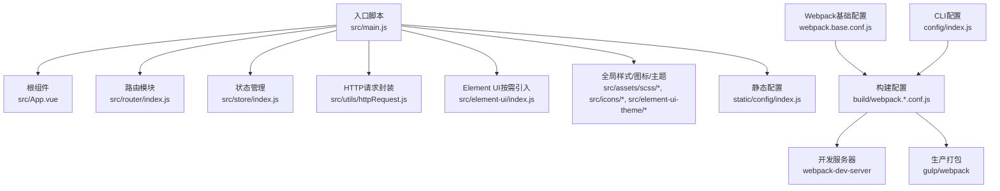
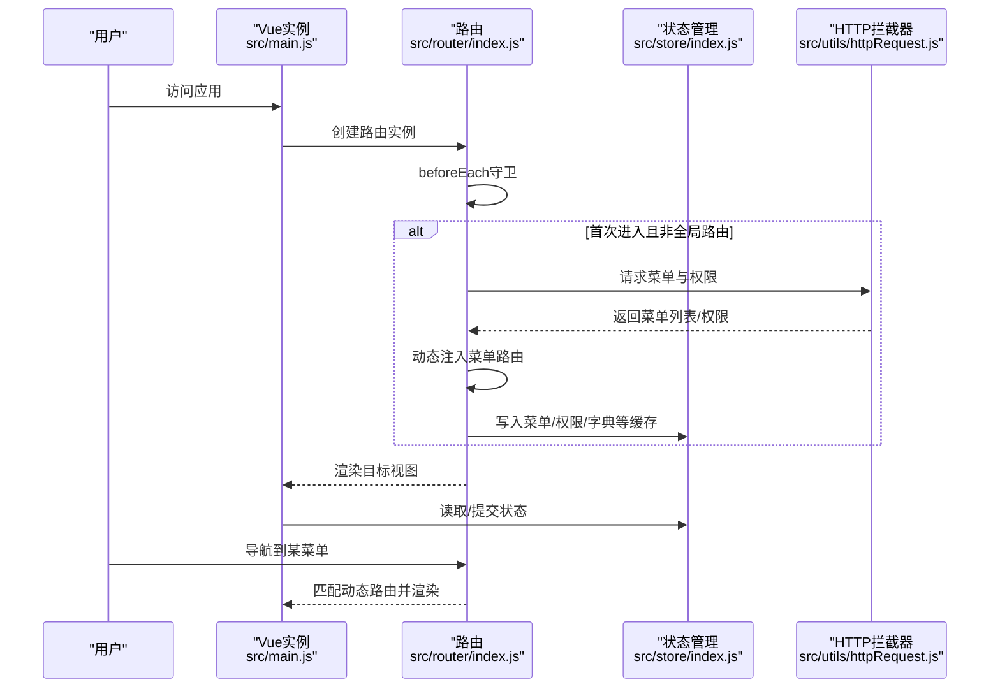
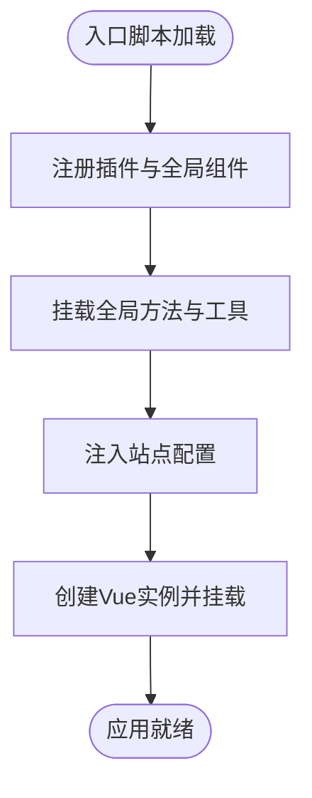
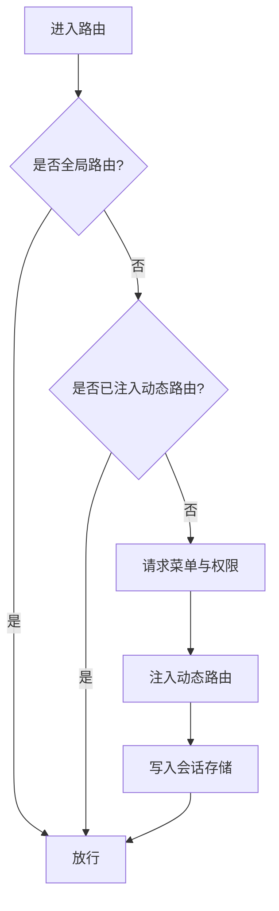
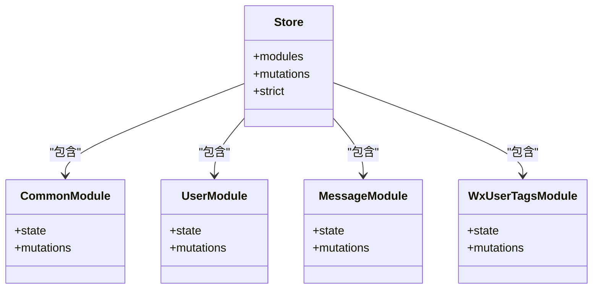
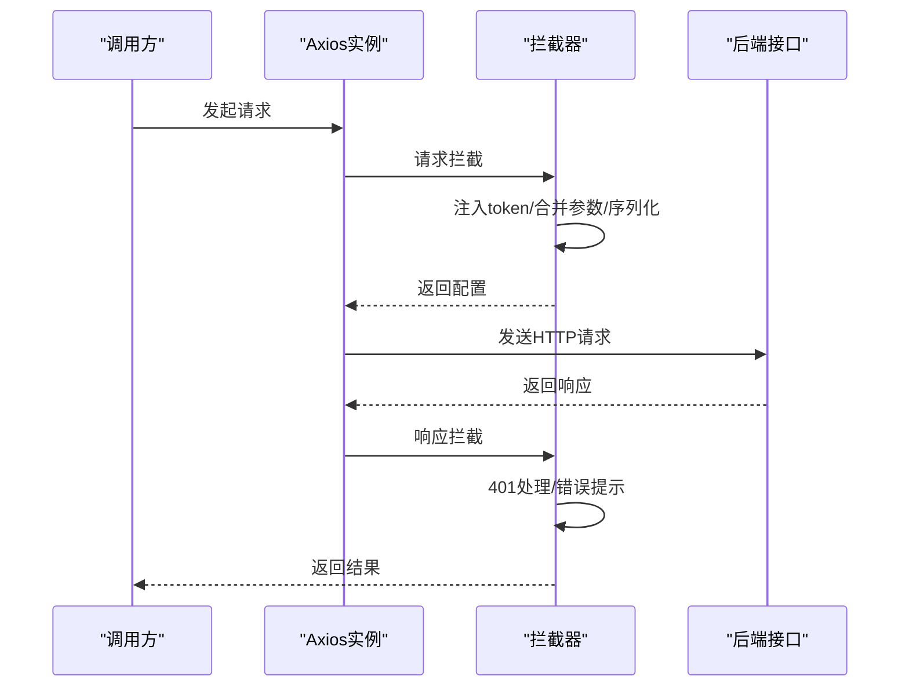
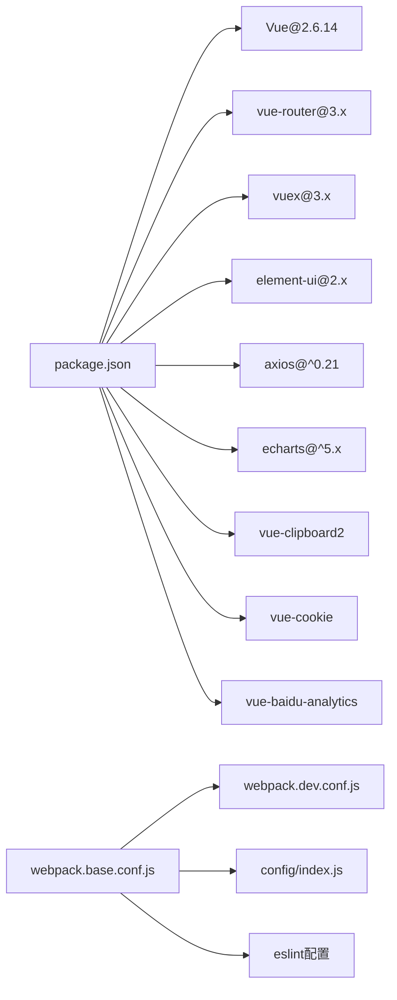

# Vue2核心架构

<cite>
**本文档引用的文件**
- [package.json](file://platform-admin-ui/package.json)
- [main.js](file://platform-admin-ui/src/main.js)
- [App.vue](file://platform-admin-ui/src/App.vue)
- [router/index.js](file://platform-admin-ui/src/router/index.js)
- [store/index.js](file://platform-admin-ui/src/store/index.js)
- [store/modules/user.js](file://platform-admin-ui/src/store/modules/user.js)
- [utils/httpRequest.js](file://platform-admin-ui/src/utils/httpRequest.js)
- [element-ui/index.js](file://platform-admin-ui/src/element-ui/index.js)
- [config/index.js](file://platform-admin-ui/config/index.js)
- [webpack.base.conf.js](file://platform-admin-ui/build/webpack.base.conf.js)
- [webpack.dev.conf.js](file://platform-admin-ui/build/webpack.dev.conf.js)
- [.eslintrc.js](file://platform-admin-ui/.eslintrc.js)
- [views/main.vue](file://platform-admin-ui/src/views/main.vue)
- [static/config/index.js](file://platform-admin-ui/static/config/index.js)
- [components/ueditor/index.vue](file://platform-admin-ui/src/components/ueditor/index.vue)
</cite>

## 目录
1. [引言](#引言)
2. [项目结构](#项目结构)
3. [核心组件](#核心组件)
4. [架构总览](#架构总览)
5. [详细组件分析](#详细组件分析)
6. [依赖关系分析](#依赖关系分析)
7. [性能考量](#性能考量)
8. [故障排查指南](#故障排查指南)
9. [结论](#结论)
10. [附录](#附录)

## 引言
本文件面向Vue2.6.14管理后台前端的核心架构，系统性解析从应用启动到运行期的关键流程与设计要点，包括：Vue实例初始化、根组件App.vue的设计模式、全局配置与插件注册、路由与权限守卫、状态管理、HTTP拦截器、UI组件按需引入、CLI与Webpack集成、开发服务器与热重载、调试与性能监控、错误处理策略以及最佳实践与开发效率建议。

## 项目结构
前端工程位于platform-admin-ui目录，采用Vue CLI模板风格的自定义构建体系，核心由入口脚本、路由、状态管理、工具库、UI组件库、静态资源配置与构建脚本组成。关键特性：
- 使用Vue 2.6.14与配套生态（vue-router、vuex、element-ui）。
- 通过自定义webpack配置实现按需加载、ESLint校验、资源优化与开发服务器。
- 动态菜单路由与权限控制结合，支持iframe嵌套与多标签页场景。
- 全局挂载常用工具方法与第三方能力（图表、剪贴板、百度统计等）。

**图表来源**
- [main.js:1-80](file://platform-admin-ui/src/main.js#L1-L80)
- [App.vue:1-26](file://platform-admin-ui/src/App.vue#L1-L26)
- [router/index.js:1-203](file://platform-admin-ui/src/router/index.js#L1-L203)
- [store/index.js:1-28](file://platform-admin-ui/src/store/index.js#L1-L28)
- [utils/httpRequest.js:1-97](file://platform-admin-ui/src/utils/httpRequest.js#L1-L97)
- [element-ui/index.js:1-184](file://platform-admin-ui/src/element-ui/index.js#L1-L184)
- [webpack.base.conf.js:1-107](file://platform-admin-ui/build/webpack.base.conf.js#L1-L107)
- [webpack.dev.conf.js:1-97](file://platform-admin-ui/build/webpack.dev.conf.js#L1-L97)
- [config/index.js:1-92](file://platform-admin-ui/config/index.js#L1-L92)

**章节来源**
- [package.json:1-102](file://platform-admin-ui/package.json#L1-L102)
- [main.js:1-80](file://platform-admin-ui/src/main.js#L1-L80)
- [config/index.js:1-92](file://platform-admin-ui/config/index.js#L1-L92)
- [webpack.base.conf.js:1-107](file://platform-admin-ui/build/webpack.base.conf.js#L1-L107)

## 核心组件
- Vue实例初始化与全局配置
  - 在入口脚本中完成插件注册、全局方法挂载、站点配置注入与实例创建。
  - 关键点：全局$echarts、$http、权限与数据转换工具、百度统计、剪贴板、Cookie、自定义组件注册。
- 根组件App.vue
  - 采用过渡动画包裹router-view，作为页面切换的统一容器。
- 路由系统
  - 支持hash模式、全局路由与主入口路由组合；动态注入菜单路由；登录守卫与权限存储。
- 状态管理
  - 模块化Vuex Store，提供重置状态能力，模块命名空间隔离。
- HTTP请求
  - Axios默认配置、请求/响应拦截器、错误提示与401处理、动态BASE_URL。
- Element UI
  - 按需引入组件与指令，统一全局尺寸与消息提示。
- 构建与开发服务器
  - 自定义webpack配置、开发服务器热重载、代理、ESLint集成。

**章节来源**
- [main.js:1-80](file://platform-admin-ui/src/main.js#L1-L80)
- [App.vue:1-26](file://platform-admin-ui/src/App.vue#L1-L26)
- [router/index.js:1-203](file://platform-admin-ui/src/router/index.js#L1-L203)
- [store/index.js:1-28](file://platform-admin-ui/src/store/index.js#L1-L28)
- [utils/httpRequest.js:1-97](file://platform-admin-ui/src/utils/httpRequest.js#L1-L97)
- [element-ui/index.js:1-184](file://platform-admin-ui/src/element-ui/index.js#L1-L184)

## 架构总览
下图展示了从用户访问到页面渲染、路由导航、动态菜单注入、状态更新与HTTP交互的整体流程。

**图表来源**
- [main.js:72-80](file://platform-admin-ui/src/main.js#L72-L80)
- [router/index.js:91-127](file://platform-admin-ui/src/router/index.js#L91-L127)
- [router/index.js:150-200](file://platform-admin-ui/src/router/index.js#L150-L200)
- [store/index.js:11-27](file://platform-admin-ui/src/store/index.js#L11-L27)
- [utils/httpRequest.js:66-94](file://platform-admin-ui/src/utils/httpRequest.js#L66-L94)

## 详细组件分析

### Vue实例初始化与全局配置
- 插件与全局方法
  - 注册Cookie、剪贴板、自定义组件（el-dict、el-img、ueditor）、百度统计。
  - 挂载$echarts、$http、权限判断、树形数据转换、图片预览、日期转换等工具。
- 全局状态快照
  - 保存初始store状态用于后续重置。
- 实例创建
  - 挂载router、store，渲染App根组件。

**图表来源**
- [main.js:28-70](file://platform-admin-ui/src/main.js#L28-L70)
- [main.js:72-80](file://platform-admin-ui/src/main.js#L72-L80)

**章节来源**
- [main.js:1-80](file://platform-admin-ui/src/main.js#L1-L80)

### 根组件App.vue设计模式
- 单一职责：作为页面切换的过渡容器，内部仅包含router-view与必要样式。
- 设计优势：简化根组件复杂度，将业务逻辑下沉至布局与页面组件。

**章节来源**
- [App.vue:1-26](file://platform-admin-ui/src/App.vue#L1-L26)

### 路由与权限控制
- 路由模式与滚动行为
  - hash模式、滚动至顶部。
- 全局路由与主入口路由
  - 全局路由（如登录、404）与主入口路由（含children）组合。
- 登录守卫
  - 读取Cookie token，无token则清空登录信息并跳转登录页。
- 动态菜单路由
  - 首次进入时请求菜单列表，解析为路由并注入；支持iframe嵌套与标签页。
- 懒加载策略
  - 开发环境禁用懒加载以加速热更新，生产环境启用懒加载。

**图表来源**
- [router/index.js:91-127](file://platform-admin-ui/src/router/index.js#L91-L127)
- [router/index.js:150-200](file://platform-admin-ui/src/router/index.js#L150-L200)
- [router/index.js:73-80](file://platform-admin-ui/src/router/index.js#L73-L80)

**章节来源**
- [router/index.js:1-203](file://platform-admin-ui/src/router/index.js#L1-L203)

### 状态管理（Vuex）
- 模块化组织
  - common、user、message、wxUserTags等模块，namespaced避免命名冲突。
- 重置策略
  - 通过克隆初始状态实现store重置，便于登出或切换环境。
- 严格模式
  - 未启用严格模式，降低开发成本。

**图表来源**
- [store/index.js:11-27](file://platform-admin-ui/src/store/index.js#L11-L27)
- [store/modules/user.js:1-16](file://platform-admin-ui/src/store/modules/user.js#L1-L16)

**章节来源**
- [store/index.js:1-28](file://platform-admin-ui/src/store/index.js#L1-L28)
- [store/modules/user.js:1-16](file://platform-admin-ui/src/store/modules/user.js#L1-L16)

### HTTP请求与拦截器
- 默认配置
  - 超时、跨域携带cookie、Content-Type统一为JSON。
- 动态BASE_URL
  - 开发且开启代理时使用/平台前缀；否则使用站点配置。
- 请求拦截
  - 条件显示loading、合并参数、序列化POST数据、注入token。
- 响应拦截
  - 关闭loading、401处理（清空登录信息并跳转登录）、错误消息提示、网络异常兜底。
- 与Element UI联动
  - Loading与Message/Notification统一使用。

**图表来源**
- [utils/httpRequest.js:26-61](file://platform-admin-ui/src/utils/httpRequest.js#L26-L61)
- [utils/httpRequest.js:66-94](file://platform-admin-ui/src/utils/httpRequest.js#L66-L94)

**章节来源**
- [utils/httpRequest.js:1-97](file://platform-admin-ui/src/utils/httpRequest.js#L1-L97)

### Element UI按需引入与全局能力
- 按需引入
  - 仅引入实际使用的组件与指令，减少打包体积。
- 全局能力
  - 挂载$loading/$message/$notify等全局方法，统一组件尺寸。

**章节来源**
- [element-ui/index.js:1-184](file://platform-admin-ui/src/element-ui/index.js#L1-L184)

### 视图层与布局组件
- 主布局
  - 提供刷新能力（provide/inject）、计算属性与store联动、窗口尺寸监听与侧边栏折叠。
- 页面级组件
  - 通过router-view承载各模块页面，配合动态菜单路由实现导航。

**章节来源**
- [views/main.vue:1-107](file://platform-admin-ui/src/views/main.vue#L1-L107)

### 自定义富文本组件（UEditor）
- 能力概览
  - 支持两种v-model监听模式（MutationObserver与contentChange事件），动态加载UEditor核心与依赖，支持禁用/销毁。
- 安全与配置
  - 上传接口拼接token，CDN路径来自站点配置。
- 生命周期
  - ready后根据状态选择setContent或触发ready事件；keep-alive与卸载时清理监听与观察者。

**章节来源**
- [components/ueditor/index.vue:1-332](file://platform-admin-ui/src/components/ueditor/index.vue#L1-L332)

## 依赖关系分析
- 版本与生态
  - Vue 2.6.14、vue-router 3.x、vuex 3.x、element-ui 2.x、axios、echarts、vue-clipboard2、vue-cookie、vue-baidu-analytics等。
- 构建链路
  - webpack基础配置定义入口、别名、loader与插件；开发配置扩展devServer、热重载与代理；生产通过gulp/webpack打包。
- ESLint规范
  - 基于Standard风格，要求HTML插件与常见规则约束。

**图表来源**
- [package.json:14-36](file://platform-admin-ui/package.json#L14-L36)
- [webpack.base.conf.js:23-46](file://platform-admin-ui/build/webpack.base.conf.js#L23-L46)
- [config/index.js:8-59](file://platform-admin-ui/config/index.js#L8-L59)
- [.eslintrc.js:17-66](file://platform-admin-ui/.eslintrc.js#L17-L66)

**章节来源**
- [package.json:1-102](file://platform-admin-ui/package.json#L1-L102)
- [webpack.base.conf.js:1-107](file://platform-admin-ui/build/webpack.base.conf.js#L1-L107)
- [config/index.js:1-92](file://platform-admin-ui/config/index.js#L1-L92)
- [.eslintrc.js:1-67](file://platform-admin-ui/.eslintrc.js#L1-L67)

## 性能考量
- 懒加载与分包
  - 生产环境启用路由懒加载，减少首屏体积。
- 资源优化
  - 图片/字体/媒体资源通过url-loader限制阈值并生成哈希；SVG通过svg-sprite-loader处理。
- 构建产物
  - 生产环境可选Gzip压缩与bundle分析报告开关。
- 开发体验
  - eval-source-map与cheap-module-eval-source-map提升调试速度；HMR热替换与FriendlyErrorsPlugin改善反馈。
- 网络与交互
  - 请求/响应拦截器统一loading与错误提示，避免重复请求与阻塞。

**章节来源**
- [router/index.js:23-24](file://platform-admin-ui/src/router/index.js#L23-L24)
- [webpack.base.conf.js:60-92](file://platform-admin-ui/build/webpack.base.conf.js#L60-L92)
- [webpack.dev.conf.js:20-46](file://platform-admin-ui/build/webpack.dev.conf.js#L20-L46)
- [config/index.js:61-90](file://platform-admin-ui/config/index.js#L61-L90)

## 故障排查指南
- 登录态失效
  - 401响应触发清理登录信息并跳转登录页；检查后端token有效期与接口返回码。
- 菜单/权限未生效
  - 确认beforeEach是否成功请求并注入动态路由；检查sessionStorage中相关键值。
- 图片/富文本上传失败
  - 检查BASE_URL与token拼接；确认UEDITOR_HOME_URL与CDN路径正确。
- 开发代理无效
  - 检查OPEN_PROXY开关与proxyTable配置；确认目标域名与路径重写规则。
- ESLint报错
  - 遵循Standard风格与HTML插件规则，修正缩进、分号与空格问题。

**章节来源**
- [utils/httpRequest.js:66-94](file://platform-admin-ui/src/utils/httpRequest.js#L66-L94)
- [router/index.js:91-127](file://platform-admin-ui/src/router/index.js#L91-L127)
- [components/ueditor/index.vue:192-248](file://platform-admin-ui/src/components/ueditor/index.vue#L192-L248)
- [config/index.js:14-23](file://platform-admin-ui/config/index.js#L14-L23)
- [.eslintrc.js:27-66](file://platform-admin-ui/.eslintrc.js#L27-L66)

## 结论
该Vue2管理后台前端以清晰的模块划分与自定义构建为核心，结合动态路由、权限守卫、状态管理与HTTP拦截器，形成了稳定可扩展的中后台解决方案。通过按需引入UI组件、懒加载与资源优化，兼顾了开发效率与运行性能。建议在后续迭代中持续完善单元测试、埋点与可观测性建设，进一步提升质量与稳定性。

## 附录
- 站点配置
  - baseUrl、domain、version与cdnUrl集中维护，便于多环境切换。
- 开发命令
  - dev/start：启动开发服务器；lint：ESLint检查；build：调用gulp打包。

**章节来源**
- [static/config/index.js:1-15](file://platform-admin-ui/static/config/index.js#L1-L15)
- [package.json:8-12](file://platform-admin-ui/package.json#L8-L12)