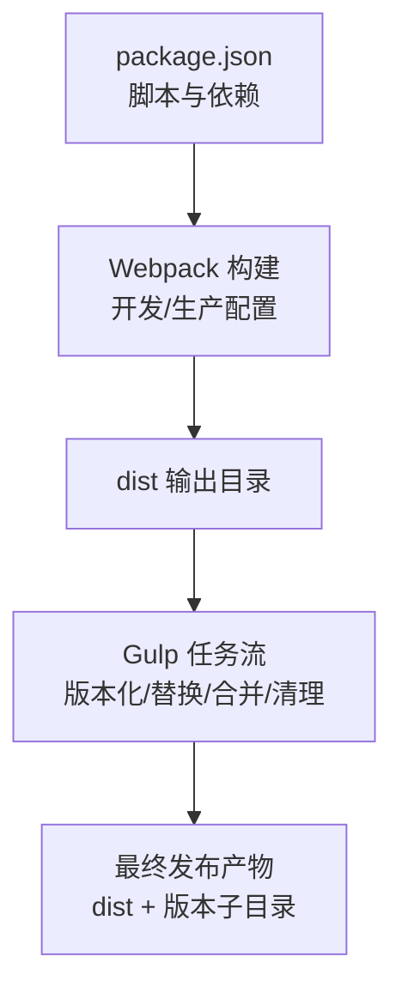
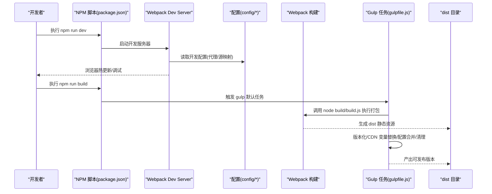
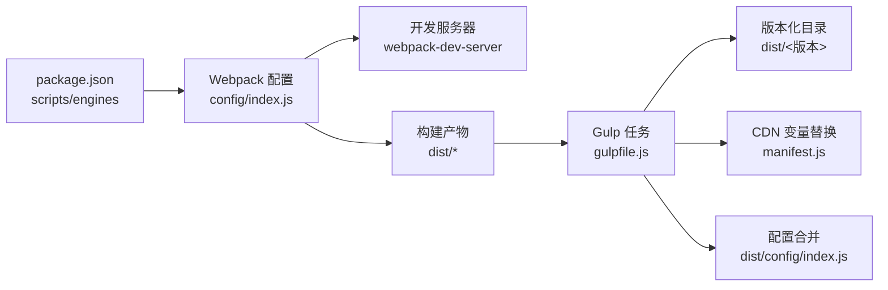

# 构建配置与优化

<cite>
**本文档引用的文件**
- [package.json](file://platform-admin-ui/package.json)
- [gulpfile.js](file://platform-admin-ui/gulpfile.js)
- [.babelrc](file://platform-admin-ui/.babelrc)
- [.eslintrc.js](file://platform-admin-ui/.eslintrc.js)
- [.postcssrc.js](file://platform-admin-ui/.postcssrc.js)
- [config/index.js](file://platform-admin-ui/config/index.js)
- [config/dev.env.js](file://platform-admin-ui/config/dev.env.js)
- [config/prod.env.js](file://platform-admin-ui/config/prod.env.js)
- [src/main.js](file://platform-admin-ui/src/main.js)
- [src/App.vue](file://platform-admin-ui/src/App.vue)
- [src/router/index.js](file://platform-admin-ui/src/router/index.js)
</cite>

## 目录
1. [简介](#简介)
2. [项目结构](#项目结构)
3. [核心组件](#核心组件)
4. [架构总览](#架构总览)
5. [详细组件分析](#详细组件分析)
6. [依赖关系分析](#依赖关系分析)
7. [性能考量](#性能考量)
8. [故障排查指南](#故障排查指南)
9. [结论](#结论)
10. [附录](#附录)

## 简介
本文件面向前端工程团队与运维人员，系统化梳理平台管理系统的前端构建体系，围绕基于 Gulp 与 Webpack 的混合构建流程，深入解析开发环境配置、生产环境优化、代码分割策略、资源压缩与缓存、CDN 集成、ESLint 规范、Babel 转译、Sass/PostCSS 预处理、浏览器兼容与性能监控等主题。同时提供构建流程优化、打包分析、体积监控与部署策略建议，并给出常见问题排查与持续集成配置思路。

## 项目结构
该前端工程采用“Gulp + Webpack”的混合模式：Webpack 负责模块打包与开发服务器，Gulp 负责构建产物的版本化、CDN 变量替换、配置合并与清理收尾。核心目录与职责如下：
- 平台管理前端工程位于 platform-admin-ui
- 构建脚本与任务定义于 gulpfile.js
- 依赖与脚本命令定义于 package.json
- 开发/生产环境配置位于 config 目录
- 源码入口与路由、组件位于 src 目录
- ESLint、Babel、PostCSS 配置分别位于根目录配置文件

图表来源
- [package.json:1-102](file://platform-admin-ui/package.json#L1-L102)
- [gulpfile.js:1-65](file://platform-admin-ui/gulpfile.js#L1-L65)

章节来源
- [package.json:1-102](file://platform-admin-ui/package.json#L1-L102)
- [config/index.js:1-92](file://platform-admin-ui/config/index.js#L1-L92)

## 核心组件
- 构建脚本与命令
  - 开发：通过 webpack-dev-server 启动，结合开发环境配置与代理
  - 生产：通过 gulp 统一编排构建流水线
  - 规范检查：ESLint 对 .js/.vue 文件进行静态检查
- 配置中心
  - config/index.js 定义开发与生产两套配置，含代理、源映射、Gzip、分析报告开关等
  - config/dev.env.js 与 config/prod.env.js 提供环境变量合并
- 预处理与转译
  - Babel：.babelrc 配置 preset 与插件，按环境区分测试与开发
  - PostCSS：.postcssrc.js 集成 autoprefixer 与 postcss-import
  - Sass：依赖 sass 与 sass-loader，配合 Webpack loader 使用
- 路由与入口
  - src/main.js 为应用入口，挂载全局工具方法与第三方库
  - src/router/index.js 支持开发/生产环境懒加载切换与动态菜单注入

章节来源
- [package.json:8-13](file://platform-admin-ui/package.json#L8-L13)
- [config/index.js:8-92](file://platform-admin-ui/config/index.js#L8-L92)
- [config/dev.env.js:1-9](file://platform-admin-ui/config/dev.env.js#L1-L9)
- [config/prod.env.js:1-5](file://platform-admin-ui/config/prod.env.js#L1-L5)
- [.babelrc:1-36](file://platform-admin-ui/.babelrc#L1-L36)
- [.postcssrc.js:1-10](file://platform-admin-ui/.postcssrc.js#L1-L10)
- [src/main.js:1-80](file://platform-admin-ui/src/main.js#L1-L80)
- [src/router/index.js:1-203](file://platform-admin-ui/src/router/index.js#L1-L203)

## 架构总览
下图展示了从开发到生产的端到端构建链路，以及各组件之间的交互关系。

图表来源
- [package.json:8-13](file://platform-admin-ui/package.json#L8-L13)
- [gulpfile.js:24-64](file://platform-admin-ui/gulpfile.js#L24-L64)
- [config/index.js:8-92](file://platform-admin-ui/config/index.js#L8-L92)

## 详细组件分析

### 开发环境配置
- 代理与主机
  - 代理开关由 dev.env.js 控制，支持按环境关闭或启用
  - 开发服务器默认主机与端口可覆盖
- Lint 集成
  - 开启 ESLint 校验并在控制台与错误覆盖层显示
- 源映射与缓存
  - 开发使用 eval-source-map，提升热更新速度
  - CSS SourceMap 默认关闭，避免相对路径问题
- 热更新与错误覆盖
  - 错误覆盖与浏览器通知可配置

章节来源
- [config/index.js:9-59](file://platform-admin-ui/config/index.js#L9-L59)
- [config/dev.env.js:5-8](file://platform-admin-ui/config/dev.env.js#L5-L8)

### 生产环境优化
- 资源路径与产物
  - 静态资源子目录与公共路径配置
  - 产物包含 HTML、JS、CSS、字体、图片等
- 源映射与压缩
  - 生产使用 source-map，可选 Gzip 压缩与扩展
  - Bundle 分析报告可通过参数开启
- CDN 与版本化
  - Gulp 在构建后对 manifest.js 中的 cdnUrl 占位符进行替换
  - 自动生成版本号目录，便于多版本并存与回滚

章节来源
- [config/index.js:61-92](file://platform-admin-ui/config/index.js#L61-L92)
- [gulpfile.js:11-21](file://platform-admin-ui/gulpfile.js#L11-L21)
- [gulpfile.js:32-43](file://platform-admin-ui/gulpfile.js#L32-L43)

### 代码分割策略
- 动态导入与懒加载
  - 路由按环境选择懒加载导入器，开发禁用懒加载以加速热更新，生产启用懒加载
- 运行时与拆分
  - Webpack 4 默认具备 Tree-shaking 与代码分割能力；建议结合动态 import 明确分包边界
- 第三方库与业务代码分离
  - 将 Element UI、Vue 生态等抽离为独立 chunk，提升缓存命中率

章节来源
- [src/router/index.js:23-24](file://platform-admin-ui/src/router/index.js#L23-L24)

### 资源压缩与缓存策略
- JS/CSS 压缩
  - 生产环境使用 source-map；如需更严格的压缩，可在 Webpack 中引入 terser 或其他压缩插件
- 图片与字体
  - 使用 url-loader/file-loader 处理小资源内联，大资源落盘
- 缓存策略
  - 版本化目录与文件指纹命名，结合 CDN 与 HTTP 缓存头实现长效缓存
  - 静态资源输出目录采用 ./ 作为公共路径，适配多级目录部署

章节来源
- [config/index.js:74-83](file://platform-admin-ui/config/index.js#L74-L83)
- [gulpfile.js:27-30](file://platform-admin-ui/gulpfile.js#L27-L30)

### ESLint 代码规范检查
- 解析器与标准
  - babel-eslint 解析器，遵循 Standard 规则集
- 插件与规则
  - 支持 .vue 文件语法检查，内置多项强制规则（括号、缩进、注释、空块等）
  - 生产环境下禁止使用 debugger
- 集成方式
  - 开发阶段通过 Webpack 与 ESLint Loader 集成，错误在控制台与覆盖层提示

章节来源
- [.eslintrc.js:1-67](file://platform-admin-ui/.eslintrc.js#L1-L67)
- [config/index.js:36-39](file://platform-admin-ui/config/index.js#L36-L39)

### Babel 转译配置
- 预设与插件
  - env 与 stage-2 预设，transform-runtime 运行时辅助
  - 按需加载 Element UI 样式，减少体积
- 测试环境
  - 测试环境使用 CommonJS 与 dynamic-import-node 插件，保证测试工具链兼容

章节来源
- [.babelrc:1-36](file://platform-admin-ui/.babelrc#L1-L36)

### Sass 与 PostCSS 集成
- Sass
  - 依赖 sass 与 sass-loader，用于编译 SCSS/SASS 文件
- PostCSS
  - 自动补全与样式导入，browserslist 决定目标浏览器范围

章节来源
- [package.json:28-29](file://platform-admin-ui/package.json#L28-L29)
- [.postcssrc.js:1-10](file://platform-admin-ui/.postcssrc.js#L1-L10)
- [package.json:96-100](file://platform-admin-ui/package.json#L96-L100)

### 浏览器兼容性处理
- browserslist
  - 面向现代浏览器，剔除 IE<=8，确保 autoprefixer 与 Babel 转译范围合理
- Polyfill
  - 项目包含 babel-polyfill，建议按需引入或使用 @babel/preset-env 的 polyfills 选项

章节来源
- [package.json:96-100](file://platform-admin-ui/package.json#L96-L100)
- [package.json:17](file://platform-admin-ui/package.json#L17)

### 静态资源处理与 CDN 配置
- 资源处理
  - 通过 Webpack loader 处理 JS、CSS、图片、字体等
- CDN 集成
  - Gulp 在构建完成后替换 manifest.js 中的 cdnUrl 占位符，实现运行时 CDN 切换
- 版本化发布
  - 生成带时间戳的版本子目录，便于灰度与回滚

章节来源
- [gulpfile.js:32-43](file://platform-admin-ui/gulpfile.js#L32-L43)
- [gulpfile.js:11-21](file://platform-admin-ui/gulpfile.js#L11-L21)

### 性能监控与分析
- 打包分析
  - 通过 --report 参数开启分析报告，定位大体积模块与重复依赖
- 访问统计
  - 集成 vue-baidu-analytics，生产环境上报 PV/UV 与用户行为

章节来源
- [config/index.js:89](file://platform-admin-ui/config/index.js#L89)
- [src/main.js:64-70](file://platform-admin-ui/src/main.js#L64-L70)

### 构建流程优化与部署策略
- 流程优化
  - 开发：禁用懒加载，缩短热更新时间
  - 生产：启用代码分割、按需加载、CDN 与版本化
- 部署策略
  - dist 目录与版本子目录并存，静态资源指纹化，CDN 加速
  - 通过环境变量切换测试/生产配置

章节来源
- [src/router/index.js:23-24](file://platform-admin-ui/src/router/index.js#L23-L24)
- [gulpfile.js:52-64](file://platform-admin-ui/gulpfile.js#L52-L64)

## 依赖关系分析
下图展示关键配置与任务之间的依赖关系，帮助理解构建链路与耦合点。

图表来源
- [package.json:8-13](file://platform-admin-ui/package.json#L8-L13)
- [config/index.js:8-92](file://platform-admin-ui/config/index.js#L8-L92)
- [gulpfile.js:24-64](file://platform-admin-ui/gulpfile.js#L24-L64)

章节来源
- [package.json:8-13](file://platform-admin-ui/package.json#L8-L13)
- [gulpfile.js:24-64](file://platform-admin-ui/gulpfile.js#L24-L64)
- [config/index.js:8-92](file://platform-admin-ui/config/index.js#L8-L92)

## 性能考量
- 体积优化
  - 启用 Tree-shaking 与按需加载，拆分 vendor 与业务代码
  - 使用 SVG Sprite、图片压缩与字体子集化
- 缓存与分发
  - 文件指纹命名 + CDN + 长效缓存头
  - 版本化目录便于灰度与快速回滚
- 开发体验
  - 开发禁用懒加载，缩短热更新时间；生产启用懒加载与代码分割
- 监控与分析
  - 打包分析报告定位瓶颈；访问统计辅助评估用户体验

## 故障排查指南
- ESLint 报错
  - 检查 .eslintrc.js 规则与编辑器格式化配置，确认 babel-eslint 解析器正确
- Babel 转译异常
  - 核对 .babelrc 预设与插件，测试环境使用 CommonJS 与 dynamic-import-node
- PostCSS/Autoprefixer 不生效
  - 确认 browserslist 配置与依赖安装，检查 .postcssrc.js 插件顺序
- 路由懒加载失效
  - 确认 src/router/import-*.js 的存在与路径正确，开发/生产环境变量是否匹配
- CDN 变量未替换
  - 检查 gulpfile.js 中的占位符正则与 manifest.js 结构，确认版本化目录已生成
- 代理不生效
  - 检查 config/dev.env.js 中 OPEN_PROXY 与 config/index.js 代理表配置

章节来源
- [.eslintrc.js:1-67](file://platform-admin-ui/.eslintrc.js#L1-L67)
- [.babelrc:1-36](file://platform-admin-ui/.babelrc#L1-L36)
- [.postcssrc.js:1-10](file://platform-admin-ui/.postcssrc.js#L1-L10)
- [src/router/index.js:23-24](file://platform-admin-ui/src/router/index.js#L23-L24)
- [gulpfile.js:32-43](file://platform-admin-ui/gulpfile.js#L32-L43)
- [config/dev.env.js:7](file://platform-admin-ui/config/dev.env.js#L7)

## 结论
该前端构建体系以 Gulp 与 Webpack 协作完成开发与生产的闭环：Webpack 负责模块化打包与开发体验，Gulp 负责版本化、CDN 替换与配置合并。通过合理的代码分割、按需加载、缓存策略与打包分析，可显著提升首屏性能与维护效率。建议在现有基础上进一步完善按需 polyfill、SVG Sprite、图片与字体优化，并在 CI 中加入体积阈值与分析报告对比，持续优化构建质量。

## 附录
- 关键文件清单
  - 构建脚本与命令：package.json
  - Gulp 任务：gulpfile.js
  - ESLint：.eslintrc.js
  - Babel：.babelrc
  - PostCSS：.postcssrc.js
  - 环境配置：config/index.js、config/dev.env.js、config/prod.env.js
  - 应用入口与路由：src/main.js、src/App.vue、src/router/index.js