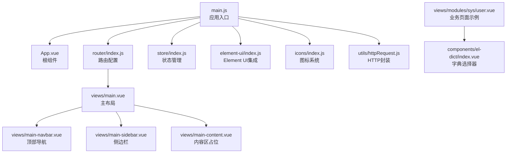
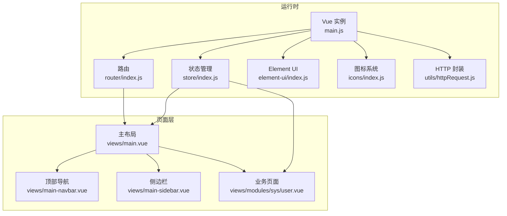
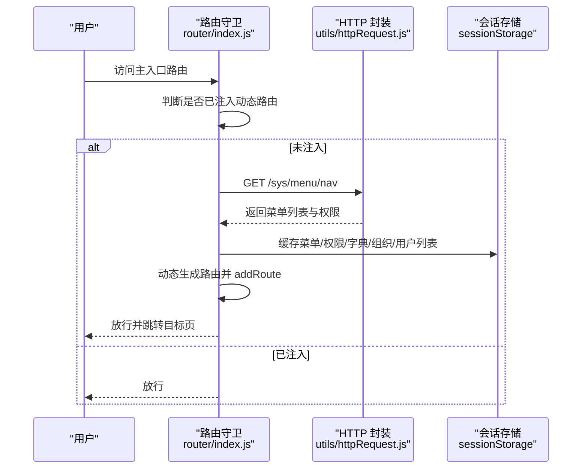
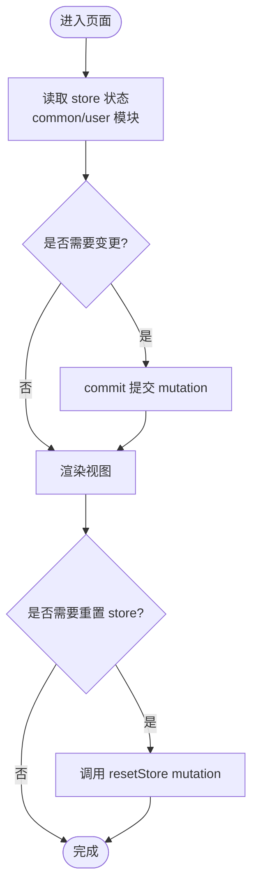
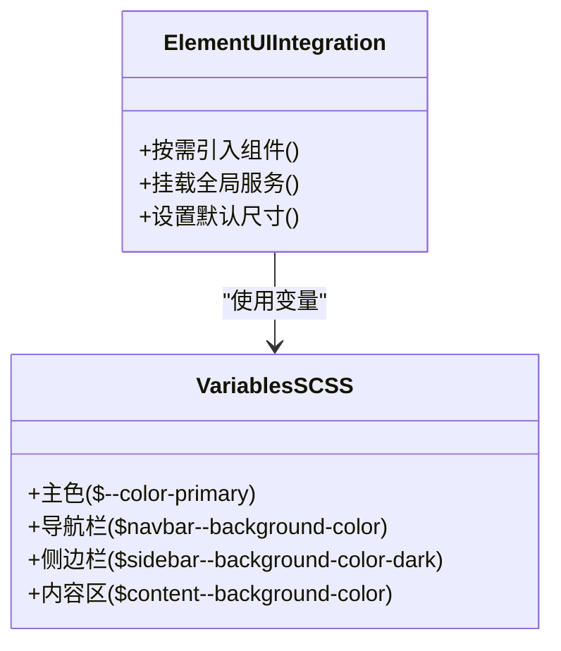
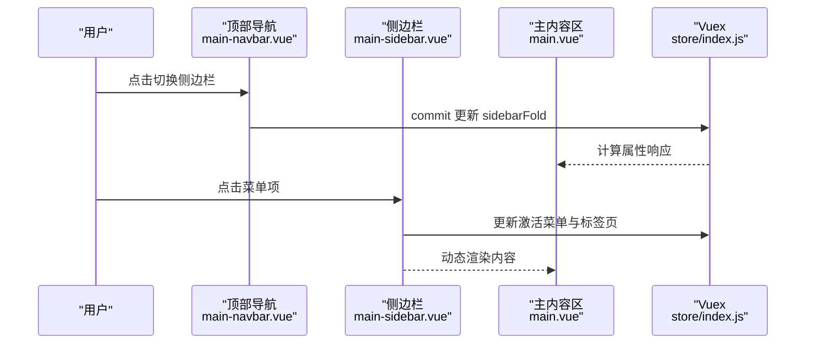
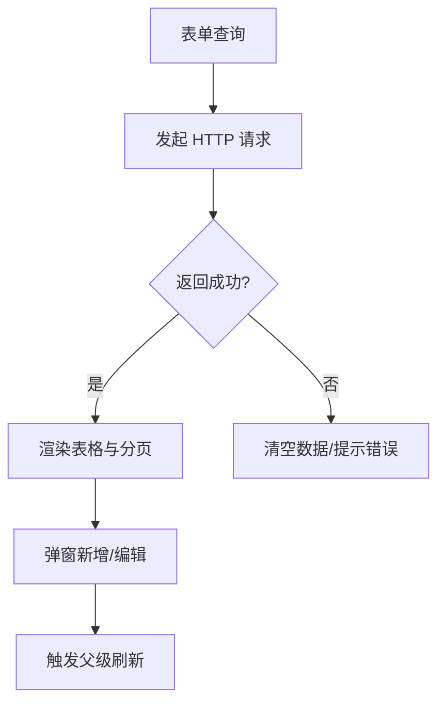
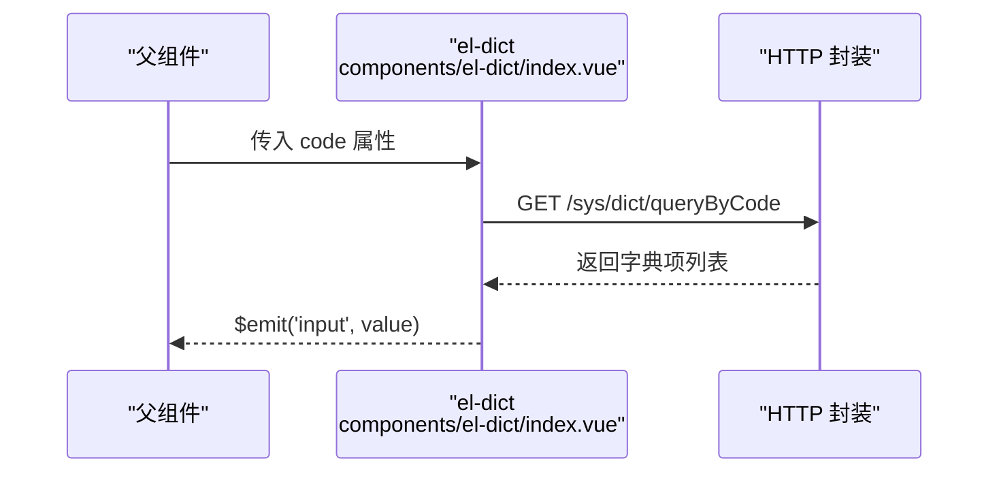
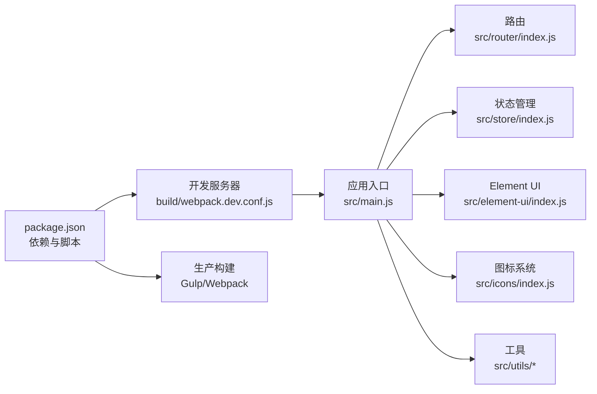

# 管理后台UI架构

<cite>
**本文引用的文件**
- [package.json](file://platform-admin-ui/package.json)
- [main.js](file://platform-admin-ui/src/main.js)
- [App.vue](file://platform-admin-ui/src/App.vue)
- [config/index.js](file://platform-admin-ui/config/index.js)
- [router/index.js](file://platform-admin-ui/src/router/index.js)
- [store/index.js](file://platform-admin-ui/src/store/index.js)
- [element-ui/index.js](file://platform-admin-ui/src/element-ui/index.js)
- [icons/index.js](file://platform-admin-ui/src/icons/index.js)
- [utils/httpRequest.js](file://platform-admin-ui/src/utils/httpRequest.js)
- [utils/validate.js](file://platform-admin-ui/src/utils/validate.js)
- [views/main.vue](file://platform-admin-ui/src/views/main.vue)
- [views/main-navbar.vue](file://platform-admin-ui/src/views/main-navbar.vue)
- [views/main-sidebar.vue](file://platform-admin-ui/src/views/main-sidebar.vue)
- [views/modules/sys/user.vue](file://platform-admin-ui/src/views/modules/sys/user.vue)
- [store/modules/user.js](file://platform-admin-ui/src/store/modules/user.js)
- [assets/scss/_variables.scss](file://platform-admin-ui/src/assets/scss/_variables.scss)
- [components/el-dict/index.vue](file://platform-admin-ui/src/components/el-dict/index.vue)
- [build/webpack.dev.conf.js](file://platform-admin-ui/build/webpack.dev.conf.js)
</cite>

## 目录
1. [引言](#引言)
2. [项目结构](#项目结构)
3. [核心组件](#核心组件)
4. [架构总览](#架构总览)
5. [详细组件分析](#详细组件分析)
6. [依赖关系分析](#依赖关系分析)
7. [性能考虑](#性能考虑)
8. [故障排查指南](#故障排查指南)
9. [结论](#结论)
10. [附录](#附录)

## 引言
本文件面向希望基于 Vue2 + Element UI 构建管理后台的开发者，系统梳理该工程的前端架构设计与实现要点，覆盖以下方面：
- Vue2 核心配置与插件注入
- 组件化开发模式与页面组织
- 路由配置策略与动态菜单加载
- 状态管理（Vuex）模块划分与持久化
- Element UI 组件库集成、主题定制与图标系统
- Webpack 构建配置、开发与生产环境策略
- 页面组件设计模式、表单验证、数据表格与弹窗使用
- 规范与最佳实践：组件开发、样式管理、权限控制与交互体验

## 项目结构
该管理后台前端位于 platform-admin-ui 目录，采用典型的 Vue CLI 项目结构，结合自定义的 Webpack 配置与 Gulp 构建流程。核心目录与职责如下：
- src：源码目录
  - assets：静态资源与样式（SCSS 变量、字体、图片）
  - components：通用业务组件（如 el-dict、ueditor、icon-svg 等）
  - element-ui：按需引入 Element UI 组件并挂载全局服务
  - icons：SVG 图标注册与工具
  - router：路由定义、动态菜单注入与鉴权守卫
  - store：Vuex 状态管理模块与重置逻辑
  - utils：HTTP 请求封装、校验工具等
  - views：页面视图（布局、模块页面、公共页面）
  - App.vue、main.js：应用入口与全局初始化
- config：开发/生产环境配置
- build：Webpack 开发配置
- static：静态资源（构建时复制）

图表来源
- [main.js:1-80](file://platform-admin-ui/src/main.js#L1-L80)
- [router/index.js:1-203](file://platform-admin-ui/src/router/index.js#L1-L203)
- [store/index.js:1-28](file://platform-admin-ui/src/store/index.js#L1-L28)
- [element-ui/index.js:1-184](file://platform-admin-ui/src/element-ui/index.js#L1-L184)
- [icons/index.js:1-15](file://platform-admin-ui/src/icons/index.js#L1-L15)
- [utils/httpRequest.js:1-97](file://platform-admin-ui/src/utils/httpRequest.js#L1-L97)
- [views/main.vue:1-107](file://platform-admin-ui/src/views/main.vue#L1-L107)
- [views/main-navbar.vue:1-126](file://platform-admin-ui/src/views/main-navbar.vue#L1-L126)
- [views/main-sidebar.vue:1-120](file://platform-admin-ui/src/views/main-sidebar.vue#L1-L120)
- [views/modules/sys/user.vue:1-200](file://platform-admin-ui/src/views/modules/sys/user.vue#L1-L200)
- [components/el-dict/index.vue:1-75](file://platform-admin-ui/src/components/el-dict/index.vue#L1-L75)

章节来源
- [main.js:1-80](file://platform-admin-ui/src/main.js#L1-L80)
- [config/index.js:1-92](file://platform-admin-ui/config/index.js#L1-L92)

## 核心组件
- 应用入口与全局初始化
  - 注册 Cookie、剪贴板、百度统计、全局组件与工具函数，挂载 $http、$echarts、权限与翻译方法到 Vue 原型，保存初始 Store 状态以便重置。
- Element UI 集成
  - 按需引入常用组件并在原型上挂载 Loading、MessageBox、Notification、Message 等服务，统一设置组件尺寸。
- 图标系统
  - 自动扫描 icons/svg 下的 SVG 文件并注册 IconSvg 组件，提供图标名称列表工具。
- HTTP 请求封装
  - 统一超时、跨域、请求头、Content-Type 处理；在请求拦截中注入 Loading 与 token；响应拦截中处理 401 与错误消息提示。
- 路由与权限
  - 全局路由与主入口路由分离；进入主入口前校验 token；首次访问时拉取菜单与权限，动态注入路由并缓存到 sessionStorage。
- 状态管理
  - 模块化拆分（common、user、message、wxUserTags），提供 resetStore mutation 重置状态。

章节来源
- [main.js:1-80](file://platform-admin-ui/src/main.js#L1-L80)
- [element-ui/index.js:1-184](file://platform-admin-ui/src/element-ui/index.js#L1-L184)
- [icons/index.js:1-15](file://platform-admin-ui/src/icons/index.js#L1-L15)
- [utils/httpRequest.js:1-97](file://platform-admin-ui/src/utils/httpRequest.js#L1-L97)
- [router/index.js:1-203](file://platform-admin-ui/src/router/index.js#L1-L203)
- [store/index.js:1-28](file://platform-admin-ui/src/store/index.js#L1-L28)

## 架构总览
该系统采用“入口初始化 + 动态路由 + 模块化状态”的架构模式，配合 Element UI 的丰富组件与 SCSS 变量体系，形成可扩展的管理后台前端框架。

图表来源
- [main.js:1-80](file://platform-admin-ui/src/main.js#L1-L80)
- [router/index.js:1-203](file://platform-admin-ui/src/router/index.js#L1-L203)
- [store/index.js:1-28](file://platform-admin-ui/src/store/index.js#L1-L28)
- [element-ui/index.js:1-184](file://platform-admin-ui/src/element-ui/index.js#L1-L184)
- [icons/index.js:1-15](file://platform-admin-ui/src/icons/index.js#L1-L15)
- [utils/httpRequest.js:1-97](file://platform-admin-ui/src/utils/httpRequest.js#L1-L97)
- [views/main.vue:1-107](file://platform-admin-ui/src/views/main.vue#L1-L107)
- [views/main-navbar.vue:1-126](file://platform-admin-ui/src/views/main-navbar.vue#L1-L126)
- [views/main-sidebar.vue:1-120](file://platform-admin-ui/src/views/main-sidebar.vue#L1-L120)
- [views/modules/sys/user.vue:1-200](file://platform-admin-ui/src/views/modules/sys/user.vue#L1-L200)

## 详细组件分析

### 路由与权限控制
- 路由模式与滚动行为：使用 hash 模式，滚动至顶部。
- 全局路由：登录、404 等无需整体布局。
- 主入口路由：校验 token，未登录跳转登录页。
- 动态菜单注入：首次访问拉取菜单列表，解析生成路由，支持 iframe 嵌套与模块组件两种模式，写入 sessionStorage 并动态 addRoute。
- 路由守卫：beforeEach 中判断是否已注入动态路由或是否为全局路由，否则拉取菜单并注入。

图表来源
- [router/index.js:91-127](file://platform-admin-ui/src/router/index.js#L91-L127)
- [utils/httpRequest.js:66-84](file://platform-admin-ui/src/utils/httpRequest.js#L66-L84)

章节来源
- [router/index.js:1-203](file://platform-admin-ui/src/router/index.js#L1-L203)
- [utils/httpRequest.js:1-97](file://platform-admin-ui/src/utils/httpRequest.js#L1-L97)

### 状态管理（Vuex）
- 模块划分：common、user、message、wxUserTags，命名空间隔离。
- 重置逻辑：通过 cloneDeep 保存初始状态，resetStore mutation 将当前状态还原到初始快照。
- 典型用法：主布局读取/写入 common 与 user 模块的状态，实现侧边栏折叠、文档可视高度、用户信息等。

图表来源
- [store/index.js:11-27](file://platform-admin-ui/src/store/index.js#L11-L27)
- [views/main.vue:41-74](file://platform-admin-ui/src/views/main.vue#L41-L74)
- [store/modules/user.js:1-16](file://platform-admin-ui/src/store/modules/user.js#L1-L16)

章节来源
- [store/index.js:1-28](file://platform-admin-ui/src/store/index.js#L1-L28)
- [views/main.vue:1-107](file://platform-admin-ui/src/views/main.vue#L1-L107)
- [store/modules/user.js:1-16](file://platform-admin-ui/src/store/modules/user.js#L1-L16)

### Element UI 集成与主题定制
- 按需引入：仅引入实际使用的组件，减少打包体积。
- 全局服务：在原型上挂载 Loading、MessageBox、Notification、Message 等，便于全局调用。
- 主题变量：通过 SCSS 变量统一管理主色、导航栏、侧边栏与内容区域颜色，确保与 Element 主题文件一致。

图表来源
- [element-ui/index.js:1-184](file://platform-admin-ui/src/element-ui/index.js#L1-L184)
- [assets/scss/_variables.scss:1-14](file://platform-admin-ui/src/assets/scss/_variables.scss#L1-L14)

章节来源
- [element-ui/index.js:1-184](file://platform-admin-ui/src/element-ui/index.js#L1-L184)
- [assets/scss/_variables.scss:1-14](file://platform-admin-ui/src/assets/scss/_variables.scss#L1-L14)

### 图标系统与布局组件
- 图标系统：自动扫描 icons/svg，注册 IconSvg 组件，提供图标名称列表工具，便于在菜单与按钮中使用。
- 布局组件：
  - 顶部导航：品牌标题、切换侧边栏、主题设置、用户下拉菜单（修改密码、退出）。
  - 侧边栏：首页快捷入口、动态菜单项、子菜单组件、折叠状态与激活态管理。
  - 主布局：组合导航、侧边栏与内容区，提供刷新能力与全屏加载。

图表来源
- [views/main-navbar.vue:1-126](file://platform-admin-ui/src/views/main-navbar.vue#L1-L126)
- [views/main-sidebar.vue:1-120](file://platform-admin-ui/src/views/main-sidebar.vue#L1-L120)
- [views/main.vue:1-107](file://platform-admin-ui/src/views/main.vue#L1-L107)
- [store/index.js:11-27](file://platform-admin-ui/src/store/index.js#L11-L27)

章节来源
- [icons/index.js:1-15](file://platform-admin-ui/src/icons/index.js#L1-L15)
- [views/main-navbar.vue:1-126](file://platform-admin-ui/src/views/main-navbar.vue#L1-L126)
- [views/main-sidebar.vue:1-120](file://platform-admin-ui/src/views/main-sidebar.vue#L1-L120)
- [views/main.vue:1-107](file://platform-admin-ui/src/views/main.vue#L1-L107)

### 页面组件设计模式与数据表格
- 表单查询：使用 Element UI 的 Form、Input、Select、Button 组合，支持回车触发查询。
- 数据表格：使用 Table、TableColumn、Pagination，支持多选、固定列、模板插槽、标签渲染。
- 弹窗组件：通过 v-if 控制显示，父组件通过事件与 ref 调用子组件方法实现刷新。
- 权限控制：通过 isAuth 指令/方法控制按钮显隐与点击行为。
- 字典与翻译：通过全局方法 transDict、transOrg、transUser、openImg、transDate、subtractDate 等提升可读性与复用性。

图表来源
- [views/modules/sys/user.vue:1-200](file://platform-admin-ui/src/views/modules/sys/user.vue#L1-L200)
- [utils/httpRequest.js:66-84](file://platform-admin-ui/src/utils/httpRequest.js#L66-L84)

章节来源
- [views/modules/sys/user.vue:1-200](file://platform-admin-ui/src/views/modules/sys/user.vue#L1-L200)
- [utils/validate.js:1-217](file://platform-admin-ui/src/utils/validate.js#L1-L217)

### 通用组件：字典选择器（el-dict）
- 功能：根据字典编码远程拉取选项，支持 v-model 双向绑定与 change 事件。
- 交互：下拉框值变化时触发 input 事件，供父组件监听。

图表来源
- [components/el-dict/index.vue:1-75](file://platform-admin-ui/src/components/el-dict/index.vue#L1-L75)
- [utils/httpRequest.js:66-84](file://platform-admin-ui/src/utils/httpRequest.js#L66-L84)

章节来源
- [components/el-dict/index.vue:1-75](file://platform-admin-ui/src/components/el-dict/index.vue#L1-L75)

## 依赖关系分析
- 依赖版本与脚本
  - Vue2、Vue Router、Vuex、Element UI、Axios、Lodash、ECharts、Vue Clipboard、Vue Cookie、Baidu Analytics 等。
  - 开发脚本：dev、start、lint、build；生产构建通过 Gulp 执行。
- 构建配置
  - 开发：热更新、代理、友好的错误提示、自动打开浏览器、SourceMap。
  - 生产：SourceMap 关闭、产物路径 ./、gzip 默认关闭、bundle 分析开关可控。

图表来源
- [package.json:1-102](file://platform-admin-ui/package.json#L1-L102)
- [build/webpack.dev.conf.js:1-97](file://platform-admin-ui/build/webpack.dev.conf.js#L1-L97)
- [main.js:1-80](file://platform-admin-ui/src/main.js#L1-L80)

章节来源
- [package.json:1-102](file://platform-admin-ui/package.json#L1-L102)
- [config/index.js:1-92](file://platform-admin-ui/config/index.js#L1-L92)
- [build/webpack.dev.conf.js:1-97](file://platform-admin-ui/build/webpack.dev.conf.js#L1-L97)

## 性能考虑
- 懒加载策略：开发环境禁用懒加载以保证热更新速度，生产环境启用懒加载以减小首屏体积。
- 组件按需引入：Element UI 仅引入使用到的组件，避免全量引入导致体积膨胀。
- 请求拦截：统一处理 Content-Type、参数合并、Loading 显示与错误提示，减少重复代码。
- Store 重置：提供 resetStore 以在切换用户或页面切换时快速恢复初始状态，降低内存占用。
- 样式变量：集中管理主题变量，减少重复计算与样式冲突。

## 故障排查指南
- 登录态失效
  - 现象：接口返回 401 或弹出错误提示后跳转登录。
  - 处理：清除登录信息并跳转登录页；检查 token 是否存在且有效。
- 动态路由未注入
  - 现象：访问主入口后白屏或 404。
  - 处理：确认 beforeEach 是否成功拉取菜单并 addRoute；检查 sessionStorage 中是否存在菜单与权限。
- 图标不显示
  - 现象：菜单或按钮图标缺失。
  - 处理：确认 icons/svg 中存在对应 SVG 文件，检查 icons/index.js 是否正确注册。
- 请求异常
  - 现象：网络异常提示或参数格式错误。
  - 处理：检查请求拦截中的 Content-Type 与参数合并逻辑；确认代理配置与 BASE_URL 设置。

章节来源
- [utils/httpRequest.js:66-94](file://platform-admin-ui/src/utils/httpRequest.js#L66-L94)
- [router/index.js:91-127](file://platform-admin-ui/src/router/index.js#L91-L127)
- [icons/index.js:1-15](file://platform-admin-ui/src/icons/index.js#L1-L15)

## 结论
该管理后台前端以 Vue2 + Element UI 为核心，结合自定义的 Webpack 与 Gulp 构建流程，形成了清晰的路由权限体系、模块化的状态管理与可扩展的组件生态。通过按需引入、主题变量与统一的服务挂载，既保证了开发效率，也兼顾了运行性能与可维护性。建议在后续迭代中持续完善组件规范、测试覆盖与监控埋点，进一步提升用户体验与工程质量。

## 附录
- 组件开发规范
  - 统一使用 Element UI 组件，遵循语义化命名与可访问性。
  - 表单组件使用 v-model 与校验规则，避免直接操作 DOM。
  - 业务组件尽量无副作用，通过 props 与 events 通信。
- 样式管理方案
  - 使用 SCSS 变量集中管理主题色与布局色，保持视觉一致性。
  - 组件样式作用域化，必要时使用 ::v-deep 或 CSS Modules。
- 路由权限控制
  - 严格区分全局路由与主入口路由，动态菜单与权限缓存于 sessionStorage。
  - 在路由守卫中统一处理 401 与未授权场景。
- 用户交互体验优化
  - 合理使用 Loading 与消息提示，避免频繁闪烁。
  - 表格与分页结合，支持多条件筛选与批量操作。
  - 提供刷新与重置功能，增强页面可操作性。