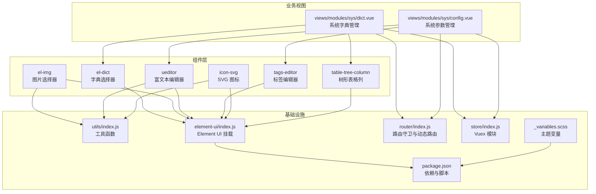
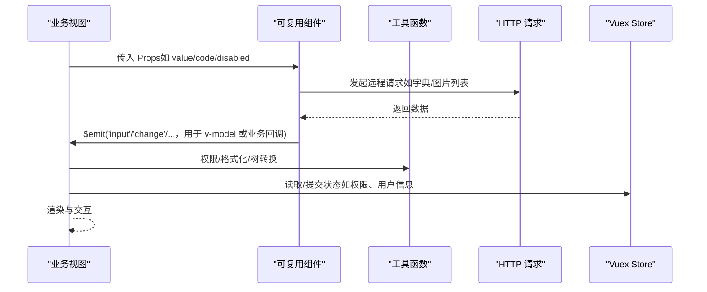
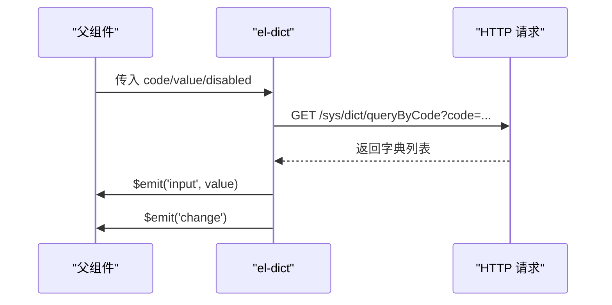
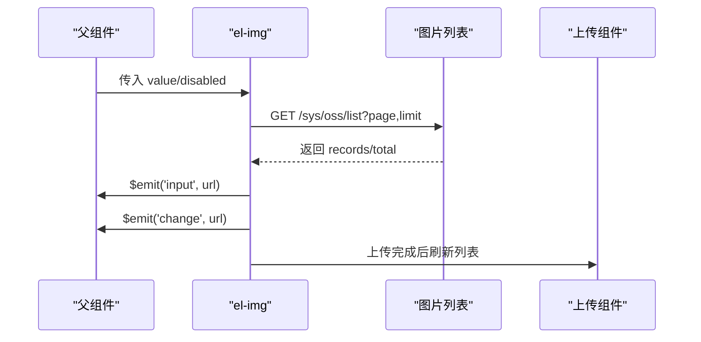
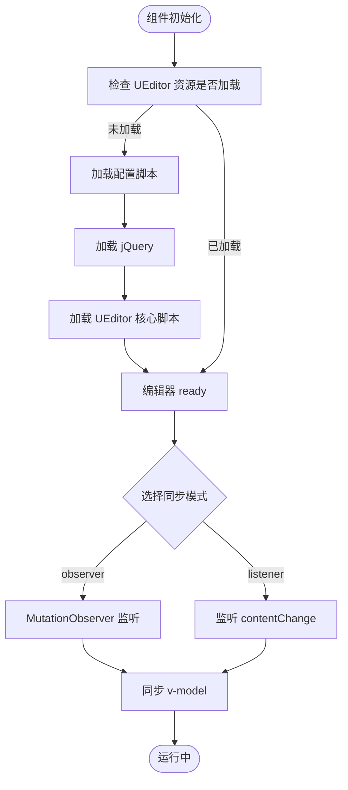
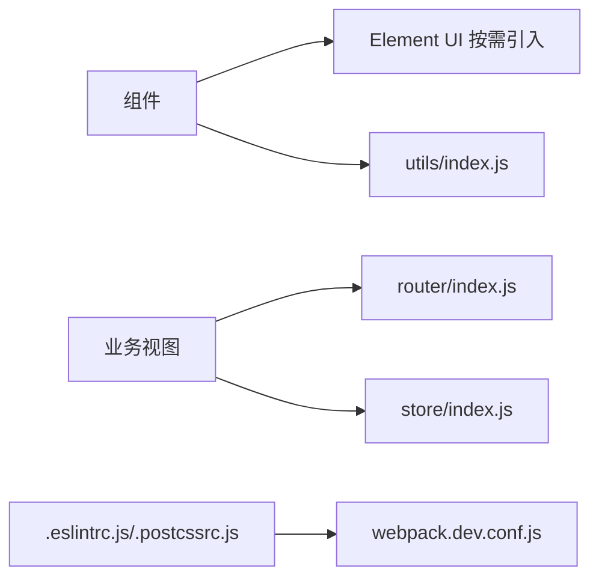

# 组件开发规范

<cite>
**本文档引用的文件**
- [el-dict/index.vue](file://platform-admin-ui/src/components/el-dict/index.vue)
- [el-img/index.vue](file://platform-admin-ui/src/components/el-img/index.vue)
- [ueditor/index.vue](file://platform-admin-ui/src/components/ueditor/index.vue)
- [tags-editor.vue](file://platform-admin-ui/src/components/tags-editor.vue)
- [icon-svg/index.vue](file://platform-admin-ui/src/components/icon-svg/index.vue)
- [table-tree-column/index.vue](file://platform-admin-ui/src/components/table-tree-column/index.vue)
- [element-ui/index.js](file://platform-admin-ui/src/element-ui/index.js)
- [utils/index.js](file://platform-admin-ui/src/utils/index.js)
- [package.json](file://platform-admin-ui/package.json)
- [_variables.scss](file://platform-admin-ui/src/assets/scss/_variables.scss)
- [router/index.js](file://platform-admin-ui/src/router/index.js)
- [store/index.js](file://platform-admin-ui/src/store/index.js)
- [dict.vue](file://platform-admin-ui/src/views/modules/sys/dict.vue)
- [config.vue](file://platform-admin-ui/src/views/modules/sys/config.vue)
- [.eslintrc.js](file://platform-admin-ui/.eslintrc.js)
- [.postcssrc.js](file://platform-admin-ui/.postcssrc.js)
- [webpack.dev.conf.js](file://platform-admin-ui/build/webpack.dev.conf.js)
</cite>

## 目录
1. [引言](#引言)
2. [项目结构](#项目结构)
3. [核心组件](#核心组件)
4. [架构总览](#架构总览)
5. [组件详解](#组件详解)
6. [依赖关系分析](#依赖关系分析)
7. [性能考量](#性能考量)
8. [故障排查指南](#故障排查指南)
9. [结论](#结论)
10. [附录](#附录)

## 引言
本规范面向管理后台 UI 的组件化开发，目标是建立统一的设计原则、命名规范、Props 定义标准、事件传递机制，以及业务组件（字典组件、图片组件、富文本编辑器、标签编辑器、图标组件、树形表格列）的实现细节与最佳实践。同时覆盖样式管理、主题适配、响应式设计与无障碍访问支持，并给出测试策略、文档规范与版本管理建议，帮助团队高效协作、提升质量与可维护性。

## 项目结构
前端采用 Vue 2.x + Element UI 技术栈，组件集中在 src/components 下，业务页面位于 src/views/modules/*，全局工具与配置位于 src/utils、src/assets、src/router、src/store 等目录；构建工具基于 webpack 与 gulp。

**图表来源**
- [el-dict/index.vue:1-75](file://platform-admin-ui/src/components/el-dict/index.vue#L1-L75)
- [el-img/index.vue:1-166](file://platform-admin-ui/src/components/el-img/index.vue#L1-L166)
- [ueditor/index.vue:1-332](file://platform-admin-ui/src/components/ueditor/index.vue#L1-L332)
- [tags-editor.vue:1-87](file://platform-admin-ui/src/components/tags-editor.vue#L1-L87)
- [icon-svg/index.vue:1-52](file://platform-admin-ui/src/components/icon-svg/index.vue#L1-L52)
- [table-tree-column/index.vue:1-85](file://platform-admin-ui/src/components/table-tree-column/index.vue#L1-L85)
- [utils/index.js:1-173](file://platform-admin-ui/src/utils/index.js#L1-L173)
- [element-ui/index.js:1-184](file://platform-admin-ui/src/element-ui/index.js#L1-L184)
- [router/index.js:1-203](file://platform-admin-ui/src/router/index.js#L1-L203)
- [store/index.js:1-28](file://platform-admin-ui/src/store/index.js#L1-L28)
- [dict.vue:1-187](file://platform-admin-ui/src/views/modules/sys/dict.vue#L1-L187)
- [config.vue:1-229](file://platform-admin-ui/src/views/modules/sys/config.vue#L1-L229)
- [package.json:1-102](file://platform-admin-ui/package.json#L1-L102)
- [_variables.scss:1-14](file://platform-admin-ui/src/assets/scss/_variables.scss#L1-L14)

**章节来源**
- [package.json:1-102](file://platform-admin-ui/package.json#L1-L102)
- [element-ui/index.js:1-184](file://platform-admin-ui/src/element-ui/index.js#L1-L184)
- [router/index.js:1-203](file://platform-admin-ui/src/router/index.js#L1-L203)
- [store/index.js:1-28](file://platform-admin-ui/src/store/index.js#L1-L28)

## 核心组件
- 字典组件（el-dict）：基于远程字典码表，提供可筛选、清空、禁用、v-model 双向绑定的下拉选择器。
- 图片组件（el-img）：封装图片选择弹窗、分页、上传、删除、预览能力，支持 v-model 双向绑定与 change 事件。
- 富文本编辑器（ueditor）：封装百度 UEditor，支持 observer 与 listener 两种 v-model 同步策略、SSR 支持、资源按需加载、禁用状态切换。
- 标签编辑器（tags-editor）：支持增删改查、输入回车确认、禁用态控制，基于逗号分隔字符串实现 v-model。
- 图标组件（icon-svg）：基于 SVG Symbol 的通用图标组件，支持尺寸、类名、无障碍属性。
- 树形表格列（table-tree-column）：封装树形展开/折叠、层级缩进、图标显隐逻辑，与 Element Table 集成。

**章节来源**
- [el-dict/index.vue:1-75](file://platform-admin-ui/src/components/el-dict/index.vue#L1-L75)
- [el-img/index.vue:1-166](file://platform-admin-ui/src/components/el-img/index.vue#L1-L166)
- [ueditor/index.vue:1-332](file://platform-admin-ui/src/components/ueditor/index.vue#L1-L332)
- [tags-editor.vue:1-87](file://platform-admin-ui/src/components/tags-editor.vue#L1-L87)
- [icon-svg/index.vue:1-52](file://platform-admin-ui/src/components/icon-svg/index.vue#L1-L52)
- [table-tree-column/index.vue:1-85](file://platform-admin-ui/src/components/table-tree-column/index.vue#L1-L85)

## 架构总览
组件开发遵循“可复用 + 低耦合 + 明确契约”的原则：组件通过 Props 输入、通过 $emit 输出事件、内部状态最小化、与业务页面解耦。全局工具提供权限判断、日期格式化、树形转换、图片预览等通用能力；Element UI 按需引入，避免打包冗余；路由与状态管理负责页面导航与共享数据。

**图表来源**
- [utils/index.js:1-173](file://platform-admin-ui/src/utils/index.js#L1-L173)
- [router/index.js:1-203](file://platform-admin-ui/src/router/index.js#L1-L203)
- [store/index.js:1-28](file://platform-admin-ui/src/store/index.js#L1-L28)
- [el-dict/index.vue:58-72](file://platform-admin-ui/src/components/el-dict/index.vue#L58-L72)
- [el-img/index.vue:109-126](file://platform-admin-ui/src/components/el-img/index.vue#L109-L126)
- [ueditor/index.vue:143-168](file://platform-admin-ui/src/components/ueditor/index.vue#L143-L168)

## 组件详解

### 设计原则与命名规范
- 命名：组件文件夹采用 kebab-case（如 el-dict），组件 name 使用 PascalCase（如 ElDict/ElImg/UEditor/TagsEditor/IconSvg/TableTreeColumn）。
- 单一职责：每个组件聚焦一个功能域，避免“万能组件”。
- Props 优先：对外暴露清晰的 Props，内部状态尽量私有。
- 事件命名：使用语义化事件名，如 change/input/ready/before-init 等，便于父组件订阅。
- v-model 规范：若组件支持 v-model，必须使用 value 作为受控值，内部通过 $emit('input') 同步。

**章节来源**
- [el-dict/index.vue:16-18](file://platform-admin-ui/src/components/el-dict/index.vue#L16-L18)
- [el-img/index.vue:54-56](file://platform-admin-ui/src/components/el-img/index.vue#L54-L56)
- [ueditor/index.vue:11-12](file://platform-admin-ui/src/components/ueditor/index.vue#L11-L12)
- [tags-editor.vue:16-17](file://platform-admin-ui/src/components/tags-editor.vue#L16-L17)
- [icon-svg/index.vue:12-13](file://platform-admin-ui/src/components/icon-svg/index.vue#L12-L13)
- [table-tree-column/index.vue:15-16](file://platform-admin-ui/src/components/table-tree-column/index.vue#L15-L16)

### Props 定义标准与事件传递机制
- 基础属性：disabled、value、size 等，均明确类型、默认值与校验。
- 数据驱动：字典组件通过 code 远程拉取选项；图片组件通过 value 初始化显示。
- 事件输出：input（用于 v-model）、change（用于业务变更通知）、ready/before-init（用于富文本生命周期）。
- 与 Element UI 对齐：Props 类型与默认值与 Element UI 保持一致，便于统一风格。

**章节来源**
- [el-dict/index.vue:31-42](file://platform-admin-ui/src/components/el-dict/index.vue#L31-L42)
- [el-img/index.vue:71-78](file://platform-admin-ui/src/components/el-img/index.vue#L71-L78)
- [ueditor/index.vue:32-106](file://platform-admin-ui/src/components/ueditor/index.vue#L32-L106)
- [tags-editor.vue:18-33](file://platform-admin-ui/src/components/tags-editor.vue#L18-L33)
- [icon-svg/index.vue:14-28](file://platform-admin-ui/src/components/icon-svg/index.vue#L14-L28)
- [table-tree-column/index.vue:17-37](file://platform-admin-ui/src/components/table-tree-column/index.vue#L17-L37)

### 业务组件实现细节

#### 字典组件（el-dict）
- 功能要点：远程拉取字典项，渲染为下拉选项；支持禁用、占位符、清空；双向绑定 value。
- 关键流程：mounted 发起请求，解析返回结构填充 options；watch 同步外部 value；changeHandle 触发 input 事件。

**图表来源**
- [el-dict/index.vue:58-72](file://platform-admin-ui/src/components/el-dict/index.vue#L58-L72)
- [el-dict/index.vue:43-57](file://platform-admin-ui/src/components/el-dict/index.vue#L43-L57)

**章节来源**
- [el-dict/index.vue:1-75](file://platform-admin-ui/src/components/el-dict/index.vue#L1-L75)

#### 图片组件（el-img）
- 功能要点：弹窗展示图片列表，分页加载；支持上传、删除、点击预览；双向绑定 value；change 事件通知选中结果。
- 关键流程：mounted 加载列表；选择后 emit change 并同步 input；删除确认后刷新列表。

**图表来源**
- [el-img/index.vue:89-126](file://platform-admin-ui/src/components/el-img/index.vue#L89-L126)
- [el-img/index.vue:101-107](file://platform-admin-ui/src/components/el-img/index.vue#L101-L107)

**章节来源**
- [el-img/index.vue:1-166](file://platform-admin-ui/src/components/el-img/index.vue#L1-L166)

#### 富文本编辑器（ueditor）
- 功能要点：支持 observer 与 listener 两种 v-model 同步策略；SSR 友好；自动加载 UEditor 资源；禁用/启用状态切换；destroy 生命周期清理。
- 关键流程：_checkDependencies 确保资源就绪；_initEditor 初始化编辑器；根据 mode 选择 MutationObserver 或 contentChange；watch 同步 value 与 disabled。

**图表来源**
- [ueditor/index.vue:169-191](file://platform-admin-ui/src/components/ueditor/index.vue#L169-L191)
- [ueditor/index.vue:142-168](file://platform-admin-ui/src/components/ueditor/index.vue#L142-L168)
- [ueditor/index.vue:260-271](file://platform-admin-ui/src/components/ueditor/index.vue#L260-L271)

**章节来源**
- [ueditor/index.vue:1-332](file://platform-admin-ui/src/components/ueditor/index.vue#L1-L332)

#### 标签编辑器（tags-editor）
- 功能要点：支持添加、删除、回车确认；禁用态不可编辑；基于逗号分隔字符串实现 v-model。
- 关键流程：computed 动态拆分/合并标签；handleClose 与 handleInputConfirm 更新 input 事件。

**章节来源**
- [tags-editor.vue:1-87](file://platform-admin-ui/src/components/tags-editor.vue#L1-L87)

#### 图标组件（icon-svg）
- 功能要点：基于 SVG Symbol，支持 name、className、width、height；无障碍属性 aria-hidden=true。
- 关键流程：computed 组合 class 与 xlink:href。

**章节来源**
- [icon-svg/index.vue:1-52](file://platform-admin-ui/src/components/icon-svg/index.vue#L1-L52)

#### 树形表格列（table-tree-column）
- 功能要点：封装树形展开/折叠、层级缩进、图标显隐；与 Element Table 集成，支持 $attrs 透传。
- 关键流程：toggleHandle 控制展开/折叠；removeChildNode 递归移除子节点；commit setData 刷新表格。

**章节来源**
- [table-tree-column/index.vue:1-85](file://platform-admin-ui/src/components/table-tree-column/index.vue#L1-L85)

### 与业务页面的集成示例
- 字典管理页面（sys/dict.vue）：使用 el-dict 作为筛选条件或表单项，结合分页与权限控制。
- 参数管理页面（sys/config.vue）：使用 ueditor 作为富文本字段，配合 tags-editor 作为标签字段，实现复杂内容编辑与标签管理。

**章节来源**
- [dict.vue:1-187](file://platform-admin-ui/src/views/modules/sys/dict.vue#L1-L187)
- [config.vue:1-229](file://platform-admin-ui/src/views/modules/sys/config.vue#L1-L229)

## 依赖关系分析
- 组件依赖 Element UI：通过 element-ui/index.js 按需挂载，减少打包体积。
- 工具函数：isAuth、treeDataTranslate、transDict、openImg 等贯穿组件与页面。
- 路由与状态：router/index.js 负责动态菜单注入与权限校验；store/index.js 提供模块化状态管理。
- 构建与规范：.eslintrc.js 保证代码风格；.postcssrc.js 自动补全与导入；webpack.dev.conf.js 提供开发服务器配置。

**图表来源**
- [element-ui/index.js:1-184](file://platform-admin-ui/src/element-ui/index.js#L1-L184)
- [utils/index.js:1-173](file://platform-admin-ui/src/utils/index.js#L1-L173)
- [router/index.js:1-203](file://platform-admin-ui/src/router/index.js#L1-L203)
- [store/index.js:1-28](file://platform-admin-ui/src/store/index.js#L1-L28)
- [.eslintrc.js:1-67](file://platform-admin-ui/.eslintrc.js#L1-L67)
- [.postcssrc.js:1-10](file://platform-admin-ui/.postcssrc.js#L1-L10)
- [webpack.dev.conf.js:1-97](file://platform-admin-ui/build/webpack.dev.conf.js#L1-L97)

**章节来源**
- [element-ui/index.js:1-184](file://platform-admin-ui/src/element-ui/index.js#L1-L184)
- [utils/index.js:1-173](file://platform-admin-ui/src/utils/index.js#L1-L173)
- [router/index.js:1-203](file://platform-admin-ui/src/router/index.js#L1-L203)
- [store/index.js:1-28](file://platform-admin-ui/src/store/index.js#L1-L28)
- [.eslintrc.js:1-67](file://platform-admin-ui/.eslintrc.js#L1-L67)
- [.postcssrc.js:1-10](file://platform-admin-ui/.postcssrc.js#L1-L10)
- [webpack.dev.conf.js:1-97](file://platform-admin-ui/build/webpack.dev.conf.js#L1-L97)

## 性能考量
- 按需引入 Element UI：避免全量引入导致包体增大。
- 组件懒加载：业务页面使用路由懒加载，减少首屏加载压力。
- 防抖与节流：富文本 observer 模式支持防抖配置，降低频繁变更带来的重渲染。
- 分页与虚拟滚动：图片列表与表格数据建议分页加载，必要时结合虚拟滚动优化长列表。
- 资源缓存：静态资源 CDN 与浏览器缓存策略，缩短二次加载时间。
- Lint 与 PostCSS：ESLint 规范与 autoprefixer 保证代码质量与兼容性。

**章节来源**
- [element-ui/index.js:1-184](file://platform-admin-ui/src/element-ui/index.js#L1-L184)
- [ueditor/index.vue:72-96](file://platform-admin-ui/src/components/ueditor/index.vue#L72-L96)
- [el-img/index.vue:36-44](file://platform-admin-ui/src/components/el-img/index.vue#L36-L44)
- [.eslintrc.js:1-67](file://platform-admin-ui/.eslintrc.js#L1-L67)
- [.postcssrc.js:1-10](file://platform-admin-ui/.postcssrc.js#L1-L10)

## 故障排查指南
- 富文本初始化失败：检查 UEDITOR_HOME_URL 与资源加载顺序，确认 _checkDependencies 成功。
- v-model 不生效：确认组件使用 value 作为受控值，且在合适时机 emit('input')。
- 图片组件无法删除：核对 isAuth('sys:oss:delete') 权限与后端接口返回状态。
- 字典组件无选项：检查 code 是否正确，后端返回结构是否符合预期。
- SSR 环境异常：使用 forceInit 或区分客户端/服务端环境，确保编辑器实例化时机正确。
- 权限与菜单：路由守卫与动态菜单注入失败时，检查 token 与后端返回的 permissions/dictList/orgList/userList。

**章节来源**
- [ueditor/index.vue:169-191](file://platform-admin-ui/src/components/ueditor/index.vue#L169-L191)
- [el-img/index.vue:127-151](file://platform-admin-ui/src/components/el-img/index.vue#L127-L151)
- [el-dict/index.vue:58-72](file://platform-admin-ui/src/components/el-dict/index.vue#L58-L72)
- [router/index.js:91-127](file://platform-admin-ui/src/router/index.js#L91-L127)
- [utils/index.js:18-20](file://platform-admin-ui/src/utils/index.js#L18-L20)

## 结论
通过统一的组件设计原则、规范化的 Props/事件契约、完善的业务组件实现与基础设施支撑，管理后台 UI 能够实现高复用、低耦合与强一致性。建议在后续迭代中持续完善测试与文档体系，强化主题与无障碍支持，进一步提升用户体验与可维护性。

## 附录

### 样式管理与主题适配
- 主题变量：通过 _variables.scss 定义主色、侧边栏、内容区等变量，确保与 Element UI 主题文件一致。
- SCSS 模块化：组件样式采用 scoped 与局部变量，避免全局污染。
- 响应式设计：结合 Element Grid 与媒体查询，适配不同屏幕尺寸。

**章节来源**
- [_variables.scss:1-14](file://platform-admin-ui/src/assets/scss/_variables.scss#L1-L14)

### 无障碍访问（a11y）建议
- 图标组件：为 icon-svg 设置 aria-hidden=true，避免重复读屏。
- 表单控件：为必填项与错误状态提供可读的提示文案。
- 键盘导航：确保可交互元素可通过键盘访问与操作。

**章节来源**
- [icon-svg/index.vue:6-8](file://platform-admin-ui/src/components/icon-svg/index.vue#L6-L8)

### 测试策略与文档规范
- 单元测试：针对工具函数（如 treeDataTranslate、transDict）与纯函数进行断言。
- 组件测试：使用快照测试与交互模拟，验证 Props/事件行为与渲染结果。
- 文档规范：组件 README 包含用途、Props/Events/Slots/插槽说明、使用示例与注意事项。
- 版本管理：遵循语义化版本，变更日志记录 breaking change 与新特性。

**章节来源**
- [utils/index.js:22-50](file://platform-admin-ui/src/utils/index.js#L22-L50)
- [package.json:1-102](file://platform-admin-ui/package.json#L1-L102)

### 团队协作规范
- 提交规范：使用约定式提交（如 feat/fix/docs/chore），配合 CI 校验。
- 代码评审：PR 必须包含测试用例与文档更新。
- 分支策略：master/main 保护分支，hotfix/feature/release 分支管理。

**章节来源**
- [.eslintrc.js:1-67](file://platform-admin-ui/.eslintrc.js#L1-L67)