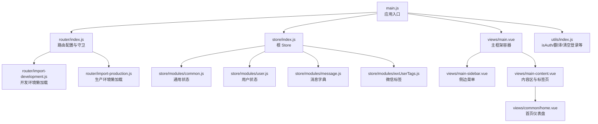
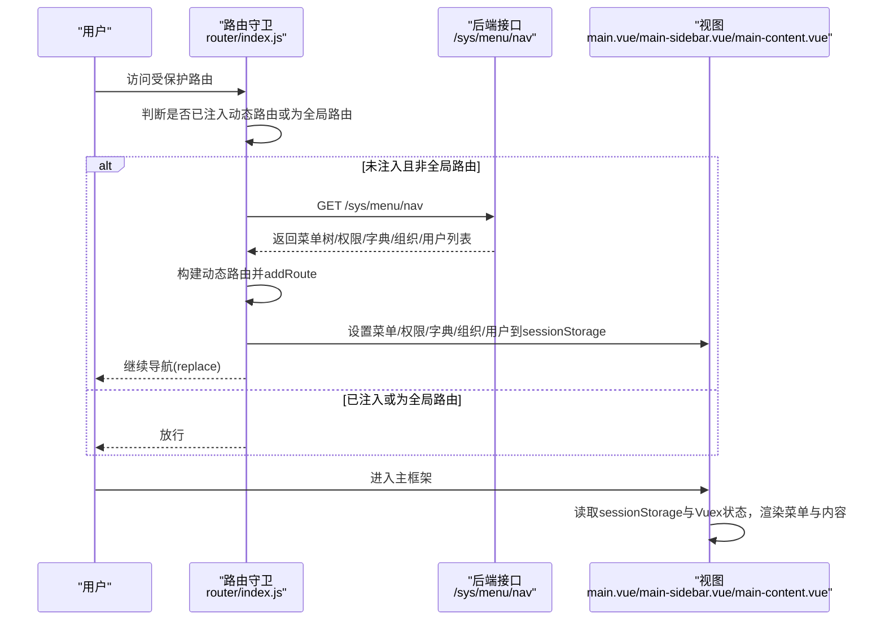
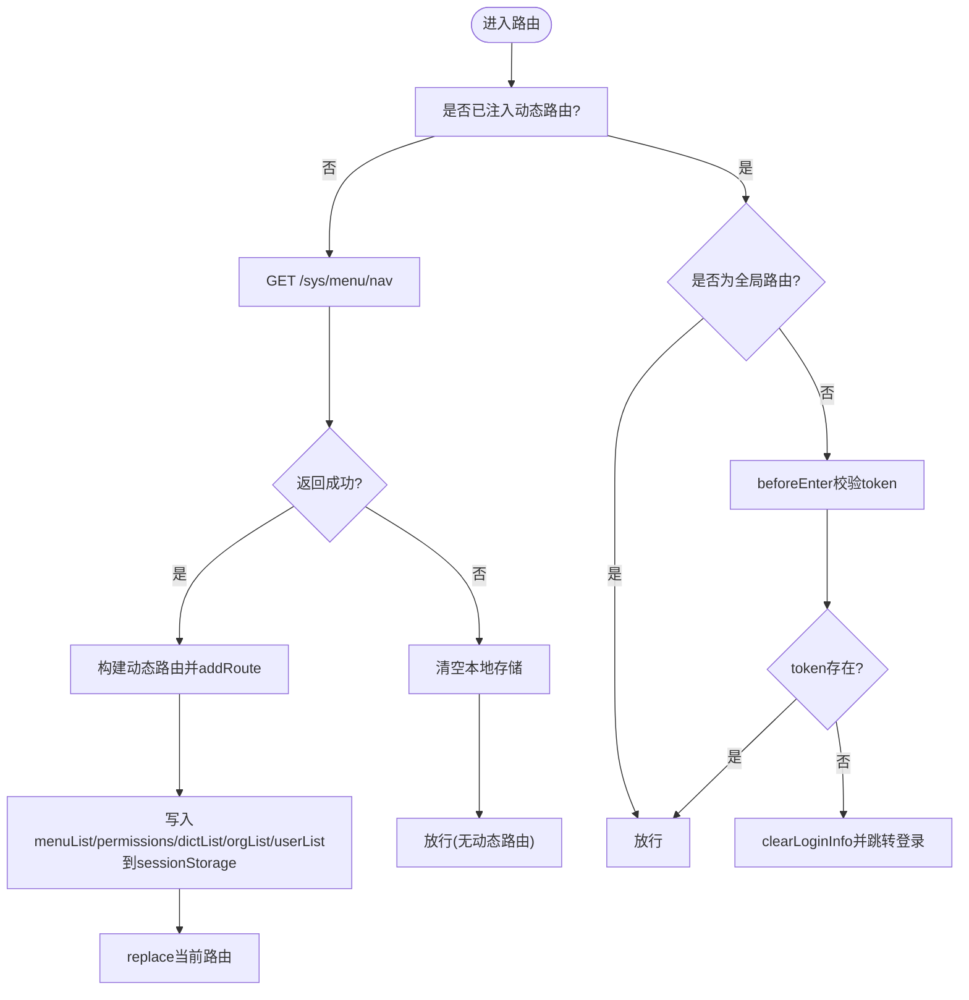
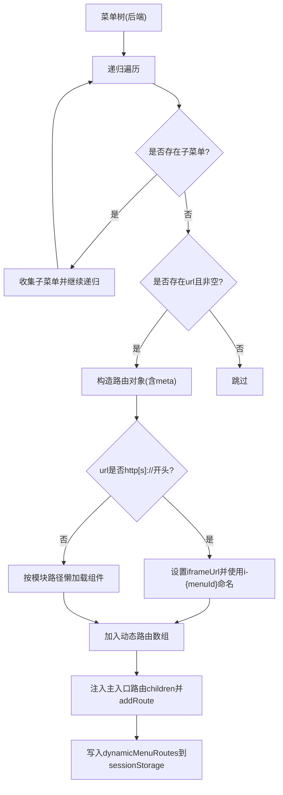
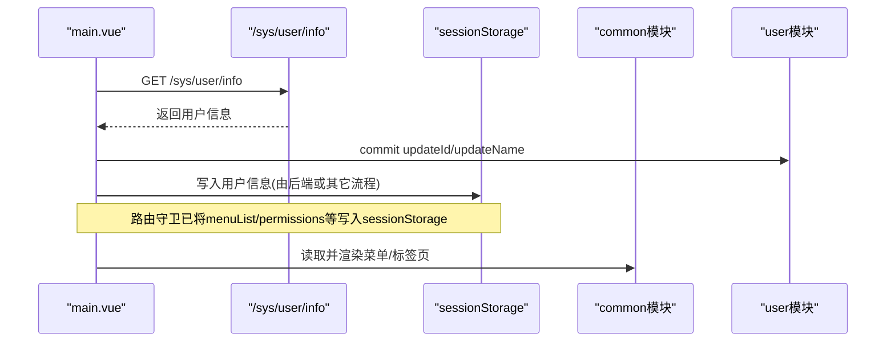
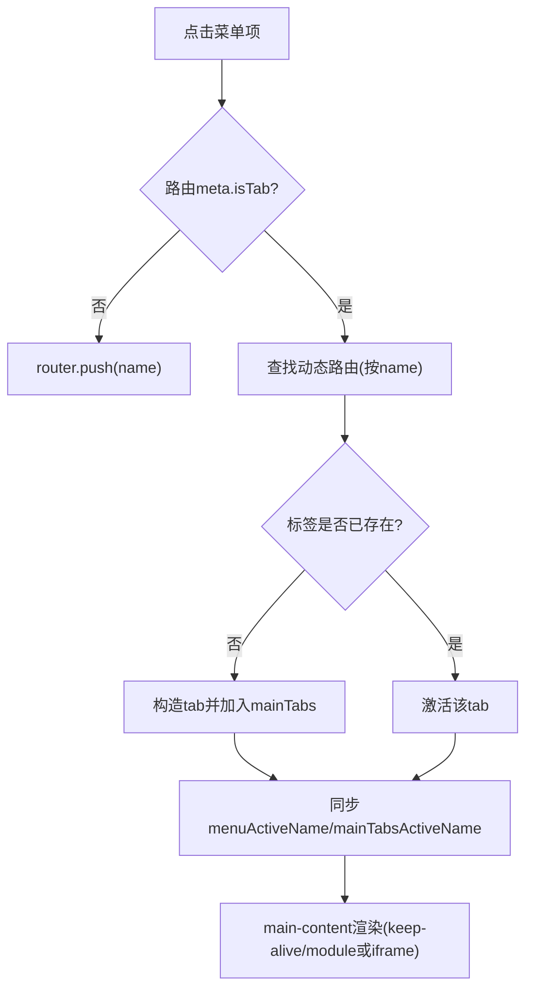
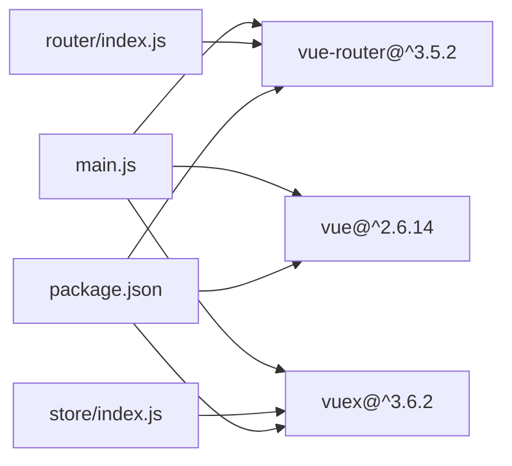

# 路由与状态管理

<cite>
**本文引用的文件**
- [package.json](file://platform-admin-ui/package.json)
- [router/index.js](file://platform-admin-ui/src/router/index.js)
- [router/import-development.js](file://platform-admin-ui/src/router/import-development.js)
- [router/import-production.js](file://platform-admin-ui/src/router/import-production.js)
- [store/index.js](file://platform-admin-ui/src/store/index.js)
- [store/modules/common.js](file://platform-admin-ui/src/store/modules/common.js)
- [store/modules/user.js](file://platform-admin-ui/src/store/modules/user.js)
- [store/modules/message.js](file://platform-admin-ui/src/store/modules/message.js)
- [store/modules/wxUserTags.js](file://platform-admin-ui/src/store/modules/wxUserTags.js)
- [utils/index.js](file://platform-admin-ui/src/utils/index.js)
- [views/main.vue](file://platform-admin-ui/src/views/main.vue)
- [views/main-sidebar.vue](file://platform-admin-ui/src/views/main-sidebar.vue)
- [views/main-content.vue](file://platform-admin-ui/src/views/main-content.vue)
- [views/common/home.vue](file://platform-admin-ui/src/views/common/home.vue)
- [main.js](file://platform-admin-ui/src/main.js)
</cite>

## 目录
1. [引言](#引言)
2. [项目结构](#项目结构)
3. [核心组件](#核心组件)
4. [架构总览](#架构总览)
5. [详细组件分析](#详细组件分析)
6. [依赖关系分析](#依赖关系分析)
7. [性能考量](#性能考量)
8. [故障排查指南](#故障排查指南)
9. [结论](#结论)
10. [附录](#附录)

## 引言
本文件聚焦于基于 Vue Router 3.5.2 与 Vuex 3.6.2 的前端路由与状态管理实现，系统性解析以下主题：
- 路由配置策略：全局路由、主入口路由、动态菜单路由注入与持久化
- 动态路由生成：后端菜单树到前端路由的映射、iframe 嵌套与模块化路由
- 路由守卫机制与权限控制：登录态校验、菜单与权限的首次拉取与本地存储
- Vuex 状态管理模式：模块化设计、命名空间、Mutation 编写规范
- 用户状态管理、菜单状态同步、权限状态维护与全局状态共享
- 路由懒加载、面包屑导航、页面缓存（keep-alive）与会话管理
- 最佳实践、状态持久化方案与调试技巧

## 项目结构
前端工程位于 platform-admin-ui，核心目录与文件如下：
- 路由层：src/router 下包含路由定义、开发/生产环境懒加载适配
- 状态层：src/store 下包含根 store 与各模块
- 视图层：src/views 下包含主框架与业务页面
- 工具层：src/utils 下包含通用工具函数与权限判断
- 入口：src/main.js 初始化应用、挂载全局能力与启动 Vuex



图表来源
- [main.js:1-80](file://platform-admin-ui/src/main.js#L1-L80)
- [router/index.js:1-203](file://platform-admin-ui/src/router/index.js#L1-L203)
- [router/import-development.js:1-2](file://platform-admin-ui/src/router/import-development.js#L1-L2)
- [router/import-production.js:1-2](file://platform-admin-ui/src/router/import-production.js#L1-L2)
- [store/index.js:1-28](file://platform-admin-ui/src/store/index.js#L1-L28)
- [store/modules/common.js:1-71](file://platform-admin-ui/src/store/modules/common.js#L1-L71)
- [store/modules/user.js:1-16](file://platform-admin-ui/src/store/modules/user.js#L1-L16)
- [store/modules/message.js:1-32](file://platform-admin-ui/src/store/modules/message.js#L1-L32)
- [store/modules/wxUserTags.js:1-12](file://platform-admin-ui/src/store/modules/wxUserTags.js#L1-L12)
- [views/main.vue:1-107](file://platform-admin-ui/src/views/main.vue#L1-L107)
- [views/main-sidebar.vue:1-120](file://platform-admin-ui/src/views/main-sidebar.vue#L1-L120)
- [views/main-content.vue:1-124](file://platform-admin-ui/src/views/main-content.vue#L1-L124)
- [views/common/home.vue:1-800](file://platform-admin-ui/src/views/common/home.vue#L1-L800)
- [utils/index.js:1-173](file://platform-admin-ui/src/utils/index.js#L1-L173)

章节来源
- [package.json:1-102](file://platform-admin-ui/package.json#L1-L102)
- [main.js:1-80](file://platform-admin-ui/src/main.js#L1-L80)

## 核心组件
- 路由系统
  - 全局路由：404、登录页
  - 主入口路由：包含首页、主题等基础页面，并在进入前进行登录态校验
  - 动态菜单路由：首次访问时从后端拉取菜单树，构建动态路由并注入
- 状态管理
  - 根 Store：注册 common、user、message、wxUserTags 模块，提供 resetStore Mutation
  - common 模块：管理文档可视高度、导航/侧边栏样式、菜单、标签页集合与当前激活项
  - user 模块：管理用户标识与名称
  - message 模块：维护微信消息类型字典
  - wxUserTags 模块：维护微信用户标签列表
- 视图与交互
  - main.vue：主框架容器，提供刷新能力与用户信息初始化
  - main-sidebar.vue：侧边菜单，读取菜单与标签页状态，联动路由
  - main-content.vue：内容区，支持标签页模式与 keep-alive 缓存
- 工具与权限
  - isAuth：基于 sessionStorage 中权限数组判断按钮级权限
  - clearLoginInfo：清理 Cookie、恢复 Store 初始状态、重置动态路由注入标记

章节来源
- [router/index.js:26-81](file://platform-admin-ui/src/router/index.js#L26-L81)
- [router/index.js:91-127](file://platform-admin-ui/src/router/index.js#L91-L127)
- [router/index.js:145-200](file://platform-admin-ui/src/router/index.js#L145-L200)
- [store/index.js:11-27](file://platform-admin-ui/src/store/index.js#L11-L27)
- [store/modules/common.js:3-71](file://platform-admin-ui/src/store/modules/common.js#L3-L71)
- [store/modules/user.js:1-16](file://platform-admin-ui/src/store/modules/user.js#L1-L16)
- [store/modules/message.js:1-32](file://platform-admin-ui/src/store/modules/message.js#L1-L32)
- [store/modules/wxUserTags.js:1-12](file://platform-admin-ui/src/store/modules/wxUserTags.js#L1-L12)
- [views/main.vue:14-106](file://platform-admin-ui/src/views/main.vue#L14-L106)
- [views/main-sidebar.vue:24-120](file://platform-admin-ui/src/views/main-sidebar.vue#L24-L120)
- [views/main-content.vue:40-124](file://platform-admin-ui/src/views/main-content.vue#L40-L124)
- [utils/index.js:18-20](file://platform-admin-ui/src/utils/index.js#L18-L20)
- [utils/index.js:168-173](file://platform-admin-ui/src/utils/index.js#L168-L173)

## 架构总览
下图展示了“路由守卫 → 动态路由注入 → 状态同步 → 视图渲染”的完整链路。



图表来源
- [router/index.js:91-127](file://platform-admin-ui/src/router/index.js#L91-L127)
- [router/index.js:145-200](file://platform-admin-ui/src/router/index.js#L145-L200)
- [views/main.vue:92-103](file://platform-admin-ui/src/views/main.vue#L92-L103)
- [views/main-sidebar.vue:84-87](file://platform-admin-ui/src/views/main-sidebar.vue#L84-L87)

## 详细组件分析

### 路由配置与守卫
- 全局路由与主入口路由
  - 全局路由：404、登录页，无需布局
  - 主入口路由：/，redirect 到 home，children 包含首页与主题，进入前校验 token
- 路由守卫
  - beforeEach：若未注入动态路由且目标非全局路由，则调用 /sys/menu/nav 拉取菜单与权限
  - 成功后：构建动态路由并 addRoute；同时将菜单树、权限、字典、组织、用户列表写入 sessionStorage
  - 失败或异常：清理本地存储并跳转登录
- 登录态校验
  - beforeEnter：检查 Cookie 中 token，缺失则清除登录信息并跳转登录



图表来源
- [router/index.js:91-127](file://platform-admin-ui/src/router/index.js#L91-L127)
- [router/index.js:73-81](file://platform-admin-ui/src/router/index.js#L73-L81)
- [utils/index.js:168-173](file://platform-admin-ui/src/utils/index.js#L168-L173)

章节来源
- [router/index.js:26-81](file://platform-admin-ui/src/router/index.js#L26-L81)
- [router/index.js:91-127](file://platform-admin-ui/src/router/index.js#L91-L127)
- [router/index.js:73-81](file://platform-admin-ui/src/router/index.js#L73-L81)

### 动态路由生成与菜单树映射
- 菜单树到路由的映射规则
  - 递归遍历菜单树，叶子节点且 url 非空即生成路由
  - url 以 http[s]:// 开头：生成 iframe 路由；否则按模块路径懒加载组件
  - 路由 meta 字段包含 menuId、title、isDynamic、isTab、iframeUrl
- 注入策略
  - 将动态路由注入到主入口路由 children，并追加兜底 404
  - 将动态路由集合写入 sessionStorage，供侧边栏与标签页联动使用



图表来源
- [router/index.js:145-200](file://platform-admin-ui/src/router/index.js#L145-L200)

章节来源
- [router/index.js:145-200](file://platform-admin-ui/src/router/index.js#L145-L200)

### 路由懒加载与开发/生产差异
- 开发环境：直接 require 模块，便于热更新
- 生产环境：使用动态 import，启用路由级别的代码分割
- 通过 NODE_ENV 选择对应导入器

章节来源
- [router/import-development.js:1-2](file://platform-admin-ui/src/router/import-development.js#L1-L2)
- [router/import-production.js:1-2](file://platform-admin-ui/src/router/import-production.js#L1-L2)
- [router/index.js:23-24](file://platform-admin-ui/src/router/index.js#L23-L24)

### Vuex 模块化与命名空间
- 根 Store
  - 注册 common、user、message、wxUserTags 模块
  - 提供 resetStore Mutation，用于恢复初始状态
- common 模块
  - 状态：文档可视高度、导航/侧边栏样式、折叠状态、菜单、当前激活菜单、内容刷新标志、主入口标签页集合与当前激活标签名
  - Mutation：更新上述状态；removeTab 移除指定标签并回退到当前标签或首页；closeCurrentTab 委托移除
- user 模块
  - 状态：id、name
  - Mutation：updateId、updateName
- message 模块
  - 状态：微信 XML 消息类型与客服消息类型的字典
- wxUserTags 模块
  - 状态：tags 数组
  - Mutation：updateTags

```mermaid
classDiagram
class StoreRoot {
+modules : common,user,message,wxUserTags
+mutations.resetStore(state)
}
class CommonModule {
+state.documentClientHeight
+state.navbarLayoutType
+state.sidebarLayoutSkin
+state.sidebarFold
+state.menuList
+state.menuActiveName
+state.contentIsNeedRefresh
+state.mainTabs
+state.mainTabsActiveName
+mutations.update*
+mutations.removeTab(tabName)
+mutations.closeCurrentTab()
}
class UserModule {
+state.id
+state.name
+mutations.updateId(id)
+mutations.updateName(name)
}
class MessageModule {
+state.XmlMsgType
+state.KefuMsgType
}
class WxUserTagsModule {
+state.tags
+mutations.updateTags(tags)
}
StoreRoot --> CommonModule : "namespaced : true"
StoreRoot --> UserModule : "namespaced : true"
StoreRoot --> MessageModule : "namespaced : true"
StoreRoot --> WxUserTagsModule : "namespaced : true"
```

图表来源
- [store/index.js:11-27](file://platform-admin-ui/src/store/index.js#L11-L27)
- [store/modules/common.js:3-71](file://platform-admin-ui/src/store/modules/common.js#L3-L71)
- [store/modules/user.js:1-16](file://platform-admin-ui/src/store/modules/user.js#L1-L16)
- [store/modules/message.js:1-32](file://platform-admin-ui/src/store/modules/message.js#L1-L32)
- [store/modules/wxUserTags.js:1-12](file://platform-admin-ui/src/store/modules/wxUserTags.js#L1-L12)

章节来源
- [store/index.js:11-27](file://platform-admin-ui/src/store/index.js#L11-L27)
- [store/modules/common.js:3-71](file://platform-admin-ui/src/store/modules/common.js#L3-L71)
- [store/modules/user.js:1-16](file://platform-admin-ui/src/store/modules/user.js#L1-L16)
- [store/modules/message.js:1-32](file://platform-admin-ui/src/store/modules/message.js#L1-L32)
- [store/modules/wxUserTags.js:1-12](file://platform-admin-ui/src/store/modules/wxUserTags.js#L1-L12)

### 用户状态管理与菜单/权限同步
- 用户信息初始化
  - main.vue 在 mounted 后调用 /sys/user/info 获取当前管理员信息，写入 user 模块
- 菜单与权限同步
  - 路由守卫成功后，将菜单树、权限、字典、组织、用户列表写入 sessionStorage
  - main-sidebar.vue 读取 sessionStorage 并同步到 common.menuList 与 common.mainTabs
  - isAuth 基于 sessionStorage.permissions 判断按钮级权限



图表来源
- [views/main.vue:92-103](file://platform-admin-ui/src/views/main.vue#L92-L103)
- [views/main-sidebar.vue:84-87](file://platform-admin-ui/src/views/main-sidebar.vue#L84-L87)
- [utils/index.js:18-20](file://platform-admin-ui/src/utils/index.js#L18-L20)

章节来源
- [views/main.vue:92-103](file://platform-admin-ui/src/views/main.vue#L92-L103)
- [views/main-sidebar.vue:84-87](file://platform-admin-ui/src/views/main-sidebar.vue#L84-L87)
- [utils/index.js:18-20](file://platform-admin-ui/src/utils/index.js#L18-L20)

### 面包屑导航、页面缓存与标签页
- 面包屑导航
  - 通过路由 meta.title 与动态路由 meta.menuId 实现标题与菜单项关联
- 标签页与页面缓存
  - main-content.vue 使用 Element Tabs 展示标签页，支持关闭当前/其它/全部与刷新当前
  - 标签页类型区分 iframe 与 module，module 使用 keep-alive 缓存
  - common 模块维护 mainTabs 与 mainTabsActiveName，removeTab 与 closeCurrentTab 协助切换与回收
- 侧边菜单联动
  - main-sidebar.vue 监听路由变化，根据 isTab 与 isDynamic 决定是否新增标签页并同步激活状态



图表来源
- [views/main-sidebar.vue:90-117](file://platform-admin-ui/src/views/main-sidebar.vue#L90-L117)
- [views/main-content.vue:4-31](file://platform-admin-ui/src/views/main-content.vue#L4-L31)
- [views/main-content.vue:86-120](file://platform-admin-ui/src/views/main-content.vue#L86-L120)
- [store/modules/common.js:51-69](file://platform-admin-ui/src/store/modules/common.js#L51-L69)

章节来源
- [views/main-sidebar.vue:90-117](file://platform-admin-ui/src/views/main-sidebar.vue#L90-L117)
- [views/main-content.vue:4-31](file://platform-admin-ui/src/views/main-content.vue#L4-L31)
- [views/main-content.vue:86-120](file://platform-admin-ui/src/views/main-content.vue#L86-L120)
- [store/modules/common.js:51-69](file://platform-admin-ui/src/store/modules/common.js#L51-L69)

### 会话管理与登录态校验
- 会话管理
  - clearLoginInfo：删除 token Cookie、调用 resetStore、重置 isAddDynamicMenuRoutes 标志
- 登录态校验
  - beforeEnter：读取 Cookie 中 token，缺失则清理并跳转登录
- 权限控制
  - isAuth：从 sessionStorage.permissions 读取权限数组，判断按钮级权限

章节来源
- [utils/index.js:168-173](file://platform-admin-ui/src/utils/index.js#L168-L173)
- [router/index.js:73-81](file://platform-admin-ui/src/router/index.js#L73-L81)
- [utils/index.js:18-20](file://platform-admin-ui/src/utils/index.js#L18-L20)

## 依赖关系分析
- 版本约束
  - Vue: ^2.6.14
  - vue-router: ^3.5.2
  - vuex: ^3.6.2
- 组件耦合
  - 路由依赖 utils/httpRequest 与 utils/validate
  - 视图依赖 Element UI 与自定义组件
  - Store 依赖 lodash/cloneDeep 用于 resetStore
- 外部集成
  - 百度统计、剪贴板、Cookie、HTTP 请求封装



图表来源
- [package.json:14-36](file://platform-admin-ui/package.json#L14-L36)
- [router/index.js:7-11](file://platform-admin-ui/src/router/index.js#L7-L11)
- [store/index.js:1-9](file://platform-admin-ui/src/store/index.js#L1-L9)
- [main.js:1-28](file://platform-admin-ui/src/main.js#L1-L28)

章节来源
- [package.json:14-36](file://platform-admin-ui/package.json#L14-L36)

## 性能考量
- 路由懒加载
  - 生产环境使用动态 import，减少首屏体积，提升加载速度
- keep-alive 缓存
  - 标签页中的模块页面使用 keep-alive，避免重复渲染
- 动态路由注入时机
  - 首次访问时一次性注入，后续复用，避免重复网络请求
- 状态持久化
  - sessionStorage 存储菜单/权限/字典/组织/用户列表，减少重复请求
- 图表与大数据
  - 首页 home.vue 中大量图表与表格，建议在 activated 钩子中做 resize 适配，避免空白问题

## 故障排查指南
- 登录后跳转登录页
  - 检查 Cookie 中 token 是否存在；确认 clearLoginInfo 是否被调用
  - 查看路由守卫错误分支是否触发并跳转登录
- 动态路由未生效
  - 确认 /sys/menu/nav 接口返回正确菜单树
  - 检查 isAddDynamicMenuRoutes 标志位与 sessionStorage 是否写入
  - 校验动态路由是否成功 addRoute
- 标签页无法切换或关闭异常
  - 检查 common.removeTab 与 mainTabsActiveName 更新逻辑
  - 确认 main-content 中 keep-alive 与 router-view 的配合
- 权限按钮不可见
  - 检查 sessionStorage.permissions 是否包含对应权限标识
  - 确认 isAuth 方法读取路径与权限字符串匹配

章节来源
- [utils/index.js:168-173](file://platform-admin-ui/src/utils/index.js#L168-L173)
- [router/index.js:98-126](file://platform-admin-ui/src/router/index.js#L98-L126)
- [views/main-content.vue:95-119](file://platform-admin-ui/src/views/main-content.vue#L95-L119)
- [utils/index.js:18-20](file://platform-admin-ui/src/utils/index.js#L18-L20)

## 结论
本项目采用“路由守卫 + 动态路由注入 + Vuex 模块化”的组合方案，实现了菜单驱动的路由体系与细粒度的权限控制。通过 sessionStorage 与 Vuex 的协同，确保了菜单、权限、用户信息与界面状态的一致性与可恢复性。结合标签页与 keep-alive，兼顾了用户体验与性能表现。建议在后续迭代中进一步完善 Action 的异步流程与错误处理，以及对权限变更的实时响应机制。

## 附录
- 最佳实践
  - 路由跳转统一使用 name，避免硬编码 path
  - 动态路由命名规范：模块路由使用 url 转换后的 name，iframe 路由使用 i-{menuId}
  - Mutation 保持幂等与小粒度，避免跨模块副作用
  - 权限判断集中于 isAuth，按钮级权限与路由守卫解耦
- 状态持久化方案
  - 首次拉取的菜单/权限/字典/组织/用户列表写入 sessionStorage
  - Store 初始状态保存在 window.SITE_CONFIG.storeState，resetStore 用于恢复
- 调试技巧
  - 在路由守卫中打印关键变量（如 isAddDynamicMenuRoutes、token）
  - 使用浏览器开发者工具观察 sessionStorage 与 Vuex DevTools
  - 对图表类组件在 activated 中增加 resize 适配