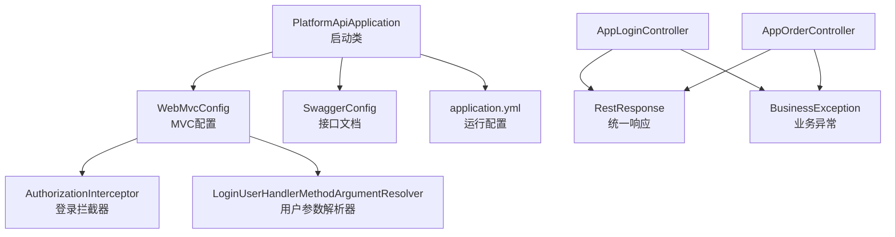
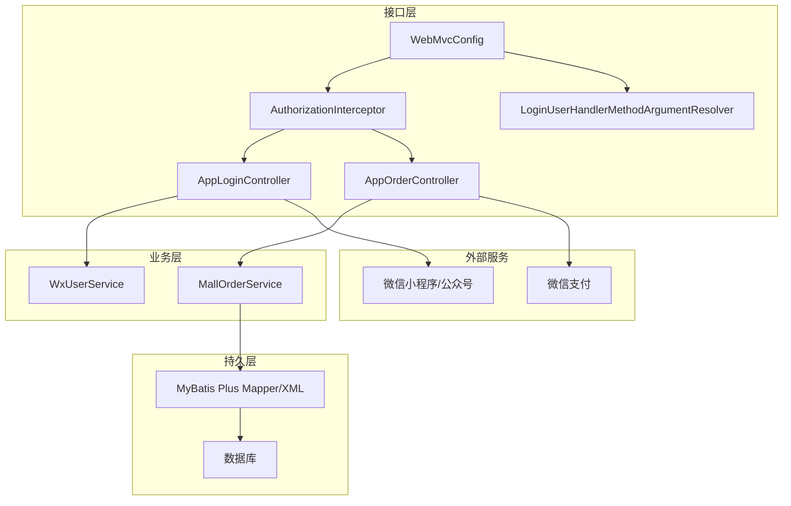
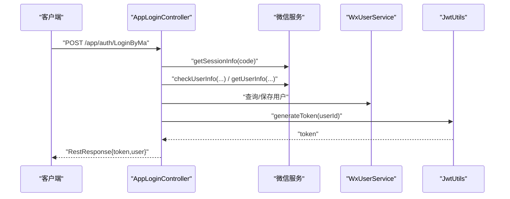
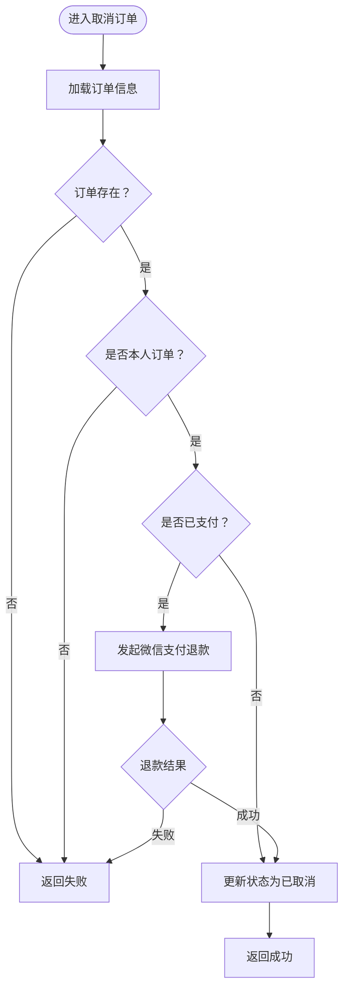
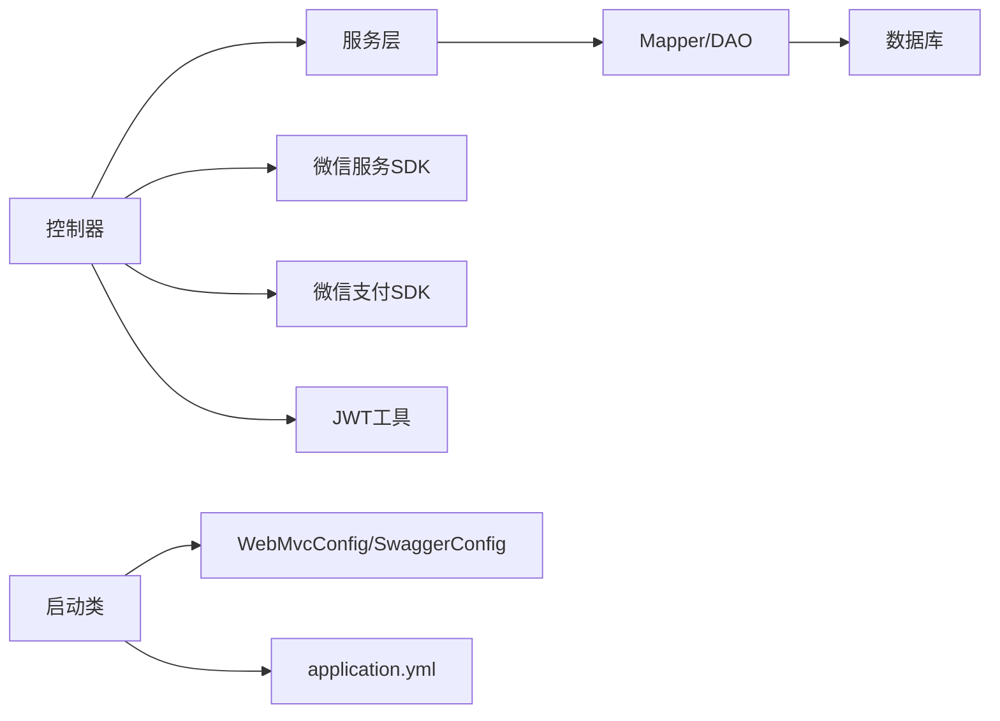

# 业务API服务 (platform-api)

<cite>
**本文引用的文件**
- [PlatformApiApplication.java](file://platform-api/src/main/java/com/platform/PlatformApiApplication.java)
- [application.yml](file://platform-api/src/main/resources/application.yml)
- [WebMvcConfig.java](file://platform-api/src/main/java/com/platform/config/WebMvcConfig.java)
- [SwaggerConfig.java](file://platform-api/src/main/java/com/platform/config/SwaggerConfig.java)
- [AuthorizationInterceptor.java](file://platform-api/src/main/java/com/platform/interceptor/AuthorizationInterceptor.java)
- [LoginUserHandlerMethodArgumentResolver.java](file://platform-api/src/main/java/com/platform/resolver/LoginUserHandlerMethodArgumentResolver.java)
- [RestResponse.java](file://platform-common/src/main/java/com/platform/common/utils/RestResponse.java)
- [BusinessException.java](file://platform-common/src/main/java/com/platform/common/exception/BusinessException.java)
- [AppBaseController.java](file://platform-api/src/main/java/com/platform/modules/app/controller/AppBaseController.java)
- [AppLoginController.java](file://platform-api/src/main/java/com/platform/modules/app/controller/AppLoginController.java)
- [AppOrderController.java](file://platform-api/src/main/java/com/platform/modules/app/controller/AppOrderController.java)
</cite>

## 目录
1. [简介](#简介)
2. [项目结构](#项目结构)
3. [核心组件](#核心组件)
4. [架构总览](#架构总览)
5. [详细组件分析](#详细组件分析)
6. [依赖分析](#依赖分析)
7. [性能考虑](#性能考虑)
8. [故障排查指南](#故障排查指南)
9. [结论](#结论)
10. [附录](#附录)

## 简介
本文件面向平台业务API服务（platform-api）的开发者与维护者，系统性阐述接口层的设计理念、Spring Boot启动与Web MVC配置、拦截器与参数解析器注册、统一响应模型与错误处理、认证与权限流程、核心业务控制器组织结构（商品、订单、用户、支付等）、跨域与安全防护、性能优化策略以及API开发规范。目标是帮助读者快速理解并高效扩展业务API。

## 项目结构
platform-api作为独立的Spring Boot应用，采用多模块工程布局，核心接口集中在modules/app目录下，配合通用工具与异常处理位于platform-common模块。Web层通过WebMvcConfig注册拦截器与参数解析器，统一认证与用户注入；Swagger集成提供接口文档能力；配置文件集中管理运行参数、Redis、MyBatis Plus、JWT、支付等外部依赖。

图表来源
- [PlatformApiApplication.java:1-92](file://platform-api/src/main/java/com/platform/PlatformApiApplication.java#L1-L92)
- [WebMvcConfig.java:1-54](file://platform-api/src/main/java/com/platform/config/WebMvcConfig.java#L1-L54)
- [SwaggerConfig.java:1-95](file://platform-api/src/main/java/com/platform/config/SwaggerConfig.java#L1-L95)
- [application.yml:1-195](file://platform-api/src/main/resources/application.yml#L1-L195)
- [RestResponse.java:1-122](file://platform-common/src/main/java/com/platform/common/utils/RestResponse.java#L1-L122)
- [BusinessException.java:1-74](file://platform-common/src/main/java/com/platform/common/exception/BusinessException.java#L1-L74)

章节来源
- [PlatformApiApplication.java:1-92](file://platform-api/src/main/java/com/platform/PlatformApiApplication.java#L1-L92)
- [application.yml:1-195](file://platform-api/src/main/resources/application.yml#L1-L195)

## 核心组件
- 启动与引导
  - 启动类启用异步、排除数据源自动装配、提供首页提示与启动日志输出，便于本地调试与健康检查。
- Web MVC配置
  - 注册登录拦截器与用户参数解析器，拦截/app/**路径（排除微信服务器入口），将当前登录用户注入到控制器方法参数。
- 统一响应模型
  - RestResponse封装success/code/msg/data/timestamp，提供ok/fail系列静态工厂方法，确保前后端一致的契约。
- 异常体系
  - BusinessException承载业务错误码与消息，结合全局异常处理器可统一返回RestResponse格式。
- 接口文档
  - SwaggerConfig与application.yml共同提供OpenAPI与Knife4j增强配置，按模块分组展示移动端与微信服务器接口。

章节来源
- [PlatformApiApplication.java:41-92](file://platform-api/src/main/java/com/platform/PlatformApiApplication.java#L41-L92)
- [WebMvcConfig.java:31-54](file://platform-api/src/main/java/com/platform/config/WebMvcConfig.java#L31-L54)
- [RestResponse.java:29-122](file://platform-common/src/main/java/com/platform/common/utils/RestResponse.java#L29-L122)
- [BusinessException.java:23-74](file://platform-common/src/main/java/com/platform/common/exception/BusinessException.java#L23-L74)
- [SwaggerConfig.java:33-95](file://platform-api/src/main/java/com/platform/config/SwaggerConfig.java#L33-L95)

## 架构总览
platform-api采用“接口层-业务层-持久层”三层结构，接口层通过拦截器完成认证与用户注入，控制器仅关注业务语义；业务层由biz模块承载，持久层由MyBatis Plus与数据库交互；支付场景通过微信支付SDK对接微信支付服务；统一响应与异常处理贯穿全链路。

图表来源
- [WebMvcConfig.java:31-54](file://platform-api/src/main/java/com/platform/config/WebMvcConfig.java#L31-L54)
- [AuthorizationInterceptor.java](file://platform-api/src/main/java/com/platform/interceptor/AuthorizationInterceptor.java)
- [LoginUserHandlerMethodArgumentResolver.java](file://platform-api/src/main/java/com/platform/resolver/LoginUserHandlerMethodArgumentResolver.java)
- [AppLoginController.java:56-367](file://platform-api/src/main/java/com/platform/modules/app/controller/AppLoginController.java#L56-L367)
- [AppOrderController.java:28-271](file://platform-api/src/main/java/com/platform/modules/app/controller/AppOrderController.java#L28-L271)

## 详细组件分析

### 启动与引导（PlatformApiApplication）
- 功能要点
  - 排除Druid数据源自动装配，避免与实际数据源配置冲突。
  - 提供根路径“/”欢迎页，包含API与文档访问链接。
  - 启动完成后输出标准化日志，便于容器化部署观察。
- 配置要点
  - 通过ServerProperties读取端口、上下文路径，用于生成对外URL。

章节来源
- [PlatformApiApplication.java:41-92](file://platform-api/src/main/java/com/platform/PlatformApiApplication.java#L41-L92)

### Web MVC配置（WebMvcConfig）
- 功能要点
  - 注册AuthorizationInterceptor拦截器，拦截/app/**路径，排除微信服务器入口与菜单创建接口。
  - 注册LoginUserHandlerMethodArgumentResolver，将当前登录用户注入到带注解的方法参数。
- 设计意义
  - 将认证与权限判断从控制器中剥离，提升代码复用与一致性。

章节来源
- [WebMvcConfig.java:31-54](file://platform-api/src/main/java/com/platform/config/WebMvcConfig.java#L31-L54)

### 登录拦截器（AuthorizationInterceptor）
- 功能要点
  - 在preHandle阶段校验请求是否携带有效令牌，对未登录用户拒绝访问。
  - 对特定开放接口（如微信服务器入口）放行。
- 性能与安全
  - 优先短路判断，减少无效计算；结合JWT校验与Redis缓存可进一步优化。

章节来源
- [AuthorizationInterceptor.java](file://platform-api/src/main/java/com/platform/interceptor/AuthorizationInterceptor.java)

### 用户参数解析器（LoginUserHandlerMethodArgumentResolver）
- 功能要点
  - 识别方法参数上的用户注解，从上下文解析当前登录用户实体，注入控制器。
- 使用示例
  - 控制器方法参数声明@LoginUser WxUserEntity loginUser，即可直接使用登录用户信息。

章节来源
- [LoginUserHandlerMethodArgumentResolver.java](file://platform-api/src/main/java/com/platform/resolver/LoginUserHandlerMethodArgumentResolver.java)

### 接口文档（SwaggerConfig + application.yml）
- 功能要点
  - OpenAPI基础信息与随机标签顺序，Knife4j增强UI与分组配置。
  - application.yml中springdoc与knife4j配置，按模块分组展示移动端与微信服务器接口。
- 使用建议
  - 为每个控制器添加@Tag与@Operation，保证文档可读性与完整性。

章节来源
- [SwaggerConfig.java:33-95](file://platform-api/src/main/java/com/platform/config/SwaggerConfig.java#L33-L95)
- [application.yml:22-57](file://platform-api/src/main/resources/application.yml#L22-L57)

### 统一响应模型（RestResponse）
- 数据结构
  - success、code、msg、data、timestamp，满足前端统一处理。
- 工厂方法
  - ok()/fail()系列方法覆盖常见返回场景，支持携带数据或自定义消息。
- 错误码约定
  - 成功码为0，失败默认使用HTTP 500内部错误码，业务异常可自定义code。

章节来源
- [RestResponse.java:29-122](file://platform-common/src/main/java/com/platform/common/utils/RestResponse.java#L29-L122)

### 业务异常（BusinessException）
- 设计要点
  - 支持传入业务消息与自定义错误码，便于前端区分业务错误与系统错误。
- 结合全局异常处理
  - 可将异常转为RestResponse统一返回，保持接口一致性。

章节来源
- [BusinessException.java:23-74](file://platform-common/src/main/java/com/platform/common/exception/BusinessException.java#L23-L74)

### 基础控制器（AppBaseController）
- 功能要点
  - 提供客户端IP获取、请求头读取、字符串自动trim等通用能力。
  - 通过WxUserService与Constant常量读取当前用户标识，便于扩展鉴权逻辑。
- 扩展建议
  - 将公共校验与日志记录下沉至基类，减少重复代码。

章节来源
- [AppBaseController.java:34-102](file://platform-api/src/main/java/com/platform/modules/app/controller/AppBaseController.java#L34-L102)

### 登录授权（AppLoginController）
- 接口概览
  - 小程序登录、手机号授权、公众号登录、APP微信登录、JSAPI签名生成、静默登录等。
- 流程要点
  - 通过微信服务获取会话与用户信息，合并或新建用户记录，生成JWT令牌并返回。
  - 对异常进行捕获并返回统一错误响应。
- 安全要点
  - 用户信息签名校验、敏感字段脱敏、令牌有效期与刷新策略需在JWT工具类中完善。

图表来源
- [AppLoginController.java:78-140](file://platform-api/src/main/java/com/platform/modules/app/controller/AppLoginController.java#L78-L140)
- [AppLoginController.java:148-169](file://platform-api/src/main/java/com/platform/modules/app/controller/AppLoginController.java#L148-L169)
- [AppLoginController.java:177-237](file://platform-api/src/main/java/com/platform/modules/app/controller/AppLoginController.java#L177-L237)
- [AppLoginController.java:246-288](file://platform-api/src/main/java/com/platform/modules/app/controller/AppLoginController.java#L246-L288)
- [AppLoginController.java:296-310](file://platform-api/src/main/java/com/platform/modules/app/controller/AppLoginController.java#L296-L310)
- [AppLoginController.java:318-364](file://platform-api/src/main/java/com/platform/modules/app/controller/AppLoginController.java#L318-L364)

章节来源
- [AppLoginController.java:56-367](file://platform-api/src/main/java/com/platform/modules/app/controller/AppLoginController.java#L56-L367)

### 订单模块（AppOrderController）
- 接口概览
  - 订单列表、详情、提交、取消、确认收货等。
- 关键流程
  - 列表与详情均通过@LoginUser注入当前用户，进行越权校验。
  - 取消订单时根据支付状态决定是否发起微信支付退款。
- 数据模型
  - 返回统一响应，包含订单信息、商品明细、可操作选项等。

图表来源
- [AppOrderController.java:199-244](file://platform-api/src/main/java/com/platform/modules/app/controller/AppOrderController.java#L199-L244)

章节来源
- [AppOrderController.java:28-271](file://platform-api/src/main/java/com/platform/modules/app/controller/AppOrderController.java#L28-L271)

## 依赖分析
- 组件耦合
  - 控制器依赖服务层（如MallOrderService、WxUserService），服务层依赖Mapper与实体。
  - WebMvcConfig集中注册拦截器与参数解析器，降低控制器对认证细节的耦合。
- 外部依赖
  - 微信服务SDK用于登录与JSAPI签名；微信支付SDK用于退款；JWT用于令牌生成与校验。
- 配置依赖
  - application.yml集中管理端口、上下文路径、Redis、MyBatis Plus、springdoc/knife4j、支付参数等。

图表来源
- [WebMvcConfig.java:31-54](file://platform-api/src/main/java/com/platform/config/WebMvcConfig.java#L31-L54)
- [application.yml:1-195](file://platform-api/src/main/resources/application.yml#L1-L195)

章节来源
- [WebMvcConfig.java:31-54](file://platform-api/src/main/java/com/platform/config/WebMvcConfig.java#L31-L54)
- [application.yml:1-195](file://platform-api/src/main/resources/application.yml#L1-L195)

## 性能考虑
- 线程与缓冲
  - Undertow线程池与缓冲区配置需结合并发与内存资源评估，避免过大导致文件句柄耗尽。
- 缓存与限流
  - 登录拦截器与用户解析器可结合Redis缓存令牌与用户信息，必要时引入限流策略。
- 序列化与传输
  - 统一响应模型减少前端分支判断；对大对象分页与懒加载可降低网络开销。
- 数据库与ORM
  - MyBatis Plus配置驼峰映射与逻辑删除，合理使用分页与索引，避免N+1查询。

## 故障排查指南
- 启动与访问
  - 若访问“/”无响应，检查ServerProperties配置与容器日志；确认context-path与端口映射。
- 接口文档
  - Swagger UI无法访问或接口缺失，检查springdoc与knife4j配置及包扫描路径。
- 认证与权限
  - 401/403错误：确认拦截器是否正确拦截/app/**；核对令牌头名称与值；检查用户注入是否生效。
- 统一响应
  - 前端收到非预期字段：核对控制器返回是否使用RestResponse工厂方法；检查全局异常处理是否覆盖。
- 业务异常
  - 业务错误未按预期返回：检查BusinessException的code与message传递；确保异常被全局处理器捕获。

章节来源
- [PlatformApiApplication.java:63-92](file://platform-api/src/main/java/com/platform/PlatformApiApplication.java#L63-L92)
- [application.yml:22-57](file://platform-api/src/main/resources/application.yml#L22-L57)
- [RestResponse.java:79-122](file://platform-common/src/main/java/com/platform/common/utils/RestResponse.java#L79-L122)
- [BusinessException.java:34-74](file://platform-common/src/main/java/com/platform/common/exception/BusinessException.java#L34-L74)

## 结论
platform-api通过清晰的分层设计与统一的响应模型，提供了稳定可靠的业务接口能力。借助拦截器与参数解析器，认证与权限逻辑得以集中管理；Swagger与配置文件保障了开发体验与运维可观测性。后续可在令牌缓存、限流策略、数据库优化等方面持续演进，以支撑更高并发与更复杂的业务场景。

## 附录

### API接口设计规范
- 请求/响应格式
  - 统一使用JSON；响应体遵循RestResponse结构，包含success/code/msg/data/timestamp。
- 错误码定义
  - 成功：0；失败：HTTP 500；业务错误：自定义正整数错误码，配合message描述。
- 接口版本管理
  - 建议通过URL前缀或Accept头进行版本隔离，当前配置未强制版本前缀，建议在路由层面增加版本号前缀以兼容未来升级。

章节来源
- [RestResponse.java:40-68](file://platform-common/src/main/java/com/platform/common/utils/RestResponse.java#L40-L68)
- [BusinessException.java:44-70](file://platform-common/src/main/java/com/platform/common/exception/BusinessException.java#L44-L70)

### 用户认证机制
- 登录拦截器
  - 拦截/app/**，排除微信服务器入口；校验令牌有效性，未登录则拒绝。
- 用户信息注入
  - 参数解析器将@LoginUser注入WxUserEntity，控制器无需感知认证细节。
- 权限验证流程
  - 控制器内对订单等敏感操作进行归属校验，防止越权访问。

章节来源
- [WebMvcConfig.java:42-52](file://platform-api/src/main/java/com/platform/config/WebMvcConfig.java#L42-L52)
- [AppOrderController.java:100-112](file://platform-api/src/main/java/com/platform/modules/app/controller/AppOrderController.java#L100-L112)

### 业务控制器组织结构
- 商品、订单、用户、支付等核心模块
  - 商品与订单：AppGoodsController、AppOrderController等。
  - 用户与登录：AppLoginController、AppUserController等。
  - 支付：AppPayController（若存在）与微信支付SDK集成。
- 组织原则
  - 按功能域划分控制器，统一继承AppBaseController，共享通用能力。

章节来源
- [AppLoginController.java:56-367](file://platform-api/src/main/java/com/platform/modules/app/controller/AppLoginController.java#L56-L367)
- [AppOrderController.java:28-271](file://platform-api/src/main/java/com/platform/modules/app/controller/AppOrderController.java#L28-L271)

### 跨域处理与安全防护
- 跨域
  - 当前未显式配置CORS，如需跨域请在WebMvcConfig或全局过滤器中添加CORS配置。
- 安全
  - JWT令牌管理、微信回调签名校验、SQL注入与XSS过滤、参数校验与异常处理共同构成安全防线。

章节来源
- [application.yml:123-195](file://platform-api/src/main/resources/application.yml#L123-L195)

### 性能优化建议
- 线程与缓冲
  - 根据QPS调整Undertow线程数与缓冲区大小；监控文件句柄与GC。
- 缓存
  - 令牌与用户信息缓存；热点接口结果缓存；注意缓存失效策略。
- 数据库
  - 分页查询与索引优化；批量操作与事务边界控制；逻辑删除与软删除策略。

章节来源
- [application.yml:3-21](file://platform-api/src/main/resources/application.yml#L3-L21)
- [application.yml:96-122](file://platform-api/src/main/resources/application.yml#L96-L122)