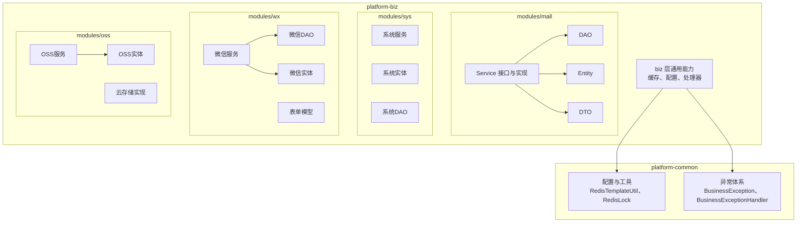
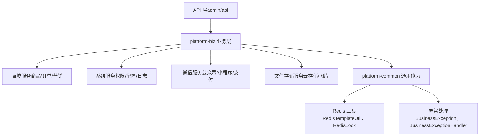
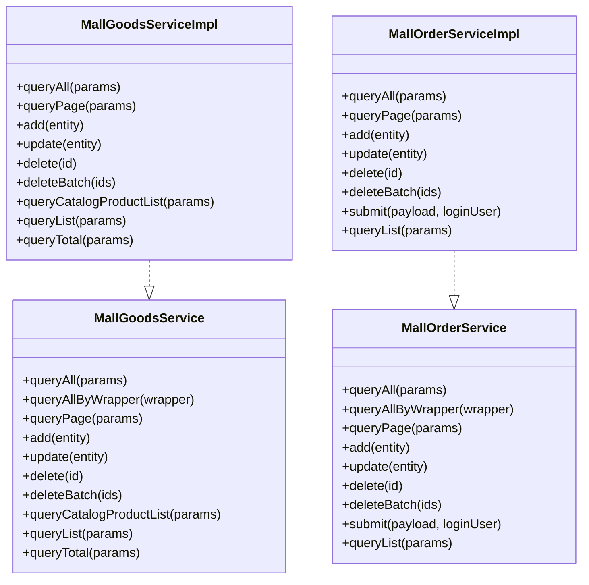
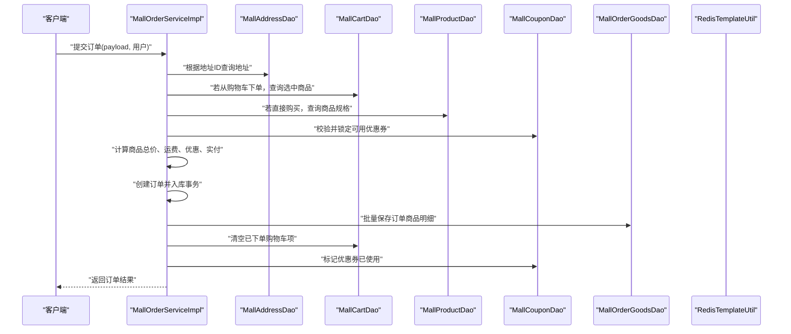
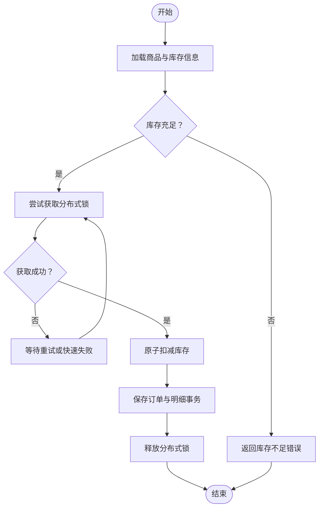
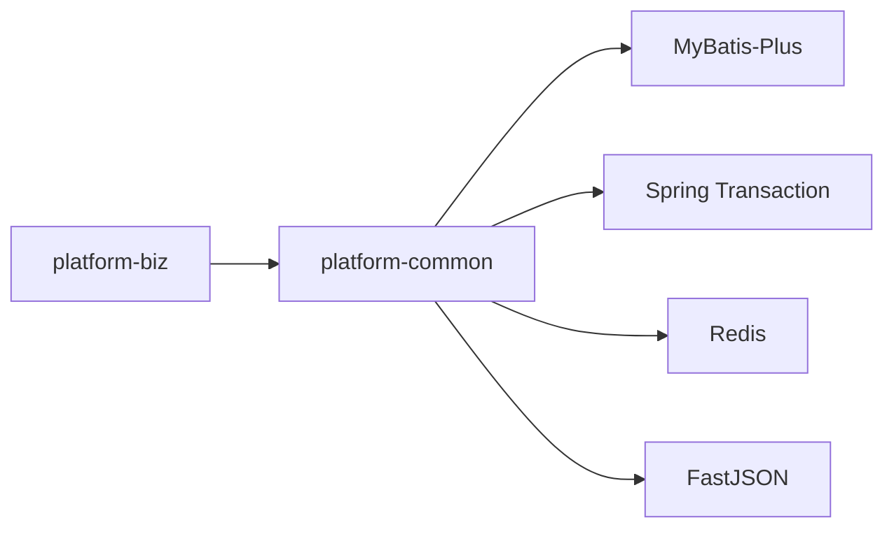

# 业务逻辑模块 (platform-biz)

<cite>
**本文引用的文件**
- [pom.xml](file://platform-biz/pom.xml)
- [MallGoodsService.java](file://platform-biz/src/main/java/com/platform/modules/mall/service/MallGoodsService.java)
- [MallGoodsServiceImpl.java](file://platform-biz/src/main/java/com/platform/modules/mall/service/impl/MallGoodsServiceImpl.java)
- [MallOrderService.java](file://platform-biz/src/main/java/com/platform/modules/mall/service/MallOrderService.java)
- [MallOrderServiceImpl.java](file://platform-biz/src/main/java/com/platform/modules/mall/service/impl/MallOrderServiceImpl.java)
- [BuyGoodsRequest.java](file://platform-biz/src/main/java/com/platform/modules/mall/dto/BuyGoodsRequest.java)
- [GoodsAggregateDTO.java](file://platform-biz/src/main/java/com/platform/modules/mall/dto/GoodsAggregateDTO.java)
- [RedisTemplateUtil.java](file://platform-common/src/main/java/com/platform/config/RedisTemplateUtil.java)
- [RedisLock.java](file://platform-common/src/main/java/com/platform/config/RedisLock.java)
- [BusinessException.java](file://platform-common/src/main/java/com/platform/common/exception/BusinessException.java)
- [BusinessExceptionHandler.java](file://platform-common/src/main/java/com/platform/common/exception/BusinessExceptionHandler.java)
</cite>

## 目录
1. [引言](#引言)
2. [项目结构](#项目结构)
3. [核心组件](#核心组件)
4. [架构总览](#架构总览)
5. [详细组件分析](#详细组件分析)
6. [依赖分析](#依赖分析)
7. [性能考虑](#性能考虑)
8. [故障排查指南](#故障排查指南)
9. [结论](#结论)
10. [附录](#附录)

## 引言
本文件面向平台业务逻辑模块（platform-biz）的开发者与维护者，系统性梳理该模块在平台中的定位与职责：作为核心业务处理层，承接前端请求与系统管理端的调用，完成业务编排、数据聚合、事务控制与跨模块协作。文档重点覆盖以下方面：
- 业务服务层组织：service 接口与 impl 实现、事务管理策略
- 四大业务域设计：商城业务（商品、订单、用户、营销）、系统管理（权限、配置、日志）、微信业务（公众号、小程序、支付）、文件存储（云存储、图片处理）
- 关键业务流程：下单流程、支付处理、库存管理、消息推送
- 数据传输对象（DTO）设计、业务规则校验、异常处理机制
- 高级特性：缓存策略、异步处理、分布式锁
- 开发最佳实践与常见问题排查

## 项目结构
platform-biz 采用按“领域+层次”的混合组织方式：
- modules/mall：商城业务域，包含 DAO、Entity、Service 接口与实现、DTO、支持类
- modules/sys：系统管理域（权限、字典、配置、日志等）
- modules/wx：微信业务域（公众号、小程序、支付、模板消息等）
- modules/oss：文件存储域（云存储、图片处理）
- config、cache、common、handler：通用支撑能力（缓存、配置、公共工具、处理器）

图表来源
- [MallGoodsService.java:1-99](file://platform-biz/src/main/java/com/platform/modules/mall/service/MallGoodsService.java#L1-L99)
- [MallOrderService.java:1-102](file://platform-biz/src/main/java/com/platform/modules/mall/service/MallOrderService.java#L1-L102)
- [RedisTemplateUtil.java](file://platform-common/src/main/java/com/platform/config/RedisTemplateUtil.java)
- [RedisLock.java](file://platform-common/src/main/java/com/platform/config/RedisLock.java)
- [BusinessException.java](file://platform-common/src/main/java/com/platform/common/exception/BusinessException.java)
- [BusinessExceptionHandler.java](file://platform-common/src/main/java/com/platform/common/exception/BusinessExceptionHandler.java)

章节来源
- [pom.xml:1-32](file://platform-biz/pom.xml#L1-L32)

## 核心组件
- 服务接口与实现：遵循 MyBatis-Plus IService/ServiceImpl 模式，统一提供 CRUD、分页、条件查询能力；具体业务在实现类中编排。
- DTO 设计：用于接收前端或跨模块的数据传输，如购买请求、商品聚合信息等。
- 事务管理：通过注解式声明在关键业务流程上启用事务，确保一致性。
- 缓存与分布式锁：基于 Redis 的通用工具类提供缓存读写与分布式互斥能力。

章节来源
- [MallGoodsService.java:1-99](file://platform-biz/src/main/java/com/platform/modules/mall/service/MallGoodsService.java#L1-L99)
- [MallGoodsServiceImpl.java:1-99](file://platform-biz/src/main/java/com/platform/modules/mall/service/impl/MallGoodsServiceImpl.java#L1-L99)
- [MallOrderService.java:1-102](file://platform-biz/src/main/java/com/platform/modules/mall/service/MallOrderService.java#L1-L102)
- [MallOrderServiceImpl.java:1-273](file://platform-biz/src/main/java/com/platform/modules/mall/service/impl/MallOrderServiceImpl.java#L1-L273)
- [BuyGoodsRequest.java](file://platform-biz/src/main/java/com/platform/modules/mall/dto/BuyGoodsRequest.java)
- [GoodsAggregateDTO.java](file://platform-biz/src/main/java/com/platform/modules/mall/dto/GoodsAggregateDTO.java)
- [RedisTemplateUtil.java](file://platform-common/src/main/java/com/platform/config/RedisTemplateUtil.java)
- [RedisLock.java](file://platform-common/src/main/java/com/platform/config/RedisLock.java)

## 架构总览
platform-biz 作为业务编排中心，向上承接 API 层调用，向下依赖 DAO 与通用组件，围绕四大业务域进行能力封装与组合。

图表来源
- [MallOrderServiceImpl.java:126-266](file://platform-biz/src/main/java/com/platform/modules/mall/service/impl/MallOrderServiceImpl.java#L126-L266)
- [RedisTemplateUtil.java](file://platform-common/src/main/java/com/platform/config/RedisTemplateUtil.java)
- [BusinessException.java](file://platform-common/src/main/java/com/platform/common/exception/BusinessException.java)

## 详细组件分析

### 商城业务域（商品、订单、购物车、营销等）
- 商品服务：提供商品列表、分页、新增、更新、删除、统计等能力，实现类基于 MyBatis-Plus 的 ServiceImpl。
- 订单服务：负责订单提交、状态流转、金额计算、优惠券使用、订单商品明细落库等，关键流程在实现类中以事务包裹。

图表来源
- [MallGoodsService.java:1-99](file://platform-biz/src/main/java/com/platform/modules/mall/service/MallGoodsService.java#L1-L99)
- [MallGoodsServiceImpl.java:1-99](file://platform-biz/src/main/java/com/platform/modules/mall/service/impl/MallGoodsServiceImpl.java#L1-L99)
- [MallOrderService.java:1-102](file://platform-biz/src/main/java/com/platform/modules/mall/service/MallOrderService.java#L1-L102)
- [MallOrderServiceImpl.java:1-273](file://platform-biz/src/main/java/com/platform/modules/mall/service/impl/MallOrderServiceImpl.java#L1-L273)

章节来源
- [MallGoodsService.java:1-99](file://platform-biz/src/main/java/com/platform/modules/mall/service/MallGoodsService.java#L1-L99)
- [MallGoodsServiceImpl.java:1-99](file://platform-biz/src/main/java/com/platform/modules/mall/service/impl/MallGoodsServiceImpl.java#L1-L99)
- [MallOrderService.java:1-102](file://platform-biz/src/main/java/com/platform/modules/mall/service/MallOrderService.java#L1-L102)
- [MallOrderServiceImpl.java:1-273](file://platform-biz/src/main/java/com/platform/modules/mall/service/impl/MallOrderServiceImpl.java#L1-L273)

#### 下单流程（序列图）

图表来源
- [MallOrderServiceImpl.java:126-266](file://platform-biz/src/main/java/com/platform/modules/mall/service/impl/MallOrderServiceImpl.java#L126-L266)
- [RedisTemplateUtil.java](file://platform-common/src/main/java/com/platform/config/RedisTemplateUtil.java)

章节来源
- [MallOrderServiceImpl.java:126-266](file://platform-biz/src/main/java/com/platform/modules/mall/service/impl/MallOrderServiceImpl.java#L126-L266)

#### 库存与分布式锁（流程图）

图表来源
- [RedisLock.java](file://platform-common/src/main/java/com/platform/config/RedisLock.java)

章节来源
- [RedisLock.java](file://platform-common/src/main/java/com/platform/config/RedisLock.java)

### 系统管理模块（权限、配置、日志）
- 权限与字典：提供角色、菜单、字典项等管理能力，通常由 sys 服务域提供接口与实现。
- 配置管理：集中化配置读取与变更，结合缓存提升访问性能。
- 日志审计：记录操作日志、登录日志、异常日志，便于追踪与审计。

章节来源
- [MallGoodsService.java:1-99](file://platform-biz/src/main/java/com/platform/modules/mall/service/MallGoodsService.java#L1-L99)
- [MallOrderService.java:1-102](file://platform-biz/src/main/java/com/platform/modules/mall/service/MallOrderService.java#L1-L102)

### 微信业务模块（公众号、小程序、支付）
- 公众号与小程序：用户授权、消息模板、内容解析与下发。
- 支付集成：统一下单、支付回调、对账与退款处理。
- 表单模型：针对微信交互的数据结构封装，便于参数校验与转换。

章节来源
- [MallOrderService.java:1-102](file://platform-biz/src/main/java/com/platform/modules/mall/service/MallOrderService.java#L1-L102)
- [MallOrderServiceImpl.java:1-273](file://platform-biz/src/main/java/com/platform/modules/mall/service/impl/MallOrderServiceImpl.java#L1-L273)

### 文件存储模块（云存储、图片处理）
- 云存储：上传、下载、删除、URL 生成与过期控制。
- 图片处理：缩略图、水印、格式转换、压缩等。

章节来源
- [MallGoodsService.java:1-99](file://platform-biz/src/main/java/com/platform/modules/mall/service/MallGoodsService.java#L1-L99)
- [MallOrderService.java:1-102](file://platform-biz/src/main/java/com/platform/modules/mall/service/MallOrderService.java#L1-L102)

## 依赖分析
- 依赖关系：platform-biz 仅依赖 platform-common，避免循环依赖，保持清晰的边界。
- 外部依赖：MyBatis-Plus、Spring Transaction、Redis、FastJSON 等。

图表来源
- [pom.xml:24-30](file://platform-biz/pom.xml#L24-L30)
- [MallOrderServiceImpl.java:21-37](file://platform-biz/src/main/java/com/platform/modules/mall/service/impl/MallOrderServiceImpl.java#L21-L37)

章节来源
- [pom.xml:1-32](file://platform-biz/pom.xml#L1-L32)

## 性能考虑
- 事务范围：将跨表写入与状态变更放入同一事务，减少不一致风险；同时避免在事务内执行耗时操作（IO、远程调用）。
- 缓存策略：热点数据（商品详情、配置项）使用 Redis 缓存；结合版本号或过期时间避免脏读。
- 分布式锁：在高并发场景下对关键资源（库存、优惠券）加锁，保证原子性。
- 分页查询：统一设置排序字段与分页参数，避免全表扫描。
- DTO 聚合：减少多次网络往返，合并查询结果到 DTO，降低 N+1 查询风险。

## 故障排查指南
- 业务异常：通过 BusinessException 抛出语义化错误，配合 BusinessExceptionHandler 统一处理，避免泄露内部细节。
- 参数校验：在服务层对关键参数进行前置校验，如用户身份、订单状态、库存数量等。
- 事务回滚：确认异常类型是否触发回滚（默认受检异常），必要时显式指定 rollbackFor。
- 缓存一致性：写操作后及时失效或更新缓存；读多写少场景可引入缓存双写策略。
- 幂等设计：对重复提交（如支付回调）进行幂等判断，避免重复记账。

章节来源
- [BusinessException.java](file://platform-common/src/main/java/com/platform/common/exception/BusinessException.java)
- [BusinessExceptionHandler.java](file://platform-common/src/main/java/com/platform/common/exception/BusinessExceptionHandler.java)
- [MallOrderServiceImpl.java:126-266](file://platform-biz/src/main/java/com/platform/modules/mall/service/impl/MallOrderServiceImpl.java#L126-L266)

## 结论
platform-biz 以清晰的领域划分与规范的服务层设计，实现了业务编排、事务治理与跨域协作。通过 DTO、缓存与分布式锁等手段，兼顾了扩展性与稳定性。建议在新功能开发中遵循现有模式：接口抽象、实现收敛、事务边界明确、异常统一处理，并结合缓存与分布式锁保障高并发下的正确性与性能。

## 附录
- 开发最佳实践
  - 优先使用 IService/ServiceImpl 模板方法，自定义复杂逻辑集中在实现类
  - 对外暴露的 DTO 保持稳定，内部实体与 DTO 解耦
  - 事务方法尽量短小，避免长事务占用数据库资源
  - 使用 Redis 进行读多写少场景的性能优化，注意缓存更新策略
  - 对关键资源使用 RedisLock，防止超卖与并发冲突
- 常见问题
  - 未开启事务导致部分写入失败：检查方法是否标注 @Transactional
  - 缓存未更新导致脏读：在写操作后主动失效或更新缓存
  - 幂等性缺失导致重复处理：引入幂等键与状态机