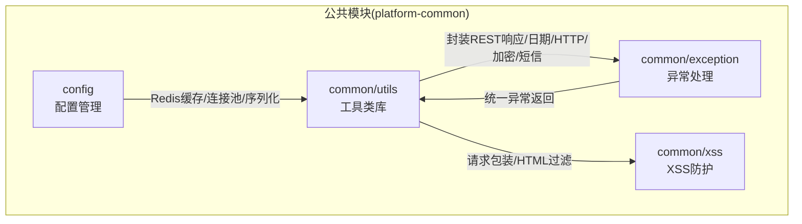
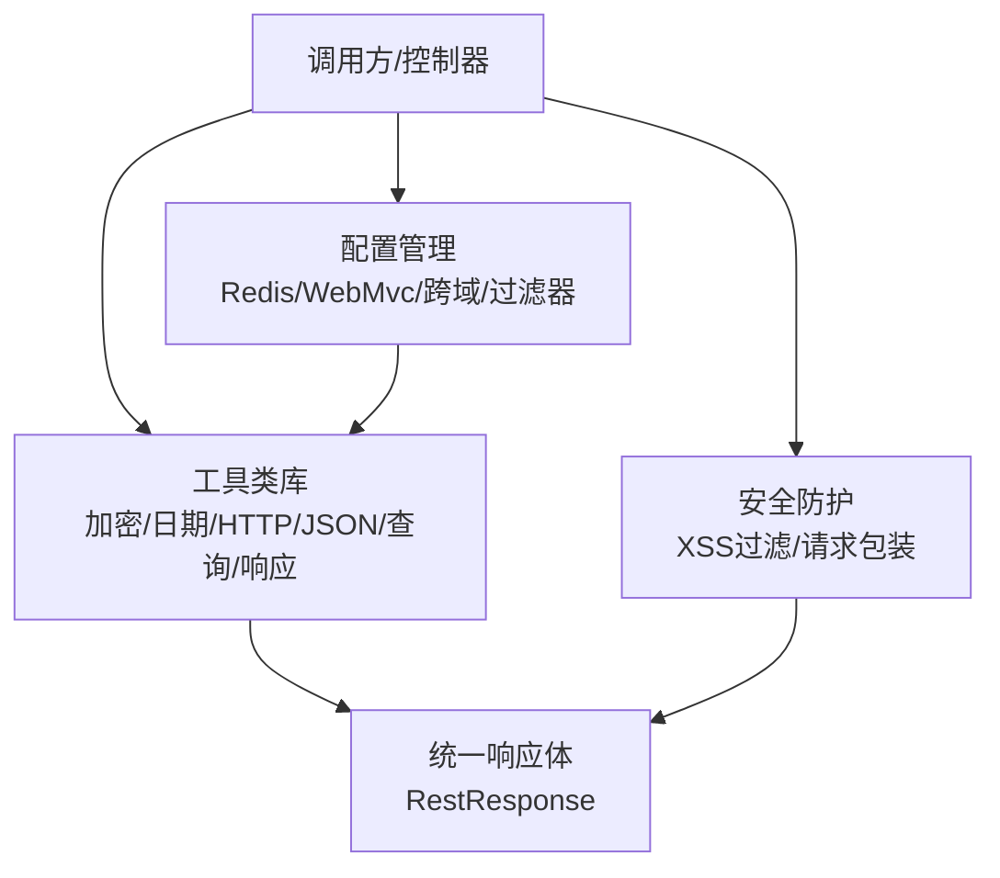
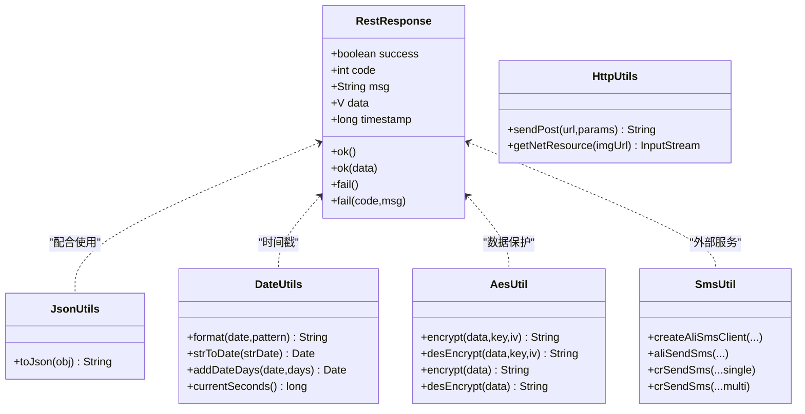
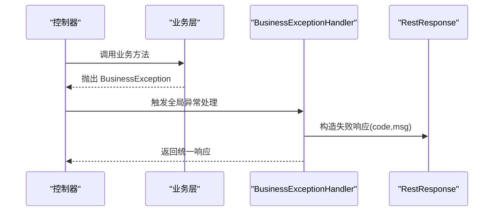
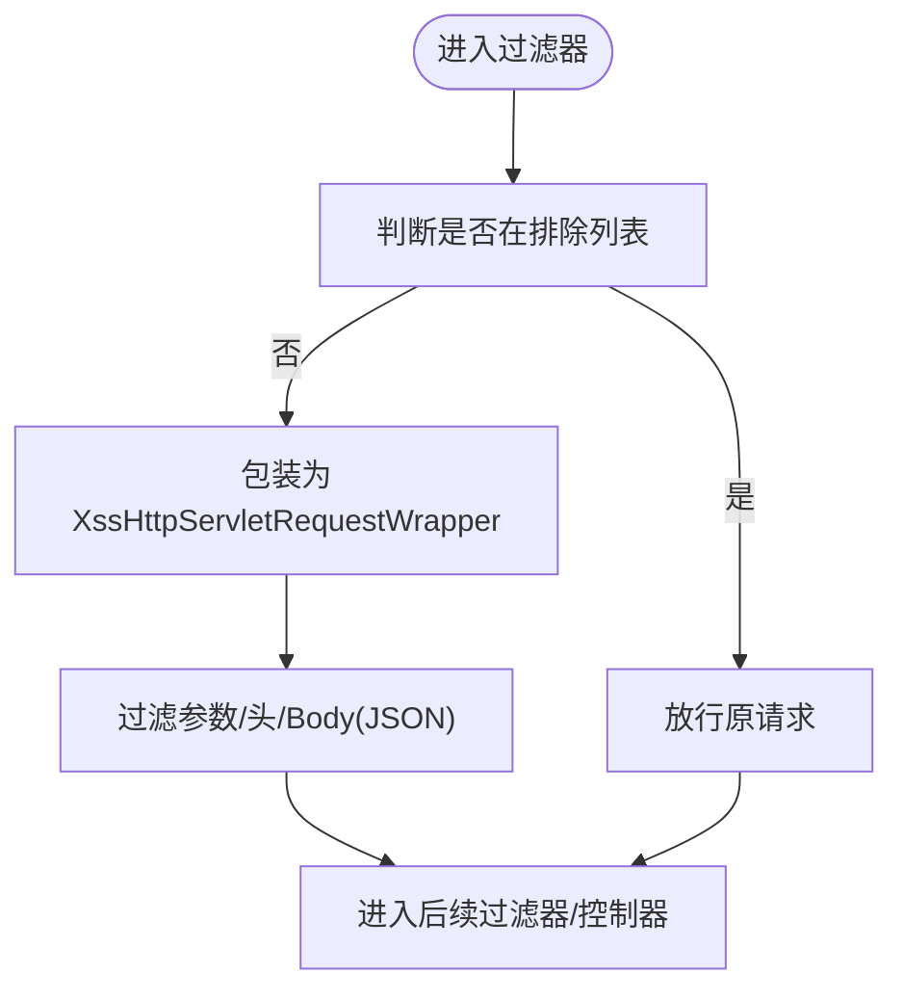
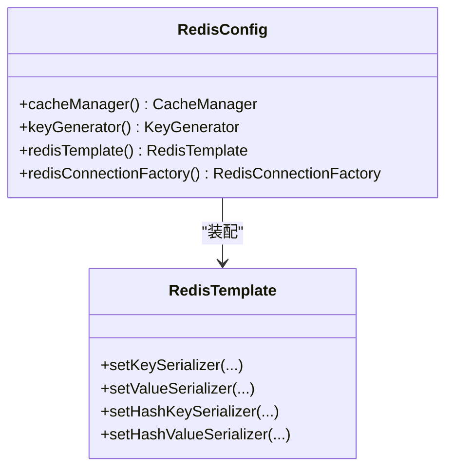
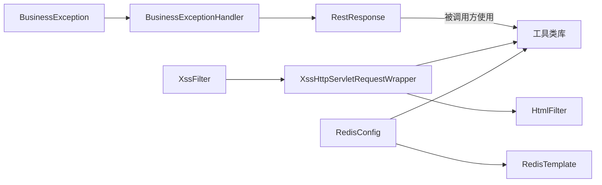

# 公共模块（platform-common）

<cite>
**本文引用的文件**
- [Constant.java](file://platform-common/src/main/java/com/platform/common/utils/Constant.java)
- [BusinessException.java](file://platform-common/src/main/java/com/platform/common/exception/BusinessException.java)
- [BusinessExceptionHandler.java](file://platform-common/src/main/java/com/platform/common/exception/BusinessExceptionHandler.java)
- [RestResponse.java](file://platform-common/src/main/java/com/platform/common/utils/RestResponse.java)
- [JsonUtils.java](file://platform-common/src/main/java/com/platform/common/utils/JsonUtils.java)
- [HttpUtils.java](file://platform-common/src/main/java/com/platform/common/utils/HttpUtils.java)
- [DateUtils.java](file://platform-common/src/main/java/com/platform/common/utils/DateUtils.java)
- [AesUtil.java](file://platform-common/src/main/java/com/platform/common/utils/AesUtil.java)
- [SmsUtil.java](file://platform-common/src/main/java/com/platform/common/utils/SmsUtil.java)
- [XssFilter.java](file://platform-common/src/main/java/com/platform/common/xss/XssFilter.java)
- [XssHttpServletRequestWrapper.java](file://platform-common/src/main/java/com/platform/common/xss/XssHttpServletRequestWrapper.java)
- [HtmlFilter.java](file://platform-common/src/main/java/com/platform/common/xss/HtmlFilter.java)
- [RedisConfig.java](file://platform-common/src/main/java/com/platform/config/RedisConfig.java)
</cite>

## 目录
1. [简介](#简介)
2. [项目结构](#项目结构)
3. [核心组件](#核心组件)
4. [架构总览](#架构总览)
5. [组件详解](#组件详解)
6. [依赖关系分析](#依赖关系分析)
7. [性能考量](#性能考量)
8. [故障排查指南](#故障排查指南)
9. [结论](#结论)
10. [附录](#附录)

## 简介
本文件面向平台公共模块（platform-common），聚焦于基础设施层的设计与实现，系统性梳理工具类库、异常处理机制、配置管理、安全防护（XSS、SQL 注入、参数校验）、扩展能力（定时任务、邮件、短信）等主题，帮助开发者快速理解与高效复用。

## 项目结构
公共模块以“工具类库 + 异常处理 + 安全防护 + 配置管理”为主线组织，采用按职责分包的方式：
- common/utils：通用工具类（加密、日期、HTTP、JSON、查询条件、响应封装等）
- common/exception：统一异常模型与全局异常处理器
- common/xss：XSS 过滤链路与请求包装器
- config：Redis 缓存、跨域、WebMvc、过滤器等基础设施配置

图表来源
- [Constant.java:26-240](file://platform-common/src/main/java/com/platform/common/utils/Constant.java#L26-L240)
- [RestResponse.java:34-122](file://platform-common/src/main/java/com/platform/common/utils/RestResponse.java#L34-L122)
- [RedisConfig.java:56-182](file://platform-common/src/main/java/com/platform/config/RedisConfig.java#L56-L182)

章节来源
- [Constant.java:26-240](file://platform-common/src/main/java/com/platform/common/utils/Constant.java#L26-L240)
- [RestResponse.java:34-122](file://platform-common/src/main/java/com/platform/common/utils/RestResponse.java#L34-L122)
- [RedisConfig.java:56-182](file://platform-common/src/main/java/com/platform/config/RedisConfig.java#L56-L182)

## 核心组件
- 工具类库：封装常用数据处理、加密解密、日期时间、HTTP 请求、JSON 序列化、查询条件、响应体、令牌生成等能力，统一对外输出格式。
- 异常处理：定义业务异常类型，提供全局异常处理器，覆盖常见运行时异常、参数异常、鉴权异常、微信错误等，统一返回 RestResponse 结构。
- 安全防护：内置 XSS 过滤器与请求包装器，结合 HTML 过滤器实现对请求参数、头、Body 的清洗；提供 SQL 注入防护入口与参数校验建议。
- 配置管理：提供 Redis 缓存配置（连接工厂、序列化策略、缓存管理器、Key 生成器），支持跨域、WebMvc、过滤器等基础设施配置。

章节来源
- [BusinessException.java:28-74](file://platform-common/src/main/java/com/platform/common/exception/BusinessException.java#L28-L74)
- [BusinessExceptionHandler.java:36-100](file://platform-common/src/main/java/com/platform/common/exception/BusinessExceptionHandler.java#L36-L100)
- [XssFilter.java:30-63](file://platform-common/src/main/java/com/platform/common/xss/XssFilter.java#L30-L63)
- [XssHttpServletRequestWrapper.java:41-167](file://platform-common/src/main/java/com/platform/common/xss/XssHttpServletRequestWrapper.java#L41-L167)

## 架构总览
公共模块通过“工具类 + 异常处理 + 安全防护 + 配置”的组合，向上游各子系统提供稳定、可复用的基础能力，并通过统一的响应体与异常处理降低接口耦合度。

图表来源
- [RestResponse.java:34-122](file://platform-common/src/main/java/com/platform/common/utils/RestResponse.java#L34-L122)
- [RedisConfig.java:56-182](file://platform-common/src/main/java/com/platform/config/RedisConfig.java#L56-L182)
- [XssFilter.java:30-63](file://platform-common/src/main/java/com/platform/common/xss/XssFilter.java#L30-L63)

## 组件详解

### 工具类库
- 响应封装：统一 success/code/msg/data/timestamp 字段，提供 ok()/fail() 多种静态构造方法，便于控制器快速返回标准结构。
- JSON 工具：基于 Gson 提供美化打印的 JSON 序列化能力。
- HTTP 工具：提供基于 Apache HttpClient 的 POST 请求与网络资源流读取能力。
- 日期工具：支持多种日期格式识别、格式化、加减运算、周/月区间计算、当前时间戳等。
- 加密工具：基于 AES/CBC 实现对称加解密，默认密钥与偏移量，支持自定义密钥/向量。
- 短信工具：集成阿里云与腾讯云短信客户端，支持单发/群发、模板参数、签名等。
- 查询条件：提供 Query 类用于构建分页与排序参数。
- 常量与枚举：集中定义系统常量、缓存前缀、定时任务状态、云厂商/短信供应商枚举等。

图表来源
- [RestResponse.java:34-122](file://platform-common/src/main/java/com/platform/common/utils/RestResponse.java#L34-L122)
- [JsonUtils.java:27-35](file://platform-common/src/main/java/com/platform/common/utils/JsonUtils.java#L27-L35)
- [HttpUtils.java:18-53](file://platform-common/src/main/java/com/platform/common/utils/HttpUtils.java#L18-L53)
- [DateUtils.java:40-413](file://platform-common/src/main/java/com/platform/common/utils/DateUtils.java#L40-L413)
- [AesUtil.java:33-126](file://platform-common/src/main/java/com/platform/common/utils/AesUtil.java#L33-L126)
- [SmsUtil.java:39-176](file://platform-common/src/main/java/com/platform/common/utils/SmsUtil.java#L39-L176)

章节来源
- [RestResponse.java:34-122](file://platform-common/src/main/java/com/platform/common/utils/RestResponse.java#L34-L122)
- [JsonUtils.java:27-35](file://platform-common/src/main/java/com/platform/common/utils/JsonUtils.java#L27-L35)
- [HttpUtils.java:18-53](file://platform-common/src/main/java/com/platform/common/utils/HttpUtils.java#L18-L53)
- [DateUtils.java:40-413](file://platform-common/src/main/java/com/platform/common/utils/DateUtils.java#L40-L413)
- [AesUtil.java:33-126](file://platform-common/src/main/java/com/platform/common/utils/AesUtil.java#L33-L126)
- [SmsUtil.java:39-176](file://platform-common/src/main/java/com/platform/common/utils/SmsUtil.java#L39-L176)
- [Constant.java:26-240](file://platform-common/src/main/java/com/platform/common/utils/Constant.java#L26-L240)

### 异常处理机制
- 自定义异常：BusinessException 支持消息、状态码、Throwable 构造，便于语义化抛出业务错误。
- 全局异常处理器：BusinessExceptionHandler 统一拦截业务异常、参数异常、路径不存在、重复键、鉴权异常、微信错误等，返回 RestResponse 标准结构。
- 错误码规范：统一使用 RestResponse.FAIL_CODE 作为失败状态码，业务异常可自定义 code。
- 异常信息国际化：当前实现未包含 i18n，可在处理器中扩展根据 Locale 或 Header 切换本地化消息。

图表来源
- [BusinessException.java:28-74](file://platform-common/src/main/java/com/platform/common/exception/BusinessException.java#L28-L74)
- [BusinessExceptionHandler.java:36-100](file://platform-common/src/main/java/com/platform/common/exception/BusinessExceptionHandler.java#L36-L100)
- [RestResponse.java:34-122](file://platform-common/src/main/java/com/platform/common/utils/RestResponse.java#L34-L122)

章节来源
- [BusinessException.java:28-74](file://platform-common/src/main/java/com/platform/common/exception/BusinessException.java#L28-L74)
- [BusinessExceptionHandler.java:36-100](file://platform-common/src/main/java/com/platform/common/exception/BusinessExceptionHandler.java#L36-L100)
- [RestResponse.java:34-122](file://platform-common/src/main/java/com/platform/common/utils/RestResponse.java#L34-L122)

### 安全防护
- XSS 防护：XssFilter 在 doFilter 中对非排除路径的请求进行包装，XssHttpServletRequestWrapper 对请求参数、头、Body（JSON）进行 HTML 过滤，避免脚本注入。
- SQL 注入防护：提供 AntiSqlInjectionFilter 类型文件，建议在过滤器链中启用；参数校验建议结合 Bean Validation 使用。
- 参数校验：建议在控制器层使用注解（如 @Valid、@NotNull 等）进行参数合法性校验，结合全局异常处理器统一返回。

图表来源
- [XssFilter.java:30-63](file://platform-common/src/main/java/com/platform/common/xss/XssFilter.java#L30-L63)
- [XssHttpServletRequestWrapper.java:41-167](file://platform-common/src/main/java/com/platform/common/xss/XssHttpServletRequestWrapper.java#L41-L167)
- [HtmlFilter.java](file://platform-common/src/main/java/com/platform/common/xss/HtmlFilter.java)

章节来源
- [XssFilter.java:30-63](file://platform-common/src/main/java/com/platform/common/xss/XssFilter.java#L30-L63)
- [XssHttpServletRequestWrapper.java:41-167](file://platform-common/src/main/java/com/platform/common/xss/XssHttpServletRequestWrapper.java#L41-L167)

### 配置管理
- Redis 缓存：RedisConfig 提供连接工厂、序列化策略（Key/String，Value/Jackson2Json）、缓存管理器、Key 生成器，支持单机模式，具备良好的扩展性。
- WebMvc/跨域/过滤器：提供 WebConfigurer、CorsConfig、FilterConfig 等配置类，用于注册拦截器、开放跨域、注册过滤器链等。

图表来源
- [RedisConfig.java:56-182](file://platform-common/src/main/java/com/platform/config/RedisConfig.java#L56-L182)

章节来源
- [RedisConfig.java:56-182](file://platform-common/src/main/java/com/platform/config/RedisConfig.java#L56-L182)

## 依赖关系分析
- 工具类之间低耦合：工具类主要依赖 JDK 与第三方库（Apache HttpClient、Gson、Joda-Time、Commons Codec 等），彼此独立，便于按需引入。
- 异常处理与工具类协作：异常处理器依赖 RestResponse 输出统一结构，工具类为异常处理提供上下文（如时间戳、消息）。
- 安全防护与工具类协作：XSS 包装器依赖 HtmlFilter 进行内容清洗，同时与 HTTP 工具配合处理 JSON Body。
- 配置与工具类协作：RedisConfig 为工具类提供缓存能力，工具类通过 RedisTemplate 使用缓存。

图表来源
- [BusinessException.java:28-74](file://platform-common/src/main/java/com/platform/common/exception/BusinessException.java#L28-L74)
- [BusinessExceptionHandler.java:36-100](file://platform-common/src/main/java/com/platform/common/exception/BusinessExceptionHandler.java#L36-L100)
- [RestResponse.java:34-122](file://platform-common/src/main/java/com/platform/common/utils/RestResponse.java#L34-L122)
- [XssFilter.java:30-63](file://platform-common/src/main/java/com/platform/common/xss/XssFilter.java#L30-L63)
- [XssHttpServletRequestWrapper.java:41-167](file://platform-common/src/main/java/com/platform/common/xss/XssHttpServletRequestWrapper.java#L41-L167)
- [HtmlFilter.java](file://platform-common/src/main/java/com/platform/common/xss/HtmlFilter.java)
- [RedisConfig.java:56-182](file://platform-common/src/main/java/com/platform/config/RedisConfig.java#L56-L182)

章节来源
- [BusinessException.java:28-74](file://platform-common/src/main/java/com/platform/common/exception/BusinessException.java#L28-L74)
- [BusinessExceptionHandler.java:36-100](file://platform-common/src/main/java/com/platform/common/exception/BusinessExceptionHandler.java#L36-L100)
- [RestResponse.java:34-122](file://platform-common/src/main/java/com/platform/common/utils/RestResponse.java#L34-L122)
- [XssFilter.java:30-63](file://platform-common/src/main/java/com/platform/common/xss/XssFilter.java#L30-L63)
- [XssHttpServletRequestWrapper.java:41-167](file://platform-common/src/main/java/com/platform/common/xss/XssHttpServletRequestWrapper.java#L41-L167)
- [RedisConfig.java:56-182](file://platform-common/src/main/java/com/platform/config/RedisConfig.java#L56-L182)

## 性能考量
- JSON 序列化：JsonUtils 使用 Gson，适合结构化数据；对于超大对象建议评估分页或压缩策略。
- HTTP 请求：HttpUtils 基于 Apache HttpClient，注意连接池与超时配置，避免阻塞与资源泄露。
- 日期处理：DateUtils 使用 Joda-Time，性能良好；复杂格式匹配建议预编译正则或缓存解析规则。
- 加密解密：AES/CBC 模式加解密开销可控，建议在高并发场景下复用 Cipher 实例或使用连接池。
- Redis 缓存：RedisConfig 已配置序列化与连接池，建议结合业务热点数据设置 TTL 与淘汰策略，避免内存压力。

## 故障排查指南
- 统一异常返回：优先查看 BusinessExceptionHandler 的返回结构，确认 code/msg/data 是否符合预期。
- XSS 过滤问题：若出现参数丢失或异常，检查 XssFilter 排除路径与 XssHttpServletRequestWrapper 的过滤逻辑。
- Redis 连接异常：核对 RedisConfig 中 host/port/password/database 与连接池配置，确认网络连通性。
- 短信发送失败：核对 SmsUtil 的 AK/SK、签名、模板 ID、目标号码与参数格式，关注第三方返回码。
- 参数校验失败：在控制器层添加 @Valid 与 @Validated，结合全局异常处理器定位具体字段。

章节来源
- [BusinessExceptionHandler.java:36-100](file://platform-common/src/main/java/com/platform/common/exception/BusinessExceptionHandler.java#L36-L100)
- [XssFilter.java:30-63](file://platform-common/src/main/java/com/platform/common/xss/XssFilter.java#L30-L63)
- [XssHttpServletRequestWrapper.java:41-167](file://platform-common/src/main/java/com/platform/common/xss/XssHttpServletRequestWrapper.java#L41-L167)
- [RedisConfig.java:56-182](file://platform-common/src/main/java/com/platform/config/RedisConfig.java#L56-L182)
- [SmsUtil.java:39-176](file://platform-common/src/main/java/com/platform/common/utils/SmsUtil.java#L39-L176)

## 结论
platform-common 通过标准化的工具类、统一的异常处理、完善的配置管理与安全防护，为上层业务提供了高内聚、低耦合的基础设施。开发者可基于此模块快速扩展新功能，同时保持接口一致性与安全性。

## 附录
- 常量与枚举：建议在新增配置项时，遵循 Constant 的命名风格与前缀规范，便于集中管理与检索。
- 扩展建议：对于定时任务、邮件服务等，可参考现有配置与工具类的组织方式，新增对应配置类与工具类，确保与公共模块风格一致。