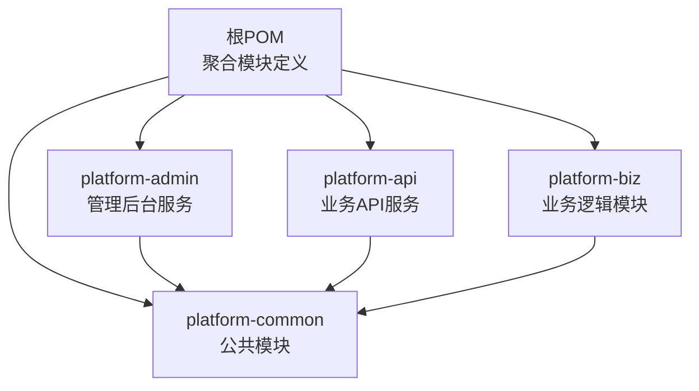
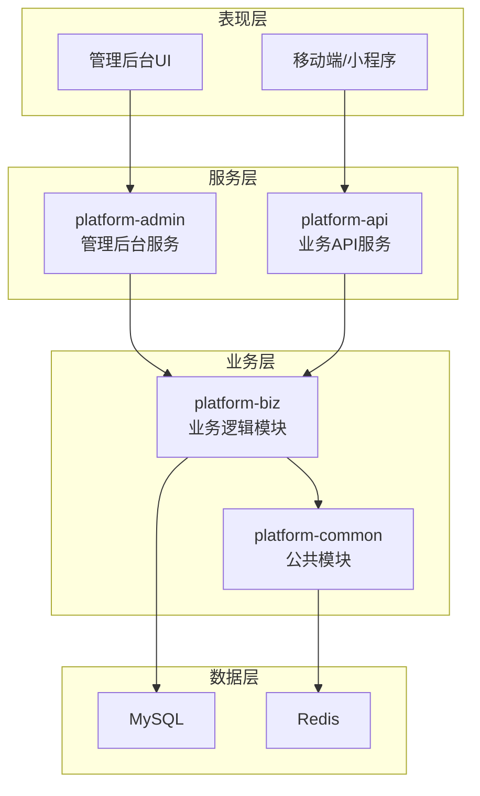
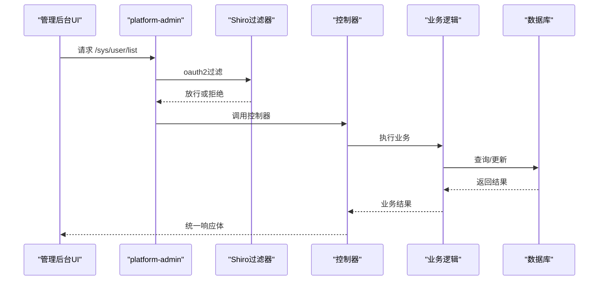
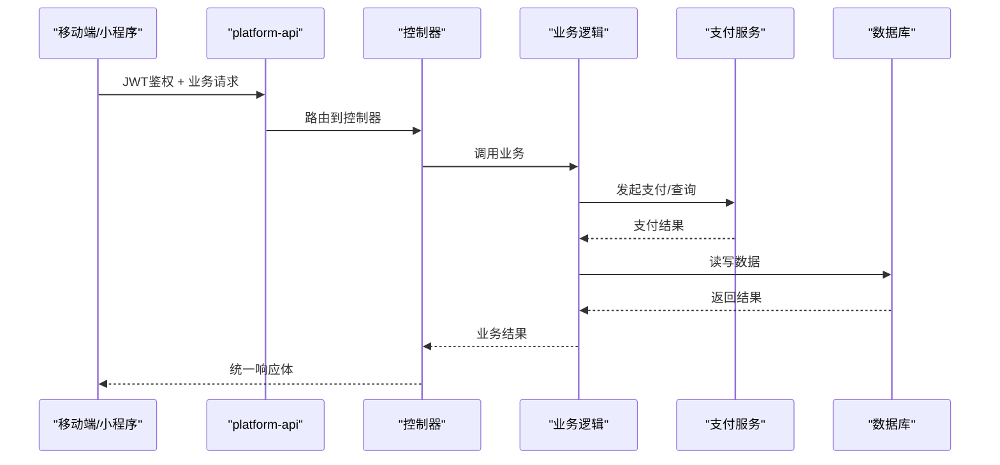
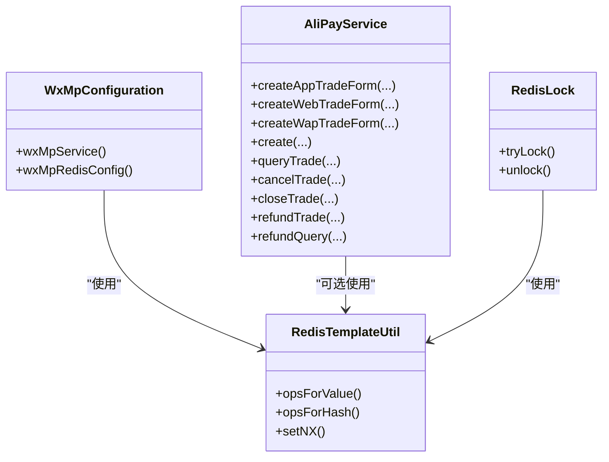
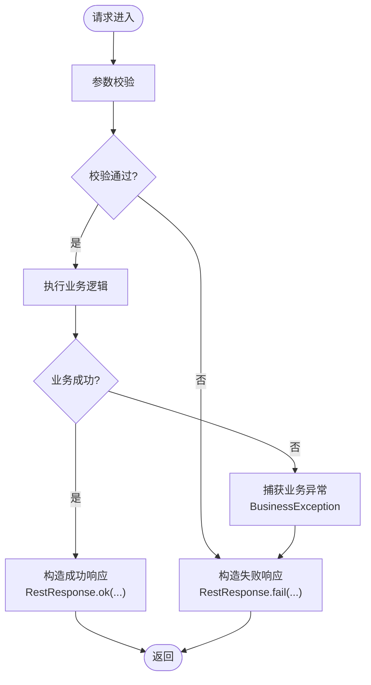
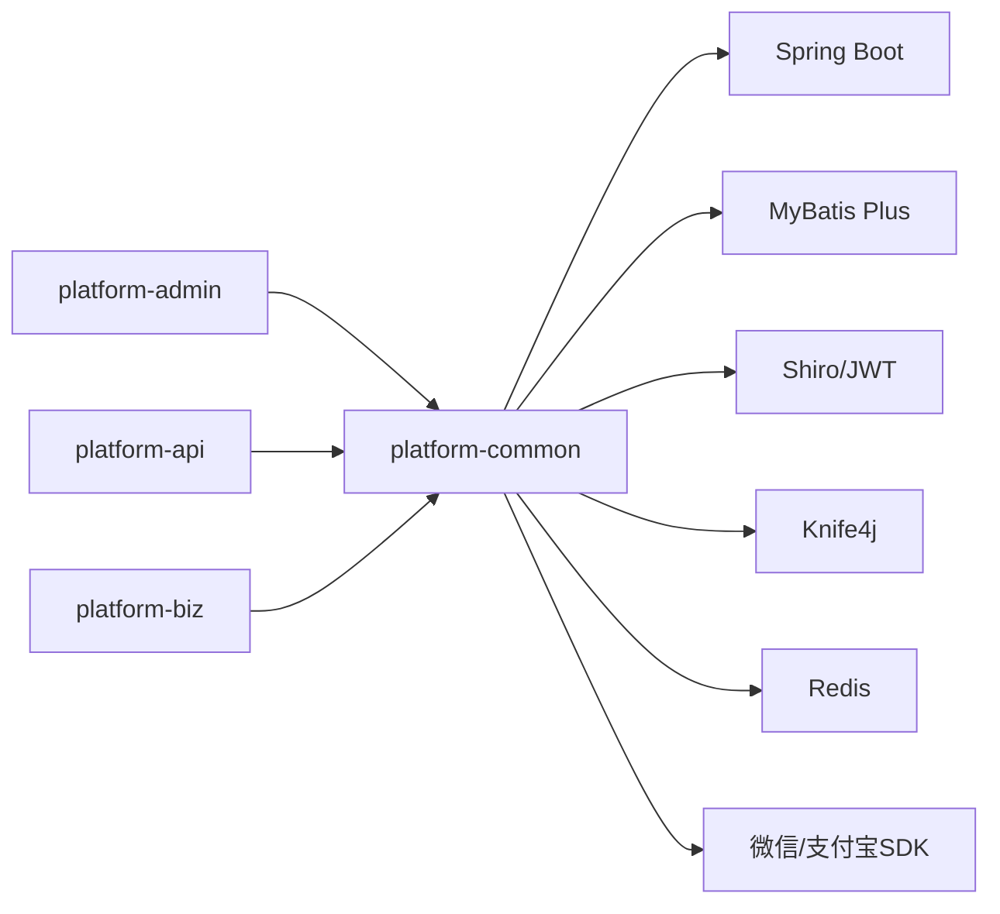

# 后端服务架构

<cite>
**本文引用的文件**
- [根POM](file://pom.xml)
- [平台聚合工程说明](file://README.md)
- [平台管理服务启动类](file://platform-admin/src/main/java/com/platform/PlatformAdminApplication.java)
- [平台API服务启动类](file://platform-api/src/main/java/com/platform/PlatformApiApplication.java)
- [平台管理服务配置](file://platform-admin/src/main/resources/application.yml)
- [平台API服务配置](file://platform-api/src/main/resources/application.yml)
- [平台公共模块POM](file://platform-common/pom.xml)
- [平台业务模块POM](file://platform-biz/pom.xml)
- [平台公共响应封装](file://platform-common/src/main/java/com/platform/common/utils/RestResponse.java)
- [平台业务异常定义](file://platform-common/src/main/java/com/platform/common/exception/BusinessException.java)
- [平台管理服务Shiro配置](file://platform-admin/src/main/java/com/platform/config/ShiroConfig.java)
- [平台管理服务Swagger配置](file://platform-admin/src/main/java/com/platform/config/SwaggerConfig.java)
- [平台业务模块微信公众号配置](file://platform-biz/src/main/java/com/platform/config/WxMpConfiguration.java)
- [平台业务模块支付宝服务配置](file://platform-biz/src/main/java/com/platform/config/AliPayService.java)
</cite>

## 目录
1. [引言](#引言)
2. [项目结构](#项目结构)
3. [核心组件](#核心组件)
4. [架构总览](#架构总览)
5. [详细组件分析](#详细组件分析)
6. [依赖分析](#依赖分析)
7. [性能考虑](#性能考虑)
8. [故障排查指南](#故障排查指南)
9. [结论](#结论)
10. [附录](#附录)

## 引言
本文件面向开发者与架构师，系统性梳理平台后端服务的整体架构与模块化组织，重点覆盖三层架构设计与模块边界、平台管理后台（platform-admin）的职责与实现、平台业务API（platform-api）的功能定位与接口设计、平台业务逻辑（platform-biz）的组织结构、平台公共模块（platform-common）的基础设施能力，以及服务间依赖关系、通信机制与数据一致性保障策略。目标是帮助读者快速理解并高效开展二次开发与运维。

## 项目结构
平台采用多模块Maven聚合工程组织，包含四个核心模块：
- platform-common：公共基础能力与通用工具
- platform-admin：管理后台服务（Spring Boot + Undertow + Shiro + Knife4j）
- platform-api：业务API服务（Spring Boot + Undertow + JWT + Knife4j）
- platform-biz：业务逻辑模块（微信生态、支付、缓存、配置等）

图表来源
- [根POM:42-47](file://pom.xml#L42-L47)
- [平台公共模块POM:1-20](file://platform-common/pom.xml#L1-L20)
- [平台业务模块POM:1-32](file://platform-biz/pom.xml#L1-L32)

章节来源
- [根POM:42-47](file://pom.xml#L42-L47)
- [平台公共模块POM:1-20](file://platform-common/pom.xml#L1-L20)
- [平台业务模块POM:1-32](file://platform-biz/pom.xml#L1-L32)

## 核心组件
- 平台管理后台（platform-admin）
  - 基于Spring Boot + Undertow容器，启用异步与动态数据源
  - 使用Shiro进行权限控制，提供登录、验证码、Swagger文档等
  - 配置Knife4j增强OpenAPI体验，按模块分组展示接口
- 平台业务API（platform-api）
  - 基于Spring Boot + Undertow容器，启用异步
  - 提供移动端接口与微信服务器接口，支持JWT鉴权
  - 配置Knife4j增强OpenAPI体验，按模块分组展示接口
- 平台业务逻辑（platform-biz）
  - 封装微信公众号、小程序、支付等第三方能力
  - 提供支付宝EasySDK封装与微信配置注入
- 平台公共模块（platform-common）
  - 统一响应封装RestResponse
  - 统一业务异常BusinessException
  - 提供Redis、XSS、SQL注入防护等基础设施

章节来源
- [平台管理服务启动类:49-51](file://platform-admin/src/main/java/com/platform/PlatformAdminApplication.java#L49-L51)
- [平台API服务启动类:49-50](file://platform-api/src/main/java/com/platform/PlatformApiApplication.java#L49-L50)
- [平台管理服务配置:3-67](file://platform-admin/src/main/resources/application.yml#L3-L67)
- [平台API服务配置:3-56](file://platform-api/src/main/resources/application.yml#L3-L56)
- [平台公共响应封装:34-62](file://platform-common/src/main/java/com/platform/common/utils/RestResponse.java#L34-L62)
- [平台业务异常定义:28-32](file://platform-common/src/main/java/com/platform/common/exception/BusinessException.java#L28-L32)

## 架构总览
平台采用前后端分离的三层架构：
- 表现层：管理后台UI（platform-admin-ui）与移动端/小程序前端
- 服务层：platform-admin（管理后台API）、platform-api（业务API）
- 业务层：platform-biz（业务逻辑与第三方集成）、platform-common（公共能力）
- 数据层：MySQL（MyBatis Plus）、Redis（缓存与分布式锁）

图表来源
- [平台管理服务启动类:49-51](file://platform-admin/src/main/java/com/platform/PlatformAdminApplication.java#L49-L51)
- [平台API服务启动类:49-50](file://platform-api/src/main/java/com/platform/PlatformApiApplication.java#L49-L50)
- [平台业务模块支付宝服务配置:17-59](file://platform-biz/src/main/java/com/platform/config/AliPayService.java#L17-L59)
- [平台业务模块微信公众号配置:38-62](file://platform-biz/src/main/java/com/platform/config/WxMpConfiguration.java#L38-L62)

## 详细组件分析

### 平台管理后台服务（platform-admin）
- 职责与定位
  - 管理端统一入口，提供系统管理、商城管理、定时任务、对象存储、微信管理等模块的REST接口
  - 基于Shiro实现RBAC权限控制，拦截未授权访问
  - 基于Knife4j提供OpenAPI文档，按模块分组展示
- RESTful API设计
  - 控制器按功能域划分（sys、mall、job、oss、wx），遵循统一前缀与资源命名规范
  - 统一响应体由platform-common提供
- 权限控制机制
  - Shiro过滤链配置，开放静态资源与登录接口，其余请求走oauth2过滤器
  - 会话管理与安全上下文由SecurityManager与SessionManager协同
- 数据验证策略
  - 结合Hibernate Validator与统一异常处理，确保参数校验与错误信息标准化
- 配置要点
  - Undertow线程模型与缓冲区配置，适配高并发场景
  - MyBatis-Plus全局配置（逻辑删除、下划线转驼峰、主键策略等）
  - Redis连接池与超时配置
  - Swagger Knife4j分组配置

图表来源
- [平台管理服务Shiro配置:63-83](file://platform-admin/src/main/java/com/platform/config/ShiroConfig.java#L63-L83)
- [平台管理服务Swagger配置:65-78](file://platform-admin/src/main/java/com/platform/config/SwaggerConfig.java#L65-L78)
- [平台公共响应封装:86-100](file://platform-common/src/main/java/com/platform/common/utils/RestResponse.java#L86-L100)

章节来源
- [平台管理服务启动类:49-51](file://platform-admin/src/main/java/com/platform/PlatformAdminApplication.java#L49-L51)
- [平台管理服务配置:3-67](file://platform-admin/src/main/resources/application.yml#L3-L67)
- [平台管理服务Shiro配置:63-83](file://platform-admin/src/main/java/com/platform/config/ShiroConfig.java#L63-L83)
- [平台管理服务Swagger配置:65-78](file://platform-admin/src/main/java/com/platform/config/SwaggerConfig.java#L65-L78)
- [平台公共响应封装:86-100](file://platform-common/src/main/java/com/platform/common/utils/RestResponse.java#L86-L100)

### 平台业务API服务（platform-api）
- 职责与定位
  - 对外提供移动端与微信服务器接口，支持JWT鉴权
  - 提供商品、订单、用户、支付、微信交互等业务接口
- 接口设计规范
  - 统一响应体RestResponse，约定success/code/msg/data/timestamp
  - 接口文档按模块分组，便于联调与测试
- 性能优化策略
  - Undertow线程模型与缓冲区参数调优
  - 文件上传大小限制与静态资源映射优化
  - Redis连接池参数与超时配置
- 错误处理机制
  - 统一业务异常BusinessException，结合全局异常处理器输出标准响应
  - 参数校验异常与系统异常分类处理

图表来源
- [平台API服务启动类:49-50](file://platform-api/src/main/java/com/platform/PlatformApiApplication.java#L49-L50)
- [平台API服务配置:3-56](file://platform-api/src/main/resources/application.yml#L3-L56)
- [平台公共响应封装:118-121](file://platform-common/src/main/java/com/platform/common/utils/RestResponse.java#L118-L121)
- [平台业务异常定义:64-66](file://platform-common/src/main/java/com/platform/common/exception/BusinessException.java#L64-L66)

章节来源
- [平台API服务启动类:49-50](file://platform-api/src/main/java/com/platform/PlatformApiApplication.java#L49-L50)
- [平台API服务配置:3-56](file://platform-api/src/main/resources/application.yml#L3-L56)
- [平台公共响应封装:118-121](file://platform-common/src/main/java/com/platform/common/utils/RestResponse.java#L118-L121)
- [平台业务异常定义:64-66](file://platform-common/src/main/java/com/platform/common/exception/BusinessException.java#L64-L66)

### 平台业务逻辑模块（platform-biz）
- 组织结构
  - builder：构建器模式封装复杂对象创建
  - cache：缓存策略与Redis模板封装
  - common：通用工具与常量
  - config：第三方集成配置（微信、支付宝、缓存等）
  - handler：事件/消息处理器
  - modules：业务域模块（商城、系统、微信、文件存储等）
- 关键能力
  - 微信公众号配置注入：基于Redis存储微信配置，支持多实例
  - 支付宝EasySDK封装：统一支付、查询、退款、关闭等接口
  - 缓存与分布式锁：RedisTemplateUtil与RedisLock
  - 配置中心：WxMpProperties、WxMaProperties等

图表来源
- [平台业务模块微信公众号配置:47-62](file://platform-biz/src/main/java/com/platform/config/WxMpConfiguration.java#L47-L62)
- [平台业务模块支付宝服务配置:17-59](file://platform-biz/src/main/java/com/platform/config/AliPayService.java#L17-L59)

章节来源
- [平台业务模块微信公众号配置:47-62](file://platform-biz/src/main/java/com/platform/config/WxMpConfiguration.java#L47-L62)
- [平台业务模块支付宝服务配置:17-59](file://platform-biz/src/main/java/com/platform/config/AliPayService.java#L17-L59)

### 平台公共模块（platform-common）
- 基础设施
  - RestResponse：统一响应体，包含success/code/msg/data/timestamp
  - BusinessException：统一业务异常，支持自定义code与message
  - Redis配置与工具：RedisConfig、RedisTemplateUtil、RedisLock
  - XSS与SQL注入防护：XssFilter、AntiSqlInjectionFilter
  - Web与跨域：CorsConfig、WebConfigurer
  - 工具类：JsonUtils、HttpUtils、StringUtils、DateUtils、TokenGenerator等
- 设计原则
  - 低耦合、高内聚，为上层服务提供一致的契约与工具

图表来源
- [平台公共响应封装:86-121](file://platform-common/src/main/java/com/platform/common/utils/RestResponse.java#L86-L121)
- [平台业务异常定义:28-32](file://platform-common/src/main/java/com/platform/common/exception/BusinessException.java#L28-L32)

章节来源
- [平台公共响应封装:86-121](file://platform-common/src/main/java/com/platform/common/utils/RestResponse.java#L86-L121)
- [平台业务异常定义:28-32](file://platform-common/src/main/java/com/platform/common/exception/BusinessException.java#L28-L32)

## 依赖分析
- 模块依赖
  - platform-admin、platform-api均依赖platform-common
  - platform-biz依赖platform-common
- 外部依赖
  - Spring Boot Starter（Web、AOP、Test、DevTools等）
  - Undertow容器替代Tomcat
  - MyBatis Plus + 动态数据源
  - Shiro + JWT
  - Knife4j（OpenAPI增强）
  - Redis客户端（Jedis）
  - 微信生态（weixin-java系列）
  - 支付宝（alipay-easysdk、alipay-sdk）
  - 日志与监控（Logstash Encoder）

图表来源
- [根POM:92-437](file://pom.xml#L92-L437)
- [平台公共模块POM:24-29](file://platform-common/pom.xml#L24-L29)
- [平台业务模块POM:24-29](file://platform-biz/pom.xml#L24-L29)

章节来源
- [根POM:92-437](file://pom.xml#L92-L437)
- [平台公共模块POM:24-29](file://platform-common/pom.xml#L24-L29)
- [平台业务模块POM:24-29](file://platform-biz/pom.xml#L24-L29)

## 性能考虑
- 容器与线程模型
  - Undertow配置IO线程与工作线程数量，平衡并发与资源占用
  - 缓冲区大小与直接内存开关，减少GC压力
- 数据访问
  - MyBatis-Plus全局配置（驼峰映射、逻辑删除、主键策略）提升一致性与性能
  - 动态数据源按需切换，隔离不同业务数据源
- 缓存与锁
  - Redis连接池参数调优，避免连接饥饿
  - 分布式锁RedisLock用于高并发场景下的幂等与一致性
- 文件上传
  - 限制单次请求与文件大小，防止内存溢出
- 文档与调试
  - Knife4j分组与排序，提升联调效率

## 故障排查指南
- 启动与端口
  - 确认server.port与context-path配置正确，避免端口冲突
- 权限与鉴权
  - Shiro过滤链配置是否开放必要路径；JWT头名与有效期是否匹配
- 数据库与事务
  - MyBatis-Plus逻辑删除字段与值是否与配置一致；动态数据源是否正确加载
- 缓存问题
  - Redis连接参数与密码；Key前缀与过期策略
- 第三方集成
  - 微信公众号/小程序配置是否正确；支付宝网关、公私钥、回调地址是否一致
- 统一响应与异常
  - 业务异常是否被捕获并返回标准响应；参数校验异常是否规范化

章节来源
- [平台管理服务Shiro配置:63-83](file://platform-admin/src/main/java/com/platform/config/ShiroConfig.java#L63-L83)
- [平台管理服务配置:114-142](file://platform-admin/src/main/resources/application.yml#L114-L142)
- [平台API服务配置:96-122](file://platform-api/src/main/resources/application.yml#L96-L122)
- [平台公共响应封装:86-121](file://platform-common/src/main/java/com/platform/common/utils/RestResponse.java#L86-L121)
- [平台业务异常定义:28-32](file://platform-common/src/main/java/com/platform/common/exception/BusinessException.java#L28-L32)

## 结论
平台通过清晰的模块化与分层架构，实现了管理后台与业务API的解耦、公共能力的复用与第三方集成的标准化。platform-admin提供完善的权限体系与接口文档，platform-api提供稳定的对外服务能力，platform-biz沉淀了微信与支付等核心能力，platform-common提供了统一的基础设施与工具。建议在后续演进中持续完善监控与可观测性、灰度发布与配置热更新能力，并加强自动化测试与文档同步。

## 附录
- 快速启动
  - 使用Maven Profile选择环境（dev/test/prod），分别对应不同配置文件
  - 通过脚本或命令打包并运行各服务模块
- 开发建议
  - 遵循统一响应与异常处理规范
  - 在controller层仅做路由与参数校验，业务逻辑下沉至service
  - 对高并发场景优先使用Redis缓存与分布式锁
  - 第三方SDK接入统一在biz模块集中配置与封装