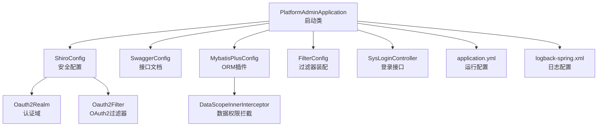
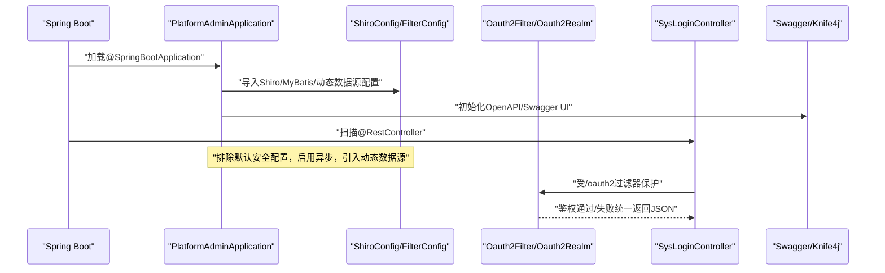
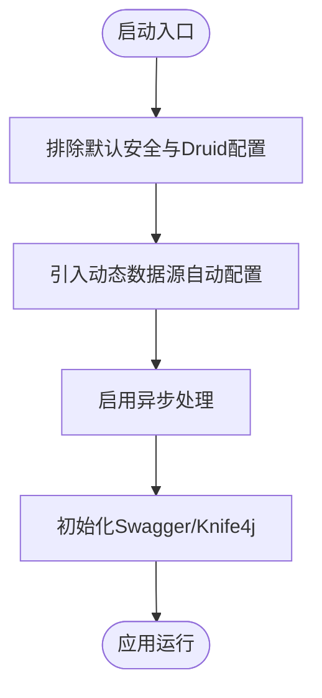
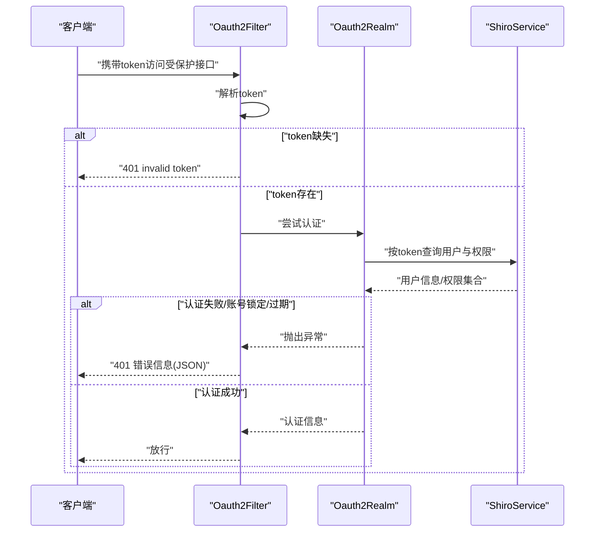
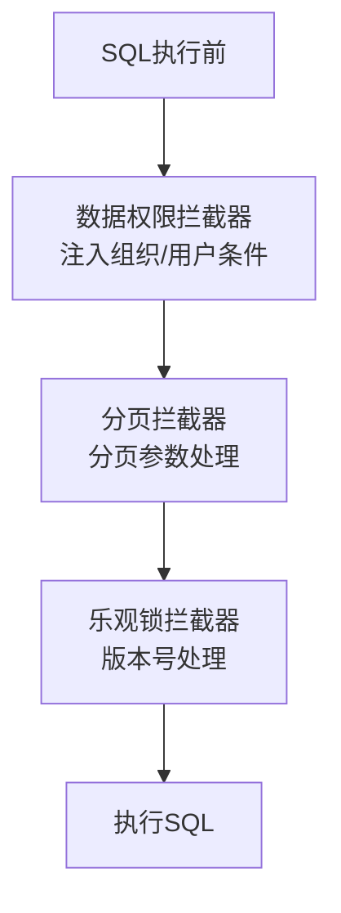
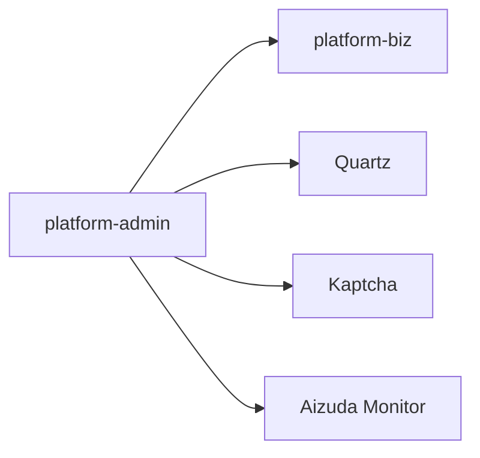

# 平台管理服务（platform-admin）

<cite>
**本文引用的文件**
- [PlatformAdminApplication.java](file://platform-admin/src/main/java/com/platform/PlatformAdminApplication.java)
- [application.yml](file://platform-admin/src/main/resources/application.yml)
- [pom.xml](file://platform-admin/pom.xml)
- [ShiroConfig.java](file://platform-admin/src/main/java/com/platform/config/ShiroConfig.java)
- [SwaggerConfig.java](file://platform-admin/src/main/java/com/platform/config/SwaggerConfig.java)
- [MybatisPlusConfig.java](file://platform-admin/src/main/java/com/platform/config/MybatisPlusConfig.java)
- [FilterConfig.java](file://platform-admin/src/main/java/com/platform/config/FilterConfig.java)
- [SysLoginController.java](file://platform-admin/src/main/java/com/platform/modules/sys/controller/SysLoginController.java)
- [Oauth2Realm.java](file://platform-admin/src/main/java/com/platform/modules/sys/oauth2/Oauth2Realm.java)
- [Oauth2Filter.java](file://platform-admin/src/main/java/com/platform/modules/sys/oauth2/Oauth2Filter.java)
- [DataScopeInnerInterceptor.java](file://platform-admin/src/main/java/com/platform/datascope/DataScopeInnerInterceptor.java)
- [logback-spring.xml](file://platform-admin/src/main/resources/logback-spring.xml)
</cite>

## 目录
1. [简介](#简介)
2. [项目结构](#项目结构)
3. [核心组件](#核心组件)
4. [架构总览](#架构总览)
5. [详细组件分析](#详细组件分析)
6. [依赖分析](#依赖分析)
7. [性能考虑](#性能考虑)
8. [故障排查指南](#故障排查指南)
9. [结论](#结论)
10. [附录](#附录)

## 简介
本文件面向平台管理服务（platform-admin）的开发者与运维人员，系统性梳理该管理后台的核心服务架构与实现细节。内容覆盖Spring Boot启动类配置与初始化流程（含排除的安全配置、动态数据源引入、异步处理启用）、RESTful API 设计原则（控制器组织、参数校验、统一响应格式）、权限控制体系（Shiro 集成、OAuth2 过滤链、JWT 风格令牌处理）、Swagger/OpenAPI 文档生成与接口测试、系统配置管理、日志记录与异常处理等基础设施能力，并提供最佳实践建议。

## 项目结构
platform-admin 是基于 Spring Boot 的后端服务模块，采用多模块聚合工程，核心启动类位于 platform-admin 模块，配置集中在 application.yml 与 logback-spring.xml 中，权限控制通过 Shiro 配置与过滤器装配，ORM 使用 MyBatis-Plus 并扩展了数据权限与分页/乐观锁插件。

图表来源
- [PlatformAdminApplication.java:1-93](file://platform-admin/src/main/java/com/platform/PlatformAdminApplication.java#L1-L93)
- [ShiroConfig.java:1-100](file://platform-admin/src/main/java/com/platform/config/ShiroConfig.java#L1-L100)
- [SwaggerConfig.java:1-95](file://platform-admin/src/main/java/com/platform/config/SwaggerConfig.java#L1-L95)
- [MybatisPlusConfig.java:1-79](file://platform-admin/src/main/java/com/platform/config/MybatisPlusConfig.java#L1-L79)
- [FilterConfig.java:1-46](file://platform-admin/src/main/java/com/platform/config/FilterConfig.java#L1-L46)
- [Oauth2Realm.java:1-89](file://platform-admin/src/main/java/com/platform/modules/sys/oauth2/Oauth2Realm.java#L1-L89)
- [Oauth2Filter.java:1-117](file://platform-admin/src/main/java/com/platform/modules/sys/oauth2/Oauth2Filter.java#L1-L117)
- [DataScopeInnerInterceptor.java:1-114](file://platform-admin/src/main/java/com/platform/datascope/DataScopeInnerInterceptor.java#L1-L114)
- [SysLoginController.java:1-139](file://platform-admin/src/main/java/com/platform/modules/sys/controller/SysLoginController.java#L1-L139)
- [application.yml:1-205](file://platform-admin/src/main/resources/application.yml#L1-L205)
- [logback-spring.xml:1-94](file://platform-admin/src/main/resources/logback-spring.xml#L1-L94)

章节来源
- [PlatformAdminApplication.java:1-93](file://platform-admin/src/main/java/com/platform/PlatformAdminApplication.java#L1-L93)
- [application.yml:1-205](file://platform-admin/src/main/resources/application.yml#L1-L205)
- [pom.xml:1-96](file://platform-admin/pom.xml#L1-L96)

## 核心组件
- 启动类与初始化
  - 排除默认安全自动配置与 Druid 数据源自动配置，显式引入动态数据源自动配置。
  - 启用异步处理注解，便于定时任务与异步业务执行。
  - 提供根路径访问提示与启动日志输出，包含 API 基础地址与文档地址。
- 配置中心
  - Undertow 线程模型与缓冲区优化；上下文路径与端口配置。
  - SpringDoc/Knife4j Swagger 文档分组与 UI 路径配置。
  - MyBatis-Plus Mapper 扫描、驼峰映射、全局逻辑删除字段、乐观锁等配置。
  - Redis 连接池、邮件、静态资源与上传大小等基础配置。
- ORM 与插件
  - MyBatis-Plus 拦截器链：数据权限、分页、乐观锁。
  - 自动填充：创建时间、更新时间、删除标记。
- 权限与安全
  - Shiro 安全管理器、会话管理、过滤链定义。
  - OAuth2 过滤器：从 Header 或参数提取 token，统一 401 返回。
  - Realm：按 token 查询用户与权限集合，账号锁定与过期处理。
- 日志与文档
  - Logback 多环境配置（开发/测试/生产），控制台与滚动文件输出。
  - Swagger/OpenAPI 文档信息与标签排序定制。

章节来源
- [PlatformAdminApplication.java:42-93](file://platform-admin/src/main/java/com/platform/PlatformAdminApplication.java#L42-L93)
- [application.yml:3-205](file://platform-admin/src/main/resources/application.yml#L3-L205)
- [MybatisPlusConfig.java:37-79](file://platform-admin/src/main/java/com/platform/config/MybatisPlusConfig.java#L37-L79)
- [ShiroConfig.java:44-99](file://platform-admin/src/main/java/com/platform/config/ShiroConfig.java#L44-L99)
- [Oauth2Filter.java:41-117](file://platform-admin/src/main/java/com/platform/modules/sys/oauth2/Oauth2Filter.java#L41-L117)
- [Oauth2Realm.java:39-89](file://platform-admin/src/main/java/com/platform/modules/sys/oauth2/Oauth2Realm.java#L39-L89)
- [logback-spring.xml:1-94](file://platform-admin/src/main/resources/logback-spring.xml#L1-L94)
- [SwaggerConfig.java:58-95](file://platform-admin/src/main/java/com/platform/config/SwaggerConfig.java#L58-L95)

## 架构总览
下图展示平台管理服务在启动阶段的关键装配与运行时交互：

图表来源
- [PlatformAdminApplication.java:49-51](file://platform-admin/src/main/java/com/platform/PlatformAdminApplication.java#L49-L51)
- [ShiroConfig.java:63-86](file://platform-admin/src/main/java/com/platform/config/ShiroConfig.java#L63-L86)
- [FilterConfig.java:34-44](file://platform-admin/src/main/java/com/platform/config/FilterConfig.java#L34-L44)
- [Oauth2Filter.java:41-96](file://platform-admin/src/main/java/com/platform/modules/sys/oauth2/Oauth2Filter.java#L41-L96)
- [SysLoginController.java:50-139](file://platform-admin/src/main/java/com/platform/modules/sys/controller/SysLoginController.java#L50-L139)
- [SwaggerConfig.java:65-93](file://platform-admin/src/main/java/com/platform/config/SwaggerConfig.java#L65-L93)

## 详细组件分析

### 启动类与初始化流程
- 关键点
  - 排除默认安全与 Druid 自动配置，避免与自定义安全与动态数据源冲突。
  - 引入动态数据源自动配置，支持多数据源场景。
  - 启用异步处理，便于后续任务调度与异步业务。
  - 根路径返回 API 与文档地址，便于快速定位。
- 初始化日志
  - 输出服务启动成功、API 地址与文档地址，便于本地与容器环境快速验证。

图表来源
- [PlatformAdminApplication.java:49-51](file://platform-admin/src/main/java/com/platform/PlatformAdminApplication.java#L49-L51)
- [PlatformAdminApplication.java:69-90](file://platform-admin/src/main/java/com/platform/PlatformAdminApplication.java#L69-L90)

章节来源
- [PlatformAdminApplication.java:42-93](file://platform-admin/src/main/java/com/platform/PlatformAdminApplication.java#L42-L93)

### RESTful API 设计原则
- 控制器组织
  - 按业务域划分包结构（如 sys、job、oss、wx、mall），控制器集中于各域的 controller 包内。
  - 统一使用注解声明接口分组与描述，便于 Swagger 分组展示。
- 请求参数验证
  - 登录接口使用表单对象进行参数封装与校验，结合验证码校验与 AES 解密。
- 响应数据格式标准化
  - 统一使用通用响应包装类，保证错误码、消息与数据结构的一致性。

章节来源
- [SysLoginController.java:50-139](file://platform-admin/src/main/java/com/platform/modules/sys/controller/SysLoginController.java#L50-L139)

### 权限控制系统（Shiro + OAuth2）
- 过滤链定义
  - 放行路径：/druid/**、/sys/login、/captcha.jpg、/swagger-ui/**、/doc.html、/favicon.ico、/webjars/**、/v3/api-docs/**。
  - 其余路径统一走 oauth2 过滤器。
- OAuth2 过滤器
  - 从 Header 或参数读取 token，OPTIONS 预检放行。
  - 登录失败统一返回 JSON，包含状态码与错误信息。
- Realm 认证
  - 根据 token 查询用户与权限集合，处理账号锁定与过期。
- 会话与安全管理
  - 默认 Web 会话管理器，开启会话验证与 Cookie 管理。

图表来源
- [ShiroConfig.java:63-86](file://platform-admin/src/main/java/com/platform/config/ShiroConfig.java#L63-L86)
- [Oauth2Filter.java:41-96](file://platform-admin/src/main/java/com/platform/modules/sys/oauth2/Oauth2Filter.java#L41-L96)
- [Oauth2Realm.java:68-87](file://platform-admin/src/main/java/com/platform/modules/sys/oauth2/Oauth2Realm.java#L68-L87)

章节来源
- [ShiroConfig.java:44-99](file://platform-admin/src/main/java/com/platform/config/ShiroConfig.java#L44-L99)
- [Oauth2Filter.java:41-117](file://platform-admin/src/main/java/com/platform/modules/sys/oauth2/Oauth2Filter.java#L41-L117)
- [Oauth2Realm.java:39-89](file://platform-admin/src/main/java/com/platform/modules/sys/oauth2/Oauth2Realm.java#L39-L89)

### 动态数据源与ORM插件
- 动态数据源
  - 通过自动配置引入，支持多数据源切换与路由。
- MyBatis-Plus 插件链
  - 数据权限拦截器：按用户与组织维度注入 WHERE 条件。
  - 分页拦截器：统一分页行为。
  - 乐观锁拦截器：支持并发写入场景。
- 自动填充
  - 创建时间、删除标记（逻辑删除）插入填充；更新时间更新填充。

图表来源
- [MybatisPlusConfig.java:43-54](file://platform-admin/src/main/java/com/platform/config/MybatisPlusConfig.java#L43-L54)
- [DataScopeInnerInterceptor.java:50-85](file://platform-admin/src/main/java/com/platform/datascope/DataScopeInnerInterceptor.java#L50-L85)

章节来源
- [MybatisPlusConfig.java:37-79](file://platform-admin/src/main/java/com/platform/config/MybatisPlusConfig.java#L37-L79)
- [DataScopeInnerInterceptor.java:40-114](file://platform-admin/src/main/java/com/platform/datascope/DataScopeInnerInterceptor.java#L40-L114)

### Swagger/OpenAPI 文档与接口测试
- 文档分组
  - 全部、系统管理、微信管理三组，分别匹配不同包路径。
- UI 与增强
  - Knife4j 启用，语言、标签排序、参数重载缓存等增强配置。
- 接口测试
  - 通过 Swagger UI 或 Knife4j UI 访问接口，结合登录获取 token 后进行测试。

章节来源
- [application.yml:22-67](file://platform-admin/src/main/resources/application.yml#L22-L67)
- [SwaggerConfig.java:58-95](file://platform-admin/src/main/java/com/platform/config/SwaggerConfig.java#L58-L95)

### 系统配置管理与日志记录
- 运行配置
  - Undertow 线程与缓冲区、端口与上下文路径、Swagger UI 与 API Docs 路径、Redis、邮件、静态资源与上传大小等。
- 日志配置
  - 开发环境：控制台彩色输出，调试级别提升。
  - 测试/生产环境：控制台与滚动文件输出，按日期滚动与总量上限控制，生产环境降低日志级别。

章节来源
- [application.yml:3-205](file://platform-admin/src/main/resources/application.yml#L3-L205)
- [logback-spring.xml:14-94](file://platform-admin/src/main/resources/logback-spring.xml#L14-L94)

### 异常处理与统一响应
- 登录接口
  - 验证码校验失败、解密失败、账号不存在、账号锁定、密码错误、生成 token 成功均返回统一响应结构。
- OAuth2 过滤器
  - 登录失败统一返回 JSON，包含状态码与错误信息，便于前端统一处理。

章节来源
- [SysLoginController.java:85-136](file://platform-admin/src/main/java/com/platform/modules/sys/controller/SysLoginController.java#L85-L136)
- [Oauth2Filter.java:78-96](file://platform-admin/src/main/java/com/platform/modules/sys/oauth2/Oauth2Filter.java#L78-L96)

## 依赖分析
- 模块依赖
  - platform-admin 依赖 platform-biz，复用业务层能力。
  - Quartz 定时任务、Kaptcha 验证码、Aizuda 监控等外部依赖。
- Maven 资源过滤
  - 对字体文件与证书文件进行差异化过滤，确保打包产物正确。

图表来源
- [pom.xml:16-47](file://platform-admin/pom.xml#L16-L47)

章节来源
- [pom.xml:1-96](file://platform-admin/pom.xml#L1-L96)

## 性能考虑
- Undertow 线程模型
  - IO 线程与工作线程数量需结合 CPU 核心数与业务特征调整，避免“打开文件数过多”问题。
- 缓冲区与直接内存
  - 合理设置 buffer-size 与 direct-buffers，平衡内存占用与吞吐。
- MyBatis-Plus 插件
  - 分页与乐观锁开销可控，建议在大数据量场景谨慎使用复杂数据权限条件。
- Swagger 文档
  - 生产环境可关闭 Knife4j 或限制访问路径，减少不必要的暴露面。

## 故障排查指南
- 启动失败
  - 检查排除的安全与数据源配置是否与实际环境冲突。
  - 确认动态数据源配置与多数据源路由是否正确。
- 登录失败
  - 验证码是否正确；确认 AES 解密流程与密钥配置。
  - 用户状态是否被锁定；检查盐值与哈希算法一致性。
- 401 未授权
  - 确认请求头或参数中 token 是否正确传递；检查过滤链是否生效。
  - 观察 OAuth2 过滤器返回的 JSON 错误信息定位原因。
- 文档无法访问
  - 检查 Swagger/Knife4j 路径配置与分组扫描包路径。
- 日志异常
  - 切换至 dev/test/prod Profile，确认日志输出级别与文件路径。

章节来源
- [PlatformAdminApplication.java:69-90](file://platform-admin/src/main/java/com/platform/PlatformAdminApplication.java#L69-L90)
- [SysLoginController.java:85-136](file://platform-admin/src/main/java/com/platform/modules/sys/controller/SysLoginController.java#L85-L136)
- [Oauth2Filter.java:61-96](file://platform-admin/src/main/java/com/platform/modules/sys/oauth2/Oauth2Filter.java#L61-L96)
- [application.yml:22-67](file://platform-admin/src/main/resources/application.yml#L22-L67)
- [logback-spring.xml:14-94](file://platform-admin/src/main/resources/logback-spring.xml#L14-L94)

## 结论
platform-admin 以 Spring Boot 为基础，结合 Shiro 权限体系与 MyBatis-Plus 插件，构建了具备动态数据源、统一响应、Swagger 文档与完善日志的管理后台服务。通过合理的配置与插件链组合，既能满足多数据源与数据权限需求，又能在高并发场景保持稳定与可观测性。建议在生产环境中进一步细化过滤链与文档暴露策略，并持续优化线程池与日志策略以获得更佳性能。

## 附录
- 最佳实践
  - 将敏感配置放入环境变量或配置中心，避免硬编码。
  - 在多数据源场景下，明确路由规则与事务边界。
  - 对高频接口增加缓存与限流策略，结合监控告警。
  - 定期清理日志与审计记录，遵守数据留存合规要求。