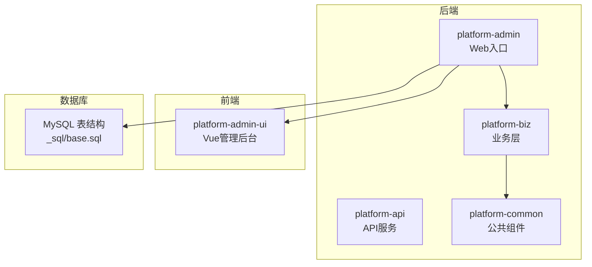
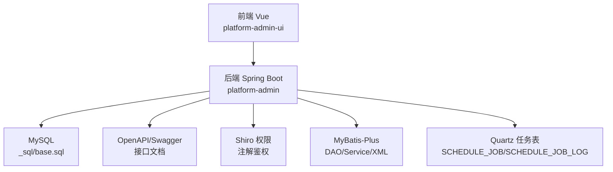
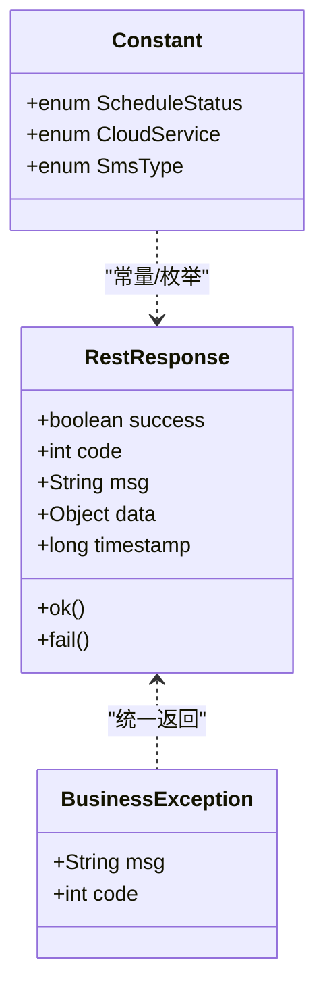
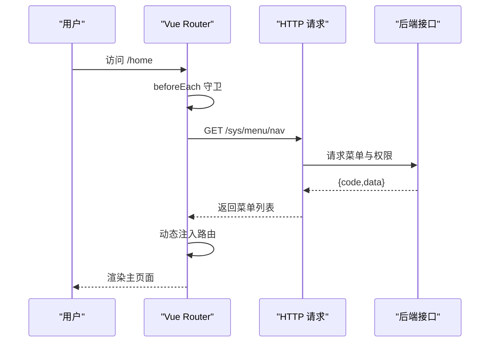
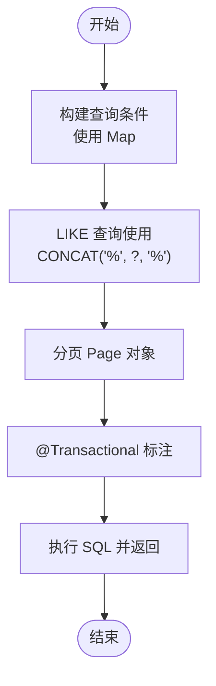
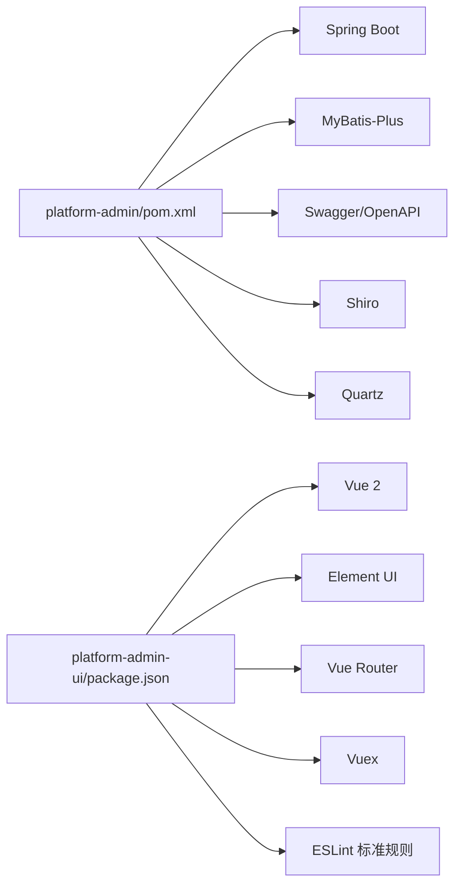

# 代码规范

<cite>
**本文引用的文件**
- [application.yml](file://platform-admin/src/main/resources/application.yml)
- [pom.xml](file://platform-admin/pom.xml)
- [Constant.java](file://platform-common/src/main/java/com/platform/common/utils/Constant.java)
- [BusinessException.java](file://platform-common/src/main/java/com/platform/common/exception/BusinessException.java)
- [RestResponse.java](file://platform-common/src/main/java/com/platform/common/utils/RestResponse.java)
- [PlatformAdminApplication.java](file://platform-admin/src/main/java/com/platform/PlatformAdminApplication.java)
- [SysUserController.java](file://platform-admin/src/main/java/com/platform/modules/sys/controller/SysUserController.java)
- [index.js](file://platform-admin-ui/src/router/index.js)
- [login.vue](file://platform-admin-ui/src/views/common/login.vue)
- [index.js](file://platform-admin-ui/src/store/index.js)
- [.eslintrc.js](file://platform-admin-ui/.eslintrc.js)
- [.editorconfig](file://platform-admin-ui/.editorconfig)
- [package.json](file://platform-admin-ui/package.json)
- [base.sql](file://_sql/base.sql)
- [Agents.md](file://Agents.md)
- [ServiceImpl.java.vm](file://platform-admin/src/main/resources/gen/template/ServiceImpl.java.vm)
- [Dao.xml.vm](file://platform-admin/src/main/resources/gen/template/Dao.xml.vm)
- [SysGeneratorDao.java](file://platform-admin/src/main/java/com/platform/modules/gen/dao/SysGeneratorDao.java)
</cite>

## 目录
1. [简介](#简介)
2. [项目结构](#项目结构)
3. [核心组件](#核心组件)
4. [架构总览](#架构总览)
5. [详细组件分析](#详细组件分析)
6. [依赖分析](#依赖分析)
7. [性能考虑](#性能考虑)
8. [故障排查指南](#故障排查指南)
9. [结论](#结论)
10. [附录](#附录)

## 简介
本文件旨在建立统一、可执行的代码规范，覆盖后端 Java、前端 Vue、SQL 编写与注释标准，确保团队协作一致性与长期可维护性。规范来源于现有工程实践与配置文件，结合最佳实践给出落地建议。

## 项目结构
- 后端模块
  - platform-admin：Web 应用入口，含控制器、配置、拦截器等
  - platform-api：对外 API 服务
  - platform-biz：业务层与通用校验、工具
  - platform-common：公共异常、工具、配置
- 前端模块
  - platform-admin-ui：Vue 管理后台前端
- 数据库脚本
  - _sql/base.sql：系统基础表结构与索引示例

**图表来源**
- [PlatformAdminApplication.java:47-93](file://platform-admin/src/main/java/com/platform/PlatformAdminApplication.java#L47-L93)
- [base.sql:256-326](file://_sql/base.sql#L256-L326)

**章节来源**
- [PlatformAdminApplication.java:47-93](file://platform-admin/src/main/java/com/platform/PlatformAdminApplication.java#L47-L93)
- [application.yml:1-205](file://platform-admin/src/main/resources/application.yml#L1-L205)
- [base.sql:256-326](file://_sql/base.sql#L256-L326)

## 核心组件
- 统一响应模型：RestResponse
  - 规范统一的返回结构，包含 success、code、msg、data、timestamp
  - 提供 ok()/fail() 多种工厂方法，便于控制器快速返回
- 异常体系：BusinessException
  - 自定义业务异常，支持携带 msg 与 code，便于前端识别与国际化
- 常量与枚举：Constant
  - 集中管理常量、系统状态枚举（如定时任务状态、云服务商枚举），提升可读性与一致性
- 控制器示例：SysUserController
  - 使用 OpenAPI 注解标注接口，配合权限注解与参数校验，体现接口规范与安全控制
- 前端路由与状态
  - Vue Router 动态注入与鉴权守卫
  - Vuex Store 模块化与重置机制

**章节来源**
- [RestResponse.java:34-122](file://platform-common/src/main/java/com/platform/common/utils/RestResponse.java#L34-L122)
- [BusinessException.java:28-74](file://platform-common/src/main/java/com/platform/common/exception/BusinessException.java#L28-L74)
- [Constant.java:26-240](file://platform-common/src/main/java/com/platform/common/utils/Constant.java#L26-L240)
- [SysUserController.java:50-200](file://platform-admin/src/main/java/com/platform/modules/sys/controller/SysUserController.java#L50-L200)
- [index.js:83-203](file://platform-admin-ui/src/router/index.js#L83-L203)
- [index.js:11-28](file://platform-admin-ui/src/store/index.js#L11-L28)

## 架构总览
后端基于 Spring Boot，使用 MyBatis-Plus、Shiro、Swagger/OpenAPI 等技术栈；前端基于 Vue 2 + Element UI，采用路由懒加载与动态菜单注入；数据库采用 MySQL，提供 Quartz 定时任务表结构与索引示例。

**图表来源**
- [application.yml:22-67](file://platform-admin/src/main/resources/application.yml#L22-L67)
- [base.sql:256-293](file://_sql/base.sql#L256-L293)
- [SysUserController.java:33-54](file://platform-admin/src/main/java/com/platform/modules/sys/controller/SysUserController.java#L33-L54)

## 详细组件分析

### Java 后端代码规范

- 命名约定
  - 包名：com.platform.modules.*.controller/service/dao/entity
  - 类名：采用名词或复合词，首字母大写；枚举与常量全大写+下划线
  - 方法名：动宾短语，首字母小写；布尔方法以 is/has 开头
  - 参数与局部变量：驼峰命名，简洁明了
  - 常量：全大写+下划线，使用 public static final 或枚举
- 类设计原则
  - 控制器：职责单一，仅处理请求与响应；复杂逻辑下沉至 Service
  - Service：事务边界清晰，批量操作使用 @Transactional
  - DAO：遵循 MyBatis-Plus 约定，尽量使用 Wrapper 与分页 Page
  - 异常：业务异常使用 BusinessException，系统异常由全局异常处理器兜底
- 方法参数规范
  - 控制器入参：使用 @RequestParam/@RequestBody，必要时配合 JSR-303 校验
  - Service 入参：Map<String,Object> 传参时，统一在方法内构造查询条件
- 异常处理标准
  - 自定义异常 BusinessException，携带 msg 与 code
  - 控制器统一返回 RestResponse，失败场景使用 fail()
- 代码格式化与注释
  - 使用 EditorConfig 统一缩进、换行、空白处理
  - 类注释：类顶部使用多行注释，描述职责与作者
  - 方法注释：@Operation/@Tag 等 OpenAPI 注解用于接口文档
  - 字段注释：数据库字段使用 COMMENT 注释，保持与实体一致

**图表来源**
- [RestResponse.java:34-122](file://platform-common/src/main/java/com/platform/common/utils/RestResponse.java#L34-L122)
- [BusinessException.java:28-74](file://platform-common/src/main/java/com/platform/common/exception/BusinessException.java#L28-L74)
- [Constant.java:158-238](file://platform-common/src/main/java/com/platform/common/utils/Constant.java#L158-L238)

**章节来源**
- [RestResponse.java:34-122](file://platform-common/src/main/java/com/platform/common/utils/RestResponse.java#L34-L122)
- [BusinessException.java:28-74](file://platform-common/src/main/java/com/platform/common/exception/BusinessException.java#L28-L74)
- [Constant.java:26-240](file://platform-common/src/main/java/com/platform/common/utils/Constant.java#L26-L240)
- [SysUserController.java:50-200](file://platform-admin/src/main/java/com/platform/modules/sys/controller/SysUserController.java#L50-L200)
- [.editorconfig:1-10](file://platform-admin-ui/.editorconfig#L1-L10)

### Vue 前端代码规范

- 组件开发规范
  - 单文件组件：模板、脚本、样式分离，按功能拆分组件
  - 命名：组件名使用帕斯卡命名，文件名与导出组件一致
  - 数据：使用 data() 返回对象，避免共享引用
  - 事件：使用 $emit 触发自定义事件，避免直接修改父组件状态
- 路由配置标准
  - 路由懒加载：开发环境关闭，生产环境启用，提升首屏性能
  - 动态路由：通过菜单接口拉取，动态注入路由与 tab 展示
  - 鉴权：全局前置守卫校验 token，未登录跳转登录页
- 状态管理规范
  - 模块化：store/modules 下按功能划分模块
  - 重置：提供 resetStore mutation，统一清理状态
- 样式编写准则
  - 使用 SCSS，变量与混入复用
  - 避免内联样式，优先类名控制
  - 响应式与主题：通过变量与 Element UI 主题定制

**图表来源**
- [index.js:91-127](file://platform-admin-ui/src/router/index.js#L91-L127)

**章节来源**
- [index.js:1-203](file://platform-admin-ui/src/router/index.js#L1-L203)
- [login.vue:49-122](file://platform-admin-ui/src/views/common/login.vue#L49-L122)
- [index.js:1-28](file://platform-admin-ui/src/store/index.js#L1-L28)
- [.eslintrc.js:1-67](file://platform-admin-ui/.eslintrc.js#L1-L67)
- [.editorconfig:1-10](file://platform-admin-ui/.editorconfig#L1-L10)

### SQL 编写规范

- 表名与字段命名
  - 表名：使用下划线分隔的名词，如 SYS_USER、SCHEDULE_JOB
  - 字段：小写下划线，主键统一使用 ID 或业务主键，避免保留字
- 索引设计
  - 唯一索引：唯一键使用 UNIQUE KEY
  - 常用查询字段加索引，避免全表扫描
  - 复合索引：遵循最左前缀原则，避免冗余索引
- 查询优化
  - LIKE 查询使用 CONCAT('%', #{...}, '%') 风格，避免字符串拼接 ${}
  - 分页查询使用 Page 对象，避免一次性加载大量数据
  - 使用 EXPLAIN 分析慢查询，定位索引与连接问题
- 事务处理
  - 批量操作使用 @Transactional(rollbackFor = Exception.class)
  - 保证幂等性，避免重复提交
- 日志与监控
  - 定时任务日志表 SCHEDULE_JOB_LOG 记录执行状态与耗时
  - 使用 Druid 监控 SQL 执行情况

**图表来源**
- [ServiceImpl.java.vm:54-82](file://platform-admin/src/main/resources/gen/template/ServiceImpl.java.vm#L54-L82)
- [Dao.xml.vm:15-21](file://platform-admin/src/main/resources/gen/template/Dao.xml.vm#L15-L21)

**章节来源**
- [base.sql:256-326](file://_sql/base.sql#L256-L326)
- [ServiceImpl.java.vm:78-82](file://platform-admin/src/main/resources/gen/template/ServiceImpl.java.vm#L78-L82)
- [Dao.xml.vm:15-21](file://platform-admin/src/main/resources/gen/template/Dao.xml.vm#L15-L21)
- [Agents.md:145-162](file://Agents.md#L145-L162)

### 注释编写标准

- 类注释
  - 文件头部版权与作者信息
  - 类职责说明，涉及变更记录与版本信息
- 方法注释
  - 使用 OpenAPI 注解 @Operation/@Tag 描述接口用途与权限
  - 方法参数与返回值使用注释说明类型与含义
- 参数注释
  - 控制器参数：@RequestParam/@RequestBody 的作用与约束
  - Service 参数：Map<String,Object> 的 key 含义与取值范围
- 返回值注释
  - 统一使用 RestResponse，注释说明 success/code/msg/data 的含义

**章节来源**
- [SysUserController.java:65-72](file://platform-admin/src/main/java/com/platform/modules/sys/controller/SysUserController.java#L65-L72)
- [RestResponse.java:34-68](file://platform-common/src/main/java/com/platform/common/utils/RestResponse.java#L34-L68)

## 依赖分析
- 后端依赖
  - Spring Boot、MyBatis-Plus、Shiro、Swagger/OpenAPI、Druid、Quartz
  - Maven 资源过滤与 Javadoc 插件配置
- 前端依赖
  - Vue 2、Element UI、Vue Router、Vuex、Axios、ESLint 标准规则

**图表来源**
- [pom.xml:16-47](file://platform-admin/pom.xml#L16-L47)
- [package.json:14-36](file://platform-admin-ui/package.json#L14-L36)
- [package.json:53-61](file://platform-admin-ui/package.json#L53-L61)

**章节来源**
- [pom.xml:16-96](file://platform-admin/pom.xml#L16-L96)
- [package.json:1-102](file://platform-admin-ui/package.json#L1-L102)

## 性能考虑
- 后端
  - Undertow 线程与缓冲配置，合理设置 IO 线程与工作线程
  - MyBatis-Plus 分页与自动驼峰映射，减少 ORM 映射成本
  - Quartz 任务表索引与状态字段，保障调度性能
- 前端
  - 路由懒加载与按需引入组件，降低首屏体积
  - ESLint 与 EditorConfig 统一格式，减少差异带来的构建与调试成本

**章节来源**
- [application.yml:3-18](file://platform-admin/src/main/resources/application.yml#L3-L18)
- [application.yml:113-142](file://platform-admin/src/main/resources/application.yml#L113-L142)
- [base.sql:256-293](file://_sql/base.sql#L256-L293)
- [.eslintrc.js:1-67](file://platform-admin-ui/.eslintrc.js#L1-L67)
- [.editorconfig:1-10](file://platform-admin-ui/.editorconfig#L1-L10)

## 故障排查指南
- SQL 与 XML Mapper
  - 优先定位 controller -> service -> DAO -> XML mapper 的调用链
  - LIKE 查询使用 CONCAT 风格，避免 ${} 拼接
  - 核对实体/VO 字段与调用方一致性
- 验证与测试
  - 区分编译通过、测试执行、本地联调与静态审查
  - 避免执行全量测试，优先定向验证与最小化验证
- 前端联调
  - 核对请求 URL、服务端口、context-path、前端 baseUrl
  - 检查 token 传递与清理逻辑

**章节来源**
- [Agents.md:145-162](file://Agents.md#L145-L162)
- [Agents.md:163-190](file://Agents.md#L163-L190)
- [Agents.md:200-254](file://Agents.md#L200-L254)

## 结论
通过统一的 Java 命名与类设计、Vue 组件与路由规范、SQL 编写与注释标准，以及完善的异常与响应模型，能够显著提升团队协作效率与系统可维护性。建议在日常开发中严格执行上述规范，并持续优化与补充。

## 附录
- 示例参考
  - 控制器返回：[SysUserController.java:65-72](file://platform-admin/src/main/java/com/platform/modules/sys/controller/SysUserController.java#L65-L72)
  - 统一响应：[RestResponse.java:86-121](file://platform-common/src/main/java/com/platform/common/utils/RestResponse.java#L86-L121)
  - 自定义异常：[BusinessException.java:34-54](file://platform-common/src/main/java/com/platform/common/exception/BusinessException.java#L34-L54)
  - 常量与枚举：[Constant.java:158-238](file://platform-common/src/main/java/com/platform/common/utils/Constant.java#L158-L238)
  - 前端路由与登录：[index.js:91-127](file://platform-admin-ui/src/router/index.js#L91-L127)、[login.vue:93-121](file://platform-admin-ui/src/views/common/login.vue#L93-L121)
  - SQL 规范与示例：[base.sql:256-326](file://_sql/base.sql#L256-L326)、[Dao.xml.vm:15-21](file://platform-admin/src/main/resources/gen/template/Dao.xml.vm#L15-L21)、[ServiceImpl.java.vm:54-82](file://platform-admin/src/main/resources/gen/template/ServiceImpl.java.vm#L54-L82)
  - DAO 接口与分页：[SysGeneratorDao.java:41-65](file://platform-admin/src/main/java/com/platform/modules/gen/dao/SysGeneratorDao.java#L41-L65)