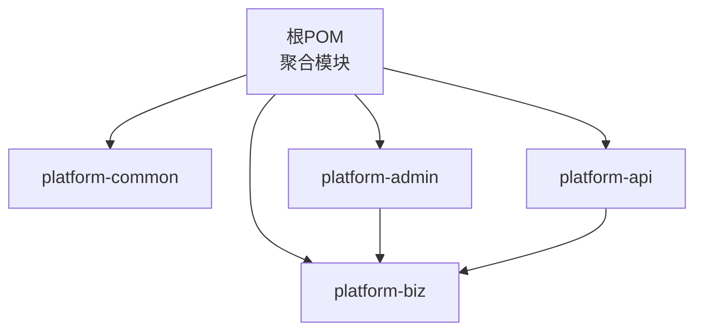
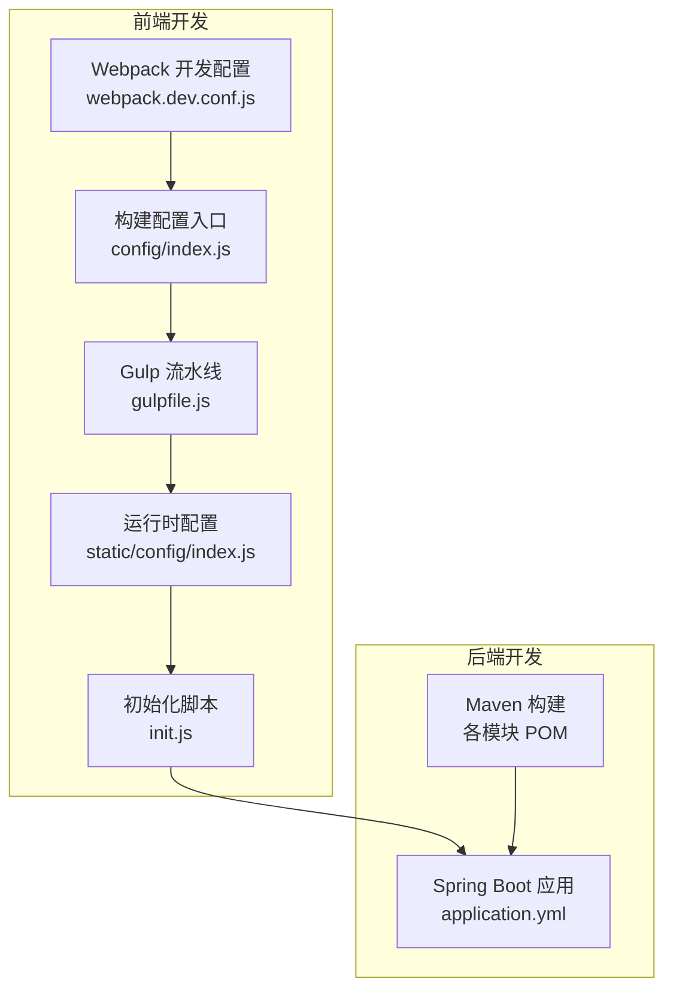
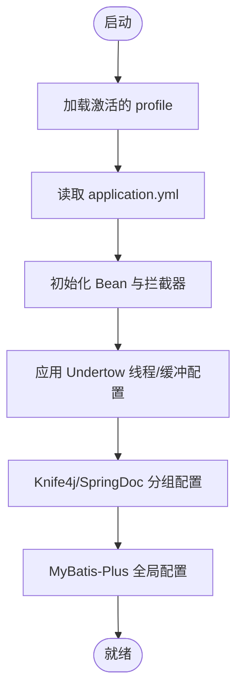
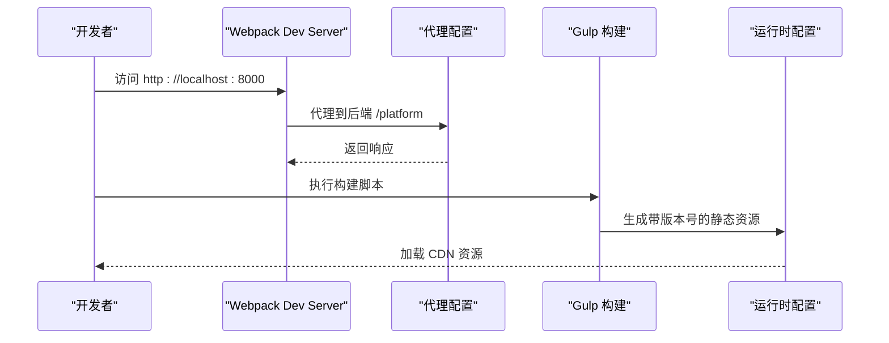
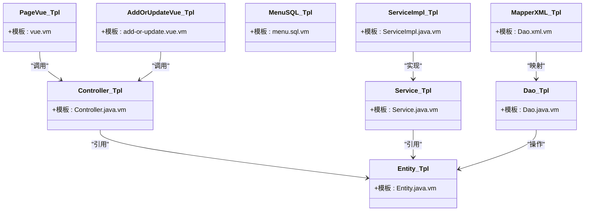
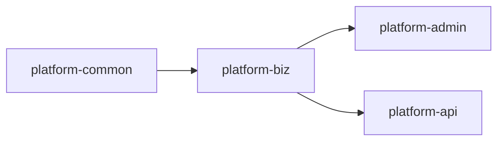

# 开发工具

<cite>
**本文档引用的文件**
- [根POM（聚合）](file://pom.xml)
- [平台公共模块 POM](file://platform-common/pom.xml)
- [平台业务模块 POM](file://platform-biz/pom.xml)
- [平台管理端 POM](file://platform-admin/pom.xml)
- [平台 API 端 POM](file://platform-api/pom.xml)
- [管理端应用配置（YAML）](file://platform-admin/src/main/resources/application.yml)
- [前端包管理与脚本（package.json）](file://platform-admin-ui/package.json)
- [前端 ESLint 规则](file://platform-admin-ui/.eslintrc.js)
- [前端 EditorConfig](file://platform-admin-ui/.editorconfig)
- [前端 PostCSS 配置](file://platform-admin-ui/.postcssrc.js)
- [前端开发构建配置（webpack.dev.conf.js）](file://platform-admin-ui/build/webpack.dev.conf.js)
- [前端构建配置入口（config/index.js）](file://platform-admin-ui/config/index.js)
- [前端构建流水线（gulpfile.js）](file://platform-admin-ui/gulpfile.js)
- [前端运行时配置（开发）](file://platform-admin-ui/static/config/index.js)
- [前端运行时初始化脚本](file://platform-admin-ui/static/config/init.js)
- [根级忽略规则](file://.gitignore)
- [前端忽略规则](file://platform-admin-ui/.gitignore)
- [生成器模板（控制器）](file://platform-admin/src/main/resources/gen/template/Controller.java.vm)
- [生成器模板（实体）](file://platform-admin/src/main/resources/gen/template/Entity.java.vm)
- [生成器模板（服务）](file://platform-admin/src/main/resources/gen/template/Service.java.vm)
- [生成器模板（服务实现）](file://platform-admin/src/main/resources/gen/template/ServiceImpl.java.vm)
- [生成器模板（DAO）](file://platform-admin/src/main/resources/gen/template/Dao.java.vm)
- [生成器模板（Mapper XML）](file://platform-admin/src/main/resources/gen/template/Dao.xml.vm)
- [生成器模板（菜单 SQL）](file://platform-admin/src/main/resources/gen/template/menu.sql.vm)
- [生成器模板（页面 Vue）](file://platform-admin/src/main/resources/gen/template/vue.vm)
- [生成器模板（新增/编辑页面）](file://platform-admin/src/main/resources/gen/template/add-or-update.vue.vm)
</cite>

## 目录
1. [简介](#简介)
2. [项目结构](#项目结构)
3. [核心组件](#核心组件)
4. [架构总览](#架构总览)
5. [详细组件分析](#详细组件分析)
6. [依赖关系分析](#依赖关系分析)
7. [性能考量](#性能考量)
8. [故障排查指南](#故障排查指南)
9. [结论](#结论)
10. [附录](#附录)

## 简介
本指南面向使用 IntelliJ IDEA、WebStorm 等主流 IDE 的开发者，围绕本项目的多模块 Java/Spring Boot 后端与 Vue 2 前端，提供统一的开发工具配置建议、插件推荐、调试技巧、性能分析方法、构建工具与包管理器配置、版本控制最佳实践，以及跨操作系统一致性保障策略。目标是帮助团队在不同平台上获得一致且高效的开发体验。

## 项目结构
该项目采用 Maven 聚合工程组织，包含后端四个模块与前端单页应用：
- 后端模块
  - platform-common：通用能力与基础依赖
  - platform-biz：业务层与 Mapper/XML
  - platform-api：对外 API 层
  - platform-admin：管理后台服务（含定时任务、验证码、监控等）
- 前端模块
  - platform-admin-ui：基于 Vue 2 的管理端界面，使用 Webpack 4 + Gulp 构建

图表来源
- [根POM（聚合）:42-46](file://pom.xml#L42-L46)
- [平台公共模块 POM:4-14](file://platform-common/pom.xml#L4-L14)
- [平台业务模块 POM:4-14](file://platform-biz/pom.xml#L4-L14)
- [平台 API 端 POM:4-14](file://platform-api/pom.xml#L4-L14)
- [平台管理端 POM:4-14](file://platform-admin/pom.xml#L4-L14)

章节来源
- [根POM（聚合）:42-46](file://pom.xml#L42-L46)
- [平台公共模块 POM:4-14](file://platform-common/pom.xml#L4-L14)
- [平台业务模块 POM:4-14](file://platform-biz/pom.xml#L4-L14)
- [平台 API 端 POM:4-14](file://platform-api/pom.xml#L4-L14)
- [平台管理端 POM:4-14](file://platform-admin/pom.xml#L4-L14)

## 核心组件
- 后端技术栈要点
  - Spring Boot 2.7.x + Undertow 容器
  - MyBatis-Plus + 动态数据源 + Druid
  - Shiro + JWT + Knife4j/SpringDoc OpenAPI
  - Redis/JDBC/日志/支付/短信/对象存储等生态集成
- 前端技术栈要点
  - Vue 2.6 + Element-UI 2.15 + Axios
  - Webpack 4 + ESLint（Standard 规范）+ PostCSS/Autoprefixer
  - Gulp 流水线产出带版本号的静态资源

章节来源
- [根POM（聚合）:92-437](file://pom.xml#L92-L437)
- [平台管理端 POM:16-47](file://platform-admin/pom.xml#L16-L47)
- [平台 API 端 POM:16-22](file://platform-api/pom.xml#L16-L22)
- [平台业务模块 POM:18-22](file://platform-biz/pom.xml#L18-L22)
- [前端包管理与脚本（package.json）:8-13](file://platform-admin-ui/package.json#L8-L13)
- [前端 ESLint 规则:17-64](file://platform-admin-ui/.eslintrc.js#L17-L64)
- [前端 PostCSS 配置:3-8](file://platform-admin-ui/.postcssrc.js#L3-L8)

## 架构总览
下图展示后端与前端在本地开发时的交互关系与关键配置点：

图表来源
- [前端开发构建配置（webpack.dev.conf.js）:16-46](file://platform-admin-ui/build/webpack.dev.conf.js#L16-L46)
- [前端构建配置入口（config/index.js）:8-59](file://platform-admin-ui/config/index.js#L8-L59)
- [前端构建流水线（gulpfile.js）:24-64](file://platform-admin-ui/gulpfile.js#L24-L64)
- [前端运行时配置（开发）:7-13](file://platform-admin-ui/static/config/index.js#L7-L13)
- [前端运行时初始化脚本:5-16](file://platform-admin-ui/static/config/init.js#L5-L16)
- [管理端应用配置（YAML）:4-20](file://platform-admin/src/main/resources/application.yml#L4-L20)

章节来源
- [前端开发构建配置（webpack.dev.conf.js）:16-46](file://platform-admin-ui/build/webpack.dev.conf.js#L16-L46)
- [前端构建配置入口（config/index.js）:8-59](file://platform-admin-ui/config/index.js#L8-L59)
- [前端构建流水线（gulpfile.js）:24-64](file://platform-admin-ui/gulpfile.js#L24-L64)
- [前端运行时配置（开发）:7-13](file://platform-admin-ui/static/config/index.js#L7-L13)
- [前端运行时初始化脚本:5-16](file://platform-admin-ui/static/config/init.js#L5-L16)
- [管理端应用配置（YAML）:4-20](file://platform-admin/src/main/resources/application.yml#L4-L20)

## 详细组件分析

### 后端：Spring Boot 与 Maven 配置
- 模块职责
  - platform-common：共享依赖与通用配置
  - platform-biz：业务与 Mapper/XML
  - platform-api：对外 API
  - platform-admin：管理端（定时任务、验证码、监控等）
- 关键配置点
  - Undertow 线程与缓冲区参数
  - Swagger/Knife4j 文档分组与路径
  - MyBatis-Plus 全局配置与逻辑删除
  - 多环境 profile 与资源过滤
- 构建特性
  - 统一编码与资源过滤
  - Javadoc 插件与资源插件配置

图表来源
- [管理端应用配置（YAML）:4-20](file://platform-admin/src/main/resources/application.yml#L4-L20)
- [管理端应用配置（YAML）:22-67](file://platform-admin/src/main/resources/application.yml#L22-L67)
- [管理端应用配置（YAML）:114-142](file://platform-admin/src/main/resources/application.yml#L114-L142)
- [平台管理端 POM:49-93](file://platform-admin/pom.xml#L49-L93)
- [平台 API 端 POM:24-68](file://platform-api/pom.xml#L24-L68)
- [平台业务模块 POM:18-22](file://platform-biz/pom.xml#L18-L22)

章节来源
- [平台管理端 POM:49-93](file://platform-admin/pom.xml#L49-L93)
- [平台 API 端 POM:24-68](file://platform-api/pom.xml#L24-L68)
- [平台业务模块 POM:18-22](file://platform-biz/pom.xml#L18-L22)
- [管理端应用配置（YAML）:4-20](file://platform-admin/src/main/resources/application.yml#L4-L20)
- [管理端应用配置（YAML）:22-67](file://platform-admin/src/main/resources/application.yml#L22-L67)
- [管理端应用配置（YAML）:114-142](file://platform-admin/src/main/resources/application.yml#L114-L142)

### 前端：Webpack、ESLint、PostCSS 与 Gulp
- 开发服务器与热更新
  - devServer 配置、代理表、端口选择与错误覆盖
- 代码质量与规范
  - ESLint Standard 规则、HTML 插件、生产环境禁用 debugger
- 样式与兼容
  - PostCSS autoprefixer 与 import
- 构建产物与版本化
  - Gulp 生成版本号目录、替换占位符、合并配置文件

图表来源
- [前端开发构建配置（webpack.dev.conf.js）:24-46](file://platform-admin-ui/build/webpack.dev.conf.js#L24-L46)
- [前端构建配置入口（config/index.js）:15-23](file://platform-admin-ui/config/index.js#L15-L23)
- [前端构建流水线（gulpfile.js）:27-50](file://platform-admin-ui/gulpfile.js#L27-L50)
- [前端运行时配置（开发）:7-13](file://platform-admin-ui/static/config/index.js#L7-L13)

章节来源
- [前端开发构建配置（webpack.dev.conf.js）:24-46](file://platform-admin-ui/build/webpack.dev.conf.js#L24-L46)
- [前端构建配置入口（config/index.js）:15-23](file://platform-admin-ui/config/index.js#L15-L23)
- [前端构建流水线（gulpfile.js）:27-50](file://platform-admin-ui/gulpfile.js#L27-L50)
- [前端运行时配置（开发）:7-13](file://platform-admin-ui/static/config/index.js#L7-L13)

### 代码生成器模板（后端）
- 生成范围
  - 控制器、实体、服务、服务实现、DAO、Mapper XML、菜单 SQL、页面 Vue、新增/编辑页面
- 使用场景
  - 快速生成 CRUD 基础代码，统一风格与命名约定

图表来源
- [生成器模板（控制器）](file://platform-admin/src/main/resources/gen/template/Controller.java.vm)
- [生成器模板（实体）](file://platform-admin/src/main/resources/gen/template/Entity.java.vm)
- [生成器模板（服务）](file://platform-admin/src/main/resources/gen/template/Service.java.vm)
- [生成器模板（服务实现）](file://platform-admin/src/main/resources/gen/template/ServiceImpl.java.vm)
- [生成器模板（DAO）](file://platform-admin/src/main/resources/gen/template/Dao.java.vm)
- [生成器模板（Mapper XML）](file://platform-admin/src/main/resources/gen/template/Dao.xml.vm)
- [生成器模板（菜单 SQL）](file://platform-admin/src/main/resources/gen/template/menu.sql.vm)
- [生成器模板（页面 Vue）](file://platform-admin/src/main/resources/gen/template/vue.vm)
- [生成器模板（新增/编辑页面）](file://platform-admin/src/main/resources/gen/template/add-or-update.vue.vm)

章节来源
- [生成器模板（控制器）](file://platform-admin/src/main/resources/gen/template/Controller.java.vm)
- [生成器模板（实体）](file://platform-admin/src/main/resources/gen/template/Entity.java.vm)
- [生成器模板（服务）](file://platform-admin/src/main/resources/gen/template/Service.java.vm)
- [生成器模板（服务实现）](file://platform-admin/src/main/resources/gen/template/ServiceImpl.java.vm)
- [生成器模板（DAO）](file://platform-admin/src/main/resources/gen/template/Dao.java.vm)
- [生成器模板（Mapper XML）](file://platform-admin/src/main/resources/gen/template/Dao.xml.vm)
- [生成器模板（菜单 SQL）](file://platform-admin/src/main/resources/gen/template/menu.sql.vm)
- [生成器模板（页面 Vue）](file://platform-admin/src/main/resources/gen/template/vue.vm)
- [生成器模板（新增/编辑页面）](file://platform-admin/src/main/resources/gen/template/add-or-update.vue.vm)

## 依赖关系分析
- 后端模块间依赖
  - platform-admin 与 platform-api 均依赖 platform-biz
  - platform-biz 依赖 platform-common
- 前端依赖与脚本
  - Vue 2、Element-UI、Axios、ESLint Standard、PostCSS、Webpack 生态
  - Gulp 任务链完成版本化与配置合并

图表来源
- [根POM（聚合）:42-46](file://pom.xml#L42-L46)
- [平台业务模块 POM:24-30](file://platform-biz/pom.xml#L24-L30)
- [平台管理端 POM:36-40](file://platform-admin/pom.xml#L36-L40)
- [平台 API 端 POM:16-22](file://platform-api/pom.xml#L16-L22)

章节来源
- [根POM（聚合）:42-46](file://pom.xml#L42-L46)
- [平台业务模块 POM:24-30](file://platform-biz/pom.xml#L24-L30)
- [平台管理端 POM:36-40](file://platform-admin/pom.xml#L36-L40)
- [平台 API 端 POM:16-22](file://platform-api/pom.xml#L16-L22)

## 性能考量
- 后端
  - Undertow 线程与缓冲区参数需结合 CPU 核心数与并发场景调整
  - MyBatis-Plus 缓存全局关闭，适合开发阶段；生产按需开启
  - 多数据源与连接池配置应与数据库规格匹配
- 前端
  - Webpack devtool 在开发启用快速映射，生产关闭 SourceMap 以减小体积
  - Gulp 构建时避免不必要的压缩与分析，CI 中再开启报告

章节来源
- [管理端应用配置（YAML）:4-20](file://platform-admin/src/main/resources/application.yml#L4-L20)
- [管理端应用配置（YAML）:114-142](file://platform-admin/src/main/resources/application.yml#L114-L142)
- [前端开发构建配置（webpack.dev.conf.js）:20-22](file://platform-admin-ui/build/webpack.dev.conf.js#L20-L22)
- [前端构建配置入口（config/index.js）:74-76](file://platform-admin-ui/config/index.js#L74-L76)

## 故障排查指南
- 前端开发
  - ESLint 报错：遵循 Standard 规范，关注分号、缩进与空格
  - 代理无效：确认 config/index.js 中 OPEN_PROXY 与 proxyTable
  - 端口占用：webpack-dev-server 会自动寻找可用端口，查看控制台输出
- 后端开发
  - Undertow 线程/文件句柄：若启动报错提示打开文件过多，请适当降低 IO 线程或工作线程数量
  - 资源过滤：确保非过滤资源（字体）正确包含
- 版本化构建
  - Gulp 任务失败：检查 dist 清理与版本号目录创建顺序

章节来源
- [前端 ESLint 规则:27-64](file://platform-admin-ui/.eslintrc.js#L27-L64)
- [前端构建配置入口（config/index.js）:15-23](file://platform-admin-ui/config/index.js#L15-L23)
- [前端开发构建配置（webpack.dev.conf.js）:72-96](file://platform-admin-ui/build/webpack.dev.conf.js#L72-L96)
- [管理端应用配置（YAML）:11-17](file://platform-admin/src/main/resources/application.yml#L11-L17)
- [平台管理端 POM:51-70](file://platform-admin/pom.xml#L51-L70)
- [前端构建流水线（gulpfile.js）:53-64](file://platform-admin-ui/gulpfile.js#L53-L64)

## 结论
通过统一的 IDE 配置、标准化的代码规范与构建流程，以及清晰的模块边界与依赖关系，团队可以在不同操作系统上保持一致的开发体验。建议优先落实代码检查、自动格式化与版本控制最佳实践，持续优化前端构建与后端 Undertow 参数，以提升开发效率与系统稳定性。

## 附录

### IDE 配置建议（IntelliJ IDEA / WebStorm）
- 代码模板与快捷键
  - 使用 Editor → Live Templates 配置常用代码片段（如 Controller/Service/VO/DTO），并绑定快捷键
  - 后端：为 @RestController、@Service、@Autowired、try-catch 等建立模板
  - 前端：为 Vue 组件、路由、store 模块等建立模板
- 代码检查与自动格式化
  - 后端：启用 SpotBugs、Checkstyle 或 SonarLint；配置 Maven 编译期校验
  - 前端：启用 ESLint 与 Prettier；在保存时自动格式化
- 文件与目录忽略
  - 使用 .editorconfig 与 .gitignore 保证团队一致
- 版本控制
  - 使用内置 Git 工作流，提交前执行 Lint 与单元测试
- 远程调试
  - 后端：通过 VM Options 指定调试端口，IDE Attach 远程进程
  - 前端：Chrome DevTools 远程调试 localhost:8000

章节来源
- [前端 EditorConfig:3-9](file://platform-admin-ui/.editorconfig#L3-L9)
- [前端 ESLint 规则:17-64](file://platform-admin-ui/.eslintrc.js#L17-L64)
- [根级忽略规则:1-32](file://.gitignore#L1-L32)
- [前端忽略规则:6-13](file://platform-admin-ui/.gitignore#L6-L13)

### 插件推荐
- 后端
  - Lombok、MyBatis Log、Rainbow Brackets、String Manipulation、Docker、Maven Helper
- 前端
  - Vue.js、VueDoc、ESLint、Prettier、PostCSS Syntax、Database Tools、Rest Client、GitToolBox
- 版本控制
  - GitToolBox、Key Promoter X（减少鼠标操作）

### 调试技巧
- 断点与变量监视
  - 条件断点：仅在特定条件满足时中断
  - 表达式断点：观察表达式变化
- 调用栈分析
  - 查看异常堆栈与线程状态，定位阻塞点
- 远程调试
  - 后端：JVM 参数开启调试端口，IDE Attach
  - 前端：Chrome DevTools -> Sources -> 添加断点

### 性能分析方法
- 后端
  - Undertow 线程与缓冲区：根据并发与 CPU 调整
  - JVM 堆与 GC：使用 JProfiler/VisualVM/Arthas 观察内存与 GC
- 前端
  - Chrome DevTools Performance 面板记录 CPU 占用
  - Network 面板分析请求耗时与缓存命中
  - Webpack Bundle Analyzer 评估包体积

### 构建工具与包管理器
- Maven
  - 使用 profiles 切换 dev/test/prod；统一编码与资源过滤
- NPM/Yarn
  - 使用 package.json 中 scripts 管理命令；ESLint 与 PostCSS 在 CI 中执行

章节来源
- [根POM（聚合）:12-34](file://pom.xml#L12-L34)
- [前端包管理与脚本（package.json）:8-13](file://platform-admin-ui/package.json#L8-L13)
- [前端 PostCSS 配置:3-8](file://platform-admin-ui/.postcssrc.js#L3-L8)

### 版本控制最佳实践
- 提交信息规范：使用 Conventional Commits
- 分支策略：Git Flow 或 GitHub Flow，保护主分支
- 合并与审查：Pull Request + 自动化检查

### 跨操作系统一致性
- 编码与换行：统一 UTF-8 与 LF
- IDE 设置：通过 .editorconfig 与 IDE 导出配置文件
- 脚本：使用跨平台命令（如 npm scripts），避免 shell 特定语法

章节来源
- [前端 EditorConfig:3-9](file://platform-admin-ui/.editorconfig#L3-L9)
- [前端忽略规则:6-13](file://platform-admin-ui/.gitignore#L6-L13)
- [根级忽略规则:1-32](file://.gitignore#L1-L32)