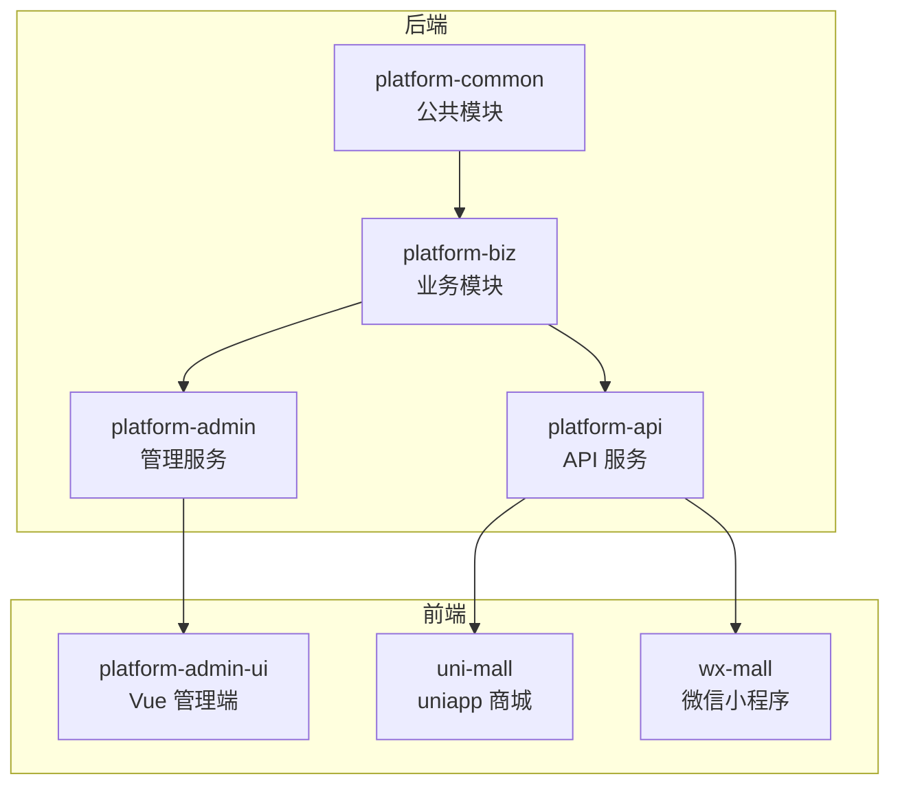
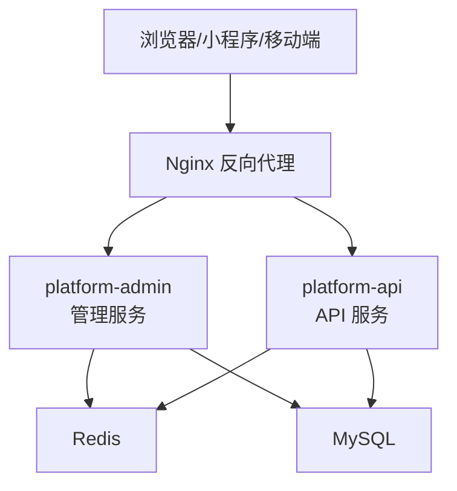
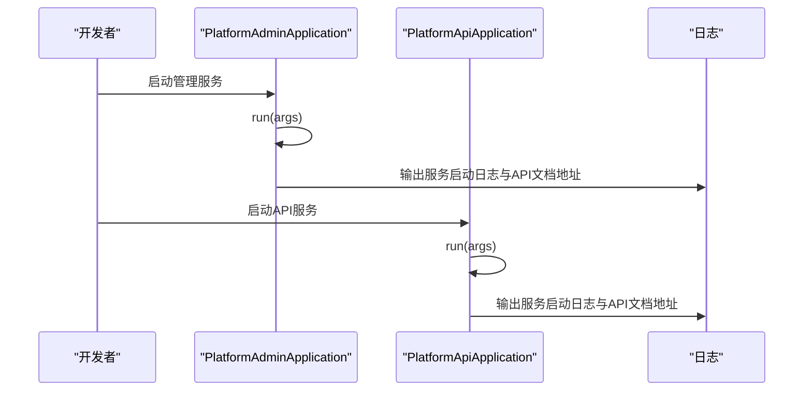
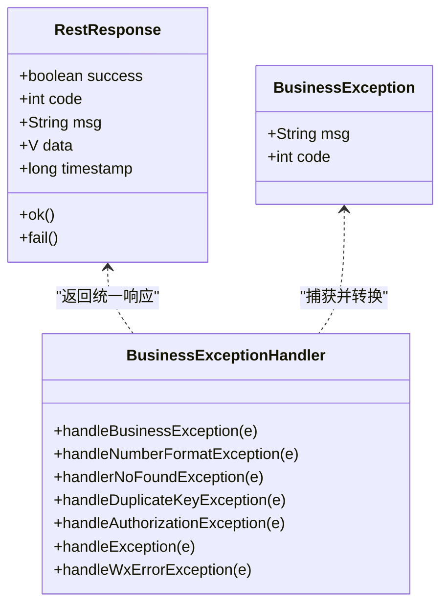
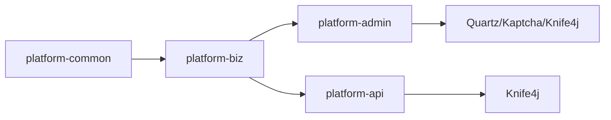

# 开发指南

<cite>
**本文引用的文件**
- [README.md](file://README.md)
- [pom.xml](file://platform-admin/pom.xml)
- [pom.xml](file://platform-api/pom.xml)
- [pom.xml](file://platform-biz/pom.xml)
- [pom.xml](file://platform-common/pom.xml)
- [application.yml](file://platform-admin/src/main/resources/application.yml)
- [PlatformAdminApplication.java](file://platform-admin/src/main/java/com/platform/PlatformAdminApplication.java)
- [PlatformApiApplication.java](file://platform-api/src/main/java/com/platform/PlatformApiApplication.java)
- [package.json](file://platform-admin-ui/package.json)
- [.eslintrc.js](file://platform-admin-ui/.eslintrc.js)
- [PlatformAdminApplicationTests.java](file://platform-admin/src/test/java/com/platform/PlatformAdminApplicationTests.java)
- [PlatformApiApplicationTests.java](file://platform-api/src/test/java/com/platform/PlatformApiApplicationTests.java)
- [Constant.java](file://platform-common/src/main/java/com/platform/common/utils/Constant.java)
- [RestResponse.java](file://platform-common/src/main/java/com/platform/common/utils/RestResponse.java)
- [BusinessException.java](file://platform-common/src/main/java/com/platform/common/exception/BusinessException.java)
- [BusinessExceptionHandler.java](file://platform-common/src/main/java/com/platform/common/exception/BusinessExceptionHandler.java)
</cite>

## 目录
1. [简介](#简介)
2. [项目结构](#项目结构)
3. [核心组件](#核心组件)
4. [架构总览](#架构总览)
5. [详细组件分析](#详细组件分析)
6. [依赖分析](#依赖分析)
7. [性能考虑](#性能考虑)
8. [故障排查指南](#故障排查指南)
9. [结论](#结论)
10. [附录](#附录)

## 简介
本开发指南面向平台的持续开发与维护，提供统一的代码规范、工具配置、测试策略、项目结构组织、模块划分与依赖管理策略、新功能开发流程、代码审查标准与质量保障措施，并总结常见问题的解决方案与性能优化建议。目标是帮助开发团队建立高效、一致、可演进的协作体系。

## 项目结构
平台采用多模块 Maven 结构，后端由 Spring Boot 提供服务，前端为 Vue2 + Element UI 的管理界面，同时包含微信小程序与 uniapp 商城客户端。核心模块如下：
- platform-common：公共能力与工具、异常与响应模型
- platform-biz：业务层与 Mapper/XML
- platform-admin：后台管理服务（Spring Boot）
- platform-api：微信小程序商城 API 服务（Spring Boot）
- platform-admin-ui：Vue 管理端前端工程
- uni-mall：uniapp 商城
- wx-mall：微信小程序原生版本
- _sql：数据库初始化脚本
- deploy：部署与 Nginx 配置
- docs：文档与架构图

图表来源
- [pom.xml](file://platform-admin/pom.xml)
- [pom.xml](file://platform-api/pom.xml)
- [pom.xml](file://platform-biz/pom.xml)
- [pom.xml](file://platform-common/pom.xml)

章节来源
- [README.md](file://README.md)
- [pom.xml](file://platform-admin/pom.xml)
- [pom.xml](file://platform-api/pom.xml)
- [pom.xml](file://platform-biz/pom.xml)
- [pom.xml](file://platform-common/pom.xml)

## 核心组件
- 启动类与服务入口
  - 平台管理服务启动类：[PlatformAdminApplication.java](file://platform-admin/src/main/java/com/platform/PlatformAdminApplication.java)
  - 平台 API 服务启动类：[PlatformApiApplication.java](file://platform-api/src/main/java/com/platform/PlatformApiApplication.java)
- 配置中心与环境
  - 管理服务配置：[application.yml](file://platform-admin/src/main/resources/application.yml)
- 公共响应与异常
  - 统一响应模型：[RestResponse.java](file://platform-common/src/main/java/com/platform/common/utils/RestResponse.java)
  - 业务异常模型：[BusinessException.java](file://platform-common/src/main/java/com/platform/common/exception/BusinessException.java)
  - 全局异常处理：[BusinessExceptionHandler.java](file://platform-common/src/main/java/com/platform/common/exception/BusinessExceptionHandler.java)
- 常量与约定
  - 通用常量：[Constant.java](file://platform-common/src/main/java/com/platform/common/utils/Constant.java)

章节来源
- [PlatformAdminApplication.java](file://platform-admin/src/main/java/com/platform/PlatformAdminApplication.java)
- [PlatformApiApplication.java](file://platform-api/src/main/java/com/platform/PlatformApiApplication.java)
- [application.yml](file://platform-admin/src/main/resources/application.yml)
- [RestResponse.java](file://platform-common/src/main/java/com/platform/common/utils/RestResponse.java)
- [BusinessException.java](file://platform-common/src/main/java/com/platform/common/exception/BusinessException.java)
- [BusinessExceptionHandler.java](file://platform-common/src/main/java/com/platform/common/exception/BusinessExceptionHandler.java)
- [Constant.java](file://platform-common/src/main/java/com/platform/common/utils/Constant.java)

## 架构总览
平台采用“双后端 + 多前端”的架构：
- 双后端：platform-admin（管理端接口）、platform-api（小程序商城接口）
- 前端：platform-admin-ui（Vue 管理端）、uni-mall（uniapp 商城）、wx-mall（微信小程序）
- 配置与文档：Nacos/配置中心（如需）、Swagger/OpenAPI 文档、Docker Compose 一键部署

图表来源
- [application.yml](file://platform-admin/src/main/resources/application.yml)

## 详细组件分析

### 启动类与服务生命周期
- 平台管理服务启动类负责排除安全与数据源自动装配、启用异步、动态数据源、并提供首页提示与日志输出。
- 平台 API 服务启动类同样排除部分自动装配，提供统一首页提示与日志输出。

图表来源
- [PlatformAdminApplication.java](file://platform-admin/src/main/java/com/platform/PlatformAdminApplication.java)
- [PlatformApiApplication.java](file://platform-api/src/main/java/com/platform/PlatformApiApplication.java)

章节来源
- [PlatformAdminApplication.java](file://platform-admin/src/main/java/com/platform/PlatformAdminApplication.java)
- [PlatformApiApplication.java](file://platform-api/src/main/java/com/platform/PlatformApiApplication.java)

### 配置与环境
- 管理服务配置要点
  - Undertow 线程与缓冲区调优
  - Swagger/OpenAPI 分组与 Knife4j 增强
  - Redis/JDBC/MVC/静态资源/邮件等基础配置
  - MyBatis-Plus Mapper 位置、驼峰映射、逻辑删除、ID 策略等
  - 支付宝/微信配置项（小程序、公众号、支付）

章节来源
- [application.yml](file://platform-admin/src/main/resources/application.yml)

### 公共响应与异常处理
- 统一响应模型 RestResponse 提供成功/失败的多种便捷构造方法，便于控制器返回一致的数据结构。
- 全局异常处理器 BusinessExceptionHandler 将业务异常、参数异常、鉴权异常、微信异常等转换为统一响应。

图表来源
- [RestResponse.java](file://platform-common/src/main/java/com/platform/common/utils/RestResponse.java)
- [BusinessException.java](file://platform-common/src/main/java/com/platform/common/exception/BusinessException.java)
- [BusinessExceptionHandler.java](file://platform-common/src/main/java/com/platform/common/exception/BusinessExceptionHandler.java)

章节来源
- [RestResponse.java](file://platform-common/src/main/java/com/platform/common/utils/RestResponse.java)
- [BusinessException.java](file://platform-common/src/main/java/com/platform/common/exception/BusinessException.java)
- [BusinessExceptionHandler.java](file://platform-common/src/main/java/com/platform/common/exception/BusinessExceptionHandler.java)

### 测试策略与示例
- 单元测试与集成测试
  - 管理服务测试示例：[PlatformAdminApplicationTests.java](file://platform-admin/src/test/java/com/platform/PlatformAdminApplicationTests.java)
  - API 服务测试示例：[PlatformApiApplicationTests.java](file://platform-api/src/test/java/com/platform/PlatformApiApplicationTests.java)
- 测试建议
  - 使用 Spring Boot Test 与 JUnit 5
  - 对外服务（微信支付、邮件）建议通过桩或沙箱环境测试
  - 对数据库操作建议使用事务回滚或测试专用库

章节来源
- [PlatformAdminApplicationTests.java](file://platform-admin/src/test/java/com/platform/PlatformAdminApplicationTests.java)
- [PlatformApiApplicationTests.java](file://platform-api/src/test/java/com/platform/PlatformApiApplicationTests.java)

### 依赖与构建
- 模块依赖关系
  - platform-admin 依赖 platform-biz
  - platform-api 依赖 platform-biz
  - platform-biz 依赖 platform-common
- 关键依赖
  - Quartz 定时任务、Kaptcha 图形验证码
  - MyBatis-Plus、动态数据源、Knife4j/SpringDoc OpenAPI
  - Spring Boot Maven 插件、Javadoc、资源过滤

章节来源
- [pom.xml](file://platform-admin/pom.xml)
- [pom.xml](file://platform-api/pom.xml)
- [pom.xml](file://platform-biz/pom.xml)
- [pom.xml](file://platform-common/pom.xml)

## 依赖分析

图表来源
- [pom.xml](file://platform-admin/pom.xml)
- [pom.xml](file://platform-api/pom.xml)
- [pom.xml](file://platform-biz/pom.xml)
- [pom.xml](file://platform-common/pom.xml)

章节来源
- [pom.xml](file://platform-admin/pom.xml)
- [pom.xml](file://platform-api/pom.xml)
- [pom.xml](file://platform-biz/pom.xml)
- [pom.xml](file://platform-common/pom.xml)

## 性能考虑
- 服务器与线程池
  - Undertow IO 线程与工作线程数量应结合 CPU 与并发场景调优
  - 静态资源与上传文件大小限制需按业务实际调整
- 缓存与数据库
  - Redis 连接池参数与超时设置需根据容量与延迟目标评估
  - MyBatis-Plus 逻辑删除、驼峰映射、Mapper 扫描路径应保持合理
- 接口文档与可观测性
  - 开启 Knife4j/SpringDoc 并按模块分组，提升联调效率
  - 生产环境建议开启系统监控与链路追踪（如需）

## 故障排查指南
- 常见异常与定位
  - 业务异常：通过 BusinessException 抛出，由 BusinessExceptionHandler 统一转为统一响应
  - 参数异常：NumberFormatException 统一提示“请求参数有误”
  - 路径不存在：NoHandlerFoundException 统一提示路径错误
  - 数据库重复键：DuplicateKeyException 统一提示记录已存在
  - 鉴权异常：AuthorizationException 统一提示无权限
  - 微信异常：WxErrorException 统一透传错误码与错误信息
- 日志与提示
  - 启动类会在控制台输出服务地址与文档地址，便于快速验证

章节来源
- [BusinessExceptionHandler.java](file://platform-common/src/main/java/com/platform/common/exception/BusinessExceptionHandler.java)
- [BusinessException.java](file://platform-common/src/main/java/com/platform/common/exception/BusinessException.java)
- [PlatformAdminApplication.java](file://platform-admin/src/main/java/com/platform/PlatformAdminApplication.java)
- [PlatformApiApplication.java](file://platform-api/src/main/java/com/platform/PlatformApiApplication.java)

## 结论
本指南提供了平台开发的标准化框架：统一的响应与异常模型、清晰的模块边界、完善的测试策略与依赖管理、以及可落地的性能与故障排查建议。建议团队在日常开发中严格遵循本指南的规范与流程，确保代码质量与交付效率。

## 附录

### 代码规范与注释标准
- Java 规范
  - 类型与方法命名采用帕斯卡命名法；常量全大写并以下划线分隔；包名全小写
  - 方法长度控制在单屏内，复杂逻辑拆分为私有方法；每个公共方法与类均提供必要注释
  - 异常处理遵循统一异常模型，避免吞异常或打印堆栈
- Vue 规范
  - 组件命名采用帕斯卡命名法；模板缩进与属性换行遵循 .eslintrc.js 规则
  - 使用 ESLint Standard 规范，禁止生产环境保留 debugger
- SQL 规范
  - 表与字段命名统一使用下划线命名；索引命名以 idx_ 或 uk_ 开头
  - DML 语句尽量使用参数化；避免在 SQL 中做复杂计算
- 注释规范
  - 类与方法使用 Swagger 注解描述参数与返回；枚举与常量提供用途说明
  - 复杂分支与算法提供简要注释，说明目的与边界条件

章节来源
- [.eslintrc.js](file://platform-admin-ui/.eslintrc.js)
- [RestResponse.java](file://platform-common/src/main/java/com/platform/common/utils/RestResponse.java)
- [Constant.java](file://platform-common/src/main/java/com/platform/common/utils/Constant.java)

### 开发工具配置建议
- IDE 设置
  - IntelliJ IDEA：启用 Lombok、Spring Boot 插件；配置 Editor > Code Style 与 File Template
  - VS Code（前端）：安装 ESLint、Vetur、Vue Language Features；启用 Prettier
- 插件推荐
  - Java：Lombok、MyBatis Log、Rainbow Brackets
  - Vue：ESLint、Vue Peek
- 调试技巧
  - 使用断点与条件断点定位异常；结合日志与统一异常处理器快速定位
- 性能分析
  - 使用 JVM 分析工具（如 JProfiler/Arthas）观察热点方法与 GC
  - 关注 Redis 与数据库慢查询日志

### 测试策略实施
- 单元测试
  - 针对 Service 层进行隔离测试，Mock DAO 与外部依赖
- 集成测试
  - 使用 Testcontainers 或本地容器启动 Redis/MySQL，覆盖完整流程
- 接口测试
  - 使用 Postman/VS Code REST Client 编写接口用例，结合 Swagger 文档
- 性能测试
  - 使用 JMeter/Gatling 对关键接口进行压测，关注 P95/P99 延迟与错误率

### 项目结构组织与模块划分
- 模块划分原则
  - platform-common：纯工具与异常，零业务耦合
  - platform-biz：业务域与 Mapper，按领域拆分
  - platform-admin/platform-api：职责单一的服务边界
  - platform-admin-ui：前端独立构建与发布
- 依赖管理
  - 子模块仅向上游暴露必要接口；避免跨模块循环依赖
  - 版本集中管理于父 POM，第三方依赖版本统一升级

### 新功能开发流程与代码审查
- 开发流程
  - 需求评审 → 设计文档（含接口与数据库设计）→ 开发分支 → 提交 PR → 代码审查 → CI/CD 部署 → 回归测试
- 代码审查标准
  - 代码风格与规范符合本指南；异常处理与日志完整；单元测试覆盖关键路径；接口文档同步更新
- 质量保障
  - 通过 SonarQube/SpotBugs/Checkstyle 等工具进行静态扫描
  - 通过自动化测试与冒烟测试保障主干稳定

### 常见问题与优化建议
- 启动失败
  - 检查 application.yml 中数据库、Redis、端口与上下文路径配置
- 接口 404
  - 确认 Swagger 分组与包扫描路径；确认 Nginx 反代路径
- 性能抖动
  - 检查 Redis 连接池与超时；排查慢 SQL 与缓存穿透
- 微信相关异常
  - 核对 appId/secret/keyPath 与回调地址；使用沙箱环境验证