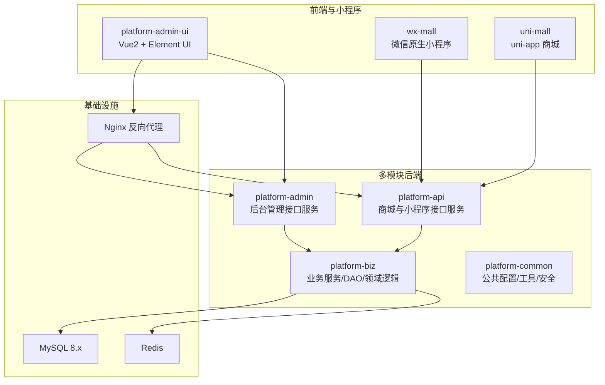
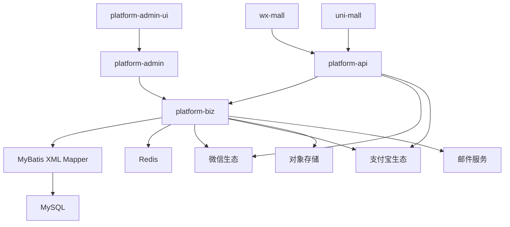
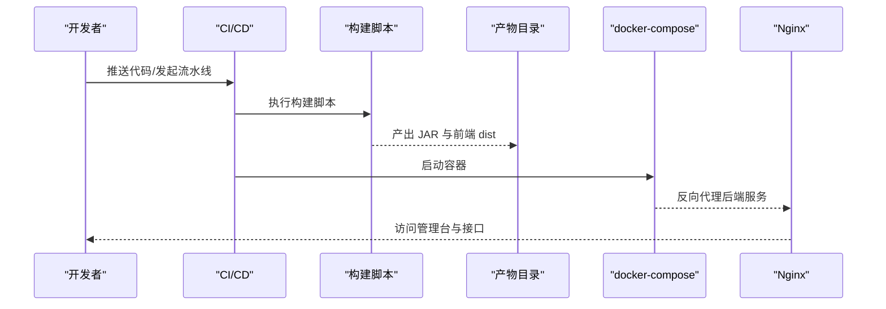
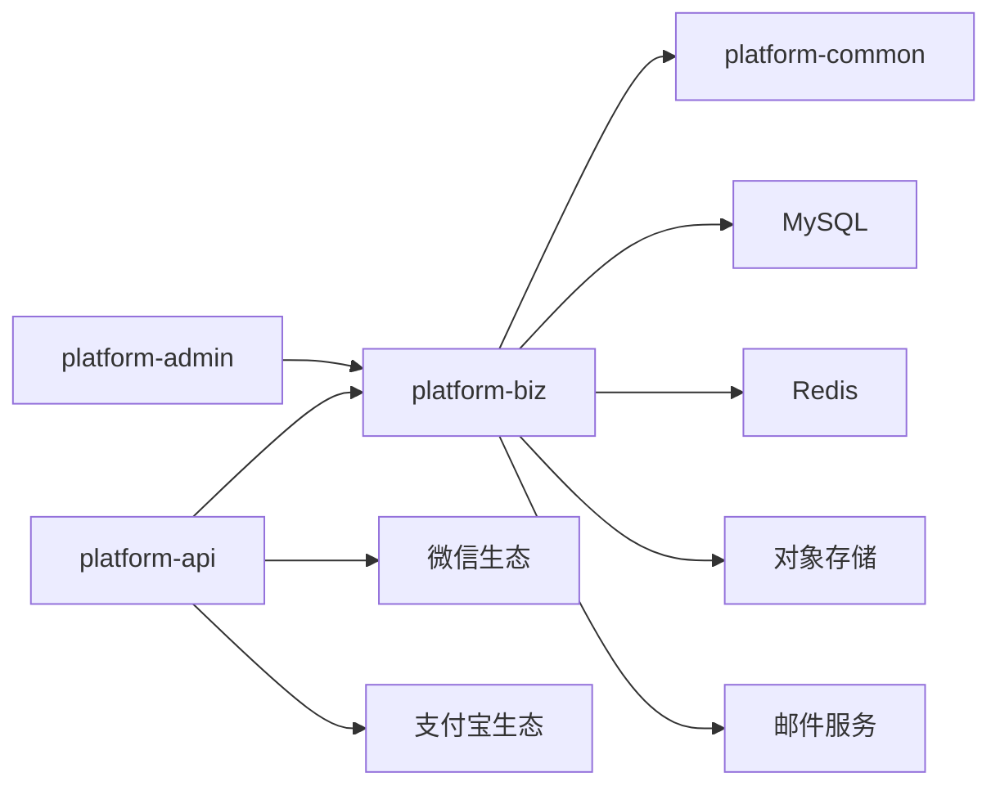

# 开发流程

<cite>
**本文引用的文件**   
- [README.md](file://README.md)
- [GitHelp.md](file://GitHelp.md)
- [Agents.md](file://Agents.md)
- [pom.xml](file://pom.xml)
- [.gitignore](file://.gitignore)
- [platform-admin/src/main/java/com/platform/PlatformAdminApplication.java](file://platform-admin/src/main/java/com/platform/PlatformAdminApplication.java)
- [platform-api/src/main/java/com/platform/PlatformApiApplication.java](file://platform-api/src/main/java/com/platform/PlatformApiApplication.java)
- [platform-admin/src/main/resources/application.yml](file://platform-admin/src/main/resources/application.yml)
- [platform-api/src/main/resources/application.yml](file://platform-api/src/main/resources/application.yml)
- [platform-admin-ui/package.json](file://platform-admin-ui/package.json)
- [platform-admin-ui/.eslintrc.js](file://platform-admin-ui/.eslintrc.js)
- [platform-admin-ui/.editorconfig](file://platform-admin-ui/.editorconfig)
- [platform-admin-ui/build/webpack.dev.conf.js](file://platform-admin-ui/build/webpack.dev.conf.js)
- [scripts/build-jars.sh](file://scripts/build-jars.sh)
- [scripts/build-admin-ui.sh](file://scripts/build-admin-ui.sh)
- [docker-compose.yml](file://docker-compose.yml)
- [deploy/nginx/default.conf](file://deploy/nginx/default.conf)
- [docs/系统架构说明.md](file://docs/系统架构说明.md)
</cite>

## 目录
1. [引言](#引言)
2. [项目结构](#项目结构)
3. [核心组件](#核心组件)
4. [架构总览](#架构总览)
5. [详细组件分析](#详细组件分析)
6. [依赖分析](#依赖分析)
7. [性能考虑](#性能考虑)
8. [故障排查指南](#故障排查指南)
9. [结论](#结论)
10. [附录](#附录)

## 引言
本文件面向平台项目的开发团队，旨在建立标准化的开发流程，覆盖需求分析、设计评审、开发计划、质量保证、代码规范、代码审查、持续集成、版本发布、问题跟踪与紧急修复，以及 Git 工作流指导，确保开发过程的规范性与可追溯性。

## 项目结构
项目采用多模块 Maven 架构，包含后端服务、前端界面、小程序与 uni-app 商城、公共模块与基础设施编排。整体结构清晰，便于分层开发与独立演进。

图表来源
- [docs/系统架构说明.md:26-79](file://docs/系统架构说明.md#L26-L79)
- [docker-compose.yml:1-115](file://docker-compose.yml#L1-L115)

章节来源
- [README.md:59-70](file://README.md#L59-L70)
- [docs/系统架构说明.md:1-231](file://docs/系统架构说明.md#L1-L231)

## 核心组件
- 后端服务
  - 平台管理服务：platform-admin，端口 8080，上下文路径 /platform-framework，负责系统管理、任务调度、OSS、微信管理等。
  - 商城接口服务：platform-api，端口 8081，上下文路径 /platform-framework-api，负责登录、商品、订单、支付等。
- 业务与公共模块
  - platform-biz：承载 Service、DAO、XML Mapper 与领域逻辑。
  - platform-common：公共配置、工具、Redis、异常与安全处理。
- 前端与小程序
  - platform-admin-ui：Vue2 + Element UI 后台管理界面。
  - wx-mall：微信原生小程序。
  - uni-mall：uni-app 商城。
- 基础设施与编排
  - docker-compose：一键拉起 MySQL、Redis、后端服务与 Nginx。
  - Nginx：托管静态资源并反向代理后端服务。

章节来源
- [platform-admin/src/main/java/com/platform/PlatformAdminApplication.java:42-93](file://platform-admin/src/main/java/com/platform/PlatformAdminApplication.java#L42-L93)
- [platform-api/src/main/java/com/platform/PlatformApiApplication.java:41-92](file://platform-api/src/main/java/com/platform/PlatformApiApplication.java#L41-L92)
- [platform-admin/src/main/resources/application.yml:1-205](file://platform-admin/src/main/resources/application.yml#L1-L205)
- [platform-api/src/main/resources/application.yml:1-195](file://platform-api/src/main/resources/application.yml#L1-L195)
- [docker-compose.yml:1-115](file://docker-compose.yml#L1-L115)
- [deploy/nginx/default.conf:1-28](file://deploy/nginx/default.conf#L1-L28)

## 架构总览
系统采用“多前端入口 + 双后端服务 + 共享业务核心 + XML Mapper 驱动 + 多外部集成”的形态。开发与排障应围绕真实调用链路逐层下钻，优先定位业务核心模块与数据访问层。

图表来源
- [docs/系统架构说明.md:131-158](file://docs/系统架构说明.md#L131-L158)

章节来源
- [docs/系统架构说明.md:1-231](file://docs/系统架构说明.md#L1-L231)

## 详细组件分析

### 需求分析与评审流程
- 需求评审
  - 明确业务目标与验收标准，识别跨模块依赖（如微信/支付/存储）。
  - 输出需求文档与原型，组织跨团队评审。
- 技术方案设计
  - 基于现有架构选择服务边界与模块依赖，优先复用 platform-biz 与 platform-common。
  - 明确数据访问路径（controller → service → DAO/XML → MySQL），评估复杂度与性能。
- 开发计划制定
  - 拆分任务与里程碑，明确前后端联调入口与端口、上下文路径。
  - 评估第三方集成（微信/支付宝/短信/OSS）的配置与回调地址。
- 风险评估
  - 列举技术风险（第三方接口变更、证书有效期、数据库锁/分页性能）与预案。

章节来源
- [docs/系统架构说明.md:168-218](file://docs/系统架构说明.md#L168-L218)

### 代码开发规范
- 分支管理策略
  - 主干保护：master/main 仅允许通过 Pull Request 合并。
  - 功能分支：feature/<issue>-描述，修复分支：fix/<issue>-描述，热修复：hotfix/<issue>-描述。
  - 分支命名与清理：统一命名，定期清理已合并分支。
- 提交信息规范
  - 类型(scope): 概述
  - 例如：feat(platform-biz): 新增订单状态枚举与校验
  - 说明：类型包括 feat、fix、docs、style、refactor、perf、test、chore；scope 指明模块；概述简洁描述变更。
- 代码合并流程
  - PR 必须关联 Issue；至少一名审查者批准；通过 CI；无冲突方可合并。
- 冲突解决方法
  - 优先 rebase 保持线性历史；若存在复杂冲突，拆分为更小 PR 并及时同步主干。

章节来源
- [GitHelp.md](file://GitHelp.md)
- [Agents.md](file://Agents.md)

### 代码审查制度
- 审查清单
  - 代码可读性与一致性（命名、缩进、注释）。
  - 业务正确性（边界条件、事务、幂等性）。
  - 性能与安全（SQL 注入、XSS、敏感信息泄露）。
  - 测试覆盖与回归验证。
  - 第三方集成配置与回调地址一致性。
- 审查标准
  - 必须通过静态检查（ESLint、EditorConfig 规则）。
  - Java 代码遵循 Spring Boot 与 MyBatis-Plus 最佳实践。
  - 前端代码遵循 ESLint Standard 风格与 EditorConfig。
- 反馈处理
  - 明确修改意见与截止时间；修改后重新审查直至通过。
- 质量门禁
  - 未满足门禁不得合并；阻断式检查包括：CI 通过、无新增告警、无破坏性变更。

章节来源
- [platform-admin-ui/.eslintrc.js:1-67](file://platform-admin-ui/.eslintrc.js#L1-L67)
- [platform-admin-ui/.editorconfig:1-10](file://platform-admin-ui/.editorconfig#L1-L10)
- [platform-admin/src/main/resources/application.yml:69-142](file://platform-admin/src/main/resources/application.yml#L69-L142)
- [platform-api/src/main/resources/application.yml:58-122](file://platform-api/src/main/resources/application.yml#L58-L122)

### 持续集成与部署
- 自动化构建
  - Maven 多模块打包：scripts/build-jars.sh 按 profile 打包 admin 与 api 服务。
  - 前端构建：scripts/build-admin-ui.sh 执行 npm run build 并输出到 deploy/packages/platform-admin-ui-dist。
- 测试执行
  - 单元测试：Spring Boot Test 与 JUnit。
  - 前端 Lint：ESLint Standard 规则。
- 部署触发
  - docker-compose.yml 一键启动：MySQL、Redis、后端服务与 Nginx。
  - Nginx 反向代理：/platform-framework → platform-admin，/platform-framework-api → platform-api。
- 回滚机制
  - 通过镜像版本与环境变量控制；必要时回退到上一稳定镜像；结合健康检查与日志定位问题。

图表来源
- [scripts/build-jars.sh:1-21](file://scripts/build-jars.sh#L1-L21)
- [scripts/build-admin-ui.sh:1-20](file://scripts/build-admin-ui.sh#L1-L20)
- [docker-compose.yml:1-115](file://docker-compose.yml#L1-L115)
- [deploy/nginx/default.conf:1-28](file://deploy/nginx/default.conf#L1-L28)

章节来源
- [scripts/build-jars.sh:1-21](file://scripts/build-jars.sh#L1-L21)
- [scripts/build-admin-ui.sh:1-20](file://scripts/build-admin-ui.sh#L1-L20)
- [docker-compose.yml:1-115](file://docker-compose.yml#L1-L115)
- [deploy/nginx/default.conf:1-28](file://deploy/nginx/default.conf#L1-L28)

### 版本发布管理
- 版本号规则
  - 采用语义化版本：主版本.次版本.修订号；重大变更提升主版本，兼容新增功能提升次版本，兼容修复提升修订号。
- 发布计划
  - 每周固定窗口发布；发布前完成需求冻结、回归测试与文档更新。
- 变更日志
  - 维护 CHANGELOG，记录特性、修复、废弃与迁移指南。
- 用户通知
  - 通过公告与邮件通知用户发布内容与注意事项。

章节来源
- [pom.xml:1-481](file://pom.xml#L1-L481)

### 问题跟踪与缺陷管理
- 问题跟踪
  - 使用 Issue 模板记录缺陷、任务与改进项；明确优先级与负责人。
- 缺陷管理
  - 分类：P0（阻断）、P1（高）、P2（中）、P3（低）；按优先级排期修复。
- 紧急修复流程
  - P0/P1 紧急修复走 hotfix 分支，快速回归测试后合并主干并打补丁标签。

章节来源
- [GitHelp.md](file://GitHelp.md)
- [Agents.md](file://Agents.md)

### Git 工作流指导
- 分支模型
  - main/master：受保护主干；feature/*：功能开发；hotfix/*：紧急修复；release/*：发布准备。
- 提交与合并
  - 提交信息遵循规范；PR 合并前必须审查与 CI 通过。
- 日志与审计
  - 保留可追溯的提交历史；必要时使用 git blame 与 git log 定位问题。

章节来源
- [GitHelp.md](file://GitHelp.md)
- [Agents.md](file://Agents.md)

## 依赖分析
- 模块依赖
  - platform-admin → platform-biz
  - platform-api → platform-biz
  - platform-biz → platform-common
- 外部依赖
  - 微信生态（小程序/公众号/支付）、支付宝生态（支付/OSS/短信）、对象存储（本地/Qiniu/COS/MinIO/OBS）、邮件服务。
- 配置与环境
  - 多环境配置：dev/test/prod；Docker profile 自动加载 application-docker.yml。

图表来源
- [docs/系统架构说明.md:119-129](file://docs/系统架构说明.md#L119-L129)

章节来源
- [pom.xml:42-47](file://pom.xml#L42-L47)
- [platform-admin/src/main/resources/application.yml:69-142](file://platform-admin/src/main/resources/application.yml#L69-L142)
- [platform-api/src/main/resources/application.yml:58-122](file://platform-api/src/main/resources/application.yml#L58-L122)

## 性能考虑
- 数据访问层
  - XML Mapper 与 MyBatis-Plus 配置：合理使用分页、结果映射与联表查询；避免 N+1 查询。
- 缓存策略
  - Redis 缓存热点数据与会话；设置合理过期策略与容量上限。
- 并发与线程
  - Undertow 线程池参数：IO 线程与 Worker 线程数量与 CPU 核心匹配。
- 前端性能
  - ESLint 与 EditorConfig 保障代码质量；Webpack 开发配置启用 HMR 与按需加载。

章节来源
- [platform-admin/src/main/resources/application.yml:3-18](file://platform-admin/src/main/resources/application.yml#L3-L18)
- [platform-api/src/main/resources/application.yml:3-18](file://platform-api/src/main/resources/application.yml#L3-L18)
- [platform-admin-ui/.eslintrc.js:24-65](file://platform-admin-ui/.eslintrc.js#L24-L65)
- [platform-admin-ui/build/webpack.dev.conf.js:24-46](file://platform-admin-ui/build/webpack.dev.conf.js#L24-L46)

## 故障排查指南
- 查询与列表类问题
  - 按顺序排查：前端请求参数 → controller 入参 → service 调用路径 → DAO 接口 → XML mapper 条件与映射。
- 权限与登录问题
  - 区分两条链路：后台链路（Shiro/OAuth2）与用户侧链路（JWT/LoginUser 注入）。
- 第三方集成问题
  - 核对应用配置、证书/密钥、回调地址与第三方账号环境。
- 本地联调关注点
  - 端口与上下文路径、profile、数据源与 Redis、微信/支付/存储配置。

章节来源
- [docs/系统架构说明.md:168-218](file://docs/系统架构说明.md#L168-L218)

## 结论
通过标准化的需求分析、设计评审、开发计划、质量门禁与代码审查，配合自动化构建与 Docker 编排，以及完善的版本发布与问题跟踪流程，团队可在保证质量的前提下高效交付迭代。建议持续优化 CI 覆盖率与性能监控，确保系统稳定性与可维护性。

## 附录
- 本地开发与启动
  - Docker 一键启动：scripts/docker-up.sh；停止：scripts/docker-down.sh。
  - 前端开发：npm run dev；生产构建：npm run build。
- 配置文件
  - application.yml：端口、上下文路径、数据库、Redis、MyBatis-Plus、第三方集成配置。
  - application-docker.yml：Docker 环境专用配置（由 docker profile 自动加载）。

章节来源
- [README.md:102-153](file://README.md#L102-L153)
- [platform-admin-ui/package.json:8-13](file://platform-admin-ui/package.json#L8-L13)
- [docker-compose.yml:56-96](file://docker-compose.yml#L56-L96)