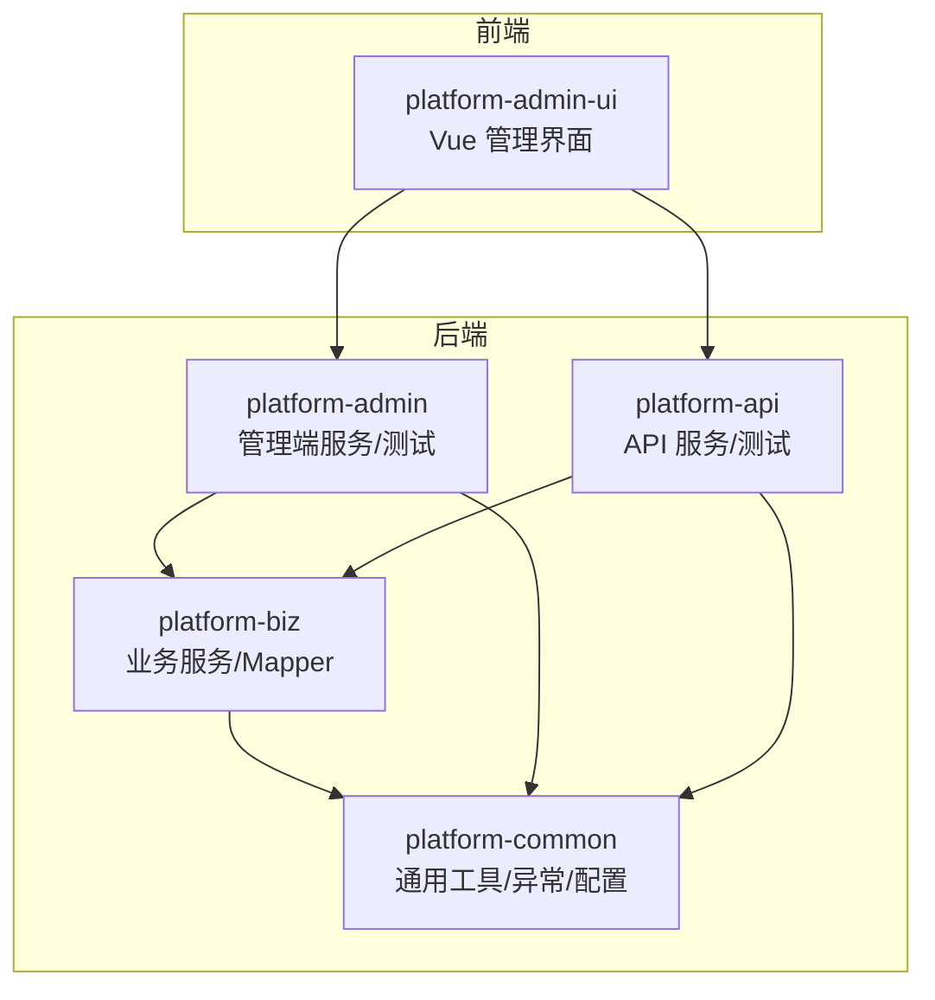
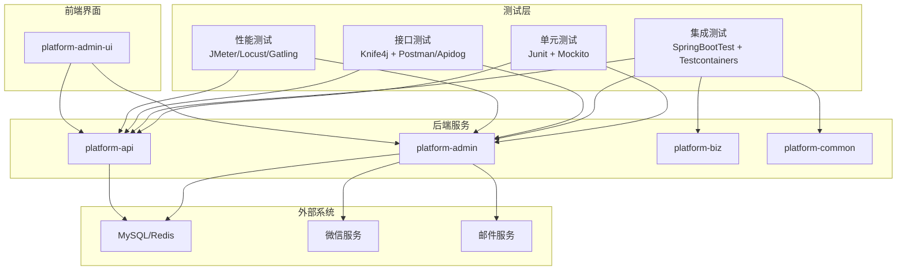
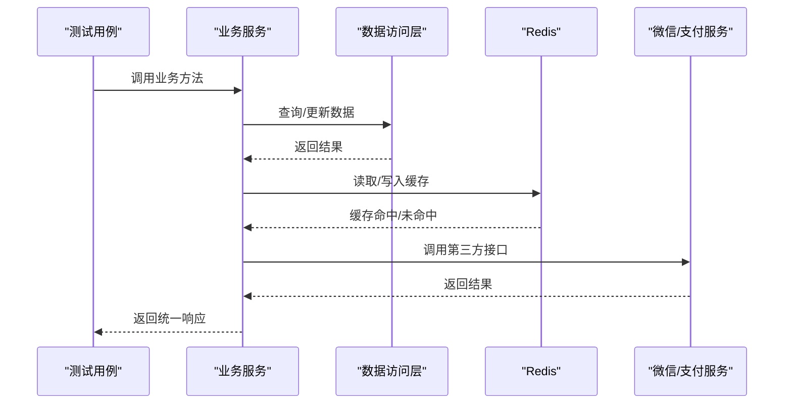
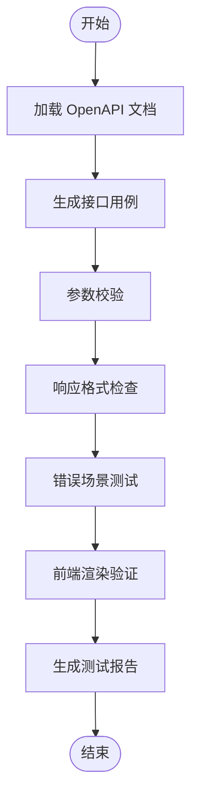
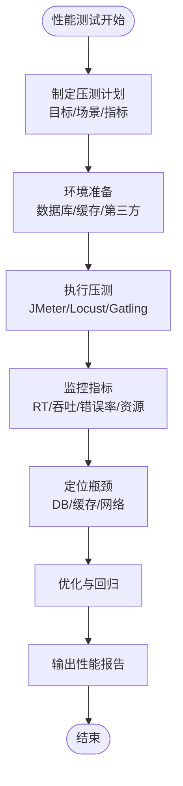
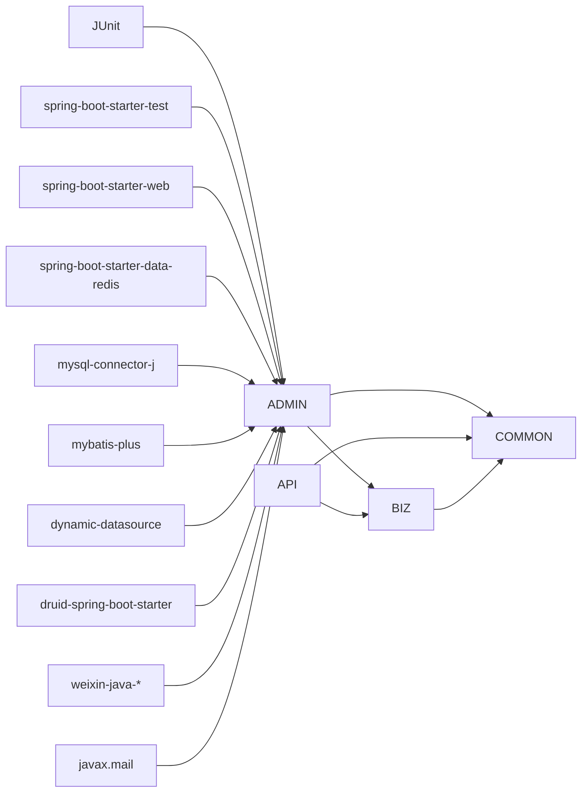

# 测试策略

<cite>
**本文引用的文件**   
- [平台聚合工程 pom.xml](file://pom.xml)
- [平台公共模块 platform-common](file://platform-common/src/main/java/com/platform/common/utils/RestResponse.java)
- [平台公共模块 platform-common](file://platform-common/src/main/java/com/platform/common/utils/Query.java)
- [平台公共模块 platform-common](file://platform-common/src/main/java/com/platform/common/utils/Constant.java)
- [平台公共模块 platform-common](file://platform-common/src/main/java/com/platform/common/exception/BusinessException.java)
- [平台公共模块 platform-common](file://platform-common/src/main/java/com/platform/common/utils/JsonUtils.java)
- [平台公共模块 platform-common](file://platform-common/src/main/java/com/platform/config/RedisConfig.java)
- [平台管理端 platform-admin 应用测试](file://platform-admin/src/test/java/com/platform/PlatformAdminApplicationTests.java)
- [平台 API 端 platform-api 应用测试](file://platform-api/src/test/java/com/platform/PlatformApiApplicationTests.java)
- [平台管理端 application-test.yml](file://platform-admin/src/main/resources/application-test.yml)
- [平台 API 端 application-test.yml](file://platform-api/src/main/resources/application-test.yml)
- [平台管理端 Swagger 配置](file://platform-admin/src/main/java/com/platform/config/SwaggerConfig.java)
- [平台管理端 logback 日志配置](file://platform-admin/src/main/resources/logback-spring.xml)
- [平台前端配置（测试环境）](file://platform-admin-ui/config/test.env.js)
- [平台前端配置（开发环境）](file://platform-admin-ui/config/dev.env.js)
- [平台前端请求封装](file://platform-admin-ui/src/utils/httpRequest.js)
- [平台前端工具集](file://platform-admin-ui/src/utils/index.js)
- [平台前端路由](file://platform-admin-ui/src/router/index.js)
- [平台前端字典组件](file://platform-admin-ui/src/components/el-dict/index.vue)
- [平台前端表树组件](file://platform-admin-ui/src/components/table-tree-column/index.vue)
- [平台前端通用样式](file://platform-admin-ui/src/assets/css/wx-menu.css)
- [平台前端主题样式](file://platform-admin-ui/src/element-ui-theme/index.js)
- [平台前端主应用入口](file://platform-admin-ui/src/App.vue)
- [平台前端主应用入口](file://platform-admin-ui/src/main.js)
- [平台前端首页](file://platform-admin-ui/src/views/common/home.vue)
- [平台前端登录页](file://platform-admin-ui/src/views/common/login.vue)
- [平台前端主题切换页](file://platform-admin-ui/src/views/common/theme.vue)
- [平台前端系统配置管理](file://platform-admin-ui/src/views/modules/sys/config.vue)
- [平台前端系统字典管理](file://platform-admin-ui/src/views/modules/sys/dict.vue)
- [平台前端定时任务管理](file://platform-admin-ui/src/views/modules/job/schedule.vue)
- [平台前端定时任务日志](file://platform-admin-ui/src/views/modules/job/schedule-log.vue)
- [平台前端定时任务新增/编辑](file://platform-admin-ui/src/views/modules/job/schedule-add-or-update.vue)
- [平台前端微信用户管理](file://platform-admin-ui/src/views/modules/wx/wx-user.vue)
- [平台前端微信用户新增/编辑](file://platform-admin-ui/src/views/modules/wx/wx-user-add-or-update.vue)
- [平台前端商品分类管理](file://platform-admin-ui/src/views/modules/mall/category.vue)
- [平台前端商品品牌管理](file://platform-admin-ui/src/views/modules/mall/brand.vue)
- [平台前端商品管理](file://platform-admin-ui/src/views/modules/mall/goods.vue)
- [平台前端订单管理](file://platform-admin-ui/src/views/modules/mall/order.vue)
- [平台前端订单详情](file://platform-admin-ui/src/views/modules/mall/order-detail.vue)
- [平台前端购物车管理](file://platform-admin-ui/src/views/modules/mall/cart.vue)
- [平台前端收货地址管理](file://platform-admin-ui/src/views/modules/mall/address.vue)
- [平台前端收藏管理](file://platform-admin-ui/src/views/modules/mall/collect.vue)
- [平台前端评论管理](file://platform-admin-ui/src/views/modules/mall/comment.vue)
- [平台前端优惠券管理](file://platform-admin-ui/src/views/modules/mall/coupon.vue)
- [平台前端意见反馈管理](file://platform-admin-ui/src/views/modules/mall/feedback.vue)
- [平台前端足迹管理](file://platform-admin-ui/src/views/modules/mall/footprint.vue)
- [平台前端搜索历史管理](file://platform-admin-ui/src/views/modules/mall/searchhistory.vue)
- [平台前端专题管理](file://platform-admin-ui/src/views/modules/mall/topic.vue)
- [平台前端专题分类管理](file://platform-admin-ui/src/views/modules/mall/topiccategory.vue)
- [平台前端规格管理](file://platform-admin-ui/src/views/modules/mall/specification.vue)
- [平台前端属性管理](file://platform-admin-ui/src/views/modules/mall/attribute.vue)
- [平台前端属性分类管理](file://platform-admin-ui/src/views/modules/mall/attributecategory.vue)
- [平台前端广告位管理](file://platform-admin-ui/src/views/modules/mall/adposition.vue)
- [platform-admin 模块 pom](file://platform-admin/pom.xml)
- [platform-api 模块 pom](file://platform-api/pom.xml)
- [platform-biz 模块 pom](file://platform-biz/pom.xml)
</cite>

## 目录
1. 引言
2. 项目结构
3. 核心组件
4. 架构总览
5. 详细组件分析
6. 依赖分析
7. 性能考虑
8. 故障排查指南
9. 结论
10. 附录

## 引言
本测试策略面向平台多模块（管理端、API 端、业务层、公共层与前端）的统一测试体系，覆盖单元测试、集成测试、接口测试与性能测试。目标包括：
- 制定单元测试标准：用例设计原则、Mock 使用、断言规范与覆盖率要求
- 建立集成测试流程：模块间接口、数据库与第三方服务验证
- 规范接口测试方案：API 用例设计、参数校验、响应格式与错误场景
- 明确性能测试策略：负载、压力、并发与指标监控
- 提供测试数据管理、测试环境搭建与 CI 中的测试自动化配置
- 输出测试报告、缺陷跟踪与回归流程建议
- 给出各阶段测试工具推荐与使用指南

## 项目结构
平台采用 Maven 多模块结构，核心模块包括：
- 平台公共模块 platform-common：通用工具、异常、配置与缓存
- 业务模块 platform-biz：业务服务与 Mapper
- 管理端模块 platform-admin：管理后台服务与测试
- API 端模块 platform-api：对外 API 服务与测试
- 前端模块 platform-admin-ui：Vue 管理界面

**图表来源**
- [平台聚合工程 pom.xml:42-46](file://pom.xml#L42-L46)
- [platform-admin 模块 pom:36-40](file://platform-admin/pom.xml#L36-L40)
- [platform-api 模块 pom:16-21](file://platform-api/pom.xml#L16-L21)
- [platform-biz 模块 pom:24-29](file://platform-biz/pom.xml#L24-L29)

**章节来源**
- [平台聚合工程 pom.xml:42-46](file://pom.xml#L42-L46)
- [platform-admin 模块 pom:36-40](file://platform-admin/pom.xml#L36-L40)
- [platform-api 模块 pom:16-21](file://platform-api/pom.xml#L16-L21)
- [platform-biz 模块 pom:24-29](file://platform-biz/pom.xml#L24-L29)

## 核心组件
- 响应模型 RestResponse：统一返回结构，便于接口测试断言
- 查询参数 Query：分页与排序参数封装，便于集成测试构造复杂查询
- 常量 Constant：系统常量与枚举，保障测试用例一致性
- 业务异常 BusinessException：用于断言业务失败场景
- JSON 工具 JsonUtils：辅助断言响应体格式
- 缓存配置 RedisConfig：用于缓存相关集成测试
- Swagger 配置 SwaggerConfig：用于接口文档与接口测试协同
- 日志配置 logback-spring.xml：用于测试日志级别与输出控制

**章节来源**
- [平台公共模块 platform-common:34-121](file://platform-common/src/main/java/com/platform/common/utils/RestResponse.java#L34-L121)
- [平台公共模块 platform-common:32-98](file://platform-common/src/main/java/com/platform/common/utils/Query.java#L32-L98)
- [平台公共模块 platform-common:26-239](file://platform-common/src/main/java/com/platform/common/utils/Constant.java#L26-L239)
- [平台公共模块 platform-common:28-73](file://platform-common/src/main/java/com/platform/common/exception/BusinessException.java#L28-L73)
- [平台公共模块 platform-common:27-34](file://platform-common/src/main/java/com/platform/common/utils/JsonUtils.java#L27-L34)
- [平台公共模块 platform-common:56-181](file://platform-common/src/main/java/com/platform/config/RedisConfig.java#L56-L181)
- [平台管理端 Swagger 配置:21-31](file://platform-admin/src/main/java/com/platform/config/SwaggerConfig.java#L21-L31)
- [平台管理端 logback 日志配置:82-93](file://platform-admin/src/main/resources/logback-spring.xml#L82-L93)

## 架构总览
测试架构围绕“后端服务 + 前端界面 + 第三方服务”的整体链路展开，测试贯穿单元、集成、接口与性能四个层面。

**图表来源**
- [平台聚合工程 pom.xml:92-125](file://pom.xml#L92-L125)
- [平台管理端 application-test.yml:7-51](file://platform-admin/src/main/resources/application-test.yml#L7-L51)
- [平台 API 端 application-test.yml:7-51](file://platform-api/src/main/resources/application-test.yml#L7-L51)

## 详细组件分析

### 单元测试策略
- 测试框架与工具
  - JUnit 与 Spring Boot Test：用于加载上下文与依赖注入
  - Mockito：用于 Mock 外部依赖（如第三方 SDK、DAO）
  - Lombok 注解：简化测试类构造
- 用例设计原则
  - 一个断言一条用例：聚焦单一行为
  - 输入边界与异常分支：覆盖空值、非法字符、超长字段
  - 状态不变性：确保纯函数与无副作用方法的幂等性
- Mock 对象使用
  - 对 DAO/Service 层进行 Mock，避免真实数据库访问
  - 对微信、支付等第三方 SDK 进行 Mock 或 Fake 实现
- 断言编写规范
  - 使用 RestResponse 统一断言 success/code/msg/data
  - 使用 BusinessException 断言业务异常码与消息
  - 使用 JsonUtils 辅助断言复杂 JSON 结构
- 覆盖率要求
  - 行为覆盖率 ≥ 80%，分支覆盖率 ≥ 60%
  - 关键路径（支付、下单、缓存）达到 100%

**章节来源**
- [平台公共模块 platform-common:79-121](file://platform-common/src/main/java/com/platform/common/utils/RestResponse.java#L79-L121)
- [平台公共模块 platform-common:28-73](file://platform-common/src/main/java/com/platform/common/exception/BusinessException.java#L28-L73)
- [平台公共模块 platform-common:27-34](file://platform-common/src/main/java/com/platform/common/utils/JsonUtils.java#L27-L34)

### 集成测试流程
- 模块间接口测试
  - 使用@SpringBootTest 加载 admin 与 api 模块上下文
  - 通过 @Autowired 注入服务，验证跨模块调用链
  - 示例参考：微信用户同步任务的集成验证
- 数据库集成测试
  - application-test.yml 中配置 Druid 连接池与慢 SQL 监控
  - 使用 Query 封装分页与排序参数，验证复杂查询
  - 建议使用 Testcontainers 启动 MySQL/Redis，隔离测试数据
- 第三方服务集成验证
  - 邮件服务、微信支付、微信小程序服务的端到端验证
  - 使用 Mock 或沙箱环境，避免真实扣款与短信发送
- 缓存集成测试
  - 借助 RedisConfig 配置，验证缓存读写与 TTL

**图表来源**
- [平台管理端 platform-admin 应用测试:15-19](file://platform-admin/src/test/java/com/platform/PlatformAdminApplicationTests.java#L15-L19)
- [平台 API 端 platform-api 应用测试:32-116](file://platform-api/src/test/java/com/platform/PlatformApiApplicationTests.java#L32-L116)
- [平台公共模块 platform-common:94-151](file://platform-common/src/main/java/com/platform/config/RedisConfig.java#L94-L151)

**章节来源**
- [平台管理端 platform-admin 应用测试:15-19](file://platform-admin/src/test/java/com/platform/PlatformAdminApplicationTests.java#L15-L19)
- [平台 API 端 platform-api 应用测试:32-116](file://platform-api/src/test/java/com/platform/PlatformApiApplicationTests.java#L32-L116)
- [平台管理端 application-test.yml:7-51](file://platform-admin/src/main/resources/application-test.yml#L7-L51)
- [平台 API 端 application-test.yml:7-51](file://platform-api/src/main/resources/application-test.yml#L7-L51)
- [平台公共模块 platform-common:49-84](file://platform-common/src/main/java/com/platform/common/utils/Query.java#L49-L84)
- [平台公共模块 platform-common:94-151](file://platform-common/src/main/java/com/platform/config/RedisConfig.java#L94-L151)

### 接口测试方案
- API 文档与用例设计
  - 基于 Knife4j/Swagger 生成 OpenAPI 文档，导出用例
  - SwaggerConfig 保证标签顺序与全局定制
- 参数验证
  - 必填参数、长度限制、格式校验（手机号、邮箱、金额）
  - 分页参数（page/limit/sidx/asc）与排序组合
- 响应格式检查
  - 使用 RestResponse 统一断言 success/code/msg/data
  - 使用 JsonUtils 校验复杂嵌套结构
- 错误场景测试
  - 业务异常：BusinessException 断言 code 与 msg
  - 网络异常：超时、DNS 解析失败、第三方服务不可用
  - 权限异常：未登录、无权限访问
- 前端联动
  - 前端请求封装 httpRequest.js 与路由配置，确保请求正确性
  - 主题、字典、表格树等组件的渲染与交互验证

**图表来源**
- [平台管理端 Swagger 配置:21-31](file://platform-admin/src/main/java/com/platform/config/SwaggerConfig.java#L21-L31)
- [平台管理端 Swagger 配置:85-93](file://platform-admin/src/main/java/com/platform/config/SwaggerConfig.java#L85-L93)
- [平台公共模块 platform-common:79-121](file://platform-common/src/main/java/com/platform/common/utils/RestResponse.java#L79-L121)
- [平台公共模块 platform-common:27-34](file://platform-common/src/main/java/com/platform/common/utils/JsonUtils.java#L27-L34)
- [平台前端请求封装](file://platform-admin-ui/src/utils/httpRequest.js)
- [平台前端路由](file://platform-admin-ui/src/router/index.js)

**章节来源**
- [平台管理端 Swagger 配置:21-31](file://platform-admin/src/main/java/com/platform/config/SwaggerConfig.java#L21-L31)
- [平台管理端 Swagger 配置:85-93](file://platform-admin/src/main/java/com/platform/config/SwaggerConfig.java#L85-L93)
- [平台公共模块 platform-common:79-121](file://platform-common/src/main/java/com/platform/common/utils/RestResponse.java#L79-L121)
- [平台公共模块 platform-common:27-34](file://platform-common/src/main/java/com/platform/common/utils/JsonUtils.java#L27-L34)
- [平台前端请求封装](file://platform-admin-ui/src/utils/httpRequest.js)
- [平台前端路由](file://platform-admin-ui/src/router/index.js)

### 性能测试策略
- 负载测试
  - 使用 JMeter/Locust/Gatling 构造并发用户，压测登录、商品列表、下单等关键路径
  - 目标：95% 响应时间 ≤ X ms；错误率 ≤ Y%
- 压力测试
  - 逐步提升并发，观察系统瓶颈（CPU、内存、数据库连接池、Redis）
  - 记录吞吐量、错误率、资源占用
- 并发测试
  - 验证缓存命中率、分布式锁、幂等接口
  - 使用 RedisConfig 验证缓存失效与重建
- 指标监控
  - Undertow 访问日志与 Druid 慢 SQL 监控
  - 建议接入 Prometheus + Grafana 实时监控

**图表来源**
- [平台管理端 application-test.yml:1-52](file://platform-admin/src/main/resources/application-test.yml#L1-L52)
- [平台 API 端 application-test.yml:1-52](file://platform-api/src/main/resources/application-test.yml#L1-L52)
- [平台公共模块 platform-common:94-151](file://platform-common/src/main/java/com/platform/config/RedisConfig.java#L94-L151)

**章节来源**
- [平台管理端 application-test.yml:1-52](file://platform-admin/src/main/resources/application-test.yml#L1-L52)
- [平台 API 端 application-test.yml:1-52](file://platform-api/src/main/resources/application-test.yml#L1-L52)
- [平台公共模块 platform-common:94-151](file://platform-common/src/main/java/com/platform/config/RedisConfig.java#L94-L151)

## 依赖分析
- 测试依赖
  - JUnit 与 spring-boot-starter-test：基础测试能力
  - Undertow、Web、AOP、DevTools：运行时环境
  - MySQL/Oracle 驱动、MyBatis Plus、动态数据源、Druid：持久层
  - Redis、Jedis：缓存
  - 微信 SDK、邮件、短信等第三方依赖
- 模块耦合
  - platform-admin 与 platform-api 均依赖 platform-biz 与 platform-common
  - platform-biz 依赖 platform-common
  - 前端通过 HTTP 请求与后端交互

**图表来源**
- [平台聚合工程 pom.xml:115-125](file://pom.xml#L115-L125)
- [平台聚合工程 pom.xml:126-136](file://pom.xml#L126-L136)
- [平台聚合工程 pom.xml:111-114](file://pom.xml#L111-L114)
- [平台聚合工程 pom.xml:155-160](file://pom.xml#L155-L160)
- [平台聚合工程 pom.xml:178-187](file://pom.xml#L178-L187)
- [平台聚合工程 pom.xml:168-171](file://pom.xml#L168-L171)
- [平台聚合工程 pom.xml:173-176](file://pom.xml#L173-L176)
- [平台聚合工程 pom.xml:332-351](file://pom.xml#L332-L351)
- [platform-admin 模块 pom:36-40](file://platform-admin/pom.xml#L36-L40)
- [platform-api 模块 pom:16-21](file://platform-api/pom.xml#L16-L21)
- [platform-biz 模块 pom:24-29](file://platform-biz/pom.xml#L24-L29)

**章节来源**
- [平台聚合工程 pom.xml:115-125](file://pom.xml#L115-L125)
- [平台聚合工程 pom.xml:126-136](file://pom.xml#L126-L136)
- [平台聚合工程 pom.xml:111-114](file://pom.xml#L111-L114)
- [平台聚合工程 pom.xml:155-160](file://pom.xml#L155-L160)
- [平台聚合工程 pom.xml:178-187](file://pom.xml#L178-L187)
- [平台聚合工程 pom.xml:168-171](file://pom.xml#L168-L171)
- [平台聚合工程 pom.xml:173-176](file://pom.xml#L173-L176)
- [平台聚合工程 pom.xml:332-351](file://pom.xml#L332-L351)
- [platform-admin 模块 pom:36-40](file://platform-admin/pom.xml#L36-L40)
- [platform-api 模块 pom:16-21](file://platform-api/pom.xml#L16-L21)
- [platform-biz 模块 pom:24-29](file://platform-biz/pom.xml#L24-L29)

## 性能考虑
- 数据库性能
  - 使用 Druid 慢 SQL 监控与合并 SQL，定位热点 SQL
  - 合理设置连接池大小与最大等待时间
- 缓存性能
  - 借助 RedisConfig 的 TTL 与序列化策略，平衡内存与 CPU
- 接口性能
  - Undertow 访问日志开启，结合 Nginx 做反向代理与限流
- 前端性能
  - 路由懒加载、组件按需引入、静态资源压缩

**章节来源**
- [平台管理端 application-test.yml:23-41](file://platform-admin/src/main/resources/application-test.yml#L23-L41)
- [平台公共模块 platform-common:94-151](file://platform-common/src/main/java/com/platform/config/RedisConfig.java#L94-L151)
- [平台管理端 logback 日志配置:82-93](file://platform-admin/src/main/resources/logback-spring.xml#L82-L93)

## 故障排查指南
- 日志级别
  - 开发/测试环境调整 logback 级别，定位异常堆栈
- 数据库慢 SQL
  - Druid 控制台查看慢查询与 SQL 合并统计
- 第三方服务异常
  - 使用 Mock 或沙箱环境替代真实调用，快速定位问题
- 前端请求问题
  - 核对 httpRequest.js 与路由配置，确认 baseUrl 与拦截器

**章节来源**
- [平台管理端 logback 日志配置:82-93](file://platform-admin/src/main/resources/logback-spring.xml#L82-L93)
- [平台管理端 application-test.yml:43-51](file://platform-admin/src/main/resources/application-test.yml#L43-L51)
- [平台前端请求封装](file://platform-admin-ui/src/utils/httpRequest.js)
- [平台前端路由](file://platform-admin-ui/src/router/index.js)

## 结论
本测试策略基于现有代码结构与依赖，构建了从单元到性能的完整测试闭环。通过统一的响应模型、查询参数封装与缓存配置，配合 Knife4j 文档与前端联动，能够高效完成接口测试与回归验证。建议在 CI 中集成单元测试与接口测试，并在预生产环境执行性能测试，确保发布质量。

## 附录

### 测试数据管理
- 使用 Testcontainers 启动独立 MySQL/Redis 实例，隔离测试数据
- 使用固定种子数据与事务回滚，保证测试可重复性
- 对第三方服务使用 Mock/Fake，避免真实扣款与短信发送

### 测试环境搭建
- application-test.yml 提供数据库与缓存配置模板
- 前端测试环境配置 test.env.js 与 dev.env.js，区分 baseUrl
- Docker Compose 可用于一键拉起数据库与缓存

### 持续集成中的测试自动化
- Maven Profile：dev/test/prod，按环境加载配置
- 单元测试：mvn test
- 接口测试：Apidog/JetBrains IDEA 插件导入 OpenAPI
- 性能测试：JMeter 脚本在 CI 中定时执行

### 测试报告与缺陷跟踪
- 单元测试：Surefire 报告
- 接口测试：Apidog/Postman 集成报告
- 性能测试：JMeter HTML 报告
- 缺陷跟踪：Jira/禅道，按模块与严重级别管理

### 工具推荐与使用指南
- 单元测试：JUnit 5 + Mockito
- 集成测试：Spring Boot Test + Testcontainers
- 接口测试：Knife4j + Apidog/Postman
- 性能测试：JMeter/Locust/Gatling
- 前端测试：Vue Test Utils（可选）