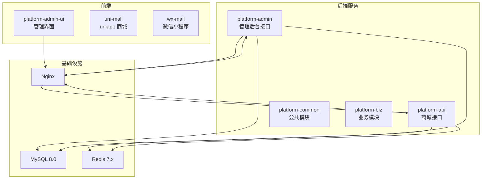
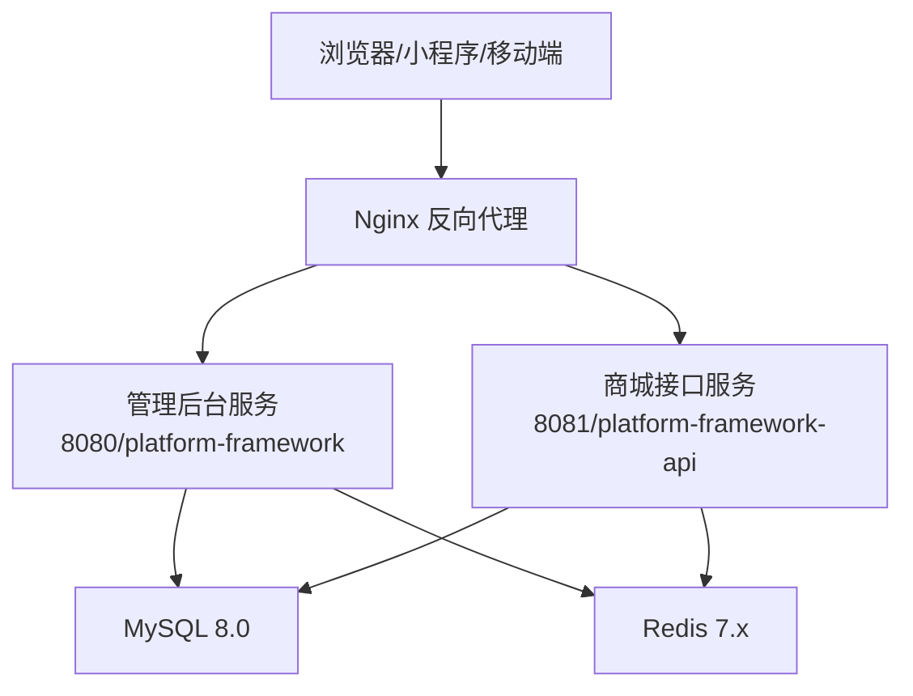
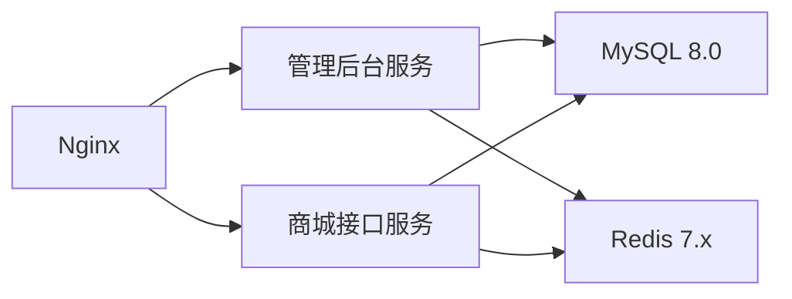
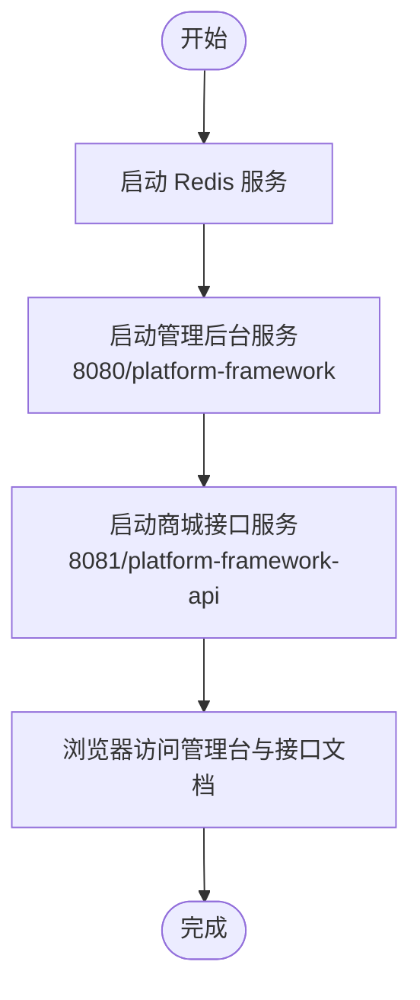
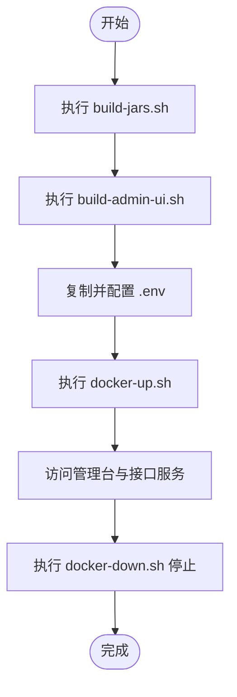

# 快速开始

<cite>
**本文引用的文件**
- [README.md](file://README.md)
- [deploy/README.md](file://deploy/README.md)
- [docker-compose.yml](file://docker-compose.yml)
- [scripts/build-jars.sh](file://scripts/build-jars.sh)
- [scripts/build-admin-ui.sh](file://scripts/build-admin-ui.sh)
- [scripts/docker-up.sh](file://scripts/docker-up.sh)
- [scripts/docker-down.sh](file://scripts/docker-down.sh)
- [platform-admin/src/main/resources/application.yml](file://platform-admin/src/main/resources/application.yml)
- [platform-admin/src/main/resources/application-dev.yml](file://platform-admin/src/main/resources/application-dev.yml)
- [platform-api/src/main/resources/application.yml](file://platform-api/src/main/resources/application.yml)
- [platform-api/src/main/resources/application-dev.yml](file://platform-api/src/main/resources/application-dev.yml)
- [_sql/base.sql](file://_sql/base.sql)
- [_sql/mall.sql](file://_sql/mall.sql)
- [_sql/sys_region.sql](file://_sql/sys_region.sql)
- [platform-admin/src/main/java/com/platform/PlatformAdminApplication.java](file://platform-admin/src/main/java/com/platform/PlatformAdminApplication.java)
</cite>

## 目录
1. [简介](#简介)
2. [项目结构](#项目结构)
3. [核心组件](#核心组件)
4. [架构总览](#架构总览)
5. [详细组件分析](#详细组件分析)
6. [依赖分析](#依赖分析)
7. [性能考虑](#性能考虑)
8. [故障排查指南](#故障排查指南)
9. [结论](#结论)
10. [附录](#附录)

## 简介
本指南面向首次接触平台项目的开发者，提供从环境准备、数据库初始化、配置修改、本地开发启动到容器化部署的完整流程。项目基于 Java21、Maven3.8、MySQL8.0、Redis4.0.1 的组合，采用 Spring Boot + Vue2 的前后端分离架构，支持传统本地开发与 Docker 一键部署两种方式。

## 项目结构
项目包含后端服务（管理后台与商城 API）、通用模块、前端管理界面、小程序与 uni-app 商城、微信公众号与小程序工程、公共 SQL 脚本与部署脚本等模块。核心启动类位于后端模块中，前端静态资源通过 Nginx 提供并反向代理后端服务。

**图表来源**
- [docker-compose.yml:1-115](file://docker-compose.yml#L1-L115)
- [platform-admin/src/main/java/com/platform/PlatformAdminApplication.java:1-93](file://platform-admin/src/main/java/com/platform/PlatformAdminApplication.java#L1-L93)

**章节来源**
- [README.md:59-70](file://README.md#L59-L70)

## 核心组件
- 管理后台接口服务（platform-admin）
  - 启动类：PlatformAdminApplication
  - 默认端口：8080，上下文路径：/platform-framework
  - 配置文件：application.yml、application-dev.yml
- 商城接口服务（platform-api）
  - 默认端口：8081，上下文路径：/platform-framework-api
  - 配置文件：application.yml、application-dev.yml
- 前端管理界面（platform-admin-ui）
  - 构建产物输出至 deploy/packages/platform-admin-ui-dist
- 数据库与缓存
  - MySQL 8.0、Redis 7.x（Docker 默认版本）
- 反向代理与静态资源
  - Nginx 提供静态资源托管与后端接口反代

**章节来源**
- [platform-admin/src/main/java/com/platform/PlatformAdminApplication.java:42-93](file://platform-admin/src/main/java/com/platform/PlatformAdminApplication.java#L42-L93)
- [platform-admin/src/main/resources/application.yml:1-21](file://platform-admin/src/main/resources/application.yml#L1-L21)
- [platform-api/src/main/resources/application.yml:1-21](file://platform-api/src/main/resources/application.yml#L1-L21)
- [deploy/README.md:1-43](file://deploy/README.md#L1-L43)

## 架构总览
系统采用前后端分离架构，前端通过 Nginx 统一对外提供服务，后端服务通过 Docker Compose 编排，实现 MySQL、Redis、后端服务与 Nginx 的协同工作。

**图表来源**
- [docker-compose.yml:103-115](file://docker-compose.yml#L103-L115)
- [platform-admin/src/main/resources/application.yml:4-21](file://platform-admin/src/main/resources/application.yml#L4-L21)
- [platform-api/src/main/resources/application.yml:4-21](file://platform-api/src/main/resources/application.yml#L4-L21)

## 详细组件分析

### 环境与依赖要求
- Java：21（推荐）
- Maven：3.8+
- MySQL：8.0
- Redis：4.0.1（Docker 默认使用 7.x）
- Node.js：用于前端构建（安装依赖后执行 npm run build）

**章节来源**
- [README.md:74-74](file://README.md#L74-L74)

### 数据库初始化步骤
1) 创建数据库
- 登录 MySQL，创建数据库 platform（字符集建议 utf8mb4）。
  
2) 依次执行初始化脚本（按文件名顺序）
- /_sql/base.sql
- /_sql/mall.sql
- /_sql/sys_region.sql

上述脚本将创建系统基础表、商城相关表与省市区行政区划数据。

**章节来源**
- [README.md:75-79](file://README.md#L75-L79)
- [_sql/base.sql:1-800](file://_sql/base.sql#L1-L800)
- [_sql/mall.sql:1-800](file://_sql/mall.sql#L1-L800)
- [_sql/sys_region.sql:1-800](file://_sql/sys_region.sql#L1-L800)

### 项目配置指导

#### 管理后台配置（platform-admin）
- application.yml
  - 服务器端口：8080
  - 上下文路径：/platform-framework
  - Redis 连接：默认 127.0.0.1:6379
  - 数据源：Druid 动态数据源（见 application-dev.yml）
  - 微信公众号/小程序/支付配置：wx.mp、wx.miniapp、wx.pay 字段
  - 支付证书：keyPath 指向 classpath:/apiclient_cert.p12

- application-dev.yml
  - 主从数据源示例（master/second）
  - Druid 连接池参数与监控页面（/druid）

**章节来源**
- [platform-admin/src/main/resources/application.yml:1-21](file://platform-admin/src/main/resources/application.yml#L1-L21)
- [platform-admin/src/main/resources/application.yml:169-205](file://platform-admin/src/main/resources/application.yml#L169-L205)
- [platform-admin/src/main/resources/application-dev.yml:1-47](file://platform-admin/src/main/resources/application-dev.yml#L1-L47)

#### 商城接口配置（platform-api）
- application.yml
  - 服务器端口：8081
  - 上下文路径：/platform-framework-api
  - Redis 连接：默认 127.0.0.1:6379
  - 数据源：Druid 动态数据源（见 application-dev.yml）
  - JWT 密钥与过期时间
  - 微信公众号/小程序/支付配置：wx.mp、wx.miniapp、wx.pay 字段
  - 支付证书：keyPath 指向 classpath:/apiclient_cert.p12

- application-dev.yml
  - 主从数据源示例（master/second）
  - Druid 连接池参数与监控页面（/druid）

**章节来源**
- [platform-api/src/main/resources/application.yml:1-21](file://platform-api/src/main/resources/application.yml#L1-L21)
- [platform-api/src/main/resources/application.yml:157-195](file://platform-api/src/main/resources/application.yml#L157-L195)
- [platform-api/src/main/resources/application-dev.yml:1-47](file://platform-api/src/main/resources/application-dev.yml#L1-L47)

### 支付证书与微信配置
- 支付证书
  - 将商户支付证书放入以下位置：
    - /platform-admin/src/main/resources/cert/
    - /platform-api/src/main/resources/cert/
  - application.yml 中 keyPath 默认指向 apiclient_cert.p12（classpath:/apiclient_cert.p12）

- 微信公众号与小程序
  - 在 application.yml 中配置：
    - wx.mp.appId、wx.mp.secret、wx.mp.token、wx.mp.aesKey
    - wx.miniapp.appid、wx.miniapp.secret、wx.miniapp.token、wx.miniapp.aesKey
    - wx.pay.mchId、wx.pay.mchKey、wx.pay.baseNotifyUrl 等

- 微信支付回调地址
  - 平台默认回调地址为 https://openwtai.com/platform-framework-api（可在配置中修改）

**章节来源**
- [README.md:82-88](file://README.md#L82-L88)
- [platform-admin/src/main/resources/application.yml:169-205](file://platform-admin/src/main/resources/application.yml#L169-L205)
- [platform-api/src/main/resources/application.yml:157-195](file://platform-api/src/main/resources/application.yml#L157-L195)

### 传统本地开发部署流程
- 步骤概览
  1) 准备环境：JDK21、Maven3.8、MySQL8.0、Redis
  2) 创建数据库 platform，执行 base.sql、mall.sql、sys_region.sql
  3) 将支付证书放入 cert 目录
  4) 修改 application.yml 与 application-dev.yml 中的数据库、Redis、微信配置
  5) 启动 Redis 服务
  6) 启动管理后台服务（PlatformAdminApplication）
  7) 启动商城接口服务（PlatformApiApplication）
  8) 打开浏览器访问管理台与接口文档

- 启动顺序建议
  - 先启动 Redis
  - 再启动管理后台服务（8080）
  - 最后启动商城接口服务（8081）

- 访问地址
  - 管理台：http://localhost:8080/platform-framework/doc.html
  - 商城接口：http://localhost:8081/platform-framework-api/doc.html

**章节来源**
- [README.md:92-101](file://README.md#L92-L101)
- [platform-admin/src/main/java/com/platform/PlatformAdminApplication.java:55-93](file://platform-admin/src/main/java/com/platform/PlatformAdminApplication.java#L55-L93)

### Docker 容器化部署流程
- 产物准备
  - 执行构建脚本生成 JAR 与前端静态资源：
    - scripts/build-jars.sh
    - scripts/build-admin-ui.sh
  - 输出位置：
    - deploy/packages/platform-admin.jar
    - deploy/packages/platform-api.jar
    - deploy/packages/platform-admin-ui-dist/

- 启动前准备
  - 复制并配置环境文件：
    - cp deploy/.env.example deploy/.env
  - 可调整的环境变量：
    - MAVEN_PROFILE（默认 dev）
    - NGINX_PORT（默认 8888）
    - MYSQL_ROOT_PASSWORD（默认 root1234）
    - 其他数据库与 Redis 连接参数

- 启动与停止
  - 启动：scripts/docker-up.sh
  - 停止：scripts/docker-down.sh

- 访问地址
  - 管理台：http://localhost:8888
  - 后台接口：http://localhost:8888/platform-framework
  - 商城接口：http://localhost:8888/platform-framework-api

- Docker 编排说明
  - docker-compose.yml 会启动 mysql、redis、platform-admin、platform-api、nginx
  - Nginx 挂载前端静态资源并反代两个后端服务
  - MySQL 首次启动会自动执行 _sql/ 目录下的初始化脚本

**章节来源**
- [README.md:102-153](file://README.md#L102-L153)
- [deploy/README.md:1-43](file://deploy/README.md#L1-L43)
- [scripts/build-jars.sh:1-21](file://scripts/build-jars.sh#L1-L21)
- [scripts/build-admin-ui.sh:1-20](file://scripts/build-admin-ui.sh#L1-L20)
- [scripts/docker-up.sh:1-57](file://scripts/docker-up.sh#L1-L57)
- [scripts/docker-down.sh:1-17](file://scripts/docker-down.sh#L1-L17)
- [docker-compose.yml:1-115](file://docker-compose.yml#L1-L115)

### 关键配置清单（示例说明）
- 数据库连接
  - application-dev.yml 中包含主从数据源示例与 Druid 连接池参数
- Redis 连接
  - application.yml 中包含 Redis 连接参数（host/port/password 等）
- 微信配置
  - application.yml 中包含公众号、小程序、支付相关字段
- 支付证书
  - application.yml 中 keyPath 指向证书文件

**章节来源**
- [platform-admin/src/main/resources/application-dev.yml:1-47](file://platform-admin/src/main/resources/application-dev.yml#L1-L47)
- [platform-api/src/main/resources/application-dev.yml:1-47](file://platform-api/src/main/resources/application-dev.yml#L1-L47)
- [platform-admin/src/main/resources/application.yml:81-99](file://platform-admin/src/main/resources/application.yml#L81-L99)
- [platform-api/src/main/resources/application.yml:70-82](file://platform-api/src/main/resources/application.yml#L70-L82)
- [platform-admin/src/main/resources/application.yml:169-205](file://platform-admin/src/main/resources/application.yml#L169-L205)
- [platform-api/src/main/resources/application.yml:157-195](file://platform-api/src/main/resources/application.yml#L157-L195)

## 依赖分析
- 后端服务依赖
  - Spring Boot、MyBatis-Plus、动态数据源、Druid、Redis、Shiro、Knife4j/SpringDoc OpenAPI
- 前端依赖
  - Vue2、ElementUI、axios、路由与状态管理等
- Docker 编排
  - MySQL、Redis、Nginx、后端服务镜像

**图表来源**
- [docker-compose.yml:1-115](file://docker-compose.yml#L1-L115)

**章节来源**
- [README.md:17-20](file://README.md#L17-L20)
- [docker-compose.yml:1-115](file://docker-compose.yml#L1-L115)

## 性能考虑
- 连接池与监控
  - Druid 连接池参数已在 application-dev.yml 中配置，建议根据并发与慢查询日志进行调优
- 缓存策略
  - Redis 作为缓存与会话存储，建议合理设置过期时间与淘汰策略
- 日志与可观测性
  - Knife4j/SpringDoc 提供接口文档，结合 Nginx 访问日志与后端日志进行问题定位

## 故障排查指南
- 启动顺序问题
  - 若后端无法连接数据库或 Redis，请确认其服务已启动且端口可达
- 数据库初始化失败
  - 确认数据库 platform 存在，且按顺序执行 base.sql、mall.sql、sys_region.sql
- 端口冲突
  - 管理后台默认 8080，商城接口默认 8081；Docker 默认 8888；可在配置中调整
- 支付证书与微信配置
  - 确保证书文件存在且 keyPath 指向正确；微信配置需与实际公众号/小程序一致
- Docker 构建缺失产物
  - 确保先执行 scripts/build-jars.sh 与 scripts/build-admin-ui.sh

**章节来源**
- [scripts/docker-up.sh:23-36](file://scripts/docker-up.sh#L23-L36)
- [README.md:102-153](file://README.md#L102-L153)

## 结论
通过本指南，您可以快速完成环境准备、数据库初始化、配置修改与启动验证。若需快速上线，推荐使用 Docker 一键部署；若需深度定制或联调，可选择本地开发模式。遇到问题时，优先检查启动顺序、数据库初始化与配置文件的关键字段。

## 附录

### 启动顺序流程图（本地开发）

**图表来源**
- [README.md:92-101](file://README.md#L92-L101)

### Docker 启动流程图

**图表来源**
- [scripts/build-jars.sh:1-21](file://scripts/build-jars.sh#L1-L21)
- [scripts/build-admin-ui.sh:1-20](file://scripts/build-admin-ui.sh#L1-L20)
- [scripts/docker-up.sh:1-57](file://scripts/docker-up.sh#L1-L57)
- [scripts/docker-down.sh:1-17](file://scripts/docker-down.sh#L1-L17)
- [deploy/README.md:1-43](file://deploy/README.md#L1-L43)