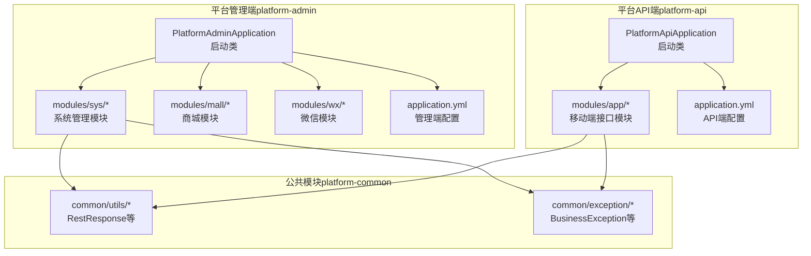
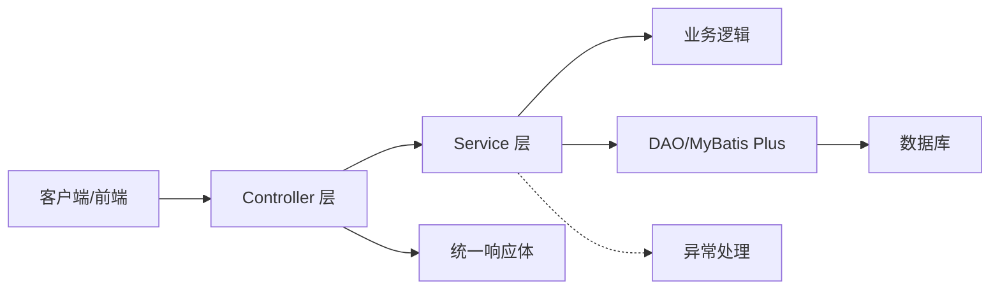
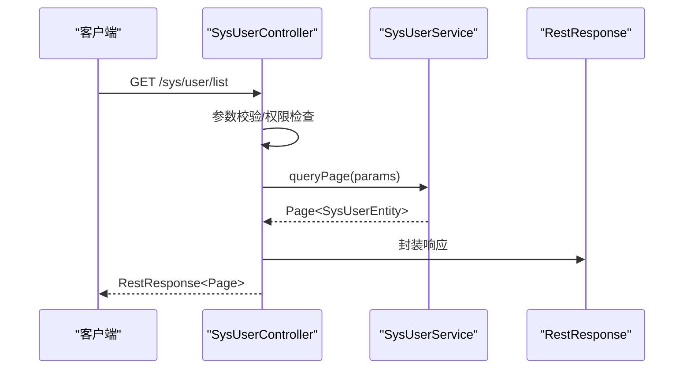
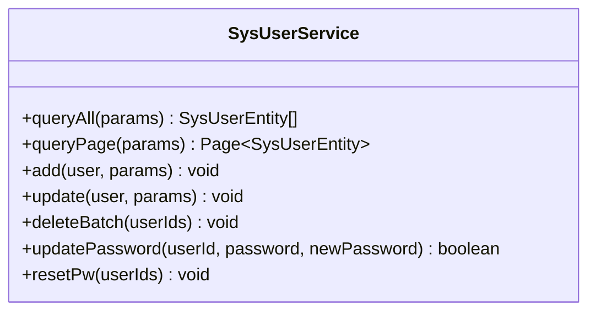
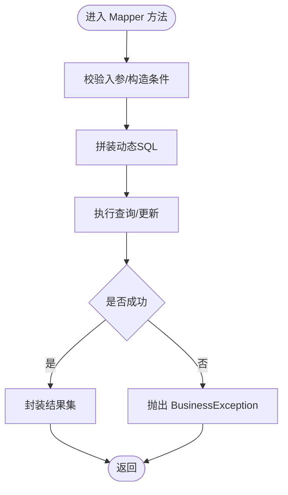
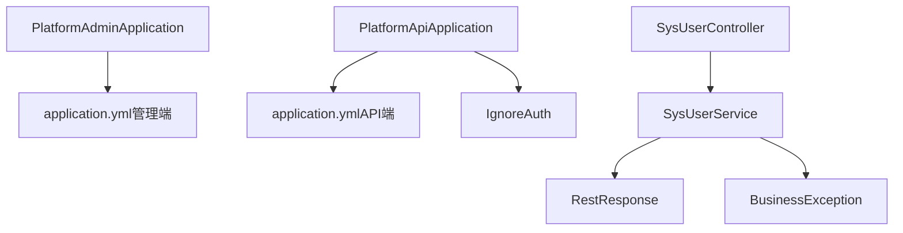

# 功能模块扩展

<cite>
**本文引用的文件**
- [PlatformAdminApplication.java](file://platform-admin/src/main/java/com/platform/PlatformAdminApplication.java)
- [PlatformApiApplication.java](file://platform-api/src/main/java/com/platform/PlatformApiApplication.java)
- [application.yml（管理端）](file://platform-admin/src/main/resources/application.yml)
- [application.yml（API端）](file://platform-api/src/main/resources/application.yml)
- [RestResponse.java](file://platform-common/src/main/java/com/platform/common/utils/RestResponse.java)
- [BusinessException.java](file://platform-common/src/main/java/com/platform/common/exception/BusinessException.java)
- [SysUserController.java](file://platform-admin/src/main/java/com/platform/modules/sys/controller/SysUserController.java)
- [SysUserService.java](file://platform-admin/src/main/java/com/platform/modules/sys/service/SysUserService.java)
- [AbstractController.java](file://platform-admin/src/main/java/com/platform/modules/sys/controller/AbstractController.java)
- [IgnoreAuth.java](file://platform-api/src/main/java/com/platform/annotation/IgnoreAuth.java)
</cite>

## 目录
1. [引言](#引言)
2. [项目结构](#项目结构)
3. [核心组件](#核心组件)
4. [架构总览](#架构总览)
5. [详细组件分析](#详细组件分析)
6. [依赖分析](#依赖分析)
7. [性能考虑](#性能考虑)
8. [故障排查指南](#故障排查指南)
9. [结论](#结论)
10. [附录](#附录)

## 引言
本指导文档面向在现有平台基础上扩展新业务功能的开发者，提供一套可复用的开发框架与最佳实践。内容覆盖模块设计原则、代码组织结构、接口定义规范、分层架构（DAO/Service/Controller）、MyBatis Plus 使用方法、事务与业务逻辑实现、RESTful API 设计、模块间依赖与配置更新、以及单元测试与代码复用策略。

## 项目结构
平台采用多模块分层架构，核心模块包括：
- 平台管理端（platform-admin）：提供后台管理能力，内置系统管理、商品管理、微信管理等模块。
- 平台API端（platform-api）：提供移动端与微信服务端接口，支持JWT鉴权与开放接口。
- 平台公共模块（platform-common）：提供统一响应体、异常体系、工具类与安全配置。
- 平台业务模块（platform-biz）：承载具体业务服务与Mapper映射文件（位于resources/mapper下）。

图表来源
- [PlatformAdminApplication.java:49-51](file://platform-admin/src/main/java/com/platform/PlatformAdminApplication.java#L49-L51)
- [PlatformApiApplication.java:49-50](file://platform-api/src/main/java/com/platform/PlatformApiApplication.java#L49-L50)
- [application.yml（管理端）:32-54](file://platform-admin/src/main/resources/application.yml#L32-L54)
- [application.yml（API端）:23-43](file://platform-api/src/main/resources/application.yml#L23-L43)

章节来源
- [PlatformAdminApplication.java:49-51](file://platform-admin/src/main/java/com/platform/PlatformAdminApplication.java#L49-L51)
- [PlatformApiApplication.java:49-50](file://platform-api/src/main/java/com/platform/PlatformApiApplication.java#L49-L50)
- [application.yml（管理端）:32-54](file://platform-admin/src/main/resources/application.yml#L32-L54)
- [application.yml（API端）:23-43](file://platform-api/src/main/resources/application.yml#L23-L43)

## 核心组件
- 统一响应体：RestResponse 提供标准的 success/code/msg/data/timestamp 字段，便于前端统一处理。
- 业务异常：BusinessException 提供带 code 的运行时异常，配合异常处理器可实现一致的错误响应。
- 控制器基类：AbstractController 提供通用上下文（用户、机构、数据范围等），减少重复代码。
- 启动类：PlatformAdminApplication 与 PlatformApiApplication 分别作为管理端与API端入口，启用异步与动态数据源等特性。

章节来源
- [RestResponse.java:34-122](file://platform-common/src/main/java/com/platform/common/utils/RestResponse.java#L34-L122)
- [BusinessException.java:28-74](file://platform-common/src/main/java/com/platform/common/exception/BusinessException.java#L28-L74)
- [AbstractController.java](file://platform-admin/src/main/java/com/platform/modules/sys/controller/AbstractController.java)
- [PlatformAdminApplication.java:49-51](file://platform-admin/src/main/java/com/platform/PlatformAdminApplication.java#L49-L51)
- [PlatformApiApplication.java:49-50](file://platform-api/src/main/java/com/platform/PlatformApiApplication.java#L49-L50)

## 架构总览
平台遵循典型的三层架构：
- 表现层（Controller）：接收HTTP请求，参数校验，调用Service，封装统一响应。
- 业务层（Service）：编排业务流程，事务控制，参数验证与异常处理。
- 数据访问层（DAO/MyBatis Plus）：Mapper接口与XML映射，动态SQL构建，逻辑删除与主键策略。

## 详细组件分析

### 控制器层（Controller）
- 设计要点
  - 使用注解定义路由与权限：如 @RequestMapping、@RequiresPermissions、Swagger 注解。
  - 参数校验：结合 ValidatorUtils 与分组校验（AddGroup/UpdateGroup）。
  - 统一响应：返回 RestResponse，保证前后端交互一致性。
  - 日志与审计：通过注解记录操作日志。
- 示例参考
  - 系统用户控制器：提供分页查询、详情、新增、修改、删除、重置密码等接口。
  - 参考路径：[SysUserController.java:54-243](file://platform-admin/src/main/java/com/platform/modules/sys/controller/SysUserController.java#L54-L243)

图表来源
- [SysUserController.java:80-91](file://platform-admin/src/main/java/com/platform/modules/sys/controller/SysUserController.java#L80-L91)
- [SysUserService.java:48-49](file://platform-admin/src/main/java/com/platform/modules/sys/service/SysUserService.java#L48-L49)
- [RestResponse.java:86-100](file://platform-common/src/main/java/com/platform/common/utils/RestResponse.java#L86-L100)

章节来源
- [SysUserController.java:54-243](file://platform-admin/src/main/java/com/platform/modules/sys/controller/SysUserController.java#L54-L243)
- [SysUserService.java:33-106](file://platform-admin/src/main/java/com/platform/modules/sys/service/SysUserService.java#L33-106)
- [RestResponse.java:34-122](file://platform-common/src/main/java/com/platform/common/utils/RestResponse.java#L34-L122)

### 服务层（Service）
- 设计要点
  - IService 接口继承：天然具备 CRUD 能力，可按需扩展。
  - 事务边界：在 Service 层声明事务，确保业务原子性。
  - 参数验证：对入参进行合法性校验，必要时抛出 BusinessException。
  - 返回值封装：对外统一返回领域对象或分页结果。
- 示例参考
  - 系统用户服务接口：定义分页查询、新增、修改、删除、密码修改、重置密码等方法。
  - 参考路径：[SysUserService.java:33-106](file://platform-admin/src/main/java/com/platform/modules/sys/service/SysUserService.java#L33-106)

图表来源
- [SysUserService.java:33-106](file://platform-admin/src/main/java/com/platform/modules/sys/service/SysUserService.java#L33-106)

章节来源
- [SysUserService.java:33-106](file://platform-admin/src/main/java/com/platform/modules/sys/service/SysUserService.java#L33-106)

### 数据访问层（DAO/MyBatis Plus）
- Mapper 接口
  - 继承 BaseMapper 或 IService，即可获得常用 CRUD 方法。
  - 如需自定义 SQL，可在 Mapper 上使用 @Select/@Insert/@Update/@Delete 注解，或在 XML 中编写。
- XML 映射
  - 路径约定：resources/mapper 下按模块分目录存放。
  - 动态 SQL：使用 trim/where/foreach 等标签组合条件，避免 SQL 注入。
  - 逻辑删除：结合全局配置的逻辑删除字段与值，实现软删。
- 配置要点
  - mybatis-plus.mapper-locations：扫描 XML 文件。
  - typeAliasesPackage：实体包扫描。
  - id-type/capital-mode/logic-delete-*：主键策略与逻辑删除配置。
- 参考配置
  - 管理端配置：[application.yml（管理端）:114-142](file://platform-admin/src/main/resources/application.yml#L114-L142)
  - API端配置：[application.yml（API端）:96-122](file://platform-api/src/main/resources/application.yml#L96-L122)

图表来源
- [application.yml（管理端）:114-142](file://platform-admin/src/main/resources/application.yml#L114-L142)
- [application.yml（API端）:96-122](file://platform-api/src/main/resources/application.yml#L96-L122)

章节来源
- [application.yml（管理端）:114-142](file://platform-admin/src/main/resources/application.yml#L114-L142)
- [application.yml（API端）:96-122](file://platform-api/src/main/resources/application.yml#L96-L122)

### 统一异常与响应
- 异常体系
  - BusinessException：携带业务码与消息，便于前端识别与提示。
- 统一响应
  - RestResponse：success/code/msg/data/timestamp，保证接口一致性。
- 参考路径
  - [BusinessException.java:28-74](file://platform-common/src/main/java/com/platform/common/exception/BusinessException.java#L28-74)
  - [RestResponse.java:34-122](file://platform-common/src/main/java/com/platform/common/utils/RestResponse.java#L34-122)

章节来源
- [BusinessException.java:28-74](file://platform-common/src/main/java/com/platform/common/exception/BusinessException.java#L28-74)
- [RestResponse.java:34-122](file://platform-common/src/main/java/com/platform/common/utils/RestResponse.java#L34-L122)

### 开放接口与鉴权
- 平台API端支持开放接口与JWT鉴权两种场景：
  - IgnoreAuth 注解：用于无需鉴权的接口。
  - JWT 配置：密钥、过期时间、Header 名称等。
- 参考路径
  - [PlatformApiApplication.java:49-50](file://platform-api/src/main/java/com/platform/PlatformApiApplication.java#L49-L50)
  - [IgnoreAuth.java](file://platform-api/src/main/java/com/platform/annotation/IgnoreAuth.java)
  - [application.yml（API端）:123-131](file://platform-api/src/main/resources/application.yml#L123-L131)

章节来源
- [PlatformApiApplication.java:49-50](file://platform-api/src/main/java/com/platform/PlatformApiApplication.java#L49-L50)
- [IgnoreAuth.java](file://platform-api/src/main/java/com/platform/annotation/IgnoreAuth.java)
- [application.yml（API端）:123-131](file://platform-api/src/main/resources/application.yml#L123-L131)

## 依赖分析
- 启动类与配置
  - PlatformAdminApplication 与 PlatformApiApplication 分别启用异步与动态数据源，管理端排除安全自动装配，API端排除 Druid 数据源自动装配。
  - 两者均通过 application.yml 配置 Undertow 线程模型、Swagger/Knife4j 文档、Redis、邮件、MyBatis Plus 等。
- 模块间耦合
  - 控制器依赖服务接口；服务依赖 DAO；公共模块提供统一响应与异常。
  - 配置文件集中管理，避免硬编码。

图表来源
- [PlatformAdminApplication.java:49-51](file://platform-admin/src/main/java/com/platform/PlatformAdminApplication.java#L49-L51)
- [PlatformApiApplication.java:49-50](file://platform-api/src/main/java/com/platform/PlatformApiApplication.java#L49-L50)
- [application.yml（管理端）:32-54](file://platform-admin/src/main/resources/application.yml#L32-L54)
- [application.yml（API端）:23-43](file://platform-api/src/main/resources/application.yml#L23-L43)
- [SysUserController.java:54-243](file://platform-admin/src/main/java/com/platform/modules/sys/controller/SysUserController.java#L54-L243)
- [SysUserService.java:33-106](file://platform-admin/src/main/java/com/platform/modules/sys/service/SysUserService.java#L33-106)
- [RestResponse.java:34-122](file://platform-common/src/main/java/com/platform/common/utils/RestResponse.java#L34-L122)
- [BusinessException.java:28-74](file://platform-common/src/main/java/com/platform/common/exception/BusinessException.java#L28-74)
- [IgnoreAuth.java](file://platform-api/src/main/java/com/platform/annotation/IgnoreAuth.java)

章节来源
- [PlatformAdminApplication.java:49-51](file://platform-admin/src/main/java/com/platform/PlatformAdminApplication.java#L49-L51)
- [PlatformApiApplication.java:49-50](file://platform-api/src/main/java/com/platform/PlatformApiApplication.java#L49-L50)
- [application.yml（管理端）:32-54](file://platform-admin/src/main/resources/application.yml#L32-L54)
- [application.yml（API端）:23-43](file://platform-api/src/main/resources/application.yml#L23-L43)
- [SysUserController.java:54-243](file://platform-admin/src/main/java/com/platform/modules/sys/controller/SysUserController.java#L54-L243)
- [SysUserService.java:33-106](file://platform-admin/src/main/java/com/platform/modules/sys/service/SysUserService.java#L33-106)
- [RestResponse.java:34-122](file://platform-common/src/main/java/com/platform/common/utils/RestResponse.java#L34-L122)
- [BusinessException.java:28-74](file://platform-common/src/main/java/com/platform/common/exception/BusinessException.java#L28-74)
- [IgnoreAuth.java](file://platform-api/src/main/java/com/platform/annotation/IgnoreAuth.java)

## 性能考虑
- 连接池与线程模型
  - Undertow 线程模型与缓冲区配置影响并发处理能力，建议根据业务QPS调整 io/worker 线程数。
- 缓存与序列化
  - 合理使用 Redis 缓存热点数据，避免频繁数据库访问。
  - 注意 JSON 序列化器对时间类型的处理，避免额外转换开销。
- 分页与索引
  - 对高频查询建立合适索引，避免全表扫描；分页查询尽量使用覆盖索引。
- 异步与批处理
  - 对耗时操作（如发送短信、导出报表）采用异步执行，提升吞吐量。

## 故障排查指南
- 响应码与消息
  - 使用 RestResponse.fail(code, msg) 返回明确错误码与信息，便于定位问题。
- 异常捕获
  - 在控制器或全局异常处理器中捕获 BusinessException，输出统一格式。
- 日志审计
  - 通过控制器上的日志注解记录关键操作，结合权限注解排查越权访问。
- 配置核对
  - 确认 MyBatis Plus 的 mapper-locations、typeAliasesPackage、逻辑删除配置是否正确。
  - 确认 Swagger/Knife4j 的扫描包路径与分组配置。

章节来源
- [RestResponse.java:102-121](file://platform-common/src/main/java/com/platform/common/utils/RestResponse.java#L102-L121)
- [BusinessException.java:28-74](file://platform-common/src/main/java/com/platform/common/exception/BusinessException.java#L28-74)
- [application.yml（管理端）:114-142](file://platform-admin/src/main/resources/application.yml#L114-L142)
- [application.yml（API端）:96-122](file://platform-api/src/main/resources/application.yml#L96-L122)

## 结论
通过遵循本文提供的模块扩展框架与最佳实践，开发者可以在现有平台上快速、稳定地新增业务功能。关键在于：
- 严格分层与职责分离；
- 统一响应与异常处理；
- 规范化的接口设计与权限控制；
- 合理的 MyBatis Plus 使用与配置；
- 清晰的模块依赖与配置管理。

## 附录

### 开发步骤清单（新增业务模块）
- 创建实体类与表结构（如需）
- 新增 Mapper 接口与 XML 映射
  - 参考：[application.yml（管理端）:114-142](file://platform-admin/src/main/resources/application.yml#L114-L142)
- 新增 Service 接口与实现
  - 参考：[SysUserService.java:33-106](file://platform-admin/src/main/java/com/platform/modules/sys/service/SysUserService.java#L33-106)
- 新增 Controller 类
  - 参考：[SysUserController.java:54-243](file://platform-admin/src/main/java/com/platform/modules/sys/controller/SysUserController.java#L54-243)
- 更新 Swagger/Knife4j 扫描配置
  - 参考：[application.yml（管理端）:32-54](file://platform-admin/src/main/resources/application.yml#L32-L54)，[application.yml（API端）:23-43](file://platform-api/src/main/resources/application.yml#L23-L43)
- 添加权限点与菜单（如为管理端）
- 单元测试与集成测试
- 配置文件更新与环境变量校验
- 发布与监控

### 命名规范与代码复用策略
- 包命名：com.platform.modules.{module}（如 sys/mall/wx/app）
- 类命名：实体类以 Entity 结尾，Service 接口以 Service 结尾，实现类以 Impl 结尾，Controller 以 Controller 结尾
- 接口返回：统一使用 RestResponse
- 异常处理：业务异常使用 BusinessException，统一由异常处理器转换为 RestResponse
- 参数校验：使用 ValidatorUtils 与分组校验，避免在 Service 中重复校验
- 代码复用：将通用逻辑抽取到抽象类（如 AbstractController）或工具类（如 RestResponse、DateUtils）