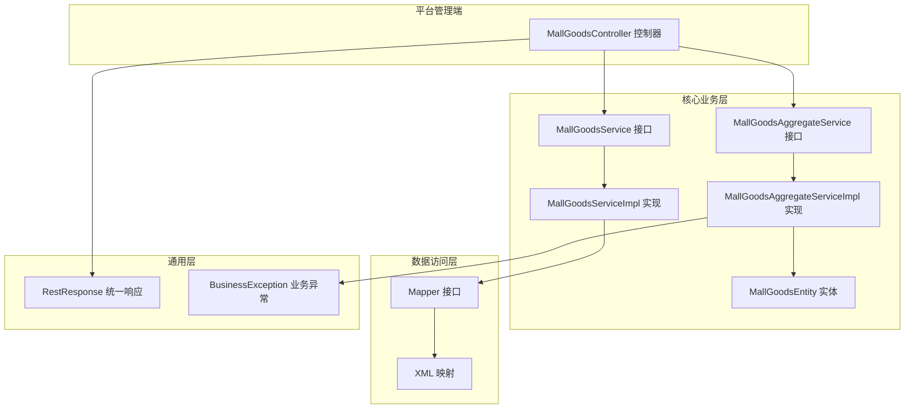
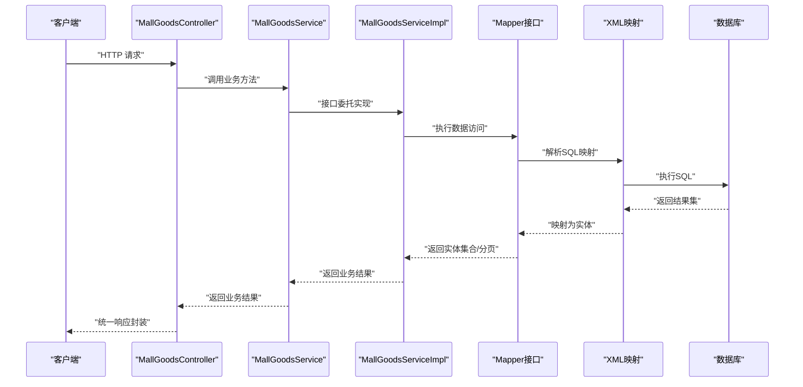
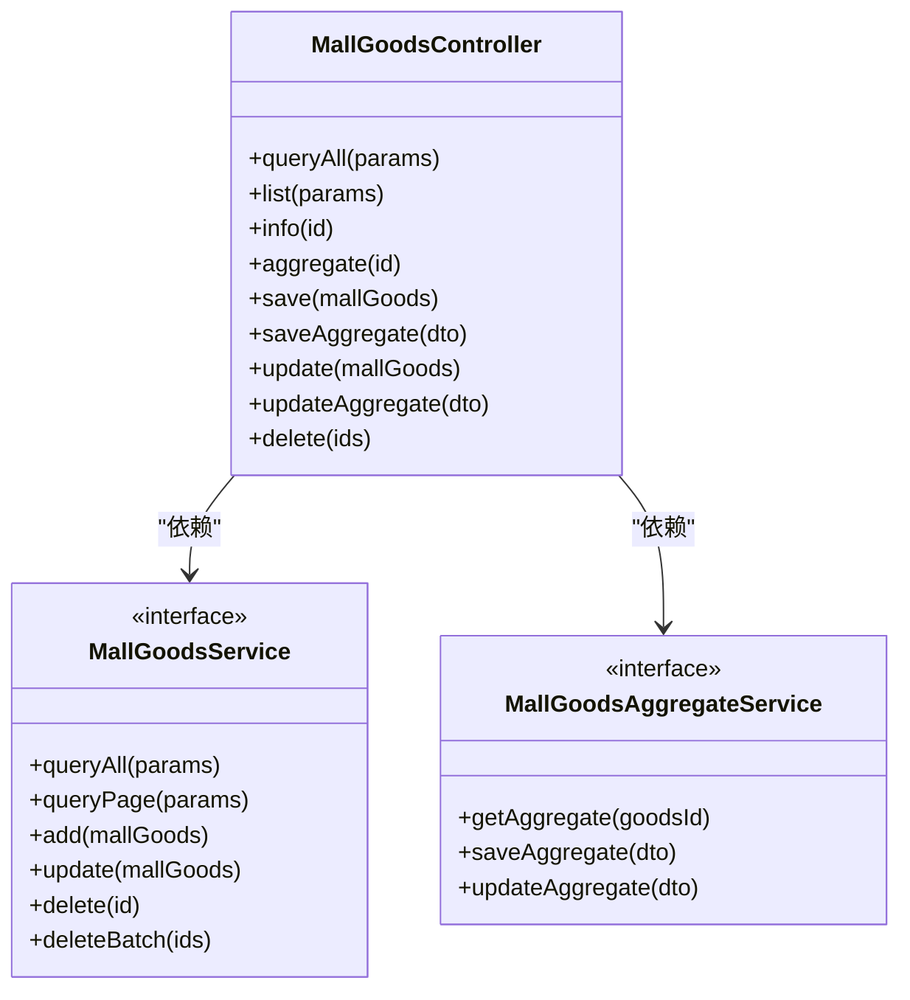
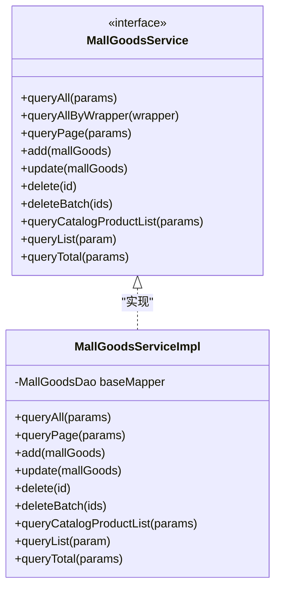
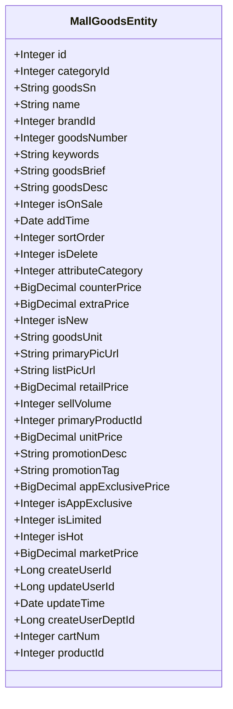
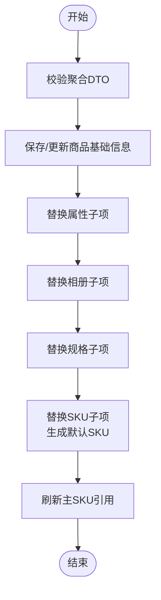
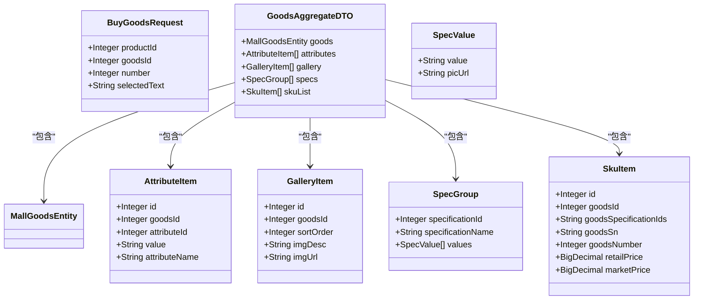
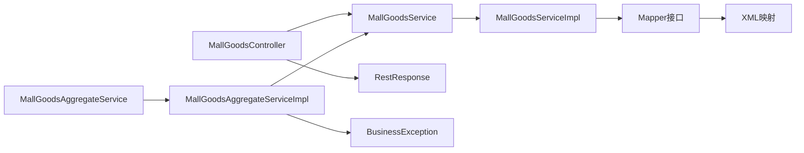
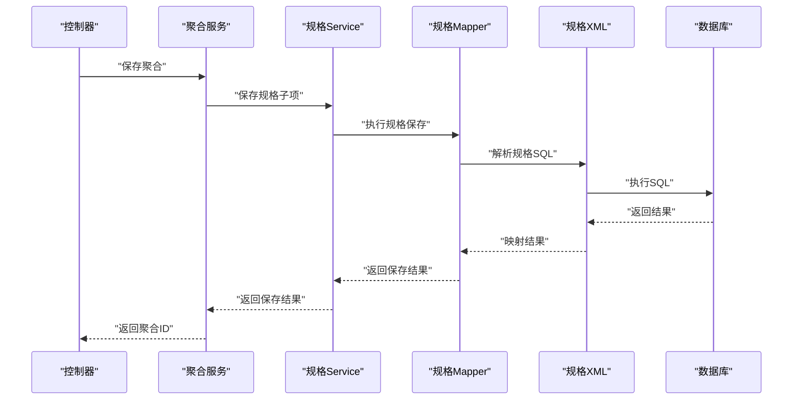

# 商城业务模块扩展

<cite>
**本文档引用的文件**
- [MallGoodsController.java](file://platform-admin/src/main/java/com/platform/modules/mall/controller/MallGoodsController.java)
- [MallGoodsService.java](file://platform-biz/src/main/java/com/platform/modules/mall/service/MallGoodsService.java)
- [MallGoodsServiceImpl.java](file://platform-biz/src/main/java/com/platform/modules/mall/service/impl/MallGoodsServiceImpl.java)
- [MallGoodsEntity.java](file://platform-biz/src/main/java/com/platform/modules/mall/entity/MallGoodsEntity.java)
- [MallGoodsAggregateService.java](file://platform-biz/src/main/java/com/platform/modules/mall/service/MallGoodsAggregateService.java)
- [MallGoodsAggregateServiceImpl.java](file://platform-biz/src/main/java/com/platform/modules/mall/service/impl/MallGoodsAggregateServiceImpl.java)
- [BuyGoodsRequest.java](file://platform-biz/src/main/java/com/platform/modules/mall/dto/BuyGoodsRequest.java)
</cite>

## 目录
1. [简介](#简介)
2. [项目结构](#项目结构)
3. [核心组件](#核心组件)
4. [架构总览](#架构总览)
5. [详细组件分析](#详细组件分析)
6. [依赖关系分析](#依赖关系分析)
7. [性能考虑](#性能考虑)
8. [故障排查指南](#故障排查指南)
9. [结论](#结论)
10. [附录](#附录)

## 简介
本指南面向需要在现有商城模块基础上扩展新业务功能（如商品管理、订单处理、用户管理等）的开发者。文档从DAO层（MyBatis Plus Mapper接口与XML映射）、Service层（业务逻辑、事务管理、参数校验、异常处理）、Entity实体类设计、DTO数据传输对象使用场景与设计模式等方面进行系统讲解，并提供可操作的开发示例与最佳实践，帮助快速、规范地完成模块扩展。

## 项目结构
商城模块位于多模块工程中，主要涉及以下模块：
- platform-admin：后端管理端，提供REST API控制器，负责权限控制、日志记录与统一响应包装。
- platform-biz：核心业务模块，包含Service接口与实现、Entity实体、DTO数据传输对象、Mapper接口与XML映射等。
- platform-common：通用工具与异常处理、配置等公共能力。

图表来源
- [MallGoodsController.java:1-184](file://platform-admin/src/main/java/com/platform/modules/mall/controller/MallGoodsController.java#L1-L184)
- [MallGoodsService.java:1-99](file://platform-biz/src/main/java/com/platform/modules/mall/service/MallGoodsService.java#L1-L99)
- [MallGoodsServiceImpl.java:1-99](file://platform-biz/src/main/java/com/platform/modules/mall/service/impl/MallGoodsServiceImpl.java#L1-L99)
- [MallGoodsAggregateService.java:1-18](file://platform-biz/src/main/java/com/platform/modules/mall/service/MallGoodsAggregateService.java#L1-L18)
- [MallGoodsAggregateServiceImpl.java:1-368](file://platform-biz/src/main/java/com/platform/modules/mall/service/impl/MallGoodsAggregateServiceImpl.java#L1-L368)
- [MallGoodsEntity.java:1-190](file://platform-biz/src/main/java/com/platform/modules/mall/entity/MallGoodsEntity.java#L1-L190)

章节来源
- [MallGoodsController.java:1-184](file://platform-admin/src/main/java/com/platform/modules/mall/controller/MallGoodsController.java#L1-L184)
- [MallGoodsService.java:1-99](file://platform-biz/src/main/java/com/platform/modules/mall/service/MallGoodsService.java#L1-L99)
- [MallGoodsServiceImpl.java:1-99](file://platform-biz/src/main/java/com/platform/modules/mall/service/impl/MallGoodsServiceImpl.java#L1-L99)
- [MallGoodsAggregateService.java:1-18](file://platform-biz/src/main/java/com/platform/modules/mall/service/MallGoodsAggregateService.java#L1-L18)
- [MallGoodsAggregateServiceImpl.java:1-368](file://platform-biz/src/main/java/com/platform/modules/mall/service/impl/MallGoodsAggregateServiceImpl.java#L1-L368)
- [MallGoodsEntity.java:1-190](file://platform-biz/src/main/java/com/platform/modules/mall/entity/MallGoodsEntity.java#L1-L190)

## 核心组件
- 控制器层：以MallGoodsController为例，提供REST接口，负责接收请求、鉴权与权限控制、调用Service层并返回统一响应。
- Service层：定义业务接口与实现，封装事务、参数校验、异常处理与业务规则；支持分页查询、批量操作等。
- Entity实体：基于MyBatis Plus注解映射数据库表，包含持久化字段与非持久化字段（如购物车数量、产品Id等）。
- DTO数据传输对象：用于聚合查询或跨层传输，如商品聚合DTO，承载商品、属性、相册、规格、SKU等信息。
- 异常处理：通过统一异常处理器与业务异常类型，保证错误信息标准化输出。

章节来源
- [MallGoodsController.java:40-184](file://platform-admin/src/main/java/com/platform/modules/mall/controller/MallGoodsController.java#L40-L184)
- [MallGoodsService.java:29-99](file://platform-biz/src/main/java/com/platform/modules/mall/service/MallGoodsService.java#L29-L99)
- [MallGoodsServiceImpl.java:35-99](file://platform-biz/src/main/java/com/platform/modules/mall/service/impl/MallGoodsServiceImpl.java#L35-L99)
- [MallGoodsEntity.java:31-190](file://platform-biz/src/main/java/com/platform/modules/mall/entity/MallGoodsEntity.java#L31-L190)
- [MallGoodsAggregateService.java:10-18](file://platform-biz/src/main/java/com/platform/modules/mall/service/MallGoodsAggregateService.java#L10-L18)
- [MallGoodsAggregateServiceImpl.java:38-368](file://platform-biz/src/main/java/com/platform/modules/mall/service/impl/MallGoodsAggregateServiceImpl.java#L38-L368)
- [BuyGoodsRequest.java:8-25](file://platform-biz/src/main/java/com/platform/modules/mall/dto/BuyGoodsRequest.java#L8-L25)

## 架构总览
下图展示了从控制器到Service再到Mapper的数据流与职责划分：

图表来源
- [MallGoodsController.java:55-182](file://platform-admin/src/main/java/com/platform/modules/mall/controller/MallGoodsController.java#L55-L182)
- [MallGoodsServiceImpl.java:44-97](file://platform-biz/src/main/java/com/platform/modules/mall/service/impl/MallGoodsServiceImpl.java#L44-L97)

## 详细组件分析

### 控制器层：MallGoodsController
- 职责：提供商品管理的REST接口，包括分页查询、详情查询、聚合查询、新增、修改、删除等。
- 安全控制：使用Shiro注解进行权限控制，确保接口访问安全。
- 统一响应：返回统一的RestResponse包装，便于前端处理。
- 聚合接口：提供商品聚合详情与保存/更新聚合的方法，委托给聚合服务。

图表来源
- [MallGoodsController.java:50-183](file://platform-admin/src/main/java/com/platform/modules/mall/controller/MallGoodsController.java#L50-L183)
- [MallGoodsService.java:35-98](file://platform-biz/src/main/java/com/platform/modules/mall/service/MallGoodsService.java#L35-L98)
- [MallGoodsAggregateService.java:10-17](file://platform-biz/src/main/java/com/platform/modules/mall/service/MallGoodsAggregateService.java#L10-L17)

章节来源
- [MallGoodsController.java:40-184](file://platform-admin/src/main/java/com/platform/modules/mall/controller/MallGoodsController.java#L40-L184)

### Service层：MallGoodsService与MallGoodsServiceImpl
- 接口职责：定义商品管理的业务方法，包括查询、分页、新增、修改、删除等。
- 实现要点：
  - 基于MyBatis Plus的IService与ServiceImpl，简化CRUD。
  - 分页查询通过Query包装与自定义Mapper方法实现。
  - 批量删除使用@Transactional保证一致性。
  - 提供按条件查询与统计总数等方法。

图表来源
- [MallGoodsService.java:35-98](file://platform-biz/src/main/java/com/platform/modules/mall/service/MallGoodsService.java#L35-L98)
- [MallGoodsServiceImpl.java:42-98](file://platform-biz/src/main/java/com/platform/modules/mall/service/impl/MallGoodsServiceImpl.java#L42-L98)

章节来源
- [MallGoodsService.java:29-99](file://platform-biz/src/main/java/com/platform/modules/mall/service/MallGoodsService.java#L29-L99)
- [MallGoodsServiceImpl.java:35-99](file://platform-biz/src/main/java/com/platform/modules/mall/service/impl/MallGoodsServiceImpl.java#L35-L99)

### 实体类：MallGoodsEntity
- 设计原则：
  - 使用MyBatis Plus注解映射表名与主键策略。
  - 区分持久化字段与非持久化字段（如购物车数量、产品Id），避免污染数据库结构。
  - 字段命名遵循业务含义，金额使用BigDecimal保证精度。
- 关系映射：通过注解与Mapper/XML建立表字段与Java字段的映射关系。

图表来源
- [MallGoodsEntity.java:37-190](file://platform-biz/src/main/java/com/platform/modules/mall/entity/MallGoodsEntity.java#L37-L190)

章节来源
- [MallGoodsEntity.java:31-190](file://platform-biz/src/main/java/com/platform/modules/mall/entity/MallGoodsEntity.java#L31-L190)

### 聚合服务：MallGoodsAggregateService与MallGoodsAggregateServiceImpl
- 职责：对商品进行聚合查询与保存/更新，包含属性、相册、规格、SKU等子项。
- 事务管理：使用@Transactional保证聚合保存/更新的一致性。
- 参数校验：对商品基础信息、规格与SKU数量一致性、相册完整性等进行严格校验。
- 数据刷新：在保存/更新后刷新主SKU引用，确保商品主SKU一致性。

图表来源
- [MallGoodsAggregateServiceImpl.java:115-146](file://platform-biz/src/main/java/com/platform/modules/mall/service/impl/MallGoodsAggregateServiceImpl.java#L115-L146)
- [MallGoodsAggregateServiceImpl.java:270-323](file://platform-biz/src/main/java/com/platform/modules/mall/service/impl/MallGoodsAggregateServiceImpl.java#L270-L323)

章节来源
- [MallGoodsAggregateService.java:10-18](file://platform-biz/src/main/java/com/platform/modules/mall/service/MallGoodsAggregateService.java#L10-L18)
- [MallGoodsAggregateServiceImpl.java:38-368](file://platform-biz/src/main/java/com/platform/modules/mall/service/impl/MallGoodsAggregateServiceImpl.java#L38-L368)

### DTO数据传输对象：BuyGoodsRequest与GoodsAggregateDTO
- BuyGoodsRequest：用于“立即购买”场景，封装productId、goodsId、数量与选中描述等。
- GoodsAggregateDTO：用于商品聚合查询/保存，包含商品基础信息、属性、相册、规格组与SKU列表等嵌套结构。

图表来源
- [BuyGoodsRequest.java:11-24](file://platform-biz/src/main/java/com/platform/modules/mall/dto/BuyGoodsRequest.java#L11-L24)
- [MallGoodsAggregateServiceImpl.java:62-112](file://platform-biz/src/main/java/com/platform/modules/mall/service/impl/MallGoodsAggregateServiceImpl.java#L62-L112)

章节来源
- [BuyGoodsRequest.java:8-25](file://platform-biz/src/main/java/com/platform/modules/mall/dto/BuyGoodsRequest.java#L8-L25)
- [MallGoodsAggregateServiceImpl.java:62-112](file://platform-biz/src/main/java/com/platform/modules/mall/service/impl/MallGoodsAggregateServiceImpl.java#L62-L112)

## 依赖关系分析
- 控制器依赖Service接口，通过构造注入方式降低耦合。
- Service实现依赖Mapper接口，Mapper通过XML映射SQL。
- 聚合服务依赖多个子服务（属性、相册、规格、SKU等），体现高内聚低耦合。
- 统一响应与异常处理贯穿各层，保证接口一致性与错误可控。

图表来源
- [MallGoodsController.java:52-53](file://platform-admin/src/main/java/com/platform/modules/mall/controller/MallGoodsController.java#L52-L53)
- [MallGoodsServiceImpl.java:25](file://platform-biz/src/main/java/com/platform/modules/mall/service/impl/MallGoodsServiceImpl.java#L25)
- [MallGoodsAggregateServiceImpl.java:47-53](file://platform-biz/src/main/java/com/platform/modules/mall/service/impl/MallGoodsAggregateServiceImpl.java#L47-L53)

章节来源
- [MallGoodsController.java:50-183](file://platform-admin/src/main/java/com/platform/modules/mall/controller/MallGoodsController.java#L50-L183)
- [MallGoodsServiceImpl.java:42-98](file://platform-biz/src/main/java/com/platform/modules/mall/service/impl/MallGoodsServiceImpl.java#L42-L98)
- [MallGoodsAggregateServiceImpl.java:43-53](file://platform-biz/src/main/java/com/platform/modules/mall/service/impl/MallGoodsAggregateServiceImpl.java#L43-L53)

## 性能考虑
- 分页查询：通过Query包装与Mapper分页方法结合，避免一次性加载大量数据。
- 批量操作：批量删除使用一次事务提交，减少数据库往返次数。
- 缓存策略：可在Service层引入缓存（如Redis）缓存热点商品信息，降低数据库压力。
- SQL优化：在Mapper XML中合理使用索引字段作为查询条件，避免全表扫描。
- DTO聚合：聚合查询时尽量一次性拉取所需子项，减少多次查询。

## 故障排查指南
- 权限不足：检查控制器上的权限注解与Shiro配置，确认用户角色是否具备相应权限。
- 参数校验失败：关注聚合服务中的校验逻辑，确保商品基础信息、规格与SKU数量一致性、相册完整性等满足要求。
- 事务回滚：批量删除与聚合保存/更新均使用@Transactional，若出现异常需检查具体异常类型与回滚策略。
- 统一响应：前端收到的响应由统一响应包装，若出现异常需查看异常处理器返回的具体信息。

章节来源
- [MallGoodsController.java:61-182](file://platform-admin/src/main/java/com/platform/modules/mall/controller/MallGoodsController.java#L61-L182)
- [MallGoodsAggregateServiceImpl.java:270-323](file://platform-biz/src/main/java/com/platform/modules/mall/service/impl/MallGoodsAggregateServiceImpl.java#L270-L323)

## 结论
通过以上分析可知，商城模块采用清晰的分层架构：控制器负责接口与安全，Service封装业务与事务，Entity与DTO承担数据模型，Mapper/XML完成数据访问。按照本文提供的扩展方法与最佳实践，可以高效、稳定地在现有模块上添加新的业务功能。

## 附录

### 开发步骤示例：新增商品规格子业务
- 新增实体：定义规格实体类，使用MyBatis Plus注解映射表结构。
- 新增Mapper接口与XML：定义规格相关的查询与分页方法。
- 新增Service接口与实现：封装规格的CRUD与业务规则。
- 在聚合服务中集成：在聚合保存/更新流程中增加规格子项的处理。
- 控制器对接：在控制器中新增规格相关接口，进行权限控制与统一响应。
- 配置与测试：更新配置文件，补充单元测试覆盖关键流程。

图表来源
- [MallGoodsAggregateServiceImpl.java:199-224](file://platform-biz/src/main/java/com/platform/modules/mall/service/impl/MallGoodsAggregateServiceImpl.java#L199-L224)