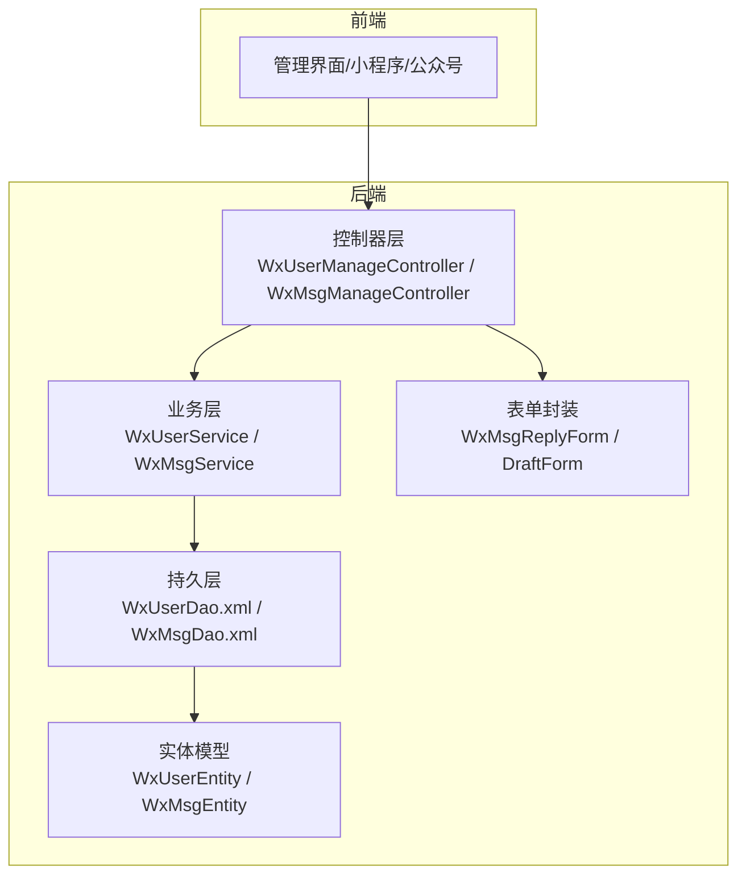
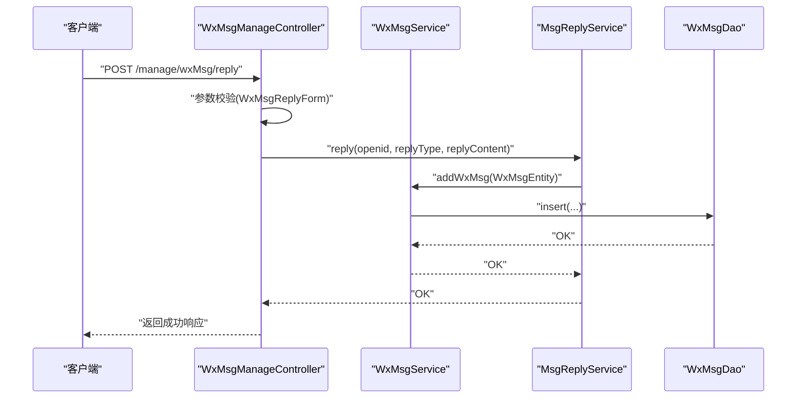
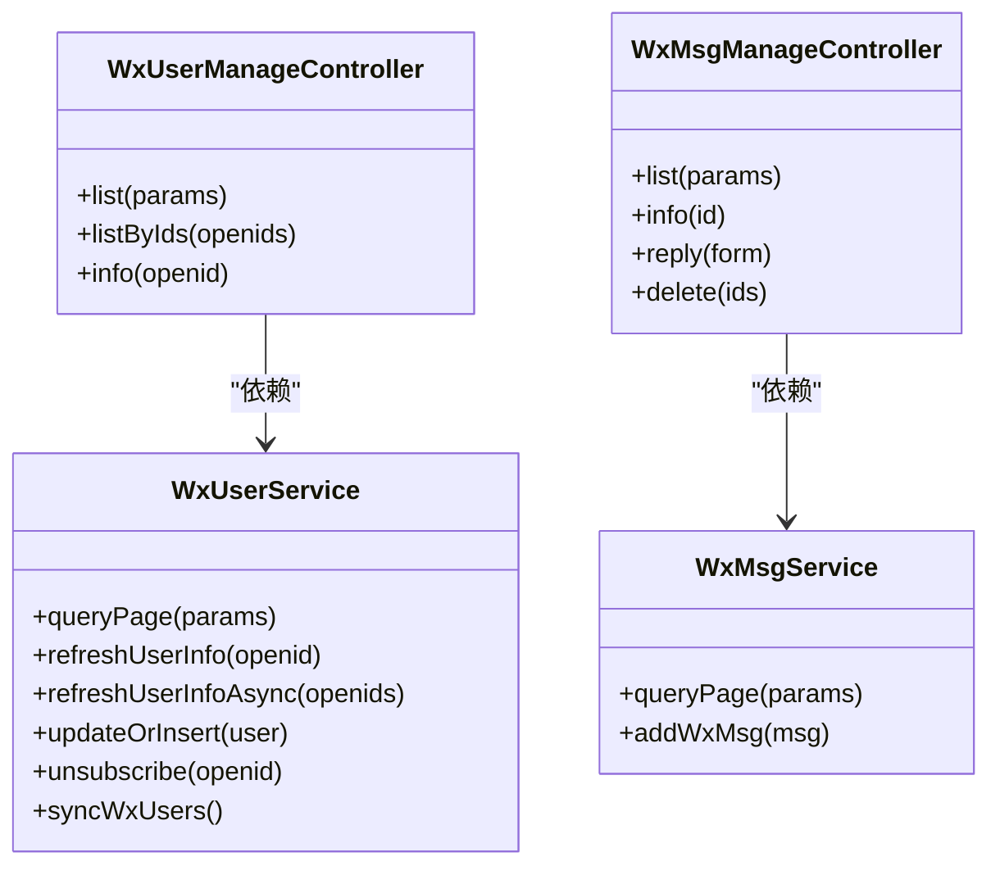
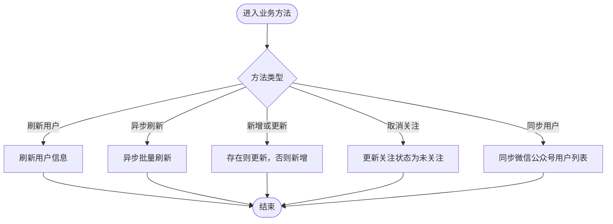
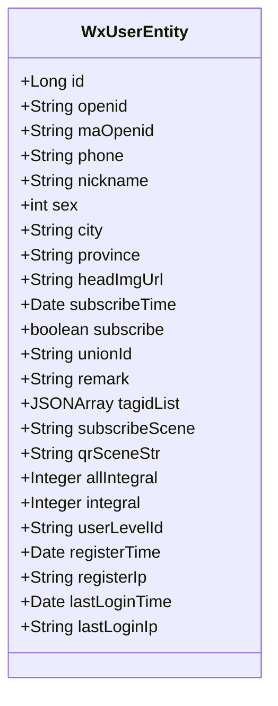
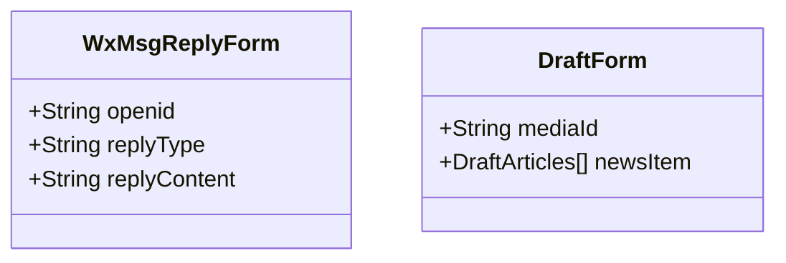
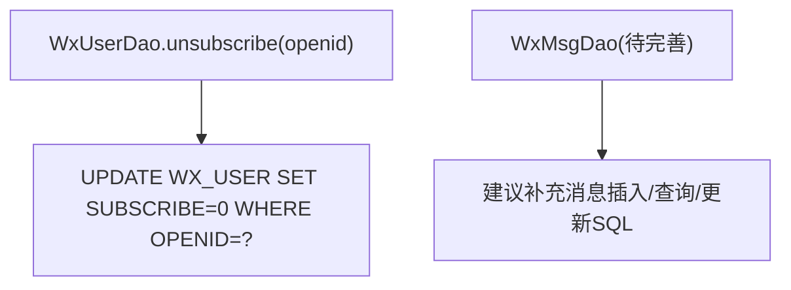
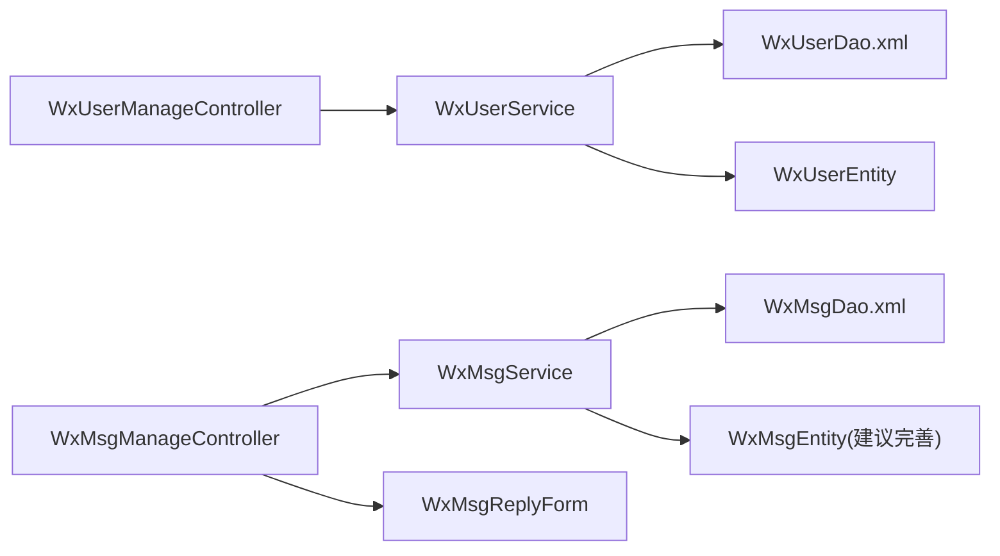

# 微信业务模块扩展

<cite>
**本文引用的文件**
- [WxUserManageController.java](file://platform-admin/src/main/java/com/platform/modules/wx/controller/WxUserManageController.java)
- [WxMsgManageController.java](file://platform-admin/src/main/java/com/platform/modules/wx/controller/WxMsgManageController.java)
- [WxUserService.java](file://platform-biz/src/main/java/com/platform/modules/wx/service/WxUserService.java)
- [WxMsgService.java](file://platform-biz/src/main/java/com/platform/modules/wx/service/WxMsgService.java)
- [WxUserEntity.java](file://platform-biz/src/main/java/com/platform/modules/wx/entity/WxUserEntity.java)
- [WxMsgReplyForm.java](file://platform-biz/src/main/java/com/platform/modules/wx/form/WxMsgReplyForm.java)
- [DraftForm.java](file://platform-admin/src/main/java/com/platform/modules/wx/form/DraftForm.java)
- [WxUserDao.xml](file://platform-biz/src/main/resources/mapper/wx/WxUserDao.xml)
- [WxMsgDao.xml](file://platform-biz/src/main/resources/mapper/wx/WxMsgDao.xml)
</cite>

## 目录
1. [简介](#简介)
2. [项目结构](#项目结构)
3. [核心组件](#核心组件)
4. [架构总览](#架构总览)
5. [详细组件分析](#详细组件分析)
6. [依赖分析](#依赖分析)
7. [性能考虑](#性能考虑)
8. [故障排查指南](#故障排查指南)
9. [结论](#结论)
10. [附录](#附录)

## 简介
本指南面向需要在现有平台中扩展微信生态能力（公众号、小程序、模板消息、素材与二维码、用户标签与同步）的开发者。文档从DAO层数据访问、Service层业务逻辑、Entity实体设计、Form表单封装与校验等方面，系统讲解微信模块的扩展方法，并提供可落地的实施步骤、注意事项与最佳实践。

## 项目结构
微信模块位于后端工程的“platform-biz”与“platform-admin”两个子模块中：
- 控制器层：位于“platform-admin”，负责HTTP接口与权限控制
- 业务层：位于“platform-biz”，负责微信业务编排与数据处理
- 持久层：位于“platform-biz/resources/mapper/wx”，MyBatis映射XML
- 实体与表单：位于“platform-biz”与“platform-admin”的对应包内

图表来源
- [WxUserManageController.java:1-82](file://platform-admin/src/main/java/com/platform/modules/wx/controller/WxUserManageController.java#L1-L82)
- [WxMsgManageController.java:1-101](file://platform-admin/src/main/java/com/platform/modules/wx/controller/WxMsgManageController.java#L1-L101)
- [WxUserService.java:1-73](file://platform-biz/src/main/java/com/platform/modules/wx/service/WxUserService.java#L1-L73)
- [WxMsgService.java:1-50](file://platform-biz/src/main/java/com/platform/modules/wx/service/WxMsgService.java#L1-L50)
- [WxUserDao.xml:1-9](file://platform-biz/src/main/resources/mapper/wx/WxUserDao.xml#L1-L9)
- [WxMsgDao.xml:1-7](file://platform-biz/src/main/resources/mapper/wx/WxMsgDao.xml#L1-L7)
- [WxUserEntity.java:1-171](file://platform-biz/src/main/java/com/platform/modules/wx/entity/WxUserEntity.java#L1-L171)
- [WxMsgReplyForm.java:1-38](file://platform-biz/src/main/java/com/platform/modules/wx/form/WxMsgReplyForm.java#L1-L38)
- [DraftForm.java:1-38](file://platform-admin/src/main/java/com/platform/modules/wx/form/DraftForm.java#L1-L38)

章节来源
- [WxUserManageController.java:1-82](file://platform-admin/src/main/java/com/platform/modules/wx/controller/WxUserManageController.java#L1-L82)
- [WxMsgManageController.java:1-101](file://platform-admin/src/main/java/com/platform/modules/wx/controller/WxMsgManageController.java#L1-L101)
- [WxUserService.java:1-73](file://platform-biz/src/main/java/com/platform/modules/wx/service/WxUserService.java#L1-L73)
- [WxMsgService.java:1-50](file://platform-biz/src/main/java/com/platform/modules/wx/service/WxMsgService.java#L1-L50)
- [WxUserDao.xml:1-9](file://platform-biz/src/main/resources/mapper/wx/WxUserDao.xml#L1-L9)
- [WxMsgDao.xml:1-7](file://platform-biz/src/main/resources/mapper/wx/WxMsgDao.xml#L1-L7)
- [WxUserEntity.java:1-171](file://platform-biz/src/main/java/com/platform/modules/wx/entity/WxUserEntity.java#L1-L171)
- [WxMsgReplyForm.java:1-38](file://platform-biz/src/main/java/com/platform/modules/wx/form/WxMsgReplyForm.java#L1-L38)
- [DraftForm.java:1-38](file://platform-admin/src/main/java/com/platform/modules/wx/form/DraftForm.java#L1-L38)

## 核心组件
- 控制器层
  - WxUserManageController：提供公众号粉丝的分页查询、按openids批量查询、详情查询等接口
  - WxMsgManageController：提供微信消息的分页查询、详情查询、消息回复、删除等接口
- 业务层
  - WxUserService：用户分页查询、刷新用户信息、异步批量刷新、新增或更新、取消关注、同步用户列表
  - WxMsgService：消息分页查询、异步入库
- 实体层
  - WxUserEntity：微信用户信息，含公众号/小程序openId、unionId、标签、关注状态、积分、注册与登录信息等
- 表单层
  - WxMsgReplyForm：消息回复请求参数封装与校验
  - DraftForm：草稿修改参数封装
- 持久层
  - WxUserDao.xml：包含取消关注的更新语句
  - WxMsgDao.xml：消息相关SQL占位

章节来源
- [WxUserManageController.java:44-81](file://platform-admin/src/main/java/com/platform/modules/wx/controller/WxUserManageController.java#L44-L81)
- [WxMsgManageController.java:46-100](file://platform-admin/src/main/java/com/platform/modules/wx/controller/WxMsgManageController.java#L46-L100)
- [WxUserService.java:30-72](file://platform-biz/src/main/java/com/platform/modules/wx/service/WxUserService.java#L30-L72)
- [WxMsgService.java:33-48](file://platform-biz/src/main/java/com/platform/modules/wx/service/WxMsgService.java#L33-L48)
- [WxUserEntity.java:42-164](file://platform-biz/src/main/java/com/platform/modules/wx/entity/WxUserEntity.java#L42-L164)
- [WxMsgReplyForm.java:30-37](file://platform-biz/src/main/java/com/platform/modules/wx/form/WxMsgReplyForm.java#L30-L37)
- [DraftForm.java:33-37](file://platform-admin/src/main/java/com/platform/modules/wx/form/DraftForm.java#L33-L37)
- [WxUserDao.xml:5-7](file://platform-biz/src/main/resources/mapper/wx/WxUserDao.xml#L5-L7)
- [WxMsgDao.xml:4-6](file://platform-biz/src/main/resources/mapper/wx/WxMsgDao.xml#L4-L6)

## 架构总览
微信模块遵循经典的分层架构：控制器接收请求并鉴权，业务层编排微信API与本地数据，持久层通过MyBatis完成数据库操作，实体与表单作为数据契约贯穿各层。

图表来源
- [WxMsgManageController.java:80-86](file://platform-admin/src/main/java/com/platform/modules/wx/controller/WxMsgManageController.java#L80-L86)
- [WxMsgService.java:40-48](file://platform-biz/src/main/java/com/platform/modules/wx/service/WxMsgService.java#L40-L48)
- [WxMsgDao.xml:4-6](file://platform-biz/src/main/resources/mapper/wx/WxMsgDao.xml#L4-L6)

## 详细组件分析

### 控制器层
- WxUserManageController
  - 提供分页查询、按openids批量查询、详情查询
  - 使用Shiro注解进行权限控制
- WxMsgManageController
  - 提供消息分页、详情、回复、删除
  - 回复接口调用MsgReplyService并落库

图表来源
- [WxUserManageController.java:44-81](file://platform-admin/src/main/java/com/platform/modules/wx/controller/WxUserManageController.java#L44-L81)
- [WxMsgManageController.java:46-100](file://platform-admin/src/main/java/com/platform/modules/wx/controller/WxMsgManageController.java#L46-L100)
- [WxUserService.java:30-72](file://platform-biz/src/main/java/com/platform/modules/wx/service/WxUserService.java#L30-L72)
- [WxMsgService.java:33-48](file://platform-biz/src/main/java/com/platform/modules/wx/service/WxMsgService.java#L33-L48)

章节来源
- [WxUserManageController.java:44-81](file://platform-admin/src/main/java/com/platform/modules/wx/controller/WxUserManageController.java#L44-L81)
- [WxMsgManageController.java:46-100](file://platform-admin/src/main/java/com/platform/modules/wx/controller/WxMsgManageController.java#L46-L100)

### 业务层
- WxUserService
  - 定义用户分页、刷新、异步刷新、新增或更新、取消关注、同步用户列表等接口
- WxMsgService
  - 定义消息分页、异步入库接口

图表来源
- [WxUserService.java:30-72](file://platform-biz/src/main/java/com/platform/modules/wx/service/WxUserService.java#L30-L72)

章节来源
- [WxUserService.java:30-72](file://platform-biz/src/main/java/com/platform/modules/wx/service/WxUserService.java#L30-L72)
- [WxMsgService.java:33-48](file://platform-biz/src/main/java/com/platform/modules/wx/service/WxMsgService.java#L33-L48)

### 实体层
- WxUserEntity
  - 字段覆盖公众号/小程序openId、unionId、昵称、性别、城市、省份、头像、关注时间、关注状态、备注、标签、扫码场景、积分、会员等级、注册与登录信息等
  - 支持从微信用户对象转换构造
- WxMsgEntity
  - 消息实体（当前Mapper XML未定义具体字段，建议后续补充）

图表来源
- [WxUserEntity.java:42-164](file://platform-biz/src/main/java/com/platform/modules/wx/entity/WxUserEntity.java#L42-L164)

章节来源
- [WxUserEntity.java:42-164](file://platform-biz/src/main/java/com/platform/modules/wx/entity/WxUserEntity.java#L42-L164)
- [WxMsgDao.xml:4-6](file://platform-biz/src/main/resources/mapper/wx/WxMsgDao.xml#L4-L6)

### 表单层
- WxMsgReplyForm
  - 封装消息回复参数并进行非空校验
- DraftForm
  - 草稿修改参数封装，支持媒体ID与图文列表

图表来源
- [WxMsgReplyForm.java:30-37](file://platform-biz/src/main/java/com/platform/modules/wx/form/WxMsgReplyForm.java#L30-L37)
- [DraftForm.java:33-37](file://platform-admin/src/main/java/com/platform/modules/wx/form/DraftForm.java#L33-L37)

章节来源
- [WxMsgReplyForm.java:30-37](file://platform-biz/src/main/java/com/platform/modules/wx/form/WxMsgReplyForm.java#L30-L37)
- [DraftForm.java:33-37](file://platform-admin/src/main/java/com/platform/modules/wx/form/DraftForm.java#L33-L37)

### 持久层
- WxUserDao.xml
  - 提供取消关注的更新语句
- WxMsgDao.xml
  - 当前为空，建议补充消息相关SQL

图表来源
- [WxUserDao.xml:5-7](file://platform-biz/src/main/resources/mapper/wx/WxUserDao.xml#L5-L7)
- [WxMsgDao.xml:4-6](file://platform-biz/src/main/resources/mapper/wx/WxMsgDao.xml#L4-L6)

章节来源
- [WxUserDao.xml:5-7](file://platform-biz/src/main/resources/mapper/wx/WxUserDao.xml#L5-L7)
- [WxMsgDao.xml:4-6](file://platform-biz/src/main/resources/mapper/wx/WxMsgDao.xml#L4-L6)

## 依赖分析
- 控制器到业务：WxUserManageController与WxMsgManageController分别依赖WxUserService与WxMsgService
- 业务到持久层：业务接口通过DAO执行数据库操作
- 实体与表单：控制器接收表单，业务层处理实体，持久层映射实体

图表来源
- [WxUserManageController.java:44-81](file://platform-admin/src/main/java/com/platform/modules/wx/controller/WxUserManageController.java#L44-L81)
- [WxMsgManageController.java:46-100](file://platform-admin/src/main/java/com/platform/modules/wx/controller/WxMsgManageController.java#L46-L100)
- [WxUserService.java:30-72](file://platform-biz/src/main/java/com/platform/modules/wx/service/WxUserService.java#L30-L72)
- [WxMsgService.java:33-48](file://platform-biz/src/main/java/com/platform/modules/wx/service/WxMsgService.java#L33-L48)
- [WxUserDao.xml:5-7](file://platform-biz/src/main/resources/mapper/wx/WxUserDao.xml#L5-L7)
- [WxMsgDao.xml:4-6](file://platform-biz/src/main/resources/mapper/wx/WxMsgDao.xml#L4-L6)
- [WxUserEntity.java:42-164](file://platform-biz/src/main/java/com/platform/modules/wx/entity/WxUserEntity.java#L42-L164)
- [WxMsgReplyForm.java:30-37](file://platform-biz/src/main/java/com/platform/modules/wx/form/WxMsgReplyForm.java#L30-L37)

章节来源
- [WxUserManageController.java:44-81](file://platform-admin/src/main/java/com/platform/modules/wx/controller/WxUserManageController.java#L44-L81)
- [WxMsgManageController.java:46-100](file://platform-admin/src/main/java/com/platform/modules/wx/controller/WxMsgManageController.java#L46-L100)
- [WxUserService.java:30-72](file://platform-biz/src/main/java/com/platform/modules/wx/service/WxUserService.java#L30-L72)
- [WxMsgService.java:33-48](file://platform-biz/src/main/java/com/platform/modules/wx/service/WxMsgService.java#L33-L48)
- [WxUserDao.xml:5-7](file://platform-biz/src/main/resources/mapper/wx/WxUserDao.xml#L5-L7)
- [WxMsgDao.xml:4-6](file://platform-biz/src/main/resources/mapper/wx/WxMsgDao.xml#L4-L6)
- [WxUserEntity.java:42-164](file://platform-biz/src/main/java/com/platform/modules/wx/entity/WxUserEntity.java#L42-L164)
- [WxMsgReplyForm.java:30-37](file://platform-biz/src/main/java/com/platform/modules/wx/form/WxMsgReplyForm.java#L30-L37)

## 性能考虑
- 分页查询：优先使用分页接口，避免一次性加载大量数据
- 异步刷新：对大批量用户信息刷新采用异步批处理，降低阻塞
- 缓存策略：对高频查询（如用户基础信息）引入缓存，减少重复拉取微信API
- SQL优化：为常用查询字段建立索引（如openid、unionId、关注状态）
- 日志与监控：对微信API调用与数据库写入增加埋点，便于追踪性能瓶颈

## 故障排查指南
- 接口鉴权失败
  - 检查Shiro权限注解与菜单授权是否匹配
- 参数校验失败
  - 确认WxMsgReplyForm的必填字段是否完整
- 用户同步异常
  - 核对WxUserService.syncWxUsers实现与微信接口返回格式
- 取消关注未生效
  - 确认WxUserDao.xml的unsubscribe语句执行是否成功
- 消息回复失败
  - 检查MsgReplyService调用链与微信客服/模板消息接口返回

章节来源
- [WxMsgManageController.java:78-86](file://platform-admin/src/main/java/com/platform/modules/wx/controller/WxMsgManageController.java#L78-L86)
- [WxMsgReplyForm.java:30-37](file://platform-biz/src/main/java/com/platform/modules/wx/form/WxMsgReplyForm.java#L30-L37)
- [WxUserService.java:70-72](file://platform-biz/src/main/java/com/platform/modules/wx/service/WxUserService.java#L70-L72)
- [WxUserDao.xml:5-7](file://platform-biz/src/main/resources/mapper/wx/WxUserDao.xml#L5-L7)

## 结论
微信模块以清晰的分层设计实现了公众号粉丝管理、消息处理与回复、以及用户信息同步等核心能力。通过表单校验、实体契约与DAO映射，系统具备良好的扩展性。建议后续完善消息实体与SQL、接入更多微信能力（模板消息、素材、二维码、用户标签），并配套缓存与监控机制，持续提升稳定性与性能。

## 附录

### 扩展新功能清单（示例）
- 新增模板消息
  - 在业务层新增模板消息Service接口与实现
  - 在控制器新增模板消息管理接口
  - 在DAO中补充模板消息相关SQL
  - 在实体中新增模板消息实体类
- 集成素材管理
  - 新增素材上传、列表、删除接口
  - 在DAO中补充素材相关SQL
  - 在实体中新增素材实体类
- 处理微信回调
  - 新增回调入口控制器，解析微信加密消息
  - 在业务层编写消息入库与事件处理逻辑
  - 在DAO中补充回调消息与事件记录SQL

### 安全配置与最佳实践
- HTTPS与证书：确保回调域名与证书有效
- 签名校验：对接收的消息进行签名验证
- 参数校验：严格使用表单类进行参数校验
- 权限控制：基于Shiro对敏感接口进行权限拦截
- 日志审计：对关键操作与异常进行日志记录
- 限流降级：对微信API调用进行限流与熔断保护