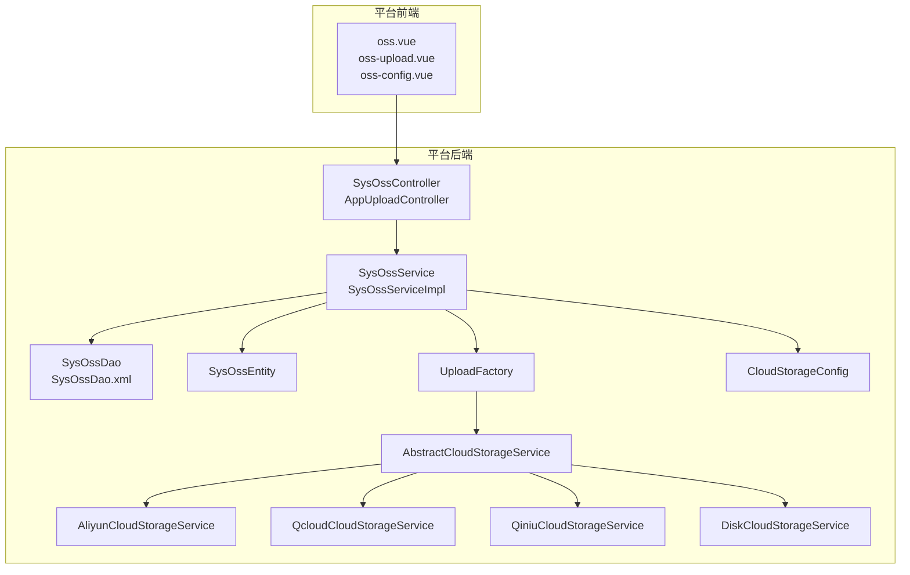
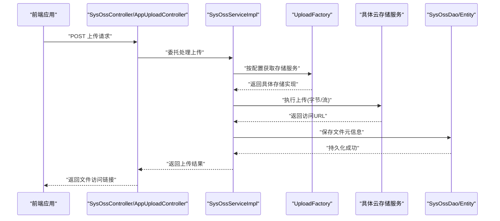
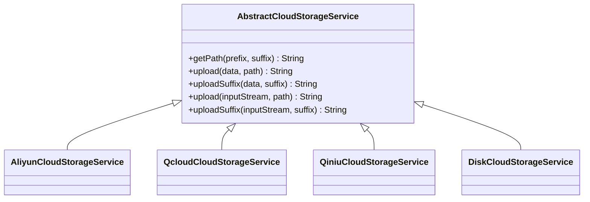
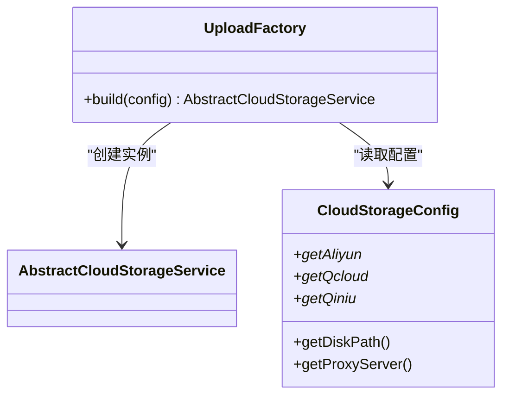
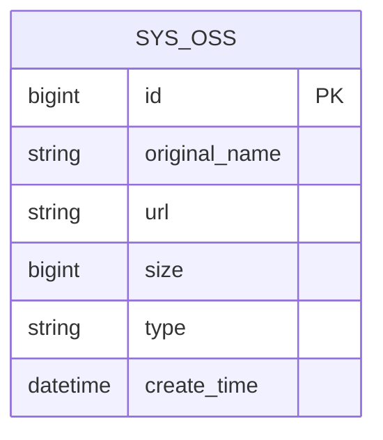
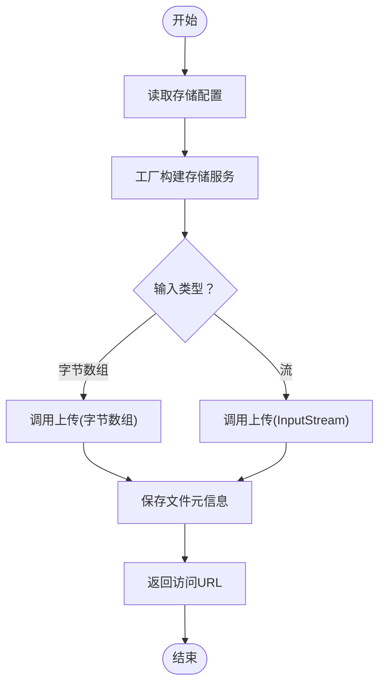
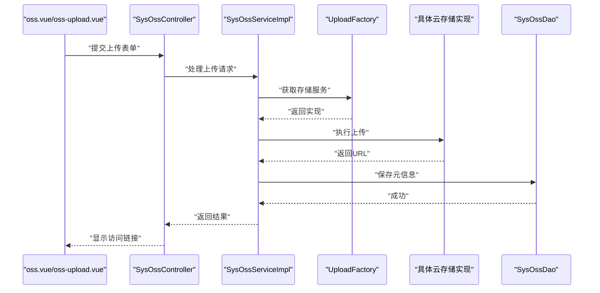
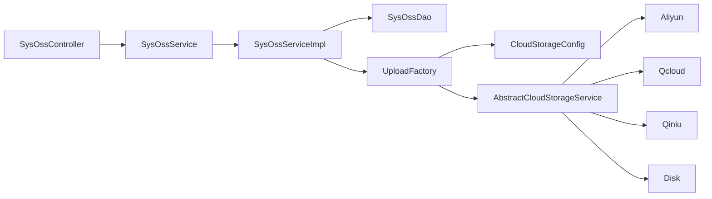

# 文件存储模块扩展

<cite>
**本文引用的文件**
- [AbstractCloudStorageService.java](file://platform-biz/src/main/java/com/platform/modules/oss/cloud/AbstractCloudStorageService.java)
- [AliyunCloudStorageService.java](file://platform-biz/src/main/java/com/platform/modules/oss/cloud/AliyunCloudStorageService.java)
- [QcloudCloudStorageService.java](file://platform-biz/src/main/java/com/platform/modules/oss/cloud/QcloudCloudStorageService.java)
- [QiniuCloudStorageService.java](file://platform-biz/src/main/java/com/platform/modules/oss/cloud/QiniuCloudStorageService.java)
- [DiskCloudStorageService.java](file://platform-biz/src/main/java/com/platform/modules/oss/cloud/DiskCloudStorageService.java)
- [CloudStorageConfig.java](file://platform-biz/src/main/java/com/platform/modules/oss/cloud/CloudStorageConfig.java)
- [UploadFactory.java](file://platform-biz/src/main/java/com/platform/modules/oss/cloud/UploadFactory.java)
- [SysOssDao.java](file://platform-biz/src/main/java/com/platform/modules/oss/dao/SysOssDao.java)
- [SysOssEntity.java](file://platform-biz/src/main/java/com/platform/modules/oss/entity/SysOssEntity.java)
- [SysOssService.java](file://platform-biz/src/main/java/com/platform/modules/oss/service/SysOssService.java)
- [SysOssServiceImpl.java](file://platform-biz/src/main/java/com/platform/modules/oss/service/impl/SysOssServiceImpl.java)
- [SysOssDao.xml](file://platform-biz/src/main/resources/mapper/oss/SysOssDao.xml)
- [SysOssController.java](file://platform-admin/src/main/java/com/platform/modules/oss/controller/SysOssController.java)
- [AppUploadController.java](file://platform-api/src/main/java/com/platform/modules/app/controller/AppUploadController.java)
- [oss.vue](file://platform-admin-ui/src/views/modules/oss/oss.vue)
- [oss-upload.vue](file://platform-admin-ui/src/views/modules/oss/oss-upload.vue)
- [oss-config.vue](file://platform-admin-ui/src/views/modules/oss/oss-config.vue)
- [base.sql](file://_sql/base.sql)
</cite>

## 目录
1. [简介](#简介)
2. [项目结构](#项目结构)
3. [核心组件](#核心组件)
4. [架构总览](#架构总览)
5. [详细组件分析](#详细组件分析)
6. [依赖关系分析](#依赖关系分析)
7. [性能考量](#性能考量)
8. [故障排查指南](#故障排查指南)
9. [结论](#结论)
10. [附录](#附录)

## 简介
本文件存储模块扩展文档面向希望在现有平台中扩展文件上传与存储能力的开发者，涵盖以下内容：
- 云存储服务集成：阿里云、腾讯云、七牛云、MINIO、华为云及本地磁盘存储的抽象与实现
- 文件管理与图片处理：统一上传接口、路径生成策略、后缀处理与返回访问地址
- DAO 层实现：文件信息表与存储配置表的数据访问
- Service 层逻辑：文件上传、下载、删除、缩略图生成等核心业务
- Entity 实体设计：文件实体与存储配置实体的字段与存储策略
- 扩展指南：新增存储服务、扩展文件处理能力、优化存储性能
- 安全与成本：文件安全、访问控制、存储成本优化与最佳实践

## 项目结构
文件存储模块位于 platform-biz 的 oss 包下，采用“云存储抽象 + 多实现 + 工厂 + DAO/Service/Entity + 控制器”的分层架构；前端通过 admin-ui 提供配置与上传界面。

图表来源
- [SysOssController.java](file://platform-admin/src/main/java/com/platform/modules/oss/controller/SysOssController.java)
- [AppUploadController.java](file://platform-api/src/main/java/com/platform/modules/app/controller/AppUploadController.java)
- [SysOssServiceImpl.java](file://platform-biz/src/main/java/com/platform/modules/oss/service/impl/SysOssServiceImpl.java)
- [SysOssDao.java](file://platform-biz/src/main/java/com/platform/modules/oss/dao/SysOssDao.java)
- [SysOssEntity.java](file://platform-biz/src/main/java/com/platform/modules/oss/entity/SysOssEntity.java)
- [UploadFactory.java](file://platform-biz/src/main/java/com/platform/modules/oss/cloud/UploadFactory.java)
- [AbstractCloudStorageService.java](file://platform-biz/src/main/java/com/platform/modules/oss/cloud/AbstractCloudStorageService.java)
- [AliyunCloudStorageService.java](file://platform-biz/src/main/java/com/platform/modules/oss/cloud/AliyunCloudStorageService.java)
- [QcloudCloudStorageService.java](file://platform-biz/src/main/java/com/platform/modules/oss/cloud/QcloudCloudStorageService.java)
- [QiniuCloudStorageService.java](file://platform-biz/src/main/java/com/platform/modules/oss/cloud/QiniuCloudStorageService.java)
- [DiskCloudStorageService.java](file://platform-biz/src/main/java/com/platform/modules/oss/cloud/DiskCloudStorageService.java)
- [CloudStorageConfig.java](file://platform-biz/src/main/java/com/platform/modules/oss/cloud/CloudStorageConfig.java)

章节来源
- [SysOssController.java](file://platform-admin/src/main/java/com/platform/modules/oss/controller/SysOssController.java)
- [SysOssServiceImpl.java](file://platform-biz/src/main/java/com/platform/modules/oss/service/impl/SysOssServiceImpl.java)
- [SysOssDao.java](file://platform-biz/src/main/java/com/platform/modules/oss/dao/SysOssDao.java)
- [SysOssEntity.java](file://platform-biz/src/main/java/com/platform/modules/oss/entity/SysOssEntity.java)
- [UploadFactory.java](file://platform-biz/src/main/java/com/platform/modules/oss/cloud/UploadFactory.java)
- [AbstractCloudStorageService.java](file://platform-biz/src/main/java/com/platform/modules/oss/cloud/AbstractCloudStorageService.java)
- [AliyunCloudStorageService.java](file://platform-biz/src/main/java/com/platform/modules/oss/cloud/AliyunCloudStorageService.java)
- [QcloudCloudStorageService.java](file://platform-biz/src/main/java/com/platform/modules/oss/cloud/QcloudCloudStorageService.java)
- [QiniuCloudStorageService.java](file://platform-biz/src/main/java/com/platform/modules/oss/cloud/QiniuCloudStorageService.java)
- [DiskCloudStorageService.java](file://platform-biz/src/main/java/com/platform/modules/oss/cloud/DiskCloudStorageService.java)
- [CloudStorageConfig.java](file://platform-biz/src/main/java/com/platform/modules/oss/cloud/CloudStorageConfig.java)

## 核心组件
- 云存储抽象层：统一上传接口与路径生成策略，屏蔽各云厂商差异
- 具体实现：阿里云、腾讯云、七牛云、MINIO、华为云、本地磁盘
- 工厂与配置：根据配置动态选择并实例化对应存储服务
- DAO/Service/Entity：持久化文件元信息与存储配置，提供业务逻辑
- 控制器：对外暴露上传、查询、删除等接口，前后端分离调用

章节来源
- [AbstractCloudStorageService.java](file://platform-biz/src/main/java/com/platform/modules/oss/cloud/AbstractCloudStorageService.java)
- [UploadFactory.java](file://platform-biz/src/main/java/com/platform/modules/oss/cloud/UploadFactory.java)
- [CloudStorageConfig.java](file://platform-biz/src/main/java/com/platform/modules/oss/cloud/CloudStorageConfig.java)
- [SysOssServiceImpl.java](file://platform-biz/src/main/java/com/platform/modules/oss/service/impl/SysOssServiceImpl.java)
- [SysOssDao.java](file://platform-biz/src/main/java/com/platform/modules/oss/dao/SysOssDao.java)
- [SysOssEntity.java](file://platform-biz/src/main/java/com/platform/modules/oss/entity/SysOssEntity.java)

## 架构总览
文件上传从控制器进入，经由 Service 层协调工厂与云存储实现完成上传，并将文件元信息写入数据库；下载与删除同样通过 Service 统一入口调用。

图表来源
- [SysOssController.java](file://platform-admin/src/main/java/com/platform/modules/oss/controller/SysOssController.java)
- [AppUploadController.java](file://platform-api/src/main/java/com/platform/modules/app/controller/AppUploadController.java)
- [SysOssServiceImpl.java](file://platform-biz/src/main/java/com/platform/modules/oss/service/impl/SysOssServiceImpl.java)
- [UploadFactory.java](file://platform-biz/src/main/java/com/platform/modules/oss/cloud/UploadFactory.java)
- [SysOssDao.java](file://platform-biz/src/main/java/com/platform/modules/oss/dao/SysOssDao.java)
- [SysOssEntity.java](file://platform-biz/src/main/java/com/platform/modules/oss/entity/SysOssEntity.java)

## 详细组件分析

### 云存储抽象与实现
- 抽象基类提供统一的路径生成策略与上传接口（支持字节数组与 InputStream）
- 各云厂商实现负责具体的客户端初始化与上传请求封装
- 本地磁盘实现提供本地文件系统写入与代理访问域名拼接

图表来源
- [AbstractCloudStorageService.java](file://platform-biz/src/main/java/com/platform/modules/oss/cloud/AbstractCloudStorageService.java)
- [AliyunCloudStorageService.java](file://platform-biz/src/main/java/com/platform/modules/oss/cloud/AliyunCloudStorageService.java)
- [QcloudCloudStorageService.java](file://platform-biz/src/main/java/com/platform/modules/oss/cloud/QcloudCloudStorageService.java)
- [QiniuCloudStorageService.java](file://platform-biz/src/main/java/com/platform/modules/oss/cloud/QiniuCloudStorageService.java)
- [DiskCloudStorageService.java](file://platform-biz/src/main/java/com/platform/modules/oss/cloud/DiskCloudStorageService.java)

章节来源
- [AbstractCloudStorageService.java](file://platform-biz/src/main/java/com/platform/modules/oss/cloud/AbstractCloudStorageService.java)
- [AliyunCloudStorageService.java](file://platform-biz/src/main/java/com/platform/modules/oss/cloud/AliyunCloudStorageService.java)
- [QcloudCloudStorageService.java](file://platform-biz/src/main/java/com/platform/modules/oss/cloud/QcloudCloudStorageService.java)
- [QiniuCloudStorageService.java](file://platform-biz/src/main/java/com/platform/modules/oss/cloud/QiniuCloudStorageService.java)
- [DiskCloudStorageService.java](file://platform-biz/src/main/java/com/platform/modules/oss/cloud/DiskCloudStorageService.java)

### 工厂与配置
- UploadFactory 根据配置选择具体云存储服务实例
- CloudStorageConfig 封装各云厂商的访问密钥、Endpoint、Bucket、Domain、前缀等参数

图表来源
- [UploadFactory.java](file://platform-biz/src/main/java/com/platform/modules/oss/cloud/UploadFactory.java)
- [CloudStorageConfig.java](file://platform-biz/src/main/java/com/platform/modules/oss/cloud/CloudStorageConfig.java)
- [AbstractCloudStorageService.java](file://platform-biz/src/main/java/com/platform/modules/oss/cloud/AbstractCloudStorageService.java)

章节来源
- [UploadFactory.java](file://platform-biz/src/main/java/com/platform/modules/oss/cloud/UploadFactory.java)
- [CloudStorageConfig.java](file://platform-biz/src/main/java/com/platform/modules/oss/cloud/CloudStorageConfig.java)

### DAO 层实现
- SysOssDao 提供文件记录的增删改查
- SysOssDao.xml 定义 SQL 映射，覆盖插入、更新、删除、分页查询等
- SysOssEntity 表示文件元信息，包含原始名称、存储路径、访问URL、大小、存储类型、创建时间等

图表来源
- [SysOssDao.xml](file://platform-biz/src/main/resources/mapper/oss/SysOssDao.xml)
- [SysOssEntity.java](file://platform-biz/src/main/java/com/platform/modules/oss/entity/SysOssEntity.java)

章节来源
- [SysOssDao.java](file://platform-biz/src/main/java/com/platform/modules/oss/dao/SysOssDao.java)
- [SysOssDao.xml](file://platform-biz/src/main/resources/mapper/oss/SysOssDao.xml)
- [SysOssEntity.java](file://platform-biz/src/main/java/com/platform/modules/oss/entity/SysOssEntity.java)

### Service 层业务逻辑
- SysOssService 定义上传、删除、分页查询等接口
- SysOssServiceImpl 实现核心业务：调用工厂获取存储服务、执行上传、持久化元信息、返回访问URL
- 支持多种输入：字节数组与 InputStream
- 支持后缀上传：自动生成带日期前缀与UUID的文件路径

图表来源
- [SysOssServiceImpl.java](file://platform-biz/src/main/java/com/platform/modules/oss/service/impl/SysOssServiceImpl.java)
- [UploadFactory.java](file://platform-biz/src/main/java/com/platform/modules/oss/cloud/UploadFactory.java)
- [SysOssDao.java](file://platform-biz/src/main/java/com/platform/modules/oss/dao/SysOssDao.java)

章节来源
- [SysOssService.java](file://platform-biz/src/main/java/com/platform/modules/oss/service/SysOssService.java)
- [SysOssServiceImpl.java](file://platform-biz/src/main/java/com/platform/modules/oss/service/impl/SysOssServiceImpl.java)

### 控制器与前端交互
- SysOssController 对外提供上传、删除、分页查询等接口
- AppUploadController 为移动端或开放平台提供上传入口
- 前端 oss.vue、oss-upload.vue、oss-config.vue 提供配置与上传界面

图表来源
- [SysOssController.java](file://platform-admin/src/main/java/com/platform/modules/oss/controller/SysOssController.java)
- [SysOssServiceImpl.java](file://platform-biz/src/main/java/com/platform/modules/oss/service/impl/SysOssServiceImpl.java)
- [SysOssDao.java](file://platform-biz/src/main/java/com/platform/modules/oss/dao/SysOssDao.java)
- [oss.vue](file://platform-admin-ui/src/views/modules/oss/oss.vue)
- [oss-upload.vue](file://platform-admin-ui/src/views/modules/oss/oss-upload.vue)

章节来源
- [SysOssController.java](file://platform-admin/src/main/java/com/platform/modules/oss/controller/SysOssController.java)
- [AppUploadController.java](file://platform-api/src/main/java/com/platform/modules/app/controller/AppUploadController.java)
- [oss.vue](file://platform-admin-ui/src/views/modules/oss/oss.vue)
- [oss-upload.vue](file://platform-admin-ui/src/views/modules/oss/oss-upload.vue)
- [oss-config.vue](file://platform-admin-ui/src/views/modules/oss/oss-config.vue)

### Entity 实体设计
- SysOssEntity 字段建议包含：主键、原始文件名、存储URL、文件大小、存储类型（本地/云）、创建时间等
- 存储策略：路径按“日期/UUID”组织，便于归档与清理；不同云厂商前缀可独立配置

章节来源
- [SysOssEntity.java](file://platform-biz/src/main/java/com/platform/modules/oss/entity/SysOssEntity.java)

### 图片处理与缩略图生成
- 当前实现聚焦于通用上传与存储，未内置图片处理逻辑
- 扩展建议：在 Service 层增加图片识别与处理步骤，或引入外部图像处理服务（如云厂商提供的图片处理能力），在上传完成后生成多尺寸缩略图并分别存储

## 依赖关系分析
- 控制器依赖 Service 接口
- Service 实现依赖 DAO 与工厂
- 工厂依赖配置对象与具体云存储实现
- 云存储实现依赖各云厂商 SDK 或本地文件系统

图表来源
- [SysOssController.java](file://platform-admin/src/main/java/com/platform/modules/oss/controller/SysOssController.java)
- [SysOssServiceImpl.java](file://platform-biz/src/main/java/com/platform/modules/oss/service/impl/SysOssServiceImpl.java)
- [SysOssDao.java](file://platform-biz/src/main/java/com/platform/modules/oss/dao/SysOssDao.java)
- [UploadFactory.java](file://platform-biz/src/main/java/com/platform/modules/oss/cloud/UploadFactory.java)
- [CloudStorageConfig.java](file://platform-biz/src/main/java/com/platform/modules/oss/cloud/CloudStorageConfig.java)
- [AbstractCloudStorageService.java](file://platform-biz/src/main/java/com/platform/modules/oss/cloud/AbstractCloudStorageService.java)
- [AliyunCloudStorageService.java](file://platform-biz/src/main/java/com/platform/modules/oss/cloud/AliyunCloudStorageService.java)
- [QcloudCloudStorageService.java](file://platform-biz/src/main/java/com/platform/modules/oss/cloud/QcloudCloudStorageService.java)
- [QiniuCloudStorageService.java](file://platform-biz/src/main/java/com/platform/modules/oss/cloud/QiniuCloudStorageService.java)
- [DiskCloudStorageService.java](file://platform-biz/src/main/java/com/platform/modules/oss/cloud/DiskCloudStorageService.java)

章节来源
- [SysOssController.java](file://platform-admin/src/main/java/com/platform/modules/oss/controller/SysOssController.java)
- [SysOssServiceImpl.java](file://platform-biz/src/main/java/com/platform/modules/oss/service/impl/SysOssServiceImpl.java)
- [SysOssDao.java](file://platform-biz/src/main/java/com/platform/modules/oss/dao/SysOssDao.java)
- [UploadFactory.java](file://platform-biz/src/main/java/com/platform/modules/oss/cloud/UploadFactory.java)
- [CloudStorageConfig.java](file://platform-biz/src/main/java/com/platform/modules/oss/cloud/CloudStorageConfig.java)
- [AbstractCloudStorageService.java](file://platform-biz/src/main/java/com/platform/modules/oss/cloud/AbstractCloudStorageService.java)

## 性能考量
- 上传策略
  - 流式上传：优先使用 InputStream 上传，避免大文件内存占用
  - 分片上传：针对大文件可引入分片上传（需结合云厂商SDK特性）
- 缓存与CDN
  - 利用云厂商CDN加速访问，合理设置缓存头
- 存储成本优化
  - 不同生命周期文件采用不同存储层（低频/归档）
  - 定期清理无用文件与缩略图
- 并发与限速
  - 控制并发上传数量，避免打满带宽
  - 对外接口增加速率限制与熔断保护

## 故障排查指南
- 上传失败
  - 检查配置项是否正确（密钥、Endpoint、Bucket、Domain、前缀）
  - 查看异常栈信息定位具体云厂商客户端错误
- 访问404
  - 确认返回URL与域名配置一致
  - 检查云存储桶权限与跨域设置
- 本地磁盘上传异常
  - 确认磁盘路径存在且具备写权限
  - 检查代理服务器路径与Nginx/网关路由配置

章节来源
- [AliyunCloudStorageService.java](file://platform-biz/src/main/java/com/platform/modules/oss/cloud/AliyunCloudStorageService.java)
- [QcloudCloudStorageService.java](file://platform-biz/src/main/java/com/platform/modules/oss/cloud/QcloudCloudStorageService.java)
- [QiniuCloudStorageService.java](file://platform-biz/src/main/java/com/platform/modules/oss/cloud/QiniuCloudStorageService.java)
- [DiskCloudStorageService.java](file://platform-biz/src/main/java/com/platform/modules/oss/cloud/DiskCloudStorageService.java)

## 结论
该文件存储模块通过抽象层与工厂模式实现了对多家云存储与本地磁盘的统一接入，配合完善的DAO/Service/Entity与控制器，形成了清晰的上传、持久化与访问链路。后续可在保持现有架构稳定性的前提下，扩展图片处理、分片上传、多版本与生命周期管理等能力，进一步提升性能与安全性。

## 附录

### 数据库脚本参考
- 文件信息表：包含主键、原始名称、URL、大小、类型、创建时间等字段
- 存储配置表：用于保存各云厂商的密钥、Endpoint、Bucket、Domain、前缀、区域等配置

章节来源
- [base.sql](file://_sql/base.sql)

### 扩展新存储服务步骤
- 新建实现类继承抽象基类，完成客户端初始化与上传实现
- 在工厂中增加分支，根据配置选择新实现
- 在前端配置页面新增对应字段并联动控制器/Service
- 补充单元测试与集成测试

章节来源
- [AbstractCloudStorageService.java](file://platform-biz/src/main/java/com/platform/modules/oss/cloud/AbstractCloudStorageService.java)
- [UploadFactory.java](file://platform-biz/src/main/java/com/platform/modules/oss/cloud/UploadFactory.java)