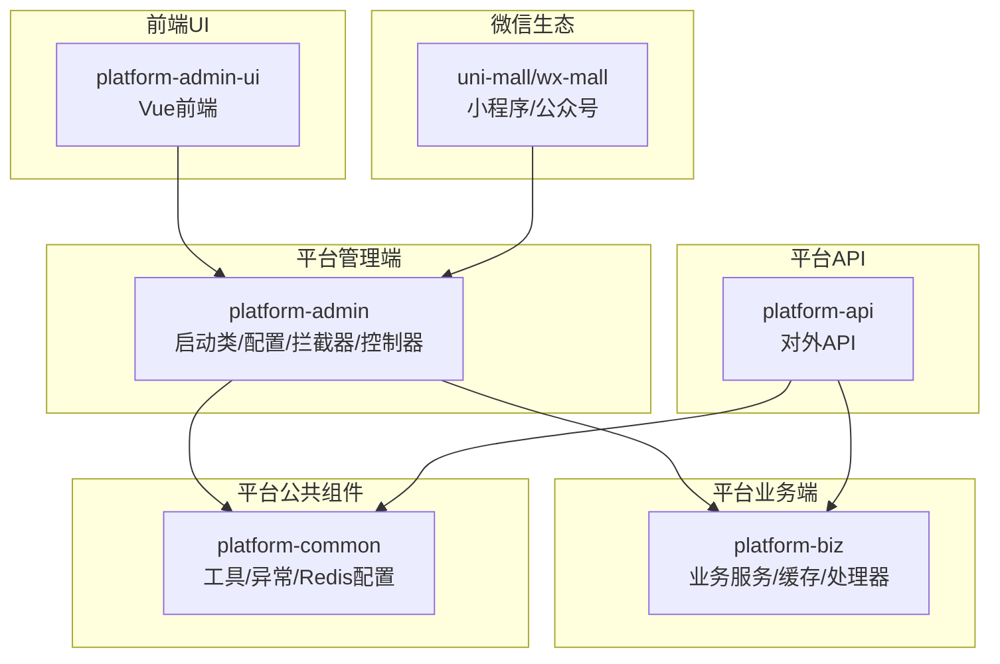
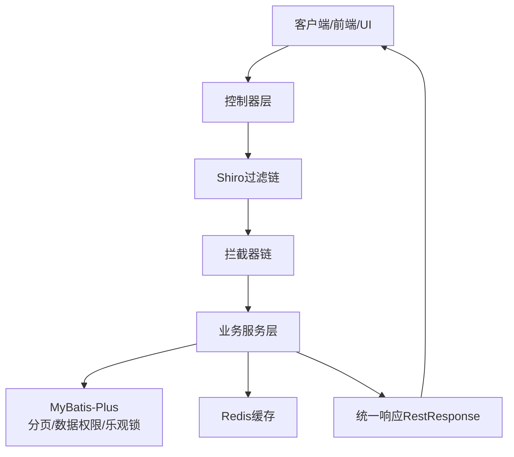
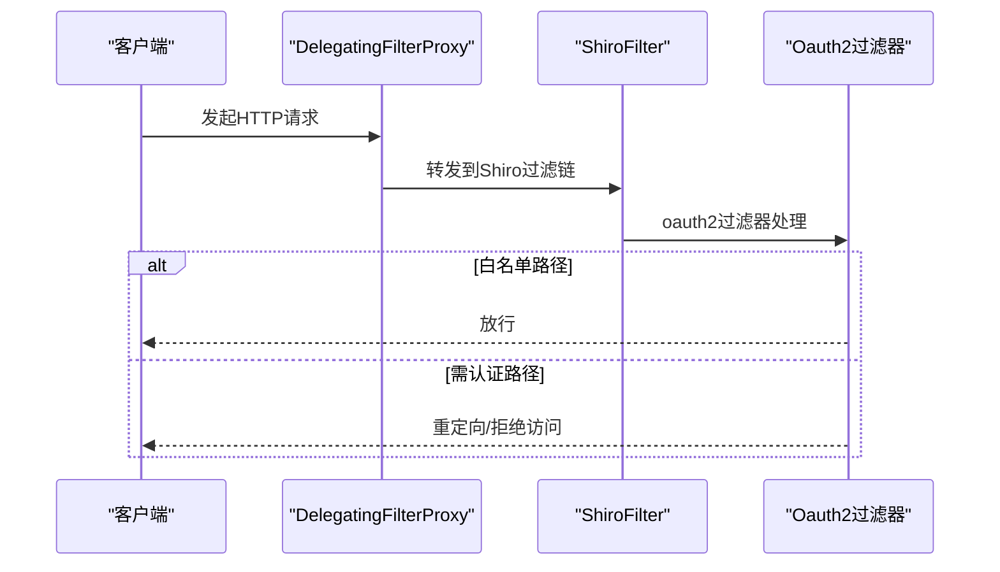
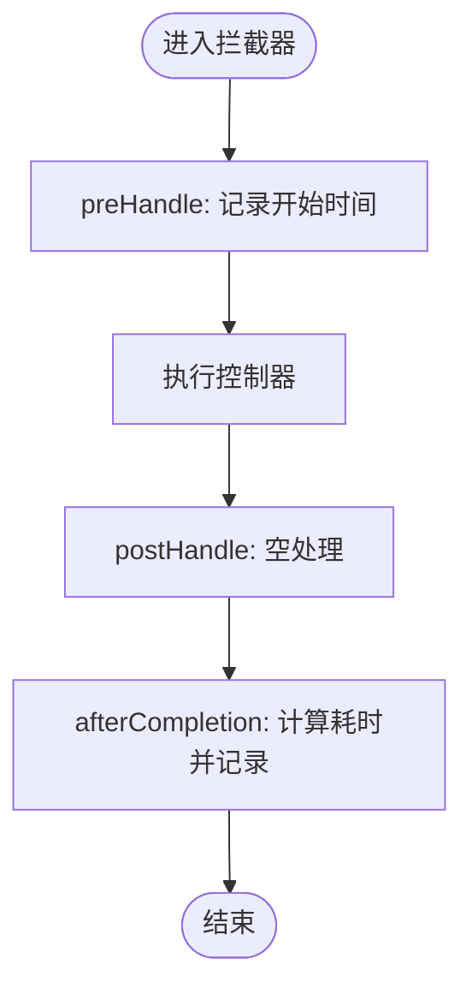
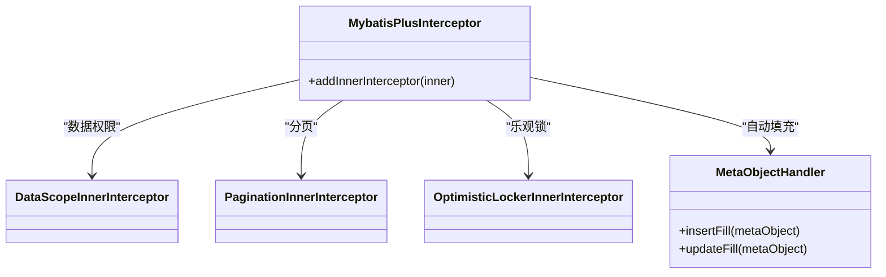
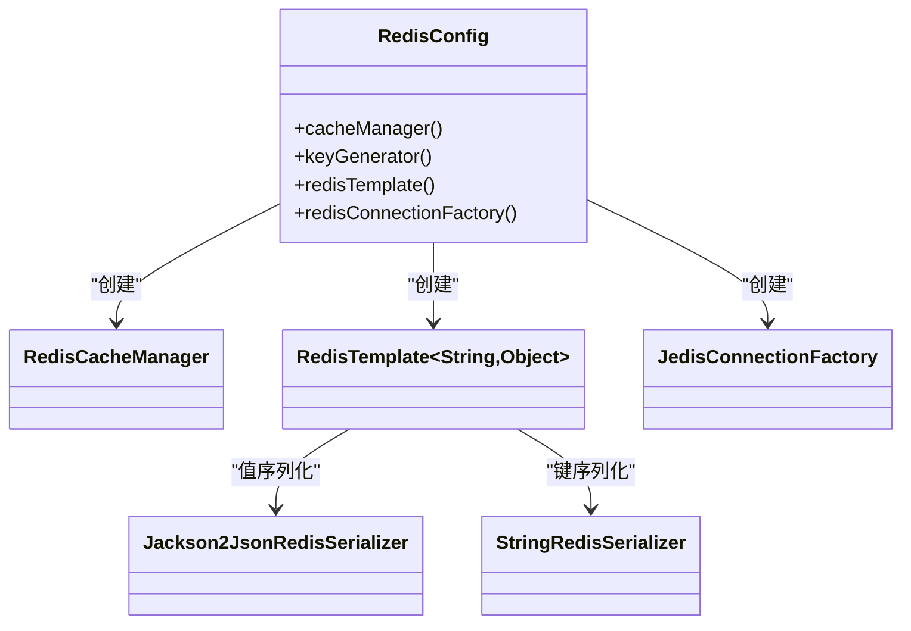
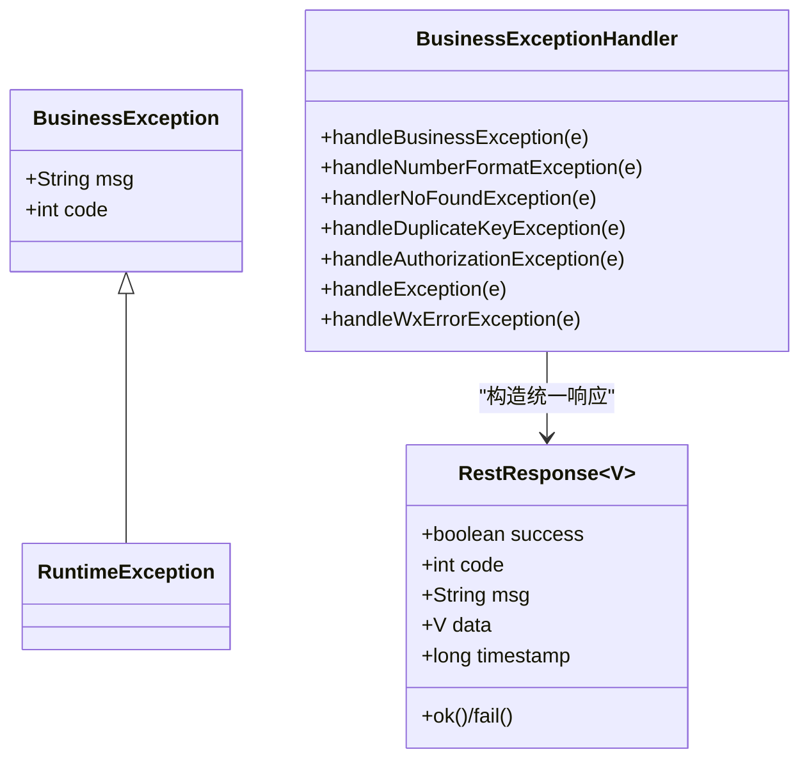
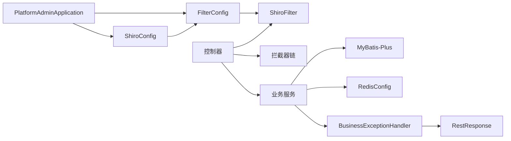

# 模块集成模式

<cite>
**本文引用的文件**
- [application.yml](file://platform-admin/src/main/resources/application.yml)
- [MybatisPlusConfig.java](file://platform-admin/src/main/java/com/platform/config/MybatisPlusConfig.java)
- [ShiroConfig.java](file://platform-admin/src/main/java/com/platform/config/ShiroConfig.java)
- [FilterConfig.java](file://platform-admin/src/main/java/com/platform/config/FilterConfig.java)
- [RequestUriLogInterceptor.java](file://platform-admin/src/main/java/com/platform/config/RequestUriLogInterceptor.java)
- [RedisConfig.java](file://platform-common/src/main/java/com/platform/config/RedisConfig.java)
- [RestResponse.java](file://platform-common/src/main/java/com/platform/common/utils/RestResponse.java)
- [BusinessException.java](file://platform-common/src/main/java/com/platform/common/exception/BusinessException.java)
- [BusinessExceptionHandler.java](file://platform-common/src/main/java/com/platform/common/exception/BusinessExceptionHandler.java)
- [Constant.java](file://platform-common/src/main/java/com/platform/common/utils/Constant.java)
- [PlatformAdminApplication.java](file://platform-admin/src/main/java/com/platform/PlatformAdminApplication.java)
</cite>

## 目录
1. [引言](#引言)
2. [项目结构](#项目结构)
3. [核心组件](#核心组件)
4. [架构总览](#架构总览)
5. [详细组件分析](#详细组件分析)
6. [依赖关系分析](#依赖关系分析)
7. [性能考虑](#性能考虑)
8. [故障排查指南](#故障排查指南)
9. [结论](#结论)
10. [附录](#附录)

## 引言
本指导文档面向在现有平台基础上新增功能模块的开发者，系统性阐述模块集成的完整流程与最佳实践，涵盖模块间依赖关系管理、配置文件更新、接口设计规范、缓存集成模式（含Redis）、公共组件复用（工具类、异常处理、校验器）、配置管理集成（Spring、MyBatis、第三方服务）、拦截器与处理器集成（请求拦截、响应处理、异常捕获），并提供可落地的集成示例与测试、监控、排障建议。

## 项目结构
平台采用多模块分层架构：
- 平台管理端（platform-admin）：Web入口、控制器、安全与拦截器、MyBatis配置、Swagger文档等
- 平台业务端（platform-biz）：业务服务、缓存、处理器等
- 平台公共组件（platform-common）：工具类、异常处理、Redis配置、XSS/SQL注入防护等
- 平台API（platform-api）：对外API服务（如需扩展）
- 前端UI（platform-admin-ui）：Vue前端工程
- 微信生态（uni-mall、wx-mall）：小程序/公众号相关页面与技能
- 部署与脚本（deploy、scripts）：容器化部署与打包脚本

## 核心组件
- 启动与环境装配：通过启动类排除默认安全与数据源自动配置，引入动态数据源配置，统一输出服务启动信息
- 安全与认证：基于Shiro的OAuth2过滤链与会话管理，结合DelegatingFilterProxy注册
- ORM与分页：MyBatis-Plus插件链（数据权限、分页、乐观锁），自动填充元对象
- 缓存：RedisTemplate与CacheManager，Jackson序列化，连接池配置
- 统一响应与异常：RestResponse统一返回结构，BusinessExceptionHandler集中处理各类异常
- 日志与审计：请求URI拦截器记录耗时、IP、操作人、参数等

章节来源
- [PlatformAdminApplication.java:49-51](file://platform-admin/src/main/java/com/platform/PlatformAdminApplication.java#L49-L51)
- [ShiroConfig.java:63-86](file://platform-admin/src/main/java/com/platform/config/ShiroConfig.java#L63-L86)
- [FilterConfig.java:34-44](file://platform-admin/src/main/java/com/platform/config/FilterConfig.java#L34-L44)
- [MybatisPlusConfig.java:44-54](file://platform-admin/src/main/java/com/platform/config/MybatisPlusConfig.java#L44-L54)
- [RedisConfig.java:91-100](file://platform-common/src/main/java/com/platform/config/RedisConfig.java#L91-L100)
- [RestResponse.java:86-121](file://platform-common/src/main/java/com/platform/common/utils/RestResponse.java#L86-L121)
- [BusinessExceptionHandler.java:46-98](file://platform-common/src/main/java/com/platform/common/exception/BusinessExceptionHandler.java#L46-L98)
- [RequestUriLogInterceptor.java:21-43](file://platform-admin/src/main/java/com/platform/config/RequestUriLogInterceptor.java#L21-L43)

## 架构总览
下图展示了模块集成的关键交互：控制器接收请求，经Shiro认证与拦截器链处理，调用业务服务，访问MyBatis-Plus持久层，读写Redis缓存，最终通过统一响应返回。

图表来源
- [ShiroConfig.java:63-86](file://platform-admin/src/main/java/com/platform/config/ShiroConfig.java#L63-L86)
- [FilterConfig.java:34-44](file://platform-admin/src/main/java/com/platform/config/FilterConfig.java#L34-L44)
- [MybatisPlusConfig.java:44-54](file://platform-admin/src/main/java/com/platform/config/MybatisPlusConfig.java#L44-L54)
- [RedisConfig.java:137-151](file://platform-common/src/main/java/com/platform/config/RedisConfig.java#L137-L151)
- [RestResponse.java:86-121](file://platform-common/src/main/java/com/platform/common/utils/RestResponse.java#L86-L121)

## 详细组件分析

### 安全与认证集成（Shiro + 拦截器）
- Shiro过滤链：对/oauth2自定义过滤器，开放部分静态资源与登录路径，其余路径强制认证
- FilterRegistrationBean：DelegatingFilterProxy将Shiro生命周期交由Servlet容器管理
- 会话管理：启用会话验证、Cookie会话ID、默认Web会话管理器

图表来源
- [ShiroConfig.java:63-86](file://platform-admin/src/main/java/com/platform/config/ShiroConfig.java#L63-L86)
- [FilterConfig.java:34-44](file://platform-admin/src/main/java/com/platform/config/FilterConfig.java#L34-L44)

章节来源
- [ShiroConfig.java:46-61](file://platform-admin/src/main/java/com/platform/config/ShiroConfig.java#L46-L61)
- [ShiroConfig.java:63-86](file://platform-admin/src/main/java/com/platform/config/ShiroConfig.java#L63-L86)
- [FilterConfig.java:34-44](file://platform-admin/src/main/java/com/platform/config/FilterConfig.java#L34-L44)

### 拦截器与审计（请求日志）
- AsyncHandlerInterceptor：preHandle记录开始时间；afterCompletion计算耗时并记录请求URI、IP、操作人、参数
- 使用UrlPathHelper获取请求路径，结合SecurityUtils获取当前用户

图表来源
- [RequestUriLogInterceptor.java:21-43](file://platform-admin/src/main/java/com/platform/config/RequestUriLogInterceptor.java#L21-L43)

章节来源
- [RequestUriLogInterceptor.java:21-114](file://platform-admin/src/main/java/com/platform/config/RequestUriLogInterceptor.java#L21-L114)

### ORM与分页（MyBatis-Plus）
- 插件链顺序：数据权限 → 分页 → 乐观锁
- 自动填充：插入时填充创建时间与逻辑删除字段，更新时填充更新时间

图表来源
- [MybatisPlusConfig.java:44-77](file://platform-admin/src/main/java/com/platform/config/MybatisPlusConfig.java#L44-L77)

章节来源
- [MybatisPlusConfig.java:44-77](file://platform-admin/src/main/java/com/platform/config/MybatisPlusConfig.java#L44-L77)

### 缓存集成（Redis）
- CacheManager：默认TTL 6小时，键值序列化策略
- RedisTemplate：String键与Jackson2Json序列化，Hash键值同样配置
- 连接工厂：Jedis单机配置，支持密码、数据库索引、超时与连接池参数
- KeyGenerator：基于目标类名、方法名与参数数组生成缓存Key

图表来源
- [RedisConfig.java:91-181](file://platform-common/src/main/java/com/platform/config/RedisConfig.java#L91-L181)

章节来源
- [RedisConfig.java:91-181](file://platform-common/src/main/java/com/platform/config/RedisConfig.java#L91-L181)
- [application.yml:81-98](file://platform-admin/src/main/resources/application.yml#L81-L98)

### 统一响应与异常处理
- RestResponse：统一返回结构（success/code/msg/data/timestamp）
- BusinessException：业务异常基类，支持自定义code
- BusinessExceptionHandler：集中处理业务异常、参数异常、路径不存在、重复键、鉴权异常、微信错误等

图表来源
- [RestResponse.java:86-121](file://platform-common/src/main/java/com/platform/common/utils/RestResponse.java#L86-L121)
- [BusinessException.java:28-74](file://platform-common/src/main/java/com/platform/common/exception/BusinessException.java#L28-L74)
- [BusinessExceptionHandler.java:46-98](file://platform-common/src/main/java/com/platform/common/exception/BusinessExceptionHandler.java#L46-L98)

章节来源
- [RestResponse.java:34-121](file://platform-common/src/main/java/com/platform/common/utils/RestResponse.java#L34-L121)
- [BusinessException.java:28-74](file://platform-common/src/main/java/com/platform/common/exception/BusinessException.java#L28-L74)
- [BusinessExceptionHandler.java:36-98](file://platform-common/src/main/java/com/platform/common/exception/BusinessExceptionHandler.java#L36-L98)

### 配置管理集成
- Spring Profile与环境变量：通过application.yml切换环境
- Redis：host/port/password/database/timeout与连接池参数
- MyBatis-Plus：Mapper扫描、实体别名包、驼峰映射、逻辑删除字段、分页与缓存配置
- 第三方服务：邮件、支付宝小程序/网页支付、微信公众号/小程序/支付配置

章节来源
- [application.yml:74-205](file://platform-admin/src/main/resources/application.yml#L74-L205)

## 依赖关系分析
- 启动类排除默认安全与Druid数据源自动配置，引入动态数据源自动配置
- 控制器与业务层通过Shiro过滤链与拦截器链串联
- 业务层依赖MyBatis-Plus与Redis配置
- 统一响应与异常处理横切于各模块

图表来源
- [PlatformAdminApplication.java:49-51](file://platform-admin/src/main/java/com/platform/PlatformAdminApplication.java#L49-L51)
- [ShiroConfig.java:63-86](file://platform-admin/src/main/java/com/platform/config/ShiroConfig.java#L63-L86)
- [FilterConfig.java:34-44](file://platform-admin/src/main/java/com/platform/config/FilterConfig.java#L34-L44)
- [RedisConfig.java:91-100](file://platform-common/src/main/java/com/platform/config/RedisConfig.java#L91-L100)
- [BusinessExceptionHandler.java:46-98](file://platform-common/src/main/java/com/platform/common/exception/BusinessExceptionHandler.java#L46-L98)

章节来源
- [PlatformAdminApplication.java:49-51](file://platform-admin/src/main/java/com/platform/PlatformAdminApplication.java#L49-L51)
- [ShiroConfig.java:63-86](file://platform-admin/src/main/java/com/platform/config/ShiroConfig.java#L63-L86)
- [FilterConfig.java:34-44](file://platform-admin/src/main/java/com/platform/config/FilterConfig.java#L34-L44)
- [RedisConfig.java:91-100](file://platform-common/src/main/java/com/platform/config/RedisConfig.java#L91-L100)
- [BusinessExceptionHandler.java:46-98](file://platform-common/src/main/java/com/platform/common/exception/BusinessExceptionHandler.java#L46-L98)

## 性能考虑
- 连接池与超时：Redis连接池最大活跃数、最大等待、最大空闲、最小空闲；读超时毫秒数
- IO线程与工作线程： Undertow的IO线程与worker线程数量，避免过高导致“打开文件数过多”
- 分页与缓存：MyBatis-Plus分页插件与Redis缓存默认TTL，减少全表扫描与重复计算
- 序列化开销：Jackson2JsonRedisSerializer对复杂对象序列化成本较高，建议控制缓存值粒度

章节来源
- [application.yml:81-98](file://platform-admin/src/main/resources/application.yml#L81-L98)
- [application.yml:4-17](file://platform-admin/src/main/resources/application.yml#L4-L17)
- [RedisConfig.java:154-180](file://platform-common/src/main/java/com/platform/config/RedisConfig.java#L154-L180)

## 故障排查指南
- 认证失败：检查Shiro过滤链白名单与oauth2过滤器配置
- 路径不存在：NoHandlerFoundException会被BusinessExceptionHandler统一转为统一响应
- 重复键冲突：DuplicateKeyException统一提示“数据库中已存在该记录”
- 参数异常：NumberFormatException统一提示“请求参数有误”
- Redis连接问题：核对host/port/password/database/timeout与连接池参数
- 缓存Key冲突：确认KeyGenerator策略与业务Key前缀（如Constant中缓存前缀）

章节来源
- [ShiroConfig.java:73-83](file://platform-admin/src/main/java/com/platform/config/ShiroConfig.java#L73-L83)
- [BusinessExceptionHandler.java:69-98](file://platform-common/src/main/java/com/platform/common/exception/BusinessExceptionHandler.java#L69-L98)
- [RedisConfig.java:154-180](file://platform-common/src/main/java/com/platform/config/RedisConfig.java#L154-L180)
- [Constant.java:64-76](file://platform-common/src/main/java/com/platform/common/utils/Constant.java#L64-L76)

## 结论
通过标准化的安全与认证、拦截器链、ORM与缓存配置、统一响应与异常处理，平台实现了高内聚、低耦合的模块集成范式。新增模块应严格遵循上述规范，确保依赖清晰、配置一致、可观测性强、可维护性高。

## 附录

### 模块集成步骤清单
- 创建模块目录与包结构，遵循现有命名约定
- 在启动类中按需引入模块所需自动配置（如动态数据源）
- 在application.yml中新增模块相关配置项（如第三方服务、模块开关）
- 编写控制器与业务服务，使用统一响应与异常处理
- 如涉及缓存，使用RedisConfig提供的模板与KeyGenerator策略
- 注册拦截器与Shiro过滤器，确保审计与安全策略生效
- 编写单元测试与集成测试，覆盖关键流程与边界条件
- 配置性能监控（日志、指标、告警），持续优化

### 接口设计规范
- 统一使用RestResponse作为返回体
- 异常场景返回明确code与msg
- 参数校验前置，避免无效请求进入业务层
- 控制器方法尽量幂等，必要时引入分布式锁或乐观锁

### 缓存策略设计与失效机制
- TTL策略：热点数据短TTL，冷数据长TTL；默认6小时适用于一般配置类缓存
- Key前缀：使用Constant中定义的前缀，避免Key冲突
- 失效策略：写操作时主动删除相关Key；定时刷新或懒加载兜底
- 多级缓存：本地缓存+Redis缓存，降低跨进程/跨网络开销

### 配置管理集成要点
- Spring Profile：按dev/test/prod分离配置
- MyBatis-Plus：Mapper扫描路径与实体包保持一致
- 第三方服务：集中配置在application.yml，避免硬编码

### 拦截器与处理器集成示例
- 请求拦截：在拦截器中记录请求URI、IP、操作人、参数，便于审计
- 响应处理：统一返回RestResponse，避免业务层散落返回结构
- 异常捕获：通过@RestControllerAdvice集中处理，保证一致性