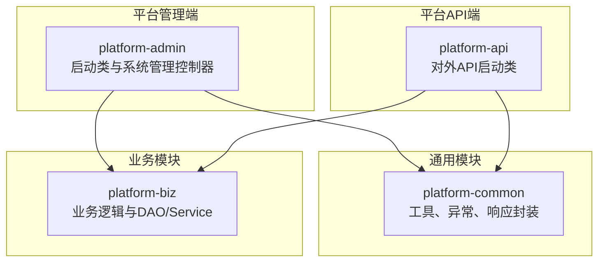
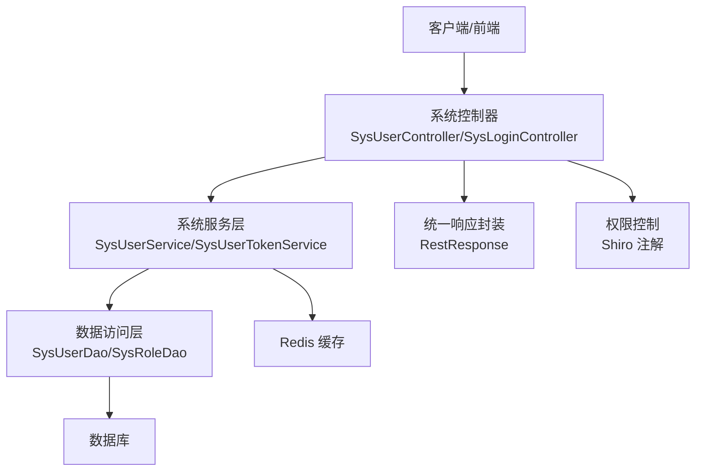
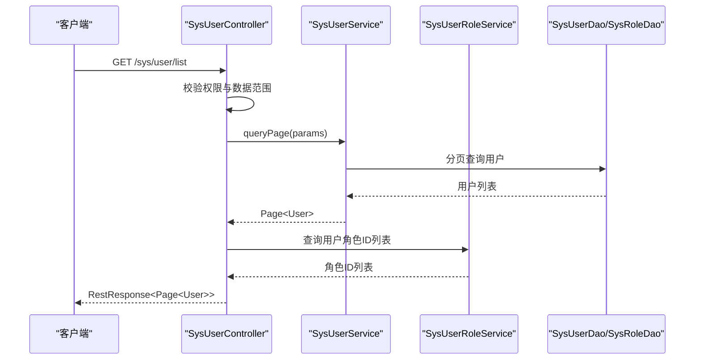
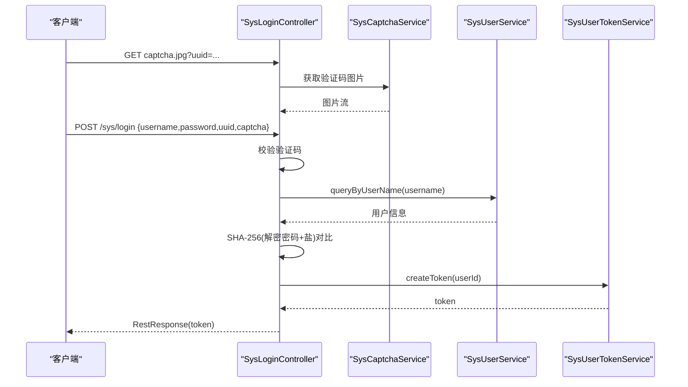
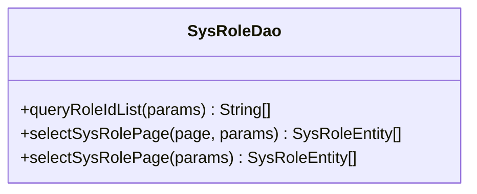
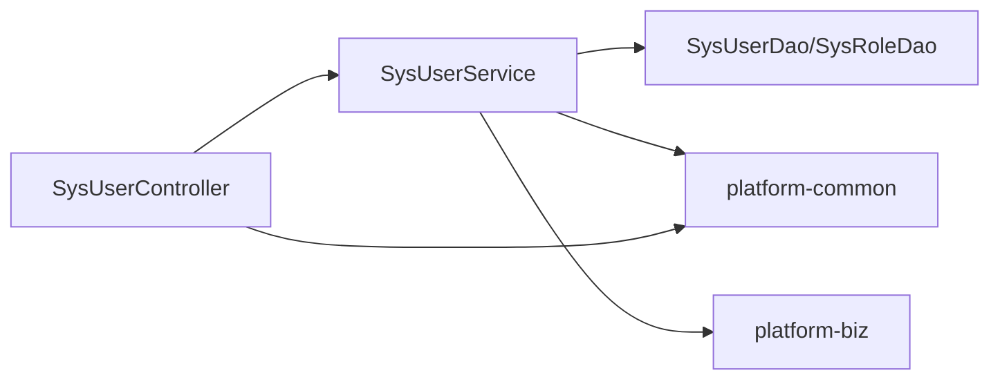

# 系统业务模块扩展

<cite>
**本文引用的文件**
- [PlatformAdminApplication.java](file://platform-admin/src/main/java/com/platform/PlatformAdminApplication.java)
- [PlatformApiApplication.java](file://platform-api/src/main/java/com/platform/PlatformApiApplication.java)
- [application.yml](file://platform-admin/src/main/resources/application.yml)
- [Constant.java](file://platform-common/src/main/java/com/platform/common/utils/Constant.java)
- [RestResponse.java](file://platform-common/src/main/java/com/platform/common/utils/RestResponse.java)
- [TokenGenerator.java](file://platform-common/src/main/java/com/platform/common/utils/TokenGenerator.java)
- [BusinessException.java](file://platform-common/src/main/java/com/platform/common/exception/BusinessException.java)
- [SysUserController.java](file://platform-admin/src/main/java/com/platform/modules/sys/controller/SysUserController.java)
- [SysLoginController.java](file://platform-admin/src/main/java/com/platform/modules/sys/controller/SysLoginController.java)
- [SysRoleDao.java](file://platform-admin/src/main/java/com/platform/modules/sys/dao/SysRoleDao.java)
- [AbstractController.java](file://platform-admin/src/main/java/com/platform/modules/sys/controller/AbstractController.java)
</cite>

## 目录
1. [引言](#引言)
2. [项目结构](#项目结构)
3. [核心组件](#核心组件)
4. [架构总览](#架构总览)
5. [详细组件分析](#详细组件分析)
6. [依赖分析](#依赖分析)
7. [性能考虑](#性能考虑)
8. [故障排查指南](#故障排查指南)
9. [结论](#结论)
10. [附录](#附录)

## 引言
本文件面向系统业务模块扩展的开发者，围绕系统管理功能的扩展方法进行系统性说明，覆盖用户管理、权限控制、系统配置等模块的开发流程；阐述DAO层的数据访问实现与Service层的业务逻辑；介绍Entity实体类的设计与使用；并提供可落地的扩展示例、安全注意事项、性能优化策略与最佳实践。

## 项目结构
该项目采用多模块分层架构，核心模块包括：
- 平台管理端（platform-admin）：提供系统管理后台接口与前端UI集成，包含系统用户、角色、菜单、字典、配置等管理能力。
- 平台API端（platform-api）：提供对外API服务，统一入口与安全控制。
- 平台通用模块（platform-common）：提供公共工具、异常体系、响应封装、常量定义等基础能力。
- 平台业务模块（platform-biz）：承载具体业务逻辑与数据访问（DAO/Service），当前目录下存在对应源码位置。

**图表来源**
- [PlatformAdminApplication.java:1-93](file://platform-admin/src/main/java/com/platform/PlatformAdminApplication.java#L1-L93)
- [PlatformApiApplication.java:1-92](file://platform-api/src/main/java/com/platform/PlatformApiApplication.java#L1-L92)

**章节来源**
- [PlatformAdminApplication.java:42-93](file://platform-admin/src/main/java/com/platform/PlatformAdminApplication.java#L42-L93)
- [PlatformApiApplication.java:41-92](file://platform-api/src/main/java/com/platform/PlatformApiApplication.java#L41-L92)

## 核心组件
- 启动类与容器配置
  - 平台管理端与API端均通过Spring Boot启动类引导，分别启用异步与动态数据源能力，管理端排除安全自动配置，API端排除数据源自动配置，便于按需定制。
- 配置中心与接口文档
  - application.yml集中管理Tomcat线程模型、Redis连接、MyBatis-Plus配置、Knife4j/SpringDoc接口文档分组与扫描包等。
- 响应封装与异常体系
  - RestResponse统一返回结构；BusinessException提供业务异常封装；Constant定义系统常量与枚举。
- 控制器与服务层
  - SysUserController、SysLoginController等控制器负责HTTP请求接入与鉴权注解；Service层负责业务编排与校验；DAO层基于MyBatis-Plus实现数据访问。

**章节来源**
- [application.yml:1-205](file://platform-admin/src/main/resources/application.yml#L1-L205)
- [RestResponse.java:1-122](file://platform-common/src/main/java/com/platform/common/utils/RestResponse.java#L1-L122)
- [BusinessException.java:1-74](file://platform-common/src/main/java/com/platform/common/exception/BusinessException.java#L1-L74)
- [Constant.java:1-240](file://platform-common/src/main/java/com/platform/common/utils/Constant.java#L1-L240)

## 架构总览
系统采用“控制器-服务-数据访问”三层架构，结合Shiro注解进行权限控制，使用MyBatis-Plus进行ORM映射，配合Knife4j/SpringDoc提供接口文档。

**图表来源**
- [SysUserController.java:1-243](file://platform-admin/src/main/java/com/platform/modules/sys/controller/SysUserController.java#L1-L243)
- [SysLoginController.java:1-139](file://platform-admin/src/main/java/com/platform/modules/sys/controller/SysLoginController.java#L1-L139)
- [SysRoleDao.java:1-63](file://platform-admin/src/main/java/com/platform/modules/sys/dao/SysRoleDao.java#L1-L63)
- [application.yml:114-142](file://platform-admin/src/main/resources/application.yml#L114-L142)

## 详细组件分析

### 用户管理模块（控制器与服务）
- 控制器职责
  - 提供用户列表、详情、新增、修改、删除、重置密码、修改密码等接口。
  - 使用Shiro注解进行权限控制，结合数据范围过滤实现数据权限。
- 服务层要点
  - 用户密码采用SHA-256加盐加密；支持批量删除与重置密码；与用户-角色关联服务协作。
- 数据访问层
  - 基于MyBatis-Plus Mapper接口，提供分页查询与自定义条件查询。

**图表来源**
- [SysUserController.java:80-91](file://platform-admin/src/main/java/com/platform/modules/sys/controller/SysUserController.java#L80-L91)
- [SysRoleDao.java:36-62](file://platform-admin/src/main/java/com/platform/modules/sys/dao/SysRoleDao.java#L36-L62)

**章节来源**
- [SysUserController.java:65-241](file://platform-admin/src/main/java/com/platform/modules/sys/controller/SysUserController.java#L65-L241)

### 登录与认证流程
- 验证码与登录
  - 提供图形验证码生成与校验；登录时对AES加密密码进行解密，再与用户盐值+SHA-256比对。
- Token签发与退出
  - 登录成功后生成Token并持久化；退出时执行登出逻辑。

**图表来源**
- [SysLoginController.java:66-123](file://platform-admin/src/main/java/com/platform/modules/sys/controller/SysLoginController.java#L66-L123)

**章节来源**
- [SysLoginController.java:65-138](file://platform-admin/src/main/java/com/platform/modules/sys/controller/SysLoginController.java#L65-L138)

### DAO层数据访问实现
- 角色DAO
  - 提供角色ID列表查询、自定义分页查询、条件查询等接口，支撑用户-角色关联与权限范围计算。
- 用户DAO
  - 位于biz模块（当前仓库中存在对应源码路径），提供用户CRUD与分页查询能力。

**图表来源**
- [SysRoleDao.java:36-62](file://platform-admin/src/main/java/com/platform/modules/sys/dao/SysRoleDao.java#L36-L62)

**章节来源**
- [SysRoleDao.java:30-62](file://platform-admin/src/main/java/com/platform/modules/sys/dao/SysRoleDao.java#L30-L62)

### Entity实体类设计与使用
- 设计原则
  - 字段命名遵循下划线到驼峰映射；逻辑删除字段isDelete与全局配置一致；主键策略采用ASSIGN_UUID。
- 使用建议
  - 在Service层进行字段校验与业务规则处理；在Controller层仅做参数绑定与权限拦截；DAO层专注数据读写。
- 关系映射
  - 用户与角色通过中间表关联；菜单与角色通过权限点关联；字典与分组通过分组ID关联。

**章节来源**
- [application.yml:114-142](file://platform-admin/src/main/resources/application.yml#L114-L142)

### 系统配置管理扩展
- 配置项组织
  - 将系统配置分为“短信配置”、“云存储配置”、“定时任务状态”、“枚举常量”等类别，便于集中管理与扩展。
- 扩展步骤
  - 新增配置Key与默认值；在配置控制器中暴露新增配置的增删改查接口；在Service层进行配置校验与缓存更新；在Controller层通过注解控制访问权限。

**章节来源**
- [Constant.java:48-81](file://platform-common/src/main/java/com/platform/common/utils/Constant.java#L48-L81)

### 权限控制逻辑扩展
- 权限注解
  - 使用Shiro注解（如@RequiresPermissions）在控制器方法上声明所需权限点，确保接口访问受控。
- 数据范围
  - 通过AbstractController提供的数据范围过滤参数，结合Service层的分页查询，实现按组织/部门的数据隔离。
- 最佳实践
  - 权限点命名规范（如sys:user:list）；避免在Service层重复校验权限；统一异常处理与响应封装。

**章节来源**
- [SysUserController.java:67-204](file://platform-admin/src/main/java/com/platform/modules/sys/controller/SysUserController.java#L67-L204)
- [AbstractController.java](file://platform-admin/src/main/java/com/platform/modules/sys/controller/AbstractController.java)

## 依赖分析
- 组件耦合
  - 控制器依赖服务层；服务层依赖DAO层；DAO层依赖MyBatis-Plus与数据库；通用模块为跨模块共享。
- 外部依赖
  - MyBatis-Plus、Knife4j/SpringDoc、Shiro、Redis、Druid等。
- 循环依赖规避
  - 通过清晰的分层与接口抽象避免循环依赖；DAO与Service通过接口契约解耦。

**图表来源**
- [SysUserController.java:54-57](file://platform-admin/src/main/java/com/platform/modules/sys/controller/SysUserController.java#L54-L57)
- [SysRoleDao.java:36-36](file://platform-admin/src/main/java/com/platform/modules/sys/dao/SysRoleDao.java#L36-L36)

**章节来源**
- [application.yml:114-142](file://platform-admin/src/main/resources/application.yml#L114-L142)

## 性能考虑
- 数据库层
  - 合理使用索引与分页；避免N+1查询；逻辑删除字段isDelete统一配置，减少全表扫描。
- 缓存层
  - 对热点配置与字典数据进行Redis缓存；统一缓存前缀（如SYS_CACHE）；设置合理TTL。
- 接口层
  - 控制一次性批量操作数量；对敏感接口增加限流与防刷策略；接口文档分组扫描避免不必要的类加载。
- 线程与IO
  - Undertow线程模型按CPU核数与业务阻塞比例配置；静态资源与上传文件大小限制合理设置。

**章节来源**
- [application.yml:4-18](file://platform-admin/src/main/resources/application.yml#L4-L18)
- [application.yml:76-80](file://platform-admin/src/main/resources/application.yml#L76-L80)
- [application.yml:81-99](file://platform-admin/src/main/resources/application.yml#L81-L99)
- [application.yml:114-142](file://platform-admin/src/main/resources/application.yml#L114-L142)

## 故障排查指南
- 常见问题定位
  - 登录失败：检查用户名是否存在、账号状态是否锁定、密码解密与加盐SHA-256是否匹配。
  - 权限不足：确认Shiro权限注解与用户角色权限点是否一致；检查数据范围参数是否正确传递。
  - 响应异常：统一使用RestResponse封装；若出现异常，捕获BusinessException并返回标准错误码与信息。
- 日志与监控
  - 使用SysLog注解记录关键操作；结合接口文档与日志定位问题；对高频接口进行性能监控。

**章节来源**
- [SysLoginController.java:88-122](file://platform-admin/src/main/java/com/platform/modules/sys/controller/SysLoginController.java#L88-L122)
- [SysUserController.java:156-193](file://platform-admin/src/main/java/com/platform/modules/sys/controller/SysUserController.java#L156-L193)
- [RestResponse.java:79-121](file://platform-common/src/main/java/com/platform/common/utils/RestResponse.java#L79-L121)
- [BusinessException.java:28-73](file://platform-common/src/main/java/com/platform/common/exception/BusinessException.java#L28-L73)

## 结论
通过明确的分层架构、统一的响应封装与权限控制机制，系统具备良好的扩展性与可维护性。开发者在扩展用户管理、权限控制与配置管理等模块时，应严格遵循“控制器-服务-数据访问”的职责边界，结合缓存与数据库优化策略，确保系统在高并发场景下的稳定性与安全性。

## 附录

### 扩展示例：新增系统功能（以“字典分组”为例）
- 新增实体与DAO
  - 定义字典分组实体与Mapper接口，继承BaseMapper；在XML中编写分页与条件查询SQL。
- 新增Service
  - 提供分组的CRUD与校验逻辑；对新增/更新进行唯一性校验；支持批量删除。
- 新增Controller
  - 暴露REST接口，使用Shiro注解声明权限点；调用Service完成业务处理；返回RestResponse。
- 配置与扫描
  - 在application.yml中完善MyBatis-Plus扫描路径与Mapper XML位置；如需接口文档，加入Knife4j分组扫描包。

**章节来源**
- [application.yml:114-118](file://platform-admin/src/main/resources/application.yml#L114-L118)
- [application.yml:32-53](file://platform-admin/src/main/resources/application.yml#L32-L53)

### 安全与合规建议
- 密码安全
  - 使用强哈希算法（如SHA-256）与随机盐值；禁止明文存储；定期轮换密钥。
- 传输安全
  - HTTPS强制开启；敏感参数在日志中脱敏；接口幂等性设计。
- 权限最小化
  - 权限点细化到按钮级；避免超级权限滥用；定期审计权限分配。

### 性能优化清单
- 数据库
  - 为常用查询字段建立索引；分页查询避免SELECT *；逻辑删除字段统一。
- 缓存
  - 热点数据缓存；缓存穿透与击穿防护；缓存一致性策略。
- 接口
  - 限流与熔断；批量操作拆分；接口文档按需扫描。