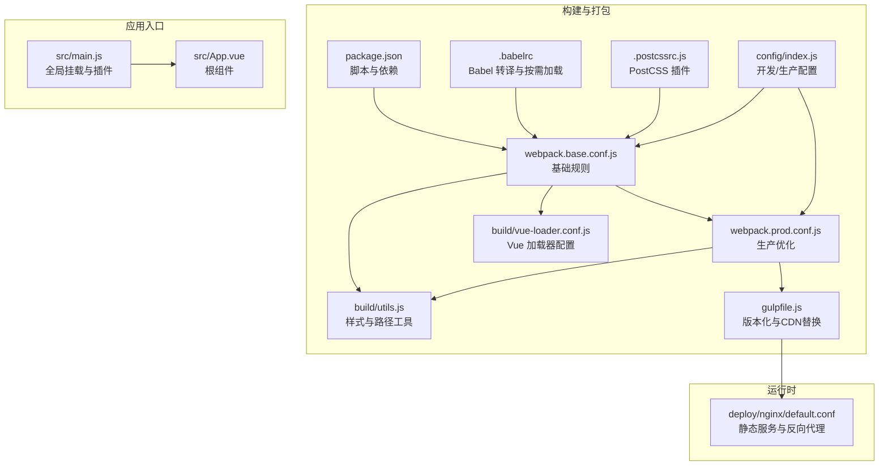
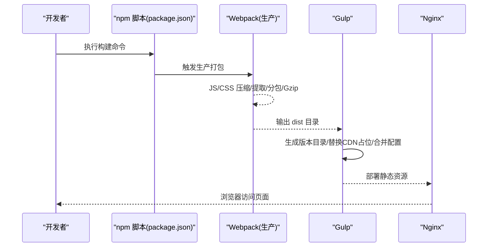
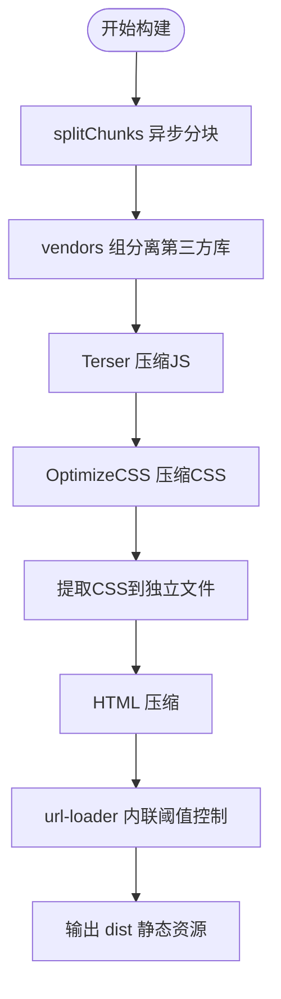
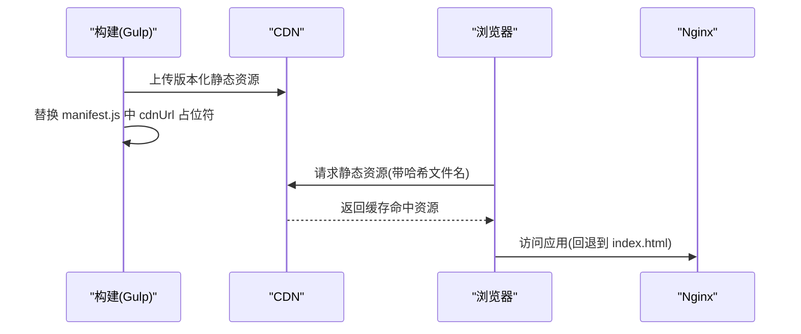
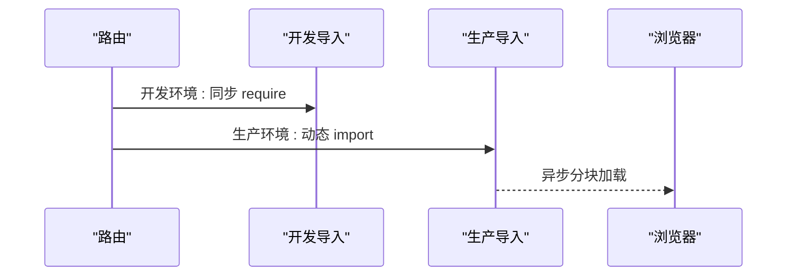
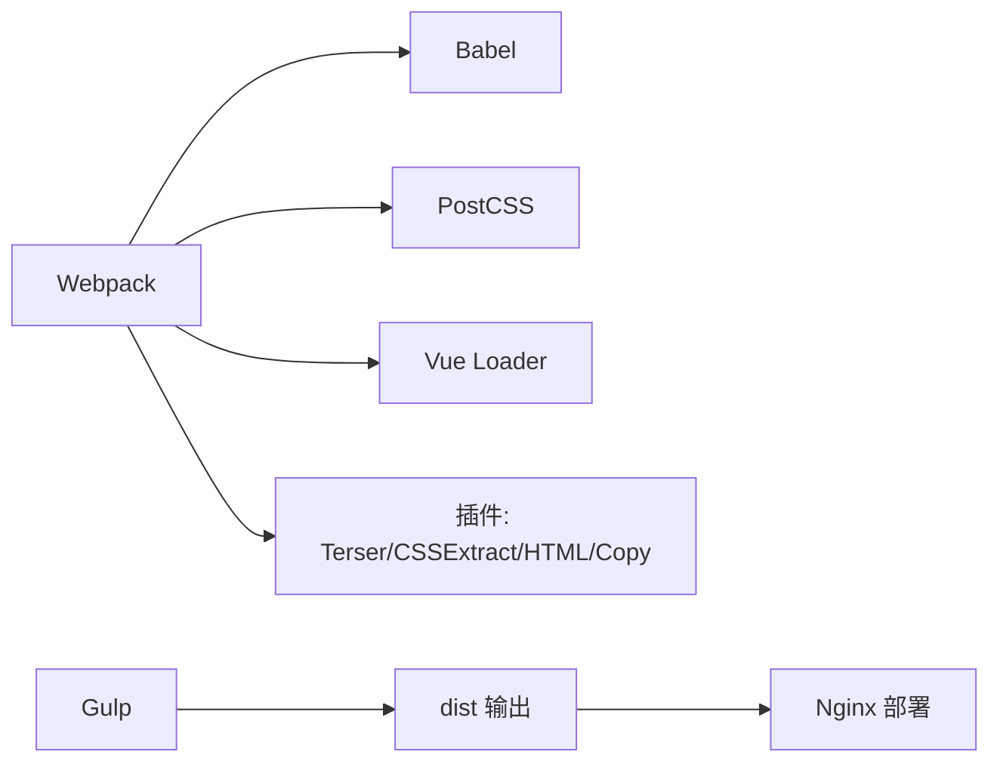

# 前端性能优化

<cite>
**本文引用的文件**
- [package.json](file://platform-admin-ui/package.json)
- [webpack.base.conf.js](file://platform-admin-ui/build/webpack.base.conf.js)
- [webpack.prod.conf.js](file://platform-admin-ui/build/webpack.prod.conf.js)
- [.babelrc](file://platform-admin-ui/.babelrc)
- [.postcssrc.js](file://platform-admin-ui/.postcssrc.js)
- [config/index.js](file://platform-admin-ui/config/index.js)
- [gulpfile.js](file://platform-admin-ui/gulpfile.js)
- [utils.js](file://platform-admin-ui/build/utils.js)
- [vue-loader.conf.js](file://platform-admin-ui/build/vue-loader.conf.js)
- [import-development.js](file://platform-admin-ui/src/router/import-development.js)
- [import-production.js](file://platform-admin-ui/src/router/import-production.js)
- [main.js](file://platform-admin-ui/src/main.js)
- [App.vue](file://platform-admin-ui/src/App.vue)
- [default.conf](file://deploy/nginx/default.conf)
</cite>

## 目录
1. [引言](#引言)
2. [项目结构](#项目结构)
3. [核心组件](#核心组件)
4. [架构总览](#架构总览)
5. [详细组件分析](#详细组件分析)
6. [依赖分析](#依赖分析)
7. [性能考量](#性能考量)
8. [故障排查指南](#故障排查指南)
9. [结论](#结论)
10. [附录](#附录)

## 引言
本指南围绕前端性能优化展开，结合仓库中的构建与运行配置，系统讲解资源压缩策略（代码分割、图片优化、CSS/JS 压缩）、CDN 加速配置（静态资源分发、缓存策略、回源配置）、懒加载与预加载机制（组件懒加载、图片懒加载、关键资源预加载）、前端缓存策略（浏览器缓存、Service Worker 与离线缓存）、渲染性能优化（虚拟滚动、防抖节流、重绘重排优化），以及前端监控与性能分析（Web Vitals 指标监控与性能瓶颈识别）。内容以仓库现有实现为依据，并在必要处给出可落地的改进建议。

## 项目结构
该前端工程基于 Vue 2.x + Webpack 4 构建，采用开发与生产两套配置，配合 Gulp 完成产物版本化与 CDN 变量替换。路由按环境区分动态导入策略，Nginx 提供静态资源服务与后端接口代理。

**图表来源**
- [package.json:1-102](file://platform-admin-ui/package.json#L1-L102)
- [webpack.base.conf.js:1-107](file://platform-admin-ui/build/webpack.base.conf.js#L1-L107)
- [webpack.prod.conf.js:1-147](file://platform-admin-ui/build/webpack.prod.conf.js#L1-L147)
- [utils.js:1-101](file://platform-admin-ui/build/utils.js#L1-L101)
- [vue-loader.conf.js:1-23](file://platform-admin-ui/build/vue-loader.conf.js#L1-L23)
- [.babelrc:1-36](file://platform-admin-ui/.babelrc#L1-L36)
- [.postcssrc.js:1-10](file://platform-admin-ui/.postcssrc.js#L1-L10)
- [config/index.js:1-92](file://platform-admin-ui/config/index.js#L1-L92)
- [gulpfile.js:1-65](file://platform-admin-ui/gulpfile.js#L1-L65)
- [main.js:1-80](file://platform-admin-ui/src/main.js#L1-L80)
- [App.vue:1-26](file://platform-admin-ui/src/App.vue#L1-L26)
- [default.conf:1-28](file://deploy/nginx/default.conf#L1-L28)

**章节来源**
- [package.json:1-102](file://platform-admin-ui/package.json#L1-L102)
- [config/index.js:1-92](file://platform-admin-ui/config/index.js#L1-L92)

## 核心组件
- 构建与打包：Webpack 生产配置启用 JS/CSS 压缩、CSS 提取、分包策略、Gzip 输出与体积分析；基础配置定义资源加载规则与公共别名。
- 路由懒加载：开发与生产分别采用同步与动态导入策略，生产环境利用异步分块实现按需加载。
- 资源处理：图片、字体、媒体等通过 url-loader 内联阈值控制与输出目录规范；PostCSS 自动前缀与样式链路。
- 配置与版本化：Gulp 在构建后生成带版本号的目录，替换 CDN 占位符并合并配置文件，便于 CDN 分发与缓存失效管理。
- 运行时与代理：Nginx 提供静态资源服务与后端接口代理，支持 SPA 回退到 index.html。

**章节来源**
- [webpack.prod.conf.js:77-120](file://platform-admin-ui/build/webpack.prod.conf.js#L77-L120)
- [webpack.base.conf.js:47-94](file://platform-admin-ui/build/webpack.base.conf.js#L47-L94)
- [import-development.js:1-2](file://platform-admin-ui/src/router/import-development.js#L1-L2)
- [import-production.js:1-2](file://platform-admin-ui/src/router/import-production.js#L1-L2)
- [gulpfile.js:23-50](file://platform-admin-ui/gulpfile.js#L23-L50)
- [default.conf:7-26](file://deploy/nginx/default.conf#L7-L26)

## 架构总览
下图展示从构建到上线的关键流程：Webpack 打包产出静态资源，Gulp 进行版本化与 CDN 变量替换，最终由 Nginx 提供静态服务与后端代理。

**图表来源**
- [package.json:8-12](file://platform-admin-ui/package.json#L8-L12)
- [webpack.prod.conf.js:123-139](file://platform-admin-ui/build/webpack.prod.conf.js#L123-L139)
- [gulpfile.js:23-64](file://platform-admin-ui/gulpfile.js#L23-L64)
- [default.conf:1-28](file://deploy/nginx/default.conf#L1-L28)

## 详细组件分析

### 资源压缩策略
- 代码分割与分包
  - 异步分块：生产配置启用 splitChunks，仅对 async 资产进行拆分，设置最小大小与并发请求数上限，优先级与命名策略明确。
  - 第三方库分离：vendors 组将 node_modules 中模块单独抽离，提升缓存命中率。
  - 运行时与模块 ID：启用 HashedModuleIdsPlugin 与 ModuleConcatenationPlugin，稳定模块 ID 并启用作用域提升。
- JS 压缩与清理
  - 使用 TerserPlugin 并行压缩，移除注释与调试语句，丢弃 console 与 debugger，减少体积。
- CSS 压缩与提取
  - 生产模式下提取 CSS 到独立文件，配合 OptimizeCSSPlugin 压缩，PostCSS 自动前缀增强兼容性。
- HTML 压缩
  - HtmlWebpackPlugin 在生产环境压缩注释、空白与属性引号，减小首屏传输体积。
- 图片与静态资源内联
  - url-loader 对图片/字体/媒体设置阈值内联，减少请求数；同时输出带哈希的文件名，利于缓存与更新。

**图表来源**
- [webpack.prod.conf.js:104-119](file://platform-admin-ui/build/webpack.prod.conf.js#L104-L119)
- [webpack.prod.conf.js:82-97](file://platform-admin-ui/build/webpack.prod.conf.js#L82-L97)
- [webpack.prod.conf.js:98-102](file://platform-admin-ui/build/webpack.prod.conf.js#L98-L102)
- [webpack.prod.conf.js:49-62](file://platform-admin-ui/build/webpack.prod.conf.js#L49-L62)
- [webpack.base.conf.js:65-92](file://platform-admin-ui/build/webpack.base.conf.js#L65-L92)

**章节来源**
- [webpack.prod.conf.js:77-120](file://platform-admin-ui/build/webpack.prod.conf.js#L77-L120)
- [webpack.base.conf.js:47-94](file://platform-admin-ui/build/webpack.base.conf.js#L47-L94)
- [utils.js:15-80](file://platform-admin-ui/build/utils.js#L15-L80)
- [.postcssrc.js:1-10](file://platform-admin-ui/.postcssrc.js#L1-L10)

### CDN 加速配置
- 静态资源分发
  - Gulp 在构建完成后复制静态资源至版本化目录，并将 manifest.js 中的 cdnUrl 占位符替换为实际地址，实现 CDN 动态切换。
- 缓存策略
  - 产物文件名包含哈希，结合 Nginx 长缓存策略（如对静态资源设置强缓存）可显著降低重复下载成本。
- 回源配置
  - Nginx 将静态资源根目录指向部署目录，SPA 路由回退到 index.html，保证刷新与直连路由不 404。

**图表来源**
- [gulpfile.js:27-43](file://platform-admin-ui/gulpfile.js#L27-L43)
- [default.conf:7-9](file://deploy/nginx/default.conf#L7-L9)

**章节来源**
- [gulpfile.js:23-50](file://platform-admin-ui/gulpfile.js#L23-L50)
- [default.conf:1-28](file://deploy/nginx/default.conf#L1-L28)

### 懒加载与预加载机制
- 组件懒加载
  - 开发环境使用同步导入，便于热更新与调试；生产环境使用动态 import 实现异步分块，按需加载视图组件。
- 图片懒加载
  - 当前配置未见专用懒加载指令或 IntersectionObserver 实现；可在业务组件中引入懒加载策略，结合占位图与骨架屏优化感知速度。
- 关键资源预加载
  - 可在路由级别或页面首屏关键资源上添加 preload 或 prefetch 提示，缩短首屏渲染时间。

**图表来源**
- [import-development.js:1-2](file://platform-admin-ui/src/router/import-development.js#L1-L2)
- [import-production.js:1-2](file://platform-admin-ui/src/router/import-production.js#L1-L2)

**章节来源**
- [import-development.js:1-2](file://platform-admin-ui/src/router/import-development.js#L1-L2)
- [import-production.js:1-2](file://platform-admin-ui/src/router/import-production.js#L1-L2)

### 前端缓存策略
- 浏览器缓存
  - 通过文件名哈希与 Nginx 长缓存策略，静态资源可长期缓存；版本化目录便于灰度与快速回滚。
- Service Worker 与离线缓存
  - 仓库未集成 Service Worker；建议在生产构建后增加 SW，对静态资源与关键接口做离线缓存与网络降级。
- Vuex 本地存储
  - 应用启动时将 store 初始状态克隆到全局变量，便于页面刷新后恢复状态（非持久化缓存）。

**章节来源**
- [gulpfile.js:12-21](file://platform-admin-ui/gulpfile.js#L12-L21)
- [default.conf:4-5](file://deploy/nginx/default.conf#L4-L5)
- [main.js:61-62](file://platform-admin-ui/src/main.js#L61-L62)

### 渲染性能优化
- 虚拟滚动
  - 仓库未见虚拟滚动实现；对于长列表场景，建议引入虚拟滚动组件，仅渲染可视区域元素，降低 DOM 与重排压力。
- 防抖与节流
  - 仓库未见通用防抖节流封装；可在高频事件（窗口 resize、滚动、输入）中引入，减少计算与渲染次数。
- 重绘与重排优化
  - 使用 transform、opacity 等避免触发布局；合理拆分层级，减少大范围重排影响。

[本节为通用指导，无需特定文件分析]

### 前端监控与性能分析
- Web Vitals 指标
  - 已集成百度统计，可用于页面访问与交互行为追踪；建议补充 LCP、FID、CLS 等指标采集与上报。
- 性能瓶颈识别
  - 使用 Chrome DevTools Performance/Network 面板定位白屏、阻塞、慢查询；结合 Bundle Analyzer 查看包体构成与重复依赖。

**章节来源**
- [main.js:64-70](file://platform-admin-ui/src/main.js#L64-L70)
- [webpack.prod.conf.js:141-144](file://platform-admin-ui/build/webpack.prod.conf.js#L141-L144)

## 依赖分析
- 构建工具链
  - Webpack 4 + Vue Loader：负责模块解析、转译与打包。
  - Babel：preset 与按需加载插件，减少 Element UI 全量引入。
  - PostCSS：自动前缀与样式链路。
  - Gulp：构建后处理与版本化。
- 运行时依赖
  - Vue 2.x + Element UI：UI 组件体系。
  - Axios：HTTP 请求。
  - lodash、echarts、clipboard 等：常用工具与可视化能力。

**图表来源**
- [package.json:14-36](file://platform-admin-ui/package.json#L14-L36)
- [webpack.prod.conf.js:8-12](file://platform-admin-ui/build/webpack.prod.conf.js#L8-L12)
- [.babelrc:1-36](file://platform-admin-ui/.babelrc#L1-L36)
- [.postcssrc.js:1-10](file://platform-admin-ui/.postcssrc.js#L1-L10)

**章节来源**
- [package.json:14-36](file://platform-admin-ui/package.json#L14-L36)
- [webpack.prod.conf.js:8-12](file://platform-admin-ui/build/webpack.prod.conf.js#L8-L12)

## 性能考量
- 体积与加载
  - 通过分包与内联阈值控制，平衡请求数与单文件大小；结合 Gzip 与长缓存，降低带宽与延迟。
- 首屏体验
  - 预加载关键资源、组件懒加载、骨架屏与占位图，缩短感知等待时间。
- 运行时稳定性
  - 移除调试与冗余日志，减少运行时开销；合理拆分逻辑，避免主线程阻塞。

[本节为通用指导，无需特定文件分析]

## 故障排查指南
- 构建失败或体积异常
  - 检查生产配置中的压缩与分包参数；确认 Gzip 插件启用条件与阈值。
- 资源 404 或缓存问题
  - 核对 Nginx 静态根目录与回退规则；确认版本化目录与 manifest.js 中 cdnUrl 替换是否生效。
- 路由跳转白屏
  - 确认路由懒加载导入函数正确；检查生产环境动态导入语法与分块命名。

**章节来源**
- [webpack.prod.conf.js:123-139](file://platform-admin-ui/build/webpack.prod.conf.js#L123-L139)
- [gulpfile.js:33-43](file://platform-admin-ui/gulpfile.js#L33-L43)
- [default.conf:7-9](file://deploy/nginx/default.conf#L7-L9)
- [import-production.js:1-2](file://platform-admin-ui/src/router/import-production.js#L1-L2)

## 结论
本项目已具备完善的构建与分发基础：生产环境的代码分割、JS/CSS 压缩、Gzip 与版本化处理，配合 Nginx 的静态服务与代理，能够满足大多数前端性能需求。建议在现有基础上进一步引入组件懒加载、图片懒加载、虚拟滚动、防抖节流、Service Worker 离线缓存与 Web Vitals 监控，持续优化用户体验与性能表现。

## 附录
- 关键配置要点速览
  - 生产分包：splitChunks 异步分块与 vendors 组。
  - 压缩与清理：Terser 去注释、去调试、丢弃 console。
  - CSS 提取与压缩：MiniCssExtractPlugin + OptimizeCSSPlugin。
  - HTML 压缩：HtmlWebpackPlugin 压缩选项。
  - 资源内联：url-loader 阈值与输出目录。
  - CDN 替换：Gulp 替换 manifest.js 中 cdnUrl 占位符。
  - Nginx 回退：try_files $uri $uri/ /index.html。

**章节来源**
- [webpack.prod.conf.js:104-119](file://platform-admin-ui/build/webpack.prod.conf.js#L104-L119)
- [webpack.prod.conf.js:82-97](file://platform-admin-ui/build/webpack.prod.conf.js#L82-L97)
- [webpack.prod.conf.js:98-102](file://platform-admin-ui/build/webpack.prod.conf.js#L98-L102)
- [webpack.prod.conf.js:49-62](file://platform-admin-ui/build/webpack.prod.conf.js#L49-L62)
- [webpack.base.conf.js:65-92](file://platform-admin-ui/build/webpack.base.conf.js#L65-L92)
- [gulpfile.js:33-43](file://platform-admin-ui/gulpfile.js#L33-L43)
- [default.conf:7-9](file://deploy/nginx/default.conf#L7-L9)