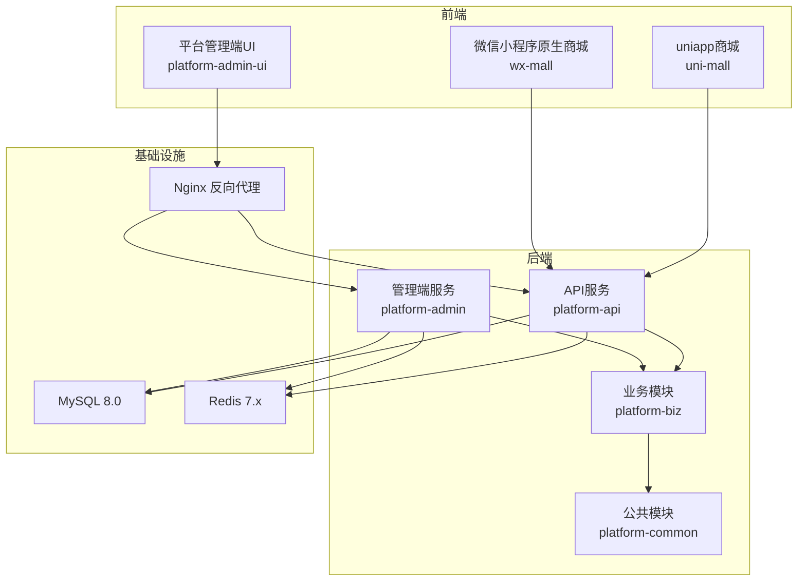
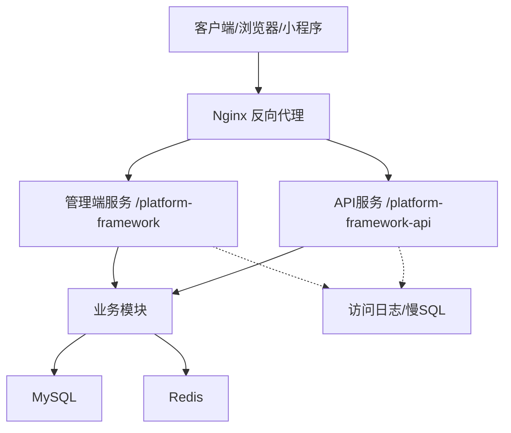
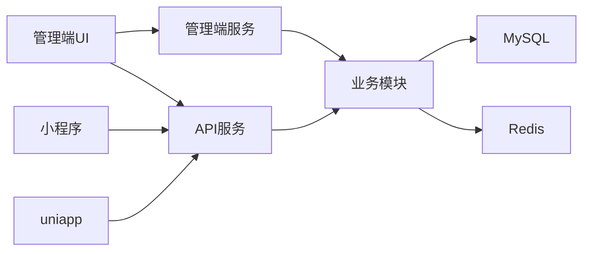

# 压力测试方法

<cite>
**本文引用的文件**   
- [README.md](file://README.md)
- [docker-compose.yml](file://docker-compose.yml)
- [平台管理端应用配置(application.yml)](file://platform-admin/src/main/resources/application.yml)
- [平台API应用配置(application.yml)](file://platform-api/src/main/resources/application.yml)
- [平台管理端测试配置(application-test.yml)](file://platform-admin/src/main/resources/application-test.yml)
- [平台API测试配置(application-test.yml)](file://platform-api/src/main/resources/application-test.yml)
- [平台管理端应用入口(PlatformAdminApplication.java)](file://platform-admin/src/main/java/com/platform/PlatformAdminApplication.java)
- [平台API应用入口(PlatformApiApplication.java)](file://platform-api/src/main/java/com/platform/PlatformApiApplication.java)
- [通用响应封装(RestResponse.java)](file://platform-common/src/main/java/com/platform/common/utils/RestResponse.java)
- [通用业务异常(BusinessException.java)](file://platform-common/src/main/java/com/platform/common/exception/BusinessException.java)
- [定时任务示例(TestTask.java)](file://platform-admin/src/main/java/com/platform/modules/job/task/TestTask.java)
- [平台管理端测试样例(PlatformAdminApplicationTests.java)](file://platform-admin/src/test/java/com/platform/PlatformAdminApplicationTests.java)
- [平台API测试样例(PlatformApiApplicationTests.java)](file://platform-api/src/test/java/com/platform/PlatformApiApplicationTests.java)
- [平台管理端UI包配置(package.json)](file://platform-admin-ui/package.json)
- [平台管理端UI测试配置(test.env.js)](file://platform-admin-ui/config/test.env.js)
- [平台管理端UI构建测试配置(webpack.test.conf.js)](file://platform-admin-ui/build/webpack.test.conf.js)
- [系统架构图.mmd](file://docs/系统架构图.mmd)
- [时序架构图.mmd](file://docs/时序架构图.mmd)
- [系统架构说明.md](file://docs/系统架构说明.md)
</cite>

## 目录
1. [引言](#引言)
2. [项目结构](#项目结构)
3. [核心组件](#核心组件)
4. [架构总览](#架构总览)
5. [详细组件分析](#详细组件分析)
6. [依赖分析](#依赖分析)
7. [性能考虑](#性能考虑)
8. [故障排查指南](#故障排查指南)
9. [结论](#结论)
10. [附录](#附录)

## 引言
本指导文档面向开发者与测试工程师，围绕该多模块Java/Spring Boot项目，系统化构建压力测试方法论。内容涵盖测试场景设计（用户行为模拟、业务流程测试、边界条件验证）、性能基准测试（吞吐量、延迟、资源消耗）、瓶颈识别（性能剖析、热点分析、依赖关系分析）、自动化测试工具使用（JMeter、LoadRunner、自研工具）、测试环境搭建（测试数据准备、环境隔离、执行策略），以及测试结果分析与优化建议，帮助团队持续提升系统性能与稳定性。

## 项目结构
该项目采用多模块分层架构，包含后端服务（管理端与API）、业务模块、公共模块、前端管理界面、小程序与uni-app商城、以及基于Docker的编排部署。关键特性：
- 双后端服务：管理端与API端分别提供不同业务域的REST能力，具备独立的 Undertow 线程模型与上下文路径配置。
- 测试与监控：提供测试配置（Druid连接池、慢SQL日志、控制台）、日志采集（Undertow访问日志）、以及Swagger/OpenAPI文档。
- 部署与隔离：通过 docker-compose 统一拉起 MySQL、Redis、两套后端服务与Nginx，便于压测环境隔离与快速复现。

图表来源
- [docker-compose.yml:1-115](file://docker-compose.yml#L1-L115)
- [平台管理端应用配置(application.yml):1-21](file://platform-admin/src/main/resources/application.yml#L1-L21)
- [平台API应用配置(application.yml):1-21](file://platform-api/src/main/resources/application.yml#L1-L21)

章节来源
- [README.md: 59-100:59-100](file://README.md#L59-L100)
- [docker-compose.yml: 1-L115:1-115](file://docker-compose.yml#L1-L115)

## 核心组件
- 应用入口与启动
  - 管理端与API端均提供独立的Spring Boot启动类，分别绑定不同的context-path与端口，便于压测阶段隔离与对比。
- 配置与线程模型
  - Undertow线程模型（io/worker）与缓冲区配置直接影响高并发下的连接处理能力与内存占用。
  - Druid连接池在测试配置中开启慢SQL日志与控制台，便于压测中定位慢查询。
- 响应与异常
  - 统一响应封装RestResponse与业务异常BusinessException，有助于压测结果标准化与异常统计。
- 定时任务与测试样例
  - 提供基础定时任务示例与单元测试样例，可作为压测前后一致性校验与回归参考。

章节来源
- [平台管理端应用入口(PlatformAdminApplication.java)](file://platform-admin/src/main/java/com/platform/PlatformAdminApplication.java)
- [平台API应用入口(PlatformApiApplication.java)](file://platform-api/src/main/java/com/platform/PlatformApiApplication.java)
- [平台管理端应用配置(application.yml):3-21](file://platform-admin/src/main/resources/application.yml#L3-L21)
- [平台API应用配置(application.yml):3-21](file://platform-api/src/main/resources/application.yml#L3-L21)
- [平台管理端测试配置(application-test.yml):1-52](file://platform-admin/src/main/resources/application-test.yml#L1-L52)
- [平台API测试配置(application-test.yml):1-52](file://platform-api/src/main/resources/application-test.yml#L1-L52)
- [通用响应封装(RestResponse.java):1-122](file://platform-common/src/main/java/com/platform/common/utils/RestResponse.java#L1-L122)
- [通用业务异常(BusinessException.java):1-74](file://platform-common/src/main/java/com/platform/common/exception/BusinessException.java#L1-L74)
- [定时任务示例(TestTask.java):1-46](file://platform-admin/src/main/java/com/platform/modules/job/task/TestTask.java#L1-L46)
- [平台管理端测试样例(PlatformAdminApplicationTests.java):1-21](file://platform-admin/src/test/java/com/platform/PlatformAdminApplicationTests.java#L1-L21)
- [平台API测试样例(PlatformApiApplicationTests.java):1-118](file://platform-api/src/test/java/com/platform/PlatformApiApplicationTests.java#L1-L118)

## 架构总览
系统由前端（管理端UI、小程序、uniapp）与后端（管理端、API端）组成，Nginx统一反向代理与静态资源托管。数据库与缓存通过Docker编排统一提供，便于压测时隔离与复现。

图表来源
- [docker-compose.yml:103-115](file://docker-compose.yml#L103-L115)
- [平台管理端应用配置(application.yml):19-21](file://platform-admin/src/main/resources/application.yml#L19-L21)
- [平台API应用配置(application.yml):18-21](file://platform-api/src/main/resources/application.yml#L18-L21)

## 详细组件分析

### 测试场景设计
- 用户行为模拟
  - 登录与鉴权：构造带Token的请求序列，覆盖登录、刷新Token、权限不足等分支。
  - 商品浏览与下单：从商品列表、详情、购物车到下单的完整链路，模拟峰值并发。
  - 支付与退款：触发支付与退款接口，评估第三方支付回调与幂等性。
- 业务流程测试
  - 订单生命周期：创建、支付、发货、收货、评价、退款全流程压测。
  - 营销活动：限时秒杀、满减、优惠券叠加使用，验证限流与库存扣减一致性。
- 边界条件验证
  - 超大数据量：分页、搜索、导出等接口在极限数据下的表现。
  - 并发竞争：高并发写入、库存超卖、重复支付等竞态条件。
  - 网络抖动：弱网、断网重试、超时重试等容错链路。

章节来源
- [平台API测试样例(PlatformApiApplicationTests.java): 47-94:47-94](file://platform-api/src/test/java/com/platform/PlatformApiApplicationTests.java#L47-L94)
- [平台管理端测试样例(PlatformAdminApplicationTests.java): 15-19:15-19](file://platform-admin/src/test/java/com/platform/PlatformAdminApplicationTests.java#L15-L19)

### 性能基准测试
- 吞吐量测试
  - 使用JMeter/LoadRunner构造恒定并发或阶梯式并发，记录每秒事务数（TPS）、每秒请求数（RPS）。
  - 关注管理端与API端的context-path差异，确保压测目标正确。
- 延迟测试
  - 分位延迟（P50/P90/P99）与平均延迟，区分接口维度与整体系统延迟。
  - 结合Nginx与后端访问日志，定位延迟热点。
- 资源消耗测试
  - CPU、内存、线程数、连接数、GC频率；结合数据库慢SQL日志与Redis命中率。

章节来源
- [平台管理端应用配置(application.yml): 3-L21:3-21](file://platform-admin/src/main/resources/application.yml#L3-L21)
- [平台API应用配置(application.yml): 3-L21:3-21](file://platform-api/src/main/resources/application.yml#L3-L21)
- [平台管理端测试配置(application-test.yml): 1-L52:1-52](file://platform-admin/src/main/resources/application-test.yml#L1-L52)
- [平台API测试配置(application-test.yml): 1-L52:1-52](file://platform-api/src/main/resources/application-test.yml#L1-L52)

### 瓶颈识别方法
- 性能剖析
  - 使用JProfiler/Arthas/Java Flight Recorder对热点方法采样，定位CPU与锁争用。
- 热点分析
  - 关注DAO层SQL执行计划、缓存未命中、第三方SDK调用耗时。
- 依赖关系分析
  - 通过分布式链路追踪（如SkyWalking/Zipkin）串联Nginx→后端→DB/Redis，识别依赖延迟。

章节来源
- [平台管理端应用配置(application.yml): 81-L99:81-99](file://platform-admin/src/main/resources/application.yml#L81-L99)
- [平台API应用配置(application.yml): 70-L82:70-82](file://platform-api/src/main/resources/application.yml#L70-L82)

### 自动化测试工具使用
- JMeter
  - 构造HTTP请求，设置并发、循环次数、定时器与断言；结合CSV数据驱动与后端响应断言。
- LoadRunner
  - 设计事务与思考时间，录制小程序端关键流程，验证支付与下单链路。
- 自研测试工具
  - 基于项目现有测试样例与配置，扩展脚本化压测与回归检查。

章节来源
- [平台管理端测试样例(PlatformAdminApplicationTests.java): 15-19:15-19](file://platform-admin/src/test/java/com/platform/PlatformAdminApplicationTests.java#L15-L19)
- [平台API测试样例(PlatformApiApplicationTests.java): 102-116:102-116](file://platform-api/src/test/java/com/platform/PlatformApiApplicationTests.java#L102-L116)

### 测试环境搭建
- 测试数据准备
  - 使用初始化SQL脚本准备基础数据与测试数据集；必要时通过脚本批量生成订单、用户、商品等。
- 环境隔离
  - 通过docker-compose启动独立的MySQL/Redis实例，避免与开发/生产环境互相干扰。
- 执行策略
  - 先单机压测验证，再集群压测；按阶段逐步提升并发与数据规模，观察系统拐点。

章节来源
- [README.md: 74-100:74-100](file://README.md#L74-L100)
- [docker-compose.yml: 1-L115:1-115](file://docker-compose.yml#L1-L115)

### 测试结果分析与性能优化建议
- 结果分析
  - 统一使用RestResponse结构，便于自动化统计成功率、错误码分布与平均/分位延迟。
  - 对异常进行BusinessException分类统计，定位业务异常与系统异常占比。
- 优化建议
  - 线程模型调优：根据CPU核心数与IO特征调整Undertow io/worker线程数。
  - 缓存策略：提升热点数据命中率，降低DB压力；关注缓存穿透与雪崩。
  - SQL优化：结合慢SQL日志与索引策略，减少全表扫描与锁等待。
  - 连接池与超时：合理设置Druid连接池参数与请求超时，避免连接泄漏与堆积。

章节来源
- [通用响应封装(RestResponse.java): 34-L122:34-122](file://platform-common/src/main/java/com/platform/common/utils/RestResponse.java#L34-L122)
- [通用业务异常(BusinessException.java): 28-L74:28-74](file://platform-common/src/main/java/com/platform/common/exception/BusinessException.java#L28-L74)
- [平台管理端应用配置(application.yml): 81-L99:81-99](file://platform-admin/src/main/resources/application.yml#L81-L99)
- [平台API应用配置(application.yml): 70-L82:70-82](file://platform-api/src/main/resources/application.yml#L70-L82)

## 依赖分析
- 组件耦合
  - 前端通过Nginx反向代理访问后端；后端依赖业务模块与公共模块；业务模块依赖DB与Redis。
- 外部依赖
  - MySQL、Redis、Nginx；第三方支付SDK与微信/支付宝接口。
- 潜在环路
  - 通过清晰的模块边界与接口契约避免循环依赖；压测中关注跨服务调用链。

图表来源
- [docker-compose.yml:1-115](file://docker-compose.yml#L1-L115)

章节来源
- [docker-compose.yml: 1-L115:1-115](file://docker-compose.yml#L1-L115)

## 性能考虑
- 线程模型与缓冲
  - Undertow的buffer-size与direct-buffers、io/worker线程数直接影响高并发下的吞吐与延迟。
- 连接池与超时
  - Druid连接池参数与慢SQL日志，有助于发现DB瓶颈与连接泄漏。
- 缓存与热点
  - Redis命中率与过期策略，避免缓存击穿与雪崩。
- 日志与可观测性
  - Undertow访问日志与慢SQL日志，支撑压测后的根因分析。

章节来源
- [平台管理端应用配置(application.yml): 3-L18:3-18](file://platform-admin/src/main/resources/application.yml#L3-L18)
- [平台API应用配置(application.yml): 3-L18:3-18](file://platform-api/src/main/resources/application.yml#L3-L18)
- [平台管理端测试配置(application-test.yml): 23-L41:23-41](file://platform-admin/src/main/resources/application-test.yml#L23-L41)
- [平台API测试配置(application-test.yml): 23-L41:23-41](file://platform-api/src/main/resources/application-test.yml#L23-L41)

## 故障排查指南
- 常见问题定位
  - 登录/鉴权：检查Token传递、Shiro过滤链与前端拦截器。
  - 跨服务请求：核对context-path与端口，确认调用的是管理端还是API端。
  - 小程序问题：核对API地址、接口返回与页面逻辑。
- 压测异常处理
  - 使用统一响应与异常封装，快速统计错误码与异常类型。
  - 结合慢SQL与访问日志，定位DB与缓存瓶颈。

章节来源
- [系统架构说明.md](file://docs/系统架构说明.md)
- [平台管理端测试样例(PlatformAdminApplicationTests.java): 15-19:15-19](file://platform-admin/src/test/java/com/platform/PlatformAdminApplicationTests.java#L15-L19)
- [平台API测试样例(PlatformApiApplicationTests.java): 102-116:102-116](file://platform-api/src/test/java/com/platform/PlatformApiApplicationTests.java#L102-L116)

## 结论
通过明确的测试场景设计、规范的性能基准测试、系统化的瓶颈识别与优化策略，结合Docker环境与统一响应/异常封装，可有效保障系统在高并发场景下的稳定性与性能。建议将压测纳入CI/CD流程，形成持续性能治理闭环。

## 附录
- 参考文档与图示
  - 系统架构图与时序图可用于压测方案设计与结果说明。
- 前端测试与构建
  - 管理端UI的测试与构建配置可用于前端交互链路的压测与回归。

章节来源
- [系统架构图.mmd](file://docs/系统架构图.mmd)
- [时序架构图.mmd](file://docs/时序架构图.mmd)
- [平台管理端UI包配置(package.json):44-84](file://platform-admin-ui/package.json#L44-L84)
- [平台管理端UI测试配置(test.env.js)](file://platform-admin-ui/config/test.env.js)
- [平台管理端UI构建测试配置(webpack.test.conf.js)](file://platform-admin-ui/build/webpack.test.conf.js)