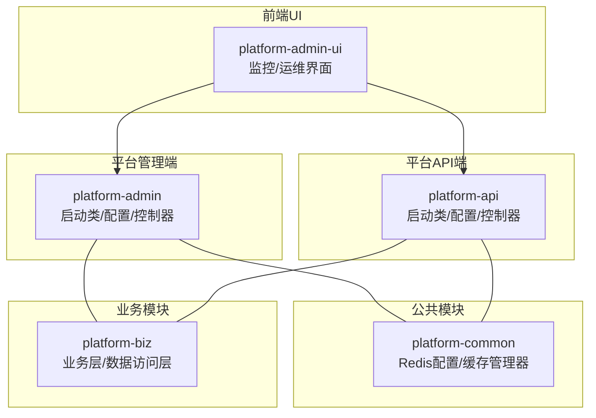
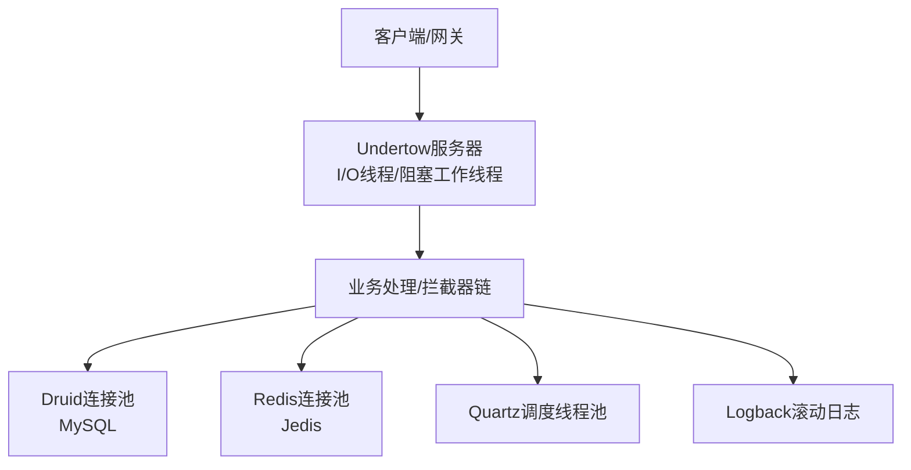
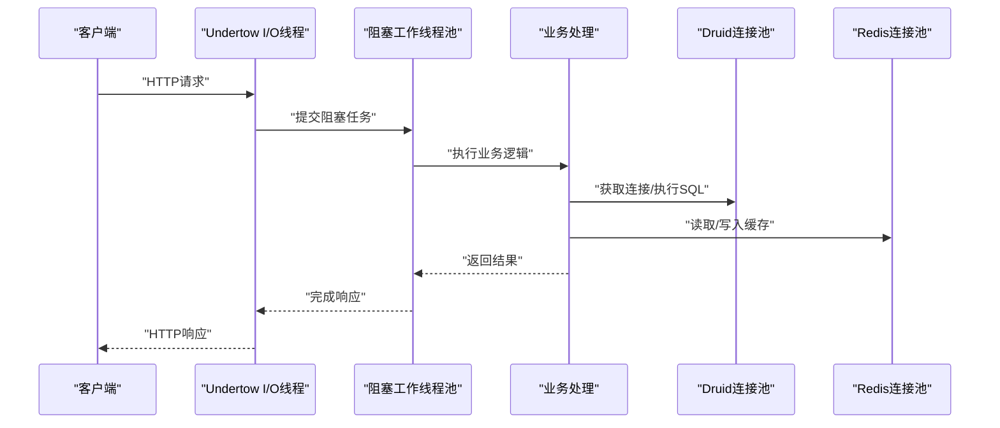
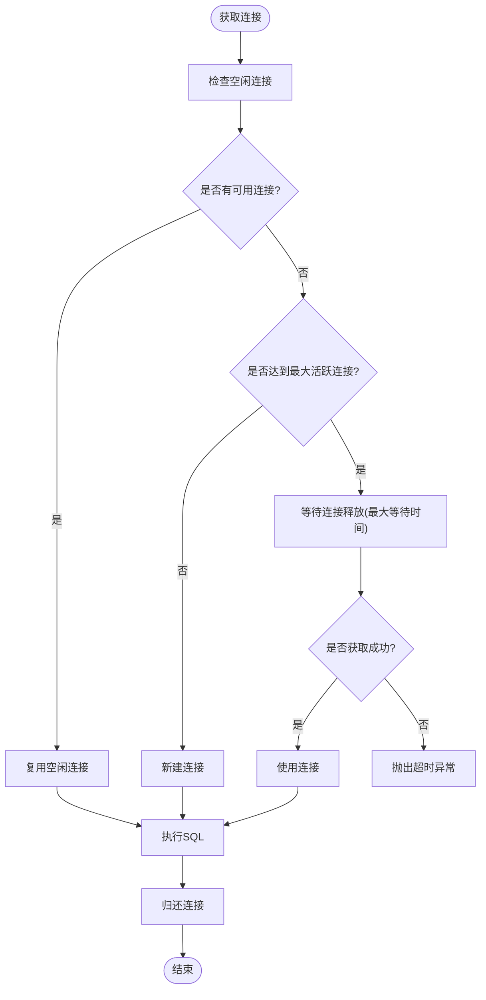
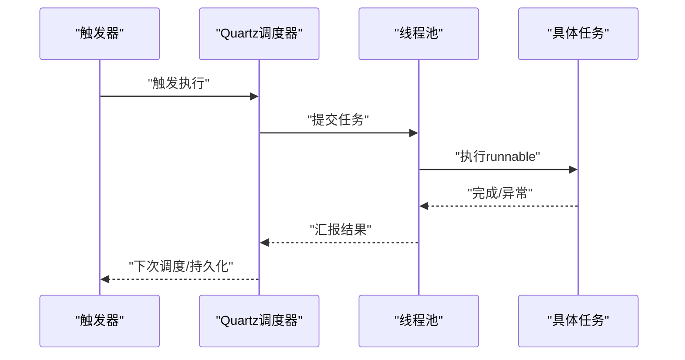
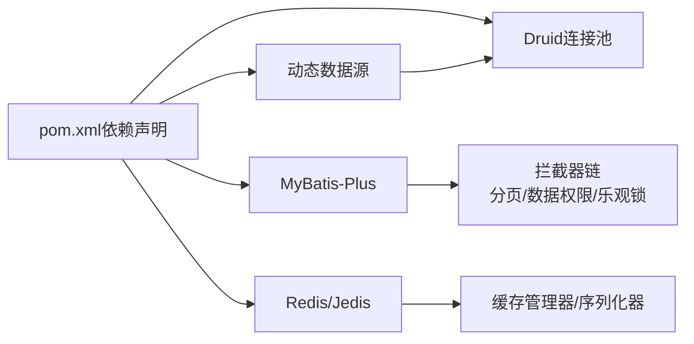

# 后端性能优化

<cite>
**本文引用的文件**   
- [platform-admin/src/main/resources/application.yml](file://platform-admin/src/main/resources/application.yml)
- [platform-api/src/main/resources/application.yml](file://platform-api/src/main/resources/application.yml)
- [platform-admin/src/main/resources/application-dev.yml](file://platform-admin/src/main/resources/application-dev.yml)
- [platform-admin/src/main/resources/application-test.yml](file://platform-admin/src/main/resources/application-test.yml)
- [platform-admin/src/main/resources/application-prod.yml](file://platform-admin/src/main/resources/application-prod.yml)
- [platform-admin/src/main/java/com/platform/config/MybatisPlusConfig.java](file://platform-admin/src/main/java/com/platform/config/MybatisPlusConfig.java)
- [platform-common/src/main/java/com/platform/config/RedisConfig.java](file://platform-common/src/main/java/com/platform/config/RedisConfig.java)
- [platform-admin/src/main/java/com/platform/modules/job/config/ScheduleConfig.java](file://platform-admin/src/main/java/com/platform/modules/job/config/ScheduleConfig.java)
- [platform-admin/src/main/java/com/platform/modules/job/utils/ScheduleJob.java](file://platform-admin/src/main/java/com/platform/modules/job/utils/ScheduleJob.java)
- [platform-admin/src/main/java/com/platform/modules/job/utils/ScheduleRunnable.java](file://platform-admin/src/main/java/com/platform/modules/job/utils/ScheduleRunnable.java)
- [platform-admin/src/main/java/com/platform/modules/sys/controller/SysMonitorController.java](file://platform-admin/src/main/java/com/platform/modules/sys/controller/SysMonitorController.java)
- [platform-admin/src/main/resources/logback-spring.xml](file://platform-admin/src/main/resources/logback-spring.xml)
- [platform-admin/src/main/java/com/platform/PlatformAdminApplication.java](file://platform-admin/src/main/java/com/platform/PlatformAdminApplication.java)
- [pom.xml](file://pom.xml)
</cite>

## 目录
1. [引言](#引言)
2. [项目结构](#项目结构)
3. [核心组件](#核心组件)
4. [架构总览](#架构总览)
5. [详细组件分析](#详细组件分析)
6. [依赖分析](#依赖分析)
7. [性能考虑](#性能考虑)
8. [故障排查指南](#故障排查指南)
9. [结论](#结论)
10. [附录](#附录)

## 引言
本文件面向后端性能优化，结合仓库现有配置与实现，系统性梳理JVM调优策略、线程池配置优化、内存管理最佳实践、数据库连接池优化、Spring框架性能优化，以及性能测试与监控方法。内容以“可落地、可度量、可回溯”为目标，既覆盖工程配置层面，也包含代码实现细节与可视化流程图。

## 项目结构
本项目采用多模块结构，后端服务由两个独立的Spring Boot应用组成：
- 平台管理端（platform-admin）：提供管理后台接口、定时任务、缓存与监控能力
- 平台API端（platform-api）：提供移动端与微信相关接口
- 公共模块（platform-common）：提供通用工具、Redis配置与缓存管理器
- 业务模块（platform-biz）：封装业务层与数据访问层
- 前端UI（platform-admin-ui）：提供系统监控与运维界面

**图表来源**
- [platform-admin/src/main/java/com/platform/PlatformAdminApplication.java:48-56](file://platform-admin/src/main/java/com/platform/PlatformAdminApplication.java#L48-L56)
- [platform-admin/src/main/resources/application.yml:1-20](file://platform-admin/src/main/resources/application.yml#L1-L20)
- [platform-api/src/main/resources/application.yml:1-20](file://platform-api/src/main/resources/application.yml#L1-L20)

**章节来源**
- [platform-admin/src/main/resources/application.yml:1-20](file://platform-admin/src/main/resources/application.yml#L1-L20)
- [platform-api/src/main/resources/application.yml:1-20](file://platform-api/src/main/resources/application.yml#L1-L20)
- [platform-admin/src/main/java/com/platform/PlatformAdminApplication.java:48-56](file://platform-admin/src/main/java/com/platform/PlatformAdminApplication.java#L48-L56)

## 核心组件
- Undertow服务器线程模型与缓冲区配置：通过线程池与缓冲区参数控制并发与内存占用
- MyBatis-Plus插件链：分页、数据权限、乐观锁拦截器组合，影响SQL执行与事务开销
- Redis连接池与缓存管理器：连接上限、等待时间、序列化策略与TTL配置
- Druid连接池与慢SQL监控：连接池容量、校验策略、慢SQL阈值与统计视图
- Quartz定时任务线程池：线程数、集群与错失触发阈值
- 日志滚动策略：按日期滚动与总量上限，降低I/O压力
- 系统监控接口：基于OSHI采集CPU、内存、磁盘、JVM与进程信息

**章节来源**
- [platform-admin/src/main/resources/application.yml:4-18](file://platform-admin/src/main/resources/application.yml#L4-L18)
- [platform-admin/src/main/java/com/platform/config/MybatisPlusConfig.java:40-54](file://platform-admin/src/main/java/com/platform/config/MybatisPlusConfig.java#L40-L54)
- [platform-common/src/main/java/com/platform/config/RedisConfig.java:91-100](file://platform-common/src/main/java/com/platform/config/RedisConfig.java#L91-L100)
- [platform-admin/src/main/resources/application-dev.yml:18-36](file://platform-admin/src/main/resources/application-dev.yml#L18-L36)
- [platform-admin/src/main/java/com/platform/modules/job/config/ScheduleConfig.java:45-58](file://platform-admin/src/main/java/com/platform/modules/job/config/ScheduleConfig.java#L45-L58)
- [platform-admin/src/main/resources/logback-spring.xml:37-48](file://platform-admin/src/main/resources/logback-spring.xml#L37-L48)
- [platform-admin/src/main/java/com/platform/modules/sys/controller/SysMonitorController.java:55-108](file://platform-admin/src/main/java/com/platform/modules/sys/controller/SysMonitorController.java#L55-L108)

## 架构总览
下图展示后端服务在容器内的典型部署与交互关系，突出I/O线程、阻塞线程池、连接池与缓存的关键位置。

**图表来源**
- [platform-admin/src/main/resources/application.yml:4-18](file://platform-admin/src/main/resources/application.yml#L4-L18)
- [platform-admin/src/main/resources/application-dev.yml:18-36](file://platform-admin/src/main/resources/application-dev.yml#L18-L36)
- [platform-common/src/main/java/com/platform/config/RedisConfig.java:154-180](file://platform-common/src/main/java/com/platform/config/RedisConfig.java#L154-L180)
- [platform-admin/src/main/java/com/platform/modules/job/config/ScheduleConfig.java:45-48](file://platform-admin/src/main/java/com/platform/modules/job/config/ScheduleConfig.java#L45-L48)

## 详细组件分析

### JVM调优策略
- 堆内存配置
  - 建议通过JVM参数设置初始堆与最大堆，结合GC日志与容器资源限制，确保稳定运行与低Full GC频率
  - 关注新生代与老年代比例，避免晋升失败导致频繁GC
- 垃圾回收器选择
  - 对于高吞吐场景优先G1；对延迟敏感场景可评估ZGC或Shenandoah
  - 结合应用特征（短请求、长请求、大对象）选择合适的GC策略
- 性能监控指标
  - 关键指标：GC次数/时长、晋升失败、存活年龄分布、停顿时间、堆外内存
  - 与系统监控接口联动，持续观察CPU、内存、磁盘与JVM指标变化

**章节来源**
- [platform-admin/src/main/java/com/platform/modules/sys/controller/SysMonitorController.java:55-108](file://platform-admin/src/main/java/com/platform/modules/sys/controller/SysMonitorController.java#L55-L108)

### 线程池配置优化
- Undertow线程模型
  - I/O线程数：建议与CPU核心数匹配，避免过大导致文件句柄耗尽
  - 阻塞工作线程数：默认为I/O线程×8，需结合阻塞型任务占比调整
  - 缓冲区大小与直接内存：较小缓冲提升空间利用率，合理启用直接内存
- Quartz定时任务线程池
  - 线程数：根据作业数量与执行时长设定，避免过多导致上下文切换
  - 集群与错失触发：开启集群与合理的checkin间隔，控制错失触发阈值
- 业务线程池
  - 建议在业务层使用有界队列与合理拒绝策略，避免内存膨胀
  - 使用命名线程工厂便于定位与监控

**图表来源**
- [platform-admin/src/main/resources/application.yml:4-18](file://platform-admin/src/main/resources/application.yml#L4-L18)
- [platform-admin/src/main/resources/application-dev.yml:18-36](file://platform-admin/src/main/resources/application-dev.yml#L18-L36)
- [platform-common/src/main/java/com/platform/config/RedisConfig.java:154-180](file://platform-common/src/main/java/com/platform/config/RedisConfig.java#L154-L180)

**章节来源**
- [platform-admin/src/main/resources/application.yml:4-18](file://platform-admin/src/main/resources/application.yml#L4-L18)
- [platform-admin/src/main/java/com/platform/modules/job/config/ScheduleConfig.java:45-58](file://platform-admin/src/main/java/com/platform/modules/job/config/ScheduleConfig.java#L45-L58)

### 内存管理最佳实践
- 对象复用
  - 复用字符串、集合与序列化器实例，减少临时对象创建
- 内存泄漏预防
  - 定期清理缓存、避免静态集合持有上下文引用、及时释放大对象
- 大对象处理
  - 将大对象写入磁盘或外部存储，避免长时间驻留堆内
- 缓存序列化
  - 采用高效序列化策略，避免反序列化异常与类型丢失

**章节来源**
- [platform-common/src/main/java/com/platform/config/RedisConfig.java:114-125](file://platform-common/src/main/java/com/platform/config/RedisConfig.java#L114-L125)

### 数据库连接池优化
- 连接数配置
  - 初始连接、最大活跃连接与最小空闲连接应与业务峰值并发匹配
- 连接超时设置
  - 获取连接最大等待时间与校验策略，防止线程长时间阻塞
- 连接池监控
  - 启用慢SQL统计与监控页面，定期分析慢查询与连接争用

**图表来源**
- [platform-admin/src/main/resources/application-dev.yml:18-36](file://platform-admin/src/main/resources/application-dev.yml#L18-L36)

**章节来源**
- [platform-admin/src/main/resources/application-dev.yml:18-36](file://platform-admin/src/main/resources/application-dev.yml#L18-L36)
- [platform-admin/src/main/resources/application-test.yml:23-41](file://platform-admin/src/main/resources/application-test.yml#L23-L41)
- [platform-admin/src/main/resources/application-prod.yml:23-41](file://platform-admin/src/main/resources/application-prod.yml#L23-L41)

### Spring框架性能优化
- Bean生命周期优化
  - 减少不必要的@PostConstruct与复杂初始化逻辑，避免启动阶段阻塞
  - 合理使用懒加载与条件装配，降低启动成本
- AOP性能影响
  - 控制切面粒度与匹配表达式，避免过度匹配导致代理开销
- 缓存配置
  - 合理设置TTL与序列化策略，避免缓存穿透与雪崩
  - 使用KeyGenerator统一规范缓存键，提升命中率

**章节来源**
- [platform-common/src/main/java/com/platform/config/RedisConfig.java:91-112](file://platform-common/src/main/java/com/platform/config/RedisConfig.java#L91-L112)
- [platform-admin/src/main/java/com/platform/config/MybatisPlusConfig.java:40-54](file://platform-admin/src/main/java/com/platform/config/MybatisPlusConfig.java#L40-L54)

### 定时任务与异步执行
- Quartz线程池
  - 线程数与优先级：根据作业复杂度与数量平衡
  - 集群与错失触发：保障高可用与一致性
- 业务异步执行
  - 使用线程池执行非关键路径任务，避免阻塞主线程

**图表来源**
- [platform-admin/src/main/java/com/platform/modules/job/config/ScheduleConfig.java:45-58](file://platform-admin/src/main/java/com/platform/modules/job/config/ScheduleConfig.java#L45-L58)
- [platform-admin/src/main/java/com/platform/modules/job/utils/ScheduleRunnable.java:38-63](file://platform-admin/src/main/java/com/platform/modules/job/utils/ScheduleRunnable.java#L38-L63)
- [platform-admin/src/main/java/com/platform/modules/job/utils/ScheduleJob.java:43-45](file://platform-admin/src/main/java/com/platform/modules/job/utils/ScheduleJob.java#L43-L45)

**章节来源**
- [platform-admin/src/main/java/com/platform/modules/job/config/ScheduleConfig.java:45-58](file://platform-admin/src/main/java/com/platform/modules/job/config/ScheduleConfig.java#L45-L58)
- [platform-admin/src/main/java/com/platform/modules/job/utils/ScheduleJob.java:43-45](file://platform-admin/src/main/java/com/platform/modules/job/utils/ScheduleJob.java#L43-L45)
- [platform-admin/src/main/java/com/platform/modules/job/utils/ScheduleRunnable.java:38-63](file://platform-admin/src/main/java/com/platform/modules/job/utils/ScheduleRunnable.java#L38-L63)

### 性能监控与日志
- 系统监控接口
  - 提供CPU、内存、磁盘、JVM与进程列表等指标，辅助定位性能瓶颈
- 日志滚动策略
  - 按日期滚动与总量上限，避免日志膨胀影响I/O

**章节来源**
- [platform-admin/src/main/java/com/platform/modules/sys/controller/SysMonitorController.java:55-108](file://platform-admin/src/main/java/com/platform/modules/sys/controller/SysMonitorController.java#L55-L108)
- [platform-admin/src/main/resources/logback-spring.xml:37-48](file://platform-admin/src/main/resources/logback-spring.xml#L37-L48)

## 依赖分析
- 数据库与连接池
  - Druid Starter与动态数据源集成，提供连接池与慢SQL监控
- ORM与插件
  - MyBatis-Plus拦截器链：数据权限、分页、乐观锁
- 缓存
  - Redis连接工厂与缓存管理器，Jedis连接池配置

**图表来源**
- [pom.xml:157-193](file://pom.xml#L157-L193)
- [platform-admin/src/main/java/com/platform/config/MybatisPlusConfig.java:40-54](file://platform-admin/src/main/java/com/platform/config/MybatisPlusConfig.java#L40-L54)
- [platform-common/src/main/java/com/platform/config/RedisConfig.java:154-180](file://platform-common/src/main/java/com/platform/config/RedisConfig.java#L154-L180)

**章节来源**
- [pom.xml:157-193](file://pom.xml#L157-L193)

## 性能考虑
- I/O密集型
  - 适度增加阻塞工作线程数，配合有界队列与拒绝策略
- 计算密集型
  - 控制线程池大小与队列长度，避免上下文切换
- 内存敏感型
  - 降低缓冲区与连接池上限，优化序列化与缓存TTL
- 事务与锁
  - 减少长事务与热点行锁，使用乐观锁与批量更新

## 故障排查指南
- 连接池耗尽
  - 检查最大活跃连接与等待时间，结合慢SQL监控定位瓶颈
- 缓存抖动
  - 校验TTL与序列化策略，排查Key生成冲突
- GC频繁
  - 观察停顿时间与晋升失败，调整堆大小与GC策略
- 线程池饱和
  - 分析队列长度与拒绝策略，必要时拆分线程池

**章节来源**
- [platform-admin/src/main/resources/application-dev.yml:18-36](file://platform-admin/src/main/resources/application-dev.yml#L18-L36)
- [platform-common/src/main/java/com/platform/config/RedisConfig.java:154-180](file://platform-common/src/main/java/com/platform/config/RedisConfig.java#L154-L180)
- [platform-admin/src/main/java/com/platform/modules/sys/controller/SysMonitorController.java:55-108](file://platform-admin/src/main/java/com/platform/modules/sys/controller/SysMonitorController.java#L55-L108)

## 结论
本项目在配置层面已具备较为完善的性能基线： Undertow线程模型、Druid连接池、Redis连接池、Quartz线程池与监控接口。建议在此基础上进一步完善JVM参数与GC策略、细化线程池边界与拒绝策略、强化慢SQL治理与缓存治理，并建立持续的性能回归与压测机制，以保障生产环境的稳定性与可扩展性。

## 附录
- 启动类与上下文初始化
  - 启动类排除安全与数据源自动配置，导入动态数据源，启用异步
- 配置要点速览
  - Undertow：I/O线程、阻塞工作线程、缓冲区与直接内存
  - Redis：连接池上限、等待时间、序列化器与TTL
  - Druid：初始/最大连接、空闲、校验与慢SQL统计
  - Quartz：线程池大小、集群与错失触发阈值

**章节来源**
- [platform-admin/src/main/java/com/platform/PlatformAdminApplication.java:48-56](file://platform-admin/src/main/java/com/platform/PlatformAdminApplication.java#L48-L56)
- [platform-admin/src/main/resources/application.yml:4-18](file://platform-admin/src/main/resources/application.yml#L4-L18)
- [platform-common/src/main/java/com/platform/config/RedisConfig.java:154-180](file://platform-common/src/main/java/com/platform/config/RedisConfig.java#L154-L180)
- [platform-admin/src/main/resources/application-dev.yml:18-36](file://platform-admin/src/main/resources/application-dev.yml#L18-L36)
- [platform-admin/src/main/java/com/platform/modules/job/config/ScheduleConfig.java:45-58](file://platform-admin/src/main/java/com/platform/modules/job/config/ScheduleConfig.java#L45-L58)