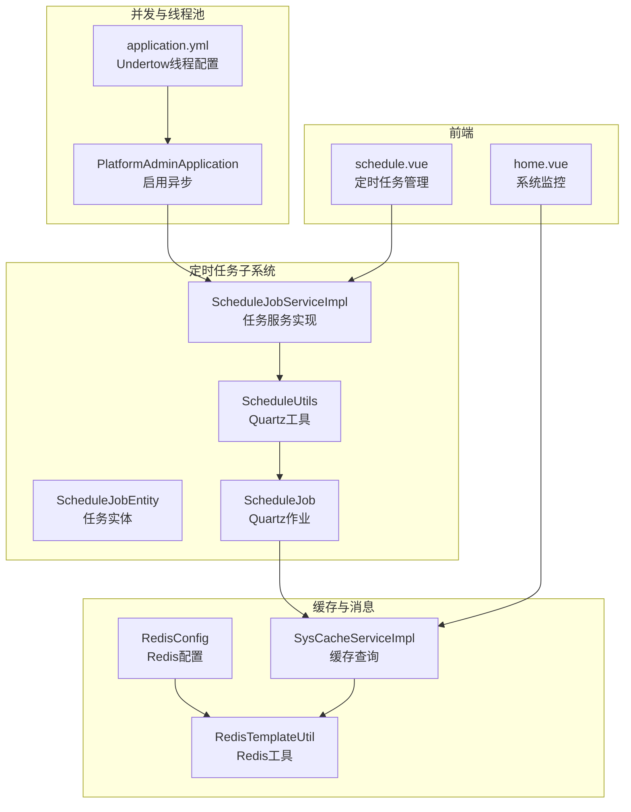
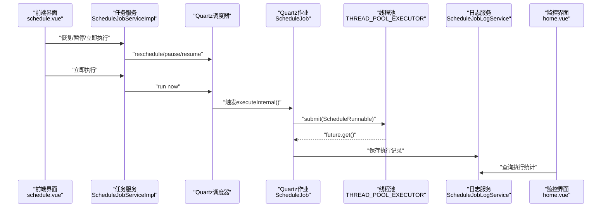
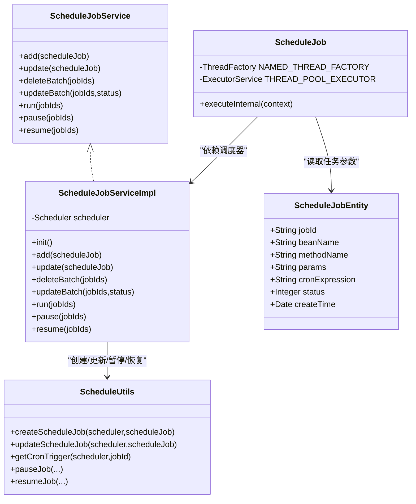
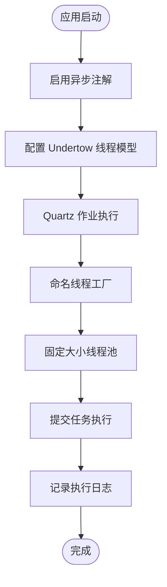
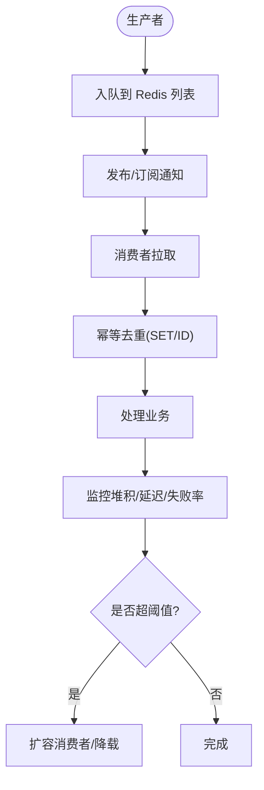
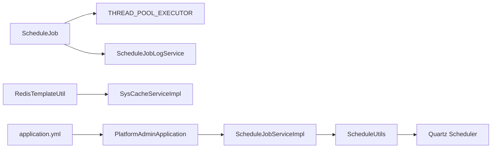

# 异步处理优化

<cite>
**本文引用的文件**
- [ScheduleJobServiceImpl.java](file://platform-admin/src/main/java/com/platform/modules/job/service/impl/ScheduleJobServiceImpl.java)
- [ScheduleJobService.java](file://platform-admin/src/main/java/com/platform/modules/job/service/ScheduleJobService.java)
- [ScheduleUtils.java](file://platform-admin/src/main/java/com/platform/modules/job/utils/ScheduleUtils.java)
- [ScheduleJob.java](file://platform-admin/src/main/java/com/platform/modules/job/utils/ScheduleJob.java)
- [ScheduleJobEntity.java](file://platform-admin/src/main/java/com/platform/modules/job/entity/ScheduleJobEntity.java)
- [application.yml](file://platform-admin/src/main/resources/application.yml)
- [PlatformAdminApplication.java](file://platform-admin/src/main/java/com/platform/PlatformAdminApplication.java)
- [RedisConfig.java](file://platform-common/src/main/java/com/platform/config/RedisConfig.java)
- [RedisTemplateUtil.java](file://platform-common/src/main/java/com/platform/config/RedisTemplateUtil.java)
- [SysCacheServiceImpl.java](file://platform-admin/src/main/java/com/platform/modules/sys/service/impl/SysCacheServiceImpl.java)
- [SysCacheService.java](file://platform-admin/src/main/java/com/platform/modules/sys/service/SysCacheService.java)
- [logback-spring.xml](file://platform-admin/src/main/resources/logback-spring.xml)
- [schedule.vue](file://platform-admin-ui/src/views/modules/job/schedule.vue)
- [home.vue](file://platform-admin-ui/src/views/common/home.vue)
</cite>

## 目录
1. [简介](#简介)
2. [项目结构](#项目结构)
3. [核心组件](#核心组件)
4. [架构总览](#架构总览)
5. [详细组件分析](#详细组件分析)
6. [依赖分析](#依赖分析)
7. [性能考量](#性能考量)
8. [故障排查指南](#故障排查指南)
9. [结论](#结论)
10. [附录](#附录)

## 简介
本文件面向高并发异步系统的优化与落地，结合仓库现有实现，系统性梳理消息队列使用策略（可靠性、幂等、堆积监控）、异步任务调度机制（定时任务配置、任务分片与优先级）、并发控制策略（线程池、信号量与死锁预防）、异步最佳实践（方法设计、异常处理、结果回调），以及微服务间异步通信模式（事件驱动与CQRS）。同时提供性能测试与监控指标建议，帮助开发者构建稳定、可观测、可扩展的异步系统。

## 项目结构
围绕异步处理的关键模块分布如下：
- 定时任务子系统：任务实体、调度服务、Quartz工具、Quartz作业实现
- 并发与线程池：应用启用异步、 Undertow 线程模型配置
- 缓存与消息：Redis 配置与工具类（含发布订阅与列表操作）
- 前端交互：定时任务管理界面、系统监控界面

图表来源
- [ScheduleJobServiceImpl.java:45-139](file://platform-admin/src/main/java/com/platform/modules/job/service/impl/ScheduleJobServiceImpl.java#L45-L139)
- [ScheduleUtils.java:62-112](file://platform-admin/src/main/java/com/platform/modules/job/utils/ScheduleUtils.java#L62-L112)
- [ScheduleJob.java:41-96](file://platform-admin/src/main/java/com/platform/modules/job/utils/ScheduleJob.java#L41-L96)
- [ScheduleJobEntity.java:36-90](file://platform-admin/src/main/java/com/platform/modules/job/entity/ScheduleJobEntity.java#L36-L90)
- [PlatformAdminApplication.java:48-51](file://platform-admin/src/main/java/com/platform/PlatformAdminApplication.java#L48-L51)
- [application.yml:4-18](file://platform-admin/src/main/resources/application.yml#L4-L18)
- [RedisConfig.java:56-180](file://platform-common/src/main/java/com/platform/config/RedisConfig.java#L56-L180)
- [RedisTemplateUtil.java:42-682](file://platform-common/src/main/java/com/platform/config/RedisTemplateUtil.java#L42-L682)
- [SysCacheServiceImpl.java:40-76](file://platform-admin/src/main/java/com/platform/modules/sys/service/impl/SysCacheServiceImpl.java#L40-L76)
- [schedule.vue:240-290](file://platform-admin-ui/src/views/modules/job/schedule.vue#L240-L290)
- [home.vue:1104-1188](file://platform-admin-ui/src/views/common/home.vue#L1104-L1188)

章节来源
- [ScheduleJobServiceImpl.java:45-139](file://platform-admin/src/main/java/com/platform/modules/job/service/impl/ScheduleJobServiceImpl.java#L45-L139)
- [application.yml:4-18](file://platform-admin/src/main/resources/application.yml#L4-L18)
- [RedisTemplateUtil.java:42-682](file://platform-common/src/main/java/com/platform/config/RedisTemplateUtil.java#L42-L682)
- [SysCacheServiceImpl.java:40-76](file://platform-admin/src/main/java/com/platform/modules/sys/service/impl/SysCacheServiceImpl.java#L40-L76)
- [schedule.vue:240-290](file://platform-admin-ui/src/views/modules/job/schedule.vue#L240-L290)
- [home.vue:1104-1188](file://platform-admin-ui/src/views/common/home.vue#L1104-L1188)

## 核心组件
- 定时任务实体与服务：任务元数据、状态、表达式与生命周期管理
- Quartz 调度工具：任务创建、更新、暂停/恢复、触发器构建
- Quartz 作业：线程池执行、异常捕获、日志记录与结果落库
- 并发与线程池：应用启用异步、 Undertow I/O 与工作线程配置
- Redis 缓存与消息：序列化、连接池、发布/订阅、列表操作
- 前端交互：定时任务启停与立即执行、系统资源监控可视化

章节来源
- [ScheduleJobEntity.java:36-90](file://platform-admin/src/main/java/com/platform/modules/job/entity/ScheduleJobEntity.java#L36-L90)
- [ScheduleJobService.java:42-91](file://platform-admin/src/main/java/com/platform/modules/job/service/ScheduleJobService.java#L42-L91)
- [ScheduleUtils.java:62-112](file://platform-admin/src/main/java/com/platform/modules/job/utils/ScheduleUtils.java#L62-L112)
- [ScheduleJob.java:41-96](file://platform-admin/src/main/java/com/platform/modules/job/utils/ScheduleJob.java#L41-L96)
- [PlatformAdminApplication.java:48-51](file://platform-admin/src/main/java/com/platform/PlatformAdminApplication.java#L48-L51)
- [application.yml:4-18](file://platform-admin/src/main/resources/application.yml#L4-L18)
- [RedisConfig.java:56-180](file://platform-common/src/main/java/com/platform/config/RedisConfig.java#L56-L180)
- [RedisTemplateUtil.java:42-682](file://platform-common/src/main/java/com/platform/config/RedisTemplateUtil.java#L42-L682)
- [SysCacheServiceImpl.java:40-76](file://platform-admin/src/main/java/com/platform/modules/sys/service/impl/SysCacheServiceImpl.java#L40-L76)

## 架构总览
下图展示从“前端操作”到“定时任务执行”的端到端流程，包含日志记录与监控反馈。

图表来源
- [schedule.vue:240-290](file://platform-admin-ui/src/views/modules/job/schedule.vue#L240-L290)
- [ScheduleJobServiceImpl.java:111-137](file://platform-admin/src/main/java/com/platform/modules/job/service/impl/ScheduleJobServiceImpl.java#L111-L137)
- [ScheduleUtils.java:91-112](file://platform-admin/src/main/java/com/platform/modules/job/utils/ScheduleUtils.java#L91-L112)
- [ScheduleJob.java:47-95](file://platform-admin/src/main/java/com/platform/modules/job/utils/ScheduleJob.java#L47-L95)
- [home.vue:1104-1188](file://platform-admin-ui/src/views/common/home.vue#L1104-L1188)

## 详细组件分析

### 定时任务调度机制
- 任务实体：包含任务标识、Bean 名称、方法名、参数、Cron 表达式、状态与创建时间等字段
- 服务接口：提供新增、更新、批量删除、批量状态更新、立即执行、暂停、恢复等能力
- Quartz 工具：封装任务创建、更新、触发器获取与暂停/恢复逻辑，支持 Misfire 处理策略
- Quartz 作业：在作业内部使用命名线程工厂与固定大小线程池执行任务，统一记录执行时长与状态，并持久化日志

图表来源
- [ScheduleJobEntity.java:36-90](file://platform-admin/src/main/java/com/platform/modules/job/entity/ScheduleJobEntity.java#L36-L90)
- [ScheduleJobService.java:42-91](file://platform-admin/src/main/java/com/platform/modules/job/service/ScheduleJobService.java#L42-L91)
- [ScheduleJobServiceImpl.java:45-139](file://platform-admin/src/main/java/com/platform/modules/job/service/impl/ScheduleJobServiceImpl.java#L45-L139)
- [ScheduleUtils.java:62-112](file://platform-admin/src/main/java/com/platform/modules/job/utils/ScheduleUtils.java#L62-L112)
- [ScheduleJob.java:41-96](file://platform-admin/src/main/java/com/platform/modules/job/utils/ScheduleJob.java#L41-L96)

章节来源
- [ScheduleJobEntity.java:36-90](file://platform-admin/src/main/java/com/platform/modules/job/entity/ScheduleJobEntity.java#L36-L90)
- [ScheduleJobService.java:42-91](file://platform-admin/src/main/java/com/platform/modules/job/service/ScheduleJobService.java#L42-L91)
- [ScheduleJobServiceImpl.java:45-139](file://platform-admin/src/main/java/com/platform/modules/job/service/impl/ScheduleJobServiceImpl.java#L45-L139)
- [ScheduleUtils.java:62-112](file://platform-admin/src/main/java/com/platform/modules/job/utils/ScheduleUtils.java#L62-L112)
- [ScheduleJob.java:41-96](file://platform-admin/src/main/java/com/platform/modules/job/utils/ScheduleJob.java#L41-L96)

### 并发控制策略
- 应用启用异步：通过启动类启用异步注解，便于后续在业务层使用异步执行
- Undertow 线程模型：配置 I/O 线程与工作线程数量，平衡阻塞与非阻塞任务吞吐
- Quartz 作业线程池：使用命名线程工厂与固定大小线程池执行具体任务，避免频繁创建销毁线程带来的开销

图表来源
- [PlatformAdminApplication.java:48-51](file://platform-admin/src/main/java/com/platform/PlatformAdminApplication.java#L48-L51)
- [application.yml:4-18](file://platform-admin/src/main/resources/application.yml#L4-L18)
- [ScheduleJob.java:41-46](file://platform-admin/src/main/java/com/platform/modules/job/utils/ScheduleJob.java#L41-L46)

章节来源
- [PlatformAdminApplication.java:48-51](file://platform-admin/src/main/java/com/platform/PlatformAdminApplication.java#L48-L51)
- [application.yml:4-18](file://platform-admin/src/main/resources/application.yml#L4-L18)
- [ScheduleJob.java:41-46](file://platform-admin/src/main/java/com/platform/modules/job/utils/ScheduleJob.java#L41-L46)

### 消息队列使用策略
- 可靠性保证：结合 Redis 列表与发布/订阅实现消息入队与消费；建议配合持久化存储与重试策略
- 幂等处理：消费端基于唯一消息 ID 去重，或使用 Redis SET 去重集合，确保重复消息不产生副作用
- 堆积监控：通过 Redis 列表长度与消费者拉取速率评估堆积情况，必要时扩容消费者或降载

图表来源
- [RedisTemplateUtil.java:613-682](file://platform-common/src/main/java/com/platform/config/RedisTemplateUtil.java#L613-L682)
- [SysCacheServiceImpl.java:40-76](file://platform-admin/src/main/java/com/platform/modules/sys/service/impl/SysCacheServiceImpl.java#L40-L76)

章节来源
- [RedisTemplateUtil.java:613-682](file://platform-common/src/main/java/com/platform/config/RedisTemplateUtil.java#L613-L682)
- [SysCacheServiceImpl.java:40-76](file://platform-admin/src/main/java/com/platform/modules/sys/service/impl/SysCacheServiceImpl.java#L40-L76)

### 微服务间异步通信模式
- 事件驱动：上游写入事件到消息中间件，下游订阅并异步处理，降低耦合与同步等待
- CQRS：命令与查询分离，写操作异步化并产生事件，读模型独立构建与查询，提升扩展性

（本节为概念性说明，未直接分析具体源码文件）

### 异步最佳实践
- 异步方法设计：使用命名线程工厂与合理大小的线程池，避免长时间阻塞；对外暴露 Future/CompletableFuture 以便上层聚合
- 异常处理：在作业内捕获异常并记录错误信息与耗时，确保任务状态可追踪
- 结果回调：通过日志服务或回调接口上报执行结果，便于监控与重试

章节来源
- [ScheduleJob.java:66-95](file://platform-admin/src/main/java/com/platform/modules/job/utils/ScheduleJob.java#L66-L95)

## 依赖分析
- 组件内聚与耦合
  - 任务服务与 Quartz 工具强耦合，职责清晰：前者负责任务生命周期，后者负责调度细节
  - Quartz 作业与线程池弱耦合，通过线程池执行具体任务，便于替换执行器
- 外部依赖
  - Quartz：任务调度核心
  - Redis：消息队列与缓存支撑
  - Undertow：Web 容器线程模型

图表来源
- [ScheduleJobServiceImpl.java:45-139](file://platform-admin/src/main/java/com/platform/modules/job/service/impl/ScheduleJobServiceImpl.java#L45-L139)
- [ScheduleUtils.java:62-112](file://platform-admin/src/main/java/com/platform/modules/job/utils/ScheduleUtils.java#L62-L112)
- [ScheduleJob.java:41-96](file://platform-admin/src/main/java/com/platform/modules/job/utils/ScheduleJob.java#L41-L96)
- [RedisTemplateUtil.java:42-682](file://platform-common/src/main/java/com/platform/config/RedisTemplateUtil.java#L42-L682)
- [SysCacheServiceImpl.java:40-76](file://platform-admin/src/main/java/com/platform/modules/sys/service/impl/SysCacheServiceImpl.java#L40-L76)
- [PlatformAdminApplication.java:48-51](file://platform-admin/src/main/java/com/platform/PlatformAdminApplication.java#L48-L51)
- [application.yml:4-18](file://platform-admin/src/main/resources/application.yml#L4-L18)

章节来源
- [ScheduleJobServiceImpl.java:45-139](file://platform-admin/src/main/java/com/platform/modules/job/service/impl/ScheduleJobServiceImpl.java#L45-L139)
- [ScheduleUtils.java:62-112](file://platform-admin/src/main/java/com/platform/modules/job/utils/ScheduleUtils.java#L62-L112)
- [ScheduleJob.java:41-96](file://platform-admin/src/main/java/com/platform/modules/job/utils/ScheduleJob.java#L41-L96)
- [RedisTemplateUtil.java:42-682](file://platform-common/src/main/java/com/platform/config/RedisTemplateUtil.java#L42-L682)
- [SysCacheServiceImpl.java:40-76](file://platform-admin/src/main/java/com/platform/modules/sys/service/impl/SysCacheServiceImpl.java#L40-L76)
- [PlatformAdminApplication.java:48-51](file://platform-admin/src/main/java/com/platform/PlatformAdminApplication.java#L48-L51)
- [application.yml:4-18](file://platform-admin/src/main/resources/application.yml#L4-L18)

## 性能考量
- 线程池与队列
  - 固定大小线程池适合 CPU 密集型任务；I/O 密集型可考虑有界队列与动态扩缩容
  - 队列长度与拒绝策略需结合 SLA 设定，避免无界增长导致 OOM
- 超时与重试
  - 明确任务超时阈值，超过阈值快速失败并记录
  - 对瞬时失败采用指数退避重试，避免雪崩
- 监控指标
  - 延迟分布、吞吐量、队列长度、拒绝次数、失败率、重试次数、线程池活跃度
  - 通过前端监控面板展示 CPU/内存/磁盘使用率，辅助容量规划

（本节提供通用指导，未直接分析具体源码文件）

## 故障排查指南
- 日志级别与输出
  - 合理设置日志级别，关键路径开启 TRACE/DEBUG，避免生产环境过度打印
- 定时任务异常
  - 作业内捕获异常并记录错误信息与耗时，检查任务状态与日志服务
- Redis 堆积
  - 使用模糊查询与键过期策略清理无效键，关注列表长度与消费速率

章节来源
- [logback-spring.xml:82-93](file://platform-admin/src/main/resources/logback-spring.xml#L82-L93)
- [ScheduleJob.java:82-95](file://platform-admin/src/main/java/com/platform/modules/job/utils/ScheduleJob.java#L82-L95)
- [SysCacheServiceImpl.java:49-66](file://platform-admin/src/main/java/com/platform/modules/sys/service/impl/SysCacheServiceImpl.java#L49-L66)

## 结论
本项目在定时任务与并发控制方面具备良好基础：Quartz 调度、命名线程池与日志落库形成闭环；Redis 提供消息队列与缓存能力。建议在此基础上完善消息可靠性、幂等与堆积监控策略，引入统一的异步异常与重试治理，建立完善的性能测试与监控体系，持续迭代以支撑更高并发场景。

## 附录
- 前端交互示例
  - 定时任务管理界面支持批量恢复、暂停与立即执行
  - 系统监控界面展示 CPU/内存/磁盘使用率

章节来源
- [schedule.vue:240-290](file://platform-admin-ui/src/views/modules/job/schedule.vue#L240-L290)
- [home.vue:1104-1188](file://platform-admin-ui/src/views/common/home.vue#L1104-L1188)