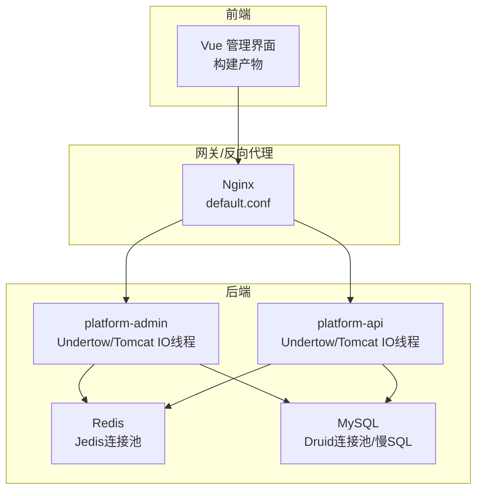
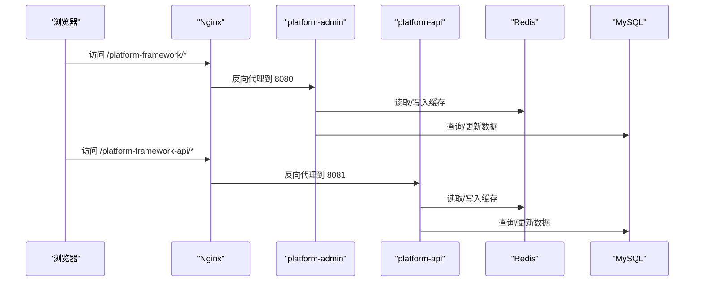
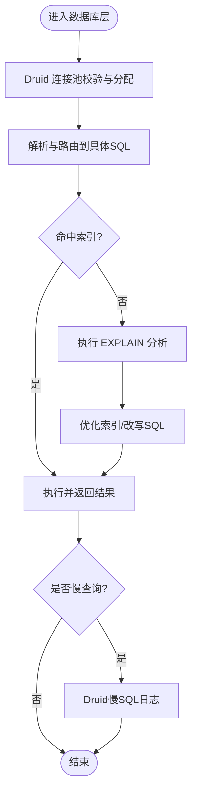
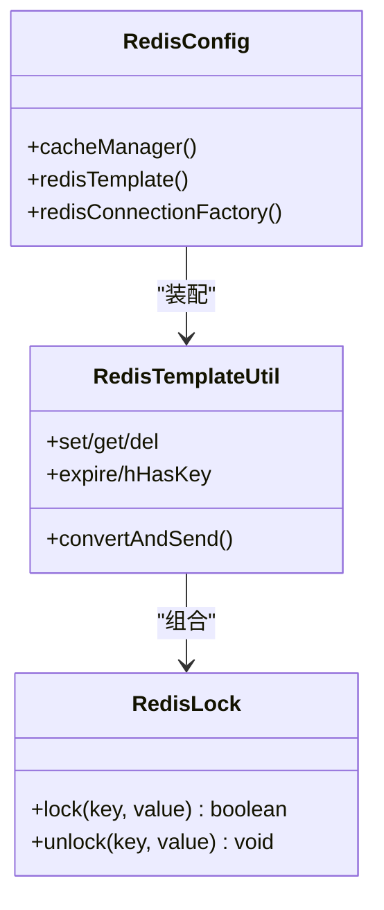
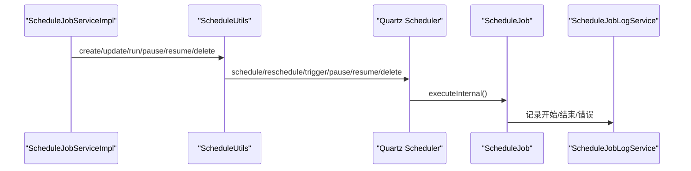
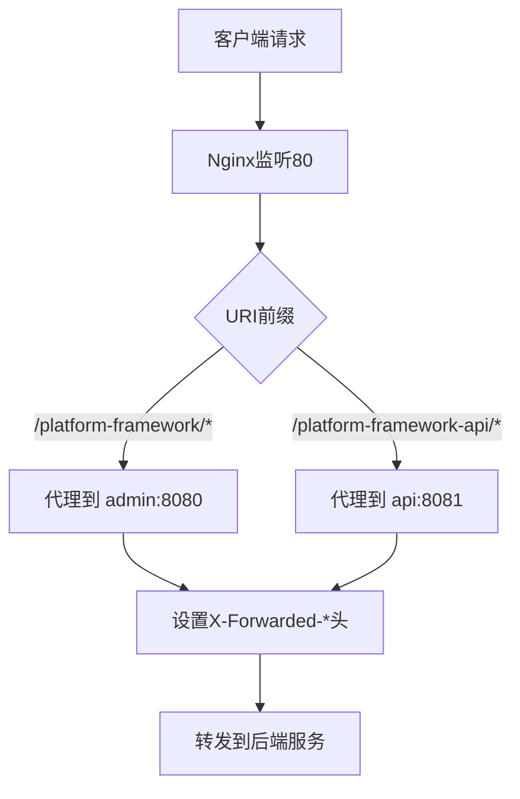
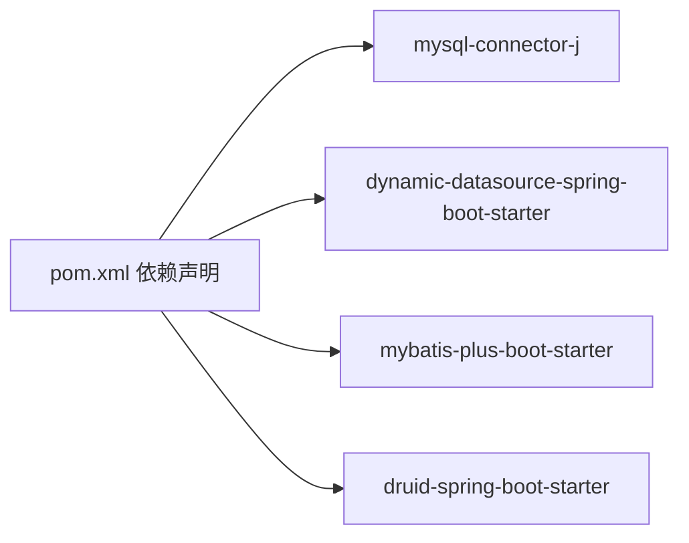

# 性能优化方案

<cite>
**本文引用的文件**
- [deploy/nginx/default.conf](file://deploy/nginx/default.conf)
- [platform-admin/src/main/resources/application.yml](file://platform-admin/src/main/resources/application.yml)
- [platform-api/src/main/resources/application.yml](file://platform-api/src/main/resources/application.yml)
- [platform-common/src/main/java/com/platform/config/RedisConfig.java](file://platform-common/src/main/java/com/platform/config/RedisConfig.java)
- [platform-common/src/main/java/com/platform/config/RedisTemplateUtil.java](file://platform-common/src/main/java/com/platform/config/RedisTemplateUtil.java)
- [platform-common/src/main/java/com/platform/config/RedisLock.java](file://platform-common/src/main/java/com/platform/config/RedisLock.java)
- [platform-admin/src/main/resources/application-dev.yml](file://platform-admin/src/main/resources/application-dev.yml)
- [platform-admin/src/main/resources/application-test.yml](file://platform-admin/src/main/resources/application-test.yml)
- [platform-admin/src/main/resources/application-prod.yml](file://platform-admin/src/main/resources/application-prod.yml)
- [pom.xml](file://pom.xml)
- [platform-admin/src/main/java/com/platform/modules/job/utils/ScheduleUtils.java](file://platform-admin/src/main/java/com/platform/modules/job/utils/ScheduleUtils.java)
- [platform-admin/src/main/java/com/platform/modules/job/utils/ScheduleJob.java](file://platform-admin/src/main/java/com/platform/modules/job/utils/ScheduleJob.java)
- [platform-admin/src/main/java/com/platform/modules/job/service/impl/ScheduleJobServiceImpl.java](file://platform-admin/src/main/java/com/platform/modules/job/service/impl/ScheduleJobServiceImpl.java)
- [platform-admin/src/main/java/com/platform/modules/sys/controller/SysMonitorController.java](file://platform-admin/src/main/java/com/platform/modules/sys/controller/SysMonitorController.java)
- [platform-admin-ui/package.json](file://platform-admin-ui/package.json)
- [platform-admin-ui/build/build.js](file://platform-admin-ui/build/build.js)
- [platform-admin-ui/src/views/common/home.vue](file://platform-admin-ui/src/views/common/home.vue)
- [platform-admin/src/main/resources/logback-spring.xml](file://platform-admin/src/main/resources/logback-spring.xml)
- [_sql/base.sql](file://_sql/base.sql)
</cite>

## 目录
1. [简介](#简介)
2. [项目结构](#项目结构)
3. [核心组件](#核心组件)
4. [架构总览](#架构总览)
5. [详细组件分析](#详细组件分析)
6. [依赖分析](#依赖分析)
7. [性能考量](#性能考量)
8. [故障排查指南](#故障排查指南)
9. [结论](#结论)
10. [附录](#附录)

## 简介
本方案面向平台项目的整体性能优化，覆盖数据库、缓存、异步处理、负载均衡、前端与后端性能、监控与压测等方面，结合现有配置与实现，给出可落地的优化建议与实施步骤。

## 项目结构
- 后端采用多模块 Maven 结构，包含 admin 管理端、api 接口端、业务模块、公共组件与通用工具。
- 前端基于 Vue2 + Element-UI 的管理界面，构建产物部署于 Nginx。
- 缓存采用 Redis，提供连接池、序列化、分布式锁与消息队列能力。
- 数据库连接池采用 Druid，具备慢 SQL 监控与统计。
- 定时任务基于 Quartz，提供任务调度与日志记录。

图表来源
- [deploy/nginx/default.conf:1-28](file://deploy/nginx/default.conf#L1-L28)
- [platform-admin/src/main/resources/application.yml:4-20](file://platform-admin/src/main/resources/application.yml#L4-L20)
- [platform-api/src/main/resources/application.yml:4-20](file://platform-api/src/main/resources/application.yml#L4-L20)
- [platform-common/src/main/java/com/platform/config/RedisConfig.java:76-99](file://platform-common/src/main/java/com/platform/config/RedisConfig.java#L76-L99)
- [platform-admin/src/main/resources/application-dev.yml:18-36](file://platform-admin/src/main/resources/application-dev.yml#L18-L36)

章节来源
- [deploy/nginx/default.conf:1-28](file://deploy/nginx/default.conf#L1-L28)
- [platform-admin/src/main/resources/application.yml:4-20](file://platform-admin/src/main/resources/application.yml#L4-L20)
- [platform-api/src/main/resources/application.yml:4-20](file://platform-api/src/main/resources/application.yml#L4-L20)

## 核心组件
- Nginx 反向代理与静态资源服务
- Undertow 线程模型与静态资源映射
- Redis 缓存与连接池、序列化、分布式锁、消息队列
- Druid 连接池与慢 SQL 监控
- Quartz 定时任务与日志
- JVM 与系统监控

章节来源
- [deploy/nginx/default.conf:11-25](file://deploy/nginx/default.conf#L11-L25)
- [platform-admin/src/main/resources/application.yml:4-20](file://platform-admin/src/main/resources/application.yml#L4-L20)
- [platform-common/src/main/java/com/platform/config/RedisConfig.java:94-100](file://platform-common/src/main/java/com/platform/config/RedisConfig.java#L94-L100)
- [platform-admin/src/main/resources/application-dev.yml:33-41](file://platform-admin/src/main/resources/application-dev.yml#L33-L41)
- [platform-admin/src/main/java/com/platform/modules/job/utils/ScheduleUtils.java:62-86](file://platform-admin/src/main/java/com/platform/modules/job/utils/ScheduleUtils.java#L62-L86)

## 架构总览
系统由 Nginx 提供统一入口与静态资源，后端 admin 与 api 服务分别承载管理与移动端接口，二者共享 Redis 与 MySQL。定时任务独立调度，日志与监控贯穿全链路。

图表来源
- [deploy/nginx/default.conf:11-25](file://deploy/nginx/default.conf#L11-L25)
- [platform-admin/src/main/resources/application.yml:19-20](file://platform-admin/src/main/resources/application.yml#L19-L20)
- [platform-api/src/main/resources/application.yml:19-20](file://platform-api/src/main/resources/application.yml#L19-L20)

## 详细组件分析

### 数据库性能优化
- 连接池配置
  - Druid 连接池参数：初始连接、最小空闲、最大活跃、最大等待、空闲回收周期、校验查询、预编译语句池大小、过滤器等。
  - 慢 SQL 配置：开启慢 SQL 日志、合并 SQL、慢 SQL 阈值。
- 查询优化
  - 使用 MyBatis-Plus 与动态数据源，合理拆分读写分离与主从。
  - 关注 SQL 执行计划，避免全表扫描与 N+1 查询。
- 索引设计
  - 唯一索引与普通索引结合，复合索引遵循最左前缀原则。
  - 避免对索引列进行函数计算或隐式转换。
- 慢查询分析
  - 通过 Druid 控制台查看慢 SQL 与统计信息。
  - 结合数据库慢日志定位热点表与热点 SQL。

图表来源
- [platform-admin/src/main/resources/application-dev.yml:18-41](file://platform-admin/src/main/resources/application-dev.yml#L18-L41)
- [pom.xml:167-187](file://pom.xml#L167-L187)
- [_sql/base.sql:258-293](file://_sql/base.sql#L258-L293)

章节来源
- [platform-admin/src/main/resources/application-dev.yml:18-41](file://platform-admin/src/main/resources/application-dev.yml#L18-L41)
- [pom.xml:167-187](file://pom.xml#L167-L187)
- [_sql/base.sql:258-293](file://_sql/base.sql#L258-L293)

### 缓存策略优化（Redis）
- 架构与连接池
  - Jedis 连接池配置：最大活跃、最大空闲、最小空闲、最大等待、读超时。
  - CacheManager 默认 TTL 与序列化策略。
- 缓存穿透防护
  - 对空值设置短期缓存或布隆过滤器。
- 缓存雪崩预防
  - TTL 随机抖动；热点键设置互斥过期；多级缓存。
- 缓存一致性
  - 写策略：先写 DB 再删缓存；读策略：读取缓存未命中回源并写回。
- 分布式锁
  - 基于 Redis 的 setNx + 过期时间实现；解锁需校验值一致性。
- 消息队列
  - 使用 Redis 发布/订阅实现简单异步解耦。

图表来源
- [platform-common/src/main/java/com/platform/config/RedisConfig.java:94-100](file://platform-common/src/main/java/com/platform/config/RedisConfig.java#L94-L100)
- [platform-common/src/main/java/com/platform/config/RedisTemplateUtil.java:138-168](file://platform-common/src/main/java/com/platform/config/RedisTemplateUtil.java#L138-L168)
- [platform-common/src/main/java/com/platform/config/RedisLock.java:46-79](file://platform-common/src/main/java/com/platform/config/RedisLock.java#L46-L79)

章节来源
- [platform-common/src/main/java/com/platform/config/RedisConfig.java:76-100](file://platform-common/src/main/java/com/platform/config/RedisConfig.java#L76-L100)
- [platform-common/src/main/java/com/platform/config/RedisTemplateUtil.java:623-625](file://platform-common/src/main/java/com/platform/config/RedisTemplateUtil.java#L623-L625)
- [platform-common/src/main/java/com/platform/config/RedisLock.java:46-79](file://platform-common/src/main/java/com/platform/config/RedisLock.java#L46-L79)

### 异步处理优化（Quartz 定时任务）
- 任务生命周期管理：创建、暂停、恢复、删除、立即执行。
- 任务日志：记录执行时间、状态、错误信息。
- 线程池：内部使用固定线程池，建议根据任务复杂度与并发需求调整。

图表来源
- [platform-admin/src/main/java/com/platform/modules/job/service/impl/ScheduleJobServiceImpl.java:81-139](file://platform-admin/src/main/java/com/platform/modules/job/service/impl/ScheduleJobServiceImpl.java#L81-L139)
- [platform-admin/src/main/java/com/platform/modules/job/utils/ScheduleUtils.java:62-166](file://platform-admin/src/main/java/com/platform/modules/job/utils/ScheduleUtils.java#L62-L166)
- [platform-admin/src/main/java/com/platform/modules/job/utils/ScheduleJob.java:47-64](file://platform-admin/src/main/java/com/platform/modules/job/utils/ScheduleJob.java#L47-L64)

章节来源
- [platform-admin/src/main/java/com/platform/modules/job/utils/ScheduleUtils.java:62-166](file://platform-admin/src/main/java/com/platform/modules/job/utils/ScheduleUtils.java#L62-L166)
- [platform-admin/src/main/java/com/platform/modules/job/utils/ScheduleJob.java:47-64](file://platform-admin/src/main/java/com/platform/modules/job/utils/ScheduleJob.java#L47-L64)
- [platform-admin/src/main/java/com/platform/modules/job/service/impl/ScheduleJobServiceImpl.java:81-139](file://platform-admin/src/main/java/com/platform/modules/job/service/impl/ScheduleJobServiceImpl.java#L81-L139)

### 负载均衡优化（Nginx）
- 反向代理：将 /platform-framework 与 /platform-framework-api 分别代理至 admin 与 api 服务。
- 请求头透传：Host、X-Real-IP、X-Forwarded-For、X-Forwarded-Proto。
- 静态资源：root 与 index 配置，try_files 回退到单页应用路由。

图表来源
- [deploy/nginx/default.conf:11-25](file://deploy/nginx/default.conf#L11-L25)

章节来源
- [deploy/nginx/default.conf:1-28](file://deploy/nginx/default.conf#L1-L28)

### 前端性能优化
- 构建与打包
  - 使用 webpack 与 gulp 进行生产构建，输出静态资源。
  - 生产环境脚本命令与构建流程。
- 资源优化
  - 通过构建工具进行压缩、抽取样式、按需引入组件。
- 运行时优化
  - 懒加载与预加载策略（结合路由与组件），减少首屏体积。
  - CDN 加速与静态资源缓存策略（由 Nginx 与 CDN 配合）。

章节来源
- [platform-admin-ui/package.json:8-12](file://platform-admin-ui/package.json#L8-L12)
- [platform-admin-ui/build/build.js:14-35](file://platform-admin-ui/build/build.js#L14-L35)

### 后端性能优化（JVM、线程池、内存）
- Undertow 线程模型
  - IO 线程数与工作线程数：根据 CPU 核心数与阻塞比例合理配置。
  - 缓冲区大小与直接内存：平衡吞吐与内存占用。
- 静态资源映射
  - 静态路径与映射开关，避免不必要的资源处理。
- JVM 与系统监控
  - 通过监控接口展示 CPU、内存、磁盘、JVM 等信息。
  - 日志级别与滚动策略，生产环境降噪与保留周期。

章节来源
- [platform-admin/src/main/resources/application.yml:4-20](file://platform-admin/src/main/resources/application.yml#L4-L20)
- [platform-admin/src/main/resources/application.yml:101-104](file://platform-admin/src/main/resources/application.yml#L101-L104)
- [platform-admin/src/main/java/com/platform/modules/sys/controller/SysMonitorController.java:56-83](file://platform-admin/src/main/java/com/platform/modules/sys/controller/SysMonitorController.java#L56-L83)
- [platform-admin/src/main/resources/logback-spring.xml:60-89](file://platform-admin/src/main/resources/logback-spring.xml#L60-L89)

## 依赖分析
- 数据库驱动与 ORM
  - MySQL Connector/J、Dynamic DataSource Starter、MyBatis-Plus、Druid Starter。
- 前端构建工具链
  - Vue2、Element-UI、Webpack、Gulp、ESLint 等。

图表来源
- [pom.xml:157-187](file://pom.xml#L157-L187)

章节来源
- [pom.xml:157-187](file://pom.xml#L157-L187)

## 性能考量
- 数据库
  - 连接池上限与等待时间需结合业务峰值与慢 SQL 情况调整。
  - 定期审查慢 SQL 与索引缺失，必要时引入分区或物化视图。
- 缓存
  - 热点数据设置合理 TTL 与互斥过期；对高并发写场景采用延迟双删或本地缓存兜底。
  - 使用发布/订阅实现异步刷新，降低同步写放大。
- 异步
  - 定时任务执行时间窗与并发度控制，避免与高峰期冲突。
  - 对外部依赖（支付、短信）采用异步回调与幂等设计。
- 负载均衡
  - Nginx 层限流与健康检查；后端服务横向扩展与会话粘性策略。
- 前端
  - 资源体积与请求数控制，CDN 与缓存头配置；骨架屏与渐进增强。
- 后端
  - Undertow 线程数与缓冲区按压测结果迭代；JVM 参数与 GC 策略结合监控指标调优。

## 故障排查指南
- 慢 SQL 定位
  - 通过 Druid 控制台查看慢 SQL 与统计信息，结合数据库慢日志定位。
- 缓存问题
  - 观察缓存命中率与过期策略；分布式锁加解锁异常排查。
- 定时任务
  - 查看任务日志表，确认执行时长、状态与异常堆栈。
- 监控与日志
  - 使用系统监控接口与日志滚动策略，定位 JVM 与磁盘压力。

章节来源
- [platform-admin/src/main/resources/application-dev.yml:38-41](file://platform-admin/src/main/resources/application-dev.yml#L38-L41)
- [platform-common/src/main/java/com/platform/config/RedisLock.java:70-79](file://platform-common/src/main/java/com/platform/config/RedisLock.java#L70-L79)
- [platform-admin/src/main/java/com/platform/modules/job/utils/ScheduleUtils.java:159-165](file://platform-admin/src/main/java/com/platform/modules/job/utils/ScheduleUtils.java#L159-L165)
- [platform-admin/src/main/java/com/platform/modules/sys/controller/SysMonitorController.java:56-83](file://platform-admin/src/main/java/com/platform/modules/sys/controller/SysMonitorController.java#L56-L83)
- [platform-admin/src/main/resources/logback-spring.xml:60-89](file://platform-admin/src/main/resources/logback-spring.xml#L60-L89)

## 结论
通过数据库连接池与慢 SQL 监控、Redis 缓存与分布式锁、Quartz 定时任务、Nginx 反向代理与静态资源、前端构建与 CDN、以及 JVM 与系统监控的协同优化，可显著提升系统的吞吐、稳定性与用户体验。建议以压测为依据持续迭代各项参数，并建立完善的监控与告警体系。

## 附录
- 压力测试方法
  - 设计典型场景（登录、查询、下单、支付回调），逐步提升并发与数据规模。
  - 关注响应时间、吞吐、错误率、慢请求占比与资源使用率。
  - 基准测试与回归测试结合，形成性能基线。
- 实施步骤
  - 评估现状 → 制定优化清单 → 分批实施 → 压测验证 → 上线灰度 → 监控告警 → 持续改进。
- 关键性能指标（KPI）
  - P95/P99 响应时间、吞吐（TPS/RPS）、错误率、缓存命中率、慢 SQL 比例、JVM Full GC 次数与时长、磁盘使用率与 IO 等待。