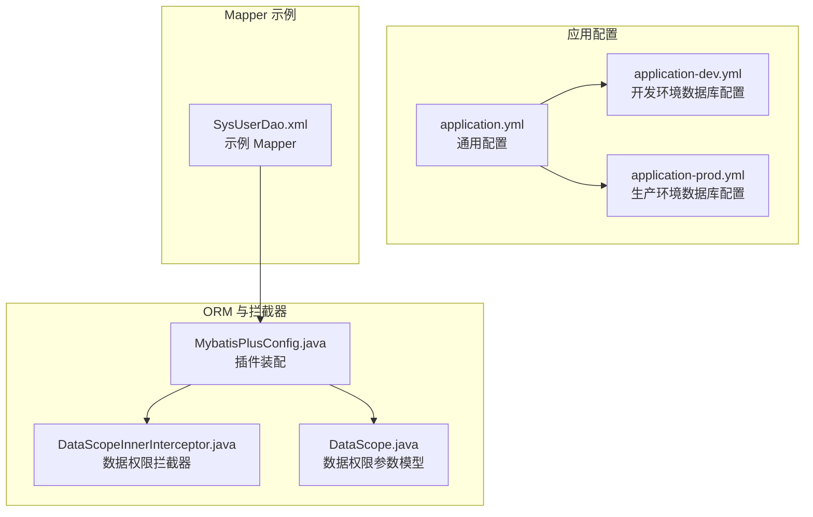
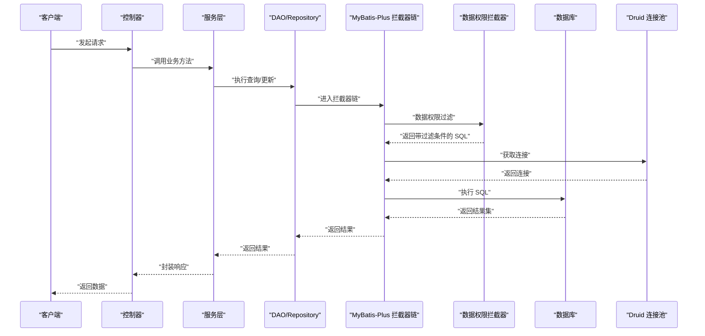
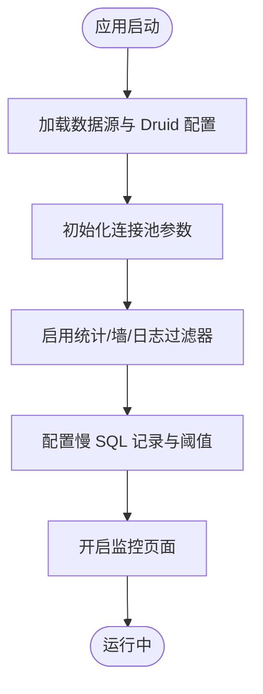
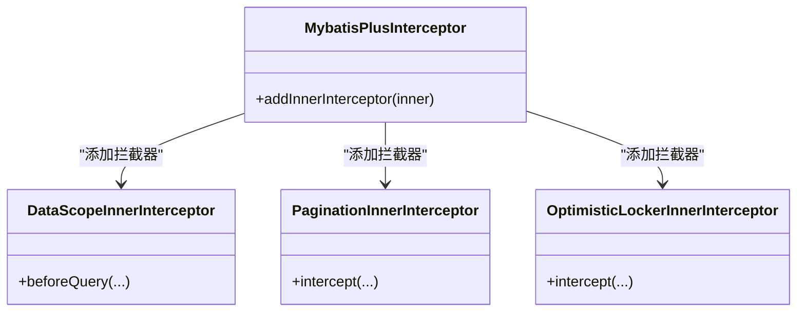
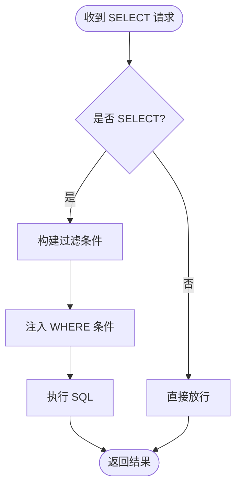
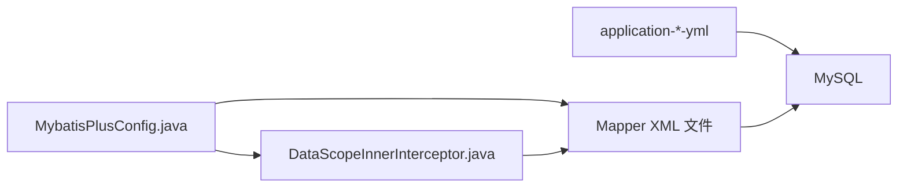

# 数据库性能优化

<cite>
**本文引用的文件**
- [application.yml](file://platform-admin/src/main/resources/application.yml)
- [application-dev.yml](file://platform-admin/src/main/resources/application-dev.yml)
- [application-prod.yml](file://platform-admin/src/main/resources/application-prod.yml)
- [MybatisPlusConfig.java](file://platform-admin/src/main/java/com/platform/config/MybatisPlusConfig.java)
- [DataScopeInnerInterceptor.java](file://platform-admin/src/main/java/com/platform/datascope/DataScopeInnerInterceptor.java)
- [DataScope.java](file://platform-admin/src/main/java/com/platform/datascope/DataScope.java)
- [SysUserDao.xml](file://platform-admin/src/main/resources/mapper/sys/SysUserDao.xml)
- [Agents.md](file://Agents.md)
</cite>

## 目录
1. [简介](#简介)
2. [项目结构](#项目结构)
3. [核心组件](#核心组件)
4. [架构总览](#架构总览)
5. [详细组件分析](#详细组件分析)
6. [依赖分析](#依赖分析)
7. [性能考量](#性能考量)
8. [故障排查指南](#故障排查指南)
9. [结论](#结论)
10. [附录](#附录)

## 简介
本文件面向数据库性能优化，结合代码库中的配置与实现，系统性讲解索引设计原则、SQL 查询优化、连接池配置、慢查询分析与监控、分区策略以及可落地的优化案例与对比思路。内容覆盖从配置层（Druid 连接池、MyBatis-Plus 插件）到运行期（慢 SQL 日志、数据权限拦截器）的关键实践，帮助开发者在实际场景中快速定位瓶颈并实施优化。

## 项目结构
本项目基于 Spring Boot + MyBatis-Plus + Druid 的典型架构，数据库连接池与慢 SQL 监控集中在多环境配置文件中，ORM 层通过 MyBatis-Plus 拦截器实现分页、数据权限与乐观锁控制。下图展示与数据库性能优化相关的核心模块与文件：

图表来源
- [application.yml:113-142](file://platform-admin/src/main/resources/application.yml#L113-L142)
- [application-dev.yml:1-52](file://platform-admin/src/main/resources/application-dev.yml#L1-L52)
- [application-prod.yml:1-52](file://platform-admin/src/main/resources/application-prod.yml#L1-L52)
- [MybatisPlusConfig.java:44-54](file://platform-admin/src/main/java/com/platform/config/MybatisPlusConfig.java#L44-L54)
- [DataScopeInnerInterceptor.java:48-85](file://platform-admin/src/main/java/com/platform/datascope/DataScopeInnerInterceptor.java#L48-L85)
- [DataScope.java:33-54](file://platform-admin/src/main/java/com/platform/datascope/DataScope.java#L33-L54)
- [SysUserDao.xml](file://platform-admin/src/main/resources/mapper/sys/SysUserDao.xml)

章节来源
- [application.yml:113-142](file://platform-admin/src/main/resources/application.yml#L113-L142)
- [application-dev.yml:1-52](file://platform-admin/src/main/resources/application-dev.yml#L1-L52)
- [application-prod.yml:1-52](file://platform-admin/src/main/resources/application-prod.yml#L1-L52)
- [MybatisPlusConfig.java:44-54](file://platform-admin/src/main/java/com/platform/config/MybatisPlusConfig.java#L44-L54)
- [DataScopeInnerInterceptor.java:48-85](file://platform-admin/src/main/java/com/platform/datascope/DataScopeInnerInterceptor.java#L48-L85)
- [DataScope.java:33-54](file://platform-admin/src/main/java/com/platform/datascope/DataScope.java#L33-L54)

## 核心组件
- Druid 连接池与慢 SQL 监控：通过多环境配置启用慢 SQL 记录、合并统计与阈值设置，便于定位热点 SQL。
- MyBatis-Plus 拦截器链：包含数据权限、分页与乐观锁，直接影响查询与写入的执行路径与性能。
- 数据权限拦截器：在查询前动态注入过滤条件，避免越权扫描，同时可能影响查询计划与索引选择。
- Mapper XML：承载具体 SQL 语句与查询条件，是索引设计与 SQL 优化的直接依据。

章节来源
- [application-dev.yml:18-41](file://platform-admin/src/main/resources/application-dev.yml#L18-L41)
- [application-prod.yml:23-51](file://platform-admin/src/main/resources/application-prod.yml#L23-L51)
- [MybatisPlusConfig.java:44-54](file://platform-admin/src/main/java/com/platform/config/MybatisPlusConfig.java#L44-L54)
- [DataScopeInnerInterceptor.java:50-85](file://platform-admin/src/main/java/com/platform/datascope/DataScopeInnerInterceptor.java#L50-L85)

## 架构总览
下图展示数据库访问链路与性能相关组件的交互关系：

图表来源
- [MybatisPlusConfig.java:44-54](file://platform-admin/src/main/java/com/platform/config/MybatisPlusConfig.java#L44-L54)
- [DataScopeInnerInterceptor.java:50-85](file://platform-admin/src/main/java/com/platform/datascope/DataScopeInnerInterceptor.java#L50-L85)
- [application-dev.yml:18-41](file://platform-admin/src/main/resources/application-dev.yml#L18-L41)
- [application-prod.yml:23-51](file://platform-admin/src/main/resources/application-prod.yml#L23-L51)

## 详细组件分析

### 组件一：Druid 连接池与慢 SQL 监控
- 关键配置要点
  - 连接池容量：初始连接、最小空闲、最大活跃、最大等待时间。
  - 连接有效性校验：空闲回收、借用/归还时校验。
  - 预编译语句：池化上限与开关。
  - 过滤器：统计(stat)、墙(wall)、日志(slf4j)。
  - 慢 SQL：开启记录、合并 SQL、慢 SQL 阈值。
  - 控制台：开启 Druid 监控页面与访问白名单。
- 性能意义
  - 合理的连接池参数可降低排队等待与频繁创建销毁带来的开销。
  - 慢 SQL 阈值与统计有助于发现热点与异常 SQL，指导索引与 SQL 优化。
  - 预编译语句池化减少解析与编译成本，提高吞吐。

图表来源
- [application-dev.yml:18-41](file://platform-admin/src/main/resources/application-dev.yml#L18-L41)
- [application-prod.yml:23-51](file://platform-admin/src/main/resources/application-prod.yml#L23-L51)

章节来源
- [application-dev.yml:18-41](file://platform-admin/src/main/resources/application-dev.yml#L18-L41)
- [application-prod.yml:23-51](file://platform-admin/src/main/resources/application-prod.yml#L23-L51)

### 组件二：MyBatis-Plus 拦截器链（分页、数据权限、乐观锁）
- 拦截器装配顺序
  - 数据权限拦截器 → 分页拦截器 → 乐观锁拦截器。
- 影响
  - 数据权限在 SQL 下推阶段注入过滤条件，可能改变查询计划与索引选择。
  - 分页拦截器对查询 SQL 进行改写，需确保分页字段具备高效索引。
  - 乐观锁在更新时避免并发冲突，减少回滚与重试成本。

图表来源
- [MybatisPlusConfig.java:44-54](file://platform-admin/src/main/java/com/platform/config/MybatisPlusConfig.java#L44-L54)

章节来源
- [MybatisPlusConfig.java:44-54](file://platform-admin/src/main/java/com/platform/config/MybatisPlusConfig.java#L44-L54)

### 组件三：数据权限拦截器（运行期 SQL 注入）
- 功能概述
  - 在 SELECT 查询前，根据用户角色与组织范围动态追加 WHERE 条件。
  - 支持“仅本人数据”与“含机构集合”的组合策略。
- 性能影响
  - 注入的过滤条件应尽量走索引列，避免函数包裹或隐式转换。
  - 若过滤条件无法命中索引，可能导致全表扫描或回表增加。

图表来源
- [DataScopeInnerInterceptor.java:50-85](file://platform-admin/src/main/java/com/platform/datascope/DataScopeInnerInterceptor.java#L50-L85)
- [DataScope.java:33-54](file://platform-admin/src/main/java/com/platform/datascope/DataScope.java#L33-L54)

章节来源
- [DataScopeInnerInterceptor.java:50-85](file://platform-admin/src/main/java/com/platform/datascope/DataScopeInnerInterceptor.java#L50-L85)
- [DataScope.java:33-54](file://platform-admin/src/main/java/com/platform/datascope/DataScope.java#L33-L54)

### 组件四：Mapper XML 与 SQL 优化入口
- 优化抓手
  - 打开对应 DAO 调用点 → 定位 XML Mapper → 核对查询条件、分页参数、返回字段与结果映射。
  - 重点约束：优先使用安全的 LIKE 写法，避免字符串拼接；同步检查 DAO 方法签名、实体/VO 字段与调用方一致性。
- 与拦截器协同
  - 数据权限拦截器可能在 SQL 中追加过滤条件，需评估是否引入额外索引或调整查询谓词。

章节来源
- [Agents.md:145-162](file://Agents.md#L145-L162)
- [SysUserDao.xml](file://platform-admin/src/main/resources/mapper/sys/SysUserDao.xml)

## 依赖分析
- 组件耦合
  - MyBatis-Plus 拦截器链内聚于配置类，与 DAO/Mapper 解耦。
  - 数据权限拦截器依赖用户上下文与常量，对 SQL 改写透明但需关注索引命中。
  - Druid 配置独立于业务层，通过环境文件集中管理。
- 外部依赖
  - MySQL 驱动与数据库版本特性需与 JDBC 参数匹配（如时区、字符集、SSL）。
  - Druid 过滤器链（stat/wall/slf4j）提供性能与安全观测能力。

图表来源
- [MybatisPlusConfig.java:44-54](file://platform-admin/src/main/java/com/platform/config/MybatisPlusConfig.java#L44-L54)
- [DataScopeInnerInterceptor.java:48-85](file://platform-admin/src/main/java/com/platform/datascope/DataScopeInnerInterceptor.java#L48-L85)
- [application-dev.yml:1-52](file://platform-admin/src/main/resources/application-dev.yml#L1-L52)
- [application-prod.yml:1-52](file://platform-admin/src/main/resources/application-prod.yml#L1-L52)

章节来源
- [MybatisPlusConfig.java:44-54](file://platform-admin/src/main/java/com/platform/config/MybatisPlusConfig.java#L44-L54)
- [DataScopeInnerInterceptor.java:48-85](file://platform-admin/src/main/java/com/platform/datascope/DataScopeInnerInterceptor.java#L48-L85)
- [application-dev.yml:1-52](file://platform-admin/src/main/resources/application-dev.yml#L1-L52)
- [application-prod.yml:1-52](file://platform-admin/src/main/resources/application-prod.yml#L1-L52)

## 性能考量
- 索引设计原则
  - 主键索引：保证唯一性与高选择性，避免随机写放大。
  - 唯一索引：用于业务唯一约束，减少重复与冲突。
  - 复合索引：遵循最左前缀原则，将高选择性列前置；避免在索引列上使用函数或隐式转换。
- SQL 查询优化
  - 使用 EXPLAIN 分析执行计划，避免全表扫描；优先回表次数少的索引。
  - 减少 SELECT *，按需返回字段；避免在 WHERE/HAVING 子句使用函数包裹列。
  - 分页查询务必基于稳定且高选择性的排序列，必要时考虑覆盖索引。
- 连接池配置优化
  - 初始连接与最小空闲：保障冷启动与低峰期的即时可用。
  - 最大活跃与最大等待：结合峰值 QPS 与平均 RT 设定，防止队列过长。
  - 预编译语句池：合理上限避免内存压力，同时提升执行效率。
- 慢查询分析与监控
  - 通过 Druid 统计与慢 SQL 阈值定位热点；结合业务场景设定阈值（如 10s）。
  - 结合数据库慢日志与 EXPLAIN，识别未命中索引、回表过多、临时表与排序等问题。
- 分区策略
  - 水平分区：按时间/哈希/范围切分大表，降低单表扫描规模。
  - 垂直分区：将宽表拆分为多个窄表，减少单行宽度与 IO。
- 具体优化案例与对比思路
  - 案例模板：场景描述 → 问题现象 → SQL 与执行计划 → 索引/SQL 优化方案 → 对比指标（QPS、P95/P99、慢请求数、回表次数）。
  - 注意：本仓库未提供具体 SQL 与基准数据，可在本地或测试环境按上述模板开展 A/B 对比。

## 故障排查指南
- 慢 SQL 与连接池问题
  - 确认慢 SQL 阈值与统计是否开启；检查 Druid 监控页面与日志输出。
  - 观察连接池等待时间与活跃连接数，判断是否需要扩容或优化 SQL。
- 数据权限导致的性能问题
  - 检查注入的过滤条件是否命中索引；必要时为过滤列建立合适索引。
  - 核对用户组织范围与“仅本人”策略是否正确下发。
- SQL 与 Mapper 问题
  - 严格遵循“先定位 DAO/Service 调用点 → 打开对应 XML → 核对查询条件/分页/映射”的流程。
  - LIKE 查询使用安全写法，避免字符串拼接；同步检查调用方与实体字段一致性。

章节来源
- [application-dev.yml:33-41](file://platform-admin/src/main/resources/application-dev.yml#L33-L41)
- [application-prod.yml:38-42](file://platform-admin/src/main/resources/application-prod.yml#L38-L42)
- [DataScopeInnerInterceptor.java:50-85](file://platform-admin/src/main/java/com/platform/datascope/DataScopeInnerInterceptor.java#L50-L85)
- [Agents.md:145-162](file://Agents.md#L145-L162)

## 结论
数据库性能优化是一个系统工程，涉及连接池参数、SQL 设计、索引策略与运行期监控。本项目通过 Druid 慢 SQL 与统计、MyBatis-Plus 拦截器链、数据权限拦截器等机制，提供了可观测与可控的优化抓手。建议以“慢 SQL 日志 + EXPLAIN + 索引设计 + 连接池调优”为主线，结合业务场景持续迭代，形成可度量的优化闭环。

## 附录
- 快速检查清单
  - 连接池：初始/最小空闲/最大活跃/最大等待是否合理？
  - 慢 SQL：是否开启统计与阈值？监控页面是否可访问？
  - SQL：是否存在函数包裹列、隐式转换、全表扫描？
  - 索引：WHERE/HAVING/ORDER BY/LIMIT 的列是否具备高效索引？
  - 数据权限：过滤条件是否命中索引？是否误伤查询性能？