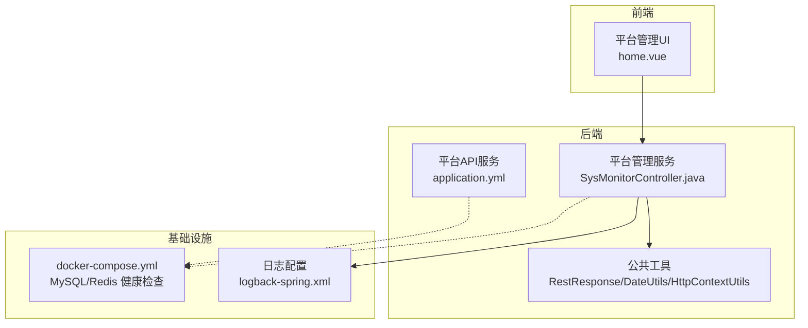
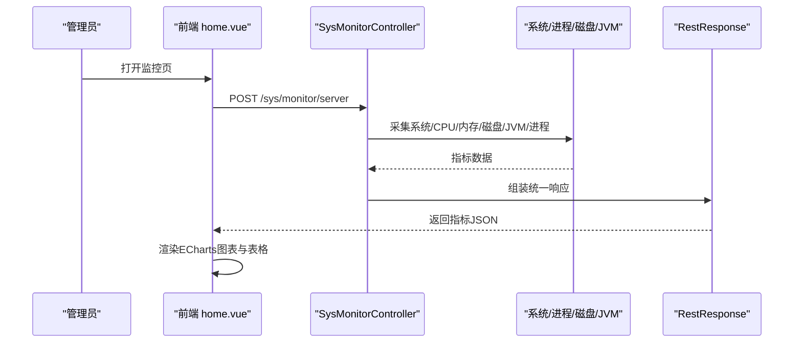
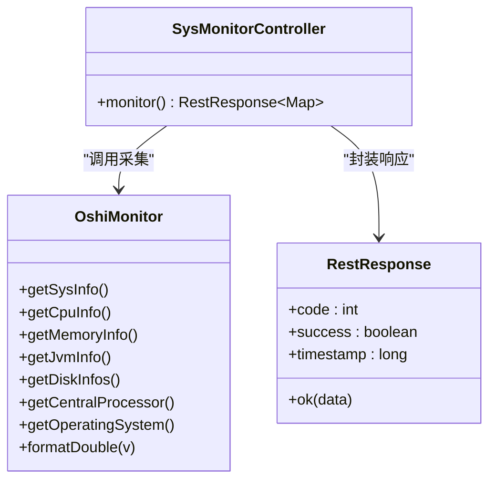
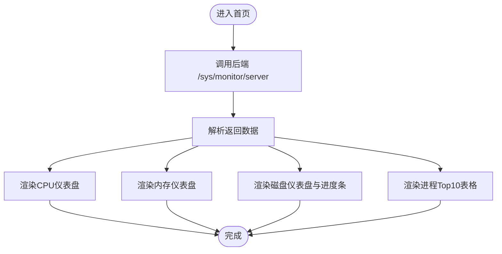
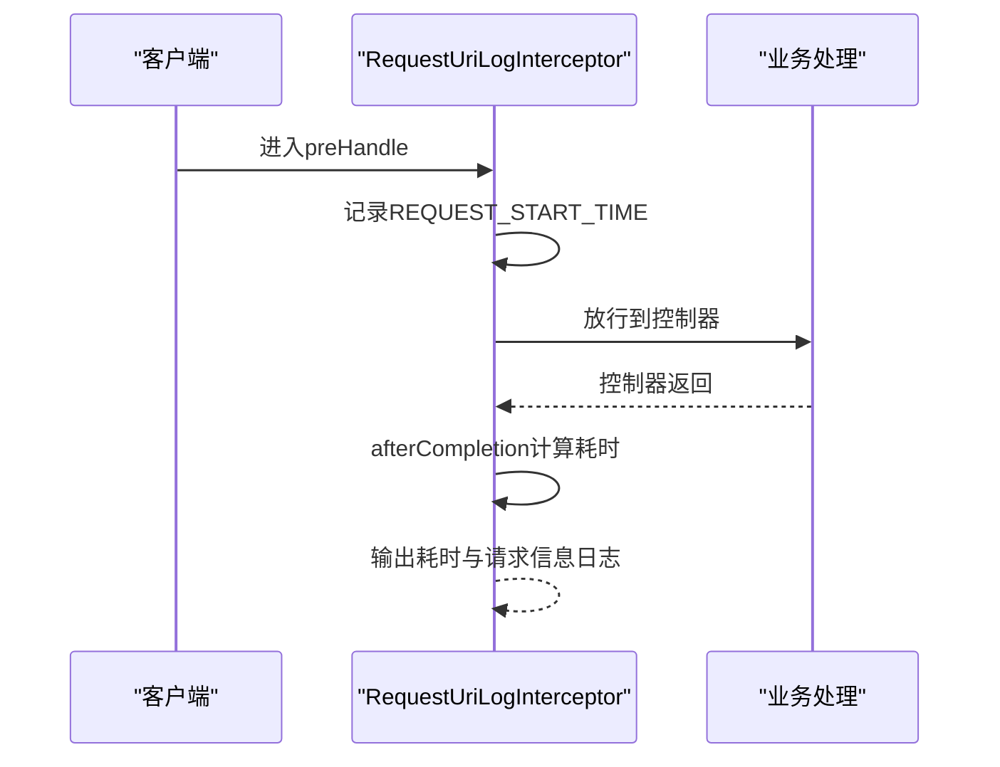
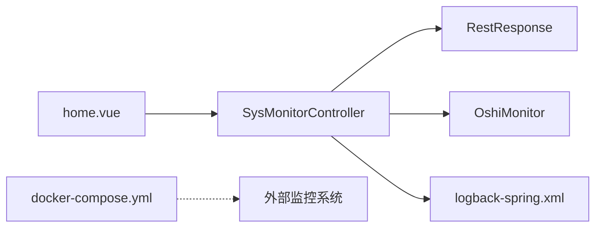

# 监控指标体系

<cite>
**本文引用的文件**   
- [SysMonitorController.java](file://platform-admin/src/main/java/com/platform/modules/sys/controller/SysMonitorController.java)
- [home.vue](file://platform-admin-ui/src/views/common/home.vue)
- [logback-spring.xml](file://platform-admin/src/main/resources/logback-spring.xml)
- [application.yml（平台管理）](file://platform-admin/src/main/resources/application.yml)
- [application.yml（平台API）](file://platform-api/src/main/resources/application.yml)
- [docker-compose.yml](file://docker-compose.yml)
- [RequestUriLogInterceptor.java](file://platform-admin/src/main/java/com/platform/config/RequestUriLogInterceptor.java)
- [RestResponse.java](file://platform-common/src/main/java/com/platform/common/utils/RestResponse.java)
- [HttpContextUtils.java](file://platform-common/src/main/java/com/platform/common/utils/HttpContextUtils.java)
- [DateUtils.java](file://platform-common/src/main/java/com/platform/common/utils/DateUtils.java)
</cite>

## 目录
1. [引言](#引言)
2. [项目结构](#项目结构)
3. [核心组件](#核心组件)
4. [架构总览](#架构总览)
5. [详细组件分析](#详细组件分析)
6. [依赖分析](#依赖分析)
7. [性能考虑](#性能考虑)
8. [故障排查指南](#故障排查指南)
9. [结论](#结论)
10. [附录](#附录)

## 引言
本文件面向运维与研发团队，系统化构建“监控指标体系”，覆盖关键性能指标（KPI）、告警设置、性能分析工具、监控架构、业务指标监控以及数据分析与趋势预测方法。结合仓库现有实现，重点围绕系统资源监控、应用日志与请求耗时、容器健康检查与配置参数等方面展开，帮助快速落地可观测性能力。

## 项目结构
- 后端服务
  - 平台管理服务（platform-admin）：提供系统监控接口与后台管理功能
  - 平台API服务（platform-api）：对外移动端与微信相关接口
- 前端界面（platform-admin-ui）：展示系统监控图表与资源使用情况
- 日志与配置：Logback配置按环境输出滚动日志；Spring Boot配置包含 Undertow 线程与缓冲参数
- 容器编排：docker-compose 提供 MySQL 与 Redis 的健康检查

**图示来源**
- [SysMonitorController.java:48-109](file://platform-admin/src/main/java/com/platform/modules/sys/controller/SysMonitorController.java#L48-L109)
- [home.vue:1-1148](file://platform-admin-ui/src/views/common/home.vue#L1-L1148)
- [logback-spring.xml:1-93](file://platform-admin/src/main/resources/logback-spring.xml#L1-L93)
- [application.yml（平台管理）:1-205](file://platform-admin/src/main/resources/application.yml#L1-L205)
- [application.yml（平台API）:1-195](file://platform-api/src/main/resources/application.yml#L1-L195)
- [docker-compose.yml:1-45](file://docker-compose.yml#L1-L45)

**章节来源**
- [application.yml（平台管理）:1-205](file://platform-admin/src/main/resources/application.yml#L1-L205)
- [application.yml（平台API）:1-195](file://platform-api/src/main/resources/application.yml#L1-L195)
- [logback-spring.xml:1-93](file://platform-admin/src/main/resources/logback-spring.xml#L1-L93)
- [docker-compose.yml:1-45](file://docker-compose.yml#L1-L45)

## 核心组件
- 系统监控控制器：提供系统、CPU、内存、磁盘、JVM、进程等指标聚合接口
- 前端监控面板：基于 ECharts 展示 CPU、内存、磁盘使用率与磁盘进度条
- 请求耗时拦截器：记录请求开始时间并在完成后输出耗时与请求信息
- 日志配置：按环境输出控制台与滚动文件日志，支持不同级别与保留策略
- 容器健康检查：MySQL/Redis 健康检查命令与重试策略
- 公共响应模型：统一返回结构，便于监控侧解析与告警

**章节来源**
- [SysMonitorController.java:48-109](file://platform-admin/src/main/java/com/platform/modules/sys/controller/SysMonitorController.java#L48-L109)
- [home.vue:1-1148](file://platform-admin-ui/src/views/common/home.vue#L1-L1148)
- [RequestUriLogInterceptor.java:21-43](file://platform-admin/src/main/java/com/platform/config/RequestUriLogInterceptor.java#L21-L43)
- [logback-spring.xml:1-93](file://platform-admin/src/main/resources/logback-spring.xml#L1-L93)
- [docker-compose.yml:1-45](file://docker-compose.yml#L1-L45)
- [RestResponse.java:40-96](file://platform-common/src/main/java/com/platform/common/utils/RestResponse.java#L40-L96)

## 架构总览
监控体系由“采集—存储—查询—可视化—告警”闭环构成。当前仓库实现了采集与可视化部分，建议后续补充统一指标存储与告警通道。

**图示来源**
- [SysMonitorController.java:56-109](file://platform-admin/src/main/java/com/platform/modules/sys/controller/SysMonitorController.java#L56-L109)
- [home.vue:1104-1139](file://platform-admin-ui/src/views/common/home.vue#L1104-L1139)
- [RestResponse.java:79-96](file://platform-common/src/main/java/com/platform/common/utils/RestResponse.java#L79-L96)

## 详细组件分析

### 系统监控控制器（SysMonitorController）
- 职责：聚合系统资源与JVM信息，返回统一响应
- 关键指标：
  - 系统信息：主机名、操作系统、IP、架构、逻辑/物理处理器核数、CPU型号
  - CPU：使用率、负载
  - 内存：总量、已用、可用、使用率
  - JVM：JDK名称/版本、最大/已用/可用内存、使用率、启动时间、安装路径
  - 磁盘：各分区总量/可用/使用率、整体使用率
  - 进程：前10高CPU占用进程（PID、名称、状态、线程数、虚拟/常驻内存、I/O、运行时长等）
- 访问控制：需要权限“sys:monitor:server”
- 输出：统一响应模型，便于前端解析与图表渲染

**图示来源**
- [SysMonitorController.java:48-109](file://platform-admin/src/main/java/com/platform/modules/sys/controller/SysMonitorController.java#L48-L109)
- [RestResponse.java:79-96](file://platform-common/src/main/java/com/platform/common/utils/RestResponse.java#L79-L96)

**章节来源**
- [SysMonitorController.java:48-109](file://platform-admin/src/main/java/com/platform/modules/sys/controller/SysMonitorController.java#L48-L109)

### 前端监控面板（home.vue）
- 功能：展示CPU/G内存/G磁盘仪表盘与磁盘使用进度条；展示系统与JVM信息；展示前10高CPU进程表
- 数据来源：SysMonitorController 返回的指标集合
- 图表：ECharts 仪表盘与进度条
- 交互：窗口自适应重绘

**图示来源**
- [home.vue:1-1148](file://platform-admin-ui/src/views/common/home.vue#L1-L1148)

**章节来源**
- [home.vue:1-1148](file://platform-admin-ui/src/views/common/home.vue#L1-L1148)

### 请求耗时拦截器（RequestUriLogInterceptor）
- 职责：在请求完成后计算耗时并记录请求信息
- 关键点：记录请求开始时间、结束时间，输出耗时与请求详情，便于定位慢请求

**图示来源**
- [RequestUriLogInterceptor.java:21-43](file://platform-admin/src/main/java/com/platform/config/RequestUriLogInterceptor.java#L21-L43)

**章节来源**
- [RequestUriLogInterceptor.java:21-43](file://platform-admin/src/main/java/com/platform/config/RequestUriLogInterceptor.java#L21-L43)

### 日志配置（logback-spring.xml）
- 环境区分：dev/test/prod 三档配置
- 输出：控制台与滚动文件（按日切割、保留天数、总大小上限）
- 级别：不同环境默认级别不同，便于生产降噪与问题定位

**章节来源**
- [logback-spring.xml:1-93](file://platform-admin/src/main/resources/logback-spring.xml#L1-L93)

### 容器健康检查（docker-compose.yml）
- MySQL：定时 ping 校验，失败重试次数与起始等待时间
- Redis：CLI ping 校验，失败重试次数与起始等待时间
- 作用：容器层面的健康保障，可作为外部监控系统的健康探针数据源

**章节来源**
- [docker-compose.yml:1-45](file://docker-compose.yml#L1-L45)

### 公共响应模型（RestResponse）
- 统一返回结构：success、code、msg、data、timestamp
- 用途：监控侧解析统一响应，便于统计成功率、错误码分布、平均响应时间等

**章节来源**
- [RestResponse.java:40-96](file://platform-common/src/main/java/com/platform/common/utils/RestResponse.java#L40-L96)

### 上下文工具（HttpContextUtils）
- 获取 HttpServletRequest、域名、来源头
- 用途：日志与监控埋点中提取上下文信息，辅助定位请求来源与上下文

**章节来源**
- [HttpContextUtils.java:31-47](file://platform-common/src/main/java/com/platform/common/utils/HttpContextUtils.java#L31-L47)

### 日期工具（DateUtils）
- 提供时间格式化、字符串转时间、周/月起止时间、当前秒级时间戳等
- 用途：监控时间维度聚合、报表时间范围计算、日志时间解析

**章节来源**
- [DateUtils.java:40-413](file://platform-common/src/main/java/com/platform/common/utils/DateUtils.java#L40-L413)

## 依赖分析
- 控制器依赖 OshiMonitor 进行系统资源采集
- 前端依赖后端统一响应结构与指标字段
- 日志配置与环境变量耦合，决定日志输出与保留策略
- docker-compose 健康检查与外部监控系统可联动

**图示来源**
- [SysMonitorController.java:48-109](file://platform-admin/src/main/java/com/platform/modules/sys/controller/SysMonitorController.java#L48-L109)
- [home.vue:1-1148](file://platform-admin-ui/src/views/common/home.vue#L1-L1148)
- [logback-spring.xml:1-93](file://platform-admin/src/main/resources/logback-spring.xml#L1-L93)
- [docker-compose.yml:1-45](file://docker-compose.yml#L1-L45)

**章节来源**
- [SysMonitorController.java:48-109](file://platform-admin/src/main/java/com/platform/modules/sys/controller/SysMonitorController.java#L48-L109)
- [home.vue:1-1148](file://platform-admin-ui/src/views/common/home.vue#L1-L1148)
- [logback-spring.xml:1-93](file://platform-admin/src/main/resources/logback-spring.xml#L1-L93)
- [docker-compose.yml:1-45](file://docker-compose.yml#L1-L45)

## 性能考虑
- 线程与缓冲：Undertow IO线程与工作线程数量、缓冲区大小直接影响并发与延迟
- 日志滚动：按日切割与总大小上限，避免单文件过大影响IO
- 健康检查：容器健康检查间隔与超时需与监控频率匹配，避免误报
- 前端图表：窗口自适应重绘，避免频繁刷新造成抖动

**章节来源**
- [application.yml（平台管理）:4-18](file://platform-admin/src/main/resources/application.yml#L4-L18)
- [application.yml（平台API）:4-18](file://platform-api/src/main/resources/application.yml#L4-L18)
- [logback-spring.xml:37-80](file://platform-admin/src/main/resources/logback-spring.xml#L37-L80)
- [home.vue:1136-1139](file://platform-admin-ui/src/views/common/home.vue#L1136-L1139)
- [docker-compose.yml:19-26](file://docker-compose.yml#L19-L26)

## 故障排查指南
- 快速定位慢请求
  - 使用请求耗时拦截器输出的耗时与请求信息，结合日志级别定位瓶颈
- 容器不可用
  - 查看 docker-compose 健康检查失败次数与间隔，确认 MySQL/Redis 是否存活
- 日志问题
  - 检查 logback 环境配置与滚动策略，确认日志目录权限与磁盘空间
- 监控数据异常
  - 核对 SysMonitorController 返回字段与 home.vue 渲染逻辑，确保指标字段一致

**章节来源**
- [RequestUriLogInterceptor.java:21-43](file://platform-admin/src/main/java/com/platform/config/RequestUriLogInterceptor.java#L21-L43)
- [docker-compose.yml:19-26](file://docker-compose.yml#L19-L26)
- [logback-spring.xml:37-80](file://platform-admin/src/main/resources/logback-spring.xml#L37-L80)
- [SysMonitorController.java:56-109](file://platform-admin/src/main/java/com/platform/modules/sys/controller/SysMonitorController.java#L56-L109)
- [home.vue:1-1148](file://platform-admin-ui/src/views/common/home.vue#L1-L1148)

## 结论
本仓库已具备基础的系统资源监控与前端可视化能力，配合日志与容器健康检查，可满足日常运维观测需求。建议后续引入统一指标存储与告警平台，完善 KPI 定义与阈值策略，形成闭环的可观测体系。

## 附录

### 关键性能指标（KPI）定义与采集建议
- 响应时间
  - 指标：P50/P90/P99 延迟、平均延迟
  - 采集：请求耗时拦截器输出 + API 统一响应时间戳
- 吞吐量
  - 指标：QPS、每分钟请求数
  - 采集：基于访问日志与统一响应统计
- 错误率
  - 指标：HTTP 5xx/业务错误码占比
  - 采集：统一响应 code 与日志 ERROR 级别
- 资源利用率
  - 指标：CPU 使用率、内存使用率、磁盘使用率、I/O 等
  - 采集：SysMonitorController 指标 + 容器健康检查状态
- 业务健康度
  - 指标：订单成功率、支付成功率、登录成功率、UV/DAU
  - 采集：业务埋点 + 日志分析

**章节来源**
- [RequestUriLogInterceptor.java:21-43](file://platform-admin/src/main/java/com/platform/config/RequestUriLogInterceptor.java#L21-L43)
- [RestResponse.java:40-96](file://platform-common/src/main/java/com/platform/common/utils/RestResponse.java#L40-L96)
- [SysMonitorController.java:56-109](file://platform-admin/src/main/java/com/platform/modules/sys/controller/SysMonitorController.java#L56-L109)
- [logback-spring.xml:1-93](file://platform-admin/src/main/resources/logback-spring.xml#L1-L93)

### 告警设置建议
- 阈值配置
  - CPU 使用率 > 80% 持续 3 分钟
  - 内存使用率 > 85%
  - 磁盘使用率 > 90%
  - QPS 下降 > 30% 或错误率 > 5%
- 告警级别
  - 严重：服务不可用/核心链路异常
  - 警告：资源接近阈值/偶发异常
- 通知渠道
  - 邮件、IM、电话（分级触发）

[本节为通用实践建议，无需特定文件引用]

### 性能分析工具与流程
- APM 工具：接入链路追踪（Trace ID）与事务指标
- 日志分析：按环境输出滚动日志，结合关键字检索与聚合分析
- 性能剖析：热点函数与慢请求定位，结合请求耗时拦截器输出

**章节来源**
- [logback-spring.xml:1-93](file://platform-admin/src/main/resources/logback-spring.xml#L1-L93)
- [RequestUriLogInterceptor.java:21-43](file://platform-admin/src/main/java/com/platform/config/RequestUriLogInterceptor.java#L21-L43)

### 监控数据采集、存储与可视化
- 采集：系统指标（SysMonitorController）、容器健康（docker-compose）、日志（logback）
- 存储：建议引入时序数据库或指标存储（如 InfluxDB、Prometheus）
- 可视化：前端 ECharts 仪表盘与表格，建议扩展为统一监控看板

**章节来源**
- [SysMonitorController.java:56-109](file://platform-admin/src/main/java/com/platform/modules/sys/controller/SysMonitorController.java#L56-L109)
- [home.vue:1-1148](file://platform-admin-ui/src/views/common/home.vue#L1-L1148)
- [docker-compose.yml:1-45](file://docker-compose.yml#L1-L45)
- [logback-spring.xml:1-93](file://platform-admin/src/main/resources/logback-spring.xml#L1-L93)

### 业务指标监控与趋势预测
- 用户行为分析：登录、下单、支付、浏览等事件埋点
- 转化率监控：漏斗指标与异常波动检测
- 趋势预测：基于历史数据的时间序列模型（如 ARIMA/Prophet），结合告警阈值动态调整

[本节为通用实践建议，无需特定文件引用]