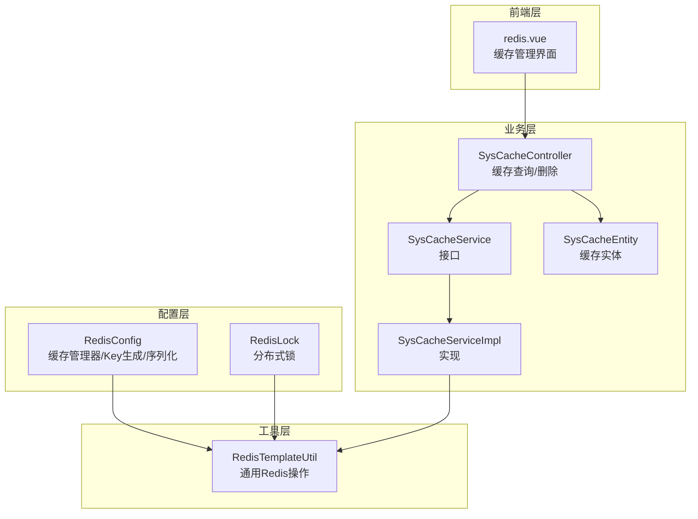
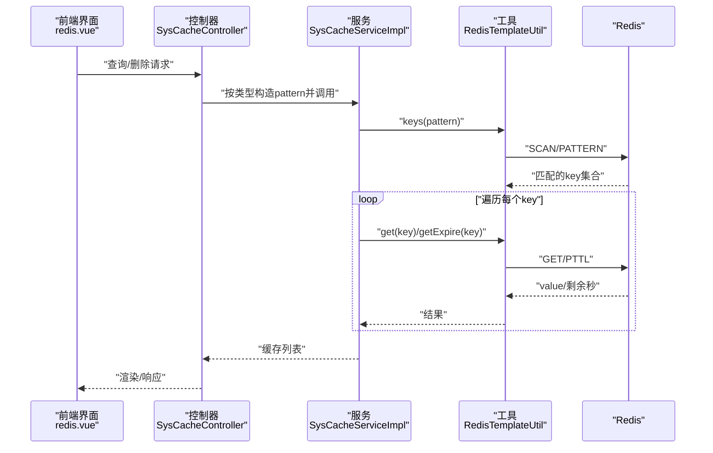
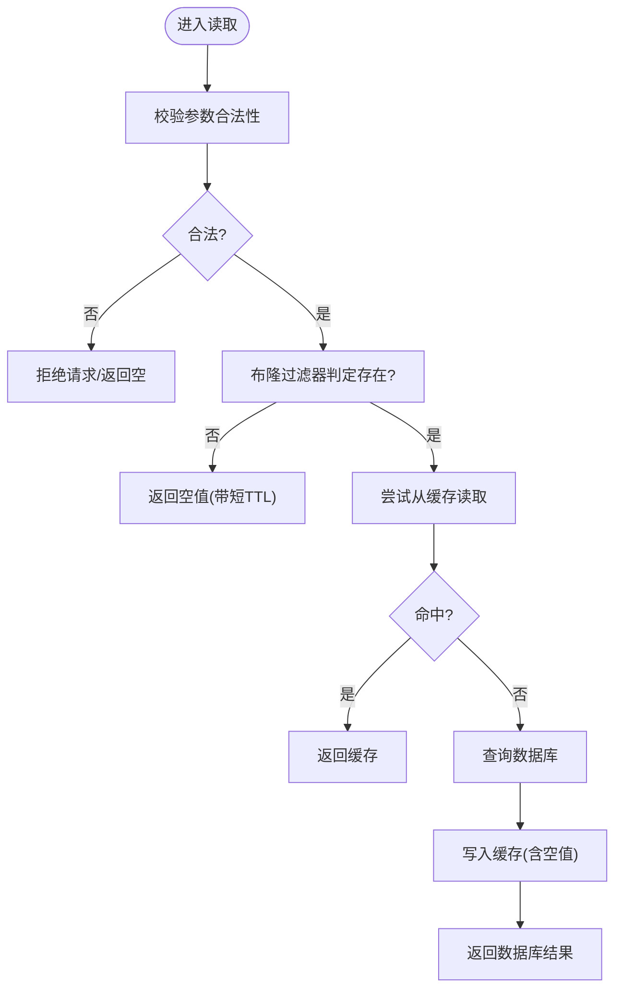
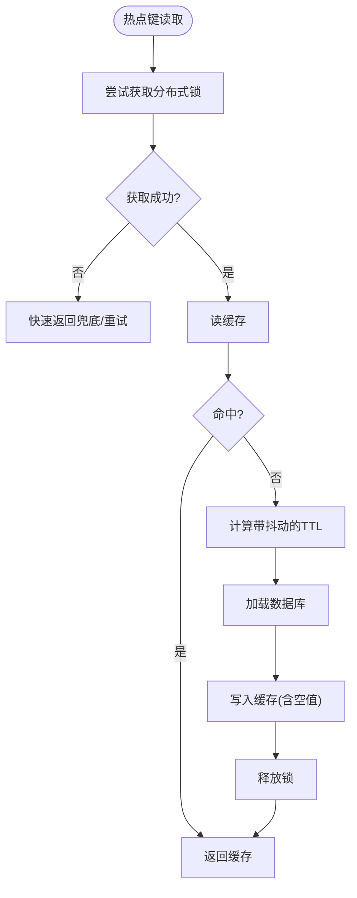
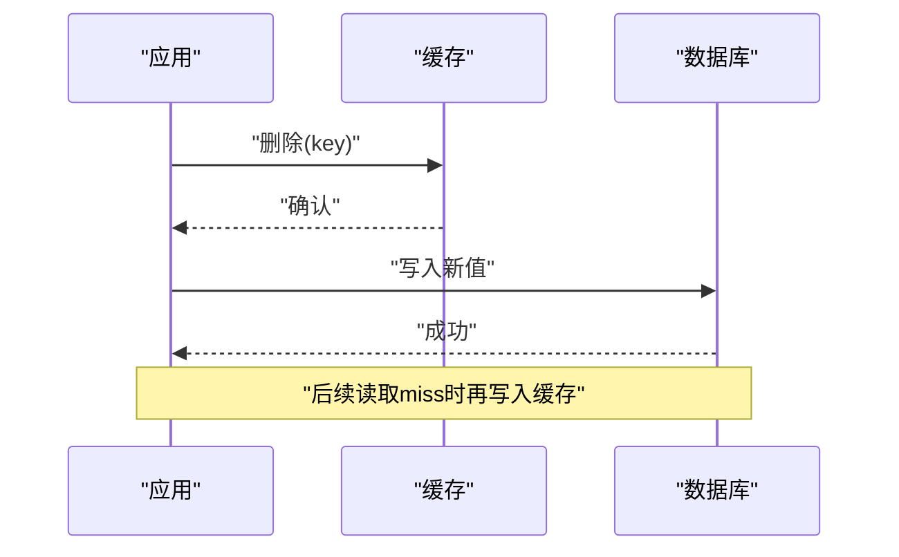
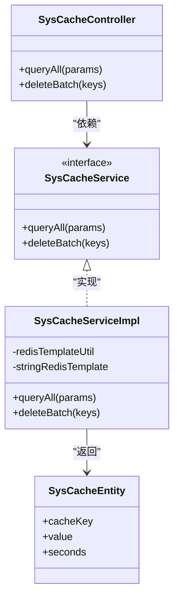
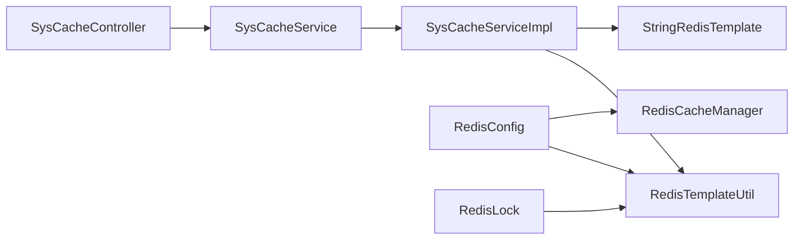

# 缓存策略优化

<cite>
**本文档引用的文件**
- [RedisConfig.java](file://platform-common/src/main/java/com/platform/config/RedisConfig.java)
- [RedisTemplateUtil.java](file://platform-common/src/main/java/com/platform/config/RedisTemplateUtil.java)
- [RedisLock.java](file://platform-common/src/main/java/com/platform/config/RedisLock.java)
- [SysCacheController.java](file://platform-admin/src/main/java/com/platform/modules/sys/controller/SysCacheController.java)
- [SysCacheService.java](file://platform-admin/src/main/java/com/platform/modules/sys/service/SysCacheService.java)
- [SysCacheServiceImpl.java](file://platform-admin/src/main/java/com/platform/modules/sys/service/impl/SysCacheServiceImpl.java)
- [SysCacheEntity.java](file://platform-admin/src/main/java/com/platform/modules/sys/entity/SysCacheEntity.java)
- [Constant.java](file://platform-common/src/main/java/com/platform/common/utils/Constant.java)
- [application.yml](file://platform-admin/src/main/resources/application.yml)
- [application-dev.yml](file://platform-admin/src/main/resources/application-dev.yml)
- [application-prod.yml](file://platform-admin/src/main/resources/application-prod.yml)
- [application-docker.yml](file://platform-admin/src/main/resources/application-docker.yml)
- [redis.vue](file://platform-admin-ui/src/views/modules/sys/redis.vue)
</cite>

## 目录
1. [简介](#简介)
2. [项目结构](#项目结构)
3. [核心组件](#核心组件)
4. [架构总览](#架构总览)
5. [详细组件分析](#详细组件分析)
6. [依赖关系分析](#依赖关系分析)
7. [性能考量](#性能考量)
8. [故障排查指南](#故障排查指南)
9. [结论](#结论)
10. [附录](#附录)

## 简介
本文件围绕平台项目的Redis缓存策略进行系统性梳理与优化建议，覆盖缓存架构设计、层次结构、数据分布与命名规范，以及穿透防护、雪崩预防、一致性保障、性能调优与监控排障等方面。通过对现有代码的逐层解析，形成可落地的工程实践指导。

## 项目结构
平台在多模块中引入Redis能力：
- 配置层：集中定义Redis连接、序列化、缓存管理器与Key生成策略
- 工具层：封装通用Redis操作，统一对外接口
- 业务层：提供系统缓存管理的控制器与服务，支持按前缀检索与批量删除
- 前端层：提供可视化界面用于查看与清理缓存

**图表来源**
- [RedisConfig.java:56-182](file://platform-common/src/main/java/com/platform/config/RedisConfig.java#L56-L182)
- [RedisTemplateUtil.java:42-683](file://platform-common/src/main/java/com/platform/config/RedisTemplateUtil.java#L42-L683)
- [RedisLock.java:35-82](file://platform-common/src/main/java/com/platform/config/RedisLock.java#L35-L82)
- [SysCacheController.java:40-91](file://platform-admin/src/main/java/com/platform/modules/sys/controller/SysCacheController.java#L40-L91)
- [SysCacheService.java:31-48](file://platform-admin/src/main/java/com/platform/modules/sys/service/SysCacheService.java#L31-L48)
- [SysCacheServiceImpl.java:40-76](file://platform-admin/src/main/java/com/platform/modules/sys/service/impl/SysCacheServiceImpl.java#L40-L76)
- [SysCacheEntity.java:30-46](file://platform-admin/src/main/java/com/platform/modules/sys/entity/SysCacheEntity.java#L30-L46)
- [redis.vue:1-78](file://platform-admin-ui/src/views/modules/sys/redis.vue#L1-L78)

**章节来源**
- [RedisConfig.java:56-182](file://platform-common/src/main/java/com/platform/config/RedisConfig.java#L56-L182)
- [RedisTemplateUtil.java:42-683](file://platform-common/src/main/java/com/platform/config/RedisTemplateUtil.java#L42-L683)
- [SysCacheController.java:40-91](file://platform-admin/src/main/java/com/platform/modules/sys/controller/SysCacheController.java#L40-L91)
- [redis.vue:1-78](file://platform-admin-ui/src/views/modules/sys/redis.vue#L1-L78)

## 核心组件
- Redis配置与缓存管理
  - 缓存管理器采用RedisCacheManager，全局默认TTL为6小时，键值序列化策略明确
  - Key生成器基于目标类名、方法名与参数数组组合，便于定位与调试
- Redis工具类
  - 提供String/Hash/Set/List等多数据结构操作，包含过期、存在性判断、模糊查询、消息通道等
  - 支持BoundListOperations提升链表操作效率
- 分布式锁
  - 基于setIfAbsent与过期时间检查实现简易分布式锁，具备过期续租思路
- 系统缓存管理
  - 控制器根据类型参数选择不同前缀匹配规则，支持查询与批量删除
  - 服务层结合RedisTemplateUtil与StringRedisTemplate处理序列化差异

**章节来源**
- [RedisConfig.java:94-112](file://platform-common/src/main/java/com/platform/config/RedisConfig.java#L94-L112)
- [RedisTemplateUtil.java:44-104](file://platform-common/src/main/java/com/platform/config/RedisTemplateUtil.java#L44-L104)
- [RedisLock.java:46-79](file://platform-common/src/main/java/com/platform/config/RedisLock.java#L46-L79)
- [SysCacheController.java:56-74](file://platform-admin/src/main/java/com/platform/modules/sys/controller/SysCacheController.java#L56-L74)
- [SysCacheServiceImpl.java:44-76](file://platform-admin/src/main/java/com/platform/modules/sys/service/impl/SysCacheServiceImpl.java#L44-L76)

## 架构总览
下图展示缓存从请求到落盘的关键路径与关键决策点，体现“读路径”“写路径”“一致性”“降级”等要点。

**图表来源**
- [SysCacheController.java:56-74](file://platform-admin/src/main/java/com/platform/modules/sys/controller/SysCacheController.java#L56-L74)
- [SysCacheServiceImpl.java:44-67](file://platform-admin/src/main/java/com/platform/modules/sys/service/impl/SysCacheServiceImpl.java#L44-L67)
- [RedisTemplateUtil.java:613-615](file://platform-common/src/main/java/com/platform/config/RedisTemplateUtil.java#L613-L615)

## 详细组件分析

### 缓存层次结构与数据分布
- 层次划分
  - 系统缓存：以固定前缀标识系统级配置与元数据
  - 业务缓存：以业务前缀标识业务数据
  - Session缓存：以注解缓存前缀标识Spring Cache生成的键
- 数据分布策略
  - 通过前缀区分作用域，避免键冲突
  - 使用统一Key生成器，确保跨模块一致的键格式
- 键命名规范
  - 建议采用“模块:业务域:主键”的层级命名，配合前缀统一管理
  - 对热点键增加维度后缀或分片后缀，降低单实例压力

**章节来源**
- [Constant.java:64-75](file://platform-common/src/main/java/com/platform/common/utils/Constant.java#L64-L75)
- [RedisConfig.java:105-112](file://platform-common/src/main/java/com/platform/config/RedisConfig.java#L105-L112)
- [SysCacheController.java:57-70](file://platform-admin/src/main/java/com/platform/modules/sys/controller/SysCacheController.java#L57-L70)

### 缓存穿透防护
- 现状分析
  - 代码未见布隆过滤器实现
  - 读取流程对序列化异常做了回退处理，但未对“空值”进行显式缓存
- 建议方案
  - 引入布隆过滤器：在读取前先判定可能不存在，避免无效查询
  - 参数校验：对非法/边界参数直接拒绝，减少无效命中
  - 空值缓存：对查询结果为空的键设置短TTL，防止缓存击穿

[此图为概念性流程，无需图表来源]

### 缓存雪崩预防
- 现状分析
  - 默认TTL较长（6小时），未见过期时间随机化策略
  - 未见分布式锁用于热点键的互斥加载
  - 未见降级策略（如熔断/限流/旁路）
- 建议方案
  - 过期时间随机化：在基准TTL基础上加入抖动区间
  - 分布式锁：热点键加载时加锁，避免并发击穿
  - 降级策略：对不可用场景返回兜底数据或提示

[此图为概念性流程，无需图表来源]

### 缓存一致性保障
- 现状分析
  - 未见显式的Cache Aside模式实现
  - 未见读写锁或版本控制
- 建议方案
  - Cache Aside模式：更新先删缓存再写库，读取时miss再写入
  - 读写锁：热点键读写分离，写路径串行化
  - 最终一致性：异步刷新/延迟双删，确保短暂窗口内的一致性

[此图为概念性流程，无需图表来源]

### 缓存性能调优
- 内存配置
  - 依据业务峰值QPS与平均对象大小估算内存需求，预留10%-30%冗余
- 淘汰策略
  - 生产环境建议LRU/LFU，结合TTL与内存阈值联动
- 热点处理
  - 对热点键进行分片或副本，配合本地缓存（如Caffeine）降低远端压力
- 连接池
  - 根据并发与RTT调整最大连接数、空闲连接与等待时间

**章节来源**
- [application.yml:81-98](file://platform-admin/src/main/resources/application.yml#L81-L98)
- [application-dev.yml:1-22](file://platform-admin/src/main/resources/application-dev.yml#L1-L22)
- [application-prod.yml:1-26](file://platform-admin/src/main/resources/application-prod.yml#L1-L26)
- [application-docker.yml:17-20](file://platform-admin/src/main/resources/application-docker.yml#L17-L20)

### 监控指标与故障排查
- 监控指标
  - 命中率、请求延迟、内存使用率、连接池利用率、过期与驱逐次数
  - 热点键命中分布、慢查询统计
- 故障排查
  - 使用系统缓存管理界面按前缀筛选与删除，验证键空间与TTL
  - 检查序列化异常导致的读取失败，必要时切换StringRedisTemplate读取
  - 核对Key生成器输出，确保键唯一性与可读性

**图表来源**
- [SysCacheController.java:40-91](file://platform-admin/src/main/java/com/platform/modules/sys/controller/SysCacheController.java#L40-L91)
- [SysCacheService.java:31-48](file://platform-admin/src/main/java/com/platform/modules/sys/service/SysCacheService.java#L31-L48)
- [SysCacheServiceImpl.java:40-76](file://platform-admin/src/main/java/com/platform/modules/sys/service/impl/SysCacheServiceImpl.java#L40-L76)
- [SysCacheEntity.java:30-46](file://platform-admin/src/main/java/com/platform/modules/sys/entity/SysCacheEntity.java#L30-L46)

**章节来源**
- [SysCacheController.java:56-90](file://platform-admin/src/main/java/com/platform/modules/sys/controller/SysCacheController.java#L56-L90)
- [SysCacheServiceImpl.java:44-76](file://platform-admin/src/main/java/com/platform/modules/sys/service/impl/SysCacheServiceImpl.java#L44-L76)
- [redis.vue:1-78](file://platform-admin-ui/src/views/modules/sys/redis.vue#L1-L78)

## 依赖关系分析
- 组件耦合
  - SysCacheController依赖SysCacheService接口，实现松耦合
  - SysCacheServiceImpl依赖RedisTemplateUtil与StringRedisTemplate，承担具体逻辑
- 外部依赖
  - Redis连接工厂、Jedis连接池、Jackson序列化器
- 潜在风险
  - 序列化异常分支需统一处理，避免脏数据
  - 分布式锁需完善“死锁”与“续租”机制

**图表来源**
- [SysCacheController.java:40-91](file://platform-admin/src/main/java/com/platform/modules/sys/controller/SysCacheController.java#L40-L91)
- [SysCacheServiceImpl.java:40-42](file://platform-admin/src/main/java/com/platform/modules/sys/service/impl/SysCacheServiceImpl.java#L40-L42)
- [RedisTemplateUtil.java:42-44](file://platform-common/src/main/java/com/platform/config/RedisTemplateUtil.java#L42-L44)
- [RedisConfig.java:94-100](file://platform-common/src/main/java/com/platform/config/RedisConfig.java#L94-L100)
- [RedisLock.java:35-37](file://platform-common/src/main/java/com/platform/config/RedisLock.java#L35-L37)

**章节来源**
- [RedisConfig.java:94-182](file://platform-common/src/main/java/com/platform/config/RedisConfig.java#L94-L182)
- [RedisTemplateUtil.java:42-683](file://platform-common/src/main/java/com/platform/config/RedisTemplateUtil.java#L42-L683)
- [RedisLock.java:35-82](file://platform-common/src/main/java/com/platform/config/RedisLock.java#L35-L82)
- [SysCacheServiceImpl.java:40-42](file://platform-admin/src/main/java/com/platform/modules/sys/service/impl/SysCacheServiceImpl.java#L40-L42)

## 性能考量
- 连接与序列化
  - 使用连接池与合理的超时配置，避免阻塞
  - 统一序列化策略，避免跨组件不兼容
- 扫描与遍历
  - keys命令在大数据集上代价高，建议使用SCAN或按前缀精确匹配
- TTL与过期
  - 对热点键设置更短TTL并开启随机抖动，降低同时过期风险
- 读写路径
  - 写路径优先删除缓存，读路径miss时再写入，减少脏读

[本节为通用指导，无需章节来源]

## 故障排查指南
- 常见问题
  - 键无法匹配：核对前缀与通配符使用
  - 读取为空：检查序列化异常分支与StringRedisTemplate回退
  - 删除无效：确认Key是否正确、权限是否足够
- 排查步骤
  - 通过系统缓存管理界面按类型筛选
  - 查看剩余过期时间，确认TTL是否合理
  - 检查分布式锁是否正确释放，避免死锁

**章节来源**
- [SysCacheController.java:56-90](file://platform-admin/src/main/java/com/platform/modules/sys/controller/SysCacheController.java#L56-L90)
- [SysCacheServiceImpl.java:44-76](file://platform-admin/src/main/java/com/platform/modules/sys/service/impl/SysCacheServiceImpl.java#L44-L76)
- [redis.vue:1-78](file://platform-admin-ui/src/views/modules/sys/redis.vue#L1-L78)

## 结论
本项目已具备基础的Redis集成与统一工具封装，建议在此基础上补充布隆过滤器、分布式锁与降级策略，完善缓存穿透与雪崩的防护；同时优化键命名与TTL策略，强化一致性与可观测性，以满足生产环境的稳定性与性能要求。

## 附录
- 配置参考
  - Redis连接与池参数：参考各环境配置文件中的spring.redis段
  - 缓存默认TTL：参考缓存管理器配置

**章节来源**
- [application.yml:81-98](file://platform-admin/src/main/resources/application.yml#L81-L98)
- [application-dev.yml:1-22](file://platform-admin/src/main/resources/application-dev.yml#L1-L22)
- [application-prod.yml:1-26](file://platform-admin/src/main/resources/application-prod.yml#L1-L26)
- [application-docker.yml:17-20](file://platform-admin/src/main/resources/application-docker.yml#L17-L20)
- [RedisConfig.java:94-100](file://platform-common/src/main/java/com/platform/config/RedisConfig.java#L94-L100)