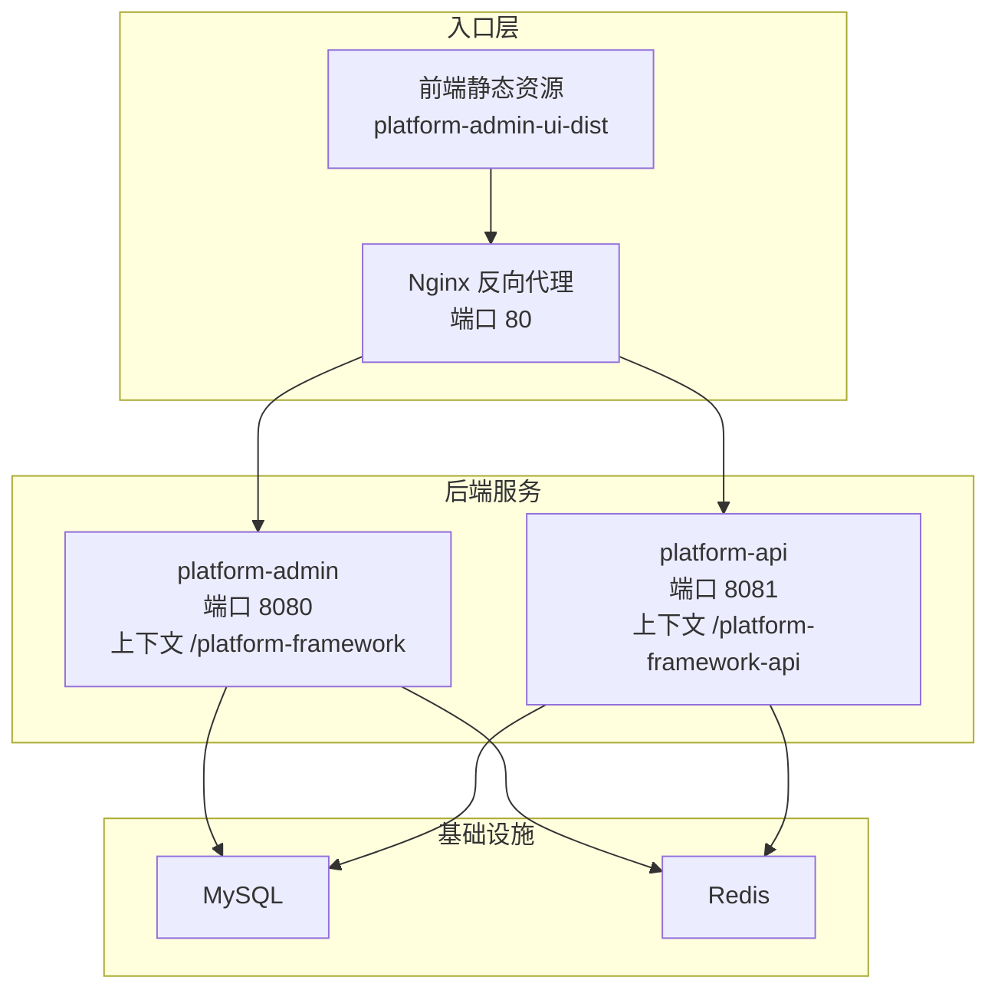
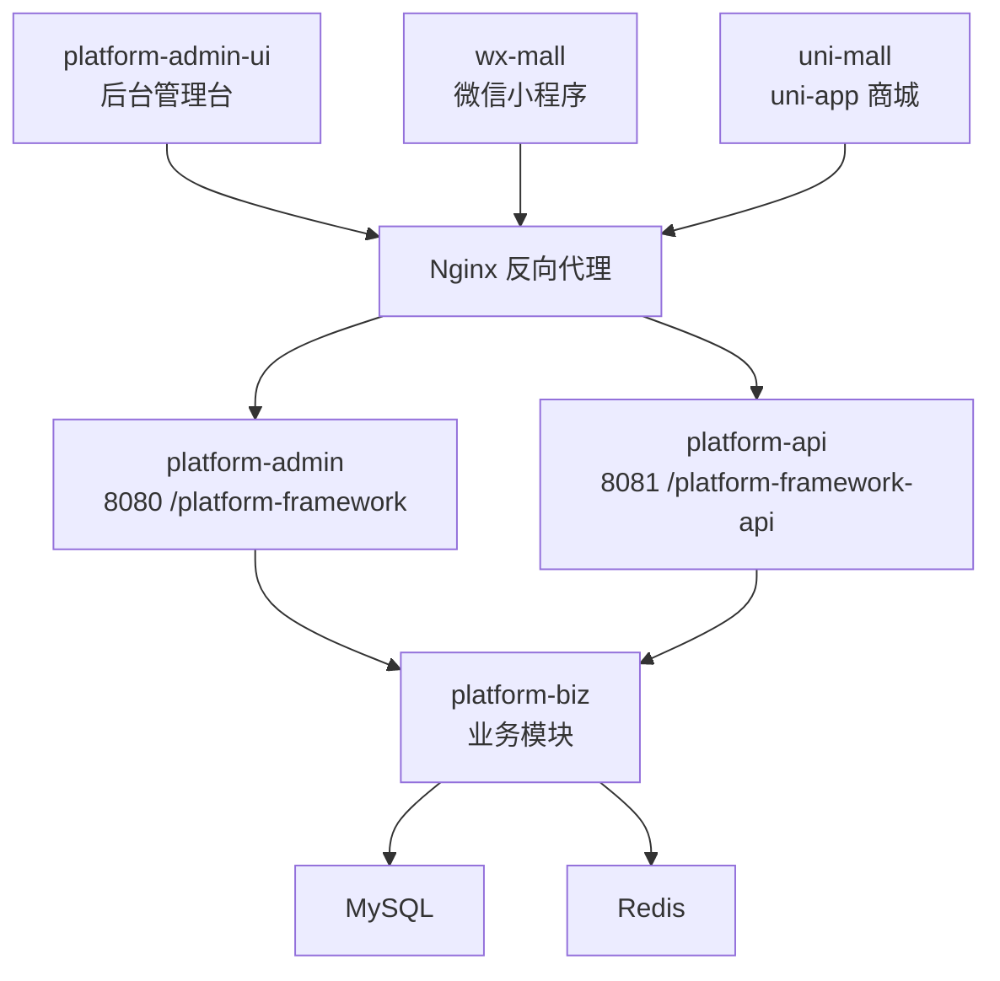
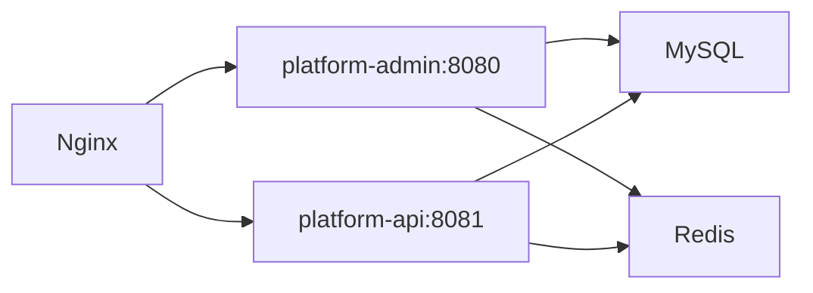
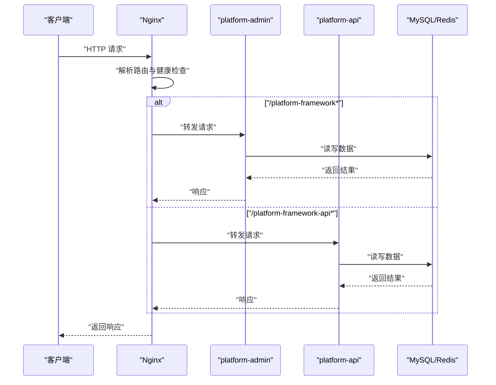

# 负载均衡优化

<cite>
**本文引用的文件**
- [default.conf](file://deploy/nginx/default.conf)
- [docker-compose.yml](file://docker-compose.yml)
- [application.yml（平台管理服务）](file://platform-admin/src/main/resources/application.yml)
- [application.yml（平台API服务）](file://platform-api/src/main/resources/application.yml)
- [系统架构说明.md](file://docs/系统架构说明.md)
- [README.md（部署说明）](file://deploy/README.md)
- [home.vue（前端监控视图）](file://platform-admin-ui/src/views/common/home.vue)
- [logback-spring.xml（平台管理服务日志）](file://platform-admin/src/main/resources/logback-spring.xml)
- [FilterConfig.java（Shiro过滤器配置）](file://platform-admin/src/main/java/com/platform/config/FilterConfig.java)
</cite>

## 目录
1. [简介](#简介)
2. [项目结构](#项目结构)
3. [核心组件](#核心组件)
4. [架构总览](#架构总览)
5. [详细组件分析](#详细组件分析)
6. [依赖分析](#依赖分析)
7. [性能考量](#性能考量)
8. [故障排查指南](#故障排查指南)
9. [结论](#结论)
10. [附录](#附录)

## 简介
本指南围绕本项目的负载均衡优化展开，结合现有的 Nginx 反向代理、Docker Compose 编排、后端服务 Undertow 线程模型、以及前端静态资源托管，系统性讲解：
- Nginx 反向代理与健康检查配置
- 服务发现与路由转发
- 流量治理（限流、熔断、降级）现状与落地建议
- 微服务架构下的负载均衡（客户端与服务器端）
- CDN 加速与静态资源优化
- 监控与故障排查方法

## 项目结构
项目采用前后端分离与双后端服务入口的架构，Nginx 作为统一入口反向代理至两个后端服务，并托管前端静态资源。Docker Compose 负责编排与健康检查。

图表来源
- [docker-compose.yml:103-115](file://docker-compose.yml#L103-L115)
- [default.conf:1-26](file://deploy/nginx/default.conf#L1-L26)
- [application.yml（平台管理服务）:4-21](file://platform-admin/src/main/resources/application.yml#L4-L21)
- [application.yml（平台API服务）:4-21](file://platform-api/src/main/resources/application.yml#L4-L21)

章节来源
- [docker-compose.yml:1-115](file://docker-compose.yml#L1-L115)
- [default.conf:1-26](file://deploy/nginx/default.conf#L1-L26)
- [application.yml（平台管理服务）:4-21](file://platform-admin/src/main/resources/application.yml#L4-L21)
- [application.yml（平台API服务）:4-21](file://platform-api/src/main/resources/application.yml#L4-L21)

## 核心组件
- Nginx 反向代理：负责静态资源托管与后端服务路由转发，当前未配置负载均衡算法与健康检查（见下一节）。
- 平台管理服务（platform-admin）：监听 8080 端口，上下文为 /platform-framework。
- 平台 API 服务（platform-api）：监听 8081 端口，上下文为 /platform-framework-api。
- Docker Compose：编排服务、定义健康检查、端口映射与依赖关系。
- 前端静态资源：由 Nginx 托管，减少后端压力。

章节来源
- [default.conf:1-26](file://deploy/nginx/default.conf#L1-L26)
- [application.yml（平台管理服务）:4-21](file://platform-admin/src/main/resources/application.yml#L4-L21)
- [application.yml（平台API服务）:4-21](file://platform-api/src/main/resources/application.yml#L4-L21)
- [docker-compose.yml:103-115](file://docker-compose.yml#L103-L115)

## 架构总览
系统采用“多前端入口 + 双后端服务入口 + 共享业务模块”的形态，Nginx 作为统一入口，将请求分发至对应的后端服务。后端服务共享业务模块与基础设施，实现高内聚低耦合。

图表来源
- [系统架构说明.md:26-79](file://docs/系统架构说明.md#L26-L79)

章节来源
- [系统架构说明.md:1-231](file://docs/系统架构说明.md#L1-L231)

## 详细组件分析

### Nginx 反向代理与负载均衡优化
- 当前配置要点
  - 静态资源托管：根目录指向前端构建产物，首页回退到 index.html。
  - 路由转发：将 /platform-framework/ 转发至 platform-admin:8080/platform-framework/，将 /platform-framework-api/ 转发至 platform-api:8081/platform-framework-api/。
  - 请求头透传：Host、X-Real-IP、X-Forwarded-For、X-Forwarded-Proto。
- 优化建议
  - 负载均衡算法：在 upstream 中定义多个后端实例，选择轮询、最少连接或 IP 哈希等策略，提升稳定性与公平性。
  - 健康检查：结合 Docker Compose 的 healthcheck 或 Nginx upstream 的健康检查指令，剔除不健康实例。
  - 超时与重试：合理设置 proxy_connect_timeout、proxy_send_timeout、proxy_read_timeout，以及失败重试次数与超时阈值。
  - 缓存与压缩：对静态资源启用 gzip/deflate，设置合理的缓存头；对动态接口可引入缓存策略降低后端压力。
  - 安全加固：限制来源 IP、开启 WAF 规则、校验来源与 Host 头，防止滥用与 SSRF。
  - 日志与指标：开启访问日志与错误日志，采集 Nginx 指标（QPS、延迟、错误率）用于监控告警。

章节来源
- [default.conf:1-26](file://deploy/nginx/default.conf#L1-L26)

### 服务发现与路由转发
- 服务发现
  - Docker Compose 通过服务名（如 platform-admin、platform-api）实现容器间 DNS 解析，无需额外注册中心。
  - 若扩展为多实例或外部服务，建议引入 Consul、Nacos 或 Kubernetes Service Mesh 实现服务注册与发现。
- 路由与故障转移
  - 在 Nginx 中为每个后端服务配置多个 upstream 实例，结合健康检查与 fail_timeout/max_fails 实现自动故障转移。
  - 对于跨区域部署，可按地域划分 upstream，结合权重实现灰度发布与流量切分。

章节来源
- [docker-compose.yml:103-115](file://docker-compose.yml#L103-L115)

### 流量治理（限流、熔断、降级）
- 现状
  - 代码库未发现内置的限流、熔断或降级实现。
- 建议方案
  - 限流：在 Nginx 层使用 limit_req_zone/limit_req 或在后端使用 Spring Cloud Gateway + Resilience4j 的限流策略。
  - 熔断：在网关层或服务间调用使用 Resilience4j CircuitBreaker，当错误率超过阈值时快速失败并返回降级响应。
  - 降级：针对热点接口或下游不稳定服务，返回静态兜底内容或简化版数据，保障核心功能可用。
  - 配置中心：将限流阈值、熔断窗口、降级策略集中管理，支持热更新与灰度控制。

章节来源
- [application.yml（平台管理服务）:69-105](file://platform-admin/src/main/resources/application.yml#L69-L105)
- [application.yml（平台API服务）:58-95](file://platform-api/src/main/resources/application.yml#L58-L95)

### 微服务架构下的负载均衡
- 客户端负载均衡
  - 使用 Ribbon 或 Spring Cloud LoadBalancer，在客户端发起请求前选择可用实例，降低网关压力。
- 服务器端负载均衡
  - 使用 Nginx、Envoy 或 Kong 在入口层统一调度，便于统一治理与可观测性。
- 混合策略
  - 对内部服务优先使用客户端负载均衡，对外暴露统一入口使用服务器端负载均衡，实现内外协同。

章节来源
- [系统架构说明.md:221-229](file://docs/系统架构说明.md#L221-L229)

### CDN 加速与静态资源优化
- 静态资源缓存
  - 对前端构建产物启用强缓存策略（如 ETag/Last-Modified），版本化文件名，缩短缓存命中率。
- 边缘节点优化
  - 使用 CDN 将静态资源分发至全球边缘节点，缩短首包延迟与抖动。
- 全球加速策略
  - 基于地理位置与网络质量选择最优节点；对图片、视频等大体积资源启用压缩与自适应分辨率。
- 与 Nginx 协作
  - Nginx 作为源站与 CDN 的边界，负责签名直连、回源策略与缓存刷新。

章节来源
- [default.conf:1-26](file://deploy/nginx/default.conf#L1-L26)
- [README.md（部署说明）:40-43](file://deploy/README.md#L40-L43)

### 监控与可观测性
- Nginx 指标
  - 访问日志与错误日志：记录请求耗时、状态码、上游响应时间等。
  - 指标采集：Prometheus Exporter 或 Nginx Plus 指标导出，结合 Grafana 可视化。
- 后端服务监控
  - Undertow 线程模型：IO 线程与 Worker 线程数量直接影响并发处理能力，需结合业务峰值与硬件资源调优。
  - JVM 与系统监控：CPU、内存、GC、磁盘 IO、连接数等。
- 前端监控
  - 前端监控视图展示系统与 JVM 信息，可用于运维巡检与容量评估。

章节来源
- [logback-spring.xml（平台管理服务日志）:21-93](file://platform-admin/src/main/resources/logback-spring.xml#L21-L93)
- [application.yml（平台管理服务）:4-18](file://platform-admin/src/main/resources/application.yml#L4-L18)
- [application.yml（平台API服务）:4-18](file://platform-api/src/main/resources/application.yml#L4-L18)
- [home.vue（前端监控视图）:36-131](file://platform-admin-ui/src/views/common/home.vue#L36-L131)

## 依赖分析
- 服务依赖
  - platform-admin 与 platform-api 依赖 MySQL 与 Redis，Docker Compose 通过 healthcheck 确保依赖健康后再启动应用。
  - Nginx 依赖两个后端服务，依赖关系在 compose 中声明。
- 端口与上下文
  - platform-admin：8080 + /platform-framework
  - platform-api：8081 + /platform-framework-api
  - Nginx：对外 80 端口，静态资源与反向代理。

图表来源
- [docker-compose.yml:103-115](file://docker-compose.yml#L103-L115)
- [application.yml（平台管理服务）:4-21](file://platform-admin/src/main/resources/application.yml#L4-L21)
- [application.yml（平台API服务）:4-21](file://platform-api/src/main/resources/application.yml#L4-L21)

章节来源
- [docker-compose.yml:1-115](file://docker-compose.yml#L1-L115)
- [application.yml（平台管理服务）:4-21](file://platform-admin/src/main/resources/application.yml#L4-L21)
- [application.yml（平台API服务）:4-21](file://platform-api/src/main/resources/application.yml#L4-L21)

## 性能考量
- Nginx 层
  - 启用 gzip/deflate，合理设置缓冲区与超时，避免慢客户端拖垮连接池。
  - 对静态资源启用强缓存与版本化，减少带宽与回源压力。
- 后端服务层
  - Undertow 线程模型：IO 线程数与 Worker 线程数应与 CPU 核心数匹配，避免过多线程导致上下文切换开销。
  - 连接池与超时：Redis/JDBC 连接池大小与等待时间需与并发峰值匹配，防止队列积压。
- 前端层
  - 减少不必要的请求与重复渲染，合理拆分与懒加载模块，缩短首屏时间。

章节来源
- [application.yml（平台管理服务）:4-18](file://platform-admin/src/main/resources/application.yml#L4-L18)
- [application.yml（平台API服务）:4-18](file://platform-api/src/main/resources/application.yml#L4-L18)

## 故障排查指南
- 健康检查与依赖
  - Docker Compose 的 healthcheck 用于判断 MySQL 与 Redis 是否健康，确保后端服务在依赖健康后再启动。
- 日志定位
  - Nginx 访问与错误日志：定位请求失败、超时与上游异常。
  - 后端服务日志：根据日志级别与滚动策略定位业务异常与性能瓶颈。
- 权限与登录
  - 后台链路使用 Shiro/OAuth2，用户侧链路使用 JWT/登录用户注入，排查权限问题时需区分链路。
- 常见问题
  - 端口冲突：确认 Nginx、后端服务端口映射与上下文路径是否一致。
  - 静态资源 404：确认 Nginx 静态资源目录挂载与 index 回退配置。
  - 跨域与头部：确认 X-Forwarded-* 头透传与 CORS 配置。

图表来源
- [default.conf:11-25](file://deploy/nginx/default.conf#L11-L25)
- [docker-compose.yml:103-115](file://docker-compose.yml#L103-L115)

章节来源
- [docker-compose.yml:19-45](file://docker-compose.yml#L19-L45)
- [logback-spring.xml（平台管理服务日志）:21-93](file://platform-admin/src/main/resources/logback-spring.xml#L21-L93)
- [FilterConfig.java（Shiro过滤器配置）:26-45](file://platform-admin/src/main/java/com/platform/config/FilterConfig.java#L26-L45)
- [系统架构说明.md:203-209](file://docs/系统架构说明.md#L203-L209)

## 结论
本项目已具备清晰的入口层（Nginx）、双后端服务入口与基础设施编排基础。为进一步提升高可用与高性能，建议在 Nginx 层完善负载均衡与健康检查、在网关层引入限流/熔断/降级策略、在前端与 CDN 层优化静态资源与缓存策略，并建立完善的监控与告警体系。通过这些措施，可在不改变现有代码结构的前提下显著提升系统的稳定性与用户体验。

## 附录
- 部署与启动流程
  - 准备产物：构建后端 JAR 与前端静态资源。
  - 启动服务：复制并编辑 .env，使用脚本启动容器。
  - 端口与上下文：确认 Nginx 80 端口、后端 8080/8081 端口与上下文路径。
- 健康检查
  - MySQL 与 Redis 的 healthcheck 用于容器健康判定，确保后端服务在依赖健康后再启动。

章节来源
- [README.md（部署说明）:1-43](file://deploy/README.md#L1-L43)
- [docker-compose.yml:19-45](file://docker-compose.yml#L19-L45)