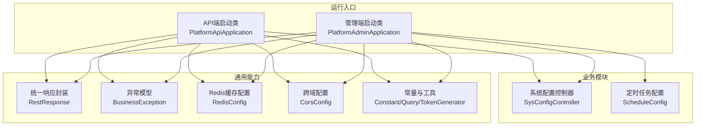
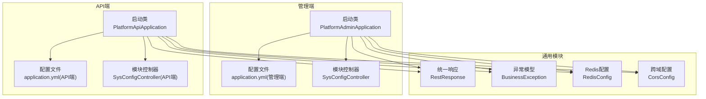
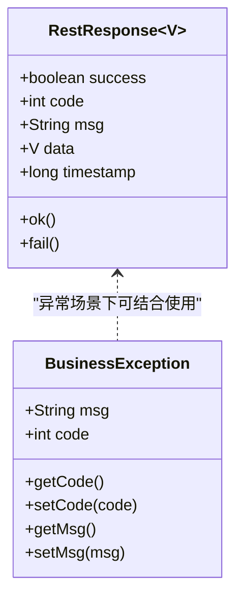
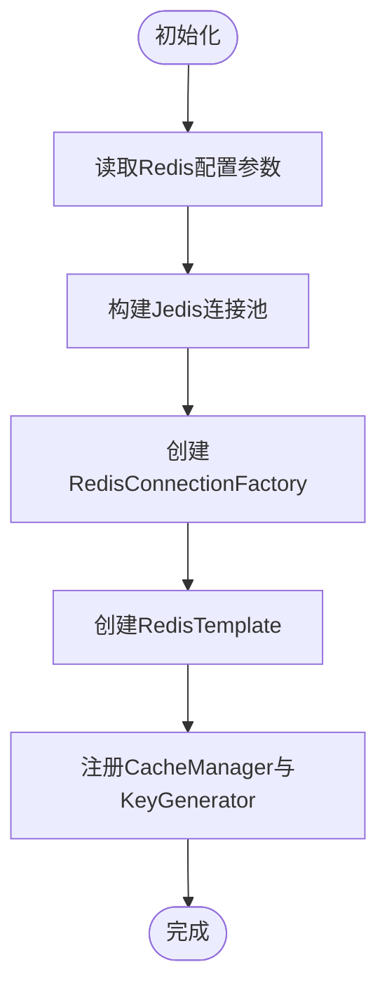
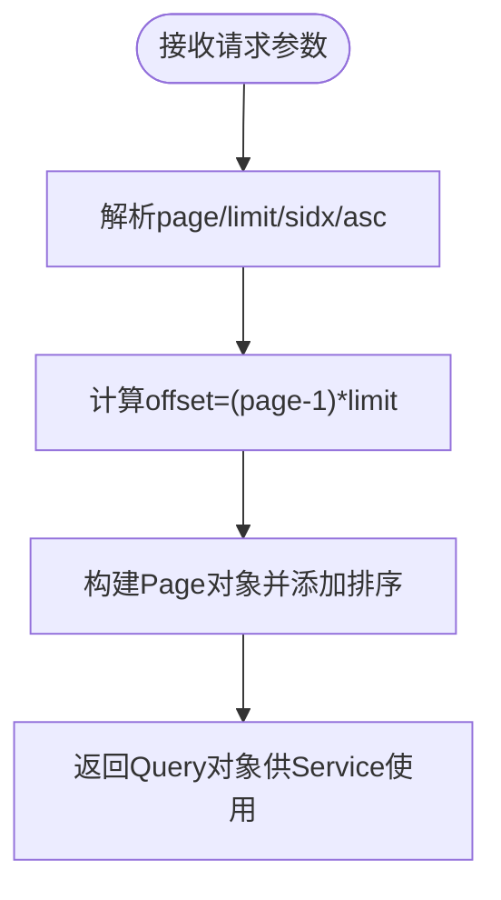
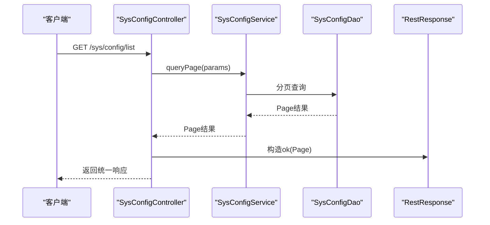
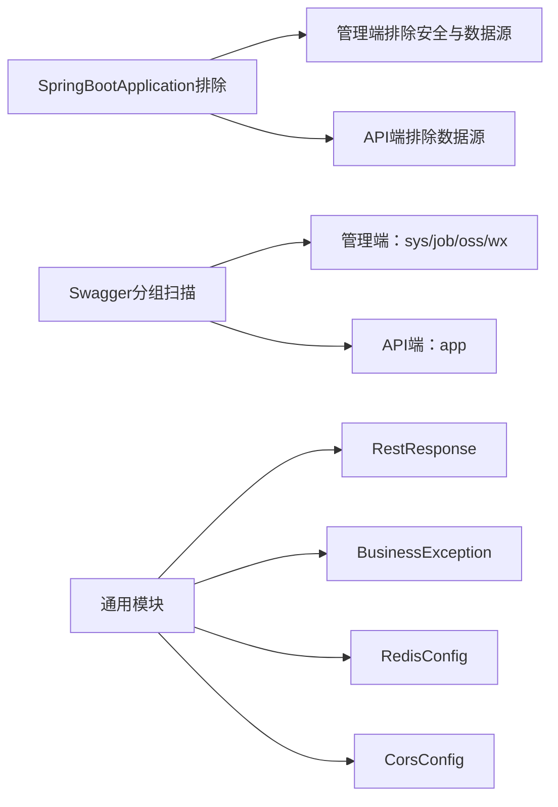

# 扩展开发

<cite>
**本文引用的文件**   
- [PlatformAdminApplication.java](file://platform-admin/src/main/java/com/platform/PlatformAdminApplication.java)
- [PlatformApiApplication.java](file://platform-api/src/main/java/com/platform/PlatformApiApplication.java)
- [application.yml（管理端）](file://platform-admin/src/main/resources/application.yml)
- [application.yml（API端）](file://platform-api/src/main/resources/application.yml)
- [RestResponse.java](file://platform-common/src/main/java/com/platform/common/utils/RestResponse.java)
- [BusinessException.java](file://platform-common/src/main/java/com/platform/common/exception/BusinessException.java)
- [RedisConfig.java](file://platform-common/src/main/java/com/platform/config/RedisConfig.java)
- [CorsConfig.java](file://platform-common/src/main/java/com/platform/config/CorsConfig.java)
- [Constant.java](file://platform-common/src/main/java/com/platform/common/utils/Constant.java)
- [Query.java](file://platform-common/src/main/java/com/platform/common/utils/Query.java)
- [TokenGenerator.java](file://platform-common/src/main/java/com/platform/common/utils/TokenGenerator.java)
- [SysConfigController.java](file://platform-admin/src/main/java/com/platform/modules/sys/controller/SysConfigController.java)
- [ScheduleConfig.java](file://platform-admin/src/main/java/com/platform/modules/job/config/ScheduleConfig.java)
- [SysConfigController（API端）](file://platform-api/src/main/java/com/platform/modules/app/controller/SysConfigController.java)
</cite>

## 目录
1. [引言](#引言)
2. [项目结构](#项目结构)
3. [核心组件](#核心组件)
4. [架构总览](#架构总览)
5. [详细组件分析](#详细组件分析)
6. [依赖分析](#依赖分析)
7. [性能考虑](#性能考虑)
8. [故障排查指南](#故障排查指南)
9. [结论](#结论)
10. [附录](#附录)

## 引言
本指导文档面向平台扩展开发者，围绕功能扩展与定制化开发提供系统性技术支撑。内容涵盖新增业务模块的开发流程、模块设计原则、代码组织方式、接口定义规范与集成方法；第三方服务（支付、物流、短信等）的接入与配置；插件化扩展模式（架构设计、生命周期与动态加载思路）；API扩展策略（接口设计、版本管理、向后兼容与安全）；性能优化（数据库、缓存、异步与负载均衡）；最佳实践、代码复用与质量保障。

## 项目结构
平台采用多模块分层架构，分为“管理端”“API端”“通用模块”“业务模块”等层次，配合统一的响应封装、异常体系、缓存与跨域配置，形成可扩展、可维护的工程骨架。

图表来源
- [PlatformAdminApplication.java:49-51](file://platform-admin/src/main/java/com/platform/PlatformAdminApplication.java#L49-L51)
- [PlatformApiApplication.java:49-50](file://platform-api/src/main/java/com/platform/PlatformApiApplication.java#L49-L50)
- [RestResponse.java:34-121](file://platform-common/src/main/java/com/platform/common/utils/RestResponse.java#L34-L121)
- [BusinessException.java:28-73](file://platform-common/src/main/java/com/platform/common/exception/BusinessException.java#L28-L73)
- [RedisConfig.java:56-181](file://platform-common/src/main/java/com/platform/config/RedisConfig.java#L56-L181)
- [CorsConfig.java:35-62](file://platform-common/src/main/java/com/platform/config/CorsConfig.java#L35-L62)
- [Constant.java:26-239](file://platform-common/src/main/java/com/platform/common/utils/Constant.java#L26-L239)
- [Query.java:32-98](file://platform-common/src/main/java/com/platform/common/utils/Query.java#L32-L98)
- [TokenGenerator.java:31-62](file://platform-common/src/main/java/com/platform/common/utils/TokenGenerator.java#L31-L62)
- [SysConfigController.java:42-176](file://platform-admin/src/main/java/com/platform/modules/sys/controller/SysConfigController.java#L42-L176)
- [ScheduleConfig.java](file://platform-admin/src/main/java/com/platform/modules/job/config/ScheduleConfig.java)

章节来源
- [PlatformAdminApplication.java:49-51](file://platform-admin/src/main/java/com/platform/PlatformAdminApplication.java#L49-L51)
- [PlatformApiApplication.java:49-50](file://platform-api/src/main/java/com/platform/PlatformApiApplication.java#L49-L50)
- [application.yml（管理端）:1-205](file://platform-admin/src/main/resources/application.yml#L1-L205)
- [application.yml（API端）:1-195](file://platform-api/src/main/resources/application.yml#L1-L195)

## 核心组件
- 统一响应封装：提供标准的响应结构与便捷构造方法，确保前后端交互一致性。
- 异常模型：自定义业务异常，统一错误码与消息，便于前端与监控系统识别。
- 缓存与跨域：集中式Redis配置与跨域过滤器，支撑扩展模块的缓存与跨域需求。
- 工具与常量：分页查询、令牌生成、系统常量等，降低重复实现成本。
- 控制器与模块：以系统配置为例，展示标准的CRUD接口与权限控制模式，可作为新增模块的模板。

章节来源
- [RestResponse.java:34-121](file://platform-common/src/main/java/com/platform/common/utils/RestResponse.java#L34-L121)
- [BusinessException.java:28-73](file://platform-common/src/main/java/com/platform/common/exception/BusinessException.java#L28-L73)
- [RedisConfig.java:56-181](file://platform-common/src/main/java/com/platform/config/RedisConfig.java#L56-L181)
- [CorsConfig.java:35-62](file://platform-common/src/main/java/com/platform/config/CorsConfig.java#L35-L62)
- [Constant.java:26-239](file://platform-common/src/main/java/com/platform/common/utils/Constant.java#L26-L239)
- [Query.java:32-98](file://platform-common/src/main/java/com/platform/common/utils/Query.java#L32-L98)
- [TokenGenerator.java:31-62](file://platform-common/src/main/java/com/platform/common/utils/TokenGenerator.java#L31-L62)
- [SysConfigController.java:42-176](file://platform-admin/src/main/java/com/platform/modules/sys/controller/SysConfigController.java#L42-L176)

## 架构总览
平台由两个独立的Spring Boot应用组成：管理端与API端，分别提供后台管理与移动端/小程序接口能力。两者共享通用模块，统一响应、异常、缓存与跨域配置，通过不同的上下文路径与文档分组对外暴露。

图表来源
- [PlatformAdminApplication.java:49-51](file://platform-admin/src/main/java/com/platform/PlatformAdminApplication.java#L49-L51)
- [PlatformApiApplication.java:49-50](file://platform-api/src/main/java/com/platform/PlatformApiApplication.java#L49-L50)
- [application.yml（管理端）:1-205](file://platform-admin/src/main/resources/application.yml#L1-L205)
- [application.yml（API端）:1-195](file://platform-api/src/main/resources/application.yml#L1-L195)
- [SysConfigController.java:42-176](file://platform-admin/src/main/java/com/platform/modules/sys/controller/SysConfigController.java#L42-L176)
- [SysConfigController（API端）](file://platform-api/src/main/java/com/platform/modules/app/controller/SysConfigController.java)

## 详细组件分析

### 统一响应与异常体系
- 统一响应：封装success/code/msg/data/timestamp，提供ok/fail系列静态工厂方法，简化控制器返回。
- 异常模型：继承RuntimeException，支持自定义code与message，便于上层捕获与统一处理。

图表来源
- [RestResponse.java:34-121](file://platform-common/src/main/java/com/platform/common/utils/RestResponse.java#L34-L121)
- [BusinessException.java:28-73](file://platform-common/src/main/java/com/platform/common/exception/BusinessException.java#L28-L73)

章节来源
- [RestResponse.java:34-121](file://platform-common/src/main/java/com/platform/common/utils/RestResponse.java#L34-L121)
- [BusinessException.java:28-73](file://platform-common/src/main/java/com/platform/common/exception/BusinessException.java#L28-L73)

### 缓存与跨域配置
- Redis配置：集中定义CacheManager、KeyGenerator、RedisTemplate序列化策略与连接工厂，支持单机模式与连接池参数。
- 跨域配置：全局CorsFilter，允许任意来源、头与方法，并设置缓存有效期。

图表来源
- [RedisConfig.java:56-181](file://platform-common/src/main/java/com/platform/config/RedisConfig.java#L56-L181)

章节来源
- [RedisConfig.java:56-181](file://platform-common/src/main/java/com/platform/config/RedisConfig.java#L56-L181)
- [CorsConfig.java:35-62](file://platform-common/src/main/java/com/platform/config/CorsConfig.java#L35-L62)

### 分页查询与令牌生成
- 分页查询：Query封装page/limit/sidx/asc等参数，自动计算offset并注入Page对象，支持排序。
- 令牌生成：基于MD5的TokenGenerator，提供UUID基础与固定算法的生成策略。

图表来源
- [Query.java:32-98](file://platform-common/src/main/java/com/platform/common/utils/Query.java#L32-L98)

章节来源
- [Query.java:32-98](file://platform-common/src/main/java/com/platform/common/utils/Query.java#L32-L98)
- [TokenGenerator.java:31-62](file://platform-common/src/main/java/com/platform/common/utils/TokenGenerator.java#L31-L62)

### 新增业务模块开发流程（以系统配置为例）
- 模块设计原则：遵循“控制器-服务-持久层”三层结构；使用统一响应与异常；按需引入缓存与权限注解。
- 代码组织方式：控制器位于modules/*/controller，服务位于service与impl包，DAO位于dao，XML映射位于resources/mapper。
- 接口定义规范：使用Swagger注解标注接口分组与描述；控制器返回RestResponse；对敏感参数进行校验。
- 集成方法：在启动类所在包下扫描组件；在application.yml中配置模块相关参数；如需定时任务，参考ScheduleConfig。

图表来源
- [SysConfigController.java:42-176](file://platform-admin/src/main/java/com/platform/modules/sys/controller/SysConfigController.java#L42-L176)
- [application.yml（管理端）:32-53](file://platform-admin/src/main/resources/application.yml#L32-L53)

章节来源
- [SysConfigController.java:42-176](file://platform-admin/src/main/java/com/platform/modules/sys/controller/SysConfigController.java#L42-L176)
- [application.yml（管理端）:32-53](file://platform-admin/src/main/resources/application.yml#L32-L53)

### 第三方服务集成指南
- 支付服务（支付宝/微信）：在application.yml中配置appId、rsaPublicKey、merchantPrivateKey、alipayPublicKey、gatewayHost、protocol、baseNotifyUrl、mchId、mchKey、keyPath等；回调地址指向对应端的context-path。
- 短信服务：通过Constant中定义的短信配置KEY与缓存前缀，将短信配置写入系统配置表，扩展时读取配置并调用对应SDK。
- 物流服务：建议抽象物流适配器接口，按需实现不同平台适配器，统一通过系统配置管理开关与凭证。

章节来源
- [application.yml（管理端）:143-205](file://platform-admin/src/main/resources/application.yml#L143-L205)
- [application.yml（API端）:132-195](file://platform-api/src/main/resources/application.yml#L132-L195)
- [Constant.java:54-61](file://platform-common/src/main/java/com/platform/common/utils/Constant.java#L54-L61)

### 插件开发模式（架构设计、生命周期与动态加载）
- 架构设计：将可插拔能力抽象为SPI接口与默认实现，通过配置中心或系统配置启用/禁用插件。
- 生命周期：插件具备初始化、运行、卸载阶段，可在启动类或配置类中注册；异常与资源释放需纳入生命周期钩子。
- 动态加载：结合Spring的条件装配与@Conditional注解，按配置动态加载插件Bean；缓存与跨域等通用能力对插件透明可用。

（本节为概念性说明，不直接分析具体源码）

### API扩展策略（设计、版本、兼容与安全）
- 设计原则：接口语义明确、幂等优先、参数最小化；使用RestResponse统一返回；对敏感接口增加鉴权与限流。
- 版本管理：通过URL路径或Header区分版本；保留旧版本接口一段时间，逐步迁移。
- 向后兼容：新增字段使用可选；变更字段保持默认值；弃用字段在文档中标注。
- 安全考虑：启用跨域白名单、参数校验、防注入过滤、HTTPS与强密码策略；对支付回调进行签名校验与去重。

章节来源
- [CorsConfig.java:35-62](file://platform-common/src/main/java/com/platform/config/CorsConfig.java#L35-L62)
- [RestResponse.java:34-121](file://platform-common/src/main/java/com/platform/common/utils/RestResponse.java#L34-L121)

## 依赖分析
- 启动类排除：管理端排除安全与数据源自动配置，API端排除数据源自动配置，便于按需启用。
- 配置扫描：管理端与API端分别配置Swagger分组与扫描包，避免接口冲突。
- 通用依赖：统一响应、异常、Redis、跨域在两应用中共享，减少重复配置。

图表来源
- [PlatformAdminApplication.java:49-51](file://platform-admin/src/main/java/com/platform/PlatformAdminApplication.java#L49-L51)
- [PlatformApiApplication.java:49-50](file://platform-api/src/main/java/com/platform/PlatformApiApplication.java#L49-L50)
- [application.yml（管理端）:32-53](file://platform-admin/src/main/resources/application.yml#L32-L53)
- [application.yml（API端）:22-43](file://platform-api/src/main/resources/application.yml#L22-L43)

章节来源
- [PlatformAdminApplication.java:49-51](file://platform-admin/src/main/java/com/platform/PlatformAdminApplication.java#L49-L51)
- [PlatformApiApplication.java:49-50](file://platform-api/src/main/java/com/platform/PlatformApiApplication.java#L49-L50)
- [application.yml（管理端）:32-53](file://platform-admin/src/main/resources/application.yml#L32-L53)
- [application.yml（API端）:22-43](file://platform-api/src/main/resources/application.yml#L22-L43)

## 性能考虑
- 数据库优化：合理索引、分页查询、批量操作、读写分离；MyBatis Plus配置驼峰映射与逻辑删除。
- 缓存策略：使用RedisConfig提供的CacheManager与KeyGenerator，针对热点数据设置TTL；避免缓存穿透与雪崩。
- 异步处理：启用@EnableAsync，对耗时操作异步化；结合队列或事件总线实现削峰。
- 负载均衡：前后端分离部署，Nginx反向代理；多实例横向扩展，共享Redis与数据库。

章节来源
- [application.yml（管理端）:113-142](file://platform-admin/src/main/resources/application.yml#L113-L142)
- [application.yml（API端）:96-122](file://platform-api/src/main/resources/application.yml#L96-L122)
- [RedisConfig.java:56-181](file://platform-common/src/main/java/com/platform/config/RedisConfig.java#L56-L181)

## 故障排查指南
- 启动日志：启动类在run中输出API地址与文档地址，便于快速定位服务。
- 统一异常：业务异常抛出BusinessException，便于前端与监控识别；必要时记录traceId。
- 参数校验：控制器中使用校验工具，避免脏数据进入服务层。
- 缓存问题：检查Redis连接参数与池配置；确认KeyGenerator生成的键符合预期。

章节来源
- [PlatformAdminApplication.java:79-90](file://platform-admin/src/main/java/com/platform/PlatformAdminApplication.java#L79-L90)
- [PlatformApiApplication.java:79-90](file://platform-api/src/main/java/com/platform/PlatformApiApplication.java#L79-L90)
- [BusinessException.java:28-73](file://platform-common/src/main/java/com/platform/common/exception/BusinessException.java#L28-L73)
- [SysConfigController.java:105-109](file://platform-admin/src/main/java/com/platform/modules/sys/controller/SysConfigController.java#L105-L109)
- [RedisConfig.java:154-180](file://platform-common/src/main/java/com/platform/config/RedisConfig.java#L154-L180)

## 结论
平台提供了完善的扩展基础设施：统一响应、异常、缓存与跨域配置，清晰的模块化结构与标准化的控制器模板。开发者可据此快速新增业务模块、接入第三方服务、设计插件化扩展与制定API演进策略，并通过数据库、缓存、异步与负载均衡等手段持续优化性能与稳定性。

## 附录
- 开发约定
  - 控制器：使用@RestController与Swagger注解；返回RestResponse；参数校验前置。
  - 服务：事务与异常边界清晰；尽量无状态；必要时使用缓存。
  - 配置：敏感信息放入系统配置表或环境变量；避免硬编码。
- 测试与发布
  - 单元测试覆盖核心业务；集成测试验证第三方对接；灰度发布与回滚预案。